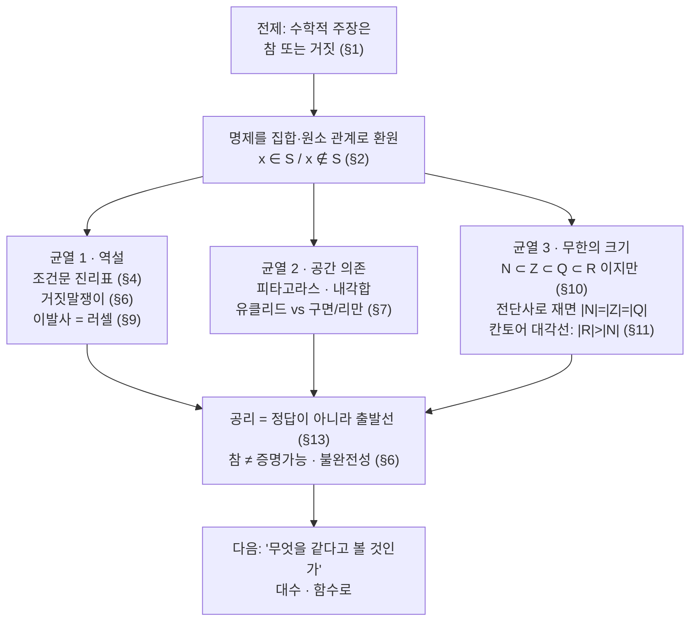

# 수학의 한계점 (3기 정규1)

오늘은 우리가 수학을 시작할 때 거의 자동으로 믿는 문장을 의심합니다.
"수학적 주장은 맞거나 틀린다."
이 말은 중고등학교 수학에서는 너무 자연스럽게 보입니다.
문제에는 답이 있고, 풀이에는 채점 기준이 있고, 명제는 참 또는 거짓으로 분류됩니다.
그런데 이 전제가 정말 수학 전체에서 흔들리지 않는지 묻는 순간, 집합·명제·공리·무한이 한꺼번에 등장합니다.

출발점은 집합입니다.
어떤 말이 참인지 거짓인지 판단한다는 일을, 어떤 원소가 어떤 집합에 들어가는지 아닌지의 판단으로 바꿔 보려 합니다.
하지만 그 단순한 환원은 곧 조건문, 역설, 유클리드 기하와 비유클리드 기하, 그리고 자연수·정수·유리수의 크기 문제에서 한계를 드러냅니다.
이 시간의 목표는 정답을 하나 더 외우는 것이 아니라, "어떤 전제 위에서만 이 말이 맞는가"를 보는 감각을 얻는 것입니다.

---

## [1. 수학적 주장은 정말 참 또는 거짓인가 · ▶ 30:07](https://www.youtube.com/watch?v=M4x7CCW8wHc&t=1807s)

처음 꺼낸 전제는 아주 익숙합니다.
수학의 명제는 참이거나 거짓입니다.
예전 교과서에서 집합이 첫 단원에 놓였던 것도 이 감각과 연결됩니다.
"이 대상이 저 집합에 들어가는가?"
이 질문은 참과 거짓을 가르는 가장 단순한 모양처럼 보입니다.

그런데 바로 여기서 오늘의 균열이 시작됩니다.
수학적으로 충분히 강한 공리계에서는, 어떤 문장이 참인지 거짓인지 알고 싶어도 그 체계 안에서 증명도 반증도 할 수 없는 경우가 생깁니다.
그러면 "명제는 참 또는 거짓"이라는 말과 "우리가 그것을 증명할 수 있다"는 말은 같은 말이 아닙니다.

이 구분은 뒤에서 계속 돌아옵니다.
참/거짓의 이분법은 수학을 출발시키는 강력한 언어이지만, 수학 전체를 끝까지 설명하는 만능 열쇠는 아닙니다.

## [2. 명제를 집합과 원소의 관계로 바꾸기 · ▶ 33:33](https://www.youtube.com/watch?v=M4x7CCW8wHc&t=2013s)

"강아지는 고양이가 아니다"라는 문장을 생각합니다.
이 문장을 수학적으로 바꾸면, 강아지라는 대상이 고양이들의 집합에 들어가지 않는다는 말이 됩니다.
기호로는 $x \notin S$처럼 적을 수 있습니다. → 전사본 참조

참여자는 여기서 중요한 질문을 던집니다.
"이건 수학적 문장인가요, 그냥 일상 문장인가요?"
답은 명제의 관점에서 보면, 참 또는 거짓을 말할 수 있는 문장은 일단 진리값을 가진 문장으로 다룰 수 있다는 것입니다.
다만 그것을 수학적으로 다루려면, 무엇을 원소로 보고 무엇을 집합으로 볼지 정해야 합니다.

예를 들어 "고양이"라는 말은 동물 개체들의 집합일 수도 있고, 고양이다움을 가진 성질의 이름일 수도 있습니다.
"강아지"도 특정한 개 한 마리일 수도 있고, 강아지들의 집합일 수도 있습니다.
이때 문장의 의미는 우리가 어떤 해석을 고르느냐에 따라 달라집니다.

그래서 집합의 언어는 일상 문장을 깔끔하게 수학으로 바꾸는 기계가 아닙니다.
오히려 수학은 "무엇을 대상으로 삼고, 어떤 조건에서 판단할 것인가"를 먼저 명시하라고 요구합니다.

## [3. '같다'는 말은 기준 없이는 위험하다 · ▶ 40:37](https://www.youtube.com/watch?v=M4x7CCW8wHc&t=2437s)

참여자의 질문은 자연스럽게 "같다"는 말로 이어집니다.
강아지와 고양이를 구분할 때도, 자연수와 정수를 구분할 때도, 우리는 무엇을 같은 것으로 보는지 기준을 세워야 합니다.

수학에서 "well-defined"라는 말이 나오는 이유도 여기에 있습니다.
어떤 표현이 잘 정의되었다는 것은, 우리가 선택한 규칙 안에서 같은 입력이 같은 결과를 주고, 말이 흔들리지 않는다는 뜻입니다.
하지만 그 규칙 자체는 맥락을 필요로 합니다.

자연수와 정수는 집합의 크기라는 기준에서는 같다고 말할 수 있습니다.
일대일 대응이 있기 때문입니다.
하지만 덧셈이나 뺄셈을 기준으로 보면 다릅니다.
정수에는 $a+(-a)=0$을 만드는 역원이 있지만, 자연수에는 보통 그런 역원이 없습니다.

여기서 "크기가 같다"는 말은 두 집합 사이에 전단사 함수가 있다는 말입니다.
예를 들어 자연수와 정수를 대응시키는 함수 하나를 만들 수 있으면, 우리는 두 집합의 원소를 빠짐없이 한 번씩 짝지을 수 있습니다.
하지만 그 함수가 덧셈이나 역원 같은 구조까지 보존한다는 뜻은 아닙니다.
그래서 전단사 함수는 크기를 비교하는 도구이고, 구조 보존 함수는 더 강한 같은-ness를 말하는 도구입니다.

따라서 "같다"는 말은 하나가 아닙니다.
집합으로 같은가, 크기로 같은가, 연산 구조로 같은가, 기하학적으로 같은가를 따로 물어야 합니다.

## [4. 조건문과 플레이스테이션 약속 · ▶ 42:33](https://www.youtube.com/watch?v=M4x7CCW8wHc&t=2553s)

조건문은 많은 참여자가 헷갈리는 지점입니다.
"100점을 받으면 플레이스테이션을 사 줄게"라는 약속을 생각합니다.
만약 100점을 받았고 플레이스테이션을 사 주지 않았다면, 약속은 깨졌습니다.
하지만 100점을 받지 않았다면 어떻게 될까요?

고전 논리의 진리표에서는 전제가 거짓인 조건문을 참으로 둡니다.
"100점을 받으면 사 준다"는 말은 100점을 받은 경우에만 검증됩니다.
100점을 받지 않은 경우에는 약속을 어긴 사례가 발생하지 않습니다.

참여자는 다시 묻습니다.
"그러면 '서울에 외계인이 있다면 1은 짝수다'도 참이고, '서울에 외계인이 있다면 1은 홀수다'도 참인가요?"
고전 논리의 조건문으로는 그렇습니다.
전제가 거짓이면 두 조건문 모두 참으로 처리됩니다.

여기서 중요한 점은, 이것이 일상적 추론의 자연스러운 느낌과 다를 수 있다는 것입니다.
수학의 조건문은 "전제에서 결론이 실제로 원인처럼 따라온다"는 뜻이 아니라, 진리표로 정의한 하나의 논리 연산입니다.
다른 논리 체계를 택할 수도 있지만, 지금 쓰는 수학의 많은 부분은 이 약속 위에서 움직입니다.

## [5. $1+1=2$가 컵 두 개에서 떠나는 순간 · ▶ 46:47](https://www.youtube.com/watch?v=M4x7CCW8wHc&t=2807s)

추상화의 예로 컵이 등장합니다.
컵 하나와 컵 하나가 있으면 컵 두 개가 됩니다.
이 경험에서 $1+1=2$라는 말을 뽑아낼 수 있습니다.

하지만 수학은 컵 자체를 연구하려는 것이 아닙니다.
사과 하나와 사과 하나, 사람 한 명과 사람 한 명, 점 하나와 점 하나에서도 반복되는 구조를 뽑아내려 합니다.
그 반복되는 부분을 남기고 구체적인 사물을 지우는 일이 추상화입니다.

그래서 $1+1=2$는 컵에 관한 문장이면서 동시에 컵을 떠난 문장입니다.
그 추상화 덕분에 한 예시에서 얻은 생각을 다른 예시에 옮겨 쓸 수 있습니다.
하지만 반대로, 무엇을 지웠고 무엇을 남겼는지 모르면 추상화는 공허한 기호가 됩니다.

이 시간의 집합 이야기도 마찬가지입니다.
집합은 일상의 사물들을 한곳에 모아 보는 단순한 그림에서 출발하지만, 곧 "모은다는 말 자체가 어디까지 허용되는가"라는 추상적 문제로 바뀝니다.

## [6. 거짓말쟁이 문장과 증명 불가능한 참 · ▶ 49:42](https://www.youtube.com/watch?v=M4x7CCW8wHc&t=2982s)

"이 문장은 거짓이다."
이 문장이 참이면, 문장 내용대로 거짓이어야 합니다.
거짓이면, 문장 내용과 반대로 참이어야 합니다.
참과 거짓을 깔끔하게 나누려던 시도는 여기서 바로 꼬입니다.

거짓말쟁이 역설은 모든 문장을 단순히 집합과 원소의 관계로 환원하려는 욕망에 제동을 겁니다.
문장이 자기 자신을 가리키기 시작하면, 참/거짓의 표가 안정적으로 돌아가지 않습니다.

여기서 불완전성 정리의 감각도 함께 나옵니다.
자연수를 충분히 다룰 수 있는 공리계에서는, 참인지 거짓인지의 문제와 그 체계 안에서 증명 가능한지의 문제가 갈라집니다.
어떤 문장은 참일 수 있지만 그 공리계 안에서는 증명되지 않을 수 있습니다.
또 반대로, 어떤 문장이 거짓임을 그 체계 안에서 보일 수도 없을 수 있습니다.

그러므로 "수학은 모든 것을 완벽하게 증명하는 체계"라는 이미지는 정확하지 않습니다.
수학은 오히려 어떤 공리를 받아들이고, 그 안에서 무엇을 말할 수 있는지 끝까지 추적하는 활동입니다.

## [7. 피타고라스 정리는 어떤 공간의 이야기인가 · ▶ 53:22](https://www.youtube.com/watch?v=M4x7CCW8wHc&t=3202s)

피타고라스 정리와 삼각형의 내각의 합은 180도라는 말은 너무 익숙합니다.
하지만 이 익숙함은 평면 유클리드 기하 위에서 성립합니다.
우리가 칠판이나 종이 위에 삼각형을 그릴 때 암묵적으로 쓰는 공간입니다.

구면 위에 삼각형을 그리면 이야기가 달라집니다.
지구 표면에서 북극과 적도 위의 두 점을 잇는 삼각형을 생각하면, 내각의 합이 180도를 넘을 수 있습니다.
그러면 "삼각형의 내각의 합은 180도"라는 문장은 절대적 진리가 아니라, 특정 공간에 대한 명제입니다.

리만 기하의 이름이 나오는 이유가 여기에 있습니다.
기하학은 더 이상 유클리드 평면 하나만을 전제로 하지 않습니다.
어떤 공간을 택하느냐에 따라 거리, 직선, 각도, 곡률이 달라지고, 그 위에서 참인 명제도 달라집니다.

통계에서도 나중에 비슷한 일이 생깁니다.
확률분포들의 공간을 유클리드 공간처럼 보면 놓치는 구조가 있고, 다른 기하를 써야 자연스러워지는 경우가 있습니다.
오늘의 집합·공리 이야기는 훗날 "어떤 공간 위에서 생각하는가"라는 질문으로 이어집니다.

## [8. 원소와 집합은 닭과 달걀처럼 얽혀 있다 · ▶ 1:01:58](https://www.youtube.com/watch?v=M4x7CCW8wHc&t=3718s)

집합을 설명하려면 원소가 필요합니다.
그런데 원소를 설명하려면 다시 어떤 집합 안의 대상으로 말하게 됩니다.
원소와 집합은 한쪽이 다른 한쪽보다 완전히 먼저 정의되는 관계가 아닙니다.

그래서 집합론은 직관적으로는 "모아 놓은 것"이라고 말하지만, 엄밀하게는 공리로 다룹니다.
어떤 것을 집합으로 인정하고, 어떤 조작을 허용할지 약속합니다.
이 약속 없이 "모든 집합들의 집합" 같은 말을 마음대로 허용하면 문제가 생깁니다.

모든 집합을 한꺼번에 담는 대상은 보통 집합이 아니라 클래스의 언어로 다룹니다.
왜냐하면 모든 것을 다 담는 집합을 허용하면, 그 집합 자신이 다시 자기 안에 들어가는지 묻는 식의 자기참조 문제가 생기기 때문입니다.

여기서 집합론은 단순한 모으기 놀이가 아닙니다.
무한과 자기참조를 다루기 위해 어디까지 허용할지 매우 조심스럽게 정한 언어입니다.

## [9. 이발사 역설: 자기 자신을 면도하는가 · ▶ 1:06:45](https://www.youtube.com/watch?v=M4x7CCW8wHc&t=4005s)

이발사 역설은 러셀의 역설을 일상적 비유로 보여 줍니다.
어떤 마을에 "자기 자신을 면도하지 않는 사람들만 면도해 주는 이발사"가 있다고 합시다.
그 이발사는 자기 자신을 면도할까요?

면도한다고 하면, 그는 자기 자신을 면도하는 사람이므로 이발사의 규칙상 면도 대상이 아닙니다.
면도하지 않는다고 하면, 자기 자신을 면도하지 않는 사람이므로 이발사의 규칙상 그가 면도해 주어야 합니다.
어느 쪽을 택해도 모순이 생깁니다.

이 예시는 "조건을 만족하는 모든 것을 모으면 집합이 된다"는 순진한 생각이 위험하다는 것을 보여 줍니다.
집합은 마음대로 정의할 수 있는 것처럼 보이지만, 실제로는 어떤 정의가 허용되는지 따로 관리해야 합니다.

이때 공리는 수학의 임의적 취향이 아니라, 이런 모순을 피하면서도 충분히 많은 수학을 할 수 있게 해 주는 울타리입니다.
하지만 그 울타리가 하나만 가능한 것은 아닙니다.
어떤 공리를 받아들이느냐에 따라 가능한 수학의 풍경이 달라집니다.

## [10. $N \subset Z \subset Q \subset R$ 그림이 숨기는 것 · ▶ 1:13:24](https://www.youtube.com/watch?v=M4x7CCW8wHc&t=4404s)

우리는 자연수, 정수, 유리수, 실수를 포함 관계로 자주 그립니다.
$\mathbb{N} \subset \mathbb{Z} \subset \mathbb{Q} \subset \mathbb{R}$라는 그림은 개념적으로는 유용합니다. → 전사본 참조
자연수는 정수 안에 있고, 정수는 유리수 안에 있고, 유리수는 실수 안에 있습니다.

하지만 이 그림은 크기에 대한 잘못된 직관을 함께 줄 수 있습니다.
유한 집합에서는 부분집합이 전체보다 작습니다.
그래서 자연수가 정수 안에 들어가면 자연수가 정수보다 작아 보입니다.

무한에서는 이 직관이 깨집니다.
자연수와 정수 사이에는 일대일 대응이 있습니다.
자연수와 유리수 사이에도 일대일 대응이 있습니다.
집합의 크기, 즉 cardinality의 관점에서는 $\mathbb{N}$, $\mathbb{Z}$, $\mathbb{Q}$가 모두 같습니다.

참여자가 "포함 관계가 크기를 결정하는 것은 아니지 않나요?"라고 묻는 지점을 보겠습니다.
맞습니다.
포함 관계는 구조적 포함을 말하지만, 무한 집합의 크기 비교는 일대일 대응이라는 별도 기준으로 해야 합니다.

## [11. 무한을 세는 법과 실수의 낯섦 · ▶ 1:19:20](https://www.youtube.com/watch?v=M4x7CCW8wHc&t=4760s)

자연수와 정수의 일대일 대응은 비교적 눈에 보입니다.
예를 들어 짝수 자리에는 $0,1,2,3,\dots$를 보내고, 홀수 자리에는 $-1,-2,-3,\dots$를 보내는 식으로 정수를 줄 세울 수 있습니다.
그러면 모든 정수가 자연수 번호를 받습니다.

유리수도 더 복잡하지만 줄 세울 수 있습니다.
분자와 분모를 격자에 놓고 대각선 방향으로 훑어 가면, 중복을 제거하면서 모든 유리수를 나열할 수 있습니다.
그래서 유리수도 가산 무한입니다.

실수는 다릅니다.
칸토어의 대각선 논법은 실수 전체를 자연수처럼 번호 매기는 것이 불가능하다는 것을 보여 줍니다.
실수를 한 줄로 세웠다고 가정한 뒤, 첫째 줄의 첫째 자리, 둘째 줄의 둘째 자리, …를 따라가며 그 자리 숫자를 매번 다르게 바꾼 새 실수를 만들면, 그 수는 어느 줄과도 그 자리에서 다르므로 목록에 없습니다.

자연수·정수·유리수가 모두 같은 크기라는 사실만으로도 이상한데, 실수는 다시 그보다 큰 무한입니다.

이 지점에서 "무한은 하나가 아니다"라는 감각이 생깁니다.
무한이라는 말 하나로 뭉뚱그리면 자연수와 실수의 차이가 사라지지만, 일대일 대응이라는 기준을 세우면 전혀 다른 층위가 보입니다.

## [12. 심리와 사회도 수학이 되는가 · ▶ 1:23:35](https://www.youtube.com/watch?v=M4x7CCW8wHc&t=5015s)

참여자는 수학이 심리적·사회적 대상에도 들어갈 수 있는지 묻습니다.
예를 들어 사람의 성향, 관계, 사회적 적합성 같은 것들을 수학으로 다룰 수 있느냐는 질문입니다.

답은 "숫자와 구조를 부여하는 순간 수학이 들어온다"에 가깝습니다.
어떤 성향을 점수로 만들고, 어떤 관계를 그래프로 만들고, 어떤 선호를 순서나 거리로 표현하면 수학적 대상이 생깁니다.
하지만 그 숫자나 구조가 실제 대상을 잘 반영하는지는 별도의 문제입니다.

수학은 한 번 숫자가 주어지면 그 숫자들 사이의 관계를 엄밀하게 다룰 수 있습니다.
그러나 처음에 무엇을 숫자로 삼을지, 어떤 거리를 의미 있는 거리로 볼지, 어떤 집합으로 사람들을 묶을지는 수학 바깥의 해석과 책임을 요구합니다.

그래서 수학의 힘은 "아무 대상이나 완전히 설명한다"가 아닙니다.
오히려 어떤 대상을 수학화할 때 어떤 가정을 했는지 드러내고, 그 가정 위에서만 결론이 성립한다는 사실을 분명하게 만드는 데 있습니다.

## [13. 공리는 정답이 아니라 출발선이다 · ▶ 1:29:07](https://www.youtube.com/watch?v=M4x7CCW8wHc&t=5347s)

오늘의 여러 예시는 모두 같은 방향을 가리킵니다.
명제의 참과 거짓, 조건문의 진리표, 집합의 허용 범위, 유클리드 기하의 평면, 무한의 크기 비교는 모두 어떤 출발선 위에서만 의미가 분명해집니다.

그 출발선이 공리입니다.
공리는 "왜 참인가"를 더 아래로 밀어붙였을 때 결국 받아들이기로 한 규칙입니다.
그렇다고 공리가 아무렇게나 정해지는 것은 아닙니다.
모순을 만들지 않으면서, 우리가 하고 싶은 수학을 충분히 가능하게 해야 합니다.

따라서 수학의 한계점은 수학이 약하다는 말이 아닙니다.
오히려 수학은 자신이 어디서 출발했는지 끝까지 드러내는 언어입니다.
이 전제를 숨기지 않는 태도가 수학의 힘입니다.

## 요약

이번 시간의 질문은 "수학적 주장은 언제 참 또는 거짓이라고 말할 수 있는가"였습니다.
명제를 집합과 원소의 관계로 환원하는 생각에서 출발했지만, 조건문·거짓말쟁이 역설·이발사 역설은 그 환원이 단순하지 않음을 보여 주었습니다.

피타고라스 정리와 삼각형 내각합의 예시는 참인 문장이 공간의 선택에 의존할 수 있음을 보여 주었습니다.
유클리드 평면에서는 자연스러운 명제가 구면이나 리만 기하에서는 달라질 수 있습니다.

자연수·정수·유리수·실수의 포함 관계는 집합의 크기와 구조를 구분하게 했습니다.
$\mathbb{N}$, $\mathbb{Z}$, $\mathbb{Q}$는 포함 관계로는 다르지만 cardinality로는 같고, $\mathbb{R}$은 다시 다른 크기의 무한을 가집니다.
이때 크기를 비교하는 장치는 전단사 함수이고, 연산 구조를 비교하는 장치는 연산을 보존하는 함수입니다.

결국 공리는 수학을 닫아 버리는 명령이 아니라, 우리가 어떤 세계에서 어떤 말을 하고 있는지 표시하는 출발선입니다.
앞으로의 대수와 함수 이야기는 이 출발선 위에서 "무엇을 같다고 볼 것인가"를 더 정교하게 묻는 방향으로 이어집니다.

오늘의 논리적 흐름을 한눈에 — "참 또는 거짓"이라는 전제가 어디서 갈라지고, 모두 어디로 모이는지:

