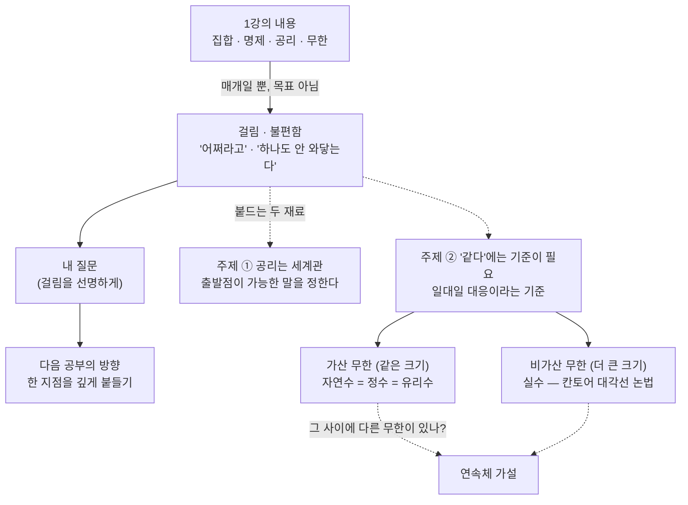

# 수학을 어떻게 공부해야 하는가 (3기 2강)

이번 시간은 집합론의 진도를 더 나가기보다, 직문수에서 수학을 대하는 방식을 조정하는 시간입니다.
1강에서 집합·명제·공리·무한이 한꺼번에 등장했기 때문에, 많은 참여자가 "무엇을 얼마나 알아야 하는가"를 묻게 되었습니다.
이 질문 자체가 오늘의 주제입니다.

수학을 공부한다는 일을 객관식 지식의 축적으로 보면, 1강은 불친절하고 부담스러운 내용입니다.
하지만 수학을 어떤 대상과 대화하는 일로 보면, 중요한 것은 많은 내용을 소화했는지가 아니라 어느 지점이 나에게 걸렸는지입니다.
그 걸림이 질문이 되고, 질문이 다음 공부의 방향을 만듭니다.

---

## [1. 수학은 객관 지식보다 생각의 만남이다 · ▶ 00:00](https://www.youtube.com/watch?v=DTvHbibzlpA&t=0s)

처음부터 강조한 것은 "수학을 지식으로만 받지 말라"는 점입니다.
수학에는 당연히 정리와 정의와 증명이 있습니다.
하지만 직문수에서 더 중요하게 보려는 것은, 여러분의 생각이 그 수학과 어디서 만나는가입니다.

1강의 집합·공리·무한은 이미 완성된 지식처럼 보일 수 있습니다.
그런 지식을 받아 적고 외우면 공부가 끝나는 것처럼 보입니다.
하지만 오늘은 그 반대로 말합니다.
그 내용이 내 생각을 어떻게 흔들었는지, 어디서 거부감이 생겼는지, 무엇이 하나도 와닿지 않았는지가 공부의 출발점입니다.

그래서 "나는 이 내용을 이해했는가"보다 먼저 "나는 이 내용 앞에서 어떤 생각을 했는가"를 물어야 합니다.
그 생각이 거칠고 정리되지 않아도 괜찮습니다.
그 거친 반응이 없으면 수학은 남의 문장으로만 남습니다.

## [2. 한 페이지 증명과 3주짜리 풀이의 차이 · ▶ 02:58](https://www.youtube.com/watch?v=DTvHbibzlpA&t=178s)

수학의 깊이는 분량으로 측정되지 않습니다.
어떤 증명은 한 페이지에 끝나지만, 그 한 페이지를 얻기 위해 3주를 헤맬 수 있습니다.
반대로 긴 풀이가 반드시 깊은 생각을 담고 있는 것도 아닙니다.

문제는 페이지 수가 아니라, 그 과정에서 어떤 개념이 생겼고 어떤 질문이 정리되었는가입니다.
짧은 증명 하나가 수학 전체의 관점을 바꿀 수도 있고, 긴 계산이 아무 관점도 남기지 못할 수도 있습니다.

이 말은 앞으로 노트를 읽는 방식에도 연결됩니다.
많은 내용을 커버했다는 느낌보다, 한 문장이나 한 예시가 정말로 내 안에서 작동했는지를 보아야 합니다.
집합의 크기, 공리, 무한 같은 말도 "정의는 이렇다"에서 멈추면 얕습니다.
"왜 이런 정의를 택했을까"까지 가야 생각이 시작됩니다.

## [3. '내 점수는요'가 아니라 내 질문이 주인공이다 · ▶ 04:42](https://www.youtube.com/watch?v=DTvHbibzlpA&t=282s)

공부를 평가받는 방식에 익숙하면, 질문도 점수처럼 느껴집니다.
"내 생각이 맞나요?"
"이 정도면 충분한가요?"
"어디까지 읽어야 하나요?"

하지만 오늘의 기준은 다릅니다.
완성된 지식을 얼마나 맞게 재현했는지가 아니라, 내가 어떤 관점을 갖고 수학을 붙잡는지를 물어야 합니다.
멘토와 피드백은 그 생각을 채점하기보다, 더 선명한 질문으로 다듬는 역할을 합니다.

따라서 참여자의 글이 논문처럼 완성될 필요는 없습니다.
오히려 "여기서 하나도 와닿지 않는다", "이게 왜 필요한지 모르겠다", "나는 이런 예시가 떠오른다" 같은 문장이 더 좋은 출발점일 수 있습니다.
그 문장 안에 이미 개인적인 수학 공부의 방향이 들어 있기 때문입니다.

## [4. 내용은 매개이고, 남는 것은 내 생각이다 · ▶ 06:39](https://www.youtube.com/watch?v=DTvHbibzlpA&t=399s)

집합론, 공리, 무한은 오늘 대화의 내용입니다.
하지만 그 내용 자체가 최종 목표는 아닙니다.
내용은 여러분의 생각을 끌어내는 매개입니다.

예를 들어 "자연수와 정수의 크기가 같다"는 말을 들었을 때, 누군가는 신기하다고 느끼고 누군가는 불편하다고 느낍니다.
누군가는 "그래서 내 일과 무슨 상관인가"를 묻습니다.
그 반응들이 모두 공부의 일부입니다.

수학 공부는 이미 있는 지식을 내 머리에 넣는 과정만이 아닙니다.
내가 어떤 대상 앞에서 어떤 질문을 가질 수 있는 사람이 되는 과정입니다.
그래서 나중에 세부 정의를 잊더라도, 어떤 지점에서 세계가 낯설게 보였는지는 남아야 합니다.

## [5. '그것이 알고 싶다'를 직접 만들어야 한다 · ▶ 09:57](https://www.youtube.com/watch?v=DTvHbibzlpA&t=597s)

비유로 방송 프로그램 이야기가 나옵니다.
완성된 명작을 비평하는 사람으로 서는 것이 아니라, 내가 직접 "그것이 알고 싶다"를 만들어야 한다는 말입니다.
이미 잘 만든 프로그램을 보고 "좋다/별로다"라고 평가하는 것과, 내가 어떤 사건을 붙잡고 질문을 구성하는 것은 전혀 다릅니다.

수학에서도 마찬가지입니다.
이미 만들어진 정리와 이론 앞에서 "대단하다"라고 감상만 하면, 수학은 계속 남의 작품입니다.
내가 궁금한 사건을 잡아야 합니다.
그 사건은 거창하지 않아도 됩니다.
"왜 거짓 전제의 조건문이 참인가?"
"왜 자연수와 정수의 크기가 같다고 하나?"
"왜 공리를 마음대로 바꾸면 안 되나?"

이런 질문은 처음에는 조잡할 수 있습니다.
하지만 조잡한 내 질문이 없는 상태에서 완성된 지식을 많이 읽으면, 지식이 오히려 내 생각을 눌러 버립니다.

## [6. 두 주제: 공리의 세계관과 '같다'의 기준 · ▶ 16:16](https://www.youtube.com/watch?v=DTvHbibzlpA&t=976s)

오늘 다시 잡은 1강의 두 주제는 명확합니다.
첫째, 공리는 세계관입니다.
어떤 것을 출발점으로 받아들이느냐에 따라, 그 위에서 가능한 말이 달라집니다.

둘째, "같다"는 말에는 기준이 필요합니다.
자연수와 정수는 일대일 대응이라는 기준에서는 같아 보입니다.
하지만 덧셈의 역원을 기준으로 보면 다릅니다.
유리수와 실수도 무한이라는 말 하나로 묶을 수 없고, 어떤 무한인지 따져야 합니다.

이 두 주제는 단원 전사본의 집합·명제·공리 흐름과 이어집니다. → 전사본 참조
집합은 단순히 모아 놓은 것이 아니라, "무엇을 같은 것으로 볼 것인가"를 계속 묻는 언어입니다.
공리는 그 언어가 무너지지 않도록 세운 출발선입니다.

이때 구조라는 말도 너무 크게 잡지 않겠습니다.
집합만 있으면 원소를 말할 수 있고, 그 위에 관계가 있으면 순서나 포함을 말할 수 있고, 연산이 있으면 더하거나 합성할 수 있습니다.
또 두 집합 사이의 함수가 있으면 한 세계의 대상을 다른 세계로 옮겨 볼 수 있습니다.
앞으로의 대수·함수·선형대수는 이 추가 정보들이 어떤 방식으로 보존되는지를 계속 묻는 공부입니다.

## [7. 질문은 숙제가 아니라 걸림이어야 한다 · ▶ 18:03](https://www.youtube.com/watch?v=DTvHbibzlpA&t=1083s)

참여자들은 질문을 만드는 일이 부담스럽다고 말합니다.
질문을 내야 한다고 하면, 마치 숙제를 하나 더 받은 것처럼 느껴집니다.
여기서 "반찬 투정"이라는 표현이 나옵니다.
차려진 내용을 보고 마음에 안 드는 점을 말하는 수준에 머물면, 질문은 공부의 중심이 되기 어렵습니다.

질문은 억지로 만들어 제출하는 문장이 아닙니다.
내가 정말로 걸린 지점이어야 합니다.
"하나도 와닿지 않는다"는 말도 좋은 질문의 시작입니다.
다만 거기서 멈추지 않고, 왜 와닿지 않는지 살펴야 합니다.

예를 들어 "무한 집합의 크기 비교가 와닿지 않는다"면, 내가 유한 집합의 직관을 무한에 그대로 적용하고 있는지 볼 수 있습니다.
"공리가 왜 필요한지 모르겠다"면, 내가 수학을 절대적 진리의 모음으로 보고 있는지 확인할 수 있습니다.
불편함은 공부를 방해하는 감정이 아니라, 내가 어떤 전제를 갖고 있는지 보여 주는 신호입니다.

## [8. '어쩌라고'는 수학적으로 좋은 반응일 수 있다 · ▶ 27:40](https://www.youtube.com/watch?v=DTvHbibzlpA&t=1660s)

수학 내용 앞에서 "그래서 어쩌라고?"라는 반응이 나올 수 있습니다.
오늘은 이 반응을 무시하지 않습니다.
오히려 좋은 출발점으로 삼습니다.

어떤 지식이 정말로 보편적이라면, 그것은 내 삶이나 내 생각의 어느 지점과 접촉할 수 있어야 합니다.
접촉하지 않는다면 두 가지 가능성이 있습니다.
내가 아직 접촉점을 못 찾았거나, 그 지식이 지금 내 질문과는 맞지 않을 수 있습니다.

따라서 "어쩌라고"는 냉소가 아니라 질문으로 바뀔 수 있습니다.
"이 정의가 왜 만들어졌지?"
"이 예시가 어떤 문제를 해결하지?"
"이 관점이 내가 보던 대상을 어떻게 다르게 보게 하지?"

수학의 큰 기여는 종종 새로운 정리보다 새로운 대상과 정의를 만든 데 있습니다.
그 정의가 왜 필요했는지 느끼지 못하면, 정리는 단지 외울 문장으로 남습니다.

## [9. 칸토어, 연속체 가설, 그리고 밥벌이 질문 · ▶ 31:45](https://www.youtube.com/watch?v=DTvHbibzlpA&t=1905s)

1강의 지식 내용을 다시 정리하면 이렇습니다.
자연수, 정수, 유리수는 모두 가산 무한입니다.
실수는 가산이 아닙니다.
칸토어의 대각선 논법은 실수를 자연수처럼 번호 붙일 수 없다는 것을 보여 줍니다.
그리고 자연수의 무한과 실수의 무한 사이에 다른 크기의 무한이 있는지는 연속체 가설과 연결됩니다.

참여자 반응은 다양합니다.
누군가는 흥미롭지만 밥벌이와 무슨 상관인지 묻습니다.
누군가는 무한을 다루는 인간 인식의 한계를 떠올립니다.
머신러닝이나 데이터 공부를 하는 참여자는 왜 기초에서 갑자기 무한과 cardinality를 다루는지 묻습니다.

이 반응들은 모두 수학적으로 의미가 있습니다.
왜냐하면 "무한을 어떻게 받아들이는가"는 해석학, 확률, 통계, 함수공간, 알고리즘의 한계와도 연결되기 때문입니다.
다만 모든 연결을 지금 당장 배워야 한다는 뜻은 아닙니다.
내 질문과 연결되는 지점을 찾는 것이 먼저입니다.

## [10. 공리는 서로 다른 세계관의 충돌을 설명한다 · ▶ 46:00](https://www.youtube.com/watch?v=DTvHbibzlpA&t=2760s)

한 참여자는 물리학을 떠올리며 "내가 지금 어떤 무한을 쓰고 있는가"를 묻습니다.
다른 참여자는 왜 집합·명제·공리에서 시작해야 하는지 묻습니다.
여기서 공리는 단순한 기술적 기초가 아니라 세계관의 언어로 설명됩니다.

서로 다른 전제를 가진 사람들은 같은 문장을 보아도 다르게 판단할 수 있습니다.
정치나 종교의 대화에서 전제가 다르면 말이 잘 통하지 않는 것처럼, 수학에서도 공리가 다르면 참으로 받아들이는 문장의 범위가 달라질 수 있습니다.

그러나 수학의 좋은 점은 그 전제를 숨기지 않는다는 것입니다.
"나는 이 공리 위에서 말하고 있다"를 분명히 합니다.
그래서 공리는 대화를 막는 벽이 아니라, 대화가 어디서 갈라지는지 보이게 하는 기준선입니다.

이 감각을 얻으면 수학은 더 이상 무조건적인 정답의 체계가 아닙니다.
어떤 약속 위에서 무엇이 따라오는지 추적하는 활동이 됩니다.

## [11. 너무 많으면 줄여도 된다 · ▶ 54:08](https://www.youtube.com/watch?v=DTvHbibzlpA&t=3248s)

수학 공부는 운동이나 음식과 비슷하게 설명됩니다.
운동을 처음 하는 사람이 모든 운동법을 동시에 따라 하면 오래가지 못합니다.
음식을 좋아한다고 해서 모든 요리를 한 번에 깊이 알아야 하는 것도 아닙니다.

수학도 마찬가지입니다.
내용이 너무 많으면 줄여야 합니다.
모든 링크와 모든 교재를 읽는 것이 공부의 성실함을 증명하지 않습니다.
오히려 내가 지금 소화할 수 있는 한 지점을 잡아야 합니다.

중요한 것은 적게 하라는 말이 아닙니다.
한 지점을 진짜로 붙드는 방식으로 줄이라는 말입니다.
집합의 크기가 걸리면 그 하나만 계속 생각해도 됩니다.
조건문의 진리표가 걸리면 그 하나만 여러 예시로 바꿔 보아도 됩니다.
공리가 걸리면 "어떤 전제를 받아들이는가"라는 질문을 자신의 언어로 다시 써 보면 됩니다.

## [12. AI, 확률, 통계와 연결되지만 끌려가지는 말기 · ▶ 1:08:54](https://www.youtube.com/watch?v=DTvHbibzlpA&t=4134s)

"먹고사는 것과 무슨 상관인가"라는 질문에는 구체적인 답도 있습니다.
AI, 데이터, 확률, 통계는 결국 함수, 공간, 무한, 최적화, 기하와 연결됩니다.
확률분포를 다루려면 측도와 적분의 언어가 나오고, 통계 모델을 기하적으로 보는 관점도 나중에 등장합니다.

그러나 이 연결이 있다고 해서 모두가 같은 양의 수학을 해야 하는 것은 아닙니다.
필요에 따라 들어갈 깊이가 다릅니다.
실무에서 도구를 쓰는 사람, 모델을 설계하는 사람, 이론을 연구하는 사람에게 필요한 수학은 다를 수 있습니다.

다만 지름길은 없습니다.
어떤 수준의 수학이 필요하다고 판단했다면, 그 수준까지는 실제로 통과해야 합니다.
문제는 "모두 다 해야 한다"가 아니라, "내가 무엇을 하려는지에 맞추어 어디까지 해야 하는지 정해야 한다"입니다.

## [13. 기초는 교재 목차가 아니라 본질을 보는 힘이다 · ▶ 1:23:26](https://www.youtube.com/watch?v=DTvHbibzlpA&t=5006s)

참여자는 불편함을 남겨 둔 채 멈춰도 되는지 묻습니다.
여기서 다시 기초의 뜻이 바뀝니다.
기초는 Stewart 미적분, 선형대수 교재, 해석학 교재의 앞부분을 전부 끝냈다는 뜻이 아닙니다.

기초는 구체적인 예시에서 본질을 뽑아내고, 그 본질을 다른 예시에 옮겨 보는 힘입니다.
예를 들어 컵 두 개에서 $1+1=2$를 뽑아내는 것이 기초입니다.
자연수와 정수의 크기 비교에서 일대일 대응이라는 기준을 뽑아내는 것도 기초입니다.

그래서 불편함을 남겨 두는 것은 괜찮습니다.
다만 그 불편함을 그냥 버리지 말고, 다음에 돌아올 수 있는 질문으로 남겨야 합니다.
수학은 한 번에 완전히 이해하는 과목이라기보다, 같은 대상을 더 낯선 관점으로 반복해서 보는 활동입니다.

## [14. Fourier, Galois, Riemann: 불편함이 역사를 만든다 · ▶ 1:36:27](https://www.youtube.com/watch?v=DTvHbibzlpA&t=5787s)

수학사의 큰 흐름도 이런 불편함에서 시작합니다.
열 방정식과 Fourier 급수는 함수를 어떻게 분해하고 더할 수 있는지의 문제를 만들었습니다.
그 과정에서 무한 급수와 집합의 문제는 칸토어의 집합론으로 이어집니다.

이차방정식의 근의 공식은 익숙하지만, "왜 5차에는 일반적인 근의 공식이 없는가"를 묻는 순간 갈루아 이론과 대칭의 언어가 등장합니다.
단순한 공식 암기가 아니라, 방정식의 근들이 어떤 방식으로 서로 바뀔 수 있는지를 보게 됩니다.

적분과 복소함수의 문제는 리만의 관점으로 이어집니다.
해석학과 기하학이 분리된 분야처럼 보이지만, 어떤 공간을 어떻게 보느냐에 따라 같은 대상이 전혀 다르게 열립니다.

이 예시들은 모두 "잘 아는 것 같던 대상이 사실 낯설다"는 경험에서 출발합니다.
수학 공부의 좋은 질문은 대개 먼 곳이 아니라 너무 익숙해서 지나쳤던 곳에서 나옵니다.

## [15. 아는 만큼 보이지만, 아는 것이 문턱은 아니다 · ▶ 1:44:02](https://www.youtube.com/watch?v=DTvHbibzlpA&t=6242s)

참여자는 "아는 만큼 보인다"는 말을 꺼냅니다.
기존 지식이 중요하지 않은 것은 아닙니다.
많이 알수록 더 많은 연결을 볼 수 있고, 더 정확한 질문을 만들 수 있습니다.

하지만 기존 지식이 질문의 입장권은 아닙니다.
모든 선행 지식을 끝내야 질문할 수 있다면, 아무도 시작할 수 없습니다.
중요한 것은 지금 아는 것에서 무엇을 볼 수 있는가입니다.

언어 비유도 여기에 붙습니다.
외국어를 배울 때 문법책을 완전히 끝낸 뒤에야 말을 시작하는 것이 아닙니다.
서툰 문장으로라도 말하면서, 필요한 표현과 문법을 다시 배우게 됩니다.
수학도 한 지점을 말해 보면서, 필요한 정의와 정리를 그때그때 찾아가야 합니다.

## [16. 한 지점을 깊게 부수는 공부 · ▶ 1:52:30](https://www.youtube.com/watch?v=DTvHbibzlpA&t=6750s)

목표는 "1장을 끝냈다"가 아닙니다.
한 지점을 충분히 깊게 들어가서, 그 대상과 대화가 된다는 느낌을 얻는 것입니다.
글을 길게 쓰는 것도 목표가 아닙니다.
짧더라도 피상적이지 않은 질문을 붙드는 편이 낫습니다.

30분짜리 영상도 한 주 안에 전부 소화되지 않을 수 있습니다.
그렇다면 하나의 고리만 잡아도 됩니다.
그 고리가 진짜로 나를 건드렸다면, 거기서 다음 자료와 다음 질문이 자연스럽게 생깁니다.

마지막에는 달리기 비유가 나옵니다.
마라톤을 하려는 사람과 가볍게 건강을 유지하려는 사람에게 필요한 훈련은 다릅니다.
수학도 목적에 따라 기초가 달라집니다.
더 많이 알수록 모르는 것의 경계도 넓어집니다.
그래서 공부는 "모르는 것을 없애는 과정"이라기보다, 내가 어떤 모름을 갖고 있는지 점점 더 정확히 아는 과정입니다.

## 요약

이번 시간은 수학 지식을 더 많이 전달하기보다, 그 지식을 어떻게 붙잡을지에 대한 기준을 세웠습니다.
집합·공리·무한은 이미 완성된 내용으로 받아들이기보다, 내가 어디서 걸리고 무엇을 묻고 싶은지를 드러내는 재료입니다.

"어쩌라고"라는 반응, "하나도 와닿지 않는다"는 감각, "밥벌이와 무슨 상관인가"라는 질문은 모두 공부의 실패가 아닙니다.
그 반응을 더 선명한 질문으로 바꾸면, 수학은 남의 지식이 아니라 내 생각의 대상이 됩니다.

기초는 교재 목차를 모두 끝내는 것이 아니라, 구체적인 예시에서 본질을 뽑아 다른 곳으로 옮겨 보는 힘입니다.
한 지점을 깊게 붙드는 공부가 여러 내용을 얕게 통과하는 공부보다 더 오래 남습니다.

앞으로의 대수·함수·기하 이야기도 이 방식으로 읽어야 합니다.
정의와 정리를 외우기보다, "나는 무엇을 같은 것으로 보고 있는가", "어떤 구조가 보이기 시작하는가", "어디서 내 기존 직관이 깨지는가"를 계속 물어야 합니다.
특히 함수는 단순한 계산식이 아니라, 한 구조에서 다른 구조로 대상을 옮기는 방법입니다.

오늘의 공부 방식과 그것이 붙드는 1강의 두 재료를 한눈에:

