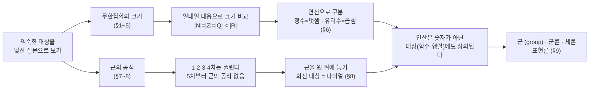

# 자연수, 정수, 유리수, 근의 공식에 대해 낯설어지기 (3기 3강)

이번 시간은 우리가 가장 익숙하다고 여기는 대상들 — 자연수·정수·유리수, 그리고 2차방정식의 근의 공식 — 을 일부러 낯설게 다시 봅니다.
먼저 1강에서 본 무한집합들을 "정말 같은 그림으로 봐도 되는가"라는 물음으로 흔들어 보고, 거기서 일대일 대응·칸토어의 대각선 논법·연속체 가설이 자연스럽게 나오는 것을 봅니다.
그다음 같은 집합들을 연산으로 구분해 보면서, 똑같은 시선을 근의 공식으로 옮겨 "5차부터 근의 공식이 없다"는 사실과 추상대수학(군·표현론)이 어떻게 한 줄로 이어지는지까지 갑니다.

---

## [0. 근의 공식을 정말 아는가 · ▶ 00:00](https://www.youtube.com/watch?v=gjozJi4EzJo&t=0s)

오늘의 출발 질문은 단순합니다. 여러분은 2차방정식의 근의 공식

$$x = \frac{-b \pm \sqrt{b^2 - 4ac}}{2a}$$

을 한 번쯤 보셨을 겁니다. 특히 입시를 치른 분이라면 시험 전날 완전제곱으로 유도하는 것도 눈감고 하셨을 거예요. 그래서 묻습니다 — 이 공식을 **정말로** 안다고 생각하시나요?

여기서 제가 1·2강 노트를 펼쳐 놓고 한 가지 오해를 짚습니다. 많은 분이 "근의 공식 같은 기초를 노트 앞부분에 넣은 건 배경이 약한 사람을 위한 친절한 배려"라고 생각하시는 것 같았어요. 그런데 제 의도는 정반대입니다. 추상대수학의 줄거리는 사실상 "근의 공식을 이해하는 것" 그 자체거든요. 이건 제 개인 해석이 아니라 객관적인 사실입니다. 그러니 "이거 다 아는 건데"라고 느끼는 바로 그 지점이 오히려 문제가 됩니다.

여러 참여자분이 "안다는 건 식을 외우는 게 아니라 유도까지 할 수 있는 것 아니냐", "유도할 수 있을 것 같긴 한데, 배운 걸 머리에서 지우고 스스로 흐름을 다시 만들라고 하면 거기서 막힌다"고 말씀해 주셨습니다. 한 분은 "근의 공식은 알지만 근의 성질, 일반적인 다항식 근의 성질은 모른다"고, 또 5차 이상에서 근의 공식이 존재하지 않는다는 사실을 이해하고 싶어 책·영상을 찾아봤지만 항상 "대칭성" 이야기에서 논리의 점프가 생겨 막혔다고 하셨습니다.

> **💭 생각해볼 점** "근의 공식을 안다"는 것은 어디까지 가야 정말 아는 것일까요. 식을 쓸 수 있는 것, 유도할 수 있는 것, 유도의 흐름을 스스로 만들어 낼 수 있는 것 — 어디가 기준일까요. 제가 드리고 싶은 핵심은 이것입니다. "안다/모른다"를 말하려면 먼저 **질문**이 있어야 합니다. 제가 일부러 질문의 결을 명시하지 않았기 때문에 다들 애매했던 거예요. 그러니 오늘 보려는 것은 "내가 이 익숙한 대상에 대해 낯선 질문을 던져 본 적이 있는가"입니다.

---

## [1. 무한집합을 같은 그림으로 봐도 되나 · ▶ 23:20](https://www.youtube.com/watch?v=gjozJi4EzJo&t=1400s)

1강에서 본 수 체계의 포함 관계를 다시 깝니다.

$$\mathbb{N} \subset \mathbb{Z} \subset \mathbb{Q} \subset \mathbb{R}$$

자연수는 정수에 들어갑니다(임의의 자연수는 정수니까요). 정수는 유리수에 들어갑니다(임의의 정수 $n$은 분모를 $1$로 잡아 $\tfrac{n}{1}$로 쓰면 유리수니까요). 그리고 $\sqrt{2}$ 같은 수는 유리수가 아니므로 유리수가 전부도 아니죠. 벤 다이어그램으로 동그라미 안에 동그라미를 그려 넣고 끝 — 우리는 10대 때 여기서 멈췄습니다.

그런데 한 가지가 걸립니다. 이 집합들은 모두 **원소가 무한개**라는 거예요. 우리가 "더 크다/작다"를 직관적으로 따질 때는 유한집합을 떠올립니다. 동그라미를 그려 놓고 `…`을 찍어 놓았는데, 안쪽 원도 무한으로 커지고 바깥 원도 무한으로 커지면서 같이 자라요. 이걸 경계선으로 가둬 놓고 "안이 더 작다"고 말해도 되는 걸까요. 어딘가 거시기한 느낌이 들지 않나요.

> **💭 생각해볼 점** 한 참여자분이 이렇게 정리해 주셨습니다 — 원소가 유한개면 집합의 크기를 딱 말할 수 있는데, 무한개가 되면 자연수도 "무한대", 정수도 "무한대"라서 어느 쪽이 더 큰지 비교할 기준 자체를 모르겠다는 겁니다. 또 다른 분은 "당연히 속해 있다고 보던 그림이 갑자기 낯설어졌다 — 원들이 다 무한히 커지고 있으니 크기를 잰다는 게 가능한 개념인가" 하는 멘붕을 말씀하셨고요. 이 낯섦이 오늘의 진짜 출발점입니다. **공감하지 않으셔도 됩니다.** 다만 "그냥 자연스럽게 느껴진다"는 것은 아직 낯설게 볼 단면을 관찰하지 못해서일 수도 있다는 여운만 남깁니다. 무한집합의 크기는 **일대일 대응(전단사)이 존재하는가**로 비교한다는 게 그 기준이 됩니다 (→ [전사본](01.%20Sets,%20Propositions,%20and%20Axioms.md) §3 참조).

---

## [2. 자연수와 정수는 일대일 대응이 된다 · ▶ 38:00](https://www.youtube.com/watch?v=gjozJi4EzJo&t=2280s)

여기서 논리가 깡패가 됩니다. 자연수와 정수는 분명히 일대일 대응이 됩니다. 방법은 간단해요. 자연수를 짝수·홀수로 나눠서

- 짝수: $2n \mapsto n$ 이라 두면 $0, 2, 4, \dots \mapsto 0, 1, 2, \dots$ (0 이상의 정수)
- 홀수: $2n+1 \mapsto -(n+1)$ 이라 두면 $1, 3, 5, \dots \mapsto -1, -2, -3, \dots$ (음의 정수)

이렇게 보내면 모든 정수가 자연수와 빠짐없이 짝지어집니다 (→ [전사본](01.%20Sets,%20Propositions,%20and%20Axioms.md) §3.2 참조). 논리적으로 자연수는 정수의 진부분집합인데, 그 부분이 전체와 일대일 대응이 되는 거예요. 내가 논리를 받아들인다는 전제만 있으면 여기에 딴지를 걸 수가 없습니다.

그래서 "이게 이해가 안 간다"가 아니라 "이게 도대체 뭐냐"는 정서가 생깁니다. 부분이 전체보다 분명히 작은데, 무한으로 커지면서 섞여서 일대일이 되는 이 상황을 어떻게 받아들여야 하나요.

> **💭 생각해볼 점** 한 참여자분이 짚어 주셨듯이, 이런 식이면 자연수는 짝수하고도, 홀수하고도, 3의 배수하고도 다 일대일 대응이 됩니다. 또 다른 분은 "머리로는 이해되는데 왜 불편하냐면, 분명히 부분인데 전체와 크기가 같다고 하니까 그렇다 — 집합의 크기를 비교할 때 반드시 일대일 대응이라는 함수밖에 방법이 없느냐"고 물으셨습니다. 좋은 지적이고, 사실 이게 핵심입니다. **같다/다르다의 기준은 내가 정하는 것**이에요. 일대일 대응을 기준으로 삼으면 같다고 할 수밖에 없지만, 다른 기준을 제시할 수 있으면 다르다고 봐도 됩니다(곧 연산으로 그렇게 합니다). 서로 모순되는 세계관이 아니라, 언어를 명확히 하기만 하면 다 맞는 말입니다.

---

## [3. 유리수도 일대일 대응, 그러나 실수는 아니다 — 칸토어의 대각선 논법 · ▶ 46:00](https://www.youtube.com/watch?v=gjozJi4EzJo&t=2760s)

자연수와 유리수도 일대일 대응이 됩니다. 유리수 $\tfrac{m}{n}$을 분모별로 격자에 늘어놓고 대각선을 따라 차례로 세면 빠짐없이 셀 수 있어요(가산). 따라서

$$|\mathbb{N}| = |\mathbb{Z}| = |\mathbb{Q}|$$

(정당화가 궁금하면 공부하시면 되지만, 일단 믿기로 하겠습니다 — → [전사본](01.%20Sets,%20Propositions,%20and%20Axioms.md) §3.3 참조.)

그런데 더 짜증나는 건, 다 똑같다고 퉁치고 싶은데 **실수는 일대일 대응이 안 된다**는 겁니다. 실수가 진짜로 더 큽니다. 증명은 귀류법이에요. $0$과 $1$ 사이 실수를 모두 무한소수로 목록화했다고 가정하고, 그 목록의 **대각선** 자리 숫자를 모두 바꾼 새 수를 만들면, 그 수는 $k$번째 자리에서 $k$번째 수와 다르므로 목록 어디에도 없습니다 — 모순이죠. 이걸 칸토어의 **대각선 논법(대각화)** 이라고 합니다 (→ [전사본](01.%20Sets,%20Propositions,%20and%20Axioms.md) §4 참조).

정리하면, 자연수·정수·유리수는 다 같은 크기인데 실수만 더 큽니다. 무한에도 등급이 있다는 거예요.

> **💭 생각해볼 점** "그 당연한 그림에 칸토어가 시비를 걸었을 때 지탄받은 사람들한테 공감이 간다 — 그런데 '무한인데 이렇게 생각해도 되느냐'는 질문을 듣는 순간 진짜 그런가 싶어졌다"고 한 참여자분이 말씀하셨습니다. 천번이고 보던 대상도 새로운 관찰·새로운 질문을 던지는 순간 낯설어집니다. 이건 지식의 문제가 아니라 관점의 문제예요.

---

## [4. 연속체 가설 — 결판나지 않는 명제 · ▶ 48:00](https://www.youtube.com/watch?v=gjozJi4EzJo&t=2880s)

자연수와 실수의 크기가 다르다면 자연스러운 질문이 생깁니다.

> 자연수만큼의 무한과 실수만큼의 무한, **그 중간 크기의 무한집합이 존재하는가?**

이게 **연속체 가설**입니다. 자연수($\mathbb{N}$)보다 크고 실수($\mathbb{R}$)보다 작은 무한집합(중간 농도, 중간 카디널리티)이 존재하지 않는다는 명제죠. 1900년 힐베르트가 제시한 23개 문제 중 **첫 번째** 문제였습니다.

그런데 수학자들이 내린 결론이 황당합니다 — 자연수를 지지하는 공리계(페아노 공리계를 긍정하는) 안에서는 이 명제를 **증명할 수도, 반증할 수도 없다는 것을 증명**했어요. "믿고 싶은 대로 믿으세요"가 결론이 된 겁니다. 이건 설을 푸는 게 아니라 엄밀하게 증명된 사실입니다 (전사본 §5에서는 같은 결과를 ZFC 공리계와 코헨(1963)의 독립성 증명으로 정리합니다 — → [전사본](01.%20Sets,%20Propositions,%20and%20Axioms.md) §5 참조).

> **💭 생각해볼 점** 한 참여자분이 "연속체 가설이 풀리면 무슨 일이 일어나느냐"고 물으셨습니다. 더 중요한 결은 이겁니다 — 관점을 조금만 낯설게 틀어 질문하는 순간, 인간은 정말로 모릅니다. 나만 모르는 게 아니라 인류가 모르는 거예요. 스타크래프트 맵이 처음에 검게 가려져 있듯, 익숙함 밖으로 한 발자국만 나가면 아는 게 거의 없습니다. 이건 피상적인 비유가 아니라, 자연수 집합·정수 집합·근의 공식에 대해 지금 이 순간도 논문이 나오고 있다는 뜻입니다. 그리고 이 한계는 "모든 것을 옳고 그름으로 환원하는 세계관을 만들 수 없다"는 의미이기도 합니다.

---

## [5. 0으로 나누면 왜 안 되나 — 그리고 리만 가설 곁가지 · ▶ 50:30](https://www.youtube.com/watch?v=gjozJi4EzJo&t=3030s)

여기서 2강 노트의 연습문제 하나를 봅니다. 분모가 $0$이면 왜 안 될까요? 만약 $0$으로 나누는 것을 허용하면, $0$을 곱했으니 $0$이어야 하는 동시에 약분 때문에 $1$이어야 하므로 $0 = 1$이 되어야 합니다.

그런데 이게 사실 "말이 안 되는" 게 아닙니다. $0$과 $1$이 같아도 되거든요 — 그러면 그 수 체계는 **원소가 단 한 개**일 수밖에 없습니다. 우리가 한 개짜리 집합을 다루는 상황이 아니라면, $0$으로 나누는 것은 반드시 배제해야 한다는 게 그 이유입니다. 그렇지 않으면 다룰 대상이 사라지니까요.

> **📚 참고·응용** 이 관찰에서 한 발자국만 더 들어가면 — 어떤 연산이 잘 풀리면 — 리만 가설이 풀린다는 것이 실제로 증명되어 있습니다. 연속체 가설을 수학적으로 진술하면 "자연수 집합과 실수 집합의 중간 농도(카디널리티)를 갖는 집합은 존재하지 않는다"이고, 자연수의 페아노 공리계를 긍정하는 공리 하에서 증명도 반증도 불가능함이 증명되어 있습니다. 강조하고 싶은 것은 지식 자체가 아니라, 관점을 조금만 낯설게 트는 순간 인간이 정말로 모른다는 사실, 그리고 그런 질문이 결코 헛소리가 아니라는 점입니다.

---

## [6. 연산으로 구분하기 — 정수는 덧셈, 유리수는 곱셈 · ▶ 57:00](https://www.youtube.com/watch?v=gjozJi4EzJo&t=3420s)

이제 애매하게 두었던 것을 명확히 합니다. 저는 자연수와 정수가 "같다"고 한 적이 없습니다. **일대일 대응이 된다**고 했을 뿐이에요. 일대일 대응이 되는 것을 같다고 보는 기준을 택하면(집합론적으로 같다고 합니다) 셋은 다 같은 집합입니다. 하지만 다르다고 보고 싶으면, 일대일 대응이 아닌 다른 기준만 제시하면 됩니다.

그 기준이 바로 **연산**입니다.

- **자연수 → 정수: 덧셈.** 덧셈이 잘 정의되려면 더해서 자기 자신이 되는 수($0$, 항등원)와 그것을 복구하는 음수(역원)가 있어야 합니다. 자연수에는 없죠. 그래서 정수란 **덧셈이 잘 정의되도록 하는 자연수의 가장 작은 확장**입니다.
- **정수 → 유리수: 곱셈.** 정수에는 $1$은 있지만 역수가 없습니다($\tfrac{1}{2}$ 같은 게 없죠). 그래서 유리수란 **($0$을 제외하고) 곱셈·나눗셈이 잘 정의되도록 하는 정수의 가장 작은 확장**입니다.

이렇게 보면 자연수·정수·유리수는 다 일대일 대응이 되지만(할 말 없죠), **연산 구조(대수적 구조)를 기준으로는 서로 다른 집합**이 됩니다. 자연수는 덧셈이 정의 안 되고, 정수는 덧셈만, 유리수는 두 연산이 다 정의됩니다. 물론 연산으로 구분해야 한다는 당위가 있는 건 아니고, 구분할 수 **있다**는 것뿐입니다.

> **💭 생각해볼 점** 여러 참여자분이 이미 정답을 짚어 주셨습니다 — "자연수 책에 다 늘어놓고 가운데를 잡아 $0$이라 이름 붙이고 위아래에 $\pm$를 붙이는 것 아니냐", "집합을 구별하는 방법은 계산·연산으로 구별할 수 있지 않을까", "더하기·빼기가 닫혀 있다는 얘기를 들은 적 있다" — 이게 다 대수적 관점의 정답입니다. 한편 "일대일 대응이 되니 개수가 같다는 것과, $-1$이 자연수에 없으니 두 집합이 다르다는 것은 별개 아니냐"는 반례식 지적도 나왔는데, 이것도 타당합니다 — 다른 기준(원소의 소속)을 든 것이니까요. **누가 옳고 그른 게 아니라, 어떤 기준 하에서 말하는지를 명확히 하면 됩니다.**

> **✏️ 연습문제** $0$으로 나누기를 허용하면 그 수 체계의 원소가 한 개뿐이어야 함을 보이시오. (분모가 $0$일 때 $0 = 1$이 강제됨을 이용.)

> **📚 참고·응용** 정수·곱셈의 정의를 페아노 공리계 위에서 엄밀하게 세우면 $1+1=2$, $(-1)\times(-1)=1$ 같은 명제를 정말로 증명할 수 있습니다. 궁금하면 → [전사본](../02-algebra/02.%20Algebra%20and%20Group%20Theory.md) §4~5 참조. 중요한 건 그 엄밀한 형식이 아니라, "$0$과 음수가 규정되도록 하는 가장 작은 확장", "역수가 규정되도록 하는 가장 작은 확장"이라는 **직관**이 그 형식과 등가라는 점입니다.

---

## [7. 근의 공식과 5차의 벽 · ▶ 1:13:00](https://www.youtube.com/watch?v=gjozJi4EzJo&t=4380s)

이제 똑같은 시선을 근의 공식으로 옮깁니다. 우리는 1차방정식 $ax+b=0$을 ($a \neq 0$일 때) 풀 줄 알아서 배웠고, 2차방정식은 완전제곱으로 근의 공식을 유도할 줄 알아서 배웠습니다. 풀 줄 아니까 배운 거예요.

그러면 자연스러운 다음 질문은 "3차는?"입니다. 보통은 "복잡하니까 대학 가서"라며 안 합니다. 그런데 3차도 됩니다. 솔직히 2차 푸는 방법을 잘 적용하면(정확히는 대칭성을 쓰면) 근의 공식이 나와요. 4차도 됩니다 — 스크린 한 장에 안 들어갈 만큼 길어지지만, 됩니다. 이 생각은 500년 전에 이미 풀린 것이고요.

그런데 **5차부터 이상하게 잘 안 됩니다.** $x^5 - 1 = 0$처럼 인수분해되어 낮은 차수로 떨어지는 특수한 경우는 되지만, 일반적인 5차에는 똑같은 방법이 통하지 않아요. 여기서 결정적인 차이가 생깁니다. "내가 못 풀었다"는 것과 "이건 안 된다(너도 못 풀 것이다)"는 것은 전혀 다른 주장입니다. 후자는 훨씬 센 주장이에요.

갈루아와 아벨이 마주한 상황이 바로 이거였습니다. 해 보니 안 되는 것 같은데, "안 되는 것 같다"는 수학적 선언이 아니죠. 그래서 **대수학(추상대수학)** 이란, 한마디로 정리하면 **"5차 이상에서 근의 공식이 존재하지 않음을 이해하는 것을 목적으로 하는 학문"** 이라고 해도 맞는 말입니다. (대수학의 "대(代)"는 대신한다는 뜻 — 중학교에서 숫자 대신 문자 $x$에 연산을 도입한 그것입니다.)

> **💭 생각해볼 점** "5차부터 안 된다면 — 어떤 시도를 하더라도 근의 공식이 없음을 보이라는 것"입니다. 4차까지는 계수(coefficient)로 근을 표현할 수 있는데, 5차는 그게 불가능함을 보여야 해요. 여러분이라면 이 막힌 상황에서 어떤 관찰을 만들어 내겠습니까? 한 참여자분은 "1·2·3·4차는 왜 되는지를 관찰하겠다", 또 "인수분해가 안 되는 것을 보이려 하겠다"고 하셨습니다. 또 다른 분은 "1·2·3·4가 공유하는 특성이 있는데 5차는 그걸 공유하지 않는 것 같다 — 그 차이가 뭘까"라고, 무한집합 때와 똑같은 감정을 짚어 주셨습니다. 정답 없는 질문이지만, 힌트는 1강에서 나눈 대화(자연수·정수·유리수를 연산으로 구분한 것)입니다.

> **📚 참고·응용** 근의 공식에 등장하는 루트·복소수(허수)와 관련해, 거듭제곱이 한 바퀴씩 도는 듯한 관찰은 추상대수의 **사이클로토믹 체(cyclotomic field)**, 그리고 곧 나올 대칭 이야기는 **다이헤드 군(dihedral group)** 과 직접 연결됩니다.

---

## [8. 근을 원 위에 놓고 — 대칭성과 다이얼 · ▶ 1:42:00](https://www.youtube.com/watch?v=gjozJi4EzJo&t=6120s)

근의 공식을 인수분해로 다시 봅니다. 예를 들어

$$x^2 - 2 = (x + \sqrt{2})(x - \sqrt{2})$$

의 두 근 $\pm\sqrt{2}$를 좌표평면(복소평면) 위에 점으로 찍을 수 있습니다. 4차

$$x^4 - 2 = (x+\sqrt[4]{2})(x-\sqrt[4]{2})(x+\sqrt[4]{2}\,i)(x-\sqrt[4]{2}\,i)$$

라면 실수축 위 $\pm\sqrt[4]{2}$, 허수축 위 $\pm\sqrt[4]{2}\,i$ 네 점이 정사각형 꼭짓점처럼 찍힙니다 (→ [전사본](../02-algebra/02.%20Algebra%20and%20Group%20Theory.md) §7 예제 참조).

제가 이 점들을 일부러 **원** 위에 올려 그린 이유는, 이걸 **다이얼이 돌아가는 것**처럼 보이게 하고 싶었기 때문입니다. 두 근짜리는 $180^\circ$ 돌면 자기 자신, 세 근짜리는 $120^\circ$, 네 근짜리는 $90^\circ$씩 돌아 자기 자신으로 돌아옵니다 — 일종의 회전 연산이죠. 인수분해가 두 덩어리로 떨어진다는 것은, 이 다이얼이 두 개로 독립적으로 따로 돈다는 뜻입니다.

그런데 다섯 근부터는 $360^\circ \div 5$ 회전이 들어가면서, 이 다이얼이 이상하게 꼬이는 상황이 생깁니다. 그리고 이 꼬임이 바로 **5차 근의 공식이 없는 이유를 설명**해요.

> **💭 생각해볼 점** "다이얼을 보니 '대칭성'이라는 용어를 왜 썼는지 와닿는다 — 그런데 그러면 근의 공식의 $\pm$처럼 결국 짝수 개 대칭이 되는 건가, 육각형·삼각형의 대칭처럼?" 한 참여자분의 이 물음, 그리고 "방정식 각 항을 잇는 연산의 규칙이 있어서 4차까지 풀리고 5차부터 어려워지는 것 아니냐"는 또 다른 분의 상상이 사실 정답입니다. 한 분은 "왜 마름모가 아니라 원으로 그렸느냐"고 물으셨는데 — 형태(원이든 마름모든)는 본질이 아니고, 몇 번 돌면 자기 자신이 되는지가 핵심입니다. 이 회전 대칭을 엄밀하게 다루는 분야를 **표현론(representation theory)** 이라 부르고, 선형대수학의 중요한 세부 분야입니다.

---

## [9. 연산을 '수가 아닌 대상'에 — 군, 그리고 다음 이야기 · ▶ 1:52:00](https://www.youtube.com/watch?v=gjozJi4EzJo&t=6720s)

여기서 우리가 슬쩍 이상한 일을 하고 있었다는 걸 짚어야 합니다. 앞에서는 연산(덧셈·곱셈)을 **숫자**에 대해 정의했어요. 그런데 다이얼을 돌릴 때, 우리는 그 버튼에 어떤 숫자가 적혀 있는지는 신경 쓰지 않고 **위치(돌아가는 방식)** 만 신경 썼습니다. 즉 숫자가 아닌 대상에 대해 이미 "연산"을 생각하고 있었던 거예요.

이걸 이렇게 확장합니다. 연산은 사실 **함수들** 위에도 정의됩니다. 그리고 가장 다루기 좋은 함수인 **선형함수**에 대해 이 짓을 하는 것이 바로 **행렬**입니다. 함수의 합성, 행렬의 곱셈 — 따로따로 정의되는 별개의 대상처럼 보이던 것들이, 사실은 하나의 시야로 묶이는 거예요.

다이얼이 도는 것을 항등원·결합법칙·역원이 정의된 집합으로 엄밀하게 다루면 그게 **군(group)** 입니다. 함수들의 모임에 연산을 주고, 그 연산의 성질에 따라 근의 공식이 존재하는지가 결정된다는 관찰 — 이것이 추상대수학의 **군론·체론**입니다 (군·체의 정의는 → [전사본](../02-algebra/02.%20Algebra%20and%20Group%20Theory.md) §6~9 참조). 핵심 통찰은 단 하나, **"연산은 숫자에만 정의되는 것이 아니다"** 라는 선입견을 깬 것입니다. 그 단순한 관찰을 수학적으로 엄밀하게 기술하면 대학·대학원 2년치 분량이 나오지만, 우리의 목적은 그 분량을 외우는 게 아니라 "나라면 이런 발상을 할 수 있었을까"를 내 관점에서 머물러 보는 데 있습니다.

오늘 흘러온 두 줄기 — 무한집합을 낯설게 보기, 근의 공식을 낯설게 보기 — 가 결국 같은 통찰(연산을 숫자가 아닌 대상에)로 모이는 흐름을 한눈에:

> **💭 생각해볼 점** 함수의 합성이나 행렬 곱이 각각 따로 정의되는 대상이 아니라, 공통의 시야로 아우를 수 있는 통찰이 있는 것 아닐까 — 이 상상이 들기 시작했다면 그게 핵심입니다. 그 시야는 전혀 다른 구체적 대상(경제학의 불평등 문제든, 내 관심사의 다른 맥락이든)에서 "엑기스"를 뽑아 서로를 비교하고 차이를 보는 통찰력으로 이어집니다. 그래서 수학을 안다는 것은 시험 점수가 아니라, 익숙한 대상을 내 관점에서 낯설게 다시 보는 일입니다.

---

## 요약

- **무한집합의 크기는 일대일 대응(전단사)의 존재로 비교한다.** 그 기준에서 $|\mathbb{N}| = |\mathbb{Z}| = |\mathbb{Q}|$ (가산)이지만 $|\mathbb{R}| > |\mathbb{Q}|$ — 무한에도 등급이 있다.
- $\mathbb{N} \leftrightarrow \mathbb{Z}$ 대응은 짝수 $2n \mapsto n$, 홀수 $2n+1 \mapsto -(n+1)$. 부분이 전체와 일대일이 되는 이 사실이 "낯섦"의 출발점.
- **칸토어의 대각선 논법**: $(0,1)$의 실수를 목록화했다고 가정하고 대각선 숫자를 바꾸면 목록 밖의 수가 나와 모순 → 실수는 셀 수 없다.
- **연속체 가설**($\mathbb{N}$과 $\mathbb{R}$ 사이 크기의 무한집합이 없다)은 자연수를 지지하는 공리계 안에서 증명도 반증도 불가능 — 결판나지 않는 명제가 반드시 존재한다.
- **같다/다르다의 기준은 내가 정한다.** 일대일 대응으로 보면 셋은 같지만, 연산으로 보면 다르다: 정수는 덧셈($0$·음수)이 정의되는 가장 작은 확장, 유리수는 ($0$ 제외) 곱셈·나눗셈이 정의되는 가장 작은 확장.
- $0$으로 나누기를 허용하면 $0 = 1$이 강제되어 원소가 한 개뿐인 체계가 된다 — 그래서 배제한다.
- **근의 공식**: 1·2차는 풀 줄 알아서, 3·4차도 같은 방법(대칭성)으로 된다. 그러나 **5차 이상에는 일반적인 근의 공식이 존재하지 않는다** — 대수학은 사실상 이 사실을 이해하기 위한 학문이다.
- 근을 복소평면 원 위에 놓으면 **회전 대칭(다이얼)** 으로 보이고, 5차부터 이 대칭이 꼬이는 것이 근의 공식이 없는 이유를 설명한다 → 군론·체론·표현론.
- 핵심 도약은 **"연산은 숫자가 아닌 대상(함수·행렬)에도 정의된다"** 는 선입견 깨기. 함수의 합성·행렬 곱을 한 시야로 묶는 것이 군의 발상이다.
- 수학을 안다는 것은 지식의 축적이 아니라, 익숙한 대상을 내 관점에서 낯설게 다시 보고 질문을 만들어 내는 일이다.
