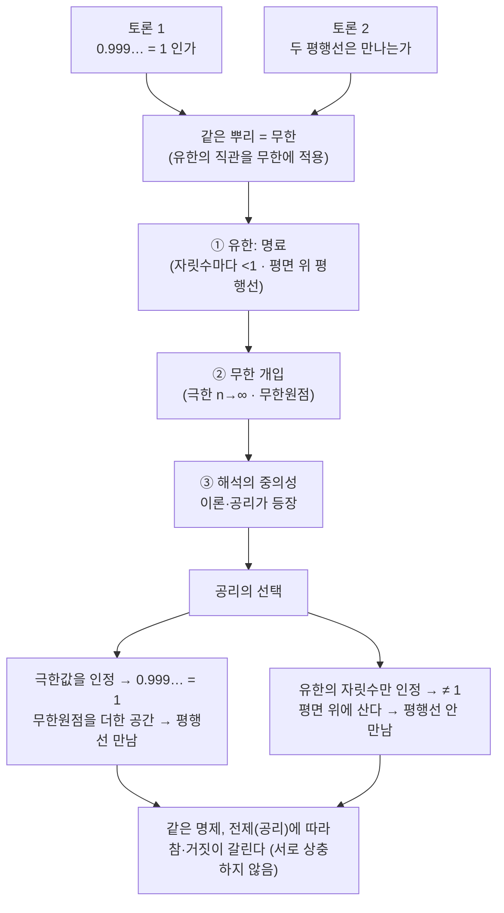

# 0.999... 와 평행한 두 직선에 대한 토론

$0.999\cdots = 1$ 인가, 그리고 두 평행선은 만나는가, 이 두 가지를 일부러 편을 갈라 토론하고, 마지막에 왜 의견이 갈리는지를 무한과 공리의 관점에서 정리합니다.

## [0. 첫 과제에 대한 참여자 소감 — 수학적 결 · ▶ 13:53](https://www.youtube.com/watch?v=bzjwKBf-9FY&t=833s)

들어본 것과 아는 것은 다릅니다. 수학을 안다는 것은 그 언어를 능숙하게 구사할 수 있고 언어 이면의 것이 이해되어 다른 대상을 볼 때 통찰의 층위가 올라가는 것이지, 단지 그 언어가 눈에 익숙해지는 것이 아닙니다. 첫 과제를 풀면서 참여자들이 짚은 수학적 결을 옮기면 이렇습니다.

- 선형변환에서 $f$ 로 전개되는 함수가 행렬로 표현된다는 것을 알게 되니, 차원과 차원 사이의 관계로도 해석되고 뻗어나가는 점이 많이 보였다.
- 문제가 정의역의 조건을 따지도록, 또 선형대수와 함수를 연결해 이해하도록 이끄는 느낌을 받았다.
- 수의 종류를 구분하는 문제에서, 학교 다닐 때는 "자연수 $\subset$ 정수 $\subset$ 유리수 $\subset$ 실수" 라는 포함 관계로만 알았다.
- 주사위 면이 무한개라면 각 면을 자연수로 번호 매겨 확률 분포를 어떻게 엄밀히 정의하느냐는 문제는, 답이 $0$ 인데 그 이유를 설명하기가 어려웠다.
- 늘 일대일 대응을 이산적으로만 생각했는데 연속인 상황이라 어떻게 증명할지 막막했다. 등고선 그리는 문제도 내가 생각한 답과 전혀 다르게 나왔다.
- 1강이 공리와 무한을 다뤘는데, 연습문제에서 두 평행한 평면이 서로 모순되지 않는다고 적힌 것이 공리와 연관된 것 같았고, 사영기하에서 무한원점에서 모든 평면이 만난다는 것이 어떤 것일지 상상해 봤다.
- 칼큘러스 1을 풀며 반직관적인 것이 많았다. 당연하다 여겼던 것이 다른 공리를 도입하면 당연하지 않을 수 있고, 정사각형과 직사각형이 무엇인지 제대로 정리해 본 적이 없다는 것도 깨달았다.

> **💭 생각해볼 점** 여러 분이 짚었듯이, 1강 노트와 겹치는 용어(집합, 공리 등)가 이 과제의 단서가 됩니다. 같은 것을 하고 있어 경험에 공감해 줄 사람들과 그 여러 결을 나누는 것이 중요합니다.

## [1. 첫 번째 토론 — $0.999\cdots$ 는 $1$ 인가 · ▶ 26:24](https://www.youtube.com/watch?v=bzjwKBf-9FY&t=1584s)

한쪽은 "$0.999\cdots = 1$ 이다", 다른 한쪽은 "각 자릿수마다 $1$ 보다 작으니 $1$ 이 아니다" 로 갈라 토론해 보겠습니다. 단, 적어도 합리적인 근거가 있어야 합니다.

다들 들어보셨을 겁니다. $\frac{9}{10}=0.9 < 1$, $\frac{99}{100}=0.99 < 1$, $\frac{999}{1000}=0.999 < 1$ … 자릿수마다 $1$ 보다 작습니다. 이것을 무한 번 반복한 무한소수 $0.999\cdots$ 를 생각합시다.

이 그림이 두 입장이 팽팽한 이유를 한눈에 보여 줍니다 — **유한한 $n$에서는** 항상 $S_n<1$ 이지만, **$n\to\infty$ 의 극한에서는** 그 간격이 사라집니다. 어느 쪽을 "$0.999\cdots$" 라 부르느냐가 곧 입장의 차이입니다.

여러분이 양쪽에서 내준 근거를 정리하면 이렇습니다.

**$1$ 이라는 쪽**

- 첫째 항이 $0.9$, 공비가 $\frac{1}{10}$ 인 등비수열의 합 $S_n$ 을 두면, $n \to \infty$ 일 때 등비급수가 됩니다. $S = \dfrac{0.9}{1-0.1} = \dfrac{0.9}{0.9} = 1$. 그래서 $1$ 입니다.
- $\frac{1}{9} = 0.111\cdots$ 임을 알고 있으니, 같은 논리로 $\frac{9}{9} = 0.999\cdots$ 입니다. 그런데 $\frac{9}{9} = 1$ 이니 $0.999\cdots = 1$ 입니다.
- $N = 0.999\cdots$ 로 두고 $10$ 배 하면 $10N = 9.999\cdots$. 여기서 $N$ 을 빼면 $9N = 9$ 이므로 $N = 1$, 즉 $0.999\cdots = 1$.
- 실수는 어떤 물리적 실체가 아니라 위치(자리)입니다. $0.999\cdots$ 와 $1$ 이 결국 같은 지점을 향한다면, 둘은 같다고 봐야 하지 않을까요.

**$1$ 이 아니라는 쪽**

- 1에 가까워진다는 것은 인식할 수 있지만, 가까워진 그 지점을 더 확대해서(조명해서) 보면 조금이라도 떨어져 있을 것이다. 멀리서 봐서 1처럼 보이는 것일 뿐이다.
- 두 수가 같다면 굳이 $1$ 과 $0.999\cdots$ 라는 두 가지 표기로 쓸 이유가 없다. 다르게 표기한다는 것 자체가 두 수가 다르다는 인정 아닌가. (이에 대해 다른 분이 받아쳤습니다 — 다른 표기가 다른 수임을 보장한다면 $\frac{5}{5}$ 와 $\frac{1}{1}$ 과 $1$ 도 다른 수가 되어 버린다.)
- $0.999\cdots$ 는 실수 안에서 표현한 것이고 $1.0$ 도 실수로 표현한 것인데, 결국 근소한 차이가 있고 그 차이를 무한급수 같은 방법으로 "공리처럼" 인정할 거냐 말 거냐의 문제다. 이퀄이라면 완전히 이퀄이어야 하는데 그렇게는 안 느껴진다.
- 사각형 넓이를 무한급수처럼 조금씩 덜어내도, 끝에 아주 작은 사각형은 끝내 없앨 수 없을 것 같다.
- $0.999\cdots \times 0.999\cdots$ 를 하면 그 논리대로면 1이 나와야 하는데, 소수점 끝에 무언가 숫자가 남을 것 같으니 같지 않을 것이다.
- $0.999\cdots = 1$ 이라면 $1$ 앞에 $0$ 이 무한히 붙은 소수도 $0$ 이라고 자신 있게 말할 수 있어야 하는데, 그걸 증명할 방법을 못 찾겠다.

**양쪽 다, 혹은 상황에 따라**

- $0.999\cdots = 1$ 로 간다면, 1보다 큰 쪽에서 $1.000\cdots1$ 도 1로 간다고 봐야 하는데 그게 이상해서, 결국 같다고 봐야 할 것 같다.
- 평행한 레일이 멀리서 한 점으로 보이듯, 근소한 차이가 인식의 한계를 넘으면 한 점으로 치는 게 맞지 않나. (이 토론과 다음 평행선 토론을 잇는 직관입니다.)
- 엑셀로 근삿값을 계산하는 실무라면 $1$ 로 퉁쳐도 괜찮지만, 세계관(맥락)에 따라 다르다.

이렇게 의외로 팽팽했습니다. 한쪽으로 쉽게 기울지 않는다는 것 자체가 핵심입니다.

> **💭 생각해볼 점** "$0.999\cdots = 1$ 이다"와 "각 자릿수마다 $1$ 보다 작으니 $1$ 이 아니다", 여러분은 어느 쪽이며 그 근거는 무엇인가요? 정답을 맞히는 게 아니라, 내가 이 대상을 어떻게 이해하는지를 상대가 공감할 수 있게 설명하는 것이 목적입니다.

## [2. 두 번째 토론 — 두 평행선은 만나는가 · ▶ 41:14](https://www.youtube.com/watch?v=bzjwKBf-9FY&t=2474s)

"사영기하"라는 단어는 한참 뒤에 다시 나올 테니 지금은 초반부의 빌드업 정도로 보시면 됩니다. "두 평행선은 만난다 — 기차 끝을 봐라, 만나지 않느냐" 와 "두 평행선은 만나지 않는다" 로 갈라서, 의견과 근거를 말씀해 주세요.

여러분이 내준 결을 정리하면 이렇습니다.

**만나지 않는다는 쪽**

- 멀리서 만나 보이는 것은 사실이지만, 그것은 특정 시점(보는 위치)에서의 얘기다. 절대적으로 만나지 않는다는 것은 우리가 다 알고 있다.
- 만나 보이는 그 지점에 실제로 가 보면 두 레일은 떨어져 있을 것이다. 시각적 인식의 한계가 가져오는 착각이다.
- 평행하다는 것은, 두 선 사이에 수선을 그었을 때 직각이 유지된다는 것이다. 공간(면)의 조건이 바뀌지 않는다면 직각이 유지되어야 하고, 그러려면 두 선은 만나지 않아야 한다.

**만난다는 쪽**

- 우리가 인식하거나 끝을 볼 수 있다고 생각하는 영역에서는 만나지 않지만, 인식하지 못하는 범위까지 확장하면 만난다. 두 손가락을 마주쳐 "만났다"고 하지만 미시적으로는 세포나 분자가 합쳐진 게 아니므로, "만난다"의 정의에 따라 답이 달라진다.
- 만난다는 것을 어떻게 정의하느냐의 문제다. 교차가 아니라 만난다는 것이니, 정의에 따라 갈린다.
- 떨어져 있음을 알더라도, 우리가 사는 세계에선 붙어 있다고 인지하고 그때그때 해결해야 하는 경우가 많다. 컴퓨터 그래픽처럼 공간을 한정해야 하는 분야에서는 만난다는 것을 인정해야 한다.

**공간/관점에 따라 달라진다는 쪽**

- 완벽하게 평평한 평면이라면 평행선은 영원히 만나지 않지만, 평면이 휘어 있으면 만날 여지가 있다. 어떤 공간을 선택하느냐에 따라 답이 반드시 달라진다.
- 우리는 지구 위에 살고 있으니 지구를 따라가면, 철로가 유한한 지구 면을 덮다 보면 언젠가 평행을 유지할 여력이 없어 반드시 만나는 지점이 생긴다.
- 유클리드 공간과 리만 기하로 따지면 만나거나 안 만나거나가 갈린다. 기울기가 $0.999\cdots$ (즉 $1$) 인 두 직선이라면, 기울기가 같으니 만날까 안 만날까 — 앞 토론과도 이어진다.
- 2D와 3D의 관점 차이로 봤다. 정사각형 안에서 점점 쪼개 보면 $0.9$ 와 $1$ 이 같지 않은 지점이 보이고, 정사각형을 멀리서(3D로) 보면 같아 보인다. 시각·관점의 차이다.

> **💭 생각해볼 점** 두 평행선은 만나는가, 만나지 않는가? 여러 분이 짚었듯 답하기 전에 "평행하다", "만난다"가 각각 무엇을 뜻하는지부터 정해야 합니다. 평면을 전제로 하면 일치하지 않는 두 평행선은 만나지 못합니다. 그렇다면 무엇을 바꾸면 만나게 될까요?

## [3. 왜 의견이 갈리는가 — 유한의 직관과 무한 · ▶ 54:00](https://www.youtube.com/watch?v=bzjwKBf-9FY&t=3240s)

명제로서 참·거짓이 명확한 문장을 두고도 의견이 팔팔하게 갈립니다. 왜 여러 갈래로 나뉠까요? **이유는 무한에 있습니다.** 선택지가 유한하면 명확하기 때문에 고민하지 않습니다. 그런데 유한에서 길러진 직관을 무한에 적용할 때 애매함이 생기고, 그것을 해석하기 위해 이론이 나옵니다.

수학의 순서를 정리하면 이렇습니다. 우리가 실제로 인식하는 것은 유한의 대상이지만, 자연계와 우리가 살아가는 실체는 유한에 국한되지 않습니다. 그래서 **유한의 대상을 가지고 무한의 대상을 해석하려는 처절한 발악이 수학**입니다. 그 도구는 논리와 계산입니다. 그런데 수학 영역 안에 있는 것조차 고민거리가 생깁니다. 무한에 대한 해석은 이럴 수도 저럴 수도 있기 때문입니다. 단순한 수직선·실수축에서도 온갖 얘기가 나오는 이유는, 예시는 유한하지만 그것으로 무한을 해석하는 이론은 무한하기 때문입니다.

그 해석은 세 층위를 거쳐 나옵니다. ① 가장 뻔한(trivial) 유한의 상황을 구체적으로 명료하게 이해하고, ② 그 유한을 무한에 적용할 때 어디서 무한이 개입하는지를 인지하고, ③ 거기서 해석의 중의성이 실제로 발생할 수 있다는 층위에서 내 관점을 녹이는 것입니다. 이 독특한 시야에는 내가 가진 시야의 다양성도 포함됩니다.

두 토론이 같은 뿌리(무한)에서 갈라져 나오는 흐름을 한눈에 정리하면 이렇습니다.

> **📚 참고·응용** "사영기하", "유클리드/리만 기하" 는 지금 정의하지 않고 빌드업으로 던져 둔 것이며 한참 뒤에 다시 다룹니다. 1강 노트의 공리·무한·비유클리드(리만) 기하학과 직접 이어지는 흐름입니다 (→ 전사본 참조).

## [4. 마무리 질의 — 무한원점과 공리의 차이 · ▶ 1:10:10](https://www.youtube.com/watch?v=bzjwKBf-9FY&t=4210s)

질의 중 줄기가 되는 것 몇 개를 옮깁니다.

**지평선과 무한원점.** 한 분이, 사람의 시선으로 지평선을 볼 때 그것이 철도처럼 평행선이 한 점으로 모이는 문제인지, 아니면 빽빽한 평행 직선들의 집합인지 물었습니다. 답은 둘 다입니다. 평면을 전제로 하면 일치하지 않는 두 평행선은 만나지 못합니다. 그런데 끝에 무한원점들을 더 집어넣으면 — 평면보다 점을 더 넣은 공간에서는 — 평행선들이 만나게 됩니다. 즉 직선이 "어디 위에 살고 있느냐" 의 문제입니다. "직선이 평면 위에 산다" 고 정하는 순간 그것이 하나의 공리이고 만날 수 없습니다. "무한원점을 더한 공간에 산다" 고 정하면 만나야 합니다. 이는 **공리의 차이**라고 할 수 있고, 전제가 바뀌면서 같은 명제의 참·거짓이 달라지는 것입니다. 두 관점은 서로 상충하지 않습니다.

**역행렬과 정의역.** 한 분이, "경계에서 함수가 정의되지 않는 이유를 설명하라" 는 문제에서 경계에서도 정의가 잘 되는 것 같다고 했습니다. 맞습니다. 보시는 그 식은 경계에서 문제가 없습니다. 의도는 이렇습니다 — 여기에 **역행렬을 취하면** 그 역이 분모로 들어와, 분모가 $0$ 이 되는 경계에서 정의가 안 됩니다. 나중에 이것을 역행렬로 바꿔 똑같은 질문을 할 요량이었습니다. 그러니 4번은 맞게 이해하신 것입니다.

**전사함수와, 어디까지 증명해야 하나.** 같은 분이, 벡터 중 하나를 $0$ 으로 고정해 $y = x$ 꼴로 만들어 전사임을 보이려 했는데 "$y=x$ 가 전사함수다" 까지 증명해야 하는지, 모든 걸 증명하며 풀어야 하는지 물었습니다. 어느 층위까지 보일지 구분하려는 태도 자체는 맞습니다. 전사의 정의는 공역의 임의의 원소에 대응하는 정의역의 원소를 찾아 주기만 하면 됩니다. 공역인 실수 집합의 임의의 원소를 $x$ 라 하면, 정의역에서 $x_0$ 을 그 $x$ 로 보내는 원소로 하나 뽑아 주면 끝납니다. 다른 선택지도 있지만 하나만 찾으면 되니 상관없습니다.

> **💭 생각해볼 점** 같은 명제라도 "직선이 평면 위에 산다 / 무한원점을 더한 공간에 산다" 처럼 어떤 전제(공리)를 두느냐에 따라 참·거짓이 갈립니다. 두 관점이 서로 상충하지 않는다는 것은 무슨 뜻일까요? 무한을 해석할 때 내가 어떤 관점을 도입하는지가 결론을 바꿉니다.

## 요약

- $0.999\cdots = 1$ 인가를 두고 등비급수·$\frac{1}{9}$·$10N-N$ 의 근거와, 자릿수마다 작다·표기가 다르다·곱하면 끝이 남는다 등의 반론이 팽팽히 맞섰습니다.
- 두 평행선이 만나는가도, "평행하다/만난다"의 정의, 평면이냐 휜 공간이냐, 인식의 한계냐에 따라 갈렸습니다.
- 의견이 갈리는 근본 이유는 무한입니다. 유한에서 기른 직관을 무한에 적용할 때 해석의 중의성이 생기고, 그것을 다루려고 이론과 공리가 등장합니다. 직선이 평면 위에 사는지, 무한원점을 더한 공간에 사는지를 정하는 것은 공리의 선택이며, 그에 따라 평행선이 만나는지가 바뀝니다.
