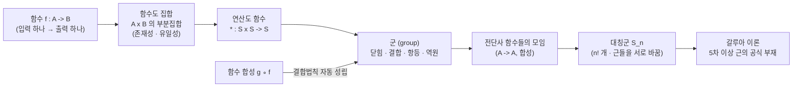

# 군의 관점에서 함수 낯설게 바라보기 (3기 4강)

이번 시간은 함수가 단순히 "계산식"이 아니라 수학의 기본 대상이라는 점을 다시 봅니다.
3강에서는 자연수·정수·유리수를 연산 구조로 구분했고, 근의 공식을 근들의 대칭과 연결했습니다.
이제 그 대칭을 말하기 위해 필요한 언어가 함수입니다.

함수는 입력을 출력으로 보내는 규칙처럼 보입니다.
하지만 집합론의 언어에서는 함수도 하나의 집합입니다.
함수들을 모으면 다시 집합이 되고, 함수들의 합성을 연산으로 보면 군 구조가 나타납니다.
오늘의 목표는 "연산은 숫자 위에서만 일어난다"는 감각을 깨는 것입니다.

---

## [1. 지난 시간의 질문: 근의 공식과 구조 · ▶ 00:00](https://www.youtube.com/watch?v=WFRubjkUYrw&t=0s)

시작은 3강의 반응에서 이어집니다.
여러분 중 한 분은 5차 방정식의 근의 공식이 왜 없는지, 그리고 근들의 대칭이라는 말이 조금씩 보이기 시작했다고 했습니다.
또 한 분은 spectral theorem 같은 선형대수의 기억을 떠올렸습니다.

이 반응들은 모두 "수학적 대상을 어떤 구조로 볼 것인가"라는 물음으로 모입니다.
근을 숫자로만 보면 공식의 유무가 계산의 문제처럼 보입니다.
하지만 근들을 서로 바꾸는 움직임으로 보면, 방정식의 해법은 대칭 구조의 문제로 바뀝니다.

오늘은 이 구조를 말하기 위해 함수 자체를 낯설게 봅니다.
함수는 계산을 실행하는 도구가 아니라, 모아서 연산할 수 있는 대상이 됩니다.

> **💭 생각해볼 점** 5차 이상에서는 근의 공식이 왜 없을까요? 근을 그냥 숫자로 보면 이 물음은 "아직 못 찾은 계산"처럼 들립니다. 하지만 근들을 서로 바꾸는 움직임으로 보면, "공식이 없다"는 말이 그 움직임들의 구조에 대한 이야기로 바뀝니다. 오늘은 그 움직임을 함수로 다루기 위한 준비를 합니다.

## [2. 구조라는 말은 무엇을 가리키는가 · ▶ 03:10](https://www.youtube.com/watch?v=WFRubjkUYrw&t=190s)

여러분 중 한 분이 물었듯이, 연산의 대상이 숫자가 아니라 도형이 되면 그 관계 속에서 "공간" 같은 개념이 나오는 것 아니냐는 물음이 있었습니다.
이 물음은 "구조"라는 말의 감각을 잡게 해 줍니다.

구조는 원소들이 그냥 놓여 있는 상태가 아닙니다.
그 원소들 사이에 어떤 연산, 관계, 거리, 순서, 변환 같은 추가 정보가 주어진 상태입니다.
집합만 있으면 "들어간다/안 들어간다" 정도를 말할 수 있습니다.
하지만 연산이 있으면 더할 수 있고, 거리가 있으면 가까움을 말할 수 있고, 위상이 있으면 연속성을 말할 수 있습니다.

그래서 같은 집합도 어떤 구조를 얹느냐에 따라 전혀 다른 수학적 대상이 됩니다.
오늘은 그중에서도 군 구조, 특히 함수 합성에서 나오는 군 구조를 봅니다.

> **💭 생각해볼 점** 연산의 대상이 수가 아니라 도형이라면, 그 관계 속에서 만들어지는 것을 "공간"이라 불러야 할까요? 같은 집합이라도 어떤 추가 정보(연산·거리·순서·변환)를 얹느냐에 따라 전혀 다른 대상이 됩니다. "구조가 있다"는 말은 곧 "무엇을 더 얹었는가"를 묻는 말입니다.

## [3. 집합과 연산에서 군까지 다시 정리하기 · ▶ 05:06](https://www.youtube.com/watch?v=WFRubjkUYrw&t=306s)

지금까지의 흐름을 정리하면 이렇습니다.
집합이 있고, 그 집합 위에 연산이 주어집니다.
그 연산이 닫혀 있고, 결합법칙을 만족하며, 항등원과 역원을 가지면 군이라고 부릅니다. → 전사본 참조

자연수는 덧셈에 대해 보통 군이 아닙니다.
$3$의 덧셈 역원인 $-3$이 자연수 안에 없기 때문입니다.
정수는 덧셈에 대해 군입니다.
0이 항등원이고, 각 정수 $a$에 대해 $-a$가 있습니다.

유리수 전체는 곱셈에 대해 군이 아닙니다.
0의 곱셈 역원이 없기 때문입니다.
하지만 0을 뺀 유리수 $\mathbb{Q}^{\times}$는 곱셈에 대해 군입니다.

이 정리는 단순 복습이 아닙니다.
곧 같은 군의 조건을 숫자가 아닌 함수에 적용할 준비입니다.

## [4. 같은 예시가 여러 이론을 만든다 · ▶ 08:07](https://www.youtube.com/watch?v=WFRubjkUYrw&t=487s)

여러분 중 한 분이, 왜 곱셈이나 완전제곱 같은 예시를 계속 다른 관점으로 다시 보는지 물었습니다.
여기서 드리고 싶은 답은, 같은 예시 하나가 여러 이론을 만들 수 있다는 것입니다.

예를 들어 이차방정식은 계산의 예시일 수 있습니다.
완전제곱을 통해 근의 공식을 유도하는 문제입니다.
하지만 같은 이차방정식은 기하의 예시일 수도 있습니다.
포물선과 축, 접선, 교점의 문제로 볼 수 있습니다.
또 대수의 예시일 수도 있습니다.
해가 들어 있는 수 체계와 근들의 대칭을 보는 문제입니다.

따라서 "같은 본질"이라는 말도 기준이 필요합니다.
계산의 본질, 기하의 본질, 대수의 본질이 서로 다르게 뽑힐 수 있습니다.
수학은 어떤 관점을 선택하느냐에 따라 같은 예시에서 다른 구조를 봅니다.

> **💭 생각해볼 점** 같은 이차방정식을 두고 "본질이 무엇이냐"고 물으면 답이 하나일까요? 계산의 관점에서는 근의 공식이, 기하의 관점에서는 포물선이, 대수의 관점에서는 근들의 대칭이 본질로 뽑힙니다. 하나의 예시가 여러 이론의 출발점이 됩니다.

## [5. 숫자가 아닌 대상에도 연산을 줄 수 있다 · ▶ 19:13](https://www.youtube.com/watch?v=WFRubjkUYrw&t=1153s)

여러분 중 한 분이 물었듯이, 함수·도형·집합 같은 숫자가 아닌 대상에도 연산을 줄 수 있을까요?
답은 그렇습니다.
그리고 이 점이 현대 수학에서 계속 반복됩니다.

도형에는 회전, 반사, 평행이동 같은 변환을 줄 수 있습니다.
함수에는 합성을 줄 수 있습니다.
집합에는 합집합, 교집합, 대칭차 같은 연산을 줄 수 있습니다.
행렬에는 곱셈이 있고, 행렬은 선형함수를 표현하는 방식이기도 합니다.

연산이 숫자 위에서만 일어난다고 생각하면 군은 좁은 개념으로 보입니다.
하지만 연산이 "두 대상을 받아 같은 종류의 대상 하나를 내놓는 함수"라고 보면, 군은 훨씬 넓은 언어가 됩니다.

> **💭 생각해볼 점** 군을 규정한 정의를 보면, 어디에도 "원소가 수여야 한다"는 조건이 없습니다. 그렇다면 함수들의 모임에도 연산을 줄 수 있을까요? 도형에는 변환을, 함수에는 합성을 줄 수 있다면, 군의 원소는 더 이상 숫자일 필요가 없습니다.

## [6. 근들을 다이얼 위의 점으로 보는 이유 · ▶ 26:14](https://www.youtube.com/watch?v=WFRubjkUYrw&t=1574s)

지난 시간의 근 예시를 다시 봅니다.
$x^2-2=0$의 근은 $\sqrt2$와 $-\sqrt2$입니다.
두 근을 원 위의 두 점처럼 보면, 한 번 돌려 서로 바꾸는 움직임을 생각할 수 있습니다.

여기서 중요한 것은 실제 값의 크기가 아닙니다.
두 점이 서로 교환될 수 있다는 사실입니다.
아무것도 하지 않는 움직임이 있고, 서로 바꾸는 움직임이 있습니다.
서로 바꾸기를 두 번 하면 다시 원래 자리로 돌아옵니다.

이것은 군의 조건과 닮았습니다.
항등원은 아무것도 하지 않는 움직임입니다.
역원은 되돌리는 움직임입니다.
결합법칙은 움직임을 차례로 합성할 때 괄호를 어디에 치든 최종 결과가 같다는 성질입니다.

따라서 근의 대칭을 말하려면, 움직임을 함수로 보고 그 함수들을 합성해야 합니다.

## [7. 함수는 입력 하나에 출력 하나를 정하는 규칙이다 · ▶ 29:30](https://www.youtube.com/watch?v=WFRubjkUYrw&t=1770s)

함수의 첫 정의는 익숙합니다.
어떤 입력을 넣으면 출력이 하나 나옵니다.
뽑기통처럼 생각해도 됩니다.
입력 하나를 넣었을 때 결과가 정확히 하나 정해져야 합니다.

하지만 이 말에는 두 집합이 숨어 있습니다.
입력이 들어오는 집합, 즉 정의역이 필요합니다.
출력이 놓이는 집합, 즉 공역이 필요합니다.
함수는 항상 $f:A\to B$처럼 정의역과 공역을 함께 갖습니다. → 전사본 참조

여러분 중 한 분은 함수를 계산식으로 생각했다고 했습니다.
$f(x)=x^2+1$ 같은 식이 대표적입니다.
하지만 계산식은 함수의 한 표현일 뿐입니다.
함수는 각 입력에 출력이 하나씩 배정되는 구조입니다.

이제 한 가지를 같이 생각해 봅시다.
우리가 수학적 대상을 명사로 규정할 때는 이미 알고 있는 것에서 출발할 수밖에 없습니다.
그런데 지금까지 우리가 아는 것은 집합뿐입니다.
그러니 "함수란 □□이다"라고 할 때, 그 두 글자는 결국 집합일 수밖에 없습니다.
이 관점이 곧 함수를 집합으로 정의하는 방식으로 이어집니다.

> **💭 생각해볼 점** 함수란 □□이다 — 이 두 글자는 무엇일까요? 힌트는 지금까지 우리가 가장 많이 다룬 단어입니다. 우리가 명사로서 아는 대상이 집합뿐이라면, 함수도 결국 집합의 언어로 내려놓을 수밖에 없습니다. (답: 집합)

## [8. 함수도 결국 집합이다: 곱집합과 부분집합 · ▶ 46:32](https://www.youtube.com/watch?v=WFRubjkUYrw&t=2792s)

집합론의 언어에서는 함수도 집합입니다.
두 집합 $A,B$가 있을 때 곱집합 $A\times B$를 생각합니다.
그 원소는 순서쌍 $(a,b)$입니다.

함수 $f:A\to B$는 $A\times B$의 부분집합으로 볼 수 있습니다.
다만 아무 부분집합이나 함수가 되는 것은 아닙니다.
각 $a\in A$에 대해 $(a,b)$가 정확히 하나 있어야 합니다.
존재성과 유일성입니다.

예를 들어 어떤 입력 $a$에 출력이 하나도 없으면 함수가 아닙니다.
반대로 같은 입력 $a$가 두 출력 $b_1,b_2$로 동시에 가면 그것도 함수가 아닙니다.
입력 하나에 출력 하나라는 말이 순서쌍의 부분집합 조건으로 바뀐 것입니다.

곱집합 $A\times B$를 격자로 그려 보면, 함수란 각 입력(열)마다 점이 정확히 하나씩 있는 부분집합입니다.
가운데 그림은 한 입력에 출력이 없어서(존재성 실패), 오른쪽 그림은 한 입력이 두 출력으로 가서(유일성 실패) 함수가 되지 못하는 경우입니다.

이 정의는 단원 전사본의 함수 정의와 연결됩니다. → 전사본 참조
수학은 함수라는 익숙한 말을 다시 집합의 언어로 내려놓습니다.

## [9. 연산은 함수 $S\times S\to S$다 · ▶ 55:13](https://www.youtube.com/watch?v=WFRubjkUYrw&t=3313s)

이제 연산을 함수로 봅니다.
집합 $S$ 위의 이항연산은 두 원소를 받아 다시 $S$의 원소 하나를 내놓는 함수입니다.
즉 $*:S\times S\to S$입니다.

덧셈도 이런 함수입니다.
$(a,b)$를 받아 $a+b$를 내놓습니다.
곱셈도 마찬가지입니다.
$(a,b)$를 받아 $ab$를 내놓습니다.

군의 결합법칙은 이 함수에 대한 조건입니다.
$(a*b)*c=a*(b*c)$가 모든 $a,b,c$에 대해 성립해야 합니다.
왼쪽은 먼저 $a$와 $b$를 연산한 뒤 $c$와 연산합니다.
오른쪽은 먼저 $b$와 $c$를 연산한 뒤 $a$와 연산합니다.
과정은 다르지만 결과가 같아야 합니다.

이 조건은 결코 자동이 아닙니다.
뺄셈이나 나눗셈은 일반적으로 괄호 위치에 따라 결과가 달라집니다.

## [10. 결합법칙이 깨지는 세계도 있다 · ▶ 57:22](https://www.youtube.com/watch?v=WFRubjkUYrw&t=3442s)

여러분 중 한 분이 물었듯이, 세 개를 한꺼번에 받는 연산도 생각할 수 있을까요?
물론 가능합니다.
삼항연산, $n$항연산을 정의할 수 있습니다.
하지만 군에서 말하는 연산은 특별히 이항연산입니다.

또 결합법칙이 항상 성립하는 것도 아닙니다.
뺄셈은 $(a-b)-c$와 $a-(b-c)$가 다릅니다.
나눗셈도 마찬가지입니다.
더 깊은 예로 Lie algebra의 괄호 연산은 일반적으로 결합법칙을 만족하지 않습니다.

따라서 "연산이 있다"와 "군 구조가 있다"는 다른 말입니다.
연산이 있어도 닫힘, 결합법칙, 항등원, 역원이 모두 맞아야 군이 됩니다.

이 구분 덕분에 우리는 같은 집합 위에도 여러 종류의 구조를 얹을 수 있습니다.
어떤 연산을 택하느냐에 따라 같은 집합이 군이 되기도 하고, 되지 않기도 합니다.

> **💭 생각해볼 점** "연산이 있다"와 "군 구조가 있다"는 같은 말일까요? 삼항연산도, 결합법칙이 깨지는 연산(뺄셈·나눗셈, Lie 괄호)도 얼마든지 있습니다. 연산이 있어도 닫힘·결합법칙·항등원·역원이 모두 맞아야 비로소 군이 됩니다.

## [11. 함수 합성은 자연스럽게 결합법칙을 만족한다 · ▶ 1:03:38](https://www.youtube.com/watch?v=WFRubjkUYrw&t=3818s)

함수 합성을 생각합니다.
$f:A\to B$, $g:B\to C$, $h:C\to D$가 있으면
$a\mapsto f(a)\mapsto g(f(a))\mapsto h(g(f(a)))$로 이어집니다.

두 함수를 합성하면 또 하나의 함수가 됩니다.
$g\circ f:A\to C$입니다.
세 함수를 합성할 때는 괄호를 두 방식으로 칠 수 있습니다.
$(h\circ g)\circ f$와 $h\circ(g\circ f)$입니다.

하지만 둘 다 입력 $a$를 결국 $h(g(f(a)))$로 보냅니다.
따라서 함수 합성은 결합법칙을 만족합니다.

이것이 함수 합성을 군 연산 후보로 보는 이유입니다.
아직 항등원과 역원을 확인해야 하지만, 결합법칙이라는 큰 조건은 자연스럽게 통과합니다.

## [12. 함수들의 모임도 다시 하나의 대상이 된다 · ▶ 1:09:27](https://www.youtube.com/watch?v=WFRubjkUYrw&t=4167s)

여러분 중 한 분이 물었듯이, 함수가 집합의 부분집합이라면 함수들의 모임도 다시 집합일까요?
처음에는 어색하지만, 오늘은 바로 이 어색함을 붙들겠습니다.

집합 $A$에서 $B$로 가는 함수들을 모두 모으면 하나의 집합을 만들 수 있습니다.
그 집합의 원소들은 숫자가 아니라 함수입니다.
그리고 그 함수들 사이에 합성이라는 연산을 줄 수 있습니다.

다만 아무 함수나 모으면 군이 되지 않습니다.
합성을 하려면 정의역과 공역이 맞아야 하고, 역원을 갖게 하려면 전단사 함수가 필요합니다.
그래서 같은 집합 $A$에서 자기 자신으로 가는 전단사 함수들의 모임을 생각합니다.

이 모임은 합성에 대해 군을 이룹니다.
이것이 대칭군의 기본 예시입니다.

> **💭 생각해볼 점** 함수들의 모임도 다시 하나의 집합입니다. 그러면 아무 함수나 모으면 군이 될까요? 합성을 하려면 정의역과 공역이 맞아야 하고, 역원을 가지려면 전단사여야 합니다. 그래서 $A$에서 자기 자신으로 가는 전단사 함수들만 모읍니다.

## [13. $S_n$: 원소들을 서로 바꾸는 함수들의 군 · ▶ 1:29:27](https://www.youtube.com/watch?v=WFRubjkUYrw&t=5367s)

원소가 두 개인 집합을 생각합니다.
그 집합에서 자기 자신으로 가는 전단사 함수는 두 개입니다.
하나는 아무것도 바꾸지 않는 항등함수이고, 다른 하나는 두 원소를 서로 바꾸는 함수입니다.

원소가 세 개이면 전단사 함수는 $3!=6$개입니다.
네 개이면 $4!=24$개입니다.
다섯 개이면 $5!=120$개입니다.
이처럼 $n$개의 원소를 가진 집합의 전단사 함수들을 모은 군을 대칭군 $S_n$이라고 부릅니다. → 전사본 참조

방정식의 근이 $n$개 있을 때, 그 근들을 서로 바꾸는 가능성도 이런 대칭군과 연결됩니다.
2차, 3차, 4차에서 가능한 해법과 5차부터의 실패는 이 대칭군의 구조 차이와 관련됩니다.

여기서 갈루아 이론의 큰 방향이 보입니다.
방정식의 해를 직접 계산하는 문제가, 근들을 움직이는 함수들의 군을 이해하는 문제로 바뀝니다.

## [14. 유한 번의 사칙연산과 근호라는 제한 · ▶ 1:38:49](https://www.youtube.com/watch?v=WFRubjkUYrw&t=5929s)

여러분 중 한 분이 물었듯이, 왜 유한 번의 연산만 따질까요?
근의 공식에서 말하는 "공식"은 사칙연산과 근호를 유한 번 써서 해를 표현하는 방식입니다.
이 제한 자체가 역사적으로 중요한 설정입니다.

무한 급수나 극한 과정을 허용하면 다른 이야기가 됩니다.
어떤 방정식의 해를 수치적으로 근사하거나, 무한 과정을 통해 표현하는 방법은 있을 수 있습니다.
하지만 "근의 공식이 존재하는가"라는 고전적 질문은 유한한 대수적 조작에 관한 질문입니다.

이 제한 덕분에 갈루아 이론은 군 구조와 연결됩니다.
근호를 하나씩 붙여 확장해 가는 과정이 특정한 부분군 구조와 맞아떨어져야 합니다.
5차 이상에서는 일반적으로 그 구조가 맞지 않습니다.

따라서 "공식이 없다"는 말은 계산 능력의 부족이 아니라, 허용한 조작의 구조적 한계를 말합니다.

> **💭 생각해볼 점** 왜 하필 "유한 번의 사칙연산과 근호"로 제한할까요? 무한 급수나 극한을 허용하면 해를 표현하는 다른 방법이 생기기도 합니다. 그래서 "근의 공식이 존재하는가"라는 고전적 물음은, 정확히 이 유한한 대수적 조작 안에서만 의미를 가집니다.

## [15. 정규분포들의 공간과 비유클리드 기하 · ▶ 1:52:07](https://www.youtube.com/watch?v=WFRubjkUYrw&t=6727s)

마지막에는 통계의 예시가 등장합니다.
정규분포는 평균 $\mu$와 표준편차 $\sigma$로 결정됩니다.
여기서 $\mu$는 실수이고, $\sigma$는 양수입니다.
따라서 정규분포 하나를 고르는 일은 $(\mu,\sigma)$라는 점 하나를 고르는 일과 같습니다.

이 점들의 모임은 위쪽 반평면입니다.
$\{(\mu,\sigma):\sigma>0\}$입니다.
겉보기에는 평면의 한 부분처럼 보이지만, 통계적으로 자연스러운 거리와 구조를 넣으면 유클리드 기하가 아니라 쌍곡기하와 연결됩니다.

이 예시는 오늘의 함수와 군 이야기가 왜 통계까지 이어지는지 보여 줍니다.
확률분포들의 집합에 구조를 주면 공간이 됩니다.
그 공간을 보존하는 변환들을 모으면 다시 군이 나타납니다.

수학에서 "구조가 있다"는 말은 대개 "그 구조를 보존하는 변환들이 있다"는 말과 함께 갑니다.
군은 그 변환들을 조직적으로 다루는 언어입니다.

## 요약

이번 시간은 함수를 계산식이 아니라 집합론적 대상으로 다시 정의했습니다.
함수 $f:A\to B$는 $A\times B$의 부분집합이고, 각 입력에 출력이 정확히 하나 대응되어야 합니다.

연산은 함수 $S\times S\to S$로 볼 수 있습니다.
군은 그런 연산이 닫힘, 결합법칙, 항등원, 역원을 만족하는 경우입니다.
함수 합성은 결합법칙을 자연스럽게 만족하므로, 함수들의 모임 위에 군 구조를 줄 수 있는 강력한 후보가 됩니다.

같은 집합에서 자기 자신으로 가는 전단사 함수들의 모임은 합성에 대해 군을 이룹니다.
원소가 $n$개인 집합에서는 이 군이 대칭군 $S_n$이고, 방정식의 근의 대칭과 갈루아 이론으로 이어집니다.

마지막의 정규분포 예시는 집합에 구조를 주면 공간이 되고, 그 공간을 보존하는 변환들이 군으로 나타난다는 큰 흐름을 보여 주었습니다.
다음 시간에는 이 함수 합성군의 관점으로 지수법칙과 갈루아 예시를 더 구체적으로 봅니다.

오늘 흘러온 큰 줄거리를 한눈에:

