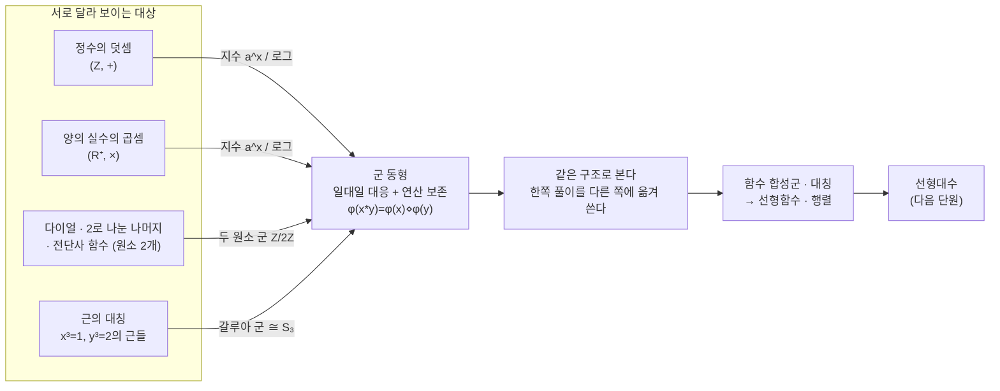

# 군의 관점에서 지수법칙 바라보기 (3기 5강)

이번 시간은 군을 "아는 개념"으로 정리하는 것이 아니라, 군이라는 관점이 실제로 무엇을 바꾸는지 보는 시간입니다.
지하철 순환선, 타일 패턴, 지수함수, 로그, 근의 공식이 모두 같은 질문으로 묶입니다.
전혀 다른 대상들을 언제 같은 구조로 볼 수 있는가?
그리고 그렇게 볼 때 무엇을 새로 할 수 있는가?

여기서 도구로 삼을 대상은 함수입니다.
정수의 덧셈을 양의 수의 곱셈으로 옮기는 지수함수, 여러 근을 서로 바꾸는 전단사 함수, 함수들의 합성으로 생기는 대칭군이 모두 등장합니다.
마지막에는 이 관점이 선형대수로 넘어가는 준비가 됩니다.

---

## [1. 2호선 순환선과 월페이퍼 그룹 · ▶ 00:30](https://www.youtube.com/watch?v=3RVlWG1J8Pk&t=30s)

참여자는 지하철 한 칸 이동을 연산처럼 볼 수 있지 않을까 생각합니다.
1호선처럼 끝이 있는 노선에서는 마지막 역 이후의 연산이 잘 정의되지 않습니다.
하지만 2호선처럼 순환하는 노선에서는 한 칸 이동을 계속 반복해도 다시 노선 안에 머뭅니다.

이 예시는 순환군의 감각을 줍니다.
한 칸 이동을 여러 번 합성하면 또 다른 이동이 되고, 한 바퀴를 돌면 항등원처럼 원래 자리로 돌아옵니다.
반대로 이동하는 것도 역원처럼 생각할 수 있습니다.

이 흐름에서 월페이퍼 그룹이 소개됩니다.
타일 무늬를 보존하는 평행이동, 회전, 반사 같은 변환들을 모아 함수의 합성을 연산으로 삼으면 군이 됩니다.
평면의 거리와 각도를 보존하는 변환들의 큰 군은 유클리드 군이고, 그중 타일 패턴을 보존하는 부분들이 월페이퍼 그룹입니다.

평면을 반복 타일로 채우는 방식은 무한히 많아 보이지만, 대칭 구조로 분류하면 17가지 타입으로 정리됩니다.
군은 여기서 "예쁜 이름"이 아니라 패턴을 분류하는 실제 도구입니다.

## [2. 관계를 넣으면 그룹 프레젠테이션이 된다 · ▶ 05:09](https://www.youtube.com/watch?v=3RVlWG1J8Pk&t=309s)

2호선이 완전히 단순한 원형이 아니라 지선이 있다는 지적도 나옵니다.
그러면 순환군 하나로 끝나지 않습니다.
어떤 방향으로 가면 돌아오고, 어떤 지점에서는 갈라지는 관계가 추가됩니다.

이때 "생성자와 관계"의 관점이 나옵니다.
어떤 기본 움직임들을 생성자로 두고, 그 움직임들이 만족해야 하는 관계를 함께 적습니다.
이런 방식으로 군을 설명하는 것을 그룹 프레젠테이션이라고 부릅니다.

월페이퍼 그룹도 이런 감각과 연결됩니다.
평행이동, 회전, 반사 같은 기본 변환이 있고, 그것들이 어떤 관계를 만족할 수 있는지 따져 가능한 군을 분류합니다.
결과적으로 평면 타일의 대칭 타입이 17개로 제한된다는 사실은, 관계를 넣어도 가능한 구조가 아무렇게나 폭발하지 않는다는 것을 보여 줍니다.

## [3. 군 조건 네 가지는 절대 명령이 아니다 · ▶ 06:03](https://www.youtube.com/watch?v=3RVlWG1J8Pk&t=363s)

참여자는 왜 군의 조건이 하필 네 가지인지 묻습니다.
닫힘, 결합법칙, 항등원, 역원이라는 조건이 너무 인위적으로 보일 수 있습니다.

답은 "반드시 이렇게 생각해야 하는 당위는 없다"입니다.
수학은 어떤 대상을 꼭 한 방식으로만 봐야 한다고 명령하지 않습니다.
우리가 군의 조건을 택한 이유는 이 조건들이 자연수·정수·유리수를 구분하고, 서로 다른 예시에서 같은 움직임을 포착하는 데 유용하기 때문입니다.

예를 들어 정수는 덧셈에 대해 군이지만 자연수는 그렇지 않습니다.
0을 뺀 유리수는 곱셈에 대해 군이지만 정수는 그렇지 않습니다.
이 조건들은 익숙한 수 체계의 차이를 드러내 줍니다.

따라서 군은 "수학의 본질은 반드시 이것이다"라는 말이 아닙니다.
여러 대상에서 반복되는 구조를 붙잡기 위해 택한 강력한 기준입니다.

> **💭 생각해볼 점** 여러분 중 한 분이 물었듯이, 왜 하필 군의 조건이 닫힘·결합법칙·항등원·역원의 네 가지일까요? 이렇게 봐야만 한다는 당위는 없습니다. 다만 이 네 조건을 기준으로 삼으면 자연수·정수·유리수가 덧셈·곱셈에 대해 군이 되는지가 갈리고, 서로 달라 보이는 예시에서 같은 움직임이 잡힙니다. 그 유용함이 이 조건을 택하는 이유입니다.

## [4. 지수함수는 덧셈을 곱셈으로 옮긴다 · ▶ 13:18](https://www.youtube.com/watch?v=3RVlWG1J8Pk&t=798s)

이제 오늘의 첫 중심 예시가 나옵니다.
정수 쪽에서는 덧셈을 생각하고, 0이 아닌 유리수나 양의 실수 쪽에서는 곱셈을 생각합니다.
이 두 연산을 이어 주는 함수는 무엇일까요?

전형적인 예가 지수함수입니다.
$f(x)=a^x$라고 하면
$f(x+y)=a^{x+y}=a^x a^y=f(x)f(y)$입니다. → 전사본 참조
정의역의 덧셈이 공역의 곱셈으로 보존됩니다.

이 관점에서 익숙한 지수법칙이 새롭게 보입니다.
$a^0=1$은 덧셈의 항등원 0을 곱셈의 항등원 1로 보내는 말입니다.
$a^{x+(-x)}=a^x a^{-x}=1$은 덧셈의 역원이 곱셈의 역원으로 옮겨지는 말입니다.

따라서 지수함수는 단순 계산 공식이 아닙니다.
두 군 구조를 서로 대응시키는 함수로 볼 수 있습니다.
로그함수는 그 대응을 거꾸로 읽는 함수입니다.

## [5. 같다고 볼 것인가, 다르다고 볼 것인가 · ▶ 18:07](https://www.youtube.com/watch?v=3RVlWG1J8Pk&t=1087s)

참여자는 묻습니다.
"같게 보면 무엇을 할 수 있나요?"
답은 단순하지만 큽니다.
하나를 이해하면 다른 하나도 그 구조 안에서는 이미 이해한 것으로 볼 수 있습니다.

정수의 덧셈과 양의 실수의 곱셈은 집합으로는 다릅니다.
정수와 양의 실수는 원소도 다르고 생김새도 다릅니다.
하지만 지수와 로그가 일대일 대응을 이루고 연산을 보존하면, 군으로서는 같은 구조라고 말할 수 있습니다.

이것을 군 동형이라고 부릅니다.
정확히는 두 군 사이에 일대일 대응이 있고, 그 함수가 연산을 보존할 때 두 군을 군으로서 같다고 봅니다.
여기서 "같다"는 말은 집합으로 완전히 같다는 뜻이 아니라, 선택한 구조를 기준으로 구분할 필요가 없다는 뜻입니다.

수학의 많은 힘은 이렇게 기준을 정해 "다른 것을 같게 보는" 데서 나옵니다.

> **💭 생각해볼 점** 여러분 중 한 분이 "같게 보면 그걸 이용해서 무엇을 할 수 있나요?"라고 물었습니다. 답은 단순하지만 큽니다. 두 군이 같다는 것은 하나를 이해하면 다른 하나도 이미 이해한 것이라는 뜻입니다. 한쪽에서 알아낸 사실과 풀이법을 그대로 다른 쪽으로 옮겨 쓸 수 있습니다.

## [6. 일대일 대응과 구조 보존이 함께 필요하다 · ▶ 20:02](https://www.youtube.com/watch?v=3RVlWG1J8Pk&t=1202s)

참여자는 연산을 보존하는 함수가 있으면 충분한지, 일대일 대응도 필요한지 묻습니다.
이 질문은 동형의 정의를 정확히 잡아 줍니다.

집합의 크기를 비교할 때는 일대일 대응이 기준이었습니다.
자연수와 정수, 자연수와 유리수가 같은 크기라고 말할 때도 일대일 대응을 썼습니다.
군으로서 같다고 말하려면 여기에 연산 보존이 더 붙습니다.

즉 두 집합 사이에 일대일 대응이 있고,
정의역에서 먼저 연산한 뒤 함수로 보낸 결과와,
각각 함수로 보낸 뒤 공역에서 연산한 결과가 같아야 합니다.
기호로는 $\phi(x*y)=\phi(x)\diamond\phi(y)$입니다.

이 기준이 있어야 "정수 덧셈"과 "양의 실수 곱셈"을 같은 군 구조로 볼 수 있습니다.
기준 없이 같다고 말하면 대화가 흐려지고, 기준을 세우면 어떤 의미에서 같은지 분명해집니다.

> **💭 생각해볼 점** 한 분이 물었듯이, 연산을 보존하는 함수가 있기만 하면 두 군을 같다고 할 수 있을까요, 아니면 일대일 대응까지 필요할까요? 둘 다 필요합니다. 집합의 크기를 비교할 때 쓰던 일대일 대응에 더해 연산 보존 $\phi(x*y)=\phi(x)\diamond\phi(y)$가 함께 성립해야 비로소 군으로서 같다고 말할 수 있습니다.

## [7. 세 가지 다른 예시가 같은 군이 되는 순간 · ▶ 27:05](https://www.youtube.com/watch?v=3RVlWG1J8Pk&t=1625s)

다음에는 원소가 두 개인 군의 예시들이 나옵니다.
첫째, 버튼이 두 개인 다이얼을 180도씩 돌리는 예시입니다.
한 번 돌리면 다른 자리로 가고, 두 번 돌리면 원래 자리로 돌아옵니다.

둘째, 정수를 2로 나눈 나머지입니다.
짝수류와 홀수류가 있고, 홀수류와 홀수류를 더하면 짝수류가 됩니다.
짝수류는 항등원처럼 움직입니다.

셋째, 원소가 두 개인 집합 $\{a,b\}$에서 자기 자신으로 가는 전단사 함수들입니다.
하나는 항등함수이고, 다른 하나는 $a$와 $b$를 서로 바꾸는 함수입니다.
바꾸기를 두 번 합성하면 항등함수가 됩니다.

이 세 예시는 수학적 대상은 다릅니다.
하나는 다이얼, 하나는 나머지, 하나는 함수입니다.
하지만 군으로서 움직이는 방식은 같습니다.
두 원소가 있고, 항등원이 하나 있으며, 다른 원소를 두 번 연산하면 항등원으로 돌아옵니다.

## [8. 존재한다와 구체적으로 안다는 것은 다르다 · ▶ 32:43](https://www.youtube.com/watch?v=3RVlWG1J8Pk&t=1963s)

참여자는 두 군 사이의 동형 함수가 반드시 있는지, 있다면 하나로 정해지는지 묻습니다.
여기서 "존재"와 "구체적 서술"이 갈라집니다.

수학에서는 어떤 함수가 존재한다는 사실만으로도 큰 정보가 될 수 있습니다.
하지만 존재한다는 말과 실제로 그 함수를 손에 잡히게 쓰는 것은 다릅니다.
예를 들어 어떤 두 집합 사이에 일대일 대응이 있다는 것을 알더라도, 그 대응을 명시적으로 만드는 일은 별도의 문제일 수 있습니다.

새로운 수학적 대상을 정의할 때도 비슷합니다.
어떤 성질을 만족하는 대상을 이름 붙였다고 해서 실제 예시가 있는 것은 아닙니다.
적어도 하나의 구체 예시가 있어야 그 클래스가 비어 있지 않음을 압니다.
예시가 두 개 이상이면, 그들 사이의 공통 구조를 비교할 수 있습니다.

이 감각은 군을 공부할 때도 계속 쓰입니다.
정의만 읽는 것보다, 실제 예시를 움직여 보고 그 대응이 무엇을 하는지 확인해야 구조가 보입니다.

> **💭 생각해볼 점** 한 분이 물었듯이, 두 군 사이의 동형 함수는 반드시 존재할까요? 있다면 하나로 정해질까요? 여기서 "존재한다"와 "구체적으로 손에 쥔다"가 갈라집니다. 일대일 대응이 있다는 사실을 알더라도 그 대응을 명시적으로 써 내는 일은 별개의 문제일 수 있습니다. 어떤 성질을 만족하는 대상에 이름을 붙였다고 해서 예시가 있는 것도 아닙니다. 적어도 하나의 구체 예시가 있어야 그 클래스가 비어 있지 않음을 알고, 둘 이상이면 그 사이의 공통 구조를 비교할 수 있습니다.

> **✏️ 연습문제** 실수 전체 $\mathbb{R}$와, 실수에서 원소를 한두 개 뺀 집합(예: $\mathbb{R}\setminus\{0\}$ 또는 $\mathbb{R}\setminus\{0,1\}$) 사이의 일대일 대응을 **구체적으로** 만들어 보세요. 존재한다는 것은 정리로 알려져 있으니, 직접 함수를 써 보고 원소들이 어떻게 옮겨지는지 따져 보면 됩니다.

## [9. 구조를 부여한 집합을 공간이라고 부른다 · ▶ 49:56](https://www.youtube.com/watch?v=3RVlWG1J8Pk&t=2996s)

참여자는 통계에서 자주 보는 "space"라는 단어가 이제 조금 와닿는다고 말합니다.
집합이 있고, 그 집합에 어떤 구조를 부여하면 공간이라고 부를 수 있느냐는 질문입니다.

답은 그렇습니다.
집합만 있으면 원소가 들어가는지 아닌지 정도를 말할 수 있습니다.
하지만 그 집합에 연산, 거리, 위상, 매끄러운 구조, 대수적 구조 등을 더하면 공간이 됩니다.

그래서 topological space, vector space, moduli space, manifold, algebraic variety 같은 말들이 나옵니다.
이들은 모두 "집합 + 추가 구조"라는 큰 틀 안에서 이해할 수 있습니다.

이때 공간이라는 말이 항상 눈에 보이는 도형만을 뜻하지는 않습니다.
정수, 함수들의 모임, 확률분포들의 모임도 적절한 구조를 주면 공간으로 볼 수 있습니다.

> **💭 생각해볼 점** 통계에서 자주 보던 "space"라는 말이 이제 무엇이었는지 와닿으시나요? 집합 하나만 있으면 원소가 들어가는지 아닌지 정도밖에 말할 수 없습니다. 그 위에 연산·거리·위상·매끄러운 구조·대수적 구조 같은 것을 얹으면 비로소 공간이 됩니다. topological space, vector space, moduli space, manifold가 모두 "집합 + 추가 구조"라는 한 틀입니다.

## [10. 기하와 대수는 멀리 떨어져 있지 않다 · ▶ 52:03](https://www.youtube.com/watch?v=3RVlWG1J8Pk&t=3123s)

공간이라는 말이 나오자, 참여자는 항상 기하학적 관점으로 볼 수 있는지 묻습니다.
답은 관점의 선택에 달려 있지만, 현대 수학의 큰 흐름에서는 대수와 기하가 깊게 얽혀 있습니다.

예를 들어 리만의 복소해석은 대수적 문제를 기하적으로 보는 길을 열었습니다.
연산을 두 개 가진 구조는 환이나 체가 되고, 그런 대수적 구조가 실제로 어떤 공간의 구조와 대응되는 경우가 많습니다.
산술기하라는 말도 여기서 나옵니다.
정수 같은 산술적 대상도 기하적 공간처럼 볼 수 있다는 뜻입니다.

허준이 받은 필즈상 업적도 조합론적 문제를 대수기하의 공간 관점으로 해석한 흐름과 연결됩니다.
단순히 비유로 "공간처럼 생각한다"가 아니라, 실제 수학에서 대수적 구조와 기하적 공간이 서로 번역됩니다.

오늘의 군 이야기도 이 큰 흐름의 작은 입구입니다.
함수들의 합성과 대칭을 보면, 숫자가 아닌 대상도 공간과 구조의 언어로 들어옵니다.

## [11. 공리는 무한을 긍정하는 방식이다 · ▶ 1:01:37](https://www.youtube.com/watch?v=3RVlWG1J8Pk&t=3697s)

이제 함수들의 군 구조로 돌아옵니다.
함수는 집합입니다.
함수들의 모임도 집합으로 다룰 수 있습니다.
그 위에 합성이라는 연산을 얹으면 군이 될 수 있습니다.

여기서 다시 공리 이야기가 나옵니다.
공리가 필요한 이유는 결국 무한을 다루기 위해서입니다.
유한한 경우에는 하나하나 확인하거나 세어 볼 수 있습니다.
하지만 무한이 등장하면, "그런 선택을 모두 동시에 할 수 있다" 같은 말을 그냥 직관으로 처리할 수 없습니다.

선택공리는 이런 무한한 선택을 긍정하는 방식 중 하나입니다.
다만 오늘의 메시지는 선택공리의 철학적 문장을 오래 붙드는 것이 아닙니다.
무한을 다룰 때 어느 지점에서 공리가 필요한지 보고, 그 이후에는 그 공리 위에서 어떤 구조가 만들어지는지 보는 것이 더 생산적이라는 입장입니다.

공리는 지하실처럼 계속 파고드는 대상이 아니라, 그 위에 어떤 건축물이 올라가는지 보게 하는 출발점입니다.

## [12. 전단사 함수들의 모임은 왜 군이 되는가 · ▶ 1:06:03](https://www.youtube.com/watch?v=3RVlWG1J8Pk&t=3963s)

같은 집합 $A$에서 자기 자신으로 가는 함수들을 생각합니다.
함수 합성을 연산으로 삼아 군을 만들고 싶다면, 항등함수와 역함수가 필요합니다.
따라서 아무 함수나 모으면 안 되고, 전단사 함수들을 모아야 합니다.

전단사 함수는 각 원소를 빠짐없이, 중복 없이 다른 원소로 보냅니다.
그래야 되돌리는 함수가 정의됩니다.
유한한 집합에서는 그림으로 쉽게 볼 수 있습니다.
각 원소가 서로 다른 원소로 가고, 공역의 모든 원소가 한 번씩 쓰이면 되돌릴 수 있습니다.

하지만 무한 집합에서는 "되돌릴 선택"이 까다로워질 수 있습니다.
어떤 값의 원래 원소를 하나씩 골라야 하는데, 그 선택이 무한히 많으면 선택공리의 문제가 나타납니다.

그래도 직관은 분명합니다.
같은 집합의 전단사 함수들을 모으면, 합성에 대해 닫혀 있고, 항등함수가 있고, 각 함수의 역함수가 있으며, 합성은 결합법칙을 만족합니다.
그래서 군이 됩니다.

## [13. 모든 줄을 엄밀히 맞추는 것보다 볼 대상을 잡기 · ▶ 1:12:44](https://www.youtube.com/watch?v=3RVlWG1J8Pk&t=4364s)

이 지점에서 공부 방법론이 다시 나옵니다.
수학을 배울 때 모든 줄을 처음부터 완벽하게 맞추려 하면, 정작 무엇을 보려는지 놓치기 쉽습니다.
엄밀함은 필요하지만, 엄밀함이 생각의 출발을 막아서는 안 됩니다.

비유로 코딩 이야기가 나옵니다.
코드를 짜다 에러가 나면 컴파일러가 알려 줍니다.
그때 고치면 됩니다.
물론 수학에는 컴파일러처럼 자동으로 알려 주는 장치가 없지만, 그래도 처음부터 모든 문장을 완벽히 닫으려 하기보다 내가 어떤 구조를 보려는지 잡는 것이 먼저입니다.

오늘의 구조는 함수 합성군입니다.
전단사 함수들의 합성이 군이 된다는 감각을 얻고, 그 감각이 지수법칙과 근의 공식에 어떻게 쓰이는지 보는 것이 목표입니다.

## [14. 지수법칙은 숫자 밖으로 확장될 수 있다 · ▶ 1:16:26](https://www.youtube.com/watch?v=3RVlWG1J8Pk&t=4586s)

다시 지수법칙으로 돌아옵니다.
숫자에 대해서는 $(a^x)^y=a^{xy}$를 알고 있습니다.
그런데 참여자는 중요한 질문을 던집니다.
"여기에 들어가는 대상이 숫자가 아니면 어떻게 되나요?"

이 질문이 오늘의 두 번째 큰 전환입니다.
집합 $A,X$가 있을 때 $A^X$를 $X$에서 $A$로 가는 함수들의 집합으로 정의합니다. → 전사본 참조
그러면 $A^{X\times Y}$는 $X\times Y$에서 $A$로 가는 함수들의 집합입니다.

한편 $(A^X)^Y$는 $Y$에서 $A^X$로 가는 함수들의 집합입니다.
즉 $y\in Y$ 하나를 넣으면, $X$에서 $A$로 가는 함수 하나가 나옵니다.
이것은 결국 $(x,y)$를 받아 $A$의 원소를 내놓는 함수와 같은 정보입니다.

그래서 함수의 세계에서도 지수법칙과 닮은 대응이 생깁니다.
$(A^X)^Y \cong A^{X\times Y}$입니다.
이것을 범주론적 지수의 아주 기본적인 감각으로 볼 수 있습니다.

> **💭 생각해볼 점** 여러분 중 한 분이 던진 물음이 오늘의 두 번째 전환점입니다. 숫자에 대해서는 $(a^x)^y=a^{xy}$를 알고 있는데, 지수와 밑 자리에 들어가는 것이 숫자가 아니면 어떻게 될까요? $A^X$를 "$X$에서 $A$로 가는 함수들의 집합"으로 정의해 보면, $(A^X)^Y$와 $A^{X\times Y}$가 같은 정보를 담아 $(A^X)^Y \cong A^{X\times Y}$가 됩니다. 익숙한 지수법칙이 숫자 밖으로 그대로 확장되는 것입니다.

## [15. 다변수 함수를 한 변수씩 받는 함수로 보기 · ▶ 1:33:55](https://www.youtube.com/watch?v=3RVlWG1J8Pk&t=5635s)

참여자는 이 이야기를 함수형 프로그래밍과 연결합니다.
두 변수를 받는 함수를, 한 변수를 받고 다시 함수를 내놓는 함수로 볼 수 있습니다.
예를 들어 $f(x,y)$를 $g(y)(x)$처럼 보는 방식입니다.

이 관점은 프로그래밍 언어에서 currying으로 익숙합니다.
하스켈 같은 함수형 언어에서는 함수가 값을 받아 또 다른 함수를 반환하는 방식이 자연스럽습니다.
수학적으로는 방금 본 $(A^X)^Y \cong A^{X\times Y}$의 감각과 연결됩니다.

중요한 점은, 우리가 이미 알고 있는 숫자의 지수법칙을 숫자가 아닌 함수의 세계로 옮겼다는 것입니다.
그냥 기호 장난이 아닙니다.
익숙한 법칙을 보존하도록 새로운 대상을 정의하면, 사고의 범위가 넓어집니다.

덧셈과 곱셈을 넘어서 함수, 집합, 공간 사이에서도 같은 모양의 법칙을 찾는 일이 수학의 큰 확장 방식입니다.

## [16. 갈루아 예시에서 선형대수로 넘어가는 길 · ▶ 1:39:10](https://www.youtube.com/watch?v=3RVlWG1J8Pk&t=5950s)

마지막 큰 예시는 근의 공식입니다.
$x^3=1$의 세 근은 복소평면의 단위원 위에서 120도씩 떨어진 세 점으로 볼 수 있습니다.
$y^3=2$의 세 근도 크기가 다른 원 위에서 120도씩 떨어진 세 점으로 볼 수 있습니다.

![$x^3=1$의 세 근은 단위원 위에, $y^3=2$의 세 근은 반지름 $\sqrt[3]{2}$인 원 위에 각각 120도 간격으로 놓인다. 갈루아 군은 유리수를 고정하고 덧셈·곱셈을 보존하면서 이 근들을 서로 옮기며, 그런 함수는 여섯 개로 $S_3$ 구조를 이룬다.](<03-season-assets/05/svg/cube-roots-complex-plane-03-season-05-16.svg>)

유리수에 이런 근들을 추가해 덧셈과 곱셈이 닫히도록 만든 체를 생각합니다.
그 체에서 유리수는 그대로 두고, 추가된 근들을 서로 옮기는 전단사 함수들을 봅니다.
이 함수들은 덧셈과 곱셈 구조를 보존해야 합니다.

겉보기에는 여러 선택지가 많아 보이지만, 실제로 조건을 만족하는 함수들은 여섯 개가 됩니다.
이 여섯 개는 군으로서 $S_3$와 같은 구조를 가집니다.
여기서 갈루아 군이 등장합니다.

방정식의 근을 구하는 문제는, 근들을 구조 보존적으로 바꾸는 함수들의 군을 이해하는 문제로 바뀝니다.
5차 이상에서 일반 근의 공식이 없는 이유도, 대칭군과 그 부분군 구조가 특정 방식으로 분해되지 않는다는 사실과 연결됩니다.

**1:45:38 이후, 이 관점이 실제로 쓸모 있는 이유.**

지수법칙과 갈루아 예시는 단순한 지적 장식이 아닙니다.
군이라는 관점은 실제로 어려운 문제를 바꾸어 풀게 해 줍니다.

지수함수는 덧셈 문제를 곱셈 문제로 옮기고, 로그는 곱셈을 덧셈으로 옮깁니다.
통계에서 곱의 likelihood에 로그를 취해 합으로 바꾸는 일도 이런 구조 보존의 감각과 닿아 있습니다.
곱셈으로 복잡한 식을 덧셈으로 옮기면 계산과 최적화가 쉬워집니다.

갈루아 이론에서는 방정식의 해법 문제를 근들의 대칭군 문제로 옮깁니다.
원래 문제에서 직접 보이지 않던 구조가, 다른 세계로 옮기면 분명해집니다.

그래서 군은 "군론을 공부하기 위해 있는 개념"이 아닙니다.
내가 관심 갖는 대상 이면에 어떤 대칭과 보존 구조가 있는지 보게 해 주는 도구입니다.

**1:55:04 이후, 용어보다 구체적 구조를 먼저 보기.**

참여자는 set, class, group, field, space, category 같은 단어들이 서로 헷갈린다고 말합니다.
이 반응은 자연스럽습니다.
오늘 나온 단어들은 모두 큰 세계의 입구이고, 한 번에 정리될 수 없습니다.

하지만 지금 더 중요한 것은 용어 목록을 외우는 것이 아닙니다.
자연수, 정수, 유리수라는 익숙한 대상에 덧셈과 곱셈을 얹어 보니 새로운 차이가 보였다는 사실입니다.
함수들을 모아 합성해 보니 군이 되었고, 그 군으로 근의 대칭을 보게 되었다는 사실입니다.

용어는 나중에 정확히 붙이면 됩니다.
먼저 필요한 것은 "내가 어떤 구조를 보고 있는가"입니다.
집합 위에 연산을 얹었는가?
그 연산이 군 조건을 만족하는가?
두 구조 사이의 함수가 연산을 보존하는가?
이 질문들이 용어보다 먼저 움직여야 합니다.

**1:57:42 이후, 구조를 낯설게 보는 감각.**

한 참여자는 지수함수의 그래프를 떠올립니다.
$x$축에서는 덧셈이 균일하게 보이고, $y$축에서는 곱셈이 균일하지 않게 보입니다.
그래서 처음에는 두 구조를 같게 본다는 말이 걸렸다고 합니다.

하지만 $y$축의 눈금을 로그 눈금으로 바꾸면 곱셈이 덧셈처럼 보입니다.
지수 그래프가 직선처럼 보이는 관점이 생깁니다.
이것은 두 군을 같게 본다는 말의 좋은 시각적 비유입니다.

어떤 대상이 익숙하다는 것은, 사실 익숙한 좌표와 눈금으로 보고 있다는 뜻일 수 있습니다.
좌표를 바꾸고, 구조를 바꾸고, 보존되는 것을 다르게 잡으면 같은 대상이 낯설어집니다.
그 낯섦이 수학 공부의 중요한 신호입니다.

**2:01:53 이후, 선형대수로 넘어가는 길.**

마지막 정리는 다음 단원으로 이어집니다.
지금까지 집합에 구조를 주는 방식으로 새로운 관점을 만들었습니다.
그중 함수 합성은 군 구조를 만드는 대표적인 예였습니다.

이제 가장 다루기 쉬운 함수들을 보게 됩니다.
바로 선형함수입니다.
선형함수는 합성과 행렬로 표현되며, 함수의 관점과 대수의 관점이 만나는 대상입니다.

선형대수는 단순히 행렬 계산을 배우는 과목이 아닙니다.
함수들의 합성, 공간의 변환, 대칭과 구조를 가장 기본적인 형태로 공부하는 장입니다.
그래서 지금까지의 군·함수 이야기가 선형대수로 이어집니다.

이 흐름의 마지막에는 미적분, 리만의 관점, 그리고 통계의 기하까지 연결됩니다.
목표는 모든 지식을 한 번에 아는 것이 아니라, 익숙한 대상 안에 낯선 구조가 숨어 있다는 감각을 얻는 것입니다.

## 요약

이번 시간은 군을 추상적 정의로 끝내지 않고, 실제로 다른 대상을 같게 보게 하는 기준으로 사용했습니다.
2호선 순환선, 월페이퍼 그룹, 정수의 덧셈과 양의 수의 곱셈, 다이얼과 나머지와 전단사 함수의 예시가 모두 같은 방향을 보였습니다.

군 동형은 두 집합 사이에 일대일 대응이 있고 연산이 보존될 때, 두 대상을 군으로서 같게 보는 기준입니다.
지수함수와 로그는 덧셈과 곱셈을 서로 옮기는 대표적인 예시입니다.

함수들의 관점에서는 지수법칙도 숫자를 넘어 확장됩니다.
$A^X$를 $X$에서 $A$로 가는 함수들의 집합으로 보면, $(A^X)^Y$와 $A^{X\times Y}$가 같은 정보를 담는다는 새로운 형태의 지수법칙이 나타납니다.

갈루아 예시는 방정식의 근을 구하는 문제가 근들을 구조 보존적으로 바꾸는 함수들의 군 문제로 바뀐다는 것을 보여 주었습니다.
다음 선형대수 단원은 이런 함수 합성의 관점을 가장 구체적이고 계산 가능한 형태로 다루게 됩니다.

오늘 흘러온 큰 줄거리 — 서로 달라 보이는 대상들이 "군 동형"이라는 한 기준으로 묶이고, 그 관점이 선형대수로 이어집니다.

