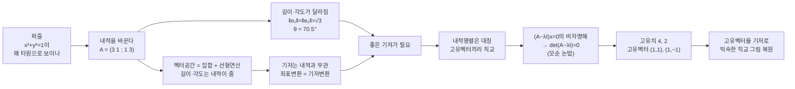

# 선형대수: 벡터공간의 기저, 내적과 고유치, 고유벡터 (뉴진수 1강)

이번 시간은 슬랙에 올라온 질문들을 차례로 따라가는 디스커션입니다. 내적을 바꾸면 $x^2+y^2=1$이 왜 타원으로 보이는가에서 출발해, 벡터공간은 본래 길이와 각도가 없는 집합일 뿐이라는 점을 확인하고, 마지막에 내적 행렬 $\begin{pmatrix}3&1\\1&3\end{pmatrix}$로 고유치·고유벡터를 직접 구하면서 "왜 $\det(A-\lambda I)=0$이어야 하는가"와 "그 고유벡터들이 왜 좋은 기저가 되는가"를 풉니다.

오늘의 논리 흐름을 한눈에:

---

## [0. 오늘은 슬랙 질문을 함께 풉니다 · ▶ 00:00](https://www.youtube.com/watch?v=J4ZmFqUTWwY&t=0s)

오늘은 이번 주에 슬랙에 올라온 질문들을 하나씩 꺼내서 의견을 나눠 보겠습니다. 제가 올린 질문이 먼저인데, "고유벡터와 고유치를 구하려면 행렬식이 $0$이 되어야 한다는데, $0$이 되어야 한다는 말이 무슨 뜻인가"가 잘 와닿지 않았습니다. 이 물음은 오늘 마지막에 직접 계산으로 다시 풀 테니 일단 적어 두고 넘어가겠습니다.

> **💭 생각해볼 점** 고유벡터·고유치를 구할 때 왜 하필 "행렬식이 $0$"이라는 조건이 등장하는가? 이 한 줄이 오늘의 출발 질문이고, 7번 섹션에서 모순 논법으로 답합니다.

---

## [1. "내적을 계산하는 것"도 선형결합이라 부를 수 있나 · ▶ 01:42](https://www.youtube.com/watch?v=J4ZmFqUTWwY&t=102s)

여러분 중 한 분이 이런 질문을 주셨습니다. 벡터끼리 섞는 것을 흔히 선형결합이라 부르는데, 내적을 계산할 때도 벡터를 행렬의 곱으로 늘어놓고 계산하니, 그러면 내적을 계산하는 일도 선형결합이라고 주장해도 되느냐는 것입니다.

여기서 한 가지를 구분해 둡시다. 내적 $\langle u,v\rangle$는 두 벡터를 받아 **하나의 실수**를 내놓는 함수입니다. 좌표로 쓰면 $\langle u,v\rangle = u^\top A\,v$ 꼴로, 행렬 $A$를 가운데 두고 양옆에 벡터를 곱하는 모양이 됩니다. 모양이 행렬 곱이라서 선형결합처럼 보이지만, 선형결합은 벡터들을 섞어 다시 **벡터**를 만드는 연산이고 내적은 **실수**를 뽑아내는 연산이라는 점에서 결과가 사는 곳이 다릅니다. 같은 슬롯에 대해 각 변수마다 선형이라는 성질(이중선형성)은 공유하지만, "내적을 계산하는 것 = 선형결합"이라고 한 줄로 말해 버리면 오해가 생깁니다.

> **💭 생각해볼 점** 내적을 좌표로 풀면 $u^\top A v$처럼 행렬 곱으로 나타나는데, 그렇다고 내적 계산을 곧 "선형결합"이라 불러도 되는가? 두 연산이 내놓는 대상(벡터 vs 실수)을 먼저 보면 답이 정리됩니다.

---

## [2. 내적을 바꾸면 $x^2+y^2=1$이 타원으로 보인다 · ▶ 09:23](https://www.youtube.com/watch?v=J4ZmFqUTWwY&t=563s)

내적이 각도와 거리를 정한다는 이야기를 그림으로 보겠습니다. 노트에 있는 그림인데, 여러분 중 한 분이 이 그림이 혼동된다고 적어 주셨습니다. 원래 수직으로 만나는 좌표 위에 타원을 그린 것인지, 아니면 공간 자체가 변한 것인지 헷갈린다는 것입니다.

내적 행렬을 $\begin{pmatrix}3&1\\1&3\end{pmatrix}$로 주고 직접 계산해 봅시다. 표준 점곱이 아니라 이 행렬로 정의한 내적입니다.

$$
\langle (1,0),(1,0)\rangle = \begin{pmatrix}1&0\end{pmatrix}\begin{pmatrix}3&1\\1&3\end{pmatrix}\begin{pmatrix}1\\0\end{pmatrix} = 3,
\qquad
\langle (0,1),(0,1)\rangle = 3,
$$

$$
\langle (1,0),(0,1)\rangle = \begin{pmatrix}1&0\end{pmatrix}\begin{pmatrix}3&1\\1&3\end{pmatrix}\begin{pmatrix}0\\1\end{pmatrix} = 1.
$$

그러면 $(1,0)$의 크기는 $\sqrt3$, $(0,1)$의 크기도 $\sqrt3$이고, 사잇각은

$$
\cos\theta = \frac{\langle (1,0),(0,1)\rangle}{\|(1,0)\|\,\|(0,1)\|} = \frac{1}{\sqrt3\cdot\sqrt3} = \frac13
$$

이라서 $\theta \approx 70.5^\circ$가 됩니다. 표준 내적이라면 $(1,0)$과 $(0,1)$은 직교($90^\circ$)인데, 내적을 바꾸자 길이가 $\sqrt3$로 늘고 각도가 $70.5^\circ$로 줄었습니다.

이제 $x^2+y^2=1$을 만족하는 순서쌍 $(x,y)$를 이 공간에 모아 찍어 보면, 우리 눈에 익은 단위원이 아니라 찌그러진 타원이 나옵니다. 그림: 기울어진 좌표 위에 빨간 타원이 그려져 있고, 장축과 단축의 길이가 서로 다릅니다. 여기서 버려야 할 선입견은 "$x^2+y^2$은 원점에서 $(x,y)$까지의 거리"라는 생각입니다. 그 식은 내적을 바꾼 공간에서는 더 이상 거리를 나타내지 않습니다.

> **💭 생각해볼 점** 노트에 적힌 $x^2+y^2=1$의 그래프(집합)는 어떤 내적에서든 항상 같은 점들의 모임이라 "단위원"으로 그려진다. 그런데 그 점들의 **거리가 $1$**인지는 내적에 따라 달라진다 — 그래서 "거리가 $1$인 점들"을 모으면 타원이 될 수 있다. "방정식을 만족하는 점"과 "거리가 $1$인 점"을 섞어 말하면 혼란이 생깁니다.

---

## [3. 벡터공간은 길이도 각도도 없는 집합일 뿐 · ▶ 25:54](https://www.youtube.com/watch?v=J4ZmFqUTWwY&t=1554s)

이 혼동을 풀려면 처음으로 돌아가야 합니다. $\mathbb{R}^2$는 벡터공간이기 전에 순서쌍 $(x,y)$를 모아 놓은 **집합**입니다. 그냥 아무렇게나 모은 집합이 벡터공간이 되지는 않고, 덧셈과 스칼라곱에 대해 닫혀 있어야 합니다. 그 조건을 따라가 보면, $(0,0)$이 있어야 하고, $(1,0)$이 있으면 $(x,0)$ 꼴이 모두 있어야 하고, $(0,1)$이 있으면 $(0,y)$ 꼴이 모두 있어야 하며, 덧셈에 닫혀 있으니 결국 모든 $(x,y)$가 다 들어와야 합니다.

여기서 중요한 점이 있습니다. 우리는 이 이야기를 하면서 이미 머릿속으로 직선을 상상하고, $(1,0)$과 $(0,1)$ 사이에 $(0.5,0)$이 가운데 있을 거라고 생각합니다. 선형성을 직선으로 상상하는 것까지는 괜찮습니다. 그런데 우리는 거기서 한 걸음 더 나가서 "$(1,0)$이니까 길이는 $1$, $(0,1)$이니까 길이도 $1$, 둘 사이 각도는 $90^\circ$"라는 상상까지 미리 해 버립니다. 그런 말은 한 번도 한 적이 없는데도 말이죠.

원래 주어진 것은 집합과 선형연산뿐입니다. 그러니 이 안에는 직선이 아주 많이 들어 있을 뿐이고, 그 직선들에 **눈금(길이)을 준 적도, 두 직선 사이의 각도기를 준 적도 없습니다.** 길이와 각도는 내적을 줘야 비로소 생깁니다.

이 그림에서 $(1,1)$이 평행사변형의 꼭짓점쯤에 있을 거라는 상상조차도, 사실 내적(또는 좌표)을 정하기 전에는 단정할 수 없습니다. 다만 뒤에서 이 그림을 실제 좌표로 만들 것이므로, 그때는 그런 위치를 말해도 된다고 보고 넘어가겠습니다.

> **💭 생각해볼 점** 여러분 중 한 분이 "공간이 어떻게 생겼는지도 모르는데 어떻게 선형성이 깨진다고 말할 수 있는가"라고 물었습니다. 맞는 지적입니다 — 내적을 주기 전까지 우리는 길이도 각도도 모릅니다. $(1,1)$을 평행사변형 꼴로 찍는 것이 어디까지 우리가 임의로 둔 약속이고 어디부터가 강제되는 사실인지를 분명히 구분해 봅시다.

---

## [4. 기저는 내적과 무관하게 항상 있다 — 좌표 변환과 기저 변환은 같은 말 · ▶ 33:00](https://www.youtube.com/watch?v=J4ZmFqUTWwY&t=1980s)

여기서 기저에 대한 질문이 나왔습니다. 기저가 좌표축을 정해 주는 것 아니냐는 것입니다. 정리하면 이렇습니다. 벡터공간의 원소들이 $(1,0)$, $(0,1)$의 선형결합으로 표현된다는 것까지가 "기저"라는 말의 뜻입니다. 그다음에 그 기저 벡터의 길이가 얼마이고 각도가 얼마인지는 **또 다른 문제**이고, 그것은 내적이 관여하는 부분입니다.

그래서 기저의 존재는 선형변환에도, 내적에도 의존하지 않습니다. 함수가 없어도 집합과 선형연산만 있으면 기저와 선형결합으로 벡터공간의 원소를 모두 만들 수 있습니다. 다만 우리가 $\mathbb{R}^2$를 다루는 한, 좌표 표현을 쓰는 순간 사실상 표준기저 $(1,0)$, $(0,1)$을 항상 깔고 가는 셈이라는 점은 기억해 둡니다(8번 섹션에서 다시 짚습니다). 그리고 좌표 변환과 기저 변환은 같은 말입니다 — 판판한 판때기에 어떤 좌표를 쓰느냐의 문제가 곧 기저를 바꾸는 문제입니다.

> **💭 생각해볼 점** 기저가 두 벡터 사이의 각도와 상관이 있는가? — 상관이 없습니다. 기저는 "그것들을 선형결합해서 공간의 원소를 만들어낸다"까지를 말할 뿐, 사이의 각도는 내적이 없으면 말할 수 없습니다. "기저가 있다"와 "기저 벡터의 길이가 똑같이 $1$이다"는 서로 다른 주장입니다.

---

## [5. 그러면 다른 내적을 줬을 때 그림은 어떻게 그리나 · ▶ 55:00](https://www.youtube.com/watch?v=J4ZmFqUTWwY&t=3300s)

"내적을 바꿨을 때 그림을 어떻게 그려야 하는가"라는 질문에 대한 답이 정확히 고유치와 고유벡터입니다. 변화를 보려면 비교할 기준이 있어야 합니다. 우리가 익숙한 $(1,0)$, $(0,1)$로 직교 좌표를 찍어 두고, 다른 내적을 준 다음, 그 내적이 주는 **좋은 기저**를 찾아서 함께 그려 비교하는 것입니다.

그 "좋은 기저"가 바로 내적 행렬의 고유벡터입니다. 내적을 바꾼다는 말과 좋은 기저를 찾는다는 말이 똑같은 뜻은 아니지만, 떼어서 생각하기 어렵게 얽혀 있습니다. 우리가 결국 하고 싶은 것은 계산이고, 계산을 효율적으로 하려면 좋은 기저가 필요한데, 그 좋은 기저를 잡는 일이 고유벡터를 찾는 일과 같습니다. (계산을 쉽게 만든다는 점에서 이것은 대각화와도 모두 연결됩니다.)

> **💭 생각해볼 점** 직교좌표계를 그려 놓고 거기에 "내적이 변했다"며 좌표를 찍는 일이 왜 이질적으로 느껴지는가? 비교의 기준($(1,0),(0,1)$)과, 새 내적이 주는 좋은 기저(고유벡터)를 한 화면에 같이 두고 본다는 점을 짚으면 그 이질감이 풀립니다.

---

## [6. 내적 행렬은 대칭행렬 — 고유벡터가 서로 직교 · ▶ 1:00:42](https://www.youtube.com/watch?v=J4ZmFqUTWwY&t=3642s)

여기서 쓰는 사실 하나를 정리합니다. **대칭행렬의 고유값은 모두 실수이고, 서로 다른 고유값에 대응하는 고유벡터는 서로 직교한다.** 우리가 다루는 내적 행렬 $\begin{pmatrix}a&b\\b&c\end{pmatrix}$는 항상 대칭행렬이므로 (대칭성 조건 때문에 비대각 성분이 같습니다 → [전사본 참조](<../08-linalg-4-spectral/08. Linear Algebra Part 4 - The Spectral (Rainbow) Theorem.md>)), 이 사실이 그대로 적용됩니다.

여기서 "직교"는 표준(스탠다드) 내적으로 두 고유벡터의 내적을 계산했을 때 $0$이 된다는 뜻입니다. 즉 비교 기준이 되는 원래 내적에서 직교한다는 의미입니다. (지금은 실수 성분의 $\mathbb{R}^2$ 행렬만 생각하고 있습니다.)

> **💭 생각해볼 점** "직각"이라는 말 자체가 어떤 내적을 기준으로 한 것인가? 두 고유벡터가 직교한다고 할 때의 내적은 새로 준 내적이 아니라 원래의 표준 내적으로 고정한 것입니다 — 직교란 그 내적값이 $0$이라는 뜻임을 분명히 해 둡니다.

---

## [7. 예제: 왜 $\det(A-\lambda I)=0$인가 (모순 논법) · ▶ 1:03:36](https://www.youtube.com/watch?v=J4ZmFqUTWwY&t=3816s)

이제 0번에서 적어 둔 질문을 직접 풉니다. 내적 행렬을 $A=\begin{pmatrix}3&1\\1&3\end{pmatrix}$로 두고, 고유값 문제 $A\mathbf{x}=\lambda\mathbf{x}$를 생각합니다. $\mathbf{x}=(x,y)$를 넣으면

$$
\begin{pmatrix}3&1\\1&3\end{pmatrix}\begin{pmatrix}x\\y\end{pmatrix}
=\begin{pmatrix}3x+y\\ x+3y\end{pmatrix},
$$

이고 $A\mathbf{x}=\lambda\mathbf{x}$에서 우변을 왼쪽으로 넘겨 정리하면

$$
\begin{pmatrix}3-\lambda & 1\\ 1 & 3-\lambda\end{pmatrix}\begin{pmatrix}x\\y\end{pmatrix}=\begin{pmatrix}0\\0\end{pmatrix}.
$$

이때 우리가 찾고 싶은 것은 $0$이 되어 버리는 자명한 해가 아니라, **$(x,y)\neq(0,0)$인 해**입니다(고유벡터는 정의상 영벡터가 아닙니다). 이 부분을 우리가 던진 질문, 즉 "왜 행렬식이 $0$이어야 하는가"의 답으로 모순 논법으로 정리합니다.

행렬 $M=\begin{pmatrix}3-\lambda&1\\1&3-\lambda\end{pmatrix}$이라 두겠습니다. 만약 $\det M \neq 0$이면 $M$의 역행렬이 존재하므로, 양변 왼쪽에 $M^{-1}$을 곱하면

$$
\mathbf{x}=M^{-1}\begin{pmatrix}0\\0\end{pmatrix}=\begin{pmatrix}0\\0\end{pmatrix}
$$

이 되어 $\mathbf{x}=(0,0)$만 남습니다. 그런데 우리는 처음에 $\mathbf{x}\neq(0,0)$을 찾기로 했으니 모순입니다. 따라서 영벡터가 아닌 고유벡터가 존재하려면 역행렬이 있으면 안 되고, 곧

$$
\det(A-\lambda I)=\det M = 0
$$

이어야 합니다. 이것이 "행렬식이 $0$이 되어야 한다"의 정확한 이유입니다.

이 조건 $\det(A-\lambda I)=0$을 풀어 $\lambda$를 구하고, 각 $\lambda$를 다시 넣어 $(x,y)$를 찾습니다. 영상에서는 한 번 $\lambda$의 값을 더듬으며 말씀드렸는데, 정확한 고유값은 $\lambda=4$와 $\lambda=2$입니다($\det\begin{pmatrix}3-\lambda&1\\1&3-\lambda\end{pmatrix}=(3-\lambda)^2-1=\lambda^2-6\lambda+8=0$ → [전사본 참조](<../08-linalg-4-spectral/08. Linear Algebra Part 4 - The Spectral (Rainbow) Theorem.md>)). 고유벡터를 구하면, $\lambda$를 넣은 식 $\,x=y\,$ 또는 $\,x=-y\,$가 나오므로

$$
\mathbf{x}=(1,1)\ \ (\lambda=4),\qquad \mathbf{x}=(1,-1)\ \ (\lambda=2)
$$

를 얻습니다(스칼라배는 모두 같은 고유벡터입니다).

> **💭 생각해볼 점** 여러분 중 한 분이 "디터미넌트가 $0$이 아니어야 역행렬이 있는 것 아니냐, 뭔가 사기당한 것 같다"고 하셨습니다. 바로 그 지점입니다 — 논리의 시작점이 "$0$이 아닌 해를 찾는다"이기 때문에, 역행렬이 있으면(=$\det\neq0$) 해가 $0$뿐이 되어 모순이 생기고, 그래서 거꾸로 $\det=0$이 강제됩니다. 이 방향(원하는 결론이 아니라 모순을 통해 조건이 강제되는 흐름)을 직접 따라가 봅시다.

---

## [8. 고유벡터를 기저로 — 익숙한 그림을 되찾는다 · ▶ 1:42:24](https://www.youtube.com/watch?v=J4ZmFqUTWwY&t=6144s)

구한 두 고유벡터로 내적을 직접 확인해 봅니다. 내적 행렬 $\begin{pmatrix}3&1\\1&3\end{pmatrix}$로

$$
\langle (1,1),(1,-1)\rangle
=\begin{pmatrix}1&1\end{pmatrix}\begin{pmatrix}3&1\\1&3\end{pmatrix}\begin{pmatrix}1\\-1\end{pmatrix}=0
$$

이라서 두 고유벡터는 (이 내적에서) 직교합니다. 반면 원래의 $(1,0)$과 $(1,1)$의 내적은

$$
\langle (1,0),(1,1)\rangle=\begin{pmatrix}1&0\end{pmatrix}\begin{pmatrix}3&1\\1&3\end{pmatrix}\begin{pmatrix}1\\1\end{pmatrix}=4 \neq 0
$$

이라 직교하지 않습니다. 그래서 새 내적을 준 공간에서는 $(1,0)$, $(0,1)$을 생각하는 것이 의미가 떨어집니다 — 서로 직교하지도 않으니까요.

이제 정리해 봅니다. 다른 내적을 주고도 우리에게 익숙한 "직교하는 $x$축·$y$축" 그림을 그리고 싶다면, 그 내적에서 직교가 되는 기저, 즉 고유벡터 $v_1=(1,1)$, $v_2=(1,-1)$를 새 좌표축으로 쓰면 됩니다. 두 벡터의 길이는 내적으로 잴 수 있는데,

$$
\langle (1,1),(1,1)\rangle=8,\qquad \langle (1,-1),(1,-1)\rangle=4
$$

이므로 각각 길이가 $\sqrt8$, $\sqrt4=2$입니다(필요하면 이 길이로 나눠 정규화해서 단위 기저로 씁니다). 길이가 서로 달라서, 두 고유벡터를 더하고 빼서 만든 벡터들은 다시 직교하지 않습니다 — 길이가 같았다면 직교했을 텐데, 여기서는 그렇지 않습니다.

마지막으로 한 가지를 분명히 합니다. $\mathbb{R}^2$에서 시작하는 한, 내적을 $\begin{pmatrix}3&1\\1&3\end{pmatrix}$처럼 행렬로 쓰는 것 자체, 그리고 점을 $(x,y)$ 좌표로 쓰는 것 자체가 이미 표준기저 $(1,0)$, $(0,1)$을 가정하고 있다는 뜻입니다. 처음에 "우리는 항상 기저 $(1,0)$, $(0,1)$을 깔고 간다"고 말한 것이 바로 여기에도 묻어 있습니다. 구체적인 좌표 세계와 추상적인 벡터공간을 둘 다 알고 있으면 이 지점이 계속 헷갈리는데, 좌표 표현을 쓰는 순간 표준기저를 전제한 것이라고 정리해 두면 혼란이 줄어듭니다.

> **💭 생각해볼 점** 여러분 중 한 분이 "$\mathbb{R}^2$의 원소 $(x,y)$ 앞에 행렬을 바로 곱할 수 있는가, 아니면 좌표로 바꾸는 변환을 한 번 더 거쳐야 하는가"라고 물었습니다. 답은, $(x,y)$를 좌표로 쓰고 $\begin{pmatrix}3&1\\1&3\end{pmatrix}$을 그대로 곱하는 것은 **표준기저로 표현한 내적**을 보고 있는 것이라 별도의 변환이 필요 없다는 것입니다 — 단, 그 표현이 표준기저를 전제하고 있음을 의식해야 합니다.

---

## 요약

- 내적 행렬을 $\begin{pmatrix}3&1\\1&3\end{pmatrix}$로 바꾸면 $(1,0)$, $(0,1)$의 길이가 $\sqrt3$, 사잇각이 $\cos\theta=\tfrac13$($\approx70.5^\circ$)이 되어, $x^2+y^2=1$이 단위원이 아니라 타원으로 보인다.
- "$x^2+y^2$은 원점까지의 거리"라는 선입견을 버려야 한다. 그 식이 거리를 나타내는지는 내적에 따라 달라진다.
- 벡터공간은 본래 집합 + 선형연산일 뿐이다. 길이와 각도는 내적을 줘야 비로소 생긴다. 기저의 존재는 내적·선형변환과 무관하며, 좌표 변환과 기저 변환은 같은 말이다.
- 내적 행렬은 대칭행렬이므로, 그 고유값은 실수이고 고유벡터는 (원래 내적에서) 서로 직교한다.
- 고유벡터가 영벡터가 아니어야 하므로 $(A-\lambda I)\mathbf{x}=0$이 비자명한 해를 가져야 하고, 역행렬이 있으면 $\mathbf{x}=0$만 남아 모순이 된다. 따라서 $\det(A-\lambda I)=0$이 강제된다.
- $\begin{pmatrix}3&1\\1&3\end{pmatrix}$의 고유값은 $4,2$, 고유벡터는 $(1,1),(1,-1)$이며 서로 직교한다. 이들을 기저로 쓰면 바뀐 내적의 공간에서도 익숙한 직교 좌표 그림을 되찾을 수 있다.
- $\mathbb{R}^2$에서 좌표·행렬 표현을 쓰는 것 자체가 이미 표준기저 $(1,0)$, $(0,1)$을 전제한다.
