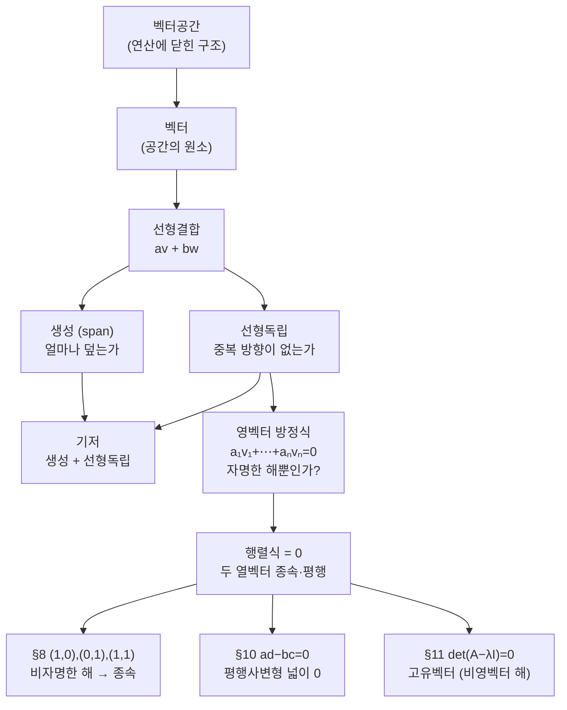

# 벡터공간에서 선형독립과 기저의 의미에 대하여 (뉴진수 2강)

이번 시간은 여러분이 올려 주신 세 가지 질문을 차례로 따라갑니다. 첫째, 2차원 공간의 벡터들은 어떤 벡터들의 선형결합으로 만들어지는 것인가. 둘째, 선형독립의 정의에서 왜 영벡터를 우변에 두고 비자명한 계수를 찾는가. 셋째, 행렬식 $ad-bc=0$이라는 말이 선형독립, 기저, 고유벡터 문제에서 어떻게 같은 얼굴로 다시 나타나는가입니다.

---

## [0. 세 질문을 한꺼번에 꺼냅니다 · ▶ 12:42](https://www.youtube.com/watch?v=eSSA2AflYug&t=762s)

여러분 중 한 분이 지난 내용을 혼자 보다가 세 지점에서 막혔다고 적어 주셨습니다. 오늘은 그 세 질문을 그대로 칠판에 옮겨 놓고 함께 풀어 가겠습니다.

첫 질문은 "2차원 공간에 있는 벡터들은 어떤 벡터들의 선형결합으로 만들어진 것인가"입니다. 여기에는 두 층위가 섞여 있습니다. 하나는 벡터공간이 먼저 있느냐 벡터들이 먼저 있느냐이고, 다른 하나는 기저가 주어졌을 때 모든 벡터가 기저의 선형결합으로 표현된다는 사실입니다.

두 번째 질문은 선형독립의 정의입니다. 왜

$$
a_1v_1+\cdots+a_nv_n=0
$$

을 놓고, 모든 계수가 $0$인지 아닌지를 보는지 묻습니다.

세 번째 질문은 행렬식입니다. $2\times2$ 행렬에서

$$
ad-bc=0
$$

이면 두 열벡터가 평행하다고 배웠는데, 이 사실이 고유벡터 계산의 $\det(A-\lambda I)=0$과 어떻게 이어지는지 확인합니다.

> **💭 생각해볼 점** "2차원 공간의 벡터들은 어떤 벡터들의 선형결합으로 만들어진 것인가?" 이 물음이 어렵게 느껴지는 까닭은 두 질문이 한 문장에 겹쳐 있기 때문입니다. 벡터공간이 먼저인지 벡터가 먼저인지, 그리고 기저가 있을 때 모든 벡터가 그 선형결합으로 적히는지를 따로 떼어 놓고 보아야 합니다.

---

## [1. 집합과 벡터공간을 먼저 구분합니다 · ▶ 14:38](https://www.youtube.com/watch?v=eSSA2AflYug&t=878s)

먼저 짚을 것은 아무 집합이나 벡터공간은 아니라는 점입니다.

예를 들어

$$
S=\{(0,0),(1,1),(1,3),(-1,2)\}
$$

라는 네 점의 집합을 생각해 봅시다. 이 집합은 원소를 갖고 있지만 벡터공간이라고 부르기는 어렵습니다. $(1,1)$이 들어 있다면 스칼라곱에 의해 $(2,2)$도, $(-1,-1)$도 들어 있어야 하고, $(1,1)$과 $(1,3)$이 들어 있다면 덧셈에 의해 $(2,4)$도 들어 있어야 하기 때문입니다.

벡터공간은 원소의 모음일 뿐 아니라 연산에 대해 닫혀 있어야 합니다. 덧셈과 스칼라곱을 해도 그 결과가 다시 같은 집합 안에 있어야 합니다. 그래서 벡터공간을 말할 때는 "점들이 모여 있다"가 아니라 "선형연산을 해도 무너지지 않는 구조"를 말하는 것입니다.

---

## [2. R^2의 부분공간은 생각보다 제한적입니다 · ▶ 17:20](https://www.youtube.com/watch?v=eSSA2AflYug&t=1040s)

$\mathbb{R}^2$ 안에서 벡터공간이 될 수 있는 부분집합은 마음대로 생기지 않습니다. 가능한 대표적인 모양은 세 가지입니다.

첫째, 영벡터 하나만 있는 공간 $\{(0,0)\}$입니다.

둘째, 원점을 지나는 직선입니다. 예를 들어

$$
\{t(1,2):t\in\mathbb{R}\}
$$

은 덧셈과 스칼라곱에 대해 닫혀 있습니다.

셋째, 평면 전체 $\mathbb{R}^2$입니다.

원점을 지나지 않는 직선은 벡터공간이 아닙니다. 점 두 개만 골라 놓은 집합도 보통 벡터공간이 아닙니다. 이렇게 보면 "벡터들이 선형결합으로 공간을 만든다"는 말은 기저나 생성집합이 있을 때의 말이고, 벡터공간의 정의 자체는 먼저 연산 구조를 요구합니다.

---

## [3. 벡터는 벡터공간의 원소라는 이름입니다 · ▶ 19:46](https://www.youtube.com/watch?v=eSSA2AflYug&t=1186s)

닭과 달걀처럼 느껴지는 지점이 있습니다. "벡터들이 모여서 벡터공간이 됩니까, 벡터공간 안에 있으므로 벡터입니까?"

수학의 정의에서는 보통 구조를 먼저 둡니다. 어떤 집합에 덧셈과 스칼라곱이 주어지고 그 연산들이 벡터공간 공리를 만족하면, 그 집합을 벡터공간이라고 부르고 그 원소들을 벡터라고 부릅니다.

따라서 벡터라는 말은 화살표 모양을 뜻하지 않습니다. 다항식도, 함수도, 행렬도 벡터가 될 수 있습니다. 그 대상들이 어떤 벡터공간의 원소로 들어가 있으면 벡터라고 부릅니다.

예를 들어 어떤 구간 위의 함수들을 모아 놓고 함수끼리 점별로 더하고 스칼라배한다고 합시다. 그러면

$$
(f+g)(x)=f(x)+g(x),\qquad (cf)(x)=c f(x)
$$

처럼 연산을 정할 수 있고, 이 연산들이 벡터공간 공리를 만족하면 그 함수들은 벡터공간의 원소, 즉 벡터가 됩니다. 이 관점이 있어야 선형대수가 단순한 좌표평면 그림을 넘어갑니다.

> **💭 생각해볼 점** "벡터가 먼저인가, 벡터공간이 먼저인가?" 직관으로는 화살표(벡터)가 먼저 있고 그것들이 모여 공간이 되는 듯 보입니다. 하지만 수학적 정의에서는 연산 구조를 갖춘 집합(공간)을 먼저 세우고, 그 원소를 벡터라고 부릅니다. 어느 쪽이 "진짜 먼저냐"는 닭과 달걀의 문제로 두더라도, 정의의 순서는 공간이 먼저라는 점을 기억해 두면 좋습니다.

---

## [4. 선형결합은 가진 방향들을 섞어 보는 일입니다 · ▶ 21:50](https://www.youtube.com/watch?v=eSSA2AflYug&t=1310s)

두 벡터 $v,w$가 있을 때 선형결합은

$$
av+bw
$$

꼴의 벡터입니다. $v=(x,y)$, $w=(g,h)$이면

$$
a(x,y)+b(g,h)=(ax+bg,\ ay+bh)
$$

입니다. 이 계산은 "두 방향을 얼마나씩 섞을 것인가"를 묻습니다.

두 벡터가 서로 다른 방향이면 많은 벡터를 만들 수 있습니다. 하지만 두 벡터가 같은 직선 위에 있으면 아무리 섞어도 그 직선 밖으로 나가지 못합니다. 예를 들어 $(1,0)$과 $(3,0)$을 아무리 선형결합해도 $x$축 위의 점만 나옵니다. 반면 $(1,0)$과 $(0,1)$을 섞으면 평면 전체를 만들 수 있습니다.

여기서 생성과 선형독립이 갈라집니다. 생성은 "얼마나 많은 곳을 덮는가"이고, 선형독립은 "서로 중복되는 방향이 없는가"입니다.

---

## [5. 기저는 생성과 선형독립을 동시에 요구합니다 · ▶ 25:30](https://www.youtube.com/watch?v=eSSA2AflYug&t=1530s)

기저는 단순히 독립인 벡터들의 모음이 아닙니다. 기저가 되려면 두 조건이 동시에 필요합니다.

첫째, 서로 선형독립이어야 합니다. 둘째, 그 집합을 생성(span)했을 때 공간 전체가 나와야 합니다.

예를 들어 $\mathbb{R}^2$에서 $(1,0)$ 하나는 선형독립이지만 기저는 아닙니다. 평면 전체를 만들지 못하기 때문입니다. $(1,0),(0,1)$은 평면 전체를 만들고 서로 독립이므로 기저입니다. $(1,0),(0,1),(1,1)$은 평면 전체를 만들지만 기저는 아닙니다. 세 번째 벡터가 앞의 두 벡터의 합으로 이미 표현되기 때문입니다.

즉 기저는 필요한 만큼만 있고, 그만큼으로는 전부 만들 수 있는 벡터들의 목록입니다.

---

## [6. 코딩과 기획 비유로 보는 중복 방향 · ▶ 35:13](https://www.youtube.com/watch?v=eSSA2AflYug&t=2113s)

한 사람은 코딩만 할 수 있는 능력 $(1,0)$을 갖고, 다른 사람은 기획만 할 수 있는 능력 $(0,1)$을 갖고 있다고 합시다. 그러면 두 사람을 조합해서 코딩과 기획을 어느 방향으로도 함께 처리할 수 있습니다.

여기에 세 번째 사람이 $(1,1)$의 능력을 갖고 들어옵니다. 그 사람은 코딩과 기획을 둘 다 할 수 있지만, 이미 앞의 두 사람을 적절히 합치면 같은 역할을 만들 수 있습니다. 수학적으로는

$$
(1,1)=(1,0)+(0,1)
$$

입니다. 따라서 세 벡터는 생성에는 충분하지만 선형독립은 아닙니다.

이 비유의 목적은 사람을 줄이자는 이야기가 아니라, "한 방향이 다른 방향들의 조합으로 이미 설명되는가"를 감각적으로 보는 데 있습니다. 선형독립은 중복된 설명을 제거하는 조건입니다.

---

## [7. 왜 선형독립 정의의 우변은 0인가 · ▶ 39:36](https://www.youtube.com/watch?v=eSSA2AflYug&t=2376s)

선형독립의 정의는 다음 식에서 시작합니다.

$$
a_1v_1+\cdots+a_nv_n=0
$$

이 식에는 항상 가능한 해가 하나 있습니다. 모든 계수를 $0$으로 두면 됩니다. 이 해를 자명한 해라고 부릅니다. 선형독립은 이 자명한 해밖에 없는 경우입니다.

반대로 어떤 계수 하나라도 $0$이 아닌데 위 식이 성립하면, 벡터들 사이에 중복 관계가 있다는 뜻입니다. 그 $0$이 아닌 계수의 벡터를 다른 쪽으로 옮기면, 그 벡터를 나머지 벡터들의 선형결합으로 표현할 수 있기 때문입니다. 예를 들어

$$
v_1+v_2-v_3=0
$$

이면

$$
v_3=v_1+v_2
$$

입니다.

그래서 영벡터를 우변에 두는 정의는 "임의의 한 벡터가 다른 벡터들로 표현되는" 모든 상황을 한 번에 포착합니다.

> **💭 생각해볼 점** "왜 선형독립의 정의는 우변을 영벡터로 두는가?" 좌변은 벡터들의 선형결합이고 우변이 $0$이라는 것은 "이 결합이 아무 방향도 만들지 않는다"는 뜻입니다. 비자명한 계수로 그것이 가능하다면, 한 벡터가 나머지로 표현된다는 중복 관계가 숨어 있는 것입니다. 영벡터 한쪽이 그 모든 종속 관계를 한 식으로 모읍니다.

---

## [8. 예제: (1,0), (0,1), (1,1)은 왜 종속인가 · ▶ 46:30](https://www.youtube.com/watch?v=eSSA2AflYug&t=2790s)

세 벡터

$$
v_1=(1,0),\qquad v_2=(0,1),\qquad v_3=(1,1)
$$

을 봅니다. 이들은 평면 전체를 생성합니다. 하지만 선형독립은 아닙니다. 왜냐하면

$$
1\cdot v_1+1\cdot v_2-1\cdot v_3=0
$$

이기 때문입니다. 계수 $(1,1,-1)$은 모두 $0$이 아니므로 비자명한 해가 존재합니다.

반면 $v_1=(1,0)$, $v_2=(0,1)$만 놓고

$$
a v_1+b v_2=0
$$

을 쓰면

$$
(a,b)=(0,0)
$$

이어야 합니다. 그래서 두 벡터는 선형독립입니다. 이 차이가 기저를 판별합니다.

---

## [9. 기저는 무한한 공간을 유한한 데이터로 읽게 합니다 · ▶ 54:30](https://www.youtube.com/watch?v=eSSA2AflYug&t=3270s)

여러분 중 한 분이 벡터공간의 공리가 결국 무한히 많은 대상을 유한하게 다루려는 장치처럼 보인다고 말씀하셨습니다. 이 직관은 선형대수에서 계속 돌아옵니다.

$\mathbb{R}^2$에는 벡터가 무한히 많습니다. 하지만 기저 두 개를 알면 모든 벡터를

$$
x b_1+y b_2
$$

로 표현할 수 있습니다. $n$차원 벡터공간에서는 기저 $n$개가 모든 벡터의 좌표계를 제공합니다.

다만 여기서 합의하는 것은 선형결합의 구조뿐입니다. 기저만으로 길이와 각도까지 정해지지는 않습니다. 길이와 각도를 말하려면 내적이 추가되어야 합니다. 따라서 기저는 "모든 것을 표현할 수 있는 최소 언어"이고, 내적은 "그 언어로 적힌 벡터들의 거리와 각도를 재는 규칙"입니다.

> **💭 생각해볼 점** 여러분 한 분이 짚어 주셨듯, 벡터공간의 공리는 무한히 많은 벡터를 유한한 기저로 다루게 해 주는 장치로 볼 수 있습니다. 그렇다면 한 걸음 더 물어 둘 것이 있습니다. 기저는 "표현"의 문제만 해결할 뿐, 길이와 각도는 여전히 정하지 못합니다. 그 자리는 다음 시간(내적)에서 채웁니다.

---

## [10. 행렬식 0은 두 열벡터의 중복을 말합니다 · ▶ 1:07:36](https://www.youtube.com/watch?v=eSSA2AflYug&t=4056s)

다음 질문은 $2\times2$ 행렬

$$
A=\begin{pmatrix}a&c\\ b&d\end{pmatrix}
$$

의 행렬식

$$
\det A=ad-bc
$$

가 왜 두 열벡터의 평행성과 연결되는가입니다.

열벡터를

$$
u=(a,b),\qquad v=(c,d)
$$

라고 보면, $\det A$는 두 벡터가 만드는 평행사변형의 부호 있는 넓이입니다. 두 벡터가 같은 직선 위에 있으면 평행사변형의 넓이는 $0$입니다. 반대로 넓이가 $0$이면 두 벡터는 서로 독립적인 두 방향을 만들지 못합니다.

즉 행렬식 $0$은 열벡터들이 선형종속이라는 뜻입니다. 행렬식이 $0$이 아니면 두 열벡터가 평면의 기저가 됩니다. 이때 행렬은 평면을 찌그러뜨리더라도 2차원 넓이를 완전히 없애지는 않으므로 역변환을 가질 수 있습니다.

> **💭 생각해볼 점** "$ad-bc=0$이라는 행렬식 조건이 선형독립·종속과 무슨 상관인가?" 행렬식은 두 열벡터가 만드는 평행사변형의 넓이입니다. 넓이가 $0$이라는 것은 두 벡터가 한 직선 위에 겹쳤다는 것, 곧 선형종속이라는 뜻입니다. 행렬식 $0$이라는 대수적 조건과 "평행하다 / 종속이다"라는 기하적 말이 같은 사실의 두 얼굴입니다.

---

## [11. 고유벡터 계산에서도 같은 행렬식이 등장합니다 · ▶ 1:17:14](https://www.youtube.com/watch?v=eSSA2AflYug&t=4634s)

고유벡터 문제는

$$
Av=\lambda v
$$

에서 시작합니다. 이를 옮기면

$$
(A-\lambda I)v=0
$$

입니다. 여기서 $v$는 영벡터가 아니어야 합니다.

따라서 $A-\lambda I$의 열벡터들이 서로 독립이면 안 됩니다. 독립이면 $A-\lambda I$가 역행렬을 갖고, 그러면 유일한 해는 $v=0$이 되기 때문입니다. 그래서

$$
\det(A-\lambda I)=0
$$

을 놓습니다.

앞에서 본 $ad-bc=0$은 "두 열벡터가 평행하다 / 종속이다"라는 말이었습니다. 고유벡터 계산에서의 행렬식 $0$도 같은 원리입니다. 다만 행렬이 $A$가 아니라 $A-\lambda I$이고, 목적은 눌리는 방향을 찾아 $A$의 고유방향을 얻는 것입니다.

> **💭 생각해볼 점** 세 번째 질문의 매듭입니다. 선형독립을 묻던 $ad-bc=0$과 고유벡터를 구할 때 놓는 $\det(A-\lambda I)=0$은 다른 공식이 아닙니다. 둘 다 "비영벡터 해가 존재하려면 열벡터가 종속이어야 한다", 즉 행렬식이 $0$이어야 한다는 하나의 원리입니다.

---

## [12. 같은 행렬도 맥락에 따라 다른 뜻을 가집니다 · ▶ 1:44:54](https://www.youtube.com/watch?v=eSSA2AflYug&t=6294s)

마지막으로, 행렬 하나를 한 가지 의미로만 붙잡으면 혼동이 생깁니다. 같은 숫자 배열

$$
\begin{pmatrix}3&1\\1&3\end{pmatrix}
$$

도 맥락에 따라 다르게 읽힙니다.

- 선형변환으로 보면 벡터를 다른 벡터로 보내는 함수입니다.
- 내적 행렬로 보면 길이와 각도를 정하는 규칙입니다.
- 행렬식으로 보면 넓이 배율이나 열벡터의 독립성을 말합니다.
- 고유값 문제에서는 어떤 방향이 보존되는지를 묻는 장치가 됩니다.

따라서 "이 행렬은 무엇인가"보다 먼저 "지금 이 행렬을 어떤 구조의 표현으로 보고 있는가"를 물어야 합니다. 이 질문이 선형대수의 계산을 단순한 공식 암기에서 꺼내 줍니다.

> **💭 생각해볼 점** 같은 $\begin{pmatrix}3&1\\1&3\end{pmatrix}$이라도 선형변환·내적·행렬식·고유값 중 무엇으로 읽느냐에 따라 묻는 것이 달라집니다. 계산을 시작하기 전에 "지금 이 행렬을 어떤 구조의 표현으로 보고 있는가"를 먼저 정하는 습관이 혼동을 줄여 줍니다.

## 요약

오늘 흘러온 개념의 줄기를 한눈에 봅니다. 위 줄은 "벡터공간 → 기저"로 가는 길이고, 아래 줄은 세 번째 질문이 가리키는 **"행렬식 $0$ = 선형종속"이라는 하나의 원리**가 어떻게 같은 얼굴로 반복되는지를 보여 줍니다.

- 집합이 곧 벡터공간은 아닙니다. 덧셈과 스칼라곱에 대해 닫혀 있고 공리를 만족해야 합니다.
- 벡터는 어떤 벡터공간의 원소라는 이름입니다. 다항식·함수·행렬도 벡터가 될 수 있습니다.
- 함수들의 집합도 점별 덧셈과 스칼라곱을 주면 벡터공간이 될 수 있습니다.
- 선형결합은 주어진 벡터들을 스칼라배하여 더하는 방식입니다.
- 생성은 공간을 덮는 조건이고, 선형독립은 중복 방향이 없는 조건입니다.
- 기저는 생성과 선형독립을 동시에 만족하는 벡터들의 목록입니다.
- 선형독립에서 영벡터 방정식을 보는 이유는 중복 관계를 한 번에 포착하기 위해서입니다.
- $ad-bc=0$은 $2\times2$ 행렬의 두 열벡터가 독립적인 두 방향을 만들지 못한다(평행·종속)는 뜻입니다.
- 고유벡터 계산의 $\det(A-\lambda I)=0$도 비영벡터 해가 존재하기 위한 같은 원리에서 나옵니다.
- 같은 행렬은 선형변환·내적·행렬식·고유값 문제라는 맥락에 따라 다른 의미를 가집니다.
