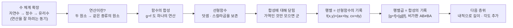

# 선형대수학과 행렬 곱셈이란 무엇인가 (3기 6강)

이번 시간은 선형대수를 공식 목록으로 시작하지 않습니다.

먼저 연산이 무엇을 바꾸는지 보고, 함수의 합성도 하나의 연산으로 읽은 뒤, 선형함수의 합성을 기록한 것이 행렬곱이라는 데까지 갑니다.

그래서 행렬곱은 이상한 규칙이 아니라 "함수를 이어 붙인 결과를 다시 행렬로 적는 방법"입니다.

---

## [0. 나는 왜 여기 있고, 그게 선형대수와 무슨 상관인가 · ▶ 24:05](https://www.youtube.com/watch?v=DDWcRtcbuX4&t=1445s)

오늘의 출발점은 "나는 왜 여기 있는가"라는 질문입니다.

이 질문은 감상문을 쓰자는 뜻이 아닙니다.

내가 다루는 대상이 어떤 구조를 갖고 있는지 확인하자는 뜻입니다.

선형대수가 나에게 직접적인 의미를 가져야만 하는 것은 아닙니다.

하지만 내가 다루는 데이터, 일, 변화, 관계가 선형적인 방식으로 움직인다면 선형대수는 자연스럽게 나타납니다.

예를 들어 입력을 두 배로 했을 때 출력도 두 배가 되는 상황이 있습니다.

두 일을 합쳤을 때 결과도 두 결과의 합으로 나타나는 상황이 있습니다.

이런 상황에서는 선형함수라는 언어가 등장합니다.

행렬은 그 선형함수를 계산 가능한 표로 적는 방식입니다.

> **💭 생각해볼 점** 내가 자주 다루는 대상 중 "합치면 결과도 합쳐지고, 배로 늘리면 결과도 배로 늘어나는" 것이 있는지 떠올려 보십시오. 그 대상이 선형대수의 언어로 들어올 수 있습니다.

---

## [1. 자연수, 정수, 유리수는 연산으로 갈라집니다 · ▶ 28:49](https://www.youtube.com/watch?v=DDWcRtcbuX4&t=1729s)

수 체계를 구분할 때 원소의 개수만 보면 모두 무한합니다.

자연수도 많고, 정수도 많고, 유리수도 많습니다.

하지만 연산을 기준으로 보면 차이가 선명해집니다.

자연수에서 덧셈을 생각하면 $1+2=3$처럼 잘 됩니다.

그러나 $1$에 대해 더해서 $0$을 만드는 수는 자연수 안에 없습니다.

덧셈의 역원을 넣으려면 정수가 필요합니다.

정수에서 곱셈을 생각하면 $2\cdot3=6$처럼 잘 됩니다.

그러나 $2$에 곱해서 $1$을 만드는 수는 정수 안에 없습니다.

곱셈의 역원을 넣으려면 유리수가 필요합니다.

이처럼 자연수에서 정수로, 정수에서 유리수로 넘어가는 이유는 단순히 수를 더 많이 모으기 위해서가 아닙니다.

특정 연산을 더 잘 수행하기 위해 구조를 확장하는 것입니다.

---

## [2. 연산은 덧셈과 곱셈만이 아닙니다 · ▶ 30:35](https://www.youtube.com/watch?v=DDWcRtcbuX4&t=1835s)

연산이라고 하면 보통 $+$와 $\times$를 먼저 떠올립니다.

하지만 수학에서 연산은 집합의 원소들을 받아 다시 원소를 내놓는 규칙입니다.

함수의 합성도 연산입니다.

두 함수 $f,g$가 있으면

$$
g\circ f
$$

라는 새 함수를 만들 수 있습니다.

이것은 숫자 덧셈과 전혀 다르게 생겼지만, "두 대상을 넣어 같은 종류의 대상을 만든다"는 점에서 연산입니다.

참여자가 프로그래밍의 예를 듭니다.

정수에서의 $+$와 문자열에서의 $+$는 같은 기호를 쓰지만 실제 동작은 다릅니다.

어떤 언어에서는 $1+2$가 산술 덧셈이고, `"a"+"b"`는 문자열 연결입니다.

이 비유는 수학에서도 맞습니다.

곱셈이라는 이름이 같아도 자연수의 곱셈, 유리수의 곱셈, 행렬의 곱셈은 서로 다른 집합 위의 서로 다른 연산입니다.

---

## [3. 왜 행렬곱도 곱셈이라고 부르는가 · ▶ 34:03](https://www.youtube.com/watch?v=DDWcRtcbuX4&t=2043s)

행렬곱을 처음 보면 이상합니다.

왜 성분별로 곱하지 않고, 행과 열을 섞어 더하는 방식으로 정의할까요.

이 질문에 답하려면 "곱셈"이라는 이름을 고정된 계산법으로 보면 안 됩니다.

곱셈은 어떤 집합 위에서 정한 연산의 이름입니다.

자연수의 곱셈은 반복 덧셈으로 느껴질 수 있습니다.

정수와 유리수의 곱셈은 역원과 항등원을 포함하는 구조를 갖습니다.

행렬의 곱셈은 선형함수의 합성을 기록합니다.

따라서 행렬곱은 숫자곱을 이상하게 확장한 것이 아니라, 선형함수라는 대상들 사이의 자연스러운 연산입니다.

이 관점이 없으면 행렬곱 공식은 외울 규칙이 됩니다.

이 관점이 있으면 행렬곱은 함수합성의 결과를 좌표로 적는 절차가 됩니다.

---

## [4. 군의 조건으로 연산을 다시 봅니다 · ▶ 40:10](https://www.youtube.com/watch?v=DDWcRtcbuX4&t=2410s)

연산을 자세히 보려면 군의 조건을 떠올릴 수 있습니다.

군은 대략 다음 성질을 갖는 집합과 연산입니다.

- 결합법칙이 성립합니다.
- 항등원이 있습니다.
- 모든 원소가 역원을 갖습니다.
- 연산 결과가 다시 같은 집합 안에 있습니다.

자연수와 덧셈은 역원이 없으므로 군이 아닙니다.

정수와 덧셈은 군입니다.

정수와 곱셈은 $2$의 역원이 정수 안에 없으므로 군이 아닙니다.

$0$을 제외한 유리수와 곱셈은 군입니다.

일대일 대응인 함수들의 모임도 합성에 대해 군을 이룹니다.

항등함수는 항등원이고, 역함수는 역원입니다.

이제 행렬로 오면 가역행렬들이 곱셈에 대해 군을 이룹니다.

행렬곱의 배경에 함수합성이 있으므로, 군의 언어가 자연스럽게 들어옵니다.

---

## [5. 선형성은 인간이 자주 기대하는 단순한 변화입니다 · ▶ 55:34](https://www.youtube.com/watch?v=DDWcRtcbuX4&t=3334s)

왜 하필 선형대수일까요.

수학 전체는 집합과 함수에서 출발할 수 있습니다.

그중 선형함수는 가장 다루기 쉬운 함수입니다.

입력을 두 배로 하면 출력도 두 배가 되고, 두 입력을 더하면 출력도 더해집니다.

현실의 많은 기대도 처음에는 선형적입니다.

운동을 두 배 하면 효과도 두 배일 것이라고 기대합니다.

일한 시간이 두 배면 보상도 두 배일 것이라고 기대합니다.

병사가 100명에서 1000명이 되면 전투력이 열 배가 될 것이라고 기대합니다.

주식이나 매출 데이터를 표로 놓고 계산할 때도 처음에는 더하고 배율을 곱합니다.

물론 현실은 늘 선형적이지 않습니다.

하지만 선형성이 가장 먼저 잡는 근사이고, 가장 계산 가능한 구조입니다.

그래서 선형대수는 단순한 한 과목이 아니라 많은 분야의 기본 언어가 됩니다.

---

## [6. 엑셀 표도 선형대수의 그림자가 있습니다 · ▶ 1:05:40](https://www.youtube.com/watch?v=DDWcRtcbuX4&t=3940s)

엑셀이나 데이터프레임을 생각해 봅니다.

행과 열로 숫자를 배열합니다.

어떤 열에 가중치를 곱해 더합니다.

여러 변수의 조합으로 결과값을 계산합니다.

이 모습은 이미 벡터와 행렬의 언어에 가깝습니다.

행 하나를 데이터 벡터로 볼 수 있고, 열 하나를 변수로 볼 수 있습니다.

여러 가중치를 모으면 행렬이 됩니다.

표의 숫자들을 규칙적으로 바꾸는 계산은 선형변환으로 읽힐 수 있습니다.

그래서 선형대수는 추상적인 평면 화살표만의 이야기가 아닙니다.

우리가 데이터를 표로 놓고 조합하는 순간 이미 선형대수의 형식을 사용하고 있습니다.

---

## [7. 선형함수는 두 연산을 보존합니다 · ▶ 1:07:50](https://www.youtube.com/watch?v=DDWcRtcbuX4&t=4670s)

단원 전사본에서 선형함수는 벡터공간의 선형성을 보존하는 함수로 정의됩니다 (→ 전사본 참조).

구체적으로

$$
f(x+y)=f(x)+f(y)
$$

이고

$$
f(\alpha x)=\alpha f(x)
$$

이어야 합니다.

첫 번째 식은 덧셈을 보존한다는 뜻입니다.

두 번째 식은 스칼라곱을 보존한다는 뜻입니다.

이 두 조건이 있으므로 선형함수는 벡터공간의 구조를 망가뜨리지 않습니다.

여기서 중요한 점은 선형함수들의 합성도 다시 선형함수라는 사실입니다.

$f,g$가 선형이면

$$
(g\circ f)(x+y)=g(f(x+y))=g(f(x)+f(y))=g(f(x))+g(f(y))
$$

입니다.

스칼라곱도 같은 방식으로 보존됩니다.

따라서 선형함수들은 합성이라는 연산 아래에서 닫혀 있습니다.

---

## [8. 가역인 선형함수들은 군처럼 움직입니다 · ▶ 1:20:00](https://www.youtube.com/watch?v=DDWcRtcbuX4&t=4800s)

선형함수 전체를 합성으로 보면 닫힘과 결합법칙은 자연스럽게 성립합니다.

항등함수도 선형입니다.

하지만 모든 선형함수가 역함수를 갖는 것은 아닙니다.

예를 들어 평면을 한 직선으로 눌러 버리는 선형함수는 되돌릴 수 없습니다.

그래서 군을 이루려면 가역인 선형함수들만 모아야 합니다.

가역 선형함수들은 합성에 대해 군을 이룹니다.

행렬로 표현하면 가역행렬들의 모임입니다.

이 관점에서 행렬식이 $0$인지 아닌지는 나중에 매우 중요해집니다.

행렬식이 $0$이면 행렬이 어떤 차원을 눌러 버렸고, 역행렬이 없습니다.

행렬식이 $0$이 아니면 되돌릴 수 있는 선형변환입니다.

---

## [9. 2차원 선형함수는 네 숫자로 기록됩니다 · ▶ 1:38:30](https://www.youtube.com/watch?v=DDWcRtcbuX4&t=5910s)

$\mathbb{R}^2$에서 $\mathbb{R}^2$로 가는 선형함수를 생각합니다.

선형함수 $f$는 표준기저 $e_1=(1,0)$, $e_2=(0,1)$이 어디로 가는지만 알면 결정됩니다.

예를 들어

$$
f(x,y)=(ax+by,cx+dy)
$$

라고 쓸 수 있습니다.

이를 행렬로 적으면

$$
\begin{pmatrix}
a&b\\
c&d
\end{pmatrix}
\binom{x}{y}
$$

입니다.

여기서 행렬은 숫자를 예쁘게 배치한 표가 아닙니다.

선형함수의 작동 방식을 기록한 것입니다.

입력 벡터의 좌표가 들어오면, 행렬은 그 벡터가 어디로 가는지 계산합니다.

---

## [10. 행렬곱은 선형함수의 합성입니다 · ▶ 1:40:17](https://www.youtube.com/watch?v=DDWcRtcbuX4&t=6017s)

두 선형함수 $f,g$를 이어 붙인다고 합시다.

먼저 $f$를 적용하고, 그 다음 $g$를 적용합니다.

이 합성 $g\circ f$도 선형함수입니다.

따라서 이것도 어떤 행렬로 표현됩니다.

그 행렬을 계산해 보면 우리가 알고 있는 행렬곱 공식이 나옵니다.

즉

$$
[g\circ f]=[g][f]
$$

입니다.

행렬곱의 순서가 낯선 이유도 여기서 설명됩니다.

오른쪽의 $[f]$가 먼저 벡터에 작용하고, 그 결과에 왼쪽의 $[g]$가 작용합니다.

함수합성에서 순서가 결과를 바꾸듯 행렬곱에서도 순서가 결과를 바꿉니다.

![단위 정사각형을 $f$로 한 번, 이어서 $g$로 한 번 보내면, 처음부터 곱행렬 $GF$로 직접 보낸 결과와 정확히 겹칩니다 — 즉 $[g\circ f]=[g][f]$, 오른쪽 인자 $f$가 먼저 작용합니다.](<03-season-assets/06/svg/matrix-product-is-composition-03-season-06-10.svg>)

일반적으로

$$
AB\ne BA
$$

입니다.

이 비가환성은 행렬만의 특이한 장난이 아니라 함수합성의 성질입니다.

---

## [11. 스칼라곱은 어디에 들어가 있는가 · ▶ 1:49:51](https://www.youtube.com/watch?v=DDWcRtcbuX4&t=6591s)

참여자가 묻습니다.

"군에서는 연산 하나를 보는데, 벡터공간에는 덧셈과 스칼라곱이 있습니다. 스칼라곱은 어디로 간 것입니까?"

좋은 질문입니다.

선형함수의 정의에는 이미 두 연산이 모두 들어 있습니다.

함수가 덧셈을 보존해야 하고, 스칼라곱도 보존해야 합니다.

행렬곱은 선형함수들의 합성을 나타내는 연산입니다.

그러나 그 선형함수가 선형함수로 인정받으려면 내부에서 벡터 덧셈과 스칼라곱을 보존해야 합니다.

스칼라 $\alpha$를 행렬 관점에서 보면 $\alpha I$처럼 볼 수도 있습니다.

예를 들어 모든 벡터를 두 배로 늘리는 변환은 $2I$라는 행렬입니다.

그래서 스칼라곱은 사라진 것이 아니라 선형성의 조건과 특별한 선형변환 안에 들어 있습니다.

---

## [12. 벡터공간에는 아직 거리와 각도가 없습니다 · ▶ 1:53:00](https://www.youtube.com/watch?v=DDWcRtcbuX4&t=6780s)

마지막에 참여자는 중요한 지점을 짚습니다.

벡터공간에는 덧셈과 스칼라곱이 있습니다.

하지만 거리와 각도는 아직 없습니다.

우리는 $\mathbb{R}^2$를 그릴 때 자동으로 직교좌표축과 같은 간격을 떠올립니다.

그러나 그것은 표준내적을 함께 떠올린 것입니다.

벡터공간 구조만으로는 두 벡터의 길이나 사잇각을 말할 수 없습니다.

내적이 추가되어야 길이와 각도가 생깁니다.

그래서 앞으로의 선형대수는 두 층위로 나뉩니다.

먼저 덧셈과 스칼라곱을 보존하는 선형함수와 행렬곱을 봅니다.

그 다음 길이와 각도를 정하는 내적, 그리고 그 내적을 잘 읽게 해 주는 대칭행렬과 고유벡터를 봅니다.

오늘 흘러온 줄거리를 한눈에 — "연산을 잘 하려고 구조를 넓히고, 함수합성도 연산으로 읽고, 선형함수의 합성을 행렬곱으로 적는다":

## 요약

- 수 체계는 원소의 모음뿐 아니라 어떤 연산을 잘 수행하는지로 구분됩니다.
- 함수합성도 하나의 연산이며, 행렬곱은 선형함수 합성의 기록입니다.
- 군의 관점은 항등원, 역원, 결합법칙, 닫힘을 통해 연산 구조를 읽게 합니다.
- 가역 선형함수와 가역행렬은 합성/곱셈에 대해 군처럼 움직입니다.
- 선형함수는 덧셈과 스칼라곱을 보존합니다.
- $\mathbb{R}^2$의 선형함수는 행렬로 표현되고, 합성은 행렬곱으로 표현됩니다.
- 행렬곱이 비가환적인 이유는 함수합성이 비가환적이기 때문입니다.
- 벡터공간에는 아직 길이와 각도가 없으며, 이를 위해 내적이 추가됩니다.
