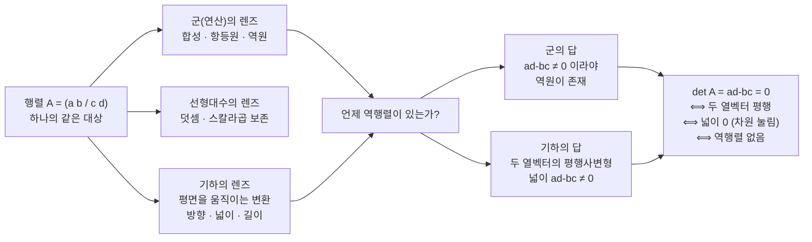

# 행렬을 군의 관점에서 보는 지루함으로 인해 관점을 바꾸는 것에 대한 이야기 (3기 7강)

이번 시간은 지금까지 연산(군)의 관점으로만 읽어 온 행렬을 다시 꺼내, 그 관점만으로는 행렬이 왜 "어쩌라고" 싶게 지루해지는지를 먼저 느껴 봅니다.

그리고 같은 대상을 평면 위 벡터의 움직임으로 바꿔 보면서, 행렬식 $ad-bc$를 두 열벡터가 만드는 평행사변형의 넓이로 읽는 관점을 떡밥으로 던지고 마무리합니다.

---

## [0. 연산(군)의 관점으로 여기까지 왔습니다 · ▶ 00:00](https://www.youtube.com/watch?v=yWtO35LNBc8&t=0s)

먼저 지금까지의 흐름을 복습합니다.

우리는 자연수, 정수, 유리수를 어떻게 구분하느냐는 물음에서 출발했습니다. 일대일 대응만으로는 자연수와 정수를 구분할 수 없었고, 그래서 **연산**이라는 개념을 들여왔습니다. 정수는 덧셈에 대해 잘 동작하지만 자연수는 그렇지 않고($0$도 $-a$도 없으니까요), 유리수는 곱셈까지 잘 동작합니다. 이렇게 연산을 기준으로 집합들을 구분하는 관점을 우리는 **군(group)의 관점**이라고 불러 왔을 뿐입니다.

이 관점에서 우리는 몇 가지 이상한 상상을 했습니다. 지수함수 $a^{x+y}=a^x\,a^y$를 보면 덧셈을 곱셈으로 옮기는 일이라, 덧셈과 곱셈을 같은 구조로 볼 수도 있습니다. 함수의 합성도 숫자의 연산처럼 다룰 수 있고, 항등함수와 역함수는 군에서의 항등원·역원처럼 움직입니다. 그리고 지난 시간에는 **선형함수의 합성을 기록한 것이 행렬곱**이라는 데까지 갔습니다.

오늘 하고 싶은 일은 군의 관점을 더 밀어붙이는 것이 아닙니다. 오히려 같은 대상에 **다른 렌즈**를 끼워 보는 것입니다. 그래서 군이 최고라고 말하려는 것이 아니라, 한 가지 렌즈를 들이밀고 나니 익숙하던 대상이 다르게 보이기 시작한다는 점을 함께 경험하려고 합니다.

> **💭 생각해볼 점** 같은 행렬을 두고도 어떤 구조를 앞에 놓느냐에 따라 묻는 질문이 달라집니다. 군의 관점에서는 합성과 역원을, 선형대수의 관점에서는 덧셈·스칼라곱의 보존을, 기하의 관점에서는 방향·넓이·길이가 어떻게 변하는지를 봅니다. 지금까지 우리는 거의 연산만을 기준으로 이야기해 왔는데, 행렬을 그렇게만 보는 것이 과연 나에게 가장 자연스럽고 타당한가요?

같은 행렬 하나를 세 개의 렌즈로 보면, 같은 질문("언제 역행렬이 있는가")이 서로 다른 언어로 번역됩니다. 오늘 노트는 왼쪽(군의 렌즈)에서 출발해 오른쪽(기하의 렌즈)으로 옮겨 가는 이야기입니다.

---

## [1. 같은 대상도 식으로도 보고 그림으로도 봅니다 · ▶ 8:30](https://www.youtube.com/watch?v=yWtO35LNBc8&t=510s)

간단한 예를 하나 듭니다. 중·고등학교에서 배운 직선의 방정식

$$
y=ax+b
$$

와 원의 방정식

$$
x^2+y^2=r^2
$$

를 떠올려 봅시다. 출발은 **방정식**이지만, 우리가 정말로 식만 생각하고 있나요? $y=ax+b$를 볼 때 머릿속에는 평면 위의 선 하나가 떠오르고, 원의 식을 볼 때는 중심에서 거리가 같은 점들의 모임이 떠오릅니다.

즉 우리는 같은 대상에 두 가지 렌즈를 동시에 끼우고 있습니다. 어떤 관점에서는 계산이 잘 보이고, 어떤 관점에서는 의미가 잘 보입니다. 그리고 똑같은 관찰이라도 어떤 렌즈를 끼느냐에 따라 전혀 다른 해석을 내놓을 수 있습니다. 오늘은 이 "렌즈의 전환"을 행렬에 대해 해 보려고 합니다.

> **💭 생각해볼 점** 같은 대상을 식으로 볼 때와 그림으로 볼 때, 나는 지금 어느 관점에서 보고 있는지를 스스로 인지하고 있나요? 그리고 그 관점이 지금 이 대상을 보기에 타당한가요?

---

## [2. 선형함수의 정의를 연산으로 다시 붙잡습니다 · ▶ 37:13](https://www.youtube.com/watch?v=yWtO35LNBc8&t=2233s)

이제 노트를 함께 읽으면서, "연산만을 기준으로 보는 것이 타당한가"를 계속 물음으로 깔고 갑니다.

선형대수 레벨에서 연산은 두 가지, 곧 **덧셈**과 **스칼라곱**입니다. 이 두 연산을 보존해 주는 함수를 **선형함수(선형사상)**라고 부릅니다 (→ 전사본 참조).

$$
f(x+y)=f(x)+f(y),\qquad f(rx)=r\,f(x)
$$

$\mathbb{R}^2$에서 선형함수

$$
f(x,y)=(ax+by,\;cx+dy)
$$

는 행렬

$$
\begin{pmatrix}a&b\\c&d\end{pmatrix}
$$

로 기록됩니다. 그리고 두 선형함수를 합성하면 그대로 행렬곱이 나옵니다. 여기까지는 전부 연산을 기준으로 본 것이고, 군의 관점에서는 결합법칙·항등원(항등행렬)·역원(역행렬)이 다 그럴싸하게 자리를 잡습니다.

그런데 행렬을 정당화했던 방식 자체가 "함수의 합성도 연산처럼, 행렬의 곱셈도 연산처럼 보니 같은 선상에서 볼 수 있더라"였습니다. 어떤 의미에서는 별것 아닙니다. 그래서 이 설명을 듣고 나면 "그럴 수도 있겠네" 정도의 감상이 들 수 있습니다.

---

## [3. 역행렬 공식은 연산의 관점에서만 보면 건조합니다 · ▶ 42:04](https://www.youtube.com/watch?v=yWtO35LNBc8&t=2524s)

$2\times2$ 행렬

$$
A=\begin{pmatrix}a&b\\c&d\end{pmatrix}
$$

의 역행렬은, $A^{-1}=\begin{pmatrix}x&y\\z&w\end{pmatrix}$로 두고 $AA^{-1}=I$를 그냥 무식하게 연산으로 풀면 나옵니다.

$$
A^{-1}=\frac{1}{ad-bc}
\begin{pmatrix}d&-b\\-c&a\end{pmatrix}
$$

군의 관점에서는 $A^{-1}$이 합성했을 때 항등함수가 되는 역원이고, 분모가 $0$이면 안 되므로 $ad-bc\ne0$이어야 한다고 말합니다. 여기서 $ad-bc$를 우리는 **행렬식(determinant)**이라고 부르는데, 지금까지의 이야기에서 행렬식은 그저 수식 전개의 결과로 떨어진 값입니다.

연산의 관점에서 보면 이 모든 말은 맞습니다. 그런데 솔직히 말하면, 저는 이렇게 본 행렬이 별로 재미가 없습니다. "그래서 어쩌라고" 싶은, 무미·무색·무취의 느낌이 듭니다. 분모에 $ad-bc$가 있으니 $0$이면 안 된다는 말은 공식의 표면일 뿐, 왜 그 값이 평면을 되돌릴 수 있는지 없는지를 결정하는지는 손에 잡히지 않습니다.

> **💭 생각해볼 점** 지금까지의 설명을 듣고 "아름답다"가 아니라 "어쩌라고"가 든다면, 그것은 대상이 시시해서가 아니라 **렌즈가 틀렸을** 가능성이 있습니다. 재미없음·지루함이 수학의 본연의 성질인지, 아니면 내가 보아야 할 관점으로 보고 있지 않아서인지는 서로 다른 문제입니다. 한 참여자분의 물음처럼, 함수의 역함수가 아무 때나 있는 것이 아니듯 행렬의 역행렬도 아무 때나 있는 것이 아닌데, 그 두 사정이 서로 무슨 상관이 있는지 — 이 간질간질함을 그냥 넘기지 말고 붙잡아 봅시다.

---

## [4. 행렬을 평면을 움직이는 함수로 다시 봅니다 · ▶ 1:02:00](https://www.youtube.com/watch?v=yWtO35LNBc8&t=3720s)

마음에 안 들면 두 가지 길이 있습니다. 내팽개치거나, 어떻게 봐야 하는지 이모저모 뜯어보거나. 후자를 택해서, 행렬이 어디서 왔는지로 되돌아갑니다.

행렬

$$
A=\begin{pmatrix}a&b\\c&d\end{pmatrix}
$$

는 $\mathbb{R}^2$에서 $\mathbb{R}^2$로 가는 선형함수, 곧 $(x,y)$를 다른 벡터로 보내는 함수에서 나왔습니다. 좌표평면을 그려 놓고 점(또는 화살표) 하나를 찍은 다음, $a,b,c,d$가 그 화살표의 방향과 크기를 적당히 조정해 다른 화살표로 옮긴다고 보면 마음이 조금 편해집니다. 사실 대부분 이미 이렇게 보고 있을 것입니다.

여기서 중요한 점은, 군의 관점이 불편하지 않았다면 우리가 굳이 좌표평면을 끌어와 이렇게 보지는 않았으리라는 것입니다. 대상은 전혀 바뀌지 않았습니다. 바뀐 것은 그것을 보는 관점뿐입니다. 그러니 수식 레벨에서 역행렬 공식이 맞다는 것은 인정하되, 그 공식을 **그림으로 완벽하게 설명해 내고 싶다**는 욕구를 가지고 다시 들여다보려는 것입니다.

> **💭 생각해볼 점** 무언가를 보다가 "이 느낌이 아닌데" 싶을 때, 둘 중 하나입니다. 대상이 별로이거나, 내가 보는 관점이 별로이거나. 대상에 대한 판단을 유보하고 싶다면 먼저 내 관점을 바꿔 봅니다. 우리는 지금 행렬이라는 대상을 보는 관점을 슬쩍 바꿔치기 하고 있습니다.

---

## [5. 좌표를 비선형으로 바꾸면 직선이 달라지나요 · ▶ 1:11:49](https://www.youtube.com/watch?v=yWtO35LNBc8&t=4309s)

여기서 한 참여자분이 좋은 혼동을 던집니다. $\mathbb{R}^2$ 위의 곡선을, 축의 눈금을 비선형으로 바꿔서 직선처럼 보이게 만들 수도 있지 않으냐, 그러면 "직선"이라는 말은 무엇으로 정의해야 하느냐는 것입니다.

이에 답하자면, $y=ax+b$를 직선으로 볼 수 있는 것은 전체 공간(앰비언트 스페이스)이 벡터공간일 때입니다. 사실 그 전체 공간이 꼭 평평해야 할 당위는 세상에 없습니다. 휘어진 공간에서도 직선이라는 개념은 존재할 수 있습니다.

가장 직관적인 예가 철길입니다. 평면(벡터공간)에서는 두 평행선이 만나지 않는다고 약속하지만(평행선 공준), 멀리 뻗은 철길은 한 점에서 만나는 것처럼 보입니다. 이것을 수학적으로 정확히 보려면, 평면 $\mathbb{R}^2$를 위상공간으로 두고 거기에 **무한원점**을 하나 집어넣습니다. 그러면 공간의 모양이 바뀌어, 원래는 만나지 않던 두 평행선이 그 무한원점에서 만나게 됩니다. 이렇게 보는 것을 **사영기하(projective geometry)**라고 합니다.

그러니 지금 직선을 $ax+b$로 보는 것은, 공간을 유클리드 기하(벡터공간)로 상정하고 있기에 맞는 말입니다. 직선·거리·각도·넓이 같은 말은 어떤 기하적 약속 속에서 의미를 가집니다.

> **💭 생각해볼 점** 한 참여자분이 물었듯이, 지금까지 우리는 왜 그래프가 직선이 되어야 하는지, 직선이 되는 조건이 무엇인지를 정당화한 적이 없습니다. 직문 라인에서는 직관적으로 "그냥 우기는" 선에서 가고 있을 뿐이라는 점을 분명히 해 둡니다 — 수학적으로 틀린 말을 하고 있는 것은 아니지만, 정당화를 미뤄 둔 것이 불편하다면 그 불편함은 100% 정당합니다.

---

## [6. 떡밥: 행렬식은 두 열벡터가 만드는 평행사변형의 넓이입니다 · ▶ 1:36:15](https://www.youtube.com/watch?v=yWtO35LNBc8&t=5775s)

오늘은 한 가지 관점을 슬쩍 섞은 다음, 그것을 불편하게 남겨 두는 방식으로 마무리합니다. 다음 노트에서 증명해 두었으니, 오늘은 **팩트로** 받아들이겠습니다.

행렬 $A=\begin{pmatrix}a&b\\c&d\end{pmatrix}$의 두 열벡터를

$$
u=\binom{a}{c},\qquad v=\binom{b}{d}
$$

라 하면, 행렬식 $ad-bc$는 정확히 **$u,v$가 만드는 평행사변형의 (부호 있는) 넓이**입니다. (엄밀하게는 부호 있는 넓이지만, 오늘은 그 정도로 받아들입니다.)

이 관점이 왜 중요한가 하면, 아까 군의 관점에서 던진 "언제 $ad-bc=0$이 되는가, 곧 언제 역행렬이 존재하는가"라는 물음을 전혀 다른 언어로 바꿔 읽을 수 있기 때문입니다. 넓이가 $0$이 된다는 것은 두 화살표 $u,v$가 평행사변형을 만들지 못한다는 뜻이고, 그것은 두 벡터가 서로 평행할 때뿐입니다. 평행하지 않으면 반드시 2차원 넓이가 나옵니다.

$$
\det A=ad-bc=0 \iff u\parallel v \iff (\text{역행렬 없음})
$$

즉 "언제 역행렬이 존재하는가"를, 평행사변형이라는 기하적 대상을 데려와 다르게 해석하기 시작한 것입니다. 행렬식이 $0$이면 평면의 단위정사각형이 선분으로 눌려 서로 다른 점들이 겹치므로 되돌릴 수 없고, 군의 관점에서는 이를 "역원이 없다"고, 기하의 관점에서는 "넓이가 사라지고 차원이 눌렸다"고 말합니다. 두 말은 같은 현상을 다른 언어로 읽은 것입니다.

여기서 "이렇게 봐야 한다"고 주장하는 것이 아니라, 이렇게 볼 생각을 하니 기존의 대상을 다르게 볼 여지가 생긴다는 점에 동의를 구하는 것입니다.

> **💭 생각해볼 점** 한 참여자분이 "기하의 관점에서 양(수량)은 어디서 들어오느냐"고 물었습니다. $ad-bc$를 단순한 수가 아니라 두 열벡터가 만드는 평행사변형의 면적이라는 **양**으로 떨어뜨린 그 순간, 이미 기하적 관점이 들어와 있습니다. 행렬과 그 역행렬이 선형함수로서 서로를 되돌리려면, 두 열벡터가 독립적인 방향을 이루어야 — 곧 평행사변형의 넓이가 $0$이 아니어야 — 합니다.

> **💭 생각해볼 점** 또 한 참여자분이 물었습니다. 평행사변형의 넓이는 보통 밑변 곱하기 높이로 구하고, 높이를 얻으려면 $\sqrt{a^2+c^2}$처럼 피타고라스와 제곱근이 끼어드는데, 왜 여기서는 $ad-bc$처럼 깔끔한(루트 없는) 식이 나오는가? 밑변·높이로 가면 길이와 각도를 따로 계산해야 하지만, 행렬식은 두 벡터의 좌표만 받아 부호 있는 면적을 곧장 내놓습니다. 그래서 선형독립·역행렬·넓이가 한 식에서 만납니다.

---

## [7. 2000년 만에 깨진 선입견과, 다음으로 가는 문 · ▶ 1:41:05](https://www.youtube.com/watch?v=yWtO35LNBc8&t=6065s)

오늘 던진 떡밥은 여기까지입니다. 이런 기하의 이야기는 19세기에 출발합니다. 유클리드 원전이 기원전 3세기에 나온 뒤, 인간이 합리적이라고 여겼던 그 방식 자체가 깨지는 데 약 2000년이 걸렸습니다. 19세기에 리만을 비롯한 비유클리드 기하의 창시자들이 "우리가 보는 벡터공간을 당연하게 받아들이지 말자"는 생각을 했고, 이것을 이어받아 아인슈타인은 일반상대성이론에서 "빛이 휜다"고 기술했으며, 그 결과는 100년에 걸쳐 검증되었습니다. 어떤 관점이 바뀌고, 보편성을 인정받고, 검증되기까지는 5분·10분이 아니라 10년도 짧은 시간이 걸립니다.

마지막으로 사영기하 이야기를 다시 짚습니다. 평면에 무한원점을 하나 더한 집합을 생각하면, 원래 만나지 않던 두 평행선이 그 점에서 만납니다. 직접 그려 보면 보입니다. 카메라 렌즈는 실제로 이 사영기하를 따라 수식을 매기고, 컴퓨터 비전과 그래픽에서도 이 관점이 계산에 쓰입니다.

오늘은 행렬을 군의 관점에서 기하의 관점으로 옮기는 첫걸음을 뗐습니다.

> **💭 생각해볼 점** 다음 시간을 위해 미리 던집니다. 크기와 각도 같은 개념의 정의는 무엇인가요? 만약 제가 "벡터의 크기와 두 벡터 사이의 각도를 정의하라"고 묻는다면 뭐라고 답하시겠습니까? 다음에는 이것들도 처음부터 같은 것으로 두어야 하는 것이 아니라는 이야기, 곧 내적과 계량의 문제로 들어갑니다.

## 요약

- 행렬은 숫자 배열, 선형함수의 기록, 평면을 움직이는 기하적 변환으로 동시에 읽을 수 있습니다.
- 군(연산)의 관점은 행렬곱과 역행렬을 함수의 합성·역함수로 설명하지만, 그것만으로는 행렬이 건조하게 느껴질 수 있습니다.
- 재미없음이 대상의 성질인지 내 관점의 문제인지는 다른 문제입니다 — 지루하면 렌즈를 바꿔 봅니다.
- 같은 대상(행렬)을 좌표평면 위 벡터의 움직임으로 다시 보면, 행렬의 열벡터는 표준기저가 어디로 가는지를 말합니다.
- 직선·거리·각도·넓이는 기하적 약속(어떤 공간) 속에서만 의미를 가집니다. 비선형 좌표나 사영기하에서는 "직선"이나 "평행"의 뜻이 달라집니다.
- 행렬식 $ad-bc$는 두 열벡터가 만드는 평행사변형의 부호 있는 넓이입니다 (오늘은 팩트로 받아들이고, 증명은 다음 노트로).
- $ad-bc=0 \iff$ 두 열벡터가 평행 $\iff$ 넓이가 사라짐 $\iff$ 역행렬 없음. 군의 "역원 없음"과 기하의 "차원이 눌림"은 같은 현상의 두 언어입니다.
- 다음 단계는 크기와 각도를 정하는 내적·계량의 관점입니다.
