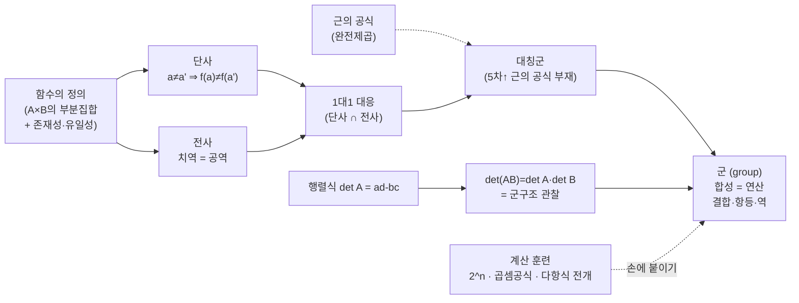

# 선형대수 공부를 시작하기 위한 준비작업, 그리고 천재처럼 보이는 수학 훈련 디테일 (4기 12강)

이번 시간에는 선형대수로 넘어가기 전에 손에 붙어 있어야 하는 기본기를 하나씩 다집니다. 2차 방정식의 근의 공식 유도, 행렬식의 정의, 함수의 정의, 단사·전사의 정의를 먼저 정리하고, 이어서 $2$의 거듭제곱·곱셈공식·고차식 전개 같은 계산 훈련까지 살펴보겠습니다.

---

## [0. 2차 방정식 근의 공식 — 완전제곱으로 유도 · ▶ 03:57](https://www.youtube.com/watch?v=wD-clC6MBEI&t=237s)

먼저 2차 방정식을 완전제곱(영어로 completing the square)으로 풀 줄 알아야 합니다. 공식을 따로 외우지 않고도 매 단계가 술술 나오는 것이 목표입니다.

$ax^2 + bx + c = 0$에서 출발합니다. 여기서 $a$는 $0$이 아닙니다. 이 조건이 빠지면 2차 방정식이 아니게 되므로 반드시 짚어야 합니다. 또한 식 $ax^2+bx+c$와 방정식 $ax^2+bx+c=0$은 다른 선언입니다. "$=0$"이라는 말을 해야 비로소 방정식을 선언한 것입니다.

$a$로 묶으면

$$
a\left(x^2 + \frac{b}{a}x\right) + c = 0
$$

이 되고, 완전제곱을 만들기 위해 괄호 안에 같은 수를 더하고 뺍니다($a^2+2ab+b^2=(a+b)^2$를 이용). 그러면

$$
a\left(x + \frac{b}{2a}\right)^2 + c - \frac{b^2}{4a} = 0
$$

이 됩니다. 상수항을 넘기고 $a$로 나눈 뒤 양변에 제곱근을 취하면

$$
\left(x + \frac{b}{2a}\right)^2 = \frac{b^2 - 4ac}{4a^2},
\qquad
x = \frac{-b \pm \sqrt{b^2 - 4ac}}{2a}
$$

까지 나옵니다.

> **✏️ 연습문제** 임의의 실수 $a,b,c$($a\neq 0$)에 대해 $ax^2+bx+c=0$의 근의 공식을, 공식을 외우지 말고 완전제곱으로 유도해 보십시오.

---

## [1. 행렬식의 정의와 군구조 · ▶ 07:55](https://www.youtube.com/watch?v=wD-clC6MBEI&t=475s)

$2\times 2$ 행렬의 행렬식입니다. 행렬

$$
A = \begin{pmatrix} a & b \\ c & d \end{pmatrix}
$$

에 대해 행렬식은 $\det A = ad - bc$입니다. 단, 말로 표현할 때도 정확해야 합니다. "행렬식은 $ad-bc$"라고만 하면 틀린 말입니다. "$2\times 2$ 행렬 $\begin{pmatrix}a&b\\c&d\end{pmatrix}$에 대해서 행렬식은 $ad-bc$다"라고 해야 맞습니다. 행렬식은 $2\times 2$에 한정한 얘기가 아니므로, 어느 크기의 행렬을 말하는지를 빠뜨리면 안 됩니다.

여기서 한 가지를 정확히 구분해 주십시오. **기초적인(elementary) 것과 뻔한(trivial) 것은 완전히 다릅니다.** 여기서 다루는 대상은 모두 기초적이고 초등적이지만, 그 어떤 것도 뻔하지 않습니다. "기초적"이라는 말은, 어떤 고급 수학을 배우더라도 결국 다 이리로 떨어진다는 의미입니다.

한 단계 더 나아가 보겠습니다. 두 개의 $2\times 2$ 행렬 $A,B$를 가져와 곱해서 행렬 $AB$를 만든 다음, 거기에 행렬식을 취한 것과, 각각의 행렬식을 따로 취해 곱한 것이 같음을 손으로 확인해 보십시오. 즉

$$
\det(AB) = \det A \cdot \det B
$$

를 직접 확인하는 것입니다. 계산 자체는 쉽지만, 그 함의(implication)가 중요합니다. 이것이 바로 행렬식이 **군구조를 만족한다**는 사실의 관찰입니다. 이미 지수함수에서 $a^{x+y} = a^x \cdot a^y$를 군구조의 관점에서 인지하고 계시듯이, 행렬식도 같은 관점에서 보면 군구조를 가지고 있습니다(→ [전사본](<05. Linear Algebra Part 1 - Linear Functions and Matrices.md>) 참조 — 군의 항등원·역원과 함수의 합성·항등·역이 정확히 대응한다는 맥락).

행렬 곱셈의 의미(선형함수의 합성으로서의 의미)는 매우 중요하지만, 일단 계산하는 것 자체는 아무 생각이 없어야 합니다. 행렬을 그냥 곱하던 것에서 "이게 군이랑 상관이 있구나"로 보이기 시작하는 지점이 의미 있는 전환입니다.

> **💭 생각해볼 점** $\det(AB)=\det A\cdot\det B$를 군구조의 관점에서 뜯어보면, 지수법칙 외에 또 하나의 "군에 대한 이야기"가 됩니다. 여기서 군구조를 한번 생각해 보십시오.

---

## [2. 함수의 정의 · ▶ 12:58](https://www.youtube.com/watch?v=wD-clC6MBEI&t=778s)

함수의 정의를 정확하게 잡습니다. 세 줄로 외우십시오.

- **첫째 줄.** 두 집합 $A, B$가 있을 때,
- **둘째 줄.** 그 곱집합 $A\times B$(순서쌍들의 모임)를 생각하고,
- **셋째 줄.** 그 $A\times B$의 특정 **부분집합**을 우리는 함수라고 부른다.

즉 함수의 정의는 "$A\times B$의 부분집합"입니다. 단, 이 부분집합은 두 가지 조건을 만족해야 합니다.

1. **(존재성)** 각각의 $a\in A$마다, 어떤 $b\in B$가 존재해서 순서쌍 $(a,b)$가 이 함수 집합에 들어간다. — $A\times B$ 전체가 아니라 부분집합을 보는 것이므로, 이는 당연한 조건이 아닙니다.
2. **(유일성)** 그 $b$가 유일하다. — 그렇기 때문에 우리가 이 $y$ 성분을 "함숫값"이라고 부르는 것이 가능해집니다.

이 둘을 섞어 "정의역의 원소마다 $B$의 원소가 유일하게 존재해서 그 순서쌍이 부분집합에 들어간다"라고 한 번에 말해도 됩니다. 다만 그 안에 존재성과 유일성, 두 조건이 다 섞여 있다는 것은 명확히 인지하고 계셔야 합니다.

> **💭 생각해볼 점** 두 번째 조건은 "$f(a)=f(a')$이면" 꼴로, 즉 함숫값이 같으면 같은 입력에서 왔다는 형태(well-defined의 엄밀한 정의)로도 표현할 수 있습니다. 정의는 한 가지 정확한 형태만 잡으면 되고, 같은 내용을 등가의 여러 방식으로 말할 수 있으면 더 좋습니다.

---

## [3. 단사·전사·1대1 대응 · ▶ 16:54](https://www.youtube.com/watch?v=wD-clC6MBEI&t=1014s)

**1대1 대응은 전사와 단사를 동시에 만족하는 것**입니다. 그러니 전사와 단사의 정의를 정확히 알고 계셔야 합니다. 이 정의들은 모두 "함수 $f:A\to B$가 주어질 때"라는 전제 위에서 말하는 것입니다(이 한마디에 2번에서 다진 함수의 정의가 다 들어 있습니다).

**단사(injective).** $A$에서 임의의 서로 다른 두 원소를 뽑으면, 그에 대응되는 함숫값들이 서로 다르다. 즉

$$
a \neq a' \;\Rightarrow\; f(a) \neq f(a').
$$

대우로 뒤집어 "$f(a)=f(a')$이면 $a=a'$"라고 외우셔도 됩니다. 정의와 그 대우를 자유롭게 오가며 쓰실 수 있기를 바랍니다.

**전사(surjective, onto).** 치역과 공역이 같을 때입니다. 치역은 함숫값들의 모임으로, 함수의 정의만 놓고 보면 공역 $B$의 부분집합에 지나지 않는데, 그 부분집합이 $B$와 같아야 한다는 것입니다. 좀 더 형식적으로(증명에서 자주 쓰는 형태로) 말하면

$$
\forall\, b \in B,\;\; \exists\, a \in A \;\text{ s.t. }\; f(a) = b
$$

입니다. 모두 돌고 도는 같은 얘기입니다.

세 경우를 유한집합 사이의 화살표 그림으로 한눈에 비교해 봅니다. 단사는 서로 다른 입력이 서로 다른 출력으로 가는 것(공역에 안 닿는 원소가 있어도 됨), 전사는 공역의 모든 원소가 적어도 한 번은 화살을 맞는 것(여러 입력이 한 출력으로 겹쳐도 됨), 1대1 대응은 그 둘을 동시에 만족해 양쪽이 정확히 짝지어지는 것입니다.

---

## [4. (선택) 대칭군의 정의 · ▶ 19:27](https://www.youtube.com/watch?v=wD-clC6MBEI&t=1167s)

**대칭군**의 정의입니다. 자연수 $n$을 고정하고, 원소가 $1$부터 $n$까지인 $n$개짜리 집합을 정역과 공역으로 같게 잡습니다($A=B=\{1,2,\dots,n\}$). 함수의 정의상 정역과 공역을 선언해 줘야 하므로 이렇게 둡니다. 그 위에서 **1대1 대응 함수들의 모임**을 생각합니다. 이것이 대칭군의 정의입니다.

여기에 **함수의 합성**을 연산으로 주면 군이 됩니다. "왜 군이 되지?"를 확인하는 데서 불편해지는 것은 아주 바람직합니다. 그리고 이 대칭군을 다루는 과정에서, 갈루아와 아벨이 생각했던 (5차 이상 방정식에) 근의 공식이 없다는 결과의 오리지널 방식이 거기서부터 나옵니다.

> **💭 생각해볼 점** 1대1 대응 함수들의 모임에 함수의 합성을 주면 왜 군이 되는지 — 결합법칙·항등원·역원이 모두 성립하는지를 확인해 보십시오(→ [전사본](<05. Linear Algebra Part 1 - Linear Functions and Matrices.md>)의 군 구조 ↔ 합성·항등함수·역함수 대응 참조).

---

## [5. 계산 훈련 ① $2$의 거듭제곱 · ▶ 1:05:33](https://www.youtube.com/watch?v=wD-clC6MBEI&t=3933s)

$2$의 거듭제곱을 익혀 둡니다.

$$
\begin{aligned}
&2^1=2,\;\; 2^2=4,\;\; 2^3=8,\;\; 2^4=16,\;\; 2^5=32,\;\; 2^6=64,\\
&2^7=128,\;\; 2^8=256,\;\; 2^9=512,\;\; 2^{10}=1024,\;\; 2^{11}=2048.
\end{aligned}
$$

순서대로, 역순으로, 그리고 섞어서 물어도 바로 나와야 합니다. $2^6$이 잘 안 떠오르면 "$2^4=16$까지는 아는데 여기서 $2$를 두 번 더 곱하자"처럼, 자기만의 기준점을 만들어 두고 거기서 변형하는 방식은 괜찮습니다. $2^{-1}$, $2^{-3}$ 같은 음의 지수도 포함해 두십시오.

> **✏️ 연습문제** $2^1$부터 $2^{11}$까지를 순서·역순·셔플 어느 쪽으로 물어도 즉답할 수 있게 만드십시오.

---

## [6. 계산 훈련 ② 곱셈공식과 제곱 암산 · ▶ 1:08:46](https://www.youtube.com/watch?v=wD-clC6MBEI&t=4126s)

다음 세트는 곱셈공식입니다. 여기서 말하는 건 2차의 세 가지입니다.

$$
(a+b)^2 = a^2 + 2ab + b^2,\qquad
(a-b)^2 = a^2 - 2ab + b^2,\qquad
a^2 - b^2 = (a+b)(a-b).
$$

이 세 개가 체득되면 제곱 암산이 됩니다. 예를 들어 $12^2$은 $(10+2)^2 = 100 + 2\cdot10\cdot2 + 4 = 144$로 봅니다. 조금 골치 아픈 $98^2$은 $(100-2)^2 = 10000 - 400 + 4 = 9604$, $99^2 = (100-1)^2 = 10000 - 200 + 1 = 9801$, $97^2 = 10000 - 600 + 9 = 9409$로 갑니다. 또 $11\times 9$ 같은 것은 $(10+1)(10-1) = 99$, $102\times 98$은 $(100+2)(100-2) = 10000 - 4 = 9996$처럼 $a^2-b^2$ 꼴로 봅니다.

> **✏️ 연습문제** 세 가지 곱셈공식만 가지고 $11^2,12^2,13^2,14^2$ 같은 두 자리 제곱과 $97^2,98^2,99^2$, 그리고 $11\times9$, $102\times98$ 같은 곱을 암산으로 처리하는 훈련을 하십시오.

---

## [7. 계산 훈련 ③ 3차·4차 다항식 전개 트릭 · ▶ 1:14:51](https://www.youtube.com/watch?v=wD-clC6MBEI&t=4491s)

3차 이상의 곱을 손으로 분배하지 않고 한 줄에 전개하는 방법입니다.

예를 들어 $(x+1)(x+2)(x+3)$을 전개합니다. 생각의 룰은 이렇습니다. 최고차항이 3차이니 형식을 먼저 잡습니다 — $(\;)x^3 + (\;)x^2 + (\;)x + (\;)$ 처럼 괄호(계수 자리)부터 채웁니다.

- $x^3$의 계수: $x$끼리 다 곱하니 $1$.
- $x^2$의 계수: 상수 하나를 고르는 경우의 합 → $1+2+3 = 6$.
- $x$의 계수: 상수 두 개를 곱하는 경우의 합 → $1\cdot2 + 2\cdot3 + 3\cdot1 = 11$.
- 상수항: 상수끼리 다 곱함 → $1\cdot2\cdot3 = 6$.

$$
(x+1)(x+2)(x+3) = x^3 + 6x^2 + 11x + 6.
$$

부호가 섞여도 그대로입니다. $(x-2)(x-1)(x+2)(x+3)$ 같은 4차도 똑같이, 최고차 $x^4$부터 형식을 잡고 "상수를 0개·1개·2개·…개 고르는 경우의 합"으로 각 계수를 채우면 됩니다. 일반형으로 쓰면

$$
(x+a)(x+b)(x+c) = x^3 + (a+b+c)x^2 + (ab+bc+ca)x + abc,
$$
$$
(x+a)(x+b)(x+c)(x+d) = x^4 + (a+b+c+d)x^3 + (\textstyle\sum ab)\,x^2 + (\textstyle\sum abc)\,x + abcd.
$$

괄호(자리)를 쭉 채운 다음 괄호 안 숫자만 계산하면 되니, 직접 분배해 푸는 것보다 정확하고 빠릅니다.

> **✏️ 연습문제** 3차 다항식 $(x+a)(x+b)(x+c)$를 부호를 섞어 가며($a,b,c$가 음수여도) 한두 줄에 전개하는 훈련을 하십시오.

---

## 요약

이번 강의의 기본기들이 어떻게 엮여 **군구조**로 모이는지를 한눈에:

- ① $ax^2+bx+c=0$($a\neq0$)을 완전제곱으로 풀어 $x=\dfrac{-b\pm\sqrt{b^2-4ac}}{2a}$까지 공식 없이 유도. ② $2\times2$ 행렬 $\begin{pmatrix}a&b\\c&d\end{pmatrix}$의 행렬식 $ad-bc$의 정의. ③ 함수의 정의(곱집합의 부분집합 + 존재성·유일성). ④ 단사·전사의 정의와 그 둘을 합친 1대1 대응.
- 행렬식은 $\det(AB)=\det A\cdot\det B$로 군구조를 만족함 — 지수법칙과 같은 관점의 또 다른 군 이야기(→ 전사본의 군 구조 ↔ 함수의 합성·항등·역 대응).
- 선택 과제: $\{1,\dots,n\}$ 위의 1대1 대응 함수들에 합성을 주면 군이 됨 = 대칭군. 여기서 5차 이상 방정식 근의 공식 부재(갈루아·아벨)의 오리지널 발상이 나옴.
- 계산 훈련: $2^1\sim2^{11}$ 즉답, 세 가지 곱셈공식 기반 제곱·곱 암산($98^2=9604$, $102\times98=9996$ 등), 3·4차 다항식을 "상수 $k$개 선택의 합"으로 한 줄 전개.
