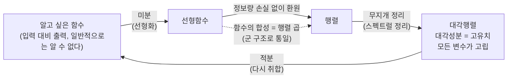

# 벡터공간과 기하적 직관 사이의 논리적 갭 (4기 영상)

오늘은 계산 훈련으로 몸을 푼 뒤, 우리가 지금까지 걸어온 길 — 무한을 다루려는 욕망에서 출발해 군 구조를 거쳐 선형함수와 행렬에 이른 흐름 — 을 다시 정리하고, 거기서 한 걸음 더 나아가 "행렬의 기하적 구조"를 왜 봐야 하는지를 모티베이팅합니다. 마지막에는 $\mathbb{R}^2$의 정의로 돌아가, 여러분 머릿속의 그림과 정의 사이에 숨어 있는 논리적 갭을 함께 찾아봅니다.

---

## [0. 노트는 의심하며 읽는다 · ▶ 00:00](https://www.youtube.com/watch?v=pi2lbN8KgRg&t=0s)

> **💭 생각해볼 점** 노트에 적힌 것을 그냥 받아들이지 마세요. 내적을 만드는 단원에서 행렬 $A$의 1행 1열 성분이 잘못 적힌 오타가 하나 있었는데, 이렇게 적혀 있는 계산들은 여러분이 직접 따라가며 검증할 수 있습니다. "팩트로 외운다"가 아니라 "직접 확인한다"가 이 수업의 자세입니다. 검증 가능한 것을 검증하면서 읽는 태도가 이 강의 전체의 기준입니다.

---

## [1. 계산 훈련 · ▶ 01:43](https://www.youtube.com/watch?v=pi2lbN8KgRg&t=103s)

이번 시간에 돌린 계산 문제들입니다.

- 전개: $(x+1)(x+2)(x+3) = x^3 + 6x^2 + 11x + 6$.
- 전개(문자): $(x+a)(x+b)(x+c) = x^3 + (a+b+c)x^2 + (ab+bc+ca)x + abc$.
- 거듭제곱: $2^9 = 512$, $\;101 \times 99 = 9999$, $\;3^4 = 81$.
- 완전제곱 표현: $3x^2 + 6x + 1 = 3\big((x+1)^2\big) - 2$ (안에서 $+1$, 밖으로 $\times 3$을 뺀 보정으로 $1-3=-2$).
- 완전제곱 표현: $2x^2 + 4x + 1 = 2\big((x+1)^2\big) - 1$.
- 고유치: 행렬 $\begin{pmatrix}1 & 2\\ 0 & 3\end{pmatrix}$의 고유치는 $1, 3$. 행렬 $\begin{pmatrix}1 & 0\\ 2 & 3\end{pmatrix}$의 고유치도 $1, 3$ (삼각행렬이라 대각 성분이 곧 고유치).

정의를 묻는 문제도 섞었습니다. 함수의 정의, 군의 정의와 예시, 행렬식의 정의와 "행렬식이 왜 부피인지", 회전행렬의 형태와 직관, 고유치·고유벡터의 정의, 그리고 "고유벡터를 구할 때 왜 행렬식이 $0$이라는 조건이 들어가는지".

> **✏️ 연습문제** 위 정의 문제들 — 함수의 정의, 군의 정의·예시(교환법칙이 성립하지 않는 군의 예시 포함), 행렬식이 부피인 이유, 회전행렬의 형태와 직관, 고유치·고유벡터의 정의, 고유벡터 계산에서 행렬식 $=0$ 조건의 이유 — 을 툭 던졌을 때 툭 나오도록 정리해 오시기 바랍니다. 특히 $2\times 2$ 행렬이 주어졌을 때 고유치·고유벡터 구하는 법과 회전행렬은 숙련도를 더 올려 와 주세요. 뒤에서 다룰 기하 이야기가 바로 이걸로 굴러갑니다.

---

## [2. 지금까지의 스토리라인: 무한, 근의 공식, 군 구조 · ▶ 14:23](https://www.youtube.com/watch?v=pi2lbN8KgRg&t=863s)

진도를 나가기 전에, 우리가 지금까지 쌓아 온 이야기의 줄기를 다시 봅시다. 출발점은 무한이었습니다. 유한을 생각하는 것과 무한을 생각하는 것은 다른 지점이 있고, 무한을 긍정하기 위해 공리 체계를 받아들이지만 그 공리 체계를 받아들이는 것 자체에 애초에 한계가 있다 — 여기까지 여러분이 어느 정도 공감하고 사유하기 시작한 시점이라고 봅니다.

이 무한을 다루는 정서를 이 강의에 적용했던 방식이 근의 공식 이야기였습니다. 2차 방정식의 근의 공식은 다들 익숙하시고, 같은 방식을 반복하면 3차·4차도 됩니다. 그런데 5차부터는 적어도 팩트로서 근의 공식이 존재하지 않습니다. 유한 번의 사칙연산과 거듭제곱근만으로 근의 공식을 유도하는 것이 불가능하다는 것이 갈루아와 아벨에 의해 증명되어 있습니다.

여기서 문제의식이 중요합니다. 내가 시도한 특정 방법들로 근의 공식을 못 찾았다고 해서 "근의 공식이 없다"고 결론 내릴 수는 없습니다. 나 아닌 누군가가 더 좋은 트릭을 발견할 수 있으니까요. 그런데 "5차 이상에서 근의 공식이 없다"가 뜻하는 바는, 그 어떤 무한 가지의 알고리즘을 적용해도 근의 공식을 끌어낼 수 없다는 것입니다. "내가 해 본 것 중에 안 된다"가 아니라 "어떠한 무한 번의 시도라도 안 된다"를 증명한 것입니다. 그리고 그것을 증명하기 위해 갈루아와 아벨이 도입한 구조가 바로 군 구조였습니다.

> **💭 생각해볼 점** "안 된다"를 어떻게 증명할까요? 한두 번 시도해서 실패한 것과, 무한히 많은 모든 시도가 실패함을 증명하는 것은 전혀 다른 층위의 이야기입니다. 5차 이상 근의 공식의 비존재는 후자입니다 — 그리고 그 증명의 열쇠가 군 구조였다는 점을 기억해 둡시다.

---

## [3. 군을 끌어들인 진짜 이유: 연산의 추상화, 그리고 함수 · ▶ 20:57](https://www.youtube.com/watch?v=pi2lbN8KgRg&t=1257s)

갈루아 이론이 어디까지 가는지는 직문수에서 다루지 않고 팩트로 처리합니다. 정식 과정에서는 이를 갈루아 이론이라 부르는데, 보통은 추상대수를 1년 반 동안 배우고도 언어쌓기에 매몰되어 직관을 놓칩니다. 우리는 그 길로 가지 않습니다.

> **💭 생각해볼 점** 여러분 중 한 분이 "갈루아 이론이 내적과 관련이 있느냐"고 물으셨습니다. 결론부터 말하면 관련이 적습니다. 수학을 이해하는 방식에는 크게 두 가지가 있습니다 — *집합 자체의 구조를 보는 것*과, *집합 위에 사는 함수들을 보는 것*입니다. 비유하자면, 지구를 공부할 때 지구가 어떻게 휘어 있는지(집합의 구조)를 볼 수도 있고, 지구 위에 사는 존재들(집합 위의 함수들)을 통해 볼 수도 있습니다. 같은 대상을 겨냥해도 도구가 달라집니다. 집합의 구조를 보는 쪽이 미분기하라면, 집합 위의 함수들을 보는 쪽이 대수학·대수기하입니다. 갈루아 이론은 후자(대수 쪽)와 호환되는 방식이라 내적·미분기하와는 거리가 있습니다. 포멀하게 말하면, 자리스키 위상공간 위의 함수체(function field)의 대칭성이 군으로 환원되는 것이 정확한 설명입니다만 — 이건 직문수에서 갈 곳이 아닙니다. 미적분학과 어떻게 연결되는지를 보지 못하면 헛소리에 지나지 않게 됩니다.

그렇다면 우리가 군을 끌어들이는, 직문수에서 납득 가능한 맥락은 무엇일까요? **연산이라는 것을 숫자 사이의 연산에만 한정하지 않기 위해서**입니다. 군의 예시로 나왔던 정수와 덧셈, $0$이 아닌 유리수와 곱셈 같은 것을 우리는 사칙연산으로 받아들입니다. 그런데 우리는 연산을 더 넓게 받아들이고 싶습니다 — 일대일 대응 함수들과 그것들의 합성을, 마치 연산처럼 보고 싶은 것입니다. 군이라는 구조를 끌어들인 이유가 바로 이것입니다. 결합법칙·항등원·역원을 따라가면, 함수들의 합성도 숫자의 연산처럼 통일된 틀로 다룰 수 있게 됩니다 (→ [전사본](05.%20Linear%20Algebra%20Part%201%20-%20Linear%20Functions%20and%20Matrices.md) 참조: 합성·항등·역함수가 군의 결합법칙·항등원·역원에 정확히 대응).

여기서 한 걸음 더 좁힙니다. 일대일 대응 함수 중에서도 우리는 **선형함수**에 관심이 있습니다. 함수란 본질적으로 입력과 출력의 관계인데, 그 관계를 숫자의 연산처럼 다루되 군 구조를 기준으로 삼겠다는 것입니다.

> **💭 생각해볼 점** 정리하면 층위가 이렇습니다. (1) 무한을 다루려는 욕망 → 근의 공식 비존재 → 그 발견의 기준이 군 구조 (역사적 맥락). (2) 오늘날 군 구조가 우리에게 중요한 이유는, 숫자들의 연산뿐 아니라 *함수들의 합성*도 연산처럼 다루는 기준이 되어 주기 때문입니다. 이 두 층위가 다르다는 것을 분명히 해 둡시다.

---

## [4. 선형함수를 행렬로: 계산은 100% 행렬이다 · ▶ 28:50](https://www.youtube.com/watch?v=pi2lbN8KgRg&t=1730s)

함수들의 합성을 군 구조로 다루려 할 때, 우리가 보는 것은 선형함수이고, 선형함수는 행렬과 대응됩니다. 함수의 합성은 행렬의 곱셈으로 떨어집니다. 역행렬이 존재하는 행렬들의 모임에 행렬 곱을 군 구조로 주는 방식으로, 연산이라는 체계가 더 이상 숫자의 사칙연산에만 국한되지 않게 확장됩니다.

흐름을 보면 재미있는 일이 일어납니다. 숫자들의 아주 구체적인 연산에서 출발해, 함수들의 합성으로 한 번 추상화했다가, 군 구조라는 틀로 다시 선형함수를 행렬로 바꾸는 순간 *다시 구체적인 층위로 내려온 것*입니다. 여러분은 이미 행렬을 굉장히 많이 쓰고 삽니다. AI 시대의 모든 알고리즘은 결국 행렬을 쓰는 것이고, 엑셀 자체가 그렇습니다. 즉 여러분은 이미 선형함수를 기준으로 무언가를 다루고 있는 셈입니다.

수학을 좀 해 보신 분들에게 한 가지 덧붙이면, 이건 미분과 관련이 있습니다. 일반적인 함수는 입력 대비 출력의 관계지만 우리가 그걸 그대로 다루기는 어렵습니다. 우리가 정말 다루고 싶은 것은 "입력을 두 배 넣으면 출력도 두 배" 같은 선형함수입니다. 함수를 선형함수로 바꿔 주는 행위가 바로 미분입니다 (직문수 후반부에서 상세히 다룹니다).

행렬을 뜻하는 영어 단어 matrix는 라틴어로 자궁·어머니에 해당하는 어원을 갖습니다. 수학에서 가장 중요한 중추라는 의미로 받아들이시면 비약이 없습니다. 여러분이 무언가를 *계산할 수 있는* 이유는 오직 행렬 때문입니다. 모든 것을 계산 가능하게 구체화하는 과정에서, 우리는 선형함수와 행렬을 동기화해 놓고 실제로는 행렬로 계산합니다. 함수 자체로는 대부분의 경우(99%) 인간이 따라갈 수가 없습니다.

> **💭 생각해볼 점** 여러분 중 한 분이 "행렬에서 얻은 유용한 결론을 선형함수만 봐서는 얻을 수 없었던 거냐, 둘을 관찰하는 차이가 정확히 뭐냐"고 물으셨습니다. 선형함수와 행렬은 같은 대상입니다 — 정보량의 손실 없이 서로 환원됩니다 (→ [전사본](05.%20Linear%20Algebra%20Part%201%20-%20Linear%20Functions%20and%20Matrices.md): 선형사상의 합성이 곧 행렬곱과 같다). 다만 행렬 곱은 규칙이 명확히 규정되어 컴퓨터로 처리할 수 있는 반면, 함수의 합성으로 다루면 정의를 일일이 따라가야 해서 변수의 개수만 조금 늘어도 골치가 아파집니다. 그래서 같은 것임을 알되 행렬을 택하는 것입니다. 직접 노트를 따라 선형함수의 합성과 그에 대응하는 행렬 곱이 어떻게 같아지는지 손으로 확인해 보시기를 권합니다.

---

## [5. 우리가 진짜 원하는 행렬: 대각행렬과 고유치 · ▶ 30:52](https://www.youtube.com/watch?v=pi2lbN8KgRg&t=1852s)

$2 \times 2$ 행렬을 $\begin{pmatrix} a & b \\ c & d \end{pmatrix}$라 합시다. 성분이 모두 살아 있으면 $x$와 $y$가 전부 연동됩니다. 그런데 우리가 정말 원하는 것은 그게 아닙니다. 우리가 원하는 건 $x$와 $y$가 완전히 따로 떨어져 노는 것 — 즉

$$
\begin{pmatrix} a & 0 \\ 0 & d \end{pmatrix}
$$

같은 대각행렬입니다. 행렬 곱에 직관이 있다고 가정하고

$$
\begin{pmatrix} a & 0 \\ 0 & d \end{pmatrix}\begin{pmatrix} x \\ y \end{pmatrix} = \begin{pmatrix} ax \\ dy \end{pmatrix}
$$

를 보면, $x$에는 $a$배, $y$에는 $d$배만 해 줄 뿐, $x$와 $y$는 서로 상관이 없습니다. 이때 대각에 들어가는 $a, d$를 유식한 말로 무엇이라 부를까요? 오늘 훈련에서 다룬 바로 그것, **고유치(eigenvalue)** 입니다.

왜 이런 형태를 원하는지 규모로 실감해 봅시다. 지금 어떤 모델의 학습 파라미터 개수가 백만 개를 훌쩍 넘습니다. 행렬로 적혀 있다고 해서 계산할 수 있는 게 아닙니다. 성분이 숫자가 아니라 함수면 더 심합니다 — 트레이스조차 보기 어렵고, 행렬식이나 역행렬은 말할 것도 없습니다. 그러니 변수가 수백만 개인 선형 관계를 다룰 때, 우리가 실제로 원하는 것은 모든 변수가 따로 고립된 형태입니다.

> **💭 생각해볼 점** 변수가 백만 개든 그 이상이든, 행렬을 대각행렬로 바꿀 수만 있으면 결국 1변수를 다루는 것과 같아집니다. 각 변수가 단지 자기 스케일링(고유치 배)만 받기 때문입니다. 여러분이 예전에 고유치·고유벡터를 계산해 본 적이 있다면, 그게 무슨 뜻이고 왜 하는지 — 목적은 행렬을 대각행렬로 바꾸는 것입니다.

---

## [6. 무지개(스펙트럴) 정리, 그리고 미분·적분·행렬이 전부 · ▶ 33:36](https://www.youtube.com/watch?v=pi2lbN8KgRg&t=2016s)

선형함수의 모임을 다루는 것과 행렬의 모임을 다루는 것은 정보량상 같습니다. 그런데 "행렬을 대각행렬로 본다 — 대각 성분만 살아 있다"는 것은 보통 정보를 잃는 이야기입니다. 일반적인 선형함수는 그렇지 않으니까요. 그런데 — 여기서부터가 놀랍습니다.

> 정확히 진술하면: 임의의 $m\times n$ 행렬이 주어질 때 (정방행렬일 필요도 없습니다), 우리는 그것을 *언제나* 정보를 잃지 않는 방식으로 대각행렬로 바꿀 수 있습니다.

이것을 (이 수업의 표현으로) **무지개 정리(스펙트럴 정리)** 라고 부릅니다.

비유하자면 이렇습니다. 여러분이 엑셀을 펴 놓고 탭들을 여러분 방식대로 채우면, 각 탭이 제 역할을 하고 있을 것입니다. 무지개 정리의 역할은, 여러분이 작성한 그 엑셀을 *언제나 대각선만 살아 있게* — 정방이 아닌 경우까지 포함해서 — 바꿀 수 있다는 것입니다. 모든 변수가 서로 고립되도록 다룰 수 있게 됩니다.

이 흐름을 한 번 더 음미해 봅시다. 사칙연산이라는 구체적인 것에서 시작해, 함수들의 합성으로 연산의 층위를 추상화한 뒤, 다시 선형함수 → 행렬 → 대각행렬로 *구체로 내려오는데*, 이 마지막 내려오기가 정보 손실 없이 가능하다 — 그래서 계산이 가능해진다는 것입니다.

그래서 수학은 실제로 이렇게 작동합니다.

1. 내가 알고 싶은 함수(입력 대비 출력의 관계)가 있다. 하지만 일반적으로는 알 수 없다.
2. **미분**으로 선형화한다.
3. 선형화된 대상을 행렬로 다루되, 무지개 정리(스펙트럴 정리)로 **대각행렬**로 가공한다.
4. 그렇게 다룬 정보를 다시 취합한다 — 이 취합이 **적분**이다.

내가 알고자 하는 집합과 함수에 관심이 있는데, 잘 모르니 미분으로 선형화하고, 행렬로 바꿔 대각화로 가공하고, 다시 원래 정보로 원복하는 데 적분이 들어갑니다. 그래서 수학은 분야를 막론하고 미분·적분·행렬이 전부이고, 이걸 어떻게 잘하느냐에서 갖가지 토픽이 생길 뿐입니다.

> **💭 생각해볼 점** 이것이 오늘 이후 우리가 "행렬의 기하적 구조"를 보려는 진짜 이유입니다. 타겟은 단 하나 — *임의의 행렬을 정보량을 일치시키는 방식으로 대각행렬로 바꾸는 것*입니다. 정보를 잃으면서 대충 대각화하는 것은 관심 없습니다. 어떤 정보도 잃지 않고 대각행렬로 바꿀 수 있다 — 이것이 가능하기에 선형대수가 중요한 한 축이 됩니다. 그리고 이것을 가능하게 하는 것이 바로 기하적 구조입니다 (기하적 구조가 무엇인지는 뒤에서).

---

## [7. 특이값 분해(SVD)에 대한 질문 · ▶ 39:14](https://www.youtube.com/watch?v=pi2lbN8KgRg&t=2354s)

> **💭 생각해볼 점** 여러분 중 한 분이 "정보는 보존되지만 데이터 자체의 크기는 실제로 바뀌지 않느냐"고 물으셨습니다. 바뀝니다. 가장 포멀하게 알려진 기준이 **특이값 분해(SVD, singular value decomposition)** 입니다. 임의의 $m\times n$ 행렬 $A$가 주어질 때(조건 없음, 정방일 필요도 없음), $A^{\mathsf{T}}A$와 $AA^{\mathsf{T}}$ 두 행렬을 봅니다. 이 둘은 형태 자체로부터 **대칭행렬**이 되고, 대칭행렬인 순간 무지개 정리(스펙트럴 정리)가 바로 적용됩니다. $AA^{\mathsf{T}}$와 $A^{\mathsf{T}}A$는 각각 크기가 $m\times m$, $n\times n$인데, 각각에서 고유치와 고유벡터를 추출해 원래 행렬을 기술하는 것이 가능합니다. 곱하는 과정에서 랭크를 원래 $m\times n$에 맞추는 방식으로요.

> **💭 생각해볼 점** 이어서 "그럼 데이터가 커지면 컴퓨터가 계산할 때 비효율적이지 않으냐"고 물으셨습니다. 아닙니다 (휴리스틱으로 들어 주세요). 행렬 사이즈가 커져도 그 안에 채워진 것은 대각 성분뿐이라 오히려 효율적입니다. 한 가지 실용적인 비기를 드리면 — 미분을 모르겠으면 일단 FTC, 그게 안 되면 테일러 전개로 도망가듯이, *행렬을 어떻게 다룰지 모르겠으면 무조건 스펙트럴 정리(무지개 정리)로 도망가면* 대개 정답을 줍니다.

---

## [8. $\mathbb{R}^2$의 정의와 머릿속 그림 사이의 갭 · ▶ 45:21](https://www.youtube.com/watch?v=pi2lbN8KgRg&t=2721s)

이제 오늘의 본 이야기입니다. 여기서부터는 제가 "이거 비약 아니냐"고 짚어 주기보다, 여러분 스스로 비약을 *발견*하시기를 바랍니다.

우리가 벡터공간의 대표 예시로 삼아 온 것은 $\mathbb{R}^2$입니다. $\mathbb{R}^2$의 정의가 무엇입니까? 실수 집합의 곱집합 — *순서쌍의 모임*입니다.

$$
\mathbb{R}^2 = \{(x,y) : x\in\mathbb{R},\; y\in\mathbb{R}\}
$$

(→ [전사본](05.%20Linear%20Algebra%20Part%201%20-%20Linear%20Functions%20and%20Matrices.md) 6.1절 참조.) $\mathbb{R}^3$는 3-튜플, $\mathbb{R}^n$는 $n$-튜플의 모임이고, 지금 우리는 $n=2$인 상황을 보고 있을 뿐입니다. 여기까지는 비약이 없습니다 (실수가 무엇이냐는 골치 아픈 문제는 직관적으로 받아들이기로 합니다). 정확히는 여기에 성분별 덧셈 $(x_1,y_1)+(x_2,y_2)=(x_1+x_2,\,y_1+y_2)$와 성분별 스칼라곱 $r(x,y)=(rx,\,ry)$를 동의한 것이 *벡터공간으로서의* $\mathbb{R}^2$입니다.

자, 그러면 여러분 머릿속의 심상과 이 정의 사이의 갭을 찾으실 수 있겠습니까?

> **💭 생각해볼 점** 여러분 중 한 분이 "정렬이 안 돼서 그냥 무작위 점처럼 보일 것"이라 했고, "정렬이 뭐냐"는 물음에는 — $\mathbb{R}^1$에서는 숫자를 대소로 나열할 수 있지만 $\mathbb{R}^2$에서는 $(1,2)$와 $(2,1)$ 중 무엇이 더 큰지 답이 없습니다. 맞습니다. 또 한 분은 "$x$축과 $y$축이 직각으로 교차하는 게 이상하다"고 했습니다. 바로 이것입니다. 여러분은 $\mathbb{R}^2$를 떠올릴 때 10대 때 배운 결론대로 $x$축·$y$축을 직교로 그려 놓고 계신데 — *우리가 언제 그걸 그린다고 동의했습니까?* $\mathbb{R}^2$의 정의는 순서쌍의 모임이지, 순서쌍에 $90^\circ$니 직교 좌표축이니 하는 이야기를 한 적이 없습니다.

---

## [9. 누가 $90^\circ$를, 누가 크기 $1$을 정했나 — 내적의 등장 · ▶ 54:13](https://www.youtube.com/watch?v=pi2lbN8KgRg&t=3253s)

여기서부터 제가 좀 우겨 보겠습니다. 논리적으로 반박할 수 있으면 반박해 보시기 바랍니다.

- 저는 $x$축과 $y$축이 $90^\circ$가 아니라 $30^\circ$라고 하겠습니다. 왜요? 제 마음인데요. $110^\circ$, $45^\circ$라고 해도 됩니다.
- 축을 만드는 방식은 이렇습니다. $(1,0)$에 스칼라배를 해서 한 축을, $(0,1)$에 스칼라배를 해서 다른 축을 만듭니다. 그런데 그 둘이 이루는 각이 왜 $90^\circ$여야 합니까? 제가 $45^\circ$라고 우기면 안 될 이유가 있습니까?
- 더 들어갑니다. 왜 $(1,0)$의 크기가 $1$이어야 합니까? 저는 크기를 $2$라고 하겠습니다. $(0,1)$의 크기도 왜 $1$입니까? $3$이라고 하면 안 됩니까? $(1,0)$은 순서쌍의 한 원소일 뿐인데, 누가 그 크기가 $1$이라고 정했습니까?

> **💭 생각해볼 점** 여러분 중 한 분이 "각도를 임의로 정하면 모든 순서쌍을 표현할 수 있느냐"고 물었습니다. 됩니다. $(1,0)$으로 한 축을, $(0,1)$이 $45^\circ$에 있다고 두 번째 축을 만들면, 둘을 평행사변형 법칙으로 더해 모든 벡터가 나옵니다 — 평행사변형의 대각선이 다 나오니까요. 또 한 분이 "이게 평면이라는 정의 자체는?"이라 물었는데, 우리가 언제 $\mathbb{R}^2$를 평면이라고 했습니까? 순서쌍의 모임일 뿐입니다. 다만 같은 $90^\circ$ 그림을 똑같이 떠올리는 것 자체가 말이 안 된다는 점은 함께 느끼셨을 겁니다.

그래서 $(1,0)$과 $(0,1)$의 크기 및 그 사이의 각도에는 *무한 가지 선택지*가 있습니다. 여러분이 보는 정사각형 그림은 하나의 선택일 뿐, 비틀어도 되고 크기를 바꿔도 되고 임의의 평행사변형이 다 됩니다.

그렇다면 이 무한 가지 선택 중 하나를 *고정하는 룰*이 필요합니다. 그 룰을 현대 선형대수의 표준으로는 **내적(inner product)** 이라고 부릅니다. 내적이 하는 일은 — 벡터의 크기와 두 벡터의 각도를 정하는 것입니다. 우리가 공리를 도입하는 이유 중 하나가 바로 이것입니다. 무한을 다룰 때 기하를 이야기하려면, 무한 가지 선택 중 하나로 룰을 고정해야 비로소 대화가 성립합니다.

> **💭 생각해볼 점** 여러분 중 한 분이 "꼭 내적을 써야 하는 이유가 있느냐, 각도를 모듈러 같은 다른 방식으로 정의해도 되지 않느냐"고 물었습니다. 좋은 질문입니다. 꼭 내적이어야 하는 것은 아닙니다. 필요한 것은 단 두 가지 — 각 벡터의 *크기*를 정할 수 있어야 하고, 두 벡터의 *각도*를 정할 수 있어야 한다는 것뿐입니다. 우리가 순서쌍과 연산만 동의했을 뿐, 크기와 각도는 정한 적이 없으니까요. 그것을 정하는 표준적인 한 방법이 내적이고, 마침 선형성(linearity)을 존중하면서 그 일을 해 주는 가장 나이스한 도구라 널리 쓰이게 된 것입니다. 실제로 현대 첨단 수학에서는 내적조차 포기하려는 흐름도 있습니다.

---

## [10. 유클리드 기하 vs 비유클리드 기하, 그리고 '기하'란 무엇인가 · ▶ 55:03](https://www.youtube.com/watch?v=pi2lbN8KgRg&t=3303s)

$(1,0)$과 $(0,1)$이 크기 $1$로 직교해 정사각형을 이루는 경우 — 이것을 **유클리드 기하**라고 부릅니다. 그 외의 임의의 선택은 모두 **비유클리드 기하**입니다. 그래도 됩니다. $\mathbb{R}^2$의 두 기준 벡터가 이루는 축은 휘어 있어도 됩니다.

> **📚 참고·응용** 응용 맥락에서 관심 있는 분은 **PCA(주성분분석, principal component analysis)** 를 찾아보시기를 권합니다. 통계에서 중요하고, 선형대수 표지에까지 등장하는 그림 — 축을 비틀어 타원형으로 그려 놓은 것 — 이 바로 유클리드 기하가 아닌 기하로 일부러 왜곡해 보는 예입니다. 실제 데이터 구조에는 그게 더 맞기 때문입니다. 어떤 통계적·물리적 구조는 유클리드 기하의 구조에 동의하지 않습니다.

이어서 '기하'라는 단어 자체를 봅시다. 기하(幾何)는 "how much"를 음역한 말입니다. 넓이가 얼마인가, 부피가 얼마인가, 호의 길이가 얼마인가 — 이렇게 *양*을 기준으로 하는 수학이 기하입니다. 기하는 도형 증명 같은 것이 아니라 양을 다루는 수학입니다. 참고로 정량과 대비되는 것이 정성이고, 정성에 대응하는 수학이 위상수학입니다. 그래서 기하와 위상은 관계가 있지만 다릅니다.

> **💭 생각해볼 점** 기하에서 우리가 다루는 것은 계속 강조하듯 *각 벡터의 크기*와 *두 벡터의 각도*입니다. 그리고 이 둘을 말하기에 가장 용이한 도구가 내적입니다. 즉, 군 구조가 (집합론 기초의 공리 위에서) 대수적 구조를 떠받쳤다면, 이제 우리가 비로소 시작하는 것은 *기하적 구조* — 크기와 각도를 정하는 이야기입니다. $(1,0)$, $(0,1)$이 정사각형이어야 한다는 것은 인류가 2천 년 넘게 당연시한 선입견이었음을 함께 의심해 봅시다.

---

## [11. 내적의 역사적 무게: 가우스·리만에서 상대성이론까지, 그리고 Q&A · ▶ 1:06:19](https://www.youtube.com/watch?v=pi2lbN8KgRg&t=3979s)

응용 쪽에서 접근하는 분께 한 가지 더. 여러분이 지금 유클리드 기하로 계산하는 것은 사실 **항등행렬**에 해당합니다. 알고리즘적으로 행렬들을 내가 보는 구조(내적)에 맞게 조정하는 것만 해도 훌륭한 논문이 됩니다. 임의로 찍는 게 아니라, 기하적 구조를 반영하는 내적을 토대로 계산해야 한다는 것입니다 — 쉬운 문제가 아닙니다.

> **💭 생각해볼 점** 여러분 중 한 분이 노트의 한 예제를 물었습니다. 같은 항등행렬 자리에서 예제가 $(0,0,3)$처럼 잡히는데, $(1,0)$과 $(1,0)$을 (배운 대로) 내적하면 $2$가 나올 수 없어 이해가 안 된다는 것이었습니다. 바로 이 지점입니다 — *누가 $(1,0)$과 $(0,1)$의 크기가 $1$이라고 했습니까?* 그 예시 세 개는 내적이 서로 다 다르게 잡혀 있습니다. 우리가 배운 $ac+bd$ 꼴은 항등행렬(예제 1번, 유클리드 내적)을 기준으로 할 때만 그렇게 계산되는 것이고, 기준에서 보면 말이 안 되는 게 맞습니다. 매 예제마다 내적을 다른 것으로 보아야 비로소 말이 됩니다. (참고로 그 계산에는 루트가 잘못 들어간 오타가 섞여 있으니 의심하며 보세요.)

이 내적의 발견은 가우스와 리만 수학이 딛고 선 자리입니다. 해석학이 태동하던 시절 가우스는 이런 것들을 발견하고도 말하기를 꺼렸습니다. 기원전 3세기 유클리드 원전을 따라 항등행렬(유클리드 내적)을 써야 한다는 생각이, 19세기 가우스·리만·볼리아이·로바체프스키에 이르러 처음 흔들리기 시작했습니다.

가장 중요한 사례는 우리가 사는 시공간입니다. 시공간을 4차원($x,y,z$축과 시간축 $t$)으로 보고, 모든 축의 크기가 $1$이고 각이 $90^\circ$라고 하면 그것이 고전역학($F=ma$)이었습니다. 그런데 맥스웰 방정식에 따르면 빛의 속도는 언제나 상수이고, 그러면 시간과 공간은 서로 상대적으로 엮여 있어 — 결국 질량이 큰 곳에서 빛이 휘고, 시공간의 축들이 이루는 관계가 $90^\circ$가 아니게 됩니다. 이 내적을 가지고 아인슈타인이 정립한 것이 일반 상대성이론이고, 우리는 그 예측이 중력파 검출로 확인된 시대를 살고 있습니다.

> **💭 생각해볼 점** Q&A에서 여러 분이 같은 결의 질문을 주셨습니다. (1) "내적으로 각도를 정의하는데, 코사인을 정의할 때 노트에서는 단위원과 직각삼각형으로 정의하지 않았느냐 — 그건 이미 크기와 각도를 암묵적으로 동의한 것 아니냐?" 그 그림은 *유클리드 기하를 기준으로* 사인·코사인을 정의한 것이 맞습니다. 하지만 그것을 *비교군*으로 설정한 것이지, 그것이 정답이라는 뜻은 아닙니다. 사인·코사인은 이미 정의된 것이고, 다른 내적으로 다른 크기·각도를 논할 때도 여전히 사인·코사인으로 기술할 수 있습니다. (2) "그럼 크기와 각도를 재정립하는 거냐, 아니면 양만 조절하는 거냐?" *재정립*입니다 — 유클리드에서 정의돼 있던 크기·각도를 확장해, 그렇지 않은 경우에도 크기와 각도를 논할 수 있게 만드는 것입니다. 우리는 그 특수한 경우(유클리드)를 지금까지 보고 있었던 것입니다. (3) "각도를 잘 정의해서 내적을 쓰는 거냐, 내적을 정의해서 각도를 다루는 거냐?" 각도를 정의한 시점에 이미 내적을 잡아 놓고 하고 있는 것입니다. 즉 내적은 각도를 정의하기 위한 필요조건입니다.

> **📚 참고·응용** 벽돌을 쌓을 때 추를 늘어뜨려 수직을 맞추는 일이나, 측량에서 면적을 재는 일을 떠올려 봅시다 — "우리가 평평한 곳에 살고 있지 않다는 본질을 생각하면, 동네마다 자(척도)의 크기가 다르니 그것을 같은 수준으로 비교하기 위해 내적이 필요하다"는 직관입니다. 표준내적은 그렇게 특별한 것이 아니라, 우리의 직관 속에 이미 들어 있던 것입니다.

마무리하며 한 가지를 다시 말씀드립니다. 제가 말한 팩트들은 여러분이 *직접 검증할 수 있다*는 점이 중요합니다. 팩트로 외울 필요가 없습니다. 다 의심하시고, 노트의 구체적 예시들(특히 6·7·8강)의 계산을 직접 훑으며 검증하는 층위에서 접근하시기 바랍니다. 이 내적 이야기는 직문수 후반부까지 계속 이어집니다.

---

## 요약

- 줄기: 무한을 다루려는 욕망 → 5차 이상 근의 공식의 비존재(어떤 무한 알고리즘으로도 불가능) → 그 증명의 열쇠가 군 구조. 오늘날 군이 중요한 이유는 함수들의 합성을 숫자 연산처럼 다루는 기준이 되어 주기 때문.
- 일대일 대응 함수 중 선형함수에 주목한다. 선형함수 ↔ 행렬은 정보량 손실 없이 같은 대상이며, 함수의 합성은 행렬 곱과 같다. 실제 계산은 100% 행렬로 이루어진다(matrix의 어원은 자궁·어머니, 곧 중추).
- 우리가 원하는 형태는 대각행렬 $\begin{pmatrix} a & 0 \\ 0 & d \end{pmatrix}$로, 대각 성분 $a,d$가 고유치다. 모든 변수가 고립되어 1변수 스케일링으로 환원된다.
- 무지개 정리(스펙트럴 정리): 임의의 $m\times n$ 행렬을 정보 손실 없이 대각행렬로 바꿀 수 있다. SVD는 $A^{\mathsf{T}}A,\, AA^{\mathsf{T}}$(둘 다 대칭)에 스펙트럴 정리를 적용하는 방식.
- 수학의 작동 방식: 미분으로 선형화 → 행렬을 대각행렬로 가공(무지개 정리) → 적분으로 원복. 분야를 막론하고 미분·적분·행렬이 전부.
- $\mathbb{R}^2$의 정의는 순서쌍 $(x,y)$의 모임일 뿐, 직교 좌표축·$90^\circ$·기준 벡터의 크기 $1$은 정의에 들어 있지 않다 — 여기에 머릿속 그림과 정의 사이의 갭이 있다.
- 크기와 각도를 정하는 룰이 내적이며, 그 선택은 무한 가지다. 정사각형(크기 $1$, 직교)으로 보는 것이 유클리드 기하, 그 외가 비유클리드 기하. '기하'는 곧 양(크기·각도)을 다루는 수학이다.
- 내적의 재발견(가우스·리만)이 비유클리드 기하와 일반 상대성이론으로 이어졌다. 항등행렬(유클리드 내적)은 하나의 특수한 선택일 뿐이며, 응용에서는 데이터·물리 구조에 맞는 내적으로 재정립해야 한다(예: PCA).
