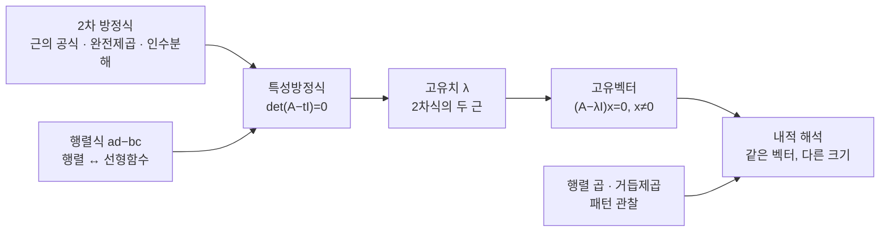

# 2×2 행렬 계산 훈련 (4기 영상)

오늘은 새로운 정의나 정리를 더하지 않고, 지금까지 다룬 것들을 손과 머리에 익히는 계산 훈련만 하겠습니다. 2차 방정식 풀이에서 시작해 행렬식·선형 함수·고유치·고유 벡터·행렬 거듭제곱까지 한 분씩 지목하며 쭉 돌리고, 마지막에 그 계산들을 내적의 관점에서 읽어 보겠습니다.

---

## [0. 들어가며 — 오늘은 계산만 합니다 · ▶ 00:00](https://www.youtube.com/watch?v=iRSq0DkEpzk&t=0s)

오늘 다룰 내용은 전부 이미 들어보신 것들입니다. 새로운 지식은 없습니다. 다만 **팩트로 들어본 것 말고, 여러분이 직접 하실 줄 아는 것**이 필요합니다. 오늘 필요한 능력은 차례로 이렇습니다.

1. 2차 방정식 푸는 법,
2. 그것을 바탕으로 특성방정식(characteristic equation)을 거쳐 고유치(eigenvalue) 구하기,
3. 고유치에서 고유 벡터(eigenvector) 구하기,
4. 그리고 그것을 내적(inner product)에 녹이기.

진행 방식은 한 명에서 시작해 계속 지목해 나가는 방식입니다. 자신 없으면 "모른다"고 넘기셔도 되고, 시간이 필요하면 끝까지 시도하셔도 됩니다. 제가 이상적으로 기대하는 선은, 듣고 0.1초·1초 안에 답이 나오는 상태입니다.

오늘 훈련하는 능력들은 하나가 다음 하나를 받쳐 주는 사슬을 이룹니다. 각 계산이 어디에 기대고 무엇으로 이어지는지를 한눈에 보면 이렇습니다.

---

## [1. 2차 방정식 — 근, 완전제곱, 근의 공식 · ▶ 05:14](https://www.youtube.com/watch?v=iRSq0DkEpzk&t=314s)

첫 세트는 2차 방정식입니다. 같은 식을 여러 형태로 바꿔 가며 한 분씩 지목해 풀어 보겠습니다.

먼저 해를 직접 구하는 형태입니다. $2x^2 + 4x + 1 = 0$ 의 해는 근의 공식으로

$$x = \frac{-4 \pm \sqrt{8}}{4}.$$

같은 식을 **완전제곱(complete the square)** 으로 바꾸는 형태도 드립니다.

$$2x^2 + 4x + 1 = 2\big(x^2 + 2x + 1\big) - 1 = 2(x+1)^2 - 3.$$

방정식이 아니라 식만 드릴 때는 우변의 $=0$ 까지 가지 말고 완전제곱 형태에서 멈춰야 합니다. 예컨대 $3x^2 + 6x + 1$ 은 $3(x+1)^2 - 2$ 까지가 답이고(영상에서는 $-8$로 말했으나 계산상 $-2$가 맞습니다), $4x^2 + 8x + 1$ 은 $4(x+1)^2 - 3$ 입니다.

분모를 $2a$ 가 아니게(분모가 4가 아니게) 쓰는 변형도 연습했습니다. $2x^2 + 4x + 1 = 0$ 의 양변을 2로 나누면 $x^2 + 2x + \tfrac12 = 0$ 이 되고, 여기서 해를 구하면 됩니다. 근의 공식에서 분모로 $2a$ 를 쓰지 않고 답하는 형태도 같은 식으로 물었습니다.

중근이나 단순한 경우도 섞었습니다. $x^2 + 2x + 1 = 0$ 은 $(x+1)^2 = 0$ 이라 $x = -1$, $2x^2 + 4x + 2 = 0$ 은 $2(x+1)^2 = 0$ 이라 $x = -1$, $3x^2 + 6x + 3 = 0$ 도 $x = -1$ 입니다.

> **💭 생각해볼 점** 한 분께 $2x^2+4x+2$ 를 완전제곱으로 바꾸라 했더니 $2(x+1)^2 + 1 = 0$ 처럼 답하셨습니다. 여기서 멈춰 봅시다. 제가 드린 건 방정식이 아니라 식이었으니 $= 0$ 이 붙으면 안 됩니다. "방정식이냐 식이냐"에 따라 어디서 멈춰야 하는지가 달라진다는 것을 계산하면서 몸으로 구분해 두시기 바랍니다.

---

## [2. 인수분해 · ▶ 13:16](https://www.youtube.com/watch?v=iRSq0DkEpzk&t=796s)

이번에는 인수분해입니다. 같은 형태를 빠르게 돌렸습니다.

$$x^2 + 4x + 4 = (x+2)^2,\qquad x^2 + 4x + 3 = (x+3)(x+1),$$
$$x^2 - 4x + 3 = (x-1)(x-3),\qquad x^2 + 4x - 5 = (x+5)(x-1),$$
$$x^2 - 9 = (x+3)(x-3).$$

그런데 깔끔하게 인수분해되지 않는 경우도 일부러 끼워 넣었습니다. $x^2 - 4x + 5 = 0$ 은 한참 맞춰 봐도 정수로 안 맞습니다. 이때는 "아, 아다리가 안 맞네" 하는 느낌을 받은 다음, 근의 공식을 적용해 나온 근을 그대로 $x - (\text{근})$ 꼴로 써서 인수분해할 수밖에 없습니다.

이어서 $2x^2 + 4x - 1$ 을 완전제곱으로 바꾸는 것($2(x+1)^2 - 3$)까지 섞으며 첫 묶음을 마쳤습니다.

> **💭 생각해볼 점** $x^2-4x+5$ 처럼 정수 인수분해가 막힐 때, 여러분은 어떻게 하시겠습니까? 무작정 정수 쌍을 더 찾는 게 아니라, "이건 안 맞는다"를 빨리 느끼고 근의 공식으로 넘어가는 판단 자체가 훈련의 대상입니다.

---

## [3. 행렬식 계산과 행렬 ↔ 선형 함수 변환 · ▶ 16:39](https://www.youtube.com/watch?v=iRSq0DkEpzk&t=999s)

이제 행렬식(determinant)으로 넘어갑니다. $2\times2$ 행렬 $\begin{pmatrix} a & b \\ c & d \end{pmatrix}$ 의 행렬식은 $ad - bc$ 입니다 (→ 전사본 참조: $\det A = ad-bc$).

성분 $1,2,3,4$ 를 순서대로 채운 $\begin{pmatrix} 1 & 2 \\ 3 & 4 \end{pmatrix}$ 의 행렬식은 $1\cdot 4 - 2\cdot 3 = 4 - 6 = -2$ 입니다. 같은 식으로 $\begin{pmatrix} 2 & 1 \\ 1 & 2 \end{pmatrix}$ 는 $4 - 1 = 3$ 처럼 바로 나와야 합니다.

여기에 **행렬과 선형 함수를 자유롭게 오가는** 훈련을 붙였습니다. 행렬 $\begin{pmatrix} 1 & 2 \\ 3 & 4 \end{pmatrix}$ 는 $(x,y)$ 를

$$(x,y)\ \longmapsto\ (x + 2y,\ 3x + 4y)$$

로 보내는 선형 함수입니다. 첫 행 $1\ 2$ 가 위 성분 $x+2y$ 를, 둘째 행 $3\ 4$ 가 아래 성분 $3x+4y$ 를 만듭니다. 경우에 따라 행렬을 드리고 선형 함수로 바꾸라 하거나, 역으로 선형 함수를 드리고 행렬로 바꾸라 합니다.

예를 들어 $(x,y)\mapsto(x+3y,\ 2x-y)$ 는 행렬 $\begin{pmatrix} 1 & 3 \\ 2 & -1 \end{pmatrix}$ 에 대응하고, $\begin{pmatrix} 3 & 2 \\ 1 & 1 \end{pmatrix}$ 는 $(x,y)\mapsto(3x+2y,\ x+y)$ 에 대응합니다.

그다음 두 가지를 합쳤습니다. **선형 함수의 행렬식**을 물으면, 머릿속에서 그 선형 함수를 행렬로 바꾼 뒤 $ad-bc$ 를 적용해야 합니다. $(x,y)\mapsto(x+y,\ x+y)$ 는 행렬 $\begin{pmatrix} 1 & 1 \\ 1 & 1 \end{pmatrix}$ 이라 행렬식이 $0$, $(x,y)\mapsto(y,x)$ 는 $\begin{pmatrix} 0 & 1 \\ 1 & 0 \end{pmatrix}$ 이라 행렬식이 $-1$, $(x,y)\mapsto(x-y,\ x+y)$ 는 $\begin{pmatrix} 1 & -1 \\ 1 & 1 \end{pmatrix}$ 이라 행렬식이 $2$ 입니다.

> **📚 참고·응용** $\begin{pmatrix} a & b \\ c & d \end{pmatrix}$ 의 두 열이 만드는 평행사변형의 넓이가 실제로 $ad - bc$ 로 나옵니다 (→ 전사본 참조: 행렬식 = 두 열벡터가 만드는 평행사변형의 부호 있는 넓이). 또 $2\times2$ 행렬 둘을 곱한 뒤 행렬식을 취한 것과, 각각의 행렬식을 곱한 것이 같습니다($\det(AB)=\det A\,\det B$) — 단순한 숫자를 넣어 직접 확인해 볼 수 있습니다.

---

## [4. 고유치 구하기 — 특성방정식 · ▶ 23:29](https://www.youtube.com/watch?v=iRSq0DkEpzk&t=1409s)

한 단계 올려서 고유치를 구하겠습니다. 절차는 이렇습니다. 행렬 $\begin{pmatrix} a & b \\ c & d \end{pmatrix}$ 가 주어지면, **대각선에서 $t$ 만큼씩 빼서** $\begin{pmatrix} a-t & b \\ c & d-t \end{pmatrix}$ 를 만들고, 여기에 $ad-bc$(즉 행렬식)를 적용해 $t$ 에 대한 2차식을 만든 다음, 그 해를 구하면 됩니다. 이 2차 방정식의 두 근이 고유치입니다.

대각 행렬이나 삼각 행렬은 바로 보입니다. $\begin{pmatrix} 1 & 0 \\ 2 & 3 \end{pmatrix}$ 은 $\begin{pmatrix} 1-t & 0 \\ 2 & 3-t \end{pmatrix}$ 에서 행렬식이 $(1-t)(3-t)$ 가 되어(오른쪽 위 $0$ 덕분에 $2$ 가 사라집니다) 고유치가 $t = 1, 3$ 입니다. 같은 방식으로 $\begin{pmatrix} 1 & 0 \\ 3 & 2 \end{pmatrix}$ 의 고유치는 $1, 2$ 입니다.

오프대각(off-diagonal) 성분이 살아 있는 경우도 돌렸습니다.

- $\begin{pmatrix} 0 & 1 \\ 1 & 0 \end{pmatrix}$: $(-t)(-t) - 1 = t^2 - 1 = 0$ 이라 $t = \pm 1$.
- $\begin{pmatrix} 0 & 2 \\ 1 & 0 \end{pmatrix}$: $t^2 - 2 = 0$ 이라 $t = \pm\sqrt{2}$.
- $\begin{pmatrix} 0 & 2 \\ 2 & 0 \end{pmatrix}$: $t^2 - 4 = 0$ 이라 $t = \pm 2$.
- $\begin{pmatrix} 0 & 2 \\ -2 & 0 \end{pmatrix}$: $t^2 + 4 = 0$ 이라 $t^2 = -4$, 따라서 $t = \pm 2i$.

마지막 예는 실수 범위에서 풀리지 않고 허근이 나옵니다. 행렬식이 $(-t)(-t) - (2)(-2) = t^2 + 4$ 이기 때문입니다.

이어서 **선형 함수로** 고유치를 묻는 형태로 바꿨습니다.

- $(x,y)\mapsto(x,y)$ 는 항등 행렬 $\begin{pmatrix} 1 & 0 \\ 0 & 1 \end{pmatrix}$ 이라 $\begin{pmatrix} 1-t & 0 \\ 0 & 1-t \end{pmatrix}$ 에서 $(1-t)^2 = 0$, 고유치는 $t = 1$ (중근).
- $(x,y)\mapsto(y,x)$ 는 $\begin{pmatrix} 0 & 1 \\ 1 & 0 \end{pmatrix}$ 이라 $t = \pm 1$.
- $(x,y)\mapsto(2y, 2x)$ 는 $\begin{pmatrix} 0 & 2 \\ 2 & 0 \end{pmatrix}$ 이라 $\begin{pmatrix} -t & 2 \\ 2 & -t \end{pmatrix}$ 에서 $t^2 - 4 = 0$, $t = \pm 2$.
- $(x,y)\mapsto(3y, 3x)$ 는 $\begin{pmatrix} 0 & 3 \\ 3 & 0 \end{pmatrix}$ 이라 $t = \pm 3$.

> **💭 생각해볼 점** $(x,y)\mapsto(x,y)$ 의 고유치를 묻자 "0과 2" 같은 답이 나오기도 했습니다. 여기서 멈춰 봅시다. 이 함수의 계수 행렬을 정확히 적으면 $\begin{pmatrix} 1 & 0 \\ 0 & 1 \end{pmatrix}$ 인 항등 행렬입니다. 선형 함수를 받았을 때 마음속에서 정확한 행렬로 옮기는 그 한 단계를, 생각 없이 흘러가듯 통과할 수 있어야 정작 풀어야 할 곳에 집중할 수 있습니다.

---

## [5. 고유 벡터에 왜 "역행렬 없음"이 들어가는가 · ▶ 31:51](https://www.youtube.com/watch?v=iRSq0DkEpzk&t=1911s)

여기서 한 분께 설명을 부탁했습니다. 고유치에서 고유 벡터를 구할 때 왜 "$A - \lambda I$ 의 역행렬이 없다", 즉 **행렬식이 $0$** 이라는 조건이 들어가는가? 한 참여자분이 거의 완벽하게 답해 주셨고, 저는 그 논증을 이렇게 정리합니다.

고유 벡터는 **영벡터가 아닌** $x$ 로서, 어떤 상수 $\lambda$ 에 대해

$$Ax = \lambda x$$

를 만족하는 것입니다. $\lambda x = \lambda I x$ 로 쓰고 좌변으로 옮기면

$$(A - \lambda I)\,x = 0.$$

그런데 $x$ 가 영벡터가 아니어야 한다고 정의했습니다. 영벡터가 아닌 $x$ 에 대해 이 식이 $0$ 이 되려면, 앞의 $A - \lambda I$ 가 역행렬을 가져서는 안 됩니다. 만약 $A - \lambda I$ 에 역행렬이 있다면 양변에 곱해 $x = 0$ 이 되어 모순이기 때문입니다. 따라서

$$\det(A - \lambda I) = 0$$

이 되어야 합니다. 이것이 **유일한** 이유이고, 그 뿌리는 "고유 벡터는 영벡터를 배제한다"는 정의 그 자체입니다. (반면 고유치 $\lambda$ 는 $0$ 이어도 괜찮습니다.)

> **💭 생각해볼 점** 여러분은 이 논증을 정의에서부터 직접 따라가 보실 수 있겠습니까? "왜 행렬식이 $0$ 이어야 하느냐"는 머리가 좋고 나쁘고의 문제가 아니라, 정의에서 한 단계씩 따라가 보면 누구나 도달할 수 있는 결론입니다.

---

## [6. 고유 벡터 구하기 — 예시와 절차 (세트 2) · ▶ 44:04](https://www.youtube.com/watch?v=iRSq0DkEpzk&t=2644s)

두 번째 세트입니다. 고유 벡터를 구하기 전에, 같이 한 가지 예시를 보겠습니다. 앞으로는 행렬과 선형 함수를 섞어 드릴 테니, 마음속으로 둘을 등가로 보셔야 합니다.

행렬 $\begin{pmatrix} 1 & 0 \\ 0 & 2 \end{pmatrix}$ 를 봅시다. 고유 벡터를 구하려면 **무조건 고유치를 먼저** 계산합니다. 고유치는 $1$ 과 $2$ 입니다. 그다음 각 고유치에 대응하는 고유 벡터를 구하는데, 중근이 아닌 한 고유 벡터는 **언제나 두 개**(고유치마다 하나씩)를 다 찾아야 합니다.

고유치 $1$ 부터 합니다. $\begin{pmatrix} 1-t & 0 \\ 0 & 2-t \end{pmatrix}$ 에 $t=1$ 을 다시 넣으면 $\begin{pmatrix} 0 & 0 \\ 0 & 1 \end{pmatrix}$ 이 나옵니다. 고유 벡터는 이 행렬에 $\begin{pmatrix} x \\ y \end{pmatrix}$ 를 곱했을 때 $0$ 이 되면서 $x,y$ 가 동시에 $0$ 은 아닌 것입니다. 둘째 줄에서 $y = 0$ 이어야 하므로, $1$ 에 대응하는 고유 벡터의 한 답은 $\begin{pmatrix} 1 \\ 0 \end{pmatrix}$ 입니다.

고유치 $2$ 도 보겠습니다. $t=2$ 를 넣으면 $\begin{pmatrix} -1 & 0 \\ 0 & 0 \end{pmatrix}$ 이 됩니다. 첫째 줄에서 $-x = 0$, 즉 $x = 0$ 이어야 하고, 둘째 줄은 아무 제약이 없는 식입니다. 그래서 $2$ 에 대응하는 고유 벡터는 $\begin{pmatrix} 0 \\ 1 \end{pmatrix}$ 입니다. 참고로 고유 벡터의 선택지는 무한히 많습니다(스칼라배는 모두 고유 벡터).

이 절차의 순서가 보이실 겁니다. 고유 벡터까지 가려면 행렬·고유치가 먼저 손에 잡혀 있어야 합니다.

> **💭 생각해볼 점** "$(A-\lambda I)x = 0$ 이 되는 $x$ 를 찾아라"는 말이 처음엔 헷갈리실 수 있습니다. 머릿속에서 막연히 "이러면 되겠지" 하고 안 해 보는 경우가 많은데, 몇 번 실제로 해 보면 패턴이 보입니다. 먼저 해 보고, 그다음에 감상으로 들어가시기 바랍니다.

---

## [7. 행렬 곱과 거듭제곱 패턴 · ▶ 52:06](https://www.youtube.com/watch?v=iRSq0DkEpzk&t=3126s)

고유 벡터로 곧장 가기 전에, 행렬 곱과 거듭제곱을 손에 익히는 훈련을 끼워 넣겠습니다.

먼저 행렬·벡터 곱입니다. $\begin{pmatrix} 1 & 1 \\ 1 & 1 \end{pmatrix}\begin{pmatrix} x \\ y \end{pmatrix} = \begin{pmatrix} x+y \\ x+y \end{pmatrix}$, $\begin{pmatrix} 2 & 3 \\ 1 & 2 \end{pmatrix}\begin{pmatrix} x \\ y \end{pmatrix} = \begin{pmatrix} 2x+3y \\ x+2y \end{pmatrix}$, 일반적으로 $\begin{pmatrix} a & b \\ c & d \end{pmatrix}\begin{pmatrix} x \\ y \end{pmatrix} = \begin{pmatrix} ax+by \\ cx+dy \end{pmatrix}$ 입니다.

다음은 **제곱 행렬**입니다. $\begin{pmatrix} a & b \\ c & d \end{pmatrix}^2$ 의 성분 패턴은 이렇게 익혀 두시면 편합니다.

$$\begin{pmatrix} a & b \\ c & d \end{pmatrix}^2 = \begin{pmatrix} a^2 + bc & ab + bd \\ ca + dc & d^2 + bc \end{pmatrix}.$$

좌상은 $a^2 + bc$, 우상은 $b(a+d)$, 좌하는 $c(a+d)$, 우하는 $d^2 + bc$ 입니다.

대각 행렬의 거듭제곱은 바로 보입니다. $\begin{pmatrix} 2 & 0 \\ 0 & 3 \end{pmatrix}^3 = \begin{pmatrix} 2^3 & 0 \\ 0 & 3^3 \end{pmatrix}$, 같은 식으로 $\begin{pmatrix} 2 & 0 \\ 0 & 3 \end{pmatrix}^{2025} = \begin{pmatrix} 2^{2025} & 0 \\ 0 & 3^{2025} \end{pmatrix}$ 입니다.

여기서 한 행렬을 잡아 거듭제곱하며 **패턴을 관찰**하도록 유도했습니다. 핵심 예가 $\begin{pmatrix} 1 & 1 \\ 0 & 1 \end{pmatrix}$ 입니다 (위 삼각, 대각이 모두 $1$). 제곱하면

$$\begin{pmatrix} 1 & 1 \\ 0 & 1 \end{pmatrix}^2 = \begin{pmatrix} 1 & 2 \\ 0 & 1 \end{pmatrix},\quad \begin{pmatrix} 1 & 1 \\ 0 & 1 \end{pmatrix}^3 = \begin{pmatrix} 1 & 3 \\ 0 & 1 \end{pmatrix},\quad \dots,\quad \begin{pmatrix} 1 & 1 \\ 0 & 1 \end{pmatrix}^{n} = \begin{pmatrix} 1 & n \\ 0 & 1 \end{pmatrix}.$$

직접 한 번 더 곱해 보면, 우상 성분만 매번 $1$ 씩 더 붙어 $n$ 제곱에서 $n$ 이 된다는 게 보입니다. 한 분은 "한쪽 대각에서 양쪽으로 $1$ 이 좌우로 더해지는 느낌"으로, 다른 분은 "제곱을 두 번 하는" 방식으로 같은 답에 도달하셨습니다.

> **💭 생각해볼 점** 일반적으로 $a,b,c,d$ 로 놓으면 머리로 감당이 안 됩니다. 그러니 쉬운 작은 예($\begin{pmatrix} 1 & 1 \\ 0 & 1 \end{pmatrix}$ 같은)로 시작해 관찰하고, 패턴을 만든 다음, 거기서 원하는 만큼 무게를 올리는 것입니다. 여러분은 어디서 막히고, 그 막힌 지점을 어떻게 뻔하게 만드시겠습니까?

> **📚 참고·응용** 한 분이 $\begin{pmatrix} 1 & 0 \\ 2 & 1 \end{pmatrix}^3$ 에서 좌하 성분을 답하기도 했는데, 이는 좌하 성분이 제곱수만큼 늘어나는 같은 패턴($\begin{pmatrix} 1 & 0 \\ n & 1 \end{pmatrix}$)을 손으로 확인해 가는 과정이었습니다.

---

## [8. 마지막 세트 — 고유 벡터 드릴 · ▶ 1:12:42](https://www.youtube.com/watch?v=iRSq0DkEpzk&t=4362s)

오늘 마지막 세트는 고유 벡터의 초기 버전입니다. 패턴을 익히도록 같은 행렬을 반복해 묻고, "방금 나오지 않은 고유 벡터를 찾으라"는 식으로 돌리겠습니다.

$\begin{pmatrix} 2 & 0 \\ 0 & 3 \end{pmatrix}$ 의 고유 벡터는 $\begin{pmatrix} 1 \\ 0 \end{pmatrix}$ 와 $\begin{pmatrix} 0 \\ 1 \end{pmatrix}$, $\begin{pmatrix} 3 & 0 \\ 0 & 2 \end{pmatrix}$ 도 마찬가지로 $\begin{pmatrix} 1 \\ 0 \end{pmatrix}$ 와 $\begin{pmatrix} 0 \\ 1 \end{pmatrix}$ 입니다. 다만 "그 둘이 아닌 고유 벡터"를 물으면, $\begin{pmatrix} 2 \\ 0 \end{pmatrix}$, $\begin{pmatrix} 0 \\ 3 \end{pmatrix}$ 처럼 스칼라배도 모두 답이 됩니다.

행렬을 $\begin{pmatrix} 1 & 1 \\ 1 & 1 \end{pmatrix}$ 로 바꾸면 상황이 달라집니다. 이 행렬에서는 고유 벡터로 $\begin{pmatrix} 1 \\ 1 \end{pmatrix}$ 과 $\begin{pmatrix} 1 \\ -1 \end{pmatrix}$ 이 나오고, 그 스칼라배인 $\begin{pmatrix} 2 \\ 2 \end{pmatrix}$, $\begin{pmatrix} 2 \\ -2 \end{pmatrix}$ 등도 모두 답입니다.

> **💭 생각해볼 점** $\begin{pmatrix} 1 & 1 \\ 1 & 1 \end{pmatrix}$ 의 고유 벡터로 $\begin{pmatrix} 0 \\ 0 \end{pmatrix}$ 을 든 답이 나왔습니다. 여기서 멈춥시다. 고유 벡터는 **언제나 영벡터를 배제**합니다(섹션 5의 정의). 그래서 이건 답이 될 수 없습니다.

> **💭 생각해볼 점** "$\begin{pmatrix} 1 \\ 0 \end{pmatrix}$ 도 $\begin{pmatrix} 0 \\ 1 \end{pmatrix}$ 도 아닌 고유 벡터를 찾아라" 같은 물음은, 함께 대화하며 맞춰 가기 좋은 진짜 수학적인 질문입니다. "그 둘이 아닌 걸 어떻게 찾지?"를 함께 풀고, 이해하고, 다시 부수며 가시면 됩니다.

---

## [9. 계산을 내적으로 읽기 — 같은 벡터, 다른 해석 · ▶ 1:18:52](https://www.youtube.com/watch?v=iRSq0DkEpzk&t=4732s)

이 계산들을 **내적의 관점**에서 다시 보겠습니다.

오늘 다룬 세 행렬을 같이 봅시다. $\begin{pmatrix} 3 & 0 \\ 0 & 2 \end{pmatrix}$, $\begin{pmatrix} 2 & 0 \\ 0 & 3 \end{pmatrix}$, 그리고 $\begin{pmatrix} 1 & 1 \\ 1 & 1 \end{pmatrix}$ 입니다. 앞의 두 대각 행렬에서 고유 벡터는 모두 $\begin{pmatrix} 1 \\ 0 \end{pmatrix}$, $\begin{pmatrix} 0 \\ 1 \end{pmatrix}$ 로 같게 나왔습니다. 그런데 이 행렬을 하나의 내적으로 보면, 같은 벡터의 "크기"가 달라집니다.

- $\begin{pmatrix} 3 & 0 \\ 0 & 2 \end{pmatrix}$ 라는 내적에서는 $\begin{pmatrix} 1 \\ 0 \end{pmatrix}$ 의 크기가 $\sqrt{3}$, $\begin{pmatrix} 0 \\ 1 \end{pmatrix}$ 의 크기가 $\sqrt{2}$.
- $\begin{pmatrix} 2 & 0 \\ 0 & 3 \end{pmatrix}$ 라는 내적에서는 $\begin{pmatrix} 1 \\ 0 \end{pmatrix}$ 의 크기가 $\sqrt{2}$, $\begin{pmatrix} 0 \\ 1 \end{pmatrix}$ 의 크기가 $\sqrt{3}$.

두 경우 모두 $\begin{pmatrix} 1 \\ 0 \end{pmatrix}$ 과 $\begin{pmatrix} 0 \\ 1 \end{pmatrix}$ 은 여전히 90도로 만납니다. 즉 같은 두 벡터인데 **어떤 내적을 고르느냐**에 따라 크기가 다르게 읽힙니다.

행렬을 항등 행렬 $\begin{pmatrix} 1 & 0 \\ 0 & 1 \end{pmatrix}$ 로 고르면, 고유 벡터는 여전히 $\begin{pmatrix} 1 \\ 0 \end{pmatrix}$, $\begin{pmatrix} 0 \\ 1 \end{pmatrix}$ 이고 둘의 크기가 모두 $1$ 입니다. 그런데 $\begin{pmatrix} 1 & 1 \\ 1 & 1 \end{pmatrix}$ 로 가면 처음으로 다른 일이 생깁니다. $\begin{pmatrix} 1 \\ 0 \end{pmatrix}$ 과 $\begin{pmatrix} 0 \\ 1 \end{pmatrix}$ 이 더 이상 (이 내적에서는) 직교 축의 역할을 못 하고, 고유 벡터의 선택지가 $\begin{pmatrix} 1 \\ 1 \end{pmatrix}$, $\begin{pmatrix} 1 \\ -1 \end{pmatrix}$ 쪽으로 축이 비스듬히 바뀝니다. 이것이 스펙트럴 정리(spectral theorem)[?]가 보여 주는 그림입니다.

선형성의 정의를 적용해 보면, 같은 $\begin{pmatrix} 1 \\ 0 \end{pmatrix}$, $\begin{pmatrix} 0 \\ 1 \end{pmatrix}$ 라는 벡터의 해석이 내적에 따라 어떻게 바뀌는지가 보입니다. 이 관점이 7강·8강의 내용입니다.

> **💭 생각해볼 점** 한 분이 "예시가 자꾸 특이한 케이스(0이 끼어 있는 것)만 나오는데, 일반적인 행렬의 고유 벡터 구하기에도 영향을 주느냐"고 물으셨습니다. 답은 이렇습니다. 오프대각 성분 하나를 일부러 $0$ 으로 잡는 건, 그래야 여러분이 **머리로** 할 수 있기 때문입니다. 일반적으로 다 잡으면 머리로는 불가능합니다. 머리로 던질 수 있으면서 의미가 있는 예는 선택지가 몇 개 없습니다.

> **📚 참고·응용** 또 한 분이 "프로그램 돌리면 가끔 eigenvalue 어쩌고 하는 메시지가 뜨던데, 고유 벡터가 실제로 어디 쓰이느냐"고 물으셨습니다. 풀어서 답하면 이렇습니다. 수학의 관건은 늘 "무한을 어떻게 유한으로 낮추느냐"입니다. $\mathbb{R}^2$ 만 해도 원소가 무한히 많아 다룰 수 없어서, 우리는 선형성에 기대 $\begin{pmatrix} 1 \\ 0 \end{pmatrix}$, $\begin{pmatrix} 0 \\ 1 \end{pmatrix}$ 두 개만 알면 전부 안다고 봅니다. 선형 함수를 행렬로 표현해도 크기 $m,n$ 이 커지면 다루기 어렵고, 그래서 **대각선만 살아 있기를** 원합니다. 그것이 스펙트럴 정리[?]가 주려는 것입니다. 다만 이렇게 직교 분해(orthogonal decomposition)로 깔끔히 떨어지려면 실수 계수의 **대칭 행렬(symmetric matrix)** 이어야 하고, 그것이 일반적으로 보장되는 것이 특이값 분해(singular value decomposition, SVD)[?]입니다. 그리고 선형대수의 중요한 포인트 하나 — 우리는 이 모든 것을 충분조건으로 만들었지 필요조건만으로 만든 적이 없습니다. 그래서 나중에는 유한 차원도, 내적도, 심지어 벡터 공간조차 필요 없어지는 함의로 이어집니다(추상대수는 선형대수에서 선형성 가정을 떼어낸 것에 가깝습니다).

---

## [10. 마무리 — 남은 수학적 질문들 · ▶ 1:23:17](https://www.youtube.com/watch?v=iRSq0DkEpzk&t=4997s)

고유 벡터가 항상 열벡터 형태로 나오느냐는 질문이 있었는데, 네, 항상 그렇습니다. 여기서는 차원을 2차원으로 제약하고 있어서 그렇지, 학부 수학에서는 일반적인 $n$ 차원으로 합니다. 직관을 잡는 단계에서는 $2\times2$ 로 해 보는 것이 좋습니다 — $3\times3$ 만 돼도 계산량 때문에 골치가 아프거든요. 사실 $n$ 이 유한할 필요조차 없습니다.

"고유 벡터에서 왜 행렬식이 $0$ 임을 가정하느냐"는 질문도 다시 나왔는데, 답은 섹션 5에서 정리한 그대로입니다 — **정의 때문**입니다. 고유 벡터의 정의가 영벡터를 배제하기 때문에, $A - \lambda I$ 에 역행렬이 존재하는 순간 모순이 생깁니다. 다만 고유치는 $0$ 이어도 됩니다.

> **💭 생각해볼 점** 무지개[?] 정리(스펙트럴 정리) 자체도 중요하지만, 그 정리에 앞서 오늘 다룬 계산 — 2차 방정식부터 고유 벡터·내적 해석까지 — 을 직접 손에 익혀 두는 것이 핵심입니다. 다음 시간에는 오늘 익힌 고유 벡터를 토대로 내적 이야기를 시작합니다.

---

## 요약

- 오늘은 새 정의·정리 없이, 2차 방정식 → 행렬식 → 고유치 → 고유 벡터 → 행렬 거듭제곱 → 내적 해석 순서로 **계산을 몸에 익히는 훈련**만 했습니다. 한 명씩 지목해 0.1초·1초 안에 답이 나오는 상태를 목표로 했습니다.
- 2차 방정식은 근의 공식·완전제곱·인수분해를 한 식으로 여러 형태로 변형하며 연습했고, "방정식이냐 식이냐"에 따라 멈추는 지점이 다름을 강조했습니다.
- $2\times2$ 행렬식은 $\det\begin{pmatrix} a & b \\ c & d \end{pmatrix} = ad - bc$ 이며, 행렬 ↔ 선형 함수 $(x,y)\mapsto(ax+by,\ cx+dy)$ 변환을 자유롭게 오가야 합니다 (→ 전사본 참조).
- 고유치는 대각선에서 $t$ 를 빼고 $\det(A - tI) = 0$ 으로 만든 2차 방정식의 두 근입니다. 실근뿐 아니라 $\pm 2i$ 같은 허근도 나옵니다.
- 고유 벡터는 $(A - \lambda I)x = 0$ 의 영벡터가 아닌 해입니다. 영벡터를 배제하는 정의 때문에 $\det(A - \lambda I) = 0$ 이 필요하고, 고유치마다 하나씩(중근 제외) 두 개를 찾으며 스칼라배는 모두 답입니다. 고유치는 $0$ 이어도 됩니다.
- 거듭제곱 패턴: $\begin{pmatrix} 1 & 1 \\ 0 & 1 \end{pmatrix}^n = \begin{pmatrix} 1 & n \\ 0 & 1 \end{pmatrix}$, 대각 행렬은 성분별 거듭제곱. 큰 일반식 대신 쉬운 작은 예로 패턴을 관찰한 뒤 무게를 올리는 방식을 권했습니다.
- 같은 고유 벡터 $\begin{pmatrix} 1 \\ 0 \end{pmatrix},\begin{pmatrix} 0 \\ 1 \end{pmatrix}$ 이라도 어떤 내적(대각 행렬)을 고르느냐에 따라 크기($\sqrt{3},\sqrt{2}$ 등)가 달리 읽히고, $\begin{pmatrix} 1 & 1 \\ 1 & 1 \end{pmatrix}$ 에서는 직교 축이 $\begin{pmatrix} 1 \\ 1 \end{pmatrix},\begin{pmatrix} 1 \\ -1 \end{pmatrix}$ 로 바뀝니다 — 스펙트럴 정리[?]의 그림이며 7·8강으로 이어집니다.
