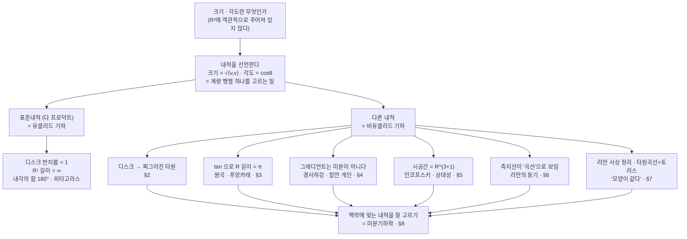

# 기하학적 관점에서 길이와 각도 낯설게 바라보기 (3기 영상)

오늘은 노트를 읽어 내려가지 않고, 단 하나의 물음만 붙들고 함께 이야기를 나눕니다. **크기(길이)와 각도란 무엇인가.** 이것들이 $\mathbb{R}^2$ 에 객관적으로 주어져 있는 양이 아니라, **내적을 어떻게 선언하느냐에 따라 정해지는 결과물**이라는 점을 받아들이고, 그 관점이 미분·그레디언트·시공간·제어·통계 같은 여러분이 신경 쓰는 맥락과 어떻게 맞닿는지를 봅니다.

---

## [0. 오늘의 노선 — 군에서 내적(기하)으로 · ▶ 6:43](https://www.youtube.com/watch?v=URS4DVtlhLs&t=403s)

지금까지 직문수가 걸어온 노선을 한번 짚고 갑니다. 공리에서 출발해, "옳고 그름을 명확히 말할 수 없다"는 이야기를 했고, **군(group)**이라는 관점으로 자연수·정수·유리수를 구분하고 함수의 합성을 보았습니다. 그런데 지난 시간부터, $ad-bc$ 같은 양이 **평행사변형의 면적**과 일치한다는 사실을 마주하면서 관점을 조금씩 옮기기 시작했습니다.

여기서 강조하고 싶은 것은 태도입니다. 역행렬을 군의 관점에서 유도했을 때 수식의 결과에 그냥 만족하고 멈추는 것이 아니라, "**그런데 이게 도대체 뭐지**" 하고 묻는다는 점입니다. 수식의 유도가 이해 안 가는 것과, 유도는 되는데 그 의미가 안 잡히는 것은 서로 다른 이야기입니다. 오늘은 후자, 즉 같은 대상을 **기하학적 렌즈**로 다시 보는 일을 합니다.

기하(geometry)는 한자 어원으로 하우머치(how much), 곧 **양(quantity)을 잰다**는 뜻입니다. 삼각형·사각형·원만 기하가 아니라, 수학으로 어떤 양을 정량적으로 다루려는 것은 모두 기하적 대상입니다. 양을 얘기할 수 있는 구조를 가진 집합을 **공간**으로 보고, 그 공간을 이해하는 데 쓸모 있는 양과 그 함의를 공부하는 일이 기하입니다.

> **💭 생각해볼 점 — 대수가 먼저인가, 기하가 먼저인가** 여러분 중 한 분이 물었습니다. "선형대수의 대상을 **대수적으로** 찾아놓고 그것을 기하적으로 해석하는 건가요, 아니면 대수적인 줄 알았던 것이 사실은 기하적이었다고 보는 건가요?" 제 답은 이렇습니다. 대상(오브젝트) 자체는 똑같습니다. 같은 코끼리를 장님이 만지는데 부위를 다르게 해석하는 것에 지나지 않아요. 대수적으로 말하나 기하적으로 말하나 같은 실체를 가리키고, 단지 **자연스럽게 생각하는 렌즈를 바꾸는** 것입니다.

---

## [1. 오늘의 단 하나의 질문 — "크기와 각도란 무엇인가" · ▶ 18:56](https://www.youtube.com/watch?v=URS4DVtlhLs&t=1136s)

오늘 던질 가장 중요한 질문은 둘이고, 사실상 하나입니다. 앞에서 회전·면적을 유도하며 **각도**와 **크기**라는 개념을 이미 써왔는데, 정작 묻지 않은 것이 있습니다. **각도란 무엇이고 크기란 무엇인가.**

초심자 입장에서 비틀어 묻겠습니다. $ad-bc\neq 0$ 인 행렬은 선형사상으로서 **일대일 대응(가역)**입니다. 그러면 같은 두 벡터를 $\mathbb{R}^2$ 에 그려놓고, 이 행렬을 곱해 다른 두 벡터로 옮길 수 있습니다. 옮기는 것은 언제나 가능하니, 옮긴 쪽을 "크기·각도"라 봐야 하는지 원래 쪽을 그렇게 봐야 하는지는 **우리가 정해야 하는 문제**입니다.

여기 계신 분이 답을 정확히 말해 주었습니다. "**내적으로부터 놈(norm)을 정의하고, 내적에서 나오는 $\theta$ 가 각도가 됩니다.**" 그렇습니다. 그러면 한번 따져봅시다. 벡터 $(1,0)$ 의 크기가 반드시 $1$ 이어야 할 절대적 당위가 있습니까? 없습니다. 우리가 $1$ 이라 **정할** 뿐이고, 누군가는 $2$ 라 정해도 됩니다. $(1,0)$ 과 $(0,1)$ 의 사잇각이 꼭 $90^\circ$ 여야 합니까? 그것도 우리가 정하는 것입니다.

$$
\lVert v\rVert = \sqrt{\langle v,v\rangle},\qquad
\cos\theta = \frac{\langle u,v\rangle}{\lVert u\rVert\,\lVert v\rVert}
$$

분모도 분자도 모두 내적으로 정의되어 있으니, **크기도 각도도 분명히 내적의 결과**입니다. 그리고 이렇게 크기·각도를 정해 주는 기준을 선언하는 일이 곧 **내적을 선언하는 일**입니다 (→ 전사본 6.3–6.4 참조).

> **💭 생각해볼 점 — "삼각형 내각의 합이 180°"는 이미 무언가를 정해놓은 말이다** 우리가 그동안 "삼각형 내각의 합은 $180^\circ$" 같은 말을 참 쉽게 써왔는데, 그것은 이미 크기·각도를 재는 방법을 정해놓고 쓰는 말입니다. $(1,0)$ 과 $(0,1)$ 이 서로 수직이고 크기가 $1$ 이라는 것조차 사실은 **공리(약속)의 영역**입니다. 직문 초반에 "내각의 합이 $180^\circ$ 라는 것도, 피타고라스 정리도 사실은 공리다"라고 했던 이야기와 정확히 같은 자리에 있는 셈입니다.

> **💭 생각해볼 점 — 표준내적은 "표준기저 + 단위자(尺)"를 고른 결과** 여러분 중 한 분이 정리해 주었습니다. "$\mathbb{R}^2$ 의 기저를 꼭 표준기저로 잡을 필요가 없고, $90^\circ$ 가 아닌 기저로 좌표를 생각하면 $(1,0),(0,1)$ 이 수직일 이유가 없다. 또 자(尺)의 단위 길이를 바꾸면 $(1,0)$ 의 길이도 달라질 수 있다 — 결국 기저를 어떻게 잡고 자의 단위를 어떻게 잡느냐가 내적을 바꾸는 일과 같다." 정확합니다.

오늘 이야기의 전체 구조를 한눈에 그려 두면 이렇습니다. 모든 가지가 **"내적을 선언한다"**는 하나의 행위에서 갈라져 나옵니다.

---

## [2. 디스크의 반지름은 정말 1인가 — 내적을 비틀어 보기 · ▶ 38:39](https://www.youtube.com/watch?v=URS4DVtlhLs&t=2319s)

집합으로서의 $\mathbb{R}^2$ 를 머릿속에 펼쳐 놓습니다. $(1,0),(0,1)$ 을 지나는 원의 안쪽, 즉 $\{(x,y): x^2+y^2 \le 1\}$ 을 디스크라 부릅니다. 그런데 이 디스크의 "반지름이 $1$"이라는 말은 **다 프로덕트(표준내적)를 $\mathbb{R}^2$ 에 줬다는 대전제** 아래에서만 성립합니다.

> **💭 생각해볼 점 — 내적이 없으면 그것을 "원"이라 부를 수도 없다** 여러분 중 한 분이 날카롭게 지적했습니다. "원은 원점에서 거리가 같은 점들의 집합인데, 내적이 정해져 있지 않으면 원점에서 $(1,0)$ 까지의 거리와 $(0,1)$ 까지의 거리가 다를 수 있고, 그러면 애초에 그것을 원이라 부를 수 없는 것 아닌가요?" 정확히 맞습니다. 그래서 안쪽 영역을 그냥 집합으로서 **디스크**라 부르고 있을 뿐, 그 반지름을 $1$ 이라고 볼 근거는 표준내적을 쓰기로 한 합의에서만 나옵니다.

이제 내적을 구체적으로 비틀어 봅니다.

- $(1,0)$ 의 크기를 $2$, $(0,1)$ 의 크기를 $1$ 로 만드는 내적을 고르면, "디스크"는 **찌그러진 타원**처럼 생긴 것이 됩니다.
- $(1,0)$ 의 크기를 $100$ 으로 키우면 더 심하게 찌그러집니다. 이쯤 되면 "넓이 $=\pi r^2$" 같은 말은 더 이상 성립하지 않습니다.

왜 그렇게 봐도 되냐고 물을 수 없습니다. 그냥 제 맵(map, 내적의 선택)이고 여러분의 맵입니다. $(1,0)$ 의 크기가 $2$ 가 되도록 하는 내적을 줄 수 있으니까요. 우리가 편하게 써온 개념들은 전부 **다 프로덕트를 썼다는 전제** 위에 있었던 것입니다.

> **💭 생각해볼 점 — 그러면 "평면"이 무엇인지부터 흔들린다** 여러분 중 한 분이 말했습니다. "지난 시간엔 직선이 뭔지 모르겠다는 혼란이 왔는데, 이번엔 한 걸음 더 가서 **평면**이 뭔지 모르겠다." — 그 혼란이 맞는 방향입니다. 우리가 보통 "유클리드 공간(평면)"이라 부르는 것은 벡터공간에 **다 프로덕트를 동시에 지정**한 대상입니다. 같은 벡터공간이라도 다 프로덕트를 쓰지 않으면 그것을 "$n$차원 유클리드 공간"이라 부르는 데 매우 조심해야 합니다.

---

## [3. $\mathbb{R}^1$ 의 길이는 무한대인가 — 탄젠트로 흔들기 · ▶ 44:43](https://www.youtube.com/watch?v=URS4DVtlhLs&t=2683s)

같은 흔들기를 차원을 줄여 1차원에서 해봅니다. 수직선 $\mathbb{R}^1$ 의 크기(전체 길이)는 무한대일까요? 누가 그렇게 정했습니까?

**탄젠트 함수**를 생각해 보세요. $\tan$ 은 열린구간 $\left(-\tfrac{\pi}{2},\tfrac{\pi}{2}\right)$ 에서 실수축 전체 $\mathbb{R}$ 로 가는 **일대일 대응(전단사, 단조증가)**입니다. 이 대응을 기준으로 보면, $\mathbb{R}$ 전체의 "길이"를 $\pi$ 라고 봐도 됩니다. 끝점 $\pm\tfrac{\pi}{2}$ 를 못 보는(열린구간) 것이 곧 $\pm\infty$ 를 못 보는 일에 대응합니다.

여기에 직선의 방정식 $y = \alpha x + \beta$ 까지 합치면, **임의의 열린구간 $(a,b)$ 가 실수축 전체와 일대일 대응**합니다. 그러니 $(a,b)$ 의 크기를 $b-a$ 라 볼 수도, 무한대라 볼 수도 있습니다. 크기를 뭘로 보느냐는 우리 맘입니다.

이제 이것을 2차원으로 다시 옮깁니다. $0$ 에서 $(1,0)$ 까지의 거리를 **무한대**로 보는 세계관도 가능합니다. "나는 $(1,0)$ 을 못 보는 걸로 세계관을 정하겠다"는 것은, 1차원에서 $\left(-\tfrac{\pi}{2},\tfrac{\pi}{2}\right)$ 의 끝을 못 보는 것과 같은 이야기입니다.

> **💭 생각해볼 점 — 같은 그림이 "크기가 줄어드는 원들"로도, "전부 같은 크기의 원들"로도 보인다** 채널에서 자주 쓰는 그림(원들이 가장자리로 갈수록 작아지는 푸앙카레 디스크 그림)을 봅니다. 우리는 다 프로덕트를 기준으로 보니 원들이 작아지는 것처럼 보이지만, "저 원들은 전부 같은 크기다"라고 우길 수도 있습니다. 그렇게 보이게 하는 내적을 고르면 됩니다. 그러면 경계면은 **영원히 닿지 못하는** 것이 됩니다 — 탄젠트로 $0$ 부터 $\tfrac{\pi}{2}$ 까지를 무한대로 보는 것과 같은 보정입니다.

> **💭 생각해볼 점 — 1대1 대응이면 길이도 옮겨 부를 수 있는가** 여러분 중 한 분이 의문을 던졌습니다. "예전에 두 집합 사이에 일대일 대응이 있으면 한 집합을 다른 집합처럼 다룰 수 있다고 했는데, 그러면 $(-\infty,\infty)$ 와 $\left(-\tfrac{\pi}{2},\tfrac{\pi}{2}\right)$ 가 똑같다고 하면 직관적으로 와닿지 않는 지점이 있다." 저는 같다고 **주장**하는 것이 아니라, 그렇게 **볼 수 있다**고 호소하고 있을 뿐입니다. "나는 이렇게 정했으니 너도 이렇게 보라"고 강요할 근거는 없습니다 — 똑같이 보면 안 된다는 것도, 똑같이 봐야 한다는 것도 아니고, 단지 그것이 **내적을 정한 결과물**이라는 것까지만 주장합니다. ("그다음엔 뭐가 있지?"라는 물음표가 남는 것은 자연스럽습니다. 그 자리가 다음 이야기의 출발점입니다.)

이렇게 다 프로덕트 대신 다른 내적으로 기하를 보는 것을 통칭 **비유클리드 기하**라 부릅니다.

---

## [4. 왜 신경 써야 하나 ① — 그레디언트는 "미분"이 아니다 · ▶ 27:01](https://www.youtube.com/watch?v=URS4DVtlhLs&t=1621s)

이 관점이 추상적 잡담이 아님을 보이려 합니다. 다변수 미적분에서 배운 **그레디언트 벡터**

$$
\nabla f = \left(\frac{\partial f}{\partial x_1},\ \dots,\ \frac{\partial f}{\partial x_n}\right)
$$

는 엄밀히 말하면 **그 자체로는 미분이 아닙니다.** 왜냐하면 이 식은 **유클리드 공간(표준내적)이라는 대전제**를 깔고 있기 때문입니다. $(1,0)$ 과 $(0,1)$ 이 서로 수직이고 크기가 $1$ 일 때만 이 표현이 진짜 미분이고, 그렇지 않은 세계관에서는 미분이 아닙니다.

이것이 왜 중요하냐면, 기계학습의 **경사하강법(gradient descent)**이 그레디언트로 움직이기 때문입니다. 데이터로 만들어진 공간의 축들이 수직이 아닌데도 유클리드 공간처럼 그레디언트를 잡으면, "내려가다 보면 최소점에 간다"는 논리가 깨질 수 있습니다. 오버슈팅이 나서 학습률을 줄여 막는 식의 처방이 말이 안 되는 경우가 많은데, 실제로는 **그레디언트 정의 자체(내적의 선택)가 틀린** 경우가 적지 않습니다. 그레디언트가 가리키는 방향이 진짜 가장 가파른 방향이 아닐 수 있다는 뜻입니다.

> **💭 생각해볼 점 — 그레디언트는 "그 공간의 내적 아래에서는" 여전히 가장 가파른 방향이다** 여러분 중 한 분이 물었습니다. "내적이 바뀌면 그레디언트도 달라진다 하셨는데, 그래도 **그 공간에서 제대로 계산한 그레디언트**는 여전히 가장 가파른 방향이 맞나요?" 맞습니다. 잘못됐다는 것은 "유클리드가 아닌데 유클리드처럼 그레디언트를 계산했다"는 뜻이지, 올바른 내적으로 그레디언트를 구하면 제대로 된 방향을 찾습니다. **그레디언트 계산을 (틀린 내적으로) 하는 것**이 잘못인 것입니다.

> **📚 참고·응용** 딥러닝을 "구겨진 종이(매니폴드) 같은 공간을 펴는 일"로 설명하는 비유, 그리고 칼만 필터의 **칼만 게인**이 사실은 "유클리드가 아닌 공간에서 벡터의 크기를 반영해 주는 경사하강", 즉 리만 계량(내적)과 직접 관련된 양이라는 점도 이 관점에서 자연스럽게 읽힙니다. (전사본 7강 노트의 "내적 = 행렬(계량 행렬)" 부분과 연결됩니다.)

---

## [5. 왜 신경 써야 하나 ② — 시공간 자체가 유클리드가 아니다 · ▶ 1:02:25](https://www.youtube.com/watch?v=URS4DVtlhLs&t=3745s)

역사적으로 이 관점이 결정적으로 쓰인 자리는 **상대성 이론**입니다. **맥스웰 방정식**을 풀면 전자기파(빛 포함)가 파동방정식의 해로 나오고, 그 결론으로 **빛의 속도가 유한한 상수**라는 사실이 떨어집니다. 그런데 이것은 고전적인 **상대속도** 개념과 충돌합니다. 서서 보든 비행기 안에서 보든 빛의 속도가 같다는 것은, $F=ma$ 가 성립하는 세계관에서는 말이 안 되기 때문입니다.

여기서 잘못된 전제가 어디까지 가느냐면, **공간과 시간이 분리되어 있다는 생각 자체**가 틀렸다는 데까지 갑니다. 아인슈타인의 발견은, 중력이 평평한 공간에 "작용"하는 것이 아니라 **시공간 자체가 휘어 있고(중력이 시공간에 흡수되어 있고)**, 빛은 여전히 상수로 움직인다는 관점의 전환이었습니다. 그리고 이 "휘어 있음"을 **각 점마다 내적을 바꿔 주는 것**으로 기술하는 것이 곧 일반 상대성 이론이고, 수학적으로는 **리만 기하(비유클리드 기하)**가 먼저 만들어진 뒤 아인슈타인이 가져다 쓴 것입니다.

> **💭 생각해볼 점 — 시공간은 $\mathbb{R}^4$ 가 아니다** 여러분 중 한 분이 물었습니다. "3차원 공간에 시간을 더해 4차원이라고 흔히 말하는데, 이건 유클리드적 표현인가요?" — 그렇고, 표준 물리에서는 **틀린** 표현입니다. 시공간은 $\mathbb{R}^4$ 가 아니라 보통 $\mathbb{R}^{3+1}$ 로 적습니다. 시간과 공간이 독립이 아님을 나타내려는 표기이고, 대표적으로 **민코프스키 공간**, 더 일반적으로는 **세미-리만 다양체(semi-Riemannian manifold)**로 기술합니다.

> **📚 참고·응용 — 내적의 고유치 부호** 엄밀히 말하면 "내적을 바꾼다"는 말은 약간 부정확합니다. 내적을 대각행렬(계량 행렬)로 쓸 때 그 대각성분(고유치)은 **선형대수의 내적 정의상 양수**(양의 정부호성)여야 합니다. 그런데 시공간의 **시간축**은 고유치 부호가 사실상 반대로 가서, 시간축과 공간축의 내적이 서로 다른 방향으로 움직입니다. 이 성질 덕분에 시공간의 "끝(종말)" 같은 것도 수학적으로 정식화할 수 있습니다. (전사본 6.3 ③ 양의 정부호성 공리 참조.)

---

## [6. 곡선인가, 직선인가 — 최단거리와 리만의 동기 · ▶ 1:06:53](https://www.youtube.com/watch?v=URS4DVtlhLs&t=4013s)

쌍곡공간(하이퍼볼릭) 그림에서 두 점을 잇는 **최단거리(측지선)**가 휘어진 곡선으로 그려지는 것을 봅니다. 최단거리가 직선(straight line)이 되는 것은 **오직 다 프로덕트를 쓸 때**이고, 다른 내적을 주면 최단거리가 곡선 모양으로 그려집니다.

> **💭 생각해볼 점 — 그것을 "곡선"이라 부를 수 있는가** 여러분 중 한 분이 정리하며 물었습니다. "쌍곡공간에서 이렇게 생긴 곡선이 최단거리인 것도 그 공간의 내적 때문인가요?" 두 갈래로 답하겠습니다. (1) 내적의 결과인 것은 **맞습니다.** (2) 그런데 그것을 "곡선"이라 부르는 게 맞느냐 — 그것이 바로 오늘의 포인트입니다. 그것을 곡선이라 보는 것 자체가 이미 다 프로덕트를 기준으로 보고 있는 것이니까요.

> **📚 참고·응용 — 리만의 동기** 리만의 원래 동기 중 하나가 여기에 있습니다. $\displaystyle\int \frac{dx}{\sqrt{1-x^2}} = \arcsin x$ 처럼 삼각치환으로 역삼각함수가 나오는데, 리만은 이를 $\displaystyle\int \frac{dx}{\sqrt{1-x^4}}$ 같은 일반적인 "역삼각함수"로 확장하고 싶었습니다. $\sqrt{1-x^2}$ 가 사인이 되는 것조차 다 프로덕트 전제에서 맞는 이야기이므로, 공간을 바라보는 관점 자체를 바꿔야 했고, 그 과정에서 **복소해석학**이 만들어졌습니다. 비유클리드 기하의 시작은 보통 **로바쳅스키·가우스·리만** 세 사람으로 꼽습니다(가우스는 이런 이야기를 공개적으로 하길 꺼린 편). 또한 직문수에서 자주 언급하는, **정규분포의 모임이 피셔 정보행렬을 내적으로 삼아 쌍곡기하 구조를 갖는다**는 이야기(정보기하)도 같은 줄기입니다.

---

## [7. 타원곡선·리만 사상 정리 — "모양이 같다"는 것의 진짜 의미 · ▶ 1:15:02](https://www.youtube.com/watch?v=URS4DVtlhLs&t=4502s)

방정식 $y^2 = x^3 + ax + b$ (타원곡선)을 봅니다. 다 프로덕트로 보면 그냥 평면 위의 멍청한 곡선처럼 보이지만, 표준적인 리만 기하의 렌즈로 보면 이것의 모양(shape)은 **도넛(토러스)**이고, 도넛은 곧 **교환 가능한 군(1차원 아벨 다양체)** 구조를 가집니다. 이 렌즈를 받아들여야 비로소 타원곡선의 풍부한 구조와 응용(예: 암호·비트코인의 elliptic curve)이 보입니다.

핵심은 이것입니다. 우리가 그동안 "모양이 다르다"고 여긴 판단은 전부 **다 프로덕트를 기준으로** 한 것일 뿐입니다.

> **📚 참고·응용 — 리만 사상 정리(Riemann mapping theorem)** 제어이론·복소해석에서 핵심적으로 등장합니다. $\mathbb{C}$ 의 (전체가 아닌) **단순연결(simply connected)** 영역 — 내부의 임의의 루프를 한 점으로 연속적으로 줄일 수 있는 영역 — 은 **디스크와 일대일 대응(쌍정칙, biholomorphic)**합니다. 그 대응을 만드는 함수는 자기 자신과 역함수가 모두 테일러 전개로 표현되는 정칙함수(holomorphic), 다른 말로 **등각사상(conformal map, 각도를 보존하는 사상)**입니다. 여기서 쓰는 내적을 **푸앙카레 계량(metric)**이라 부르며, 이 계량으로 보면 임의의 단순연결 영역이 디스크와 모양이 똑같습니다. 즉 공간 **고유의 모양**을 보는 관점에서는 그것들을 구분하지 못합니다. (제어이론에서 라플라스/푸리에 변환을 통해 복소수가 등장하는 맥락과 연결됩니다.)

---

## [8. 정리하며 — 내적을 "잘 고르는" 문제 · ▶ 1:36:35](https://www.youtube.com/watch?v=URS4DVtlhLs&t=5795s)

오늘은 노트를 읽지 않고 크기·각도 한 가지만, 각자의 맥락과 닿도록 이야기했습니다. 마지막으로 오해 하나를 풉니다.

> **💭 생각해볼 점 — "귀에 걸면 귀걸이"라는 상대주의가 아니다** 여러분 중 한 분이 통계 모델을 떠올리며 걱정했습니다. "정답인 모델은 없고 더 나은 것이 있을 뿐이라는데, 내적도 그렇다면 너무 자기 마음대로 아닌가, 가정부터 틀렸으면 어쩌나." 제가 하려는 말은 아무렇게나 봐도 된다는 것이 **아니라**, **내적을 잘 고르는 것이 중요한 문제**라는 것입니다. 기하는 양을 토대로 무언가를 설명하는 학문이니, 어떤 내적으로 이 공간을 설명하는 것이 가장 타당한지를 정하고 싶은 것입니다. 그 선택은 당연히 **맥락에 의존**합니다. 내적으로 기하 구조가 정해지는 것을 연구하는 분야가 **미분기하학(differential geometry)**입니다.

실용적으로 보면, **내적을 준다는 것은 결국 특정 $2\times 2$ 행렬(계량 행렬)을 곱하는 일**입니다 (→ 전사본 6.5 참조). 알고리즘 레벨에서는 행렬 하나 곱하는 것에 지나지 않지만, 그 뒤에는 깊은 이야기가 숨어 있습니다. 여러분이 미적분과 선형대수로 무언가를 하고 있거나, 어떤 정량적 모양(shape)을 보고 있다면, 이미 늘 내적을 거치고 있는 것입니다. 그래서 평소 신경 쓰는 대상에 "하이퍼볼릭" 같은 단어를 한번 붙여 검색해 보면, 다 프로덕트 대신 맞춤한 내적(리만 계량)으로 바꿔 성능을 끌어올린 연구를 어렵지 않게 만날 수 있습니다.

> **💭 생각해볼 점 — 외부에서 위성사진을 보지 않고도 지구가 휘었음을 안다** 제가 수학을 처음 진지하게 여긴 것이 이 대목이었습니다. 지구가 휘어 있음을 우리가 아는 것은 밖에서 위성사진을 봤기 때문이라고 생각했는데, **가우스-리만의 정리**에 따르면 공간 밖으로 나가지 않고도 내적(계량)만으로 그 휨을 알 수 있습니다. 모양이 내적으로 결정된다는 말은, 위성사진 없이도 모양을 정확히 알 수 있다는 뜻입니다. 이것은 관념상의 비유가 아니라 우리가 살아가는 세계관과 직접 닿는 이야기입니다.

---

## 요약

- 오늘의 단 하나의 주장: **$\mathbb{R}^2$ 에 크기·각도는 객관적으로 주어져 있지 않다.** 둘 다 $\displaystyle \lVert v\rVert=\sqrt{\langle v,v\rangle},\ \cos\theta=\frac{\langle u,v\rangle}{\lVert u\rVert\lVert v\rVert}$ 처럼 **내적의 결과**이며, 내적을 선언하는 일이 곧 크기·각도를 정하는 일이다.
- $(1,0),(0,1)$ 이 수직이고 크기가 $1$ 이라는 것, "디스크의 반지름 $=1$", "$\mathbb{R}^1$ 의 길이 $=\infty$", "삼각형 내각의 합 $=180^\circ$", 피타고라스 정리 — 이 모두는 **표준내적(다 프로덕트)을 골랐다는 대전제** 위에서만 성립한다.
- 탄젠트 함수는 $\left(-\tfrac{\pi}{2},\tfrac{\pi}{2}\right)$ 와 $\mathbb{R}$ 사이의 일대일 대응이므로, 길이를 무엇으로 볼지는 내적의 선택에 달려 있다(같은 그림이 "줄어드는 원들"로도 "같은 크기의 원들"로도 보인다 → 쌍곡/푸앙카레).
- 그레디언트 벡터 $\nabla f$ 는 그 자체로는 미분이 아니다 — 유클리드(표준내적) 전제를 깔고 있어서다. 올바른 내적으로 구한 그레디언트만 진짜 최급강하 방향이다(경사하강·칼만 게인과 직결).
- 비유클리드/리만 기하: 시공간은 $\mathbb{R}^4$ 가 아니라 $\mathbb{R}^{3+1}$(민코프스키·세미-리만 다양체), 각 점마다 내적을 바꾸는 것이 일반 상대성이다. 측지선이 "곡선"으로 보이는 것도 다 프로덕트 기준일 뿐이다.
- 단순연결 영역은 푸앙카레 계량 아래 디스크와 모양이 같다(**리만 사상 정리**, 등각사상). 타원곡선의 모양은 토러스다. "모양이 다르다"는 판단은 늘 어떤 내적을 골랐다는 뜻이다.
- 결론: 상대주의가 아니라 **맥락에 맞는 내적을 잘 고르는 문제**이며, 이를 다루는 분야가 미분기하학이다. 내적을 준다는 것은 실질적으로 **계량 행렬 하나를 곱하는 일**이다.
