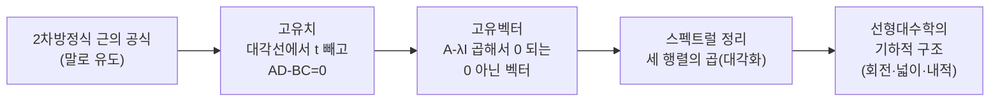

# 직문수 4기 책작업 시작 — 고유치·고유벡터 계산으로 가는 길

이번 시간의 수학 부분은 짧습니다. 군(group) 구조까지 봐 온 우리가 다음으로 다룰 "선형대수학의 기하적 구조"로 넘어가기 위해, 그 준비물로 **$2\times2$ 행렬의 고유치(eigenvalue)·고유벡터(eigenvector)를 손이 아니라 머리로 빠르게 계산하는 법**을 보겠습니다. 왜 2차방정식을 말로 푸는 연습을 시켰는지가 여기서 드러납니다.

---

## [0. 지금까지 쌓은 시야, 그리고 다음 구조 · ▶ 1:09:24](https://www.youtube.com/watch?v=YsEFae3E-NY&t=4164s)

여러분이 직문수를 거치며 갖게 된 시야를 한번 짚어 보겠습니다. 하나는 **공리(axiom)에 대한 시야**이고, 다른 하나는 **군(group)에 대한 시야**입니다. 이 군에 대한 시야 덕분에 지수·로그·행렬식 같은 대상을, 그리고 함수들의 합성을, 모두 같은 군 구조의 눈으로 바라볼 수 있게 되었습니다. 이제 이런 이야기들이 남의 이야기로 들리지 않으시리라 믿습니다.

다음으로 우리가 다룰 것은 **선형대수학의 기하적 구조**입니다. 사실 지금까지 한 이야기들의 이면에 깔려 있던, 또 다른 차원의 이야기입니다 (→ 단원 전사본의 회전행렬·행렬식(넓이)·내적 이야기가 이 "기하적 구조"의 본론에 해당합니다, [전사본](07. Linear Algebra Part 3 - Linear Algebra and Geometry.md) 참조). 그런데 이 본론에 들어가기 전에, 먼저 손에 익혀 둬야 할 계산 도구가 하나 있습니다.

---

## [1. 왜 고유치 계산을 편하게 해야 하는가 · ▶ 1:10:58](https://www.youtube.com/watch?v=YsEFae3E-NY&t=4258s)

지난 기수들의 피드백에서 알게 된 점이 있습니다. **2차방정식을 제대로 푸는 법이 손에 안 익으면, 고유치를 구하는 단계에서 사람들이 당황한다**는 것입니다. 고유치를 구하려면 결국 2차방정식을 풀어야 하는데, 그 계산이 불편하면 생각의 에너지가 엉뚱한 곳에 들어가 버립니다.

그래서 그동안 2차방정식의 근의 공식을 **말로** 유도하게 시킨 데에는 실질적인 목적이 있었습니다. 근의 공식 자체를 아는 것도 중요하지만, 더 직접적으로는 **고유치 계산을 편하게 만들기 위한 준비**였습니다. 군 구조 다음에 다룰 선형대수학의 기하적 구조를 이야기하려면, $2\times2$ 행렬의 고유치·고유벡터를 여러분이 편하게 계산할 줄 알아야 합니다.

> **💭 생각해볼 점** 왜 굳이 2차방정식 근의 공식을 "말로" 시켰을까요? 고유치를 구하는 일이 곧 2차방정식을 푸는 일이기 때문입니다. 근의 공식 유도가 불편하면 정작 고유치라는 본론에서 머리가 거기에 묶여 버립니다. 그래서 근의 공식 → 고유치 → 고유벡터 순으로, 앞 단계가 충분히 편해진 뒤에 다음으로 넘어가는 순서를 잡는 것입니다.

---

## [2. 목표 — 대칭행렬의 고유치·고유벡터를 1분 안에 · ▶ 1:13:44](https://www.youtube.com/watch?v=YsEFae3E-NY&t=4424s)

우리가 다루는 세팅에서 고유치·고유벡터를 실제로 구할 수 있는 행렬은 **대칭행렬(symmetric matrix)**입니다. 그래서 목표를 이렇게 잡습니다.

> 임의의 $2\times2$ 대칭행렬, 예를 들어 $\begin{pmatrix} 2 & 1 \\ 1 & 2 \end{pmatrix}$, $\begin{pmatrix} 1 & 2 \\ 2 & 1 \end{pmatrix}$ 같은 것을 줄 때, 그 **고유치와 고유벡터를 1분 안에 계산할 것.**

이것이 선형대수를 졸업하기 전에 직문수에서 해내야 하는 과제입니다. 접근법은 한 가지를 분명히 해 둡니다. 지금은 **의미를 따지지 말고 계산부터** 익힙니다 — 이 계산들의 의미는 앞으로 기하적 구조를 다루며 충분히 보게 됩니다. 그러니 먼저 계산을 정확히 할 줄 알게 된 다음, "이게 무슨 소리인가"를 묻기로 합니다.

전체 수순은 이렇습니다.

1. 고유치를 먼저 구한다 — 이 단계에서 2차방정식(근의 공식)을 푼다.
2. 구한 고유치를 도로 집어넣어 고유벡터를 구한다.
3. 이렇게 하면 $2\times2$ 행렬을 **세 행렬의 곱**으로 쓸 수 있는데, 이것이 대칭행렬에 대한 **스펙트럴 정리(spectral theorem)**입니다. 그리고 이 분해를 이야기하는 것이 바로 "기하적 구조"에 대한 이야기로 이어집니다.

이 의존 관계를 한 줄기로 보면, 앞 단계가 편해져야 다음 단계로 넘어가는 사슬입니다.

일반인 기준으로 보더라도, 여기까지만 할 줄 알면 어지간한 수학 대중서는 다 읽을 수 있습니다.

> **✏️ 연습문제 (다음 주 숙제)** 노트에 적힌 세 행렬에 대해 고유치와 고유벡터를 직접 계산하시오. (노트의 그 세 예시 중에는 제가 잘못 계산해 둔 것이 있으니, 계산하다 보면 자연스럽게 찾게 될 것입니다.) 핵심 요구치는 **임의의 $2\times2$ 대칭행렬을 줄 때 고유치·고유벡터를 머리로 계산**하는 것입니다. 한 주 만에 되리라 기대하지 않습니다. 틀리지 않는 방식으로 천천히, 반복해서 빨라지면 됩니다.

---

## [3. 고유치 계산 레시피 · ▶ 1:16:00](https://www.youtube.com/watch?v=YsEFae3E-NY&t=4560s)

계산 자체는 아주 단순합니다. 행렬이 주어지면 다음 두 단계로만 합니다.

**① 대각선 성분에서만 $t$를 뺀다.** 비대각선 성분은 그대로 둡니다. (이것은 $A - tI$ 를 만드는 일입니다.)

**② 행렬식 $AD - BC$ 를 적용해서 $=0$ 으로 놓는다.** 이 방정식을 만족하는 $t$ 값들이 고유치이고, $2\times2$에서는 (같을 수 있지만) 언제나 두 개입니다.

세 예시로 보겠습니다.

- $\begin{pmatrix} 1 & 0 \\ 0 & 1 \end{pmatrix}$ — 대각선에서 $t$를 빼면 $(1-t)(1-t)=(1-t)^2$. 이것을 $0$으로 놓으면 $t=1$. 그래서 **고유치는 $1$ (중복, 둘 다 $1$)**.

- $\begin{pmatrix} 2 & 0 \\ 0 & 3 \end{pmatrix}$ — $(2-t)(3-t)=0$ 이므로 **고유치는 $2$ 와 $3$**.

- $\begin{pmatrix} 3 & 1 \\ 1 & 3 \end{pmatrix}$ — 행렬식을 적용하면 $(3-t)^2 - 1 = 0$. 전개하면 $t^2 - 6t + 8 = 0$, 인수분해하면 $(t-2)(t-4)=0$. 그래서 **고유치는 $2$ 와 $4$**.

기대치는, 대칭행렬을 보면 대각선에 $t$를 빼고 $AD-BC$를 적용해 $=0$으로 놓아, 머릿속에서 (필요하면 근의 공식으로) $t$ 값들을 약 $0.1{\sim}1$분 안에 뽑아내는 것입니다. 손이 아니라 머리로 하는 것이 목표입니다.

---

## [4. 고유벡터 계산 레시피 · ▶ 1:18:11](https://www.youtube.com/watch?v=YsEFae3E-NY&t=4691s)

고유치를 구했으면, 각 고유치 $\lambda$ 에 대해 다음을 합니다.

**행렬에서 그 고유치를 (대각선에서) 빼고, 거기에 열벡터(컬럼 벡터)를 곱해서 $0$ 이 되게 하는, 0이 아닌 벡터(non-zero vector) 하나를 찾는다.** 그것이 그 고유치에 대응하는 고유벡터입니다. 앞의 세 예시로 그대로 이어 가겠습니다.

- $\begin{pmatrix} 1 & 0 \\ 0 & 1 \end{pmatrix}$ — 고유치가 둘 다 $1$. $t=1$을 넣어 빼면 $\begin{pmatrix} 0 & 0 \\ 0 & 0 \end{pmatrix}$ 이 되니, 어떤 벡터를 곱해도 $0$ 입니다. 그래서 $\binom{1}{0}$ 과 $\binom{0}{1}$ 을 고유벡터로 잡습니다 (이 선택에도 이유가 있습니다).

- $\begin{pmatrix} 2 & 0 \\ 0 & 3 \end{pmatrix}$ — 고유치 $2,3$. $\lambda=2$ 를 빼면 $\binom{x}{y}$ 를 곱했을 때 둘째 성분이 반드시 $0$ 이어야 하므로 $\binom{1}{0}$. $\lambda=3$ 을 빼면 $-1$ 쪽 성분이 $0$ 이어야 하므로 $\binom{0}{1}$.

- $\begin{pmatrix} 3 & 1 \\ 1 & 3 \end{pmatrix}$ — 고유치 $2,4$. $\lambda=2$ 를 빼면 $\begin{pmatrix} 1 & 1 \\ 1 & 1 \end{pmatrix}$ 이라 $x+y=0$, 그래서 $\binom{1}{-1}$. $\lambda=4$ 를 빼면 $\begin{pmatrix} -1 & 1 \\ 1 & -1 \end{pmatrix}$ 이라 $x=y$, 그래서 $\binom{1}{1}$.

이 마지막 예시를 그림으로 보면, 고유벡터란 행렬이 **방향을 안 바꾸고 크기만 늘리는** 두 축입니다. $\binom{1}{-1}$ 방향은 $2$배, $\binom{1}{1}$ 방향은 $4$배로만 늘어나고, 두 축은 서로 직교합니다(대칭행렬이라 그렇습니다).

이상적으로는 행렬을 슥 보고 고유벡터까지 10초 안에, "아 이건 고유치·고유벡터가 이것" 하고 바로 읽어 내는 수준이 되면 좋습니다. 공대 쪽 프로젝트에서도 자주 쓰이는데, $3\times3$만 돼도 손으로는 골치 아프니, $2\times2$만이라도 보자마자 해석할 수 있으면 든든합니다. 단번에 되는 일은 아니니, 안 틀리는 방식으로 하나씩 쌓아 가며 빨라지면 됩니다.

순서를 다시 정리하면 — (1) 2차방정식 완전제곱(근의 공식)을 말로 하는 게 편해지고, (2) 그 위에서 고유치 구하기가 편해지고, (3) 그 고유치를 도로 넣어 고유벡터 구하기를, 모두 **머리로** 할 줄 알게 되는 것입니다.

> **💭 생각해볼 점** 한 참여자분이 "이 고유치 구하는 것도 손으로 쓰지 않고 말로만 하라는 뜻이냐"고 물으셨는데, 맞습니다. 손으로 적는 계산이 아니라, 대각선에서 $t$를 빼고 $AD-BC=0$을 머릿속에서 푸는 — 입으로 풀어 말할 수 있는 수준을 목표로 합니다.

---

## [5. 이 계산이 향하는 곳 — 선형대수학의 기하적 구조 · ▶ 1:21:32](https://www.youtube.com/watch?v=YsEFae3E-NY&t=4892s)

이 계산이 편해지고 난 다음에야, "그래서 저게 무슨 뜻인가"를 물으며 **선형대수학의 기하적 구조**를 이야기할 수 있습니다. 그리고 그 기하적 구조가 미적분과 어떻게 연결되는지로 이어집니다. 여기까지 오면 직문수의 절반에 도달한 셈입니다.

직문수를 시작하기 전에는 공리 구조도, 군 구조도, 선형대수학의 기하적 구조도, 그리고 이런 계산들을 이렇게 편하게 할 수 있다는 것도 몰랐을 것입니다. 이런 도구들은 이후 수학 공부 전반에서 두고두고 쓰입니다 — 이어서 미분·적분, 그리고 그 응용(예: 19세기 리만 등이 쌓은 업적)을 감상하는 데까지 같은 방식으로 나아갑니다.

---

## [6. 다음 주 진도 예고 · ▶ 1:33:36](https://www.youtube.com/watch?v=YsEFae3E-NY&t=5616s)

다음 주에는 아마 **고유치까지만** 시켜 볼 생각입니다. 고유벡터까지는 아직 부담이 클 듯합니다. 그래서 **$2\times2$ 대칭행렬이 주어질 때 그 고유치를, 역시 손으로 쓰지 않고 말로 풀어내는 것**까지 먼저 훈련하기로 합니다.

진도 순서로 보면, 고유치·고유벡터 계산이 손에 잡히는 시점에서 군 구조·기하적 구조 이야기로 들어갑니다. 기하적 구조 쪽은 다룰 분량이 꽤 두껍습니다. 그래서 고유치·고유벡터 구하기가 부담 없는 상태가 된 뒤에 들어가면 한결 편하게 받아들일 수 있을 것입니다.

---

## 요약

- 군 구조 다음으로 다룰 주제는 **선형대수학의 기하적 구조**이고, 그 본론(회전행렬·행렬식=넓이·내적)으로 들어가기 위한 준비물이 $2\times2$ 행렬의 고유치·고유벡터 계산이다 ([전사본](07. Linear Algebra Part 3 - Linear Algebra and Geometry.md) 참조).
- 2차방정식 근의 공식을 "말로" 유도하게 시킨 실질적 목적은 **고유치 계산을 편하게 만들기 위함**이다. 고유치를 구하는 일이 곧 2차방정식을 푸는 일이기 때문이다.
- 다루는 세팅의 고유치·고유벡터 계산 대상은 **$2\times2$ 대칭행렬**이며, 목표는 **1분 안에 머리로** 계산하기다.
- **고유치**: ① 대각선 성분에서만 $t$를 뺀다($A-tI$). ② $AD-BC=0$ 으로 놓고 $t$를 푼다. $2\times2$에서는 항상 두 개(중복 가능). 예) $\begin{pmatrix}3&1\\1&3\end{pmatrix}\Rightarrow (3-t)^2-1=t^2-6t+8=(t-2)(t-4)=0\Rightarrow \lambda=2,4$.
- **고유벡터**: 각 고유치 $\lambda$ 에 대해 $A-\lambda I$ 를 만들어, 곱해서 $0$ 이 되는 0이 아닌 벡터를 찾는다. 예) 위 행렬에서 $\lambda=2\Rightarrow\binom{1}{-1}$, $\lambda=4\Rightarrow\binom{1}{1}$.
- 이렇게 구한 것으로 $2\times2$ 대칭행렬을 **세 행렬의 곱**으로 쓰는 것이 **스펙트럴 정리**이고, 이 분해가 기하적 구조 이야기의 출발점이다.
- 다음 주에는 **고유치까지만**(대칭행렬, 말로 풀기) 먼저 훈련한다.
