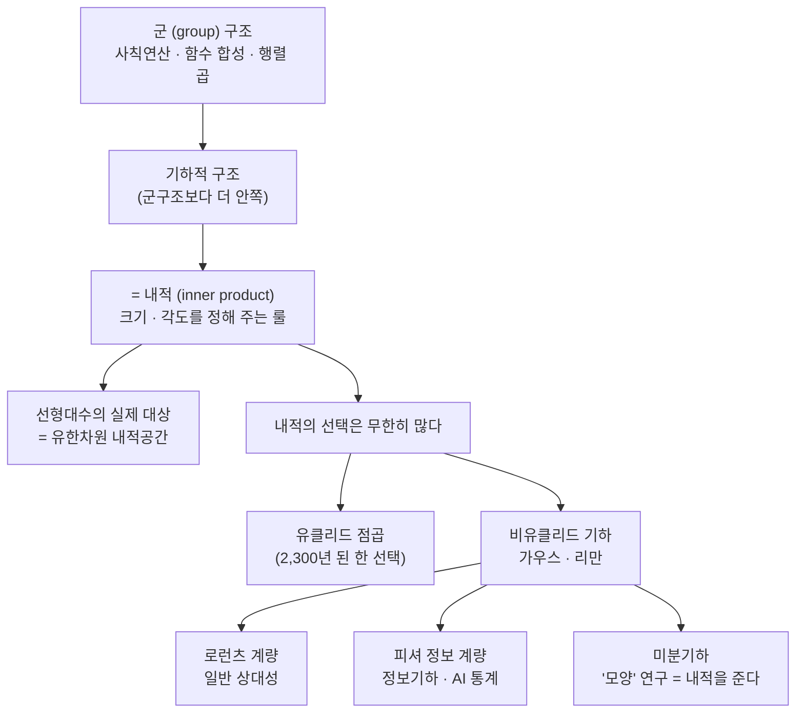

# 기하학적 구조 = 내적

이번 시간에는 먼저 한 사람씩 돌아가며 다항식·행렬·고유치 계산을 손이 아니라 머리로 빠르게 해 보는 훈련을 하고, 그다음 7강(회전행렬에서 $ad-bc$ 가 평행사변형 넓이가 되는 유도)을 최우선 숙제로 드립니다. 이어서 "왜 굳이 군구조 같은 걸 끌어들여야 하는가"를 짚은 뒤, 오늘의 개념적 핵심인 "기하적 구조 = 내적"이라는 관점을 열어 둡니다.

---

## [0. 돌아가며 계산 훈련 — 다항식·행렬·고유치 · ▶ 02:00](https://www.youtube.com/watch?v=r39hRVFjEEA&t=120s)

초반에 시키는 훈련을 다시 한번 떠올려 봅니다. 다음 정도는 손을 안 쓰고도 할 수 있어야 합니다.

- $2^n,\ 3^n,\ 5^n$ 같은 거듭제곱.
- $(x+1)(x-2)$, $(x+1)(x+2)(x+3)$ 같은 다항식 전개.
- 근의 공식 유도, 그리고 지난주에 추가한 **고유치·고유벡터** 구하기.
- 행렬식과 역행렬 구하기.

한 분씩 풀어 본 문제들을 모아 두면 이렇습니다.

- $17^2$: $(20-3)^2 = 400 - 120 + 9 = 289$.
- $(x+1)(x+2)(x+3) = x^3 + 6x^2 + 11x + 6$.
- $2^8 = 256$.
- 행렬 $\begin{pmatrix}1&0\\0&2\end{pmatrix}$ 의 고유치는 $1,\ 2$.
- 같은 행렬의 역행렬: 대각행렬은 각 성분을 역수로 뒤집으면 됩니다. 일반적으로는 $A^{-1}=\dfrac{1}{ad-bc}\begin{pmatrix}d&-b\\-c&a\end{pmatrix}$ 로, 대각선은 자리를 바꾸고 비대각 성분에 마이너스를 붙입니다.
- $\begin{pmatrix}1&0\\0&2\end{pmatrix}^3 = \begin{pmatrix}1&0\\0&8\end{pmatrix}$.
- $2x^2 + 4x + 1$ 의 근: 인수분해가 안 되므로 근의 공식으로 $x = \dfrac{-4 \pm \sqrt{16-8}}{4} = \dfrac{-4 \pm 2\sqrt{2}}{4}$.
- $2x^2 + 3x + 1$ 을 완전제곱으로: $2\left(x+\tfrac{3}{4}\right)^2 + \big(1 - \tfrac{9}{8}\big)$ 꼴로 정리.
- $101 \times 99 = (100+1)(100-1) = 9999$.
- $(x+1)(x-2) = x^2 - x - 2$.
- 행렬 $\begin{pmatrix}1&2\\0&1\end{pmatrix}$ 의 고유치: $(1-t)^2 = 0$ 이므로 $t=1$.
- 행렬 $\begin{pmatrix}2&0\\3&2\end{pmatrix}$ 의 고유치: $2$ (중근).
- $\begin{pmatrix}2&0\\3&2\end{pmatrix}^{10}$ 의 패턴 관찰 (오른쪽 아래로 $2^{10}$ 등이 나오는 패턴).
- $18^2 = (20-2)^2 = 400 - 80 + 4 = 324$.
- $\begin{pmatrix}1&0\\2&1\end{pmatrix}^{2025} = \begin{pmatrix}1&0\\?&1\end{pmatrix}$ 꼴(아래 삼각이 누적되는 패턴).
- $x^2 + 4x + 1 = (x+2)^2 - 3$.
- $\begin{pmatrix}1&0\\2&3\end{pmatrix}$ 의 역행렬: $ad-bc=3$ 이므로 $\dfrac{1}{3}\begin{pmatrix}3&0\\-2&1\end{pmatrix}$.

### 고유벡터를 "구하는 방법"을 말로 설명하기

한 분께는 $\begin{pmatrix}2&0\\3&2\end{pmatrix}$ 의 **고유벡터를 구하는 방법**을 (계산하지 말고) 설명해 달라고 했습니다. 정리하면 이렇습니다. 대각선에서 $t$ 를 뺀 $\begin{pmatrix}2-t&0\\3&2-t\end{pmatrix}$ 를 만들고, 우리가 이미 아는 고유치 $t=2$ 를 도로 넣으면 행렬이 $\begin{pmatrix}0&0\\3&0\end{pmatrix}$ 이 됩니다. 고유벡터는 이 행렬에 곱했을 때 $0$ 이 되는 벡터예요. $(x,y)$ 로 두면 조건은 $x=0$ 이 되므로, 고유벡터를 $\begin{pmatrix}0\\1\end{pmatrix}$ 로 잡으면 됩니다. (행렬을 $\begin{pmatrix}2&3\\0&2\end{pmatrix}$ 로 바꾼 경우에는 조건이 $y=0$ 이 되어 고유벡터가 $\begin{pmatrix}1\\0\end{pmatrix}$ 입니다.)

이런 건 별것 아닌 스킬처럼 보이지만, 조금만 익숙해지셔도 수학적인 걸 볼 때 주변과 차이가 확 납니다. 간단한 케이스를 손으로 안 쓰고 정확하고 빠르게 하는 훈련이 두고두고 유용한 이유는, **여기에 에너지가 안 쓰이면 다른 데에 생각을 쓸 수 있기 때문**입니다.

> **💭 생각해볼 점 — $bc \neq 0$ 인 행렬식은 왜 안 물어봤나요?** 여러분 중 한 분이 "$bc \neq 0$ 인 경우 연습을 많이 했는데, 왜 그건 안 물어보셨냐"고 물었습니다. 제 답은 단순합니다. 지금은 쉬운 것도 대부분 답을 못 하고 있는 상황이라 그렇고, 거의 다 맞을 것 같으면 그냥 난이도를 올리면 됩니다.

> **✏️ 연습문제(이번 시간 훈련)** 위에 나온 종류 — 거듭제곱, 다항식 전개, 근의 공식·완전제곱, $2\times2$ 고유치·고유벡터, 행렬식·역행렬, 행렬 거듭제곱의 패턴 — 을 **손으로 쓰지 않고 머리로** 정확하고 빠르게 할 수 있을 때까지 반복하세요.

---

## [1. 고유치·고유벡터와 대칭행렬 — 무지개(스펙트럴) 정리는 어디서 들어오나 · ▶ 22:29](https://www.youtube.com/watch?v=r39hRVFjEEA&t=1349s)

> **💭 생각해볼 점 — 대칭이 아닌 행렬에도 고유값·고유벡터가 그대로 적용되나요?** 여러분 중 한 분이, **대칭행렬**에 대해서만 고유값·고유벡터를 구한 것 같은데, 예시로 준 행렬은 (비대각 성분이 $0$ 이긴 해도) 대칭이 아니니 그래도 해당되는 거냐고 물었습니다.

좋은 질문입니다. 사실 이건 8강에서 다룰 **무지개 정리(스펙트럴 정리, spectral theorem)** 와 맞닿아 있어요. 포멀하게 말하면, 벡터공간과 그 위의 선형연산자(linear operator)가 주어졌을 때 "**고유벡터이면서 동시에 정규직교(orthonormal)인 기저**를 언제 잡을 수 있느냐"가 스펙트럴 정리이고, 실수 위에서는 그 필요충분조건이 **대칭행렬**이 되는 것입니다.

반면 지금 여러분께 훈련시키는 "고유치·고유벡터를 구하는 것" 자체는 **정방행렬이기만 하면** 어떤 행렬을 주든 상관없어요. 다만 그렇게 얻은 고유벡터로 만든 기저가 **정규직교일 필요는 없습니다**. 정규직교 이야기는 7·8강에서 시작할 텐데, 고유치·고유벡터를 구하는 단계와, 그것이 무지개 정리라는 이름으로 강력한 함의를 가지는 단계(대칭행렬이어야 하는)는 구분해서 보셔야 합니다. 이 미묘한 감각을 짚어 준 좋은 질문이었습니다.

계산 훈련이 안 되면 의미 전달이 너무 안 되더라는 것을 과거 경험에서 배워서, 계산을 먼저 잡고 그다음에 의미를 묻는 순서로 갑니다.

---

## [2. 7강 최우선 숙제 — 회전행렬에서 $ad-bc$ = 평행사변형 넓이까지 유도 따라가기 · ▶ 26:05](https://www.youtube.com/watch?v=r39hRVFjEEA&t=1565s)

머리로 하라고 하니 좀 어렵게 느껴지지, 손으로 쓰면 하나도 어렵지 않은 것들이에요.

**7강 노트**로 가셔서, 삼각함수(사인·코사인) 정의에서 출발해서 **회전행렬이 왜 나오는지의 유도**를 논리적으로 따라가는 것이 첫째입니다. 의미가 아니라 디테일, 즉 "각 $\theta$ 만큼(라디안) 반시계로 돌리는 변환이 왜 정확히 그 행렬이 되는가"를 이해하시라는 뜻이에요.

7강 노트(→ [전사본 참조](07.%20Linear%20Algebra%20Part%203%20-%20Linear%20Algebra%20and%20Geometry.md))에 적어 둔 결과는 이렇습니다. 표준기저가 가는 자리를 보면

$$\begin{pmatrix}1\\0\end{pmatrix}\ \mapsto\ \begin{pmatrix}\cos\theta\\ \sin\theta\end{pmatrix},
\qquad
\begin{pmatrix}0\\1\end{pmatrix}\ \mapsto\ \begin{pmatrix}-\sin\theta\\ \cos\theta\end{pmatrix},$$

이 두 상(像)을 열로 세우면 회전행렬

$$R(\theta)=\begin{pmatrix}\cos\theta & -\sin\theta \\ \sin\theta & \cos\theta\end{pmatrix}$$

가 됩니다.

여기까지 이해한 다음, **평행사변형의 넓이가 $ad-bc$ 라는 것**이 왜 나오는지까지 보시면 좋겠어요. 이걸 사실(팩트)로 외우는 게 아니라, **유도 과정 자체**를 납득하시라는 게 핵심입니다. 옛날 정석에도 이 사실이 있긴 했는데, 거기서는 삼각형·사각형들을 만들어 빼는 풀이를 택해요. 그보다 직문수 노트에 적어 둔 회전행렬을 쓰는 방식이 가장 직관적이고, 두고두고 써먹기 편합니다. 7강 노트의 유도는 한 변 $(a,b)$ 를 $x$축 위로 회전시켜 정렬한 뒤 "밑변 × 높이"를 계산하고, $\cos\theta=\dfrac{a}{\sqrt{a^2+b^2}},\ \sin\theta=\dfrac{b}{\sqrt{a^2+b^2}}$ 를 대입해 정리하면 $\dfrac{1}{a^2+b^2}(a^2+b^2)(ad-bc)=ad-bc$ 가 떨어지는 흐름입니다 (→ 전사본 참조).

지금 우리가 같이 한 계산 정도가 몸에 붙으셨다면, 저 유도를 따라오시는 데 어려움이 없을 거예요.

> **✏️ 연습문제(다음 주까지 최우선 숙제)** 7강 노트에서, ① 사인·코사인의 정의만으로 회전행렬 $R(\theta)$ 가 나오는 유도와, ② 그 회전행렬을 적용해 $ad-bc$ 가 평행사변형 넓이가 되는 유도를, 팩트가 아니라 **논리적으로 직접 검증**해 오세요. (그 뒤 페이지의 '내적'까지가 숙제 범위입니다.)

---

## [3. 왜 굳이 군구조 같은 걸 끌어들여야 할까 · ▶ 29:37](https://www.youtube.com/watch?v=r39hRVFjEEA&t=1777s)

개념적인 것 하나만 짚겠습니다. 그동안 직문수에서 꽤 많은 걸 배우셨어요. 시작할 때 집합론 기초를 다루며, **무한을 수학적으로 다루려 할 때 공리가 필요하다**는 지점을 인식하기 시작했습니다. 중·고등학교 수학에서는 사실상 본 적 없던 지점이죠. 그리고 연산을 **군(group) 구조**로 다룸으로써, 숫자의 사칙연산뿐 아니라 함수의 합성, 선형함수의 합성, 나아가 행렬의 곱셈까지 "군"이라는 하나의 관점으로 통합해 볼 수 있었습니다. 지수·로그 함수나 행렬식도 군구조를 움직이는 방식으로 동작합니다.

> **💭 생각해볼 점 — 왜 이런 군구조를 굳이 도입해야 할까?** 행렬식만 해도 $2\times2$ 에서는 $ad-bc$ 로 끝납니다. 그런데 왜 우리는 굳이 복잡한 군구조 같은 개념을 끌어들여 이런 대상을 설명해야 할까요? 이게 정말 **필요(necessity)** 한 것인지, 아니면 "이렇게 보면 좋을지도 모르는" 선택사항인지 — 여기를 한번 짚고 넘어가면 도움이 됩니다.

CS 하시는 분들 입장에서 답해 보겠습니다. 행렬식을 출력하는 코드를 짠다고 합시다. $2\times2$ 는 그냥 $ad-bc$ 를 넣으면 되고, $3\times3$ 도 공식이 있으니 쓸 수 있어요. $15\times15$ 도 코드가 길어질 뿐 가능합니다. 그런데 파라미터가 수백만 개를 넘나드는 모델에서 행렬식 계산을 한다면? 결국 **공통된 패턴을 구조로 잡아 루프를 돌리는 수밖에** 없습니다.

지금처럼 단순한 케이스에서는 "굳이 이렇게까지?" 싶을 수 있지만, $100\times100$ 행렬의 행렬식을 정말 코딩하는 입장이라면, 구조를 이용하는 것과 그냥 아는 것은 **효율이 전혀 다른 문제**예요. 조금만 복잡해지면 하드코딩은 답이 없고, 구조가 없으면 굉장히 이상한 휴리스틱으로 갈 수밖에 없습니다. 이런 구조들은 탁상공론이나 말장난을 위한 도구가 아니라, **실질적인 계산과, 인류가 과거에 못 했던 것을 해내기 위한 도구**예요.

그래서 제가 특히 **무한을 공리적으로 파고들지 말라**고 하는 것도 같은 맥락입니다. 자연수가 무한히 많다는 건 당연하고, 페아노 공리계로 무한을 지정했다는 것까지는 좋지만, 그걸 파고들어 새로 얻을 정보는 없어요. 수학에서 실질적으로 해야 하는 일은 구조를 가지고 **모르던 미지의 정보를 추출**하는 것이지, "나는 이걸 이렇게 해석한다"는 말장난이 아닙니다. 만약 이런 구조의 필요성이 애매하게 느껴지면, **상황을 조금만 복잡하게 꼬아 보세요.** 이거 없이는 불가능하다는 게 그 관점에서 보일 거예요.

---

## [4. 기하적 구조란 무엇인가 — 사실은 내적 이야기 · ▶ 36:29](https://www.youtube.com/watch?v=r39hRVFjEEA&t=2189s)

이제 기하적 구조에 대한 얘기를 하나 하고 넘어갈게요. 여러분이 그동안 무심코 믿어 온 것을 한번 잘 생각해 봅시다.

$\mathbb{R}^2$ 라는 공간(좌표평면)은 무한집합입니다. 여기에 동의하시죠. 그리고 우리는 벡터를 화살표로 표현하고 싶어 해요. $\mathbb{R}^2$ 좌표 위에 화살표를 깔아 놓고, $(1,1)$ 은 여기, $(0,2)$ 는 저기 하는 식으로요. 그 순간 이미 여러분은 그림을 그리고 계신 겁니다. 예를 들어 $(1,1)$ 은 크기가 $\sqrt{2}$ 라고, 피타고라스 정리로 자연스럽게 생각하시잖아요.

2절에서 $ad-bc$ 를 평행사변형 넓이로 이해하라고 한 것의 핵심도 여기 있어요. 벡터 $(a,b)$ 와 $(c,d)$ 가 만드는 평행사변형의 넓이라는 말은, **여러분이 이미 두 벡터의 크기와 두 벡터 사이의 각도를 안다고 전제**하고 있는 겁니다. 왜냐? $\mathbb{R}^2$ 에 $(a,b),(c,d)$ 를 찍으면 되니까요.

> **💭 생각해볼 점 — 우리는 벡터의 크기와 각도를 정한 적이 있는가?** 그런데 우리가 "벡터의 크기"나 "두 벡터의 각도"라는 개념을 수학적으로 **정한 적이 있습니까?** 집합에서 본 것은 "원소가 무한히 많다", "연산할 때 군구조를 쓸 수 있다" 정도였어요. $\mathbb{R}^2$ 에서 원소를 뽑았을 때 그 원소가 이렇게 생겨야 한다는 룰, $x$축과 $y$축이 직각으로 이렇게 놓여 있다는 룰 — 우리는 그걸 정한 적이 없습니다. 그냥 암묵적으로 받아들여 썼을 뿐이에요. **그것도 수학에서 정해 줘야 하는 룰입니다.**

이 룰은 데카르트와 유클리드까지 거슬러 올라가는 아주 오래된 선입견입니다. 제가 말하고 싶은 요지는, 여러분이 이미 그림을 그리며 두 벡터를 합리적으로 생각하고 계셨다면, **그 룰도 수학적으로 정해야 한다**는 것입니다. 벡터의 크기가 무엇이고 두 벡터의 각도가 무엇인지를, 받아들이긴 했지만 정확히 무엇인지는 정의한 적이 없어요.

그걸 다루는 것이 선형대수의 가장 중요한 목적입니다. 선형대수를 처음 배우면 $\mathbb{R}^2, \mathbb{R}^3$ 같은 것을 보통 **벡터공간**(덧셈과 스칼라배에 대해 닫혀 있는 벡터들의 모임)이라고 배워요. 그런데 이건 조금 오해를 부르는, 사실은 부정확한 설명입니다. 선형대수의 실제 대상은 정확히 말하면 **유한차원 내적공간(finite-dimensional inner product space)** 이에요. '유한차원'도 중요한 가정이고요(무한차원이면 측도론·함수해석 쪽으로 넘어갑니다). 즉 벡터공간에 **내적(inner product)** 이라는 개념을 추가한 것이 선형대수의 대상입니다.

그래서 **"기하적 구조"라는 말을 꺼내는 순간, 이미 내적이라는 대상이 반드시 개입했다**고 생각하셔야 해요. 기하적 구조는 곧 내적에 대한 이야기입니다. 숙제로 드린 부분의 다음 페이지에 나오는 '내적'까지가 이번 숙제 범위이고, 우리는 결국 **각도와 크기를 정해 줘야** 한다는 것입니다.

---

## [5. 내적의 선택은 무한히 많다 — 비유클리드 기하·리만·상대성으로 · ▶ 40:55](https://www.youtube.com/watch?v=r39hRVFjEEA&t=2455s)

이걸 강조하는 이유는, 두 벡터의 각도와 한 벡터의 크기를 정해 주는 룰, 즉 **내적이 무한히 많이 존재**하기 때문입니다. "나는 이 벡터의 크기를 $1$ 이라 할래"라는 말조차, 내적을 통일하지 않으면 서로 합의될 수 없는 말이에요. 그리고 그 내적이 꼭 지금 여러분이 쓰는 방식일 필요도 없습니다.

역사적으로 이렇게 흘러왔어요. 기원전 3세기 유클리드 원론에서 쓰는 것이 여러분이 중·고등학교 때 배운 **유클리드 내적**, 즉 **점곱(dot product)** 입니다. 점곱을 쓰는 순간 사실은 2,300년 전 골동품을 쓰고 있는 셈이에요. 그게 19세기에 가우스·보여이·리만 같은 사람들에 의해 깨집니다. $x$축·$y$축이 꼭 $90^\circ$ 이고 $(1,0),(0,1)$ 의 크기가 꼭 $1$ 이어야 할 이유가 없다는 것 — **비유클리드 기하**가 태동하면서 그럴 필요가 없어진 거예요. 이 선입견이 깨지는 데 한 2,000년이 걸린 셈입니다.

이건 직문수 1강에서 다룬 이야기와 닿아 있어요. 연속체 가설을 생각할 때, 자연수 개수만큼의 무한집합과 실수 개수만큼의 무한집합 사이에 다른 무한집합이 존재하느냐가 **증명도 반증도 불가능**한 데서 집합론·논리학이 태동한 것처럼, 기하에서는 **평행선 공리**가 핵심입니다. 두 평행선이 만나지 않는다는 것은 점곱(유클리드 내적)을 쓰는 경우예요. 점곱을 안 쓰면 평행선은 결국 만나게 되고, 그렇게 "안 만나지 않는" 내적의 선택지는 무한히 많습니다. 그러니 꼭 유클리드 내적을 써야 하는 게 아니죠.

> **📚 참고·응용 — 리만 계량과 일반 상대성** 리만이 발달시킨 리만 계량은 한마디로 "점곱을 없애자"는 발상입니다. 이걸 아인슈타인이 차용해요. 시공간을 다룰 때 공간과 시간이 점곱처럼 움직이는 것이 불가능하다는 것이 **일반 상대성 이론**입니다.

물리적 동기는 이렇습니다. 맥스웰 방정식(헤비사이드 시절엔 십수 개였지만 네 개로 정리된)에서, 전기장의 변화가 자기장을, 자기장의 변화가 전기장을 만든다는 것이 결국 같은 것이고, 전기장·자기장은 사실 **파동함수**입니다. 이 파동의 속도는 유한하고, 그 전자기파의 예가 바로 **빛**이에요.

여기서 유클리드 세계관이 깨집니다. 빛의 속도는 전자기파이기 때문에 유한한 상수여야 하는데, 이게 묘한 문제를 일으켜요. 우리는 서 있는 것과 기차를 탄 것 사이의 **상대속도**를 자연스럽게 받아들이는데, 빛의 속도가 상수라는 것은 기차에 타고 있으나 서 있으나 빛의 속도가 똑같다는 말이 됩니다. 논리적으로 말이 안 되죠. 무엇이 잘못된 거냐 하면, **공간과 시간이 독립적으로 존재한다는 시각**, 더 정확히는 **내적을 잘못 쓰고 있었다**는 것입니다.

2,300년 된 내적(점곱)을 쓰면 공간과 시간을 구분하지 못해요. 공간 3차원 + 시간 1차원을 그냥 $\mathbb{R}^4$ 처럼 봤던 것인데, 실제로는 시간 성분에서 공간과 꼬이고, 이를 미분기하 용어로는 **음의 곡률(negative curvature)** 을 갖는다고 합니다. 그래서 로런츠적 계량(Lorentzian metric)을 써야 해요. 정리하면, 19세기에 가우스·리만이 "내적에서 꼭 점곱을 써야 하는 게 아니다"를 발견했고, 아인슈타인이 이를 차용해 상대성 이론을 만들었으며, 거기서 블랙홀 같은 이야기가 나와 오늘날 우리는 그것을 실험적으로 관측·검출하는 시대에 와 있습니다.

내적을 바꾸는 이 선입견은 깨지는 데 2,000년이 걸렸지만, 그 응용은 현대 물리학(상대성 이론 등)의 태동에 닿아 있습니다. 더 실질적으로는, AI에 쓰는 통계 모델들도 내적을 점곱으로 고르면 안 되는 태생적 이유가 있어요. 이를 **정보기하(information geometry)** 라고 부르며, **피셔 정보 계량(Fisher information metric)** 을 써 줘야 하는 이유가 분명히 있습니다 — 일반적으로 점곱이 아니라는 뜻이에요.

그래서 여러분이 본 구조들의 가장 이면에는 (군구조보다 더 안쪽에는) 기하적 구조가 자리하고, 기하적 구조는 **내적의 선택**에 의존합니다. 내적은 무한히 많으니, 어떤 기하 연구든 "**어떤 내적을 골라야 그 위에서 기하적 구조를 의미 있게 복구할 수 있는가**"가 핵심 문제가 됩니다. 이걸 그대로 연구하는 분야를 수학에서 **미분기하(differential geometry)** 라 부릅니다. '모양(shape)을 연구한다'는 것은 결국 내적을 준다는 것이고요. 이건 지금 팩트로 외울 얘기가 아니라, 앞으로 직문수에서 직관적으로 함께 봐 나갈 이야기의 포문을 연 것입니다.

---

## [6. 보충 질의 — 쌍대공간, 그리고 $\mathbb{R}^2$ 는 이미 내적공간으로 보고 있다 · ▶ 49:49](https://www.youtube.com/watch?v=r39hRVFjEEA&t=2989s)

> **💭 생각해볼 점 — 쌍대공간에서 내적을 선택한다는 말과 닿아 있나요?** 여러분 중 한 분이, 집합 위에 대수적 구조가 있고 거기에 내적으로 "기둥을 세우는" 것이 내적이라 이해했는데, 방금 "내적을 선택할 수 있다"는 말이 쌍대(dual)공간에서 내적을 선택하는 것처럼 들린다며, 쌍대를 공부한다는 것이 그 위에 어떤 구조를 올릴지를 정당화하는 일이냐고 물었습니다.

여러 가지가 섞인 질문이라, 답을 드리면 이렇습니다. 직문수에서는 일부러 $\mathbb{R}^3$ 로도 안 가고 $\mathbb{R}^2$ 안에서 모든 걸 다룹니다. 참석자 입장에서 검증 가능한 방식으로 배우는 것이 너무 중요하기 때문이에요. 다만 설명에는 한 가지 비약이 있습니다. 실수 위의 2차원 벡터공간은 벡터공간으로서는 $\mathbb{R}^2$ 와 같지만, 직문수는 "그냥 $\mathbb{R}^2$ 가 있다고 하자"로 출발합니다. 그런데 우리가 $\mathbb{R}^2, \mathbb{R}^3$ 라는 단어를 쓸 때는 **이미 내적공간으로 보고 있는** 거예요. 즉 표준기저 $(1,0),(0,1)$ 이 서로 크기가 $1$ 이고 직교한다고 보는 순간, 이미 내적을 점곱으로 잡아 둔 것입니다.

추상적인 2차원 벡터공간을 다룰 때는, 기저를 옮겨 줄 때 그 **기저들 사이의 관계(내적)도 같이 옮겨** 주고 있는 셈이에요. 그래서 같은 $\mathbb{R}^2$ 라도 이걸 벡터공간으로 보느냐 내적공간으로 보느냐에 따라 얘기가 달라집니다. 쌍대공간 역시 결국 벡터공간이고 차원을 바꾸지 않으며(리스 표현 정리로 원래 공간과 대응하는 관계가 있지만), 그 전에 $\mathbb{R}^n$ 과 대응시키는 데서 이미 내적이 들어가 있습니다. 그건 쌍대공간에도 그대로 적용되고, 이중쌍대(double dual)는 또 다른 사이드의 얘기예요.

> **💭 생각해볼 점 — 지금 잘 와닿지 않는데 괜찮은가요?** 한 분이 "방금 설명이 완전히 와닿지 않는데 괜찮냐, 이해도 잘 안 된다"고 하셨습니다. 저는 와닿을 거라 전혀 기대하지 않았어요. 설명을 거의 안 하고 **선언만 하고 가는** 것이기 때문입니다. 군구조도 처음 꺼냈을 때 "이게 뭐지" 싶다가 지금쯤은 동의가 되시잖아요. 이 기하적 구조 이야기도 직문수 끝까지 이어질 거고, 군구조와 비교가 안 될 만큼 중요하게 나중에 인식되실 거예요. "아, 내적을 고른다는 게 그런 문제였구나" 하고요. 응용(통계 처리, 결측 데이터 처리 등)을 보고 계신 분이라면 사실 이미 내적을 쓰고 계신 겁니다.

군구조·기하적 구조는 직문수 끝까지 갑니다. 이 구조를 토대로 어떤 응용이 나오는지를 이야기하는 것이 직문수의 목적이기 때문이에요.

---

## 요약

오늘 이야기의 뼈대는 "구조 안의 구조"입니다. 군구조보다 더 안쪽에 기하적 구조가 있고, 기하적 구조는 곧 내적이며, 그 내적의 선택지가 무한히 많다는 흐름입니다.

- 한 사람씩 돌아가며 거듭제곱·다항식 전개·근의 공식·완전제곱·$2\times2$ 고유치·고유벡터·행렬식·역행렬·행렬 거듭제곱을 **손이 아니라 머리로** 빠르게 푸는 훈련을 했다. 핵심은 간단한 계산에 에너지를 안 써야 다른 데에 생각을 쓸 수 있다는 점.
- 고유치·고유벡터 자체는 정방행렬이면 어떤 행렬이든 구할 수 있지만, 그 결과가 **정규직교 기저**가 되려면(무지개=스펙트럴 정리) 실수 위에서는 **대칭행렬**이어야 한다.
- 최우선 숙제: 7강 노트에서 사인·코사인 정의 → 회전행렬 $R(\theta)$ 유도 → $ad-bc$ = 평행사변형 넓이 유도를, 팩트가 아니라 **논리적으로 검증**하기.
- 군구조·내적 같은 구조는 말장난이 아니라, 큰 행렬의 행렬식 계산처럼 **실질적 계산을 알고리즘화**하기 위해 반드시 필요한 도구다. 그래서 무한·공리를 공리적으로 파고드는 것은 권하지 않는다.
- $\mathbb{R}^2$ 에서 벡터의 크기와 두 벡터의 각도는 **우리가 정한 적 없는 룰**이다. 그것을 정해 주는 것이 **내적**이고, 선형대수의 실제 대상은 벡터공간이 아니라 **유한차원 내적공간**이다. "기하적 구조 = 내적".
- 내적은 무한히 많다. 점곱(유클리드 내적)은 2,300년 된 한 선택일 뿐. 19세기 가우스·리만의 비유클리드 기하 → 아인슈타인의 일반 상대성(로런츠 계량) → 정보기하의 피셔 정보 계량까지, "내적을 바꾼다"는 것이 현대 수학·물리·통계의 핵심에 닿아 있다.
