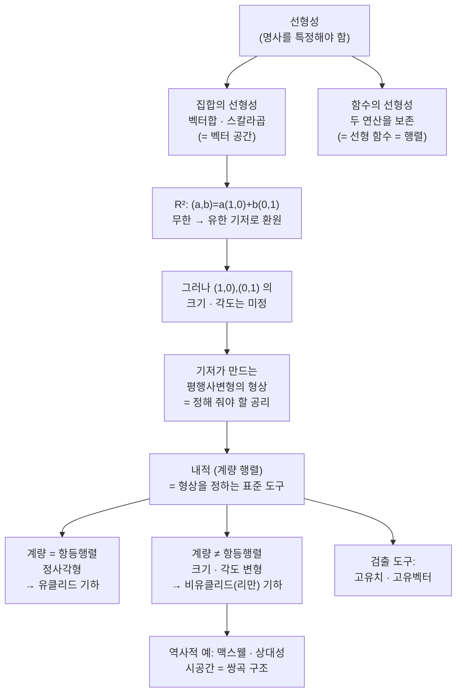

# 평면을 그릴 때 우리가 사실로 받아들였던 기하적 통념에 대하여

오늘은 계산 과제를 바로 드리지 않고, 그 계산을 왜 하는지부터 납득시켜 드리려고 합니다. "선형성이란 무엇인가"를 집합과 함수의 두 층위로 정확히 나눈 다음, $\mathbb{R}^2$ 에서 우리가 아무런 약속도 한 적 없이 슬그머니 받아들여 온 통념 — "단위벡터의 크기가 $1$ 이고 두 축이 직각으로 만난다" — 을 함께 깨 보고, 그 형상을 정하는 도구가 내적임을 보입니다. 마지막에 고유치 계산을 조금 연습하고 마무리합니다.

---

## [0. 들어가며 — 지금까지의 흐름 되짚기 · ▶ 00:00](https://www.youtube.com/watch?v=rB2V5fdEKI0&t=0s)

오늘은 7·8강에 해당하는 이야기를 합니다. 시작 전에 지금까지 우리가 쌓아 온 흐름을 짧게 되짚어 보겠습니다.

- 무한을 다룰 때는 주의해야 한다는 점을 인지하기 시작했습니다.
- 연산을 "군(group)"이라는 기준으로 보니, 함수의 합성 같은 것도 그 관점에서 다르게 보였습니다.
- 함수들 중에서도 선형 함수만 보면, 선형 함수의 합성이 행렬의 곱셈으로 뜬다는 것을 알게 됐습니다. 직문수 이전에는 "함수의 합성은 합성이고, 행렬 곱은 행렬 곱인데 그건 왜 그렇게 정의했지?" 하던 분이 많았을 텐데, 둘이 호환된다는 것을 보기 시작한 거죠.
- 지난주부터는 결국 행렬을 정보량을 유지하는 방식으로 대각 행렬로 바꾸고 싶다는, 다소 이상하게 들리는 이야기를 나누기 시작했습니다. (자막에 "무지계 정리"로 들리는 부분이 있는데, "행렬을 대각 행렬로 바꾼다"는 맥락상 스펙트럼 정리[?]를 가리키는 것으로 보입니다.) 그리고 그 이야기들의 가장 핵심에 있는 대상이 내적, 혹은 내적 구조라는 단어였습니다.

그래서 오늘의 목적은, 여러분이 스스로 어디를 명확하게 해 두어야 하는지 그 지점들을 같이 짚어 보는 것입니다. 오늘 가장 중요한 질문은 아마 이것일 겁니다 — **정의가 뭐냐?**

---

## [1. "선형성이란 무엇입니까?" — 첫 번째 라운드 · ▶ 01:54](https://www.youtube.com/watch?v=rB2V5fdEKI0&t=114s)

먼저 여러분께 묻겠습니다. **선형성이란 무엇입니까?** 피상적이거나 철학적인 층위에서 묻는 게 아닙니다. 여러분이 실제로 계산할 때 쓰고 계시잖아요. 그 익숙한 단어가 무엇인지, 설명할 수 있는 분들의 답을 가능하면 다 들어보고 싶습니다.

여러분이 내주신 답들을 모아 보면 이렇습니다.

- 선으로 표현될 수 있는 함수 (직선이든 곡선이든)
- 리니어 콤비네이션(linear combination)으로 나타낼 수 있는 함수 — $f(x+y)=f(x)+f(y)$ 이고 스칼라곱으로도 나타낼 수 있는 함수
- 입력의 변화에 따른 출력의 결과가 일정하다
- $f(x+y)=f(x)+f(y)$, $f(ax)=a\,f(x)$ 가 성립하는 함수
- 정비례(비례) 관계
- 덧셈과 곱셈으로만 연산되는, 입력 대비 결과 — (여기서 한 가지 보정합니다. **"곱셈"이 아니라 반드시 "스칼라곱"이라고 써야 합니다.** 형용사가 중요합니다.)
- 기울기가 일정한 그래프로 표현되는 성질
- $a$ 와 $b$ 에 연산을 먼저 하고 $f$ 를 씌우든($f(a+b)$), $f$ 를 씌우고 연산하든($f(a)+f(b)$) 둘이 같은 것
- 방정식으로 표현될 수 있는 함수 — (이것도 매우 중요한 관점인데, 단어는 정확히 "1차"라고 써야 합니다. **1차 방정식**이라고 하면 $100\%$ 입니다.)
- 1차 함수인데 원점을 지나야 한다
- 벡터 공간(집합 전체)을 표현 가능한 것, 함수에 의해 치역도 똑같이 벡터 공간이 되는 것

지금 나온 답들은 결과적으로 다 맞습니다. 다만 그 안에 숨어 있는 미묘한 간극을 함께 인지하는 게 오늘의 목적입니다.

> **💭 생각해볼 점** 사실은 제가 질문부터 틀리게 했습니다. "선형성"이라는 단어 뒤에 붙여야 할 명사를 제가 특정하지 않았기 때문이에요. 선형성은 **집합에 붙일 때**와 **함수에 붙일 때**, 이 둘을 구분해야 합니다. 여러분의 답에도 이 두 가지가 섞여 있었습니다 — 어떤 분은 집합 레벨에서, 어떤 분은 함수 레벨에서 답하셨죠. 그래서 다시 묻겠습니다. 답하실 때 그 명사를 정확히 하시거나, 두 명사 모두에 대해 말씀하시거나, 둘 중 하나여야 합니다.

---

## [2. 심상 하나 깔고 가기 — 연산을 보존하는 함수(지수함수·행렬식) · ▶ 09:00](https://www.youtube.com/watch?v=rB2V5fdEKI0&t=540s)

선형성을 다시 생각하기 전에, 마음속에 심상 하나를 깔고 갑시다. 함수와 군 구조를 함께 떠올릴 때 **지수함수**를 염두에 두시면 좋겠습니다.

지수법칙이란 $a^{x+y}=a^x\cdot a^y$ 였죠. 이게 "연산을 보존하는 행위"라는 의미가 와닿으시나요? 정의역 쪽에서 덧셈으로 하던 일을, 공역 쪽에서 곱셈으로 하는 일로 대응해 바꿀 수 있다는 뜻입니다.

- $a^0=1$ : 덧셈의 항등원($0$)이 곱셈의 항등원($1$)으로 바뀝니다.
- $a^{-x}=\dfrac{1}{a^x}$ : 덧셈의 역원($-x$)이 곱셈의 역원으로 바뀝니다.

그래서 여러분은 이미, 친숙한 지수함수를 토대로 "연산을 보존하는 함수"라는 관점을 적어도 하나 가지고 계신 셈입니다.

예시를 하나 더 추가합니다. 또 다른 중요한 예시가 **디터미넌트(행렬식)**입니다. $2\times2$ 행렬 두 개 $A,B$ 를 줬을 때,

$$\det(AB)=\det(A)\,\det(B)$$

먼저 곱하고 행렬식을 취하든, 각각 행렬식을 취해서 곱하든 같습니다. 순서가 다른데도 결과가 같죠. 재미 삼아 직접 확인해 보시길 권합니다. 또

- 항등행렬을 행렬식에 넣으면 $\det(I)=1$,
- 역원의 행렬식은 행렬식의 역수, 즉 $\det(A^{-1})=\dfrac{1}{\det(A)}$.

이런 것들이 "연산이 보존되고 있다"는 느낌을 줍니다.

> **✏️ 연습문제** $2\times2$ 행렬 두 개에 대해 $\det(AB)=\det(A)\det(B)$ 를 직접 계산해 확인해 보세요. 항등행렬의 행렬식이 $1$ 이고, 역행렬의 행렬식이 원래 행렬식의 역수로 뜬다는 것도 확인해 보시길 바랍니다.

---

## [3. 함수의 정의에서 다시 출발 — 집합에 군 구조를 주기 · ▶ 15:50](https://www.youtube.com/watch?v=rB2V5fdEKI0&t=950s)

만약 답하기가 오히려 막막해진 분이 있다면, 그게 더 좋은 신호입니다. 지수함수의 셋업을 한 번 더 정확히 해 봅시다.

함수니까 함수의 정의부터 짚고 갑니다. 두 분께 정의를 여쭤 본 답을 정리하면 이렇습니다. 집합 $A$, $B$ 가 있을 때, 곱집합 $A\times B$ 의 특정한 부분집합 가운데 두 조건 — **존재성**(각 $a\in A$ 가 어떤 $b\in B$ 와 순서쌍을 이룸)과 **유일성**($(a,b_0),(a,b_1)$ 이 둘 다 들어 있으면 $b_0=b_1$) — 을 만족하는 것을 함수라고 합니다. 즉 $a$ 의 값마다 $b$ 값이 하나만 대응합니다.

함수에는 정의역과 공역이 필요합니다. 그런데 "연산을 보존한다"는 말을 하려면, 정의역과 공역에 집합만으로는 부족하고 무언가를 더 줘야 합니다. 무엇이냐 하면 — **군(group)으로 봐야 합니다.** 연산을 줬다는 것은 곧 집합에 군 구조를 이미 줬다는 뜻입니다.

지수함수를 이 틀에 얹어 보겠습니다.

- 정의역: 실수 전체 $\mathbb{R}$ 에 **덧셈**.
- 공역: 양의 실수 전체 $\mathbb{R}^{+}$ 에 **곱셈**.
- 함수: $x\mapsto a^x$ ($a$ 는 $0$ 이 아닌 양수).

이렇게 두 집합에 각각 연산이 선언되어 있어야, 비로소 "연산을 보존한다"는 말을 할 수 있습니다. 그 보존이 이런 모습입니다.

- $a^{x+y}$ : 정의역에서 **먼저 군연산(덧셈)** 을 한 뒤 함수에 태워 보낸 것.
- $a^x\cdot a^y$ : 원소들을 **먼저 함수에 태워** 보낸 뒤 공역에서 군연산(곱셈)을 한 것.

이 둘이 같다는 게 지수법칙이고, 이것이 바로 **군 구조를 보존하는 함수**라는 뜻입니다. 정리하면, 정의역과 공역에 군 구조가 있을 때 정의역의 군 구조를 공역의 군 구조로 옮겨 주는 함수가 군 구조를 보존하는 함수이고, 그 예시가 지수함수와 행렬식입니다.

---

## [4. 선형성 = 연산이 두 개 — 집합의 선형성과 함수의 선형성 · ▶ 22:00](https://www.youtube.com/watch?v=rB2V5fdEKI0&t=1320s)

이제 "군 구조" 대신 "선형성"이라는 단어로 바꿔 같은 작업을 합니다. 다만 한 가지가 결정적으로 다릅니다.

> **💭 생각해볼 점** "군 구조를 보존해서 등식으로 만드는 것"이라고 말하고 싶을 수 있는데, 그렇게 말하면 안 됩니다. 이제 더 이상 군 이야기가 아니거든요. **군 구조는 연산이 한 개**(덧셈 하나)이고, **선형성은 연산이 두 개**입니다. 유사하지만 다릅니다. 집합에 연산을 두 개 줘야 합니다.

집합의 선형성부터 정리합니다. 함수가 정의되려면 정의역과 공역이 선언돼야 하고, 두 집합에 각각 **선형 연산**, 즉 **벡터합과 스칼라곱**이 있어야 합니다. 이 형용사가 중요합니다. 벡터합과 스칼라곱이 정의된 집합 — 이것이 곧 **집합의 선형성**입니다(다른 게 나올 수가 없습니다). 두 집합이 같다는 말이 아니라, 각각이 이 두 연산을 갖고 있다는 것만 보장하는 단계입니다. 지수함수 때도 그랬듯, 출발은 항상 집합 레벨에서 연산이 있는 데서 시작할 수밖에 없습니다.

그다음 함수의 선형성입니다. 정의역과 공역에 벡터합과 스칼라곱이 주어졌을 때,

- 정의역의 **벡터합**을 공역의 **벡터합**으로 그대로 옮기고,
- 정의역의 **스칼라곱**을 공역의 **스칼라곱**으로 그대로 옮기는

함수가 선형 함수입니다. 같은 말로 "선형성을 보존하는 함수"이고, 또 같은 말로 **행렬**입니다. 이것이 사실 행렬의 정의입니다.

> **💭 생각해볼 점 (한 참여자의 질문)** "집합에 벡터합이 주어졌다는 건, 그 집합의 원소들이 결국 벡터라는 건가요?" — 벡터란 벡터 공간의 원소를 가리키는 고유명사일 뿐입니다. 집합에 덧셈 연산이 존재해 (아벨)군 구조를 이루는 것을 두고 벡터합이 있다고 합니다. 다만 여기서 "왜 그래도 되나"를 1+1이 왜 2냐는 식으로 파고드는 태도는 권하지 않습니다. 수학은 말장난이 아니라, 구체적인 예시(예: $\mathbb{R}^2$)를 토대로 생각하고 그 예시가 만족하는 룰로 정의가 된다는 걸로 받아들이는 것입니다.

> **💭 생각해볼 점 (한 참여자의 질문)** "집합의 선형성과 함수의 선형성이 정말 다르다면, 둘 사이에 공통 분모가 전혀 없는 건가요?" — 정의 레벨에서 둘은 완전히 다른 대상입니다. 집합의 선형성은 집합 자체가 벡터합·스칼라곱을 갖고 있다는 것이고, 함수는 곱집합의 부분집합 중 선형성을 보존하도록 전개된 또 다른 이상한 집합입니다. 다만 "벡터합과 스칼라곱을 다룬다"는 점에서 단어를 공유하는 것이고, 그래서 단어를 쓸 때 집합 층위인지 함수 층위인지를 구분하자는 게 제가 클래리피케이션하는 이유입니다.

> **📚 참고·응용** 한 참여자분이 "선형 집합 $A$ 의 임의의 벡터를 잡아 벡터합·스칼라곱으로 연산했을 때 선형성을 갖는 게 집합의 선형성이고, $f(x),f(y)$ 가 공역에서도 벡터합·스칼라곱 연산을 만족하는 선형 집합으로 나오게 하는 것이 선형 함수다"라고 정리하셨는데, $100\%$ 맞습니다. 다만 생각의 층위를 맞출 때는 마음속에 $\mathbb{R}^2$ 같은 구체적인 예시를 적어도 하나 두고, 이것들이 무엇을 움직이는지 떠올리며 생각하시는 게 타당합니다.

---

## [5. 군 구조 보존 vs 선형성 보존 — 지수함수는 선형 함수가 아니다 · ▶ 33:00](https://www.youtube.com/watch?v=rB2V5fdEKI0&t=1980s)

여기서 좋은 질문이 나왔습니다.

> **💭 생각해볼 점 (한 참여자의 질문)** "지수함수에서 공역인 양의 실수 집합은 벡터합이 곱셈으로 정의된 건가요? 그럼 덧셈을 곱셈으로 보내는 선형 함수인 셈인가요?" — 아닙니다. **군 구조를 보존하는 함수와 선형 함수는 다른 대상**입니다. 군 구조는 연산 한 개(덧셈 하나, 결합법칙·항등원·역원)에 대한 이야기이고, 선형성은 집합 레벨에서 연산이 두 개(교환되는 덧셈군 연산 + 스칼라곱)인 벡터 공간에 대한 이야기입니다. 우리는 군 구조 보존 함수의 특징을 그대로 본떠 "선형성을 보존하는 함수"를 새로 정의한 것일 뿐입니다. 그래서 **지수함수가 선형 함수라는 말은 전혀 아닙니다.** 군 구조 보존의 예시가 지수함수이고, 선형 함수는 군 구조 대신 선형 구조를 보존하는 센스에서 정의한 다른 개념입니다.

이렇게 예시를 가지고 만든 논리를 세워 놓은 뒤 "이게 말이 되나?"를 스스로 점검하는 태도 — 지수함수가 선형적이라고 하면 어딘가 이상하다는 감각으로 맞춰 가는 것 — 이 수학에서 배워야 할 중요한 점입니다.

---

## [6. 직문수 1강으로 되감기 — 무한을 유한으로 돌리는 선형결합 · ▶ 40:40](https://www.youtube.com/watch?v=rB2V5fdEKI0&t=2440s)

이제 이 관점을 가지고 직문수 1강 이야기를 거꾸로 해 보겠습니다. 1강에서 우리가 초점을 맞춘 포인트는 **유한과 무한이 다른 애**라는 것이었습니다.

$\mathbb{R}^2$ 를 들여다봅시다. $\mathbb{R}^2$ 의 임의의 원소는 $(a,b)$ 이고, $a,b$ 의 선택지가 무한하니 원소는 **무한개**입니다. 그런데 선형 연산(벡터합·스칼라곱)이 존재하면, 우리는 실제로 $(1,0)$ 과 $(0,1)$ 단 **두 개**만 있으면 다 만들 수 있습니다.

$$(a,b)=a\,(1,0)+b\,(0,1)$$

즉 $\mathbb{R}^2$ 를 안다는 것은, 무한개의 원소를 일일이 조사하지 않고도 **유한개의 벡터만 아는 것으로 환원하는 법**을 안다는 뜻입니다. 성분이 두 개(일반적으로 $n$ 개)라는 것만 정해지면, $(1,0),(0,1)$ 을 어떻게 바꾸는지만 연산 두 개로 얘기하면 끝나는 거죠.

> **💭 생각해볼 점** 이것이 아까 누군가 말씀하신 "리니어 콤비네이션"이라는 단어의 묘미입니다. 그 단어 안에는 이미 **무한의 대상을 유한으로 다루는 것으로 바꿔 버리는** 작업이 들어가 있습니다.

---

## [7. 오늘의 핵심 — 우리는 $(1,0),(0,1)$ 의 크기와 각도를 정한 적이 없다 · ▶ 43:40](https://www.youtube.com/watch?v=rB2V5fdEKI0&t=2620s)

여기서 묘한 포인트가 있습니다. 무한개의 원소를 딱 두 개($(1,0),(0,1)$)만 잡으면 끝나는 걸로 논증을 만들어 놨는데 — 정말 끝난 걸까요? **$(1,0)$ 과 $(0,1)$ 은 아세요?** 이게 문제입니다.

여러분이 $(1,0),(0,1)$ 을 이미 안다고 깔아 둔 전제가 있는지 점검해 봅시다. 스칼라배를 해 보죠.

- $2\cdot(1,0)=(2,0)$, $\ 3\cdot(0,1)=(0,3)$, $\ 4\cdot(1,0)=(4,0)$.

여기까진 아무 문제 없습니다. 그런데 "그럼 $(4,0)$ 의 크기가 $(1,0)$ 의 네 배"라고 자연스럽게 생각하시지 않나요?

> **💭 생각해볼 점** 저는 아직 거짓말을 한 적이 없습니다. 우리가 **$(1,0)$ 의 크기를 정한 적이 있나요?** 만약 $(1,0)$ 의 크기가 $2$ 라면 $(4,0)$ 의 크기를 $8$ 이라 해도 논리에 아무 문제가 없습니다. $(0,1)$ 의 크기를 $3$ 이라 두고, 그걸 스칼라배 두 배 한 것의 크기를 $6$ 이라 해도 문제가 없습니다. 우리가 허용한 것은 연산 두 개(벡터합·스칼라곱)가 있다는 것까지뿐, **크기를 정한 적은 없습니다.** (단, 양수이긴 해야 선형결합 표현이 문제없이 됩니다.)

여기서 한 가지 딴지를 더 겁니다. **두 축이 직각으로 만난다고 우리가 언제 정했나요?** $45^\circ$ 든 $135^\circ$ 든 아무 상관 없습니다. 선형성만으로는 그것을 강제할 수 없습니다.

그래서 무한이 어디에 숨어 있느냐 하면 — $(a,b)$ 의 무한한 선택지를 $(1,0),(0,1)$ 로 돌려놓았으니 끝난 것 같지만, **$(1,0),(0,1)$ 을 "보는 방법"에 다시 무한 가지가 있습니다.** 무엇을 정해야 하느냐 하면, $(1,0)$ 과 $(0,1)$ 이 만드는 **평행사변형**을 정해야 합니다. 여러분은 지금 그 평행사변형을 무심코 **정사각형**으로 생각하고 계신 거예요. 그게 여러분이 배운 컨벤션, 곧 평행선이 만나지 않는 유클리드 원론의 사고방식입니다.

같은 기저 $(1,0),(0,1)$ 이라도, 두 벡터의 크기와 사잇각을 어떻게 보느냐에 따라 정사각형(유클리드 컨벤션)일 수도, 크기를 다르게 준 직사각형일 수도, 각도가 $90^\circ$ 가 아닌 평행사변형일 수도 있습니다 — 선형성만으로는 이 셋 중 무엇도 강제하지 못합니다.

> **💭 생각해볼 점 (한 참여자의 질문)** "두 벡터가 같은 방향을 가리키도록 설정해도 문제가 없다면, 공간상 같은 지점을 가리키는 두 원소를 같다고 보는 건가요?" — 그건 조금 섞인 이야기입니다. 수학적으로는, **기저(basis)가 정해지면 그 기저의 선형결합으로 표현되는 원소는 유일하게 존재**하도록 구조를 만듭니다. 그래서 말씀하신 중복 상황은 (구조를 제대로 만들면) 생기지 않습니다.

> **💭 생각해볼 점 (한 참여자의 질문, 내적과 선형성)** "내적 함수를 정의했을 때 선형성을 두 개 들고 있다고 말할 수 있나요? 내적은 선형 함수인가요?" — 세팅을 오해하면 안 됩니다. 내적이 정의되는 대상은 그냥 집합이 아니라 **벡터 공간**입니다. 벡터 공간이라고 한 시점에서 선형성은 이미 정해져 있어야 하고, 내적은 그 선형성에 호환되도록 정의된 것일 뿐입니다. 그리고 **내적은 선형 함수가 아닙니다.** 이건 정의를 확인하면 되는 문제입니다.

정리하면 핵심은 이것입니다 — "단위벡터의 크기가 $1$ 이고 두 축이 $90^\circ$ 로 만난다"는 통념은, 우리가 어떤 공리·논리를 끌어와도 선형성만으로는 규정할 수 없습니다. 그것은 **임의적인 약속**입니다.

---

## [8. 평행사변형의 형상을 정하는 공리 = 내적, 그리고 비유클리드 기하 · ▶ 54:00](https://www.youtube.com/watch?v=rB2V5fdEKI0&t=3240s)

여기서 "평면" 이야기를 정확히 합시다. 평면이라는 것의 수학적 구조는 **벡터 공간 구조**입니다. 집합에 벡터합과 스칼라곱이 정의된 것을 평면이라 부르고, 이것이 벡터 공간의 정의입니다. "평평하다"는 의미는 이미 그 안에 녹아 있습니다.

그런데 그 평평한 공간 안에서, $(1,0),(0,1)$ 이 만드는 평행사변형을 **정사각형**이라고 못 박는 것 — 이것을 정식으로 **유클리드 기하학**이라 부르고, 그것이 아닌 모든 것을 **비유클리드 기하학**이라 부릅니다.

> 그래서 비유클리드 기하는 곡면(공면) 이야기가 나오기 전, **벡터 공간 레벨에서부터 이미 있습니다.** 애초에 "$(1,0),(0,1)$ 의 크기가 왜 $1$ 이고 왜 $90^\circ$ 로 만나야 하는가" 자체를 우리가 규정해 줘야 한다는 것이 오늘의 요지입니다.

그 규정을 하는 한 가지 수단이 **내적(inner product)**입니다. 필요조건은 "$(1,0),(0,1)$ 이 만드는 평행사변형의 형상을 규정해야 한다"는 것이고, 형상을 규정하는 방법이 꼭 내적일 필요는 없지만, 내적이 규정되면 나머지(크기·각도)는 다 정해집니다. 곧, 여러분이 내적을 받아들이고 있어야 비로소 형상을 부여할 수 있고, 그 형상의 선택지는 무한 가지입니다. (→ 단원 전사본 §6~7 [전사본](07.%20Linear%20Algebra%20Part%203%20-%20Linear%20Algebra%20and%20Geometry.md): 내적의 공리(선형성·대칭성·양의 정부호성)와 계량 행렬 $M$ 으로의 표현)

> **💭 생각해볼 점** "정답이 뭡니까?" — 모릅니다. 선택지는 무한하니까요. 그래서 그중 **어떤 구조를 골라야 하는지**가 중요한 문제가 됩니다. "무한히 많으니 아무거나 써도 된다"는 말이 아니라, "그중에서 무엇을 쓰는 게 타당한지를 알고 싶다"는 것입니다. 답이 무한히 있기 때문에, 무엇이 답인지 알아가는 일이 중요한 거죠. 누군가 $(1,0),(0,1)$ 의 형상을 임의로 바꾸자고 하면 여러분은 동의하지 않으실 텐데, 그 직관이야말로 "더 강한 설득력을 갖는 형상이 있다"는 이야기입니다.

> **💭 생각해볼 점 (한 참여자의 질문)** "그럼 내적에 해당하는 행렬이 공리라는 거군요?" — 정확히 맞습니다. 7·8강에서 음미하셔야 할 것은, 내적 파트를 쭉 풀면 $(1,0)$ 의 크기 제곱, $(0,1)$ 의 크기 제곱, 그리고 둘 사이 각도를 정하는 부분이 나오고, 이를 결정하는 **행렬(계량 행렬)**이 곧 공리라는 점입니다. 이 행렬을 항등행렬로 두는 경우가 흔히 배운 디폴트(유클리드 기하)이지만, 그럴 필요가 없다는 게 8강의 핵심입니다 — 예시 1은 그 룰을 바꿔 $(1,0)$ 의 크기를 $\sqrt{2}$, $(0,1)$ 의 크기를 $\sqrt{3}$ 으로 둔 것이고, 또 다른 예시는 각도조차 $90^\circ$ 가 아니게 바꾼 것입니다.

> **📚 참고·응용 (행렬식·평행사변형과의 관계, 한 참여자의 질문)** "직문수 9강에서 $2\times2$ 행렬식이 $0$ 이면 평행한 벡터가 되어 평행사변형을 못 만든다고 했는데, 이게 각도·크기 이야기와 관계가 있나요?" — 조금 섞인 이야기입니다. "평행사변형/평행"이라는 단어를 쓰는 순간 이미 형상(쉐입)을 정해 둔 것이 전제됩니다. 그때는 $(1,0),(0,1)$ 이 정사각형 평행사변형을 만든다고 전제하고 해석하는 것이고, 오늘은 그보다 더 밑단계 — 그 형상 자체가 공리라는 이야기 — 를 꺼낸 것입니다.

> **📚 참고·응용 (미분기하와의 연결, 한 참여자의 질문)** "항등행렬 말고 다른 행렬을 넣으면 평행사변형이 달라지는데, 그 상황에서 미적분하는 방법도 싹 다 달라지나요?" — 딱 달라집니다. 미분기하의 제1기본형식(예: $E,F,G$)을 구하는 과정이 바로 그 **생김새(형상)를 결정하는** 작업입니다. 미분기하의 목적이 곧 이 평행사변형의 형상을 어떻게 정하느냐, 즉 기하 구조를 어떻게 결정하느냐입니다.

---

## [9. 역사적 배경 — 맥스웰 방정식, 상대성 이론, 쌍곡기하 · ▶ 58:00](https://www.youtube.com/watch?v=rB2V5fdEKI0&t=3480s)

크기와 각도를 잘못 정해 둔 통념이 공리화되어 무너진 가장 대표적인 예가 19세기에 들어옵니다.

- **맥스웰 방정식**: 전기장과 자기장의 관계식으로, 헤비사이드가 정리한 형태에서 오늘날 현대 수학에서는 네 개의 식으로 줄여 씁니다. 이 방정식은 **파동 방정식**이고, 파동은 **속도가 유한**합니다(반면 열 방정식의 열 전파 속도는 수학적으로 무한대).
- 그 파동의 예시가 **빛**입니다. 그런데 빛의 속도가 상수라는 것은, 여러분이 어떤 프레임에 있든 상관없다는 뜻입니다 — 서서 관측하든, 빛의 속도로 움직이며 관측하든 같아야 한다는 거죠. 상대 속도 직관(기차 안에서 느끼는 속도와 앉아서 느끼는 속도가 다름)과 정면으로 충돌합니다.
- 문제의 뿌리는 **시간과 공간이 유클리드 기하를 따른다는 가정**이 틀렸다는 데 있었습니다. 그렇게 따르지 않는다는 것이 상대성 이론이고, 시간과 공간의 관계가 **쌍곡기하 구조**를 갖는다는 것이 그 내용입니다. 즉 이 평행사변형의 결정이 정사각형이 아니라는 것 — **내적을 바꿔야 했던** 역사적으로 중요한 한 예입니다.

> **📚 참고·응용** 오늘날의 예시로는 통계 모델의 구조, 로보틱스의 구조, AI에 쓰이는 구조, 양자역학 등 거의 모든 곳에서 유클리드 기하는 오히려 찾아보기 힘듭니다. 정답이 아니라, 그저 "그랬으면 좋겠다"는 인간의 희망사항에 가까운 셈입니다. 자연계(물리·통계·AI)는 그 통념을 지지하지 않습니다.

> **💭 생각해볼 점** 가우스조차 이 관찰("평행사변형이 꼭 정사각형일 필요가 없다")을 알고 있었지만 당시 메인스트림이 아니라 말하고 싶어 하지 않았습니다. 평행사변형이 정사각형이 아니라는 것을 발견하기까지가 인류에게 그만큼 어려운 관찰이었고, 한번 깨지고 나서는 상대성·양자역학을 만들어 내는 너무나 중요한 수학이 되었습니다. 아인슈타인도 정확히는 리만과 그라스만의 수학을 가져다 쓴 것이라고 보는 게 더 정확합니다.

요약하면, 직문수 후반부에서 우리가 하려는 일은 이 평행사변형을 무엇으로 정할 것인가입니다. 선형성을 보존하는 방식으로, 즉 **내적**으로 정하면 크기와 각도를 논하기가 편합니다. 꼭 내적이어야 하는 것도, 꼭 그래야 하는 것도 아니지만 내적으로 정하는 것이 스탠더드입니다. 그 내적으로부터 기하 구조를 어떻게 결정하느냐가 직문수에서 끝까지 다룰 이야기이고, 이를 검출하는 도구가 **고유치와 고유벡터**입니다.

---

## [10. 계산 연습 — 고유치, 그리고 회전행렬 과제 · ▶ 1:11:00](https://www.youtube.com/watch?v=rB2V5fdEKI0&t=4260s)

오늘은 여기서 고유치·고유벡터 계산 연습으로 수준을 조금 높입니다. 돌아가며 한 분씩 풀어 봤습니다.

- $\begin{pmatrix} 2 & 1 \\ 0 & 3 \end{pmatrix}$ 의 고유치: $(2-t)(3-t)=0$ 이므로 $t=2,\ 3$.
- $\begin{pmatrix} 1 & 1 \\ 0 & 2 \end{pmatrix}$ 의 고유치: $t=1,\ 2$.
- 회전행렬 $R(\theta)=\begin{pmatrix} \cos\theta & -\sin\theta \\ \sin\theta & \cos\theta \end{pmatrix}$ 의 고유치: **실수에서는 존재하지 않습니다.** (의도한 결과였습니다.) 같은 회전행렬의 고유치는 **복소수에서는 존재**합니다 — 이것이 로보틱스에서 매우 중요합니다.

> **✏️ 연습문제 (다음 주까지)** 두 스텝입니다. ① 회전행렬 $R(\theta)=\begin{pmatrix} \cos\theta & -\sin\theta \\ \sin\theta & \cos\theta \end{pmatrix}$ 이 **왜 이렇게 생겼는지**, 노트에 있는 유도(삼각형을 붙여 빼는 직관적 방식)를 따라 설명할 수 있어야 합니다. ② 이 회전행렬의 고유치를 **복소수에서 실제로 계산**해 보세요. 이 계산은 오일러 공식(Euler's formula)까지 다 엮여 있습니다.

---

## [11. 마무리 — 앞으로의 그림 · ▶ 1:15:00](https://www.youtube.com/watch?v=rB2V5fdEKI0&t=4500s)

오늘 이야기를 정리합니다. $(1,0),(0,1)$ 이 만드는 평행사변형이 꼭 정사각형일 필요가 없다는 발견은 인류에게 무척 어려운 관찰이었지만, 한번 깨지고 나니 너무나 중요한 수학이 되었습니다. 고유치·고유벡터를 토대로 스펙트럼 정리[?]를 거쳐, 이 내적과 관련된 이야기를 함께 녹여 갈 것입니다. 여기까지 하고 나면 직문수의 절반 정도를 지나는 셈이고, 나머지 절반은 미적분학을 다룬 뒤 **내적과 미적분학으로 무엇을 할 수 있는가**로 이어집니다.

수학은 분야를 막론하고, $\mathbb{R}^2$ 에서 **미분·적분·내적**과 선형대수를 가지고 다루는 것이 사실상 전부라고 볼 수 있습니다. 이것들을 본 뒤 다른 수학을 보면 매우 다르게 느껴지실 겁니다.

오늘의 논증을 한눈에 — "선형성"이 두 층위로 갈리고, 선형성만으로는 정해지지 않는 빈자리(크기·각도)를 내적이 메우며, 그 선택이 곧 기하를 가른다는 흐름입니다.

> **📚 참고·응용 (마무리 질문에 답하며)** "군 구조 보존과 선형성 보존이 다르다는 부분을 제대로 이해하려면 무엇을 더 해 봐야 할까요?" — 세 가지 예시를 다 확인해 보십시오. ① **지수함수**(군 구조 보존)를 다시 뜯어 보고, ② **행렬식**을 군 구조 보존 함수로 보는 관점 — 정의역은 역행렬이 있는 $2\times2$ 행렬의 모임(곱셈에 대해 군), 공역은 $0$ 이 아닌 실수 전체에 곱셈(이것도 군), 그리고 이쪽 군을 저쪽 군으로 연산을 옮겨 주는 것으로서 행렬식을 봅니다. ③ **선형 함수(행렬 자체)** — 벡터합을 벡터합으로, 스칼라곱을 스칼라곱으로 옮기는 층위입니다. 특히 세 번째는 군 보존이 아니라 선형성 보존이라는 점을 ①②와 비교해 보면 도움이 됩니다. 참고로 로보틱스에서는 행렬들의 모임을 군으로 다루며 이를 **리군(Lie group)**이라 부릅니다.

---

## 요약

- "선형성이란 무엇인가"는 명사를 특정해야 답할 수 있습니다 — **집합의 선형성**과 **함수의 선형성**을 구분해야 합니다.
- 군 구조를 보존하는 함수(예: 지수함수 $a^{x+y}=a^x a^y$, 행렬식 $\det(AB)=\det A\,\det B$)는 연산이 **한 개**, 선형성은 연산이 **두 개**(벡터합·스칼라곱)입니다. 유사하지만 다른 개념입니다.
- **집합의 선형성** = 집합에 벡터합·스칼라곱이 정의된 것(= 벡터 공간). **함수의 선형성** = 정의역의 벡터합/스칼라곱을 공역의 벡터합/스칼라곱으로 옮기는 함수(= 선형 함수 = 행렬).
- $\mathbb{R}^2$ 에서 선형결합 $(a,b)=a(1,0)+b(0,1)$ 은 무한한 원소를 유한개의 기저로 환원합니다. 그러나 $(1,0),(0,1)$ 자체의 **크기와 각도는 선형성만으로 정해지지 않습니다.**
- $(1,0),(0,1)$ 이 만드는 **평행사변형의 형상**을 정하는 것이 공리이며, 이를 항등행렬(정사각형)로 두면 **유클리드 기하**, 다르게 두면 **비유클리드(리만) 기하**입니다. 그 형상을 정하는 표준 도구가 **내적(계량 행렬)**입니다.
- 역사적 예: 맥스웰 방정식(파동, 빛의 유한 속도) → 시공간이 유클리드가 아니라 **쌍곡 구조**(상대성). 오늘날 통계·로보틱스·AI·양자역학에서 유클리드 기하는 오히려 예외입니다.
- 계산: 삼각행렬의 고유치는 대각성분, **회전행렬의 고유치는 실수에 없고 복소수에 존재**. 과제 — 회전행렬의 형태 유도 설명 + 복소수 고유치 계산(오일러 공식과 연결).
