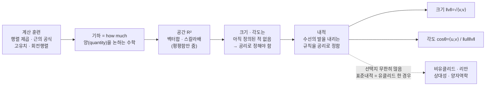

# 기하학과 내적이란 무엇인가?

먼저 $2\times2$ 행렬 계산을 한 세트 같이 돌려 손에 익히고, 그다음 "기하란 무엇인가"라는 좀 더 근원적인 이야기를 나눕니다. 기하를 **"양(how much)을 논하는 수학"** 으로 다시 정의한 뒤, 그 양을 실제로 재게 해 주는 도구가 **내적**임을 — 특히 내적이 "수선의 발을 내리는 규칙을 공리로 정하는 일"임을 — 끝에서 설명합니다.

---

## [0. 계산 훈련 한 세트 — 행렬 제곱 · ▶ 02:49](https://www.youtube.com/watch?v=bzf8QFp_LZI&t=169s)

먼저 $2\times2$ 행렬의 제곱을 빠르게 계산하는 연습입니다. 망설이지 말고 답이 바로 나와야 합니다.

성분별 규칙을 한 번 더 짚겠습니다. $A=\begin{pmatrix} a & b \\ c & d \end{pmatrix}$ 일 때

$$A^2=\begin{pmatrix} a^2+bc & ab+bd \\ ac+cd & d^2+bc \end{pmatrix}.$$

저는 마음속으로 "이거 제곱하고 이거 더한다"는 식으로 각 성분을 처리합니다. 예를 들어

$$\begin{pmatrix}1&1\\1&1\end{pmatrix}^2=\begin{pmatrix}2&2\\2&2\end{pmatrix},\qquad
\begin{pmatrix}2&1\\1&2\end{pmatrix}^2=\begin{pmatrix}5&4\\4&5\end{pmatrix}.$$

이어서 거듭제곱도 같은 리듬으로 답합니다 — $\begin{pmatrix}2&0\\0&2\end{pmatrix}^3=\begin{pmatrix}8&0\\0&8\end{pmatrix}$, $\begin{pmatrix}3&0\\0&3\end{pmatrix}^4=\begin{pmatrix}81&0\\0&81\end{pmatrix}$, $\begin{pmatrix}2&0\\0&2\end{pmatrix}^{10}=\begin{pmatrix}1024&0\\0&1024\end{pmatrix}$.

훈련의 핵심은 이렇습니다. 계산에 에너지가 들지 않아야, 정작 **관찰**해야 할 때 거기에 에너지를 쓸 수 있습니다. 닥치고 계산해서 계산이 편해지면, 그제야 행렬 자체를 가지고 관찰하는 일이 가능해집니다.

> **✏️ 연습문제** 임의의 $2\times2$ 행렬에 대해 위 제곱 규칙(첫 성분 $a^2+bc$ … )을 망설임 없이 암산으로 적용할 수 있을 때까지 반복할 것. 대각행렬의 거듭제곱($\mathrm{diag}(k)^n=\mathrm{diag}(k^n)$)도 즉답이 나오도록.

---

## [1. 계산 훈련 — 근의 공식(분모가 $2a$ 가 아니게) · ▶ 13:33](https://www.youtube.com/watch?v=bzf8QFp_LZI&t=813s)

다음은 2차 방정식의 근을 구하되, **분모가 $2a$ 로 출발하지 않게** 푸는 연습입니다.

무슨 뜻이냐면, 기본형이 $ax^2+2b'x+c=0$ 형태일 때 — 즉 일차항의 계수를 $2b'$ 로 보면 — 근의 공식

$$x=\frac{-2b'\pm\sqrt{4b'^2-4ac}}{2a}$$

에서 루트 안의 $4$ 가 약분되어

$$x=\frac{-b'\pm\sqrt{b'^2-ac}}{a}$$

가 나옵니다. 분모가 $2a$ 가 아니라 $a$ 로 출발하게 되죠.

예를 들어 $x^2+2x+3=0$ 이면 $b'=1,\ a=1,\ c=3$ 이므로 $x=-1\pm\sqrt{1-3}=-1\pm\sqrt{2}\,i$. $x^2+6x+1=0$ 이면 $b'=3$ 이라 $x=-3\pm\sqrt{9-1}=-3\pm 2\sqrt{2}$. $x^2-2x+4=0$ 이면 $x=1\pm\sqrt{1-4}=1\pm\sqrt{3}\,i$.

이런 것은 스킬셋으로 외운다기보다, 계산을 많이 해서 "빨리 하려다 보니 저절로 나오는" 정서가 되어야 합니다.

이어서 원리를 묻습니다.

> **💭 생각해볼 점** "2차 방정식의 근을 구하는 원리는 무엇인가?" — 여러분 중 한 분이 $a$ 로 나눈 뒤 완전제곱식으로 묶고, $4a^2$ 분의 $b^2$ 항을 빼 주고 이항해 루트를 취하는 과정을 차근차근 짚었습니다. 큰 틀에서 맞습니다. 다만 답으로는 더 담담해도 됩니다 — **"완전제곱식으로 바꿔서 정리하면 된다"** 한 줄이면 족하고, 구체적 레시피는 그걸 풀어쓴 것일 뿐입니다.

---

## [2. 계산 훈련 — 고유치·고유벡터, 역행렬, 회전행렬 · ▶ 16:51](https://www.youtube.com/watch?v=bzf8QFp_LZI&t=1011s)

이제 정의를 묻는 문제로 넘어갑니다.

**고유치와 고유벡터의 정의.** 먼저 제가 일부러 틀린 문장을 말합니다 — "고유치 $\lambda$, 고유벡터 $v$ 에 대해 $Av=\lambda v$ 이면 $v$ 를 고유벡터, $\lambda$ 를 고유치라 한다"고요. 여기엔 빠진 게 있습니다.

> **💭 생각해볼 점** "방금 제가 한 거짓말이 무엇인지 정확히 짚어 보세요." — 항등행렬 이야기가 아닙니다. 여러분 중 한 분이 맞혔듯, 빠진 조건은 **"$v$ 가 영벡터가 아니다"** 입니다. 고유치와 고유벡터는 따로따로 정의되는 게 아니라 $Av=\lambda v$ 라는 한 식으로 **동시에** 규정되며, 그 정의 안에 "$v\neq \mathbf 0$" 가 반드시 들어가야 합니다. 이게 가장 중요한 포인트입니다.

**역행렬.** $\begin{pmatrix}2&1\\1&2\end{pmatrix}$ 처럼 주면 행렬식이 $3$ 이니 $\dfrac{1}{3}\begin{pmatrix}2&-1\\-1&2\end{pmatrix}$ 가 즉답으로 나와야 합니다. 일반형은 $A^{-1}=\dfrac{1}{ad-bc}\begin{pmatrix}d&-b\\-c&a\end{pmatrix}$ 입니다. 이 리듬으로 답이 나오기를 원합니다.

**고유벡터 계산 레시피.** $2\times2$ 행렬 $A$ 가 있을 때, 대각 성분에서 $\lambda$ 를 빼고 $\det(A-\lambda I)=0$ 으로 놓아 $\lambda$ 를 구한 뒤, 각 $\lambda$ 에 대해 영이 아닌 $v$ 가 있다고 가정하고 $(A-\lambda I)v=\mathbf 0$ 을 풀면 고유벡터가 나옵니다.

> **💭 생각해볼 점** "고유치·고유벡터를 구할 때 왜 행렬식이 $0$ 이라는 조건을 놓고 푸는가?" — 지난주에도 같은 물음을 드렸습니다. 이건 말로 외우는 게 아니라 **계산을 직접 의미해 보면** 알 수 있는 종류의 질문입니다. (이 영상에서는 답을 끝까지 풀어 주기보다, 직접 계산해 보라고 남겨 둡니다.)

**행렬식의 기하적 의미.** 두 열벡터가 만드는 **평행사변형의 넓이**입니다.

> **💭 생각해볼 점** "$\det\begin{pmatrix}a&b\\c&d\end{pmatrix}=ad-bc$ 가 평행사변형 넓이임을 어떻게 유도하는가?" — 여러분 중 한 분이 옛날 정석 스타일로 답했습니다. 한 변 $(a,b)$, 다른 변 $(c,d)$ 로 평행사변형을 그리면 대각 꼭짓점이 $(a+c,\ b+d)$ 가 되고, 그 큰 직사각형에서 직각삼각형 네 개와 직사각형 두 개를 빼면 $ad-bc$ 가 남는다 — 100% 정당한 답입니다. 다만 제가 이 강의에서 원하는 유도는 **회전행렬을 써서 한 변을 $x$축 위로 돌려 놓고 "밑변 × 높이"로 넓이가 같음을 보이는** 직문수식 방향입니다 (→ 전사본 4.2 참조).

**회전행렬.** 벡터를 반시계로 $\theta$ 만큼 돌리는 행렬은

$$R(\theta)=\begin{pmatrix}\cos\theta & -\sin\theta \\ \sin\theta & \cos\theta\end{pmatrix}.$$

> **💭 생각해볼 점** "왜 그 형태인가?" — 단위원에서 음각[?]/직각삼각형을 그려 $(1,0)$ 을 $\theta$ 만큼 돌리면 그 점이 $(\cos\theta,\ \sin\theta)$ 가 되는 데서 출발합니다. 자세한 유도는 증노트(단원 전사본)를 다시 읽어 보시기 바랍니다 (→ 전사본 3장 참조).

---

## [3. 훈련을 마무리하며 — 수학은 이렇게 배운다 · ▶ 28:12](https://www.youtube.com/watch?v=bzf8QFp_LZI&t=1692s)

여기까지가 오늘의 한 세트입니다. 계산에 더는 생각이 필요 없어질 만큼 리듬이 잡히면, 비로소 그 위에서 수학을 여러 층으로 감상하는 일이 가능해집니다. 추상적인 명제도 구체적인 걸 마음속으로 편하게 만져 보면서 "아, 이게 이런 거구나" 하고 감이 옵니다. 반대로 계산에 시간과 에너지를 다 빼앗기면 그 층이 안 보입니다.

수학은 언제나 이런 방식으로 배워야 합니다. 그리고 내가 지금 어느 레벨에 있든, 거기서부터 할 훈련은 늘 있습니다.

> **📚 참고·응용** 훈련의 목적은 단순합니다 — 명제를 봤을 때 **여러분 스스로 단순한 선에서 검증 가능하게** 만드는 것. 오랜만에 영어책을 읽으면 해석하느라 급해 내용을 못 따라가듯, 계산이 안 잡히면 명제의 내용을 못 봅니다. 계산이 편해져야 비로소 수학을 배운 게 됩니다.

---

## [4. 기하란 무엇인가 — "양(how much)을 논하는 수학" · ▶ 30:08](https://www.youtube.com/watch?v=bzf8QFp_LZI&t=1808s)

오늘 나누고 싶은 건 **기하가 무엇이냐**입니다. 어떻게 보면 수학에서 가장 근원적인 이야기입니다.

**중학교 때 삼각형에서 수선의 발을 내리는 그런 건 기하의 아주 작은 단면**에 지나지 않습니다. 기하(영어로 geometry)를 한자 "幾何"로 옮긴 건 직역하면 그냥 **how much(얼마냐)** 입니다 (→ 전사본 0.3 참조). 즉

> **기하 = 양(quantity)을 논하는 수학.**

양을 다루는 임의의 수학은 다 기하이고, 유클리드 기하는 그중 삼각형·원 같은 특수한 경우일 뿐입니다. 기하의 목적은 어떤 합리적인 양을 부여하고, 그 양의 의미와 계산법을 아는 것입니다.

그래서 "어떤 양을 어떻게 계산하느냐"에 따라 기하 앞에 온갖 형용사가 붙습니다.

- **미분기하(differential / Riemannian geometry):** 미분으로 기하적 양을 끌어냄.
- **대수기하(algebraic geometry):** 적분(integration) 쪽 도구로 양을 알아냄. (미분기하와 성격이 다릅니다.)
- **사교기하(symplectic geometry):** 고전역학을 기하의 언어로 옮긴 것.
- **복소기하(complex geometry):** 복소수와 관련된 기하.

그러니 여러분이 떠올리는 "유클리드 기하"라는 선입견과 제가 말하는 기하는 여러 점에서 다를 수 있습니다.

> **💭 생각해볼 점** how much가 왜 중요할까요? 예를 들어 주식 같은 금융시장 — "내가 지금 어떤 양에 관심이 있다"는 것 — 양에 관심을 두는 수학은 전부 기하입니다. 그러니 여러분이 직관적으로 생각하는 기하와 제가 생각하는 기하는 매우 다를 가능성이 높습니다.

---

## [5. 공간과 마음의 고향 — $\mathbb{R}^2$ 에서 출발하는 이유 · ▶ 34:33](https://www.youtube.com/watch?v=bzf8QFp_LZI&t=2073s)

기하를 결정하려면 먼저 **공간**이라는 개념이 있어야 합니다. 그런데 공간이 수학적으로 무엇이냐를 따지면 위상수학까지 가야 하고 할 말이 너무 많아져, 직문수에서 거기까지 깊이 들어가진 않습니다 (후반부에 위상수학 일부만 다룹니다).

대상을 어떻게 규정하든, 인간에게 **마음의 고향**은 기원전 3세기 유클리드 기하의 공간입니다. 지금 우리가 보는 건 그중 **2차원 유클리드 공간** $\mathbb{R}^2$, 이게 우리 마음의 고향입니다. 수학에서도 추상화는 보통 이 구체적인 데서 출발해 많은 걸 만들어 둔 뒤 $\mathbb{R}^2$ 를 벗어날 생각을 합니다.

$\mathbb{R}^2$ 에서 되는 건 두 가지 연산입니다 — **벡터 합**과 **스칼라배**. 여러분이 가진 심상을 떠올려 보세요. 두 벡터의 합이 평행사변형의 대각선을 가리킨다, 벡터에 스칼라를 곱하면 그만큼 늘거나(음수면) 반대 방향으로 간다 — 직관적으로 괜찮으시죠?

그런데 그런 연산이 정의되려면 **공간이 평평하게 무한히 뻗어 있는 평면**이어야 말이 됩니다. 만약 $\mathbb{R}^2$ 대신 2차원 구면이나 토러스로 바꾸면, 엄밀히 보이는 건 일이지만 직관 수준에서도 그 두 연산이 아예 말이 안 된다는 게 어느 정도 느껴지실 겁니다.

> **💭 생각해볼 점** 우리가 선형성을 정의할 때 쓴 벡터 합과 스칼라배 자체가, **공간이 평평하게 무한히 펼쳐진 형상이어야만 말이 된다**는 전제를 깔고 있습니다. 그렇다면 그렇지 않은 공간은 어떻게 다룰까요?

우리는 그렇지 않은 공간들로 확장하기를 원합니다. 물리적 이유가 큽니다 — 하나는 **상대성 이론**, 다른 하나는 **양자역학**입니다. 거시·미시 세계 모두 유클리드 공간이 아닌 다른 공간이어야 기술되기 때문입니다. 게다가 오늘날 기계학습 시대에는 통계적 모델들 자체가 유클리드 기하를 따르지 않는다는 점도 너무 중요합니다.

그럼에도 우리의 출발점은 $\mathbb{R}^2$, 그리고 이를 차원으로 확장한 $\mathbb{R}^n$ 입니다. 여기서부터 모든 걸 말이 되게 만들어 선형대수로 기하적 체계를 세웁니다. 유클리드 공간을 벗어날 때 이를 다루는 도구는 당연히 **미적분**이 됩니다.

그래서 정리하면, 유클리드 공간이라는 가정 아래 집합 위에서 어떻게 기하를 논할 수 있는지 — 이게 사실 선형대수이고, 이를 구체적으로 실현하는 도구가 **내적(inner product)** 입니다.

---

## [6. (심화) 공간이라는 단어의 두 갈래 · ▶ 39:00](https://www.youtube.com/watch?v=bzf8QFp_LZI&t=2340s)

> 지금 단계에서 다 이해할 필요는 없고, "한 귀로 흘려 두었다가 나중에 다시 떠올리면 되는" 종류의 이야기입니다.

> **💭 생각해볼 점** "2차원 공간이라 해도 유클리드처럼 평평한 것, 구면처럼 휜 것, 안장처럼 휜 것 등 여러 가지인데, '2차원 공간(정확히는 2차원 매니폴드)'이라는 말 자체가 어떻게 정의되는가?"

위상기하 관점에서 **space**라는 단어는 크게 두 갈래로 나뉩니다.

- 첫째: **위상공간(topological space) + 추가 구조**. 고전적 의미의 공간입니다.
- 둘째: 위상공간을 주는 대상이 집합(set)이라는 데서 출발하면 모임(collection)을 논할 때 문제가 생깁니다. 그래서 위상 구조를 집합이 아니라 **범주(category)** 에 주는 쪽으로 갑니다 (그로텐디크 위상).

또 같은 위상공간이라도 **어떤 미적분과 호환되느냐**로 갈립니다.

- 고전적 미적분(미분형식)과 호환되는 기하 → 보통 **미분기하**가 이쪽입니다.
- 고전적 미적분이 안 먹히는 경우(예: 유한체 위의 공간, 정수론·논리학 쪽) → 미분형식 대신 **호몰로지 대수·가환대수** 같은 대수적 도구로 미적분의 역할을 대체합니다.

또 매니폴드(manifold)와 버라이어티(variety)는 위상 자체가 다릅니다. 특히 버라이어티 쪽은 하우스도르프성[?]도 깨지는 경우가 있어 고전적 의미의 극한(limit)을 취할 수 없습니다. "언제 매니폴드가 유클리드 공간이 되느냐"는 근본적 질문이고, 이건 스피박 책에 잘 나와 있습니다.

여기서 강조하고 싶은 건 이렇습니다. 무리수 차원을 갖는 프랙탈 같은 이상한 예시를 아는 것 자체는 재밌을 수 있지만, 직문수에서 훈련하는 것처럼 **검증 가능한 방식**으로 다룰 줄 아는 게 더 중요합니다. 결국 검증 가능한 수학은 논리와 계산으로 떨어지고, 거기에 맞는 미적분으로 추상화가 보여야 비로소 이론이 만들어진 것과 맞닿습니다. 조합론조차 기하로 보는 흐름도 그런 다리입니다.

---

## [7. (Q&A) 기하·해석기하·플랫이라는 말을 둘러싼 질문들 · ▶ 49:28](https://www.youtube.com/watch?v=bzf8QFp_LZI&t=2968s)

여기서 미리 경계할 정서 하나를 말해 둡니다 — **전체주의적 시야**입니다. 선형대수에서 다룬 것 중 우리는 사실 어떤 필요조건도 만난 적이 없습니다. 그만큼 범용적이라는 뜻이고, 그래서 "이것만이 전부"라는 식의 태도는 조심해야 합니다.

> **💭 생각해볼 점 (기하가 모든 수학의 기초인가?)** "공간·기하가 계속 나오는데, 기하가 모든 수학의 기초인가, 아니면 결국 모든 수학이 기하로 가는가?" — 수학적 답은 언제나 **아니오**입니다. 기하를 모르고도 발전하는 중요한 수학이 너무 많고, 그런 수학을 하는 분들이 기하를 꼭 접하는 것도 아닙니다. 다만 기하란 결국 how much이니, 수학에서 양을 떼어 놓기란 어렵다는 정도로 이해하시면 됩니다.

> **💭 생각해볼 점 ("평평하다"란 무엇인가?)** "벡터 스페이스를 덧셈·스칼라배가 되는 것으로 보고 '평평하다'고 한다면, 연산을 조금 다르게 주면 평평하지 않을 것 같은데, 대체 평평함을 어떻게 말하나?" — 그건 조금 다른 이야기입니다. 누가 'flat'을 어떻게 정의했다고 해서 그게 내 직관적 'flat'과 일치해야 하는 것은 아닙니다. 실제로 벡터 스페이스 연산이 안 되는 **flat torus** 같은 공간에도 'flat'이라 부르는 센스가 있고, 대수 쪽에는 벡터 스페이스를 일반화한 module 중 **flat module** 이라는 개념도 있습니다 — 이름은 같아도 다른 개념이죠.

> **💭 생각해볼 점 (좌표 평면이 있다/없다를 오갈 수 있나?)** "중학교 유클리드 기하엔 좌표 평면이 없다가, 고등학교에선 $xy$축이 생겨 해석기하가 되고, 대학 위상수학에선 다시 좌표가 사라진다. 이 둘을 오갈 수 있는가, 그렇다면 어떤 용도인가?" — 지식 층에서는 맞는 라인입니다. $\mathbb{R}^2$ 를 $(a,b),(x,y)$ 처럼 좌표로 잡고 출발하는 게 **해석기하(데카르트가 도입한 칼테시안 좌표)** 입니다. 좌표로 잡는 건 그게 다루기 쉽기 때문이고, 이를 일반화한 것이 위상공간·위상수학입니다. 직문수에서 가장 원형적인 걸 보는 이유가 그것입니다 — 원형의 직관이 서면 거기까지 뻗어 나갈 수 있습니다.

> **💭 생각해볼 점 (점으로 선을 만들 수 있나 / 기하 = 무한을 유한으로?)** "무한히 점을 찍어 선을 만들 수 있다고 생각했는데, 기하가 무한을 유한으로 끌어내리는 관점과 통하지 않나?" — 다른 이야기입니다. **시각화와 기하는 다릅니다.** 우리는 시각화를 기하라고 여기는 경향이 있지만, 기하의 정의는 양을 논하는 수학입니다. 점을 이어 선을 만드는 것도 기하(유클리드 기하)는 맞지만, 기하가 언제나 그런 식이어야 하는 건 아닙니다. 현재 수학에서 '점'은 0차원 대상일 필요조차 없고, '공간'은 집합에서 출발할 필요조차 없습니다. 그래서 "기하를 하려면 어떤 수학을 알아야 하나?"에 대한 농담 섞인 답이 **everything** 인 겁니다 — 기하학자가 보기엔 모든 수학이 기하이기 때문입니다.

> **💭 생각해볼 점 (내적이 결국 비율을 정하나?)** "내적·회전을 보면 결국 비율만 남는 것 같은데, 기하가 비율이라면 그 비율이 스칼라 같은 것 아닌가?" — 그건 오해입니다. 기하는 **양들(복수형)** 을 논하는 모든 수학입니다. 비율을 논하는 것도 기하지만, **그것만**은 아닙니다. 양에는 각도도, 호의 길이도, 넓이도 들어갑니다. **내적은 비율만 정하는 게 아닙니다** (비율도 정하긴 하지만요).

> **📚 참고·응용** 오늘 기하 이야기를 전부 이해하지 못해도 괜찮습니다. 오늘 질문들은 각자 자기 공부를 토대로 한 거라 브레인스토밍·스크래치 수준으로 답한 것입니다. 메시지는 하나입니다 — **"기하란 양을 가지고 논하는 수학이다."** "기하인데 양이라니, 모양·공간이 떠오르는데" 하고 혼란이 온다면, 바로 그 지점이 포인트입니다.

> **📚 참고·응용 (리만)** 가우스의 **"위대한 정리(Theorema Egregium)"** 는 곡률이 내적에서 결정된다는 정리입니다. 다만 그 이름 때문에 학부에서 거기까지가 끝인 양 오해하기 쉽습니다 — 정작 진짜 중요한 건 그 다음, 리만에서 시작됩니다. (가우스는 비유클리드 기하의 창시자 중 한 명이고, 리만은 양을 논하는 기하를 가우스로부터 배웠습니다.)

---

## [8. 내적의 정의 — "수선의 발을 내리는 규칙을 공리로 정한다" · ▶ 1:17:16](https://www.youtube.com/watch?v=bzf8QFp_LZI&t=4636s)

이제 제가 내적을 어떻게 생각하는지 공유하고 마무리하겠습니다. 노트(7강)에 정의가 적혀 있지만, 저는 일부러 그걸 안 쓰고 사고방식을 설명하겠습니다.

다시 가져가셔야 할 출발점은 이것입니다 — **$\mathbb{R}^2$ 의 정의 레벨에서 우리는 크기와 각도를 논한 적이 없습니다.** 내적을 꺼내기 전, 공리와 연산만 이야기했을 때 언제 크기·각도를 말했습니까? 그러니 우리가 $ad-bc$ 로 평행사변형 넓이를 말하고 있을 때, 이미 (암묵적으로) 내적을 쓰고 있던 셈입니다.

그래서 기하적으로 공리로 정해야 할 것은 **각 벡터의 크기**와 **두 벡터의 각도**입니다. 이건 정해야(받아들여야) 하는 것입니다. 예를 들어 $\mathbb{R}^2$ 에서 $(10,0)$ 은 $(1,0)$ 의 10배입니다(스칼라배). 그렇다고 $(10,0)$ 의 크기가 $10$ 이라는 뜻일까요? 아닙니다. 그건 **$(1,0)$ 의 크기가 $1$ 이라고 받아들일 때만** 따라옵니다. 만약 $(1,0)$ 의 크기를 $2$ 라고 우긴다면 $(10,0)$ 의 크기는 $20$ 이 됩니다. 마찬가지로 $(2,0)$ 과 $(0,3)$ 의 사잇각이 $90^\circ$ 라는 것도, $(1,0)$ 과 $(0,1)$ 의 사잇각이 $90^\circ$ 일 때만 맞는 말입니다. **우리는 그것을 동의한 적이 없습니다.**

그리고 이걸 동의하지 않는 자연계가 바로 상대성과 양자역학입니다. 시공간도, 미시 세계도 이를 동의하지 않습니다. 유클리드 기하는 2천 년 넘게 가져온 하나의 환상이자 마음의 고향 같은 것입니다.

그렇다면 이 공리를 어떻게 정할까요? 아이러니하게도, 그 공리가 바로 **수선의 발**입니다.

> **그림(말로):** 무한히 펼쳐진 평평한 평면 $\mathbb{R}^2$ 를 마음속에 깔고, 원점만 잡습니다(해석기하적 축은 필요 없습니다). 원점 기준으로 벡터 두 개를 아무렇게나 잡고, 한 벡터에서 다른 벡터로 **수선의 발**을 내려 그 위로 정사영합니다.

이때 **정사영된 길이와 원래 벡터의 길이(유클리드 기준으로 보던 그 크기)의 곱**, 이것을 **내적**이라 정의합니다. 핵심은 "수선의 발을 내리는 일" 자체가 공리라는 점입니다. 함수 언어로 말하면, 정의역은 (벡터들의 모임) $\times$ (벡터들의 모임), 즉 두 벡터를 입력으로 받아, 한 벡터를 다른 벡터 방향으로 수선의 발을 내려 두 길이를 곱한 값을 할당하는 함수입니다.

여기서 자연스럽게 따라옵니다.

- **같은 벡터 두 개**를 넣으면 수선의 발을 내릴 필요가 없으니 **크기의 제곱**이 됩니다. 그래서 $\lVert v\rVert=\sqrt{\langle v,v\rangle}$ 로 크기를 잴 수 있습니다.
- 수선의 발이 직각삼각형을 결정하므로, 두 길이를 잴 수 있으면 **각도**도 잴 수 있습니다.

즉 **내적이 정해지면 크기와 각도가 모두 따라옵니다.** 내적의 정의가 실제로 달성하려는 것은 "수선의 발을 내리는 규칙을 정하는 일"입니다 (→ 전사본 6장: 표준내적 $\langle(a,b),(c,d)\rangle=ac+bd$, $\lVert v\rVert=\sqrt{\langle v,v\rangle}$, $\cos\theta=\dfrac{\langle u,v\rangle}{\lVert u\rVert\,\lVert v\rVert}$ 참조).

내적을 바꾸면 "수선의 발이 어디에 떨어지느냐"는 규칙 자체가 바뀝니다. 표준내적($M=I$)에서는 $(1,0)$ 과 $(0,1)$ 이 직각이라 $(0,1)$ 의 정사영 길이가 $0$ 이지만($\langle(1,0),(0,1)\rangle=0$), 다른 내적($M\neq I$)에서는 둘이 직각이 아니어서 정사영 길이가 $0$ 이 아닙니다($\langle(1,0),(0,1)\rangle\neq0$). 같은 두 화살표인데, 어느 쪽이 수직인지를 정하는 일이 바로 내적입니다.

> **💭 생각해볼 점 (수선의 발이 공리라는 게 와닿지 않음)** "두 벡터를 수선의 발로 내리는 것이 공리라는 게 잘 와닿지 않는다." — 디스커션에서 풀어 보면 좋은 지점입니다. 8강 노트에서, $(1,0)$ 과 $(0,1)$ 의 각이 더 이상 $90^\circ$ 가 아닌 상황에서 "수선의 발을 내린다"는 게 무슨 센스인지 생각해 보세요. 거기서부터 직관이 꼬여야 정상입니다. 지금 관점에서 $(1,0)$ 에 $(0,1)$ 을 수선의 발로 내리면 크기가 $0$ 으로 가야 할 것 같죠 — **그게 아니라는** 이야기이고, 그 규칙을 정하는 것이 내적입니다.

> **💭 생각해볼 점 (공리 후보들을 검토해 고르는 것인가?)** "학자들이 공리를 정할 때 여러 후보를 나열·검토해서, 수학적으로 이득이 있어 고르는 것인가?" — 수학적 관점과 응용 관점을 나눠야 합니다. 수학이 하는 일은 "$\mathbb{R}^2$ 에서 내적을 정하지 않으면 크기·각도를 논할 수 없으니, 내적을 정해 크기·각도를 말이 되게 하자"까지입니다. 그 과정에서 "내적의 선택지가 몇 개냐? — **무한히** 많고, 원래 우리가 쓰던 표준내적은 특수한 경우일 뿐"이라는 게 드러납니다. **그중 어떤 내적을 써야 목표가 달성되느냐**(예: 시공간을 기술하는 내적이 유클리드 내적이어야 하느냐 — 아니었습니다, 그게 상대성입니다)는 맥락(물리·공학)에 의존하는, 그 자체로 또 하나의 중요한 질문입니다.

> **💭 생각해볼 점 (수직을 정하는 것 = 평행선 공리?)** "결국 수직이 무엇이냐를 정한다는 게 평행선 공리와 같은 이야기인가?" — 같은 이야기입니다. 평행선이 정해진 시점에 이미 내적이 정해져 있고, 내적이 정해진 시점에 이미 평행선이 정해져 있습니다. 리만 계량에서는 이를 **평행 수송(parallel transport)** 이라 부릅니다 — 평행하게 수송하는 규칙을 정하는 일과 내적을 정하는 일은 수학적으로 등가입니다.

> **💭 생각해볼 점 (모든 내적은 유클리드로 되돌릴 수 있나?)** "내적을 구할 때 수선의 발을 내리고 길이를 늘렸는데, 그러면 모든 내적은 결국 변형하면 유클리드 평면으로 돌아갈 수 있나?" — 좋은 질문이고 답은 예입니다. $\mathbb{R}^2$ 를 집합으로 본 뒤 $(1,0),(0,1)$ 이 만드는 평행사변형의 생김새가 곧 내적이라 보면, 어떤 이에게는 그게 정사각형, 어떤 이에게는 직사각형일 수 있습니다. 기준 벡터를 다시 잡아 "유클리드처럼 보이게" 만들 수는 있죠. 하지만 **기준(단위)은 통일되어 있어야** 합니다. 단위를 다르게 하면 비슷하게 보여도 실제로는 다른 것입니다. 평행사변형의 생김새를 똑같이 맞췄을 때, 그걸 달성하는 다른 것이 있느냐 하면 — 있지만, 그럼에도 여전히 다른 것입니다.

---

## [9. 마무리 — 직문수가 향하는 리만의 수학(2스텝) · ▶ 1:28:00](https://www.youtube.com/watch?v=bzf8QFp_LZI&t=5280s)

직문수가 향하는 **리만의 수학**이 가르쳐 주는 것은 두 스텝입니다.

- **1스텝:** 우리는 내적으로 "이 지구의 형상"을 알고 싶습니다. 보통은 형상을 알려면 위성 사진을 봐야 합니다. 그런데 가우스의 정리는 **위성 사진을 안 찍고도 내적만으로** 알 수 있다고 말합니다 — 즉 내적이 아주 많은 것을 결정합니다. (이것이 리만의 스승 격에 해당하는 업적입니다.)
- **2스텝:** 리만은 더 들어가, 여러분이 지금 본 군(group)을 포함한 **대수적 구조**의 이야기로 봅니다 — 연산 구조·군 구조에 층위해서 이 기하적 대상들을 볼 수 있다는 관점입니다.

이걸 익히고 나서 수학을 보면, 해석학·대수학·위상수학이 따로 부과되는 세계관이 아니라는 것을 배우게 됩니다. 다음 시간에 이어 가겠습니다.

> **📚 참고·응용** 7강(단원 전사본)에 내적의 공리적 정의·표준내적·피타고라스·계량 행렬, 그리고 비유클리드/리만 기하로의 일반화가 정리되어 있습니다. 디스커션 때 정의를 보며 "왜 그게 그것인지" 직접 뜯어 보시기 바랍니다 (→ [전사본](07.%20Linear%20Algebra%20Part%203%20-%20Linear%20Algebra%20and%20Geometry.md) 6·7장).

---

## 요약

오늘 강의가 흘러온 큰 줄거리 — 계산 훈련에서 출발해 "기하 = 양", 그 양을 재는 도구인 내적, 그리고 내적이 결국 "수선의 발 규칙"임까지:

- 오늘은 $2\times2$ 행렬 계산을 한 세트 훈련하고, 이어 "기하란 무엇인가 → 내적이란 무엇인가"를 이야기했습니다.
- **계산 훈련:** 행렬 제곱($A^2$ 성분 규칙), 거듭제곱, 근의 공식(분모가 $2a$ 가 아니게 $\frac{-b'\pm\sqrt{b'^2-ac}}{a}$), 고유치·고유벡터의 정의(반드시 $v\neq\mathbf 0$), 역행렬, 행렬식=평행사변형 넓이, 회전행렬 $R(\theta)$. 핵심은 계산에 에너지를 안 쓰게 해서 관찰에 에너지를 쓰는 것.
- **기하의 재정의:** 기하(幾何) = how much = **양을 논하는 수학**. 유클리드 기하는 그 특수한 한 단면이며, 미분기하·대수기하·사교기하·복소기하처럼 "어떤 양을 어떻게 재느냐"에 따라 형용사가 붙습니다.
- **공간과 출발점:** 마음의 고향은 2차원 유클리드 공간 $\mathbb{R}^2$. 벡터 합·스칼라배는 공간이 평평하게 무한히 뻗어 있어야 말이 됩니다. 상대성·양자역학·기계학습은 유클리드를 벗어난 공간을 요구합니다.
- **내적의 정의:** $\mathbb{R}^2$ 의 정의에는 크기·각도가 없습니다. 그것을 공리로 주는 것이 내적이고, 그 본질은 **"수선의 발을 내려 정사영 길이와 길이를 곱하는 규칙"** 을 정하는 일입니다. 내적이 정해지면 크기($\lVert v\rVert=\sqrt{\langle v,v\rangle}$)와 각도가 따라옵니다. 내적의 선택지는 무한히 많고, 표준내적은 그중 하나(유클리드 기하)일 뿐입니다.
- **연결:** 수직을 정하는 일 = 평행선 공리 = 평행 수송 규칙을 정하는 일 = 내적을 정하는 일, 모두 등가입니다. 이것이 가우스의 정리(위성 사진 없이 내적만으로 형상을 앎)와 리만의 대수적 구조 이야기로 이어집니다.
