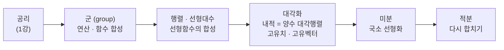

# 내적을 토대로 벡터들 관계 규정짓기

오늘은 고유치·고유 벡터를 구하는 연습을 한참 한 뒤, 그 연습이 사실은 **내적(inner product)** 훈련이었다는 점을 이어 붙입니다. 앞쪽 30분은 2차 방정식·특성 방정식·고유치·고유 벡터를 입으로 풀어내는 의도적 훈련에 쓰고, 뒤쪽은 내적을 함수로 공리화하면서 "벡터의 크기와 각도가 내적 하나에서 따라 나온다", 그리고 "고유치·고유 벡터를 구하는 일은 결국 내적을 대각 행렬로 적는 일"이라는 이야기로 마무리합니다.

---

## [0. 오늘의 목적 — 연습과 내적을 잇기 · ▶ 00:00](https://www.youtube.com/watch?v=MlNHC4JypnY&t=0s)

오늘 다루는 것은 여러분이 연습하고 계신 **고유치·고유 벡터**와 **내적**을 연결하는 것입니다. 먼저 연습을 한 뒤, 그것을 내적 이야기로 이어 붙입니다.

---

## [1. 근의 공식을 말로 유도하기 · ▶ 01:12](https://www.youtube.com/watch?v=MlNHC4JypnY&t=72s)

$a\neq 0$ 인 $ax^2+bx+c=0$ 에서 근의 공식을 끌어내는 흐름은 이렇습니다.

1. $a$ 로 나눠 일계수를 1로 만들고,
2. $x^2+\dfrac{b}{a}x$ 를 완전제곱식으로 바꾸기 위해 $\left(\dfrac{b}{2a}\right)^2$ 을 더하고 빼며,
3. 상수항을 우변으로 옮기면
   $$\left(x+\frac{b}{2a}\right)^2=\frac{b^2-4ac}{4a^2},$$
4. 양변에 제곱근을 취하고 정리하면
   $$x=\frac{-b\pm\sqrt{b^2-4ac}}{2a}.$$

여기서 한 가지를 바로잡습니다. "$a,b,c$ 가 0이 아니다"가 아니라, 필요한 조건은 **$a$ 만 0이 아니면** 충분합니다.

---

## [2. 근의 공식 적용 · 완전제곱식 만들기 · ▶ 04:02](https://www.youtube.com/watch?v=MlNHC4JypnY&t=242s)

차례로 2차 방정식의 근을 구합니다. 예를 들면

- $x^2-4x+1=0 \ \Rightarrow\ x=2\pm\sqrt{3}$,
- $x^2-4x+3=0 \ \Rightarrow\ x=1,\,3$,
- $x^2-6x+9=0 \ \Rightarrow\ x=3$ (중근),
- $2x^2-4x+2=0 \ \Rightarrow\ x=1$ (양변을 2로 나누면 $x^2-2x+1=0$).

이어서 **완전제곱식으로만** 표현하는 연습으로 넘어갑니다. 예를 들어

$$2x^2+4x+1=2(x+1)^2-1,\qquad 2x^2+4x-1=2(x+1)^2-3,$$
$$3x^2+6x=3(x+1)^2-3.$$

마지막 식은 $3x^2+6x=3(x^2+2x)=3\big((x+1)^2-1\big)=3(x+1)^2-3$ 으로 정리되어야 합니다. 묶어 낸 $3$ 을 괄호 안의 $-1$ 에도 곱해야 한다는 점이 자주 걸리는 자리입니다.

---

## [3. 고유치를 구하는 레시피 — 특성 방정식 · ▶ 11:00](https://www.youtube.com/watch?v=MlNHC4JypnY&t=660s)

$2\times2$ 행렬 $A$ 의 고유치를 구하는 방법을 한 분이 처음부터 끝까지 설명해 주셨습니다. $A\mathbf{v}=\lambda\mathbf{v}$ 에서 $(A-\lambda I)\mathbf{v}=\mathbf{0}$ 이고, $\mathbf{v}\neq\mathbf{0}$ 인 해가 있으려면 $A-\lambda I$ 가 역행렬을 가지면 안 되므로

$$\det(A-\lambda I)=0$$

이 되어야 한다 — 이것을 풀면 $\lambda$ 가 나옵니다. 시험 답안으로는 만점짜리 설명입니다.

다만 제가 기대한 기본 답은 좀 더 간결합니다. "대각선에서 $\lambda$ 를 뺀 다음, 행렬식을 0으로 놓고 풀면 된다." 위의 완벽한 설명은 **왜 그 레시피가 성립하는지**를 설계하는 과정이고, 제가 묻고 싶었던 것은 그 레시피 자체였습니다.

이어서 고유 벡터 구하는 법도 정리했습니다. 고유치를 구한 뒤 그 값을 다시 대입하고, 연립 방정식을 풀면 됩니다. 여기에 "행렬의 **대각선에서** 고유치를 뺀다"는 한마디만 명시하면 설명이 완성됩니다.

> **💭 생각해볼 점** 우리가 보통 쓰는 $\det(A-\lambda I)$ 를 **특성 다항식(characteristic polynomial)**, 그것을 0으로 놓은 식을 **특성 방정식**이라 부릅니다. 그래서 "특성 방정식을 결정하시오"라고 하면, 마음속으로는 대각선에서 $\lambda$ 만큼 빼고 $AD-BC$ 를 적용해서 완전한 방정식 꼴로만 주시면 됩니다. 값까지 구할 필요는 없고, 어쨌거나 식이 완전한 **방정식**(끝에 $=0$ 까지)으로 나와야 한다는 것만 요구했습니다.

---

## [4. 특성 방정식·전개·고유치·고유 벡터 집중 연습 · ▶ 13:18](https://www.youtube.com/watch?v=MlNHC4JypnY&t=798s)

여기서부터는 같은 작업을 여러 변형으로 빠르게 반복했습니다.

**특성 방정식 세우기.** 예를 들어

$$\begin{pmatrix}1&1\\1&1\end{pmatrix}\ \Rightarrow\ (1-t)^2-1=0\ \big(\text{즉 } t^2-2t=0\big),\qquad
\begin{pmatrix}2&1\\3&2\end{pmatrix}\ \Rightarrow\ (2-t)^2-3=0.$$

루트가 섞인 경우도 같은 방식입니다. 예컨대 $\begin{pmatrix}\sqrt{3}&-1\\2&\sqrt{3}\end{pmatrix}$ 이면 $(\sqrt{3}-t)^2+2=0$, $\begin{pmatrix}2\sqrt{2}&2\sqrt{2}\\-2\sqrt{2}&2\sqrt{2}\end{pmatrix}$ 류는 $(t-2\sqrt{2})^2+\cdots=0$ 처럼 정리해 주시면 됩니다.

**곱셈 공식 암산 연습.** 특성 방정식을 손으로 풀어헤치는 암산이 필요해서, 일부러 인수분해된 꼴을 드리고 전개하게 했습니다. 이때 제가 권한 사고법은 **페어링(pairing)** 입니다. $t$ 의 최고차항이 무엇으로만 만들어지는지, 각 차수의 계수가 어떤 항들의 곱의 합인지를 그려 보는 것입니다.

$$(t+1)(t+2)(t+3)=t^3+(1+2+3)t^2+(1\cdot2+2\cdot3+1\cdot3)t+1\cdot2\cdot3=t^3+6t^2+11t+6.$$

$$(t-1)(t-2)(t-3)=t^3-6t^2+11t-6$$

— 숫자 둘이 곱해질 때 부호가 상쇄되어 $+11t$ 가 되고, 마지막은 세 음수의 곱이라 $-6$ 으로 끝납니다. 부호 패턴을 페어링으로 추적하는 것이 요령입니다.

**고유치·고유 벡터.** 그다음 행렬을 섞어 가며 고유치 두 개, 고유 벡터 하나씩을 구하게 했습니다. 예를 들어

- $\begin{pmatrix}0&1\\1&0\end{pmatrix}$ 의 고유치는 $\pm1$,
- $\begin{pmatrix}0&2\\-2&0\end{pmatrix}$ 은 특성 방정식이 $t^2+4=0$ 이라 고유치가 $\pm2i$ — 복소수가 나옵니다.

같은 행렬 $\begin{pmatrix}1&?\\0&2\end{pmatrix}$ 류에서 "이미 나온 것 말고 다른 고유 벡터"를 찾는 문제처럼, 고유치마다 대응하는 고유 벡터가 다르다는 점도 확인했습니다.

> 🧮 [계산 노트북](<04-season-assets/19/ipynb/07. Linear Algebra Part 3 - Linear Algebra and Geometry-04-season-19.ipynb>) — SymPy/NumPy 검산 + 내적 단위원(원↔타원) 그래프.

---

## [5. 고유치를 꼭 2차 방정식으로 풀어야 하나 · ▶ 31:20](https://www.youtube.com/watch?v=MlNHC4JypnY&t=1880s)

> **💭 생각해볼 점 — 고유치·고유 벡터를 꼭 2차 방정식으로 풀어야 하나?** 한 분이 물었듯이, 이 알고리즘을 반드시 2차 방정식 푸는 방식으로 접근해야 하느냐는 좋은 물음입니다. 답은 "표준적인 방법일 뿐, 필요조건은 아니다"입니다. $2\times2$ 는 2차식이 단순해서 이걸로 되지만, $n\times n$ 으로 가면 실제로는 골치가 아파서 여러 트릭이 들어옵니다. 예를 들어 수치해석에서는 방정식을 직접 못 푸는 경우가 많아, 점화식을 찾아 무한히 반복(iteration)하는 알고리즘을 짜기도 합니다. 맥락마다 다릅니다.

---

## [6. 내적이란 무엇인가 — R²에는 크기·각도가 정의된 적 없다 · ▶ 36:58](https://www.youtube.com/watch?v=MlNHC4JypnY&t=2218s)

이제 내적 이야기를 시작합니다. 수식 이전에, 이 수학적 모델링이 왜 이렇게 됐는지를 철학적인 층위에서 먼저 말씀드립니다.

모든 관찰의 출발점은 이것입니다. **우리는 $\mathbb{R}^2$ 의 각 벡터에 크기와 각도를 정의한 적이 없습니다.** $(1,0)$ 과 $(0,1)$ 이 정확히 정사각형을 만든다는 것 — 이것은 유클리드 기하가 만들어 낸 선입견이며, 그렇게 받아들일 필요가 없습니다. 우리는 그것을 정의로 선택한 적이 없고, 단지 "그랬으면 좋겠다"고 암묵적으로 받아들였을 뿐입니다.

고등학교에서 좌표 $(a,b)$ 를 "$x$ 사이즈가 $a$, $y$ 사이즈가 $b$"라고 읽을 때, 그 '사이즈'라는 말 자체가 이미 $(1,0)$ 과 $(0,1)$ 이 정사각형이라는 룰 위에서만 맞는 말입니다. 그렇게 보지 않을 수도 있고, 그렇게 보지 않음으로써 상대성 이론·양자역학, 그리고 오늘날 머신러닝의 통계적 모델들이 나옵니다. 유클리드 기하는 **한 가지 기하**일 뿐 특권적 이유가 없습니다. 거의 천동설 대 지동설에 해당하는 선입견입니다.

> **💭 생각해볼 점** 이 말이 인지적으로, 정서적으로 동의가 되시나요? "$(1,0)$ 과 $(0,1)$ 이 정사각형"이라는 것이 정의가 아니라 **공리**(우리가 정해야 하는 것)라는 점 — 이것이 오늘 이야기의 출발점입니다.

이걸 어떻게 공리화하느냐? **내적**을 가지고 합니다. 내적이 정하고자 하는 것은 **두 벡터가 맺는 관계**입니다. 그 관계를 우리는 정한 적이 없으니 공리로 정해 줘야 합니다. "왜 하필 그 공리를 선택했느냐"에는 수학 바깥의 맥락이 들어옵니다 — 예컨대 맥스웰 방정식을 보니 시간과 공간이 4차원처럼 똑같이 동작하지 않더라는 물리적 맥락. 그런 외부 맥락이 "여기서는 크기·각도의 공리가 이래야 한다"는 수학적 추상으로 이어집니다.

---

## [7. 내적은 함수다 — 정의역과 공역 · ▶ 40:13](https://www.youtube.com/watch?v=MlNHC4JypnY&t=2413s)

내적은 **두 벡터가 맺는 관계를 값으로 할당하는 함수**입니다. 함수의 정의부터 짚고 넘어갑니다. 한 분이 정리해 주셨듯이, 함수란 정의역 집합과 공역 집합의 곱집합의 부분집합으로서, **함수값의 존재성과 유일성**이 보장되는 것입니다. 그러니 내적을 함수로 보려면 정의역과 공역을 지정해야 합니다.

- **정의역:** 두 벡터를 입력으로 받아야 하므로 벡터들의 모임의 곱집합 $\mathbb{R}^2\times\mathbb{R}^2$.
- **공역:** 직문수에서는 실수 $\mathbb{R}$.

공역을 실수로 두는 것도 사실 하나의 **선택**입니다. 앞서 $\begin{pmatrix}0&2\\-2&0\end{pmatrix}$ 의 고유치가 $\pm2i$ 였던 것을 떠올려 보세요. 두 벡터가 맺는 관계가 복소수일 수 있다는 것도 중요하지만, 직문수에서는 공역을 실수로만 제약하고 그것으로 충분합니다. 일반적으로는 벡터공간 $V$ 에 대해 $V\times V\to \mathbb{F}$ 로 더 넓게 갈 수 있지만, 그 추상화는 다루지 않습니다.

$$\langle\,\cdot\,,\,\cdot\,\rangle:\ \mathbb{R}^2\times\mathbb{R}^2\ \longrightarrow\ \mathbb{R}.$$

비유하자면 오디션 프로그램의 심사 같은 것입니다. 가수(벡터) 둘을 데려오면 "제 점수는요…" 하고 값을 매기는 함수가 내적입니다. 그리고 심사위원마다 점수가 다를 수 있듯, **내적은 한 개가 아닙니다.** 내적을 어떻게 주느냐가 곧 어떤 기하를 허용하느냐입니다.

> **💭 생각해볼 점** "두 벡터 사이의 관계를 수 하나로 나타내서 뭘 하려는 건가?"라는 물음이 나왔습니다. 그게 바로 이 공리의 근원적 욕망입니다 — 두 벡터가 맺는 관계를 규정하고, 그것을 가지고 **크기와 각도**를 정의하고 싶은 것입니다.

---

## [8. 내적이 그리는 심상 — 정사영과 두 크기의 곱 · ▶ 44:08](https://www.youtube.com/watch?v=MlNHC4JypnY&t=2648s)

내적이 만들고자 하는 그림을 심상으로 그려 봅니다.

> 그림: 무한히 펼쳐진 평면 $\mathbb{R}^2$ 을 상상하고, 그 위에 기준점(원점)을 찍습니다. 벡터를 하나 준다는 것은 그 평면에 발자국(점)을 하나 남기는 것이고, 원점에서 그 점으로 향하는 화살표로 봐도 됩니다(보통 화살표 관점을 택합니다).

이제 평면 위에 벡터 둘을 아무렇게나 찍습니다. 내적이 만드는 값은 이렇습니다 — 한 벡터를 다른 벡터 방향으로 **수선의 발을 내려(정사영, orthogonal projection)** 같은 방향으로 정렬한 뒤, **두 크기를 곱한 값**입니다. 이것이 내적값(inner product value), "제 점수는요"의 정체입니다.

*그림: 내적 = (u의 크기) × (v를 u에 정사영한 길이).*

> **📚 참고·응용** 다른 스터디(더하데)에서는 이 정사영(orthogonal projection)을 가장 초반부에 가르치는데, 그때는 이미 유클리드 기하를 전제로 시작합니다. 그런데 **사실 그럴 필요가 없다**는 것이 오늘의 포인트입니다.

> **💭 생각해볼 점 — 수선의 발을 내리려면 이미 각도가 정해져 있어야 하지 않나?** 한 분이 정확히 지적했듯이, "수선의 발을 내린다"는 것은 어느 방향이 수직인지가 정해져 있어야 가능합니다. 그러려면 두 벡터의 각도가 이미 정해져 있어야 하죠. 맞습니다. 100% 동어반복입니다. 내적이 정해진 시점에서 그 관계(각도)는 이미 끝나 있고, 그것을 도입하는 동기를 설명하기 위해 정사영의 그림을 끌어온 것입니다.

> **💭 생각해볼 점 — '평평하다'는 것은 각도라는 속성으로 유사한 것 아닌가?** '평평하다'는 개념은 수학적으로는 **벡터합과 스칼라배(벡터공간 구조)** 가 주어진 시점에 구현됩니다. 두 벡터의 벡터합은 평행사변형의 대각선 방향 벡터를 만드는 것이고, 스칼라배는 벡터를 그 배율만큼 늘리거나 줄이는 것을 허용하는 것입니다. 그런데 이 두 연산(평평함)은 **두 벡터의 크기·각도 관계까지 가르쳐 주지는 않습니다.** 즉 $(1,0),(0,1)$ 이 정사각형이라는 룰을 받아들이지 않아도 평평함은 그대로 성립합니다. (참고로, 집합에 선형성을 준 것이 곧 평평함이며, 군(group)의 연산은 평평함에 해당하지 않습니다.)

---

## [9. 내적의 세 가지 공리 · ▶ 56:00](https://www.youtube.com/watch?v=MlNHC4JypnY&t=3360s)

내적이라는 이름을 붙이려면 다음 룰을 만족해야 합니다(→ [전사본](<07. Linear Algebra Part 3 - Linear Algebra and Geometry.md>) 참조).

**① 쌍선형성(bilinearity).** $(1,0),(0,1)$ 이 만드는 평행사변형을 마음속에 둘 그려 보세요 — 하나는 정사각형(유클리드), 하나는 크기나 각도를 바꾼 다른 평행사변형. 한쪽 변을 스칼라배로 늘리거나 줄이면, 평행사변형도 그만큼 선형적으로 늘어나거나 줄어들어야 합니다. 핸드폰 화면을 확대·축소하듯이요. 두 세계관 모두 이 성질을 지지합니다. 이 성질 덕분에 $(1,0),(0,1)$ 이 만드는 평행사변형 하나만 정해 두면, 나머지는 스케일로 다 따라옵니다. 이것이 두 슬롯 각각에 대한 선형성, 즉

$$\langle u,\,v+w\rangle=\langle u,v\rangle+\langle u,w\rangle,\qquad \langle u,\,kv\rangle=k\langle u,v\rangle \quad(k\in\mathbb{R}).$$

두 번째 슬롯을 고정하고 첫째에 대해 선형, 첫째를 고정하고 둘째에 대해 선형 — 이것이 세 공리 중 두 가지에 해당합니다.

**② 대칭성(symmetry).**
$$\langle u,v\rangle=\langle v,u\rangle.$$
한 분의 질문 덕분에 보탠 룰입니다. 한 벡터를 다른 벡터에 정사영해서 곱한 값과, 반대로 정사영해서 곱한 값이 같아야 한다 — 이것이 대칭(교환)이라는 룰입니다. 실수에서는 직관적으로 당연해 보여 설명에서 빠뜨릴 뻔했지만, **공역이 복소수일 때는 성립하지 않으므로** 반드시 룰로 정해 줘야 하는 조건입니다.

**③ 양의 정부호성(positive-definiteness).** 이 룰이 기하가 들어오는 핵심입니다. 룰을 안 정하면 "$(1,0)$ 의 크기가 $-1$" 같은 병리적(pathological) 상황이 논리적으로 가능해집니다. 무명의 대단한 가수를 별것 아닌 심사위원이 평가하는 우스운 상황처럼요. 그래서 같은 벡터를 둘 다 넣으면 — 자기 자신과의 정사영이니 결국 자기 크기 두 개의 곱 — 그 값이 무조건 0 이상이어야 한다고 정합니다.

$$\langle v,v\rangle\ge 0,\qquad \langle v,v\rangle=0 \iff v=\mathbf{0}.$$

> **💭 생각해볼 점 — 언제 0이 될까?** 두 같은 벡터를 넣어 값이 0이 되는 것은 **오직 영벡터일 때뿐**입니다. 이 조건을 룰에 함께 넣습니다.

> **💭 생각해볼 점 — 두 벡터 중 어느 쪽에 수선의 발을 내려도 되나?** 대칭성(②)이 보장하는 것이 바로 이것입니다. 둘 중 어느 벡터를 기준으로 정사영해도 값이 같다는 것이 교환 룰의 뜻입니다.

> **💭 생각해볼 점 — 내적은 공간에 자유를 주는가, 제약을 주는가?** 한 분이 "공간의 모양에 제약받지 않는 조건들을 모아 함수를 구성한 것이냐"고 물었는데, 정확히 **반대**입니다. 내적을 줌으로써 공간의 형상(shape)이 그것으로 정해집니다. 선택지 중 하나를 고른다는 의미의 자유는 있지만, 내적을 정하는 순간 모양은 완전히 결정되어 더 이상 자유도가 없습니다.

---

## [10. 내적에서 크기와 각도가 따라 나온다 · ▶ 1:02:19](https://www.youtube.com/watch?v=MlNHC4JypnY&t=3739s)

내적이 정해지는 순간, 크기와 각도가 자동으로 따라옵니다.

- **크기:** 같은 벡터 둘을 내적에 넣으면 크기의 제곱이 나오므로,
  $$\lVert v\rVert=\sqrt{\langle v,v\rangle}.$$
- **각도:** 두 벡터의 크기를 알고, 정사영(직각삼각형을 만드는 법)을 알면 사잇각이 정해집니다. 표준적으로
  $$\cos\theta=\frac{\langle u,v\rangle}{\lVert u\rVert\,\lVert v\rVert}.$$

즉 내적을 정하는 순간 각 벡터의 크기와 임의의 두 벡터의 각도가 자동으로 정해지고, 그런 내적 함수의 선택지는 무한히 많습니다.

> **💭 생각해볼 점 — 왜 각도 범위를 제한하나?** 한 분이 짚었듯, $y=\cos\theta$ 는 $90^\circ$ 초과 $270^\circ$ 미만에서 음수입니다. 그래서 사잇각 $\theta$ 를 이야기할 때 범위를 $-\pi$ 에서 $\pi$ 까지로 제약합니다. 이는 위의 코사인 관계식이 말이 되도록 하기 위한 것입니다.

> 🔧 [내적이 기하를 정한다](<04-season-assets/19/html/inner-product-geometry-04-season-19-10.html>)에서 직접 대각내적을 변경해 단위원을 조작해 보자.
>
> 🔎 **참조** — [🧮 계산 노트북§10](<04-season-assets/19/ipynb/07. Linear Algebra Part 3 - Linear Algebra and Geometry-04-season-19.ipynb>) · [📄 전사본](<07. Linear Algebra Part 3 - Linear Algebra and Geometry.md>)

---

## [11. 고유치·고유 벡터의 정체 — 내적을 대각 행렬로 적기 · ▶ 1:07:32](https://www.youtube.com/watch?v=MlNHC4JypnY&t=4052s)

이제 오늘 앞에서 한 훈련과 연결합니다. 고유치·고유 벡터를 구하는 일이 내적과 무슨 상관일까요?

우리가 $(1,0),(0,1)$ 이라 부르는 기준 벡터들도 사실은 정해 줘야 하는 것입니다. 누구 마음대로 $(1,0),(0,1)$ 을 기준으로 쓰겠습니까. **평행사변형의 기준이 되는 벡터 두 개, 그것이 고유 벡터**이고, 그 고유 벡터들의 크기(정확히는 크기의 제곱)가 고유치입니다.

> **📚 참고·응용** 직문수 8강 노트(→ [전사본](<07. Linear Algebra Part 3 - Linear Algebra and Geometry.md>)) 예시 3번에서 제가 "크기 제곱"으로 써야 할 자리에 "크기"로 적은 부분이 있습니다. 그게 그 예시에서 틀린 곳이니, 계산이 의심됐던 분은 그 자리를 보면 됩니다.

일반적인 $2\times2$ 행렬에는 그냥 $(1,0),(0,1)$ 을 쓸 수 없습니다. 그래서 그 행렬이 표현하는 기하를 서술해 줄 평행사변형의 기준 벡터 둘을 찾아야 하고, 그것을 찾아 주는 것이 고유 벡터와 그 크기입니다. 그 결과로 **내적은 언제나 대각 행렬, 그것도 대각 성분이 모두 양수인 대각 행렬로 표현**됩니다.

$$\langle (x_1,y_1),(x_2,y_2)\rangle=\begin{pmatrix}x_1&y_1\end{pmatrix}M\begin{pmatrix}x_2\\y_2\end{pmatrix},\qquad
M \ \xrightarrow{\ \text{축변환}\ }\ \begin{pmatrix}\lambda_1&0\\0&\lambda_2\end{pmatrix},\ \ \lambda_1,\lambda_2>0.$$

대각 성분이 양수인 것은 ③ 양의 정부호성에서 나오는 룰입니다. 그래서 **내적의 진짜 정체는 "대각 성분이 다 양수인 대각 행렬"** 이며, 그런 대각 행렬을 주는 만큼 내적이 존재합니다. 그중 가장 쉬운 경우가 모든 성분이 1인 항등행렬($M=I$, 표준내적)이었을 뿐, 그럴 필요가 전혀 없습니다.

고유 벡터가 $(1,0),(0,1)$ 이 아닌 상황은 정확히 **축변환(change of axes)** 을 하고 있는 것입니다. 마음에 안 드는 축 대신, 고유 벡터를 기준으로 평행사변형을 다시 그리는 일이죠. 회귀분석(linear regression)에서 "축이 마음에 안 들면 바꿔서 그리자"고 하는 발상도, 알고 보면 이미 유클리드 기하를 벗어나는 생각을 받아들이고 있는 것입니다.

> **💭 생각해볼 점 — 회전행렬은 어떤 공간에서 정의되나?** 한 분이 $M=QDQ^{-1}$ 같은 대각화에서 $Q$ 가 회전으로 서술되는데, 그 회전행렬이 내적 구조가 있는 공간에서만 정의되는지, 또 유클리드가 아닌 경우 회전행렬이 $\begin{pmatrix}\cos\theta&-\sin\theta\\\sin\theta&\cos\theta\end{pmatrix}$ 가 아닐 수도 있는지 물었습니다. 정확한 지적입니다. "**회전**행렬"의 '회전'이라는 해석은 오직 유클리드 기하 기준에서만 맞는 말이라, 회전행렬은 고유명사로 취급해야 합니다. 다만 **그 행렬의 형태 자체를 그대로 쓰는 데는 아무 문제가 없습니다.** 대각화에서 우리는 $(1,0),(0,1)$ 에서 출발해 유클리드 기하를 기준으로 회전시켜 축을 다시 짜는 관점을 택한 것이지, 그 벡터공간이 유클리드 기하를 따른다는 뜻은 아닙니다.

> **📚 참고·응용** 여기서 말한 "내적이 늘 양수 대각 행렬로 표현된다"는 것이 대각화(스펙트럴) 정리의 한 응용입니다. 자막에서는 이 정리 이름이 또렷이 들리지 않아 "대각화 정리"로 옮겼습니다. 더 들어가면 이 정리가 무엇이고 어떤 파급력을 갖는지를 한참 다뤄야 하지만, 오늘은 고유치·고유 벡터를 구하는 행위가 곧 **내적을 대각 행렬로 적으려는 욕망**이고, 대각 성분(고유치)이 정확히 고유 벡터 크기의 제곱이라는 데까지로 충분합니다.

---

## [12. 큰 줄거리 정리와 미적분으로의 다리 · ▶ 1:15:12](https://www.youtube.com/watch?v=MlNHC4JypnY&t=4512s)

마지막으로 지금까지 흘러온 스토리를 한 줄기로 묶습니다.

1. 수학을 논하려면 **공리**가 필요하다(1강).
2. 연산을 말해야 하므로 **대수적 구조**가 필요하고, 그 핵심이 **군(group)** 이다. 군의 관점에서 사칙연산뿐 아니라 **함수의 합성**도 연산으로 볼 수 있게 되며, 그 위에서 5차 이상 방정식의 근의 공식 부재(불가해성)가 정립된다.
3. 선형 함수의 합성을 연산으로 보면 **행렬 연산**이 나오고, 선형 함수를 정보량 그대로 행렬로 환원해 다룰 수 있게 된다 — 이것이 선형대수의 출발점.
4. 우리는 임의의 행렬이 아니라 **대각 행렬**에만 관심이 있다(성분이 적으니까). 정보량을 보존하며 대각 행렬로 바꾸는 것이 대각화 정리이고, 그 한 응용으로 **내적도 $2\times2$ 행렬이지만 대각 행렬로 바꿀 수 있다** — 그것을 구현해 주는 것이 고유치·고유 벡터다.

그러니 1강의 "공리가 필요하다"는 말이 어디에 녹아 있느냐 하면, **고유 벡터 둘이 맺는 관계가 대각 행렬에 있다**는 데에 있습니다. 이 영역이 곧 믿음으로 해결할 수밖에 없는 공리의 영역이고, 19세기 비유클리드 기하의 발달, 20세기 상대성 이론·양자역학을 태동시킨 원동력이 됩니다.

> **💭 생각해볼 점 — 공리는 맥락에서 선언된다.** "공리를 다룬다"는 것을 논리학 일반론으로 받아들이지 말고, **공리를 그렇게 선언한 맥락**을 이해해야 합니다. 내적을 도입한 맥락도 분명합니다 — 벡터의 크기와 각도를 만들고 싶었고, 알고 보니 그게 $(1,0),(0,1)$ 일 필요가 없었으며, 그 사실이 중요한 응용을 품고 있었던 것입니다. 피타고라스 정리·평행선 공준의 밑바닥에 있던 공리는, 결국 "대각 행렬이 $\begin{pmatrix}1&0\\0&1\end{pmatrix}$ 일 필요가 없다"는 단 하나였습니다.

**미적분으로의 다리.** 우리가 사는 시공간을 포함한 대부분의 공간은 벡터공간이 아닙니다(벡터합·스칼라배가 안 됩니다). 그래서 **미분으로 공간을 국소적으로 선형화**하고, 그 선형화된 조각들을 선형대수·내적·행렬로 다룬 뒤, 그 정보들을 **적분으로 다시 합칩니다.** 선형화(미분) → 행렬로 환원 → 합치기(적분) — 수학은 이게 전부입니다. 단, 이건 종교가 아니어서, 선형화의 맥락도, 선형화된 대상을 다루는 맥락도, 그것들을 합치는 맥락도 문제마다 다릅니다.

오늘 흘러온 큰 줄거리를 한눈에:

---

## 요약

- 오늘 앞부분은 2차 방정식의 근의 공식·완전제곱식, 특성 방정식($\det(A-\lambda I)=0$), 곱셈 공식 전개(페어링 사고법), 고유치·고유 벡터를 입으로 즉답하는 **의도적 훈련**에 썼습니다. "손으로 할 수 있는 것을 즉답으로 만드는 일"이 콘텐츠 자체보다 소중할 수 있다는 이야기를 함께 나눴습니다.
- $\mathbb{R}^2$ 에는 원래 크기·각도가 정의되어 있지 않습니다. $(1,0),(0,1)$ 이 정사각형이라는 것은 유클리드 기하의 선입견이지 정의가 아니며, 이를 **공리로 정해 주는 도구가 내적**입니다.
- 내적은 함수 $\langle\cdot,\cdot\rangle:\mathbb{R}^2\times\mathbb{R}^2\to\mathbb{R}$ 로, ① 쌍선형성, ② 대칭성, ③ 양의 정부호성의 세 룰을 만족합니다. 직관적 의미는 "한 벡터를 다른 벡터에 정사영해 두 크기를 곱한 값"입니다.
- 내적이 정해지면 크기 $\lVert v\rVert=\sqrt{\langle v,v\rangle}$ 와 사잇각 $\cos\theta=\dfrac{\langle u,v\rangle}{\lVert u\rVert\,\lVert v\rVert}$ 가 자동으로 따라옵니다. 내적의 선택지는 무한히 많고, 어떤 내적을 주느냐가 어떤 기하인지를 결정합니다.
- 고유치·고유 벡터를 구하는 행위는 곧 **내적을 양수 대각 행렬로 적으려는 일**입니다. 고유 벡터가 평행사변형의 기준 벡터, 고유치가 그 크기의 제곱이며, $(1,0),(0,1)$ 이 아닌 고유 벡터는 축변환을 뜻합니다. 가장 쉬운 경우(항등행렬, 표준내적)가 유클리드 기하입니다.
- 개요: 공리 → 군 → 함수 합성 → 행렬·선형대수 → 대각화(내적·고유치) → 미분(국소 선형화)·적분(다시 합치기). 다만 "모든 것의 이론"은 없으며, 하나를 제대로 파고드는 공부가 핵심입니다.
