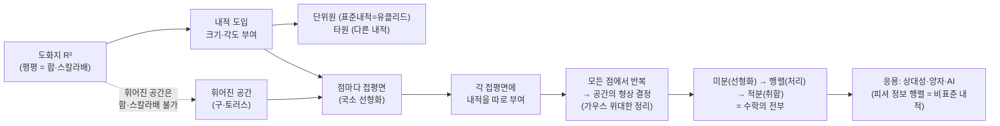

# 기하적 구조에서 내적과 미분의 역할

오늘 메인 세션은 두 부분으로 나뉩니다. 앞쪽 한 시간 정도는 여러분에게 한 분씩 개념을 묻고(군·벡터 공간·내적·무지개 정리) 미분과 적분 계산을 반복 훈련하면서, 디스커션 때 무엇을 어떤 중점으로 연습하면 좋은지를 짚습니다. 뒤쪽 25분 정도는 7·8강에서 그린 "타원 그림"을 출발점으로, 도화지(벡터 공간) → 접평면 → 미분 → 적분이 어떻게 한 줄로 이어지는지, 그리고 그것이 왜 휘어진 공간의 기하로 가는 길인지를 이야기합니다.

---

## [0. 개념 한 바퀴 — 군·벡터 공간·내적·무지개 정리 · ▶ 01:50](https://www.youtube.com/watch?v=hFZgXJj71C0&t=110s)

먼저 한 분씩 돌아가며 개념을 물었습니다.

**군과 벡터 공간의 차이.** 군은 집합에 연산 하나가 주어지고, 그 연산이 집합 안에서 닫혀 있으며 항등원·역원·결합법칙을 갖는 구조입니다. 한 참여자분이 "벡터 공간을 군으로 볼 수 있지 않느냐"고 물었는데, 정확히는 그렇지 않습니다. 벡터 합을 기준으로 보면 교환법칙까지 성립하는 좋은 군(아벨군)이지만, 스칼라배는 군의 정의와 그대로 부합하지는 않습니다. "스칼라를 실수로 두면 되지 않나"라는 질문도 나왔는데, 연산은 $G\times G\to G$ 꼴이어야 하므로 집합이 $\mathbb{R}^2$ 인 경우 그 정의에는 맞지 않습니다. 좋은 직관이지만 정의의 결을 한 번 더 다듬어야 하는 지점입니다.

여기서 강조하고 싶은 습관 하나. 어떤 개념을 배우면 **그 정의의 서술과 무관한 구체적 예시**를 단순하게 들 줄 알아야 합니다. "선형 연산을 군으로 볼 수 있나"라는 답은 예시가 아니라 기술(記述)입니다. 군은 집합이고 연산은 함수라서 둘은 같을 수 없습니다.

- **군의 예시:** 덧셈이 주어진 정수 집합, 곱셈이 주어진 $0$ 이 아닌 유리수들, 행렬식이 $0$ 이 아닌 $2\times 2$ 행렬들, 정의역·공역이 같은 일대일 대응 함수들의 모임 등.
- **벡터 공간의 예시:** 직문수의 메인 예시는 $\mathbb{R}^2$ 입니다. 벡터 합과 스칼라배가 정의된 다른 집합도 모두 벡터 공간이므로 $\mathbb{R}^3,\ \mathbb{R}^4,\ \mathbb{R}^n$ 으로 확장할 수 있고, 크기를 고정한 행렬들의 모임도 합·스칼라배가 잘 정해지므로 벡터 공간입니다.

**군 구조를 보존하는 함수의 예시.** 중요한 예가 지수 법칙에 대응하는 지수 함수, 그 역함수인 로그 함수입니다. 행렬식도 같은 성격을 가집니다 — 행렬식이 군 구조를 보존한다는 것이 어떤 센스인지 디스커션해 볼 만합니다.

**내적과 행렬의 관계.** 벡터 공간의 크기와 각도를 기술하려면 내적이 필요합니다. 내적 자체는 개념이지만, 실제로 수학으로 다루려면 환원이 필요합니다. $\mathbb{R}^2$ 의 벡터 $(1,0),(0,1)$ 을 각 슬롯에 차례로 넣어 보면 내적이 $2\times 2$ 행렬로 바뀝니다. 그래서 내적이라는 개념과 별개로, $\mathbb{R}^2$ 에서는 이를 $2\times 2$ 행렬로 환원해 행렬로 다룰 수 있게 됩니다 (→ 전사본 참조).

**내적과 직각.** $0$ 벡터가 아닌 두 벡터를 넣었을 때 내적의 결과가 $0$ 이면 그 두 벡터가 직각을 이룬다고 합니다.

**내적의 직관적 의미.** 두 벡터 $a,b$ 를 내적에 넣은 결과는 $\lVert a\rVert\,\lVert b\rVert\cos\theta$ 로 기술됩니다. 직관적으로는 한 벡터를 다른 벡터 방향으로 정사영시켜, 정사영된 길이를 곱한다는 뜻입니다. 정사영해서 곱하는 것이 내적의 의미이고, 그로 인해 크기와 각도가 정해집니다.

**무지개 정리(스펙트럴 정리)와 그 의미.** 직문수에서 말로 편하게 서술할 수 있어야 하는 정리는 딱 둘 — 무지개 정리와 미적분학의 기본정리입니다. 무지개 정리의 스테이트먼트는, 내적 행렬 $A$ 가 있을 때 고유치로 이루어진 대각행렬 $D$ 와 고유 벡터로 이루어진 행렬 $Q$ 를 써서

$$A = QDQ^{-1}$$

로 쓸 수 있다는 것입니다. 여기서 이 $Q$ 가 **회전행렬**로 주어집니다. 그러면 $Q^{-1}$ 은 축을 돌려 정렬하는 일이고, $D$ 는 그 방향으로 잡아당기는(스트레치) 일이며, $Q$ 가 원래 방향으로 되돌립니다. 즉 "축 변환 → 스트레치 → 원복"이 내적과 같다는 뜻을, 8강에서 세 가지 예시 그림으로 그려 두었습니다.

**$2\times 2$ 행렬의 고유치 구하기.** 내적을 $2\times 2$ 행렬로 표현했으면, 무지개 정리로 예쁜 형태로 바꾸기 위해 고유치를 구해야 합니다. $A\mathbf{x}=\lambda \mathbf{x}$ 를 넘겨서 $(A-\lambda I)$ 를 만들고, 그 행렬식 $\det(A-\lambda I)=0$ 을 풀면 됩니다.

---

## [1. 미분 훈련 — 외워야 할 기본 룰 · ▶ 16:08](https://www.youtube.com/watch?v=hFZgXJj71C0&t=968s)

이제 미분 쪽을 한 바퀴 돌겠습니다. 미분 훈련의 포인트는, 도함수의 정의($\lim_{h\to 0}$ …)로 매번 따지지 말고 **단순 룰로 숙달**하는 데 있습니다. 보드게임 룰처럼 먼저 외워 손에 붙인 다음, 그게 무슨 뜻인지를 알아 가는 순서입니다. "손으로 쓰면서 대조하면 할 수 있다"가 아니라, 어음 없이 바로 튀어나와야 합니다.

반드시 외워야 할 룰을 한 번 정리합니다.

- **거듭제곱(가장 중요):** $\dfrac{d}{dx}x^{\alpha}=\alpha\,x^{\alpha-1}$. 여기서 $\alpha$ 는 실수까지 담습니다. $\sqrt{x}=x^{1/2}$ 이므로 $\alpha=\tfrac12$ 을 넣어 $\dfrac{1}{2}x^{-1/2}$, $\dfrac{1}{x}=x^{-1}$ 이므로 $-x^{-2}$ 처럼 바로 나와야 합니다.
- **지수·로그(초월함수):** $\dfrac{d}{dx}e^{x}=e^{x}$ (미분해도 변하지 않음), $\dfrac{d}{dx}\ln x=\dfrac{1}{x}$. 밑을 $a$ 로 바꾸면 $\dfrac{d}{dx}a^{x}=a^{x}\ln a$ 인데, 오늘은 $e^x$ 와 $\ln x$ 까지만 잡겠습니다.
- **삼각함수:** $\dfrac{d}{dx}\sin x=\cos x$, $\dfrac{d}{dx}\cos x=-\sin x$, $\dfrac{d}{dx}\tan x=\sec^2 x$. 탄젠트도 외우기 싫더라도 외워 두십시오. 두어 번 시키다 보면 짜내서 외워지는 방식이 제일 편합니다.

> **✏️ 연습문제 (미분 사이클)** 위 기본 룰을 보드게임 룰처럼 외운 뒤, 단계별로 변형을 붙여 갑니다.
> ① 기본형: $\dfrac{d}{dx}1=0$, $\dfrac{d}{dx}\sqrt{x}$, $\dfrac{d}{dx}\ln x$, $\dfrac{d}{dx}x^{2025}=2025\,x^{2024}$, $\dfrac{d}{dx}\cos x=-\sin x$, $\dfrac{d}{dx}\tan x=\sec^2 x$, $\dfrac{d}{dx}e^{x}=e^{x}$.
> ② 스칼라배(미분은 선형이라 상수는 그대로): $\dfrac{d}{dx}3x=3$, $\dfrac{d}{dx}5\sqrt{x}$, $\dfrac{d}{dx}(-5e^{x})=-5e^{x}$, $\dfrac{d}{dx}(-\sin x)=-\cos x$.
> ③ 두 함수의 합: $\dfrac{d}{dx}(\sin x-\cos x)=\cos x+\sin x$, $\dfrac{d}{dx}(x^3+1)=3x^2$, $\dfrac{d}{dx}(e^{x}+\ln x)=e^{x}+\tfrac{1}{x}$, $\dfrac{d}{dx}(e^{x}+\tan x)=e^{x}+\sec^2 x$, $\dfrac{d}{dx}(\ln x+\cos x)=\tfrac{1}{x}-\sin x$.

---

## [2. 적분 훈련 — 미분을 역으로 · ▶ 27:41](https://www.youtube.com/watch?v=hFZgXJj71C0&t=1661s)

이번에는 같은 함수들을 적분으로, 즉 역으로 돌리겠습니다. 훈련 방식은 미분과 똑같고, 다만 방향만 반대입니다. 적분 상수 $+C$ 까지 붙여야 완성입니다.

> **✏️ 연습문제 (적분 사이클)**
> $\displaystyle\int (e^{x}+1)\,dx=e^{x}+x+C$,
> $\displaystyle\int (\cos x+\tfrac{1}{x})\,dx=\sin x+\ln x+C$,
> $\displaystyle\int (\sin x+\tfrac{1}{x})\,dx=-\cos x+\ln x+C$,
> $\displaystyle\int (\sin x+5)\,dx=-\cos x+5x+C$,
> $\displaystyle\int (\cos x+2x)\,dx=\sin x+x^2+C$,
> $\displaystyle\int (\cos x+\sin x)\,dx=\sin x-\cos x+C$,
> $\displaystyle\int (\sin x+\sec^2 x)\,dx=-\cos x+\tan x+C$.
> 마지막으로 한 분께 $\displaystyle\int (x^{2026}+\tfrac{1}{x})\,dx=\tfrac{1}{2027}x^{2027}+\ln x+C$ 를 드렸습니다. 일부러 분모를 날리고 싶게 만든 "함정 카드"인데, 속지 않고 잘 다루셨습니다.

한 가지 짚어 둘 것. $\int \ln x\,dx$ 가 $\tfrac{1}{x}+C$ 라고 답한 분이 있었는데, 정답은 $x\ln x-x+C$ 입니다. 우리는 $\ln x$ 의 미분만 다뤘으니, 적분 가능한 함수 중에서 원함수가 남아 있는 곱함수 꼴로 접근하면 됩니다.

> **💭 생각해볼 점** 미적분의 룰은 사실 이게 전부입니다. 여기에 미분 쪽 두 룰(**체인 룰**과 **곱의 미분**), 적분 쪽 두 룰(**부분 적분**과 **치환 적분**)만 더하면 됩니다. 굉장히 단순하죠. 의미를 새기는 일은 온갖 수학을 공부하며 계속 해야 하지만, **먼저 숙달시켜 계산이 쓱쓱 되는 결**을 만들어 두면 직문수 내내, 그리고 이후로도 두고두고 유익이 됩니다. 다 변수로 가면 이 훈련은 행렬 연습과 호환되므로, 선형대수 훈련도 소홀히 하지 마시기 바랍니다. 8강의 고유치·고유벡터를 계산 레벨에서 편하게 다룰 수 있어야 합니다.

---

## [3. R²라는 도화지 — 벡터 공간을 그림으로 · ▶ 35:32](https://www.youtube.com/watch?v=hFZgXJj71C0&t=2132s)

여기서부터는 강의가 아니라, 여러분이 어떤 그림을 머릿속에 가져야 하는지를 보여 드리는 시간입니다. 8강에서 그린 그림들을 전제로 합니다.

직문수에서 벡터 공간이라는 단어는 가능하면 전부 $\mathbb{R}^2$ 로 치환해서 공부하시기를 강하게 권합니다. 이유는 둘입니다. 첫째, 심상을 그리기가 가장 편합니다 — $\mathbb{R}^3$ 만 가도 축 셋을 다 생각해야 해서 골치 아프고, $\mathbb{R}^1$ 은 너무 단순합니다. 둘째, 대상을 구체적으로 다룰 때 기껏해야 $2\times 2$ 행렬로 다룰 수 있습니다. $\mathbb{R}^3$ 이면 내적만 해도 $3\times 3$ 으로 정보량이 늘어 계산이 귀찮아지지만, $2\times 2$ 정도면 그 부담이 없습니다.

그림: 무한히 펼쳐진 도화지 위에 원점 $\mathbf{0}$ 을 찍고, 화살표들(벡터)이 놓여 있습니다. 이 $\mathbf{0}$ 은 숫자 $0$ 이 아니라 영벡터 $\mathbf{0}$ 입니다. 벡터를 화살표로 보든, 끝점의 좌표 $(a,b)$ 로 보든 여러분 마음이지만, $\mathbb{R}^2$ 는 어쨌든 순서쌍 $(x,y)$ 들의 모임이고, 그걸 시각화하고 있을 뿐입니다.

이 도화지 위에서:

- **벡터 합** $V+W$ 는 두 벡터로 평행사변형을 만들고 그 대각선을 취하는 것.
- **스칼라배**는 각 벡터를 스트레치(늘이거나 줄이거나)하는 것.

> **💭 생각해볼 점** 이 윗 그림에는 **크기와 각도가 없습니다.** $\mathbb{R}^2$ 라는 것만으로는 크기·각도 개념이 존재하지 않습니다. 여러분이 화살표를 보며 무심코 "이게 크기, 이게 각도"라고 떠올리는 건, 이미 표준내적(점곱)을 머릿속에서 쓰고 있기 때문입니다. 7·8강에 걸쳐 여러분이 디스커션해야 할 지점이 바로 여기입니다.

---

## [4. 내적을 도입하면 — 단위원이 타원이 된다 · ▶ 39:31](https://www.youtube.com/watch?v=hFZgXJj71C0&t=2371s)

크기와 각도를 부여하기 위해 도입하는 것이 **내적**입니다. 내적을 도입하는 순간 각 벡터의 크기가 정해지고, 그 크기가 무엇으로 정해지는지가 내적에 의존합니다. 내적 역시 $2\times 2$ 행렬로 구체화됩니다.

그림으로 보면 이렇습니다. $(1,0)$ 과 $(0,1)$ 의 크기가 각각 $1$ 이고 서로 수직이면 **단위원**이 그려집니다(표준내적, 유클리드 평면). 그런데 다른 내적을 주어 두 벡터의 크기가 예컨대 $\sqrt{2}$, $\sqrt{3}$ 이 되면 **타원**이 그려지고, $(1,0)$ 과 $(0,1)$ 이 수직이 아니게 되면 기울어진 타원이 됩니다. 8강에서 고유치·고유벡터로 이 그림들을 그려 두었습니다.

*그림: 표준내적($M=I$)이면 단위원, 축 길이만 다른 내적이면 축 정렬된 타원, 두 기준 벡터가 수직이 아니면 기울어진 타원.*

이 타원을 "그렇구나" 하고 관념적으로 받아들여도 따라오는 데는 지장이 없습니다. 다만 여러분이 직문수를 수학적 문해력을 위해 배우는 거라면, 이 타원이 정말로 어떤 센스인지를 디스커션에서 파고드시기를 권합니다.

> **📚 참고·응용** 비유로 — 엑셀을 떠올려 보세요. 우리가 보는 이 그림은 **엑셀 셀이 딱 네 칸($2\times 2$)으로 단순화된 상황**으로 보셔도 괜찮습니다. 평소엔 엑셀을 한참 펼쳐 쓰지만, 여기선 가장 작은 단위로 줄여 놓고 노는 셈입니다.

---

## [5. 평평한 도화지 vs 휘어진 공간 — 두 연산이 정의된다는 것 · ▶ 42:40](https://www.youtube.com/watch?v=hFZgXJj71C0&t=2560s)

윗 그림(크기·각도 없음)과 아랫 그림(타원, 크기·각도 있음)의 차이를 한 단계 더 들어가 봅니다.

벡터 공간이란 **벡터 합과 스칼라배 두 연산이 정의된 집합**입니다. 두 벡터를 더해 대각선이 나오고, 스트레치를 무한정 할 수 있다는 것. 이 말은 곧, 여러분이 생각하는 집합이 **완전히 평평(flat)해야** 한다는 뜻입니다. 그래야 쭉쭉 펼쳐 나가거나 줄여 나갈 수 있습니다.

이와 대조되는 것이 구(球)처럼 휘어진 공간입니다. 구의 껍데기를 집합으로 본다면, 그 위에서는 벡터 합과 스칼라배가 정의될 수 없다는 것을 직관 레벨에서 수긍할 수 있습니다.

> **💭 생각해볼 점** 그러면 우리는 왜 이 평평한 도화지를 그렇게 좋아하느냐? **도화지가 있어야 다루려는 개념들을 전부 행렬로 떨어뜨릴 수 있기 때문**입니다. 우리가 하는 건 철학이 아니라 수학이라, 숫자·행렬 노름으로 떨어뜨리는 방법이 있어야 합니다. 함수 중에서 우리가 정말로 다룰 수 있는 건 선형 함수뿐이고(행렬로 표현되니까), 나머지는 관념적입니다. 그런데 대부분의 함수·대부분의 공간은 선형도, 벡터 공간도 아닙니다. 그래서 인간의 욕망은 "선형이 아닌 대상을, 내가 아는 선형(행렬)으로 어떻게 환원할까"가 됩니다. 오늘 그림이 보여 주려는 것이 바로 그 환원을 구현하는 방법입니다.

연산이 둘 다 정의된 집합은 매우 특수합니다. 군만 해도 연산이 하나뿐인데도 할 얘기가 많습니다. 벡터 합과 스칼라배가 둘 다 정의된 집합은 아주 특별한 경우라, 일반적으로는 기대할 수 없습니다.

---

## [6. 접평면과 선형화 — 점마다 도화지를 만든다 · ▶ 46:46](https://www.youtube.com/watch?v=hFZgXJj71C0&t=2806s)

휘어진 공간을 어떻게 다룰까. 2차원 구 같은 "평평하지 않은 공간"을 예로 봅니다(제가 좋아하는 토러스는 후반부에 나옵니다).

구 위에 점을 찍고, 그 점에서 화살표(벡터)를 생각해 봅니다. 그런데 이 화살표는 구 위의 원소일 수가 없습니다. 화살표의 시작점은 구 위에 있지만, 화살표 자체는 구 위에 살지 않고 구와 한 점에서만 만납니다. 그러니 "이 화살표가 수학적으로 무엇인가"를 규정해 줘야 합니다.

규정하는 방법: 우리가 아는 것은 평평한 도화지밖에 없으니, **구 위의 그 점을 원점으로 갖는 도화지($\mathbb{R}^2$)를 새로 만들고**, 화살표를 그 도화지 위의 원소라고 합니다. 이것을 기하 용어로 **접평면**이라 부르고, 기하 용어를 안 쓰면 **선형화(linearization)** 라고도 많이 부릅니다.

여기서 중요한 전환이 일어납니다. 이제 도화지는 **한 개가 아닙니다.** 구 위의 점 개수만큼, 즉 각 점마다 그 점을 원점으로 갖는 $\mathbb{R}^2$ 를 다 만들어야 합니다. 한 점의 접평면 정보와 다른 점의 접평면 정보는 서로 별개입니다.

그리고 그 각각의 접평면은 모두 도화지 하나에서 세운 논리(벡터 합·스칼라배, 그리고 내적으로 부여한 크기·각도)를 그대로 따릅니다. 따라서 **각 접평면마다 내적을 따로 주고**, 그 접평면에서 8강의 무지개 정리를 다 써서 타원 그림을 다 만들면, 우리는 모든 도화지(접평면)를 다 아는 셈이 됩니다.

> **💭 생각해볼 점 (한 참여자분의 질문 — 유클리드 평면 vs 도화지)** "항등행렬을 유클리드 평면으로 알고 있는데, 도화지·평면 얘기를 쭉 들으니 항상 항등행렬을 전제하는 것처럼 들립니다. 그런데 내적을 정한다는 건 평면이 아닌 것도 가정하는 얘기 아닌가요?" — 단어를 세 층위로 나눠 보겠습니다. ① **도화지(평면)**: 내적과 무관하게 부르는 말이고, 집합으로서는 $\mathbb{R}^2$ 와 똑같습니다. ② **유클리드 평면**: 도화지에 **내적을 항등행렬(표준내적)로 준** 경우에 한정합니다 — 단위원이 그려지는 경우죠. 타원이 그려지는 경우도 여전히 평면이지만, 유클리드 평면은 아닙니다. ③ 세 번째로, 이 도화지(접평면)들의 내적을 가지고 **원래 휘어진 공간을 복원**하는 경우. 앞으로 항등행렬을 강조할 때는 "유클리드 평면"이라는 단어를 정확히 쓰겠습니다.

> **💭 생각해볼 점 (한 참여자분의 질문 — 2차원 구는 R²에 못 넣지 않나?)** 맞습니다. 2차원 구는 $\mathbb{R}^2$ 로 기술할 수 없고, $\mathbb{R}^3$ 안에서 $x^2+y^2+z^2=1$ 인 점들의 모임으로 기술됩니다. "그런데 왜 3차원이 아니라 2차원이라 부르나?"는 좋은 물음인데, 직관적으로는 구를 **국소적으로** 보면 $\mathbb{R}^2$ 의 한 조각처럼 생겼기 때문에 그 $2$ 를 차원이라 부릅니다. 이를 정확히 하려면 매니폴드의 차원, 그 전에 위상공간까지 다뤄야 합니다. 직문수에서는 "2차원 구는 $\mathbb{R}^3$ 안의 그 모임을 가리키는 고유명사"로 받아들이시면 됩니다.

---

## [7. 미분 = 국소적 선형화 → 공간의 형상을 결정한다 · ▶ 51:51](https://www.youtube.com/watch?v=hFZgXJj71C0&t=3111s)

이제 미분이 무슨 뜻인지를 다시 생각해 봅시다. $y=f(x)$ 에서 미분계수가 기울기라는 것, 그 점에서 접선을 긋는다는 것을 여러분은 압니다. 일반적인 함수는 직선이 아니라 곡선인데(직선은 $ax+b$ 뿐), 그 점에서 접선을 긋는다는 건 곧 "그 점 아주 근처에서는 직선처럼 봐도 되지 않느냐"라고 우기는 일입니다. 실제로는 휘어 있지만, 핸드폰으로 지도를 아주 확대하면 짧은 구간이 선분처럼 보이는 것처럼, 아주 작게 보면 선분으로 퉁쳐도 된다는 것 — 이것이 미분계수의 의미입니다.

이걸 구 위로 옮겨 보면: 구 위 한 점의 아주 근처는, 그 점의 접평면에서 벡터들의 관계를 이야기하는 것과 대충 같다고 우길 수 있습니다.

그런데 우리는 이것을 **모든 점에서** 합니다. 모든 점의 접평면에 내적을 준 순간, 사실 우리는 **그 전체 집합(공간)의 형상 자체를 결정**한 것과 같습니다. 각 점 근처는 그 접평면의 내적으로 결정되고, 그것을 모든 점에서 반복했기 때문입니다. **이것이 기하입니다.** 8강에서 말했듯 지오메트리(geometry)는 "how(어떻게 생겼는가)"의 뜻이고, 도화지가 아닌 공간은 각 접평면의 내적이 주어지는 순간 형상이 정해집니다. 미분기하학을 공부한다는 건, 결국 접평면의 내적을 무엇으로 주느냐에 지나지 않습니다.

> **💭 생각해볼 점 (가우스의 "위대한" 정리)** 모든 접평면에서 내적을 알면, 사실은 이미 지구가 어떻게 생겼는지를 아는 셈입니다 — **위성 사진을 보지 않고도** 말이죠. 지구 밖으로 나가지 않고 두 발로 지구를 다 걸으며 각 점의 접평면 내적만 재면, 지구가 이렇게 생길 수밖에 없다는 것을 알 수 있다는 것. 이 생각을 후반부에서 "가우스의 위대한 정리"라고 부르게 됩니다. (개인적으로 "위대한"이라는 단어는 좀 과한 표현이라 그리 좋아하진 않지만, 그만큼 한 번쯤 곱씹어 볼 만한 발상인 건 분명합니다.)

> **📚 참고·응용 (한 참여자분의 질문 — 미분에는 함수가 꼭 필요한가?)** 미분·적분은 항상 대상이 되는 함수가 주어졌는데, 렉처 노트는 함수가 아니라 공간을 다루는 것처럼 보인다는 좋은 지적이 나왔습니다. 미분을 수행하는 행위 자체는 함수에 대해 하는 것이 맞습니다. "공간을 미분한다"는 말은, 그 공간을 미분이 타당한 방식으로 **함수로 바꾸는 방법이 있다**는 의미입니다. 예컨대 2차원 구도 $z=f(x,y)$ 같은 함수의 그래프로 바꿔서 거기서 미분을 수행합니다.

> **📚 참고·응용 (한 참여자분의 정리 — 조각내고 합치기)** "모양을 모르는 공간이 있는데, 각 점에서 조각조각 접평면을 내고 그걸 다 합쳐 보니 토러스가 되기도 하고 컵이 되기도 한다 — 조각조각 내는 게 미분, 취합하는 게 적분"이라는 정리가 나왔는데, 정확히 맞습니다. 위성 사진을 못 봤다면 지구의 형상을 어떻게 알겠느냐는 질문에 대한 답이 바로 이것입니다.

---

## [8. 미분·행렬·적분이 수학의 전부 — 응용으로 가는 길 · ▶ 55:58](https://www.youtube.com/watch?v=hFZgXJj71C0&t=3358s)

오늘 이야기를 한 줄로 모으면 이렇습니다. 우리가 아는 것은 무한히 펼쳐진 도화지에서 선형 함수와 내적을 행렬로 표현해 다루는 것뿐이고, 실제 계산은 정확히 그것밖에 못 합니다. 그래서 일반적인(도화지가 아닌) 공간이 주어지면:

- **미분**으로 도화지(선형화된 대상)를 만들고,
- **선형대수(행렬)** 로 그 선형화된 대상을 다루고,
- **적분**으로 그 다뤄진 대상들을 다시 원래 방식대로 취합합니다.

그래서 수학은 **미분과 행렬과 적분이 전부**입니다. 분야를 막론하고 이게 전부이고, 이게 아니면 수학이 아닙니다. 수학은 계산 노름으로 떨어뜨려야 하고, 그 계산에 필요한 연역적 세계를 세운 것이 전부이기 때문입니다.

> **💭 생각해볼 점** 토픽 위주로 공부하면 끝이 없고, 여러분의 후세대도 새로운 수학 이론을 계속 만들 겁니다. 하지만 유한한 예시·유한한 계산 — 여러분이 지금 보는 이 계산($\mathbb{R}^2$, 미분·적분·행렬) — 은 손주 세대로 가더라도 바뀌지 않습니다. 해석과 이론은 바뀌어도, 계산 노름은 바뀌지 않습니다.

> **📚 참고·응용** 왜 7·8강에서 그 타원 그리기를 그토록 강조하느냐 — 도화지가 아닌 공간에 대해서도 여전히 접평면마다 타원을 그려 공간의 모든 정보를 알고자 하기 때문입니다. 이 발상은 응용 곳곳에 닿아 있습니다. 휘어진 시공간의 기하에서 **상대성 이론**이 나왔고(시공간 자체가 도화지가 아니다), 미시세계의 양자역학적 관점, 그리고 오늘날 **AI**의 통계적 모델들도 마찬가지입니다. AI 모델들의 기하는 기본적으로 표준내적(항등행렬)을 따르지 않으며, 이를 보정한다는 것은 결국 접평면 레벨에서 내적을 표준내적이 아닌 다른 것으로 준다는 뜻입니다. 제프리 힌튼의 논문에 나오는, 직문수 맨 마지막에 다루는 **피셔 정보 행렬(Fisher information matrix)** — 항등행렬이 아닌 내적 — 이 그 대표적인 예입니다. 수학적으로는 모든 내적을 다 줄 수 있지만, 그중 어떤 것을 골라야 응용에서 개선을 꾀할 수 있느냐가 응용수학의 질문입니다.

> **📚 참고·응용 (한 참여자분의 질문 — 접평면의 벡터를 어떻게 특정하나?)** 접평면을 만들 때 우리가 건 조건은 원점 위치 하나뿐인데, 구체적 벡터를 특정하려면 원래 공간과 접평면이 일관된 축을 공유해야 하지 않느냐는 질문이 나왔습니다. 여기엔 두 관점이 꼬여 있습니다. 우리는 접평면에서 **특정 벡터를 잡는 행위**를 하는 게 아닙니다. 공간이 있고 그 점의 접평면이 있으면, 그 접평면에 내적을 주는 순간 모든 것이 정해진다고 했지, 특정 벡터를 고르는 게 아닙니다. 실측하는 입장의 관점과 수학적 대상 사이의 관점이 섞이면 그런 혼동이 생깁니다. 이런 류의 혼동(특히 "for some"과 "for all" 한정사를 어디에 두는지)을 풀려면 **증명 기초** 훈련이 도움이 됩니다.

---

## 요약

오늘 후반부의 큰 줄거리를 한눈에 — 평평한 도화지에서 세운 논리가 어떻게 휘어진 공간의 기하로 이어지는지:

- 앞부분은 개념 점검과 계산 훈련입니다. 군은 연산 하나, 벡터 공간은 합·스칼라배 두 연산이 정의된 구조이고, 개념은 항상 **정의와 무관한 구체적 예시**로 들 줄 알아야 합니다.
- 내적은 두 벡터를 받아 실수를 내놓는 함수로, $\langle a,b\rangle=\lVert a\rVert\lVert b\rVert\cos\theta$ (정사영해서 곱하기)이며, 이로부터 크기·각도·직교($\langle u,v\rangle=0$)가 따라옵니다. $\mathbb{R}^2$ 에서는 $2\times 2$ 행렬로 환원됩니다.
- 무지개 정리: 내적 행렬 $A=QDQ^{-1}$, 여기서 $Q$ 는 회전행렬 → "축 정렬 → 스트레치 → 원복".
- 미분·적분은 정의로 따지지 말고 기본 룰을 보드게임 룰처럼 외워 숙달합니다: $\tfrac{d}{dx}x^{\alpha}=\alpha x^{\alpha-1}$, $e^x\to e^x$, $\ln x\to \tfrac1x$, $\sin\to\cos$, $\cos\to-\sin$, $\tan\to\sec^2$. 기본형 → 스칼라배 → 합 → (체인·곱의 미분 / 부분·치환 적분) 순으로 쌓습니다.
- $\mathbb{R}^2$ 만으로는 크기·각도가 없습니다. 내적을 주면 단위원(표준내적=유클리드 평면) 또는 타원(다른 내적)이 그려집니다.
- 벡터 합·스칼라배가 정의되려면 공간이 평평해야 합니다. 휘어진 공간은 각 점에 **접평면(선형화)** 을 세우고 점마다 내적을 따로 줍니다.
- 미분은 곡선을 점 근처에서 직선(접평면)으로 보는 국소 선형화이고, 이를 모든 점에서 하면 공간의 형상이 결정됩니다(가우스의 위대한 정리, 미분기하). 미분으로 선형화 → 행렬로 처리 → 적분으로 취합 — 이 셋이 수학의 전부입니다.
- 응용: 상대성 이론, 양자역학, AI(표준내적이 아닌 피셔 정보 행렬)가 모두 "접평면의 내적을 무엇으로 주느냐"의 문제로 이어집니다.
