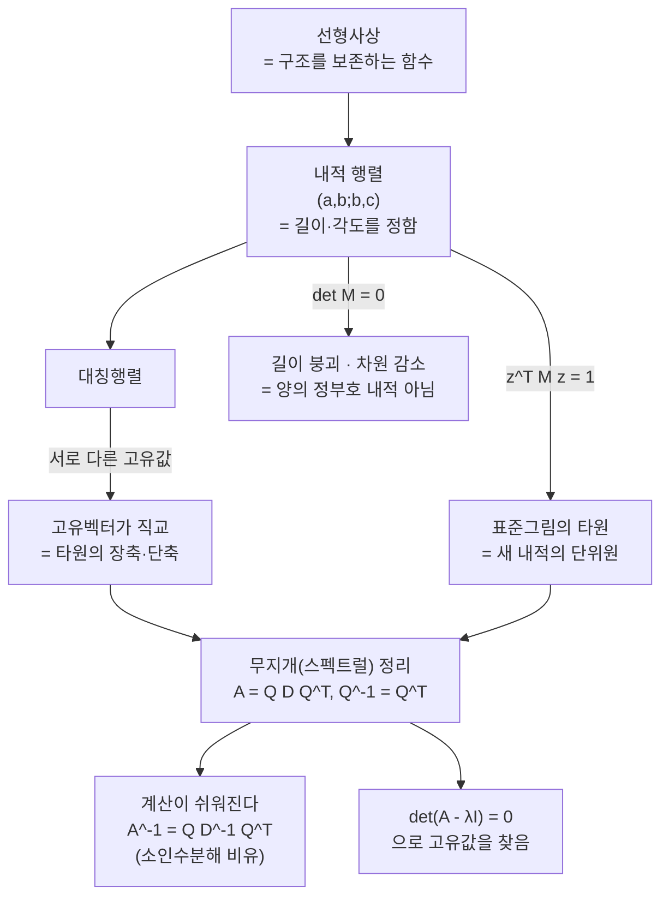

# 선형대수학 — 무지개 정리에 대한 디스커션 (뉴진수 3강)

이번 시간은 무지개 정리, 즉 실대칭행렬의 직교대각화를 여러분이 올려 준 질문을 따라 다시 읽습니다. 선형사상이 무엇을 보존하는지에서 출발해, 내적 행렬이 왜 원을 타원처럼 보이게 하는지, $QDQ^{-1}$가 왜 계산을 쉽게 만드는지, 그리고 내적 행렬의 행렬식이 $0$이면 무엇이 무너지는지까지 이어집니다.

---

## [0. 선형사상은 구조를 보존하는 함수입니다 · ▶ 15:56](https://www.youtube.com/watch?v=pk5mqdVYwG0&t=956s)

먼저 한 분이 군론을 따로 공부하다가 선형대수로 와서 선형사상이 "연산을 보존하는 함수"로 보이기 시작했다고 말합니다. 그 표현을 함께 풀어 봅시다.

사상은 결국 집합과 집합 사이의 규칙입니다. 어떤 집합 $X$와 $Y$가 있고, 함수 $f:X\to Y$가 $X$의 각 원소를 $Y$의 원소에 대응시키는 규칙입니다.

여기서 $X$와 $Y$가 둘 다 덧셈 같은 연산 구조를 갖고 있고, $f$가 그 구조를 보존하면 선형사상입니다. 벡터공간에서는 구체적으로

$$
f(x_1+x_2)=f(x_1)+f(x_2)
$$

이고

$$
f(\lambda x)=\lambda f(x)
$$

입니다. 즉 덧셈과 스칼라곱이 함수 밖으로 잘 빠져나옵니다 (단원 전사본의 선형함수 정의도 같은 두 조건을 말합니다 → [전사본](08.%20Linear%20Algebra%20Part%204%20-%20The%20Spectral%20(Rainbow)%20Theorem.md)).

이 관점에서 선형사상은 단순히 화살표를 돌리거나 늘리는 그림이 아니라, 벡터공간의 연산 구조를 보존하는 함수입니다. 행렬은 그런 함수를 좌표로 기록한 표입니다.

> **💭 생각해볼 점** $X$에서 벌어지는 덧셈과, $f$로 옮긴 $Y$에서의 덧셈이 똑같이 성립한다는 것은 무슨 쓸모가 있을까요? $Y$가 상상하기 어려운 공간이라도, 덧셈·스칼라곱이 보존되면 $X$에서 벌어지는 일로 $Y$를 유추할 수 있습니다. 구조를 보존하는 함수를 찾는 까닭이 여기에 있습니다.

---

## [1. 군을 먼저 본 이유 · ▶ 23:20](https://www.youtube.com/watch?v=pk5mqdVYwG0&t=1400s)

여러분 중 한 분이, 군을 먼저 보고 나서 선형대수로 오니 이제야 그 순서가 조금 보인다고 말합니다.

군에서는 연산, 항등원, 역원, 그리고 구조 보존을 보았습니다. 그 후 선형대수로 오면 선형사상이 벡터공간의 구조를 보존하는 함수로 보입니다. 행렬곱은 선형사상의 합성을 기록하고, 역행렬은 역함수를 갖는 선형사상에 대응합니다.

이렇게 보면 선형대수는 숫자 계산의 기술이 아니라, 구조를 보존하는 함수들의 계산입니다. 무지개 정리는 그중에서도 대칭행렬이라는 특별한 함수가 어떤 좋은 좌표에서 아주 단순하게 보인다는 정리입니다.

---

## [2. 내적 행렬의 항목은 기저벡터의 길이와 각도입니다 · ▶ 25:49](https://www.youtube.com/watch?v=pk5mqdVYwG0&t=1549s)

다음 질문은 내적 행렬

$$
M=\begin{pmatrix}a&b\\b&c\end{pmatrix}
$$

이 무엇을 말하느냐입니다. 한 분이, 행렬이 다중선형성으로 이렇게 나오는 것은 납득이 되는데, 여기서 "$(1,0)$과 $(0,1)$이 우리가 아는 그 벡터가 아니다"라는 말과 어떻게 연결되는지 잘 와닿지 않는다고 합니다.

표준기저를 $e_1=(1,0)$, $e_2=(0,1)$이라고 하면

$$
a=\langle e_1,e_1\rangle,\qquad
b=\langle e_1,e_2\rangle,\qquad
c=\langle e_2,e_2\rangle
$$

입니다. 따라서 $a$와 $c$는 두 기본벡터의 길이 제곱이고, $b$는 두 기본벡터가 얼마나 직교에서 벗어나 있는지를 나타냅니다.

$b=0$이면 두 기본벡터는 그 내적에서 직교합니다. $b\ne0$이면 표준 좌표축으로는 직각처럼 그려도, 새 내적에서는 직교하지 않습니다. 그래서 같은 좌표 $(1,0),(0,1)$이라도 길이와 각도를 재는 방식이 달라진 것입니다. 좌표 숫자는 그대로지만, 그 벡터가 들고 있는 길이와 사잇각이 내적에 따라 달라집니다.

> **💭 생각해볼 점** "$(1,0),(0,1)$이 우리가 아는 그 벡터다"라는 선입견에는 무엇이 이미 들어가 있을까요? 우리는 둘이 수직이고 길이가 각각 $1$이라고 미리 가정하고 있었습니다. 대각성분 $a,c$를 $1$로 둔다는 말이 곧 두 기본벡터의 길이를 $1$로 정한다는 말이고, $b$를 $0$으로 둔다는 말이 둘을 직교로 정한다는 말입니다. 비대각성분을 바꾸면 그 직교 관계가 깨집니다.

---

## [3. 타원은 새 내적에서 원일 수 있습니다 · ▶ 32:26](https://www.youtube.com/watch?v=pk5mqdVYwG0&t=1946s)

여러분이 슬랙에 올려 준 질문 하나를 같이 읽습니다. "내적을 바꿔 축이 변한 공간에서, 표준그림의 타원은 그 공간에 사는 사람에게 원일까요?"

원은 한 점에서 같은 거리에 있는 점들의 모임입니다. 거리를 표준내적으로 재면

$$
x^2+y^2=1
$$

이 원입니다. 하지만 내적이 $M$으로 주어지면 단위원은

$$
\langle z,z\rangle_M=z^T M z=1
$$

입니다. 이 식은 표준 좌표그림에서 타원처럼 보일 수 있습니다. 그렇지만 $M$으로 길이를 재는 세계에서는 여전히 중심에서 거리가 $1$인 점들의 집합입니다.

여기서 한 분이 좋은 비유를 듭니다. $1$차원에서 "$\times 2$"라는 사상을 주면 $1,2,3,\dots$이 $2,4,6,\dots$으로 옮겨가는데, 옮겨간 세계에 사는 사람에게는 $2,4,6$이 곧 $1,2,3$입니다. 같은 방식으로, 내적을 바꿔 단위가 달라진 세계에 사는 사람에게는 우리 눈의 타원이 원으로 보일 수 있습니다.

다만 이 비유를 $2$차원으로 그대로 끌고 와도 되는지는 그 자리에서 단정하지 않았습니다. 점들의 집합 자체는 변한 것이 아니라 내적, 즉 길이와 각도를 재는 방식이 변한 것입니다.

> **💭 생각해볼 점** 원의 정의(한 점에서 같은 거리)는 어느 내적에서도 그대로 쓸 수 있으니, 새 내적의 단위로 보면 그 타원도 "원"이라고 부를 수 있을 것 같습니다. 그렇다면 좌표 숫자, 크기, 거리는 같은 것일까요 다른 것일까요? 한 분의 표현처럼, 벡터가 들고 있는 좌표 숫자와, 그 벡터가 중심에서 떨어진 거리는 분리해서 생각해야 합니다. 거리는 어떤 내적으로 재느냐에 따라 달라집니다.

---

## [4. 대칭행렬의 고유벡터는 서로 직교합니다 · ▶ 35:47](https://www.youtube.com/watch?v=pk5mqdVYwG0&t=2147s)

올려 준 질문 1번은 "대칭행렬의 고유벡터는 항상 직교한다"입니다. 내적 행렬은 대칭행렬이고, 실대칭행렬에서는 서로 다른 고유값에 대응하는 고유벡터들이 직교합니다. 이것은 내적으로 어렵지 않게 보일 수 있습니다.

행렬 $A$가 대칭이고

$$
Av=\lambda v,\qquad Aw=\mu w
$$

이며 $\lambda\ne\mu$라고 합시다. 대칭성에서

$$
\langle Av,w\rangle=\langle v,Aw\rangle
$$

입니다. 왼쪽은 $\lambda\langle v,w\rangle$이고, 오른쪽은 $\mu\langle v,w\rangle$입니다. 따라서

$$
(\lambda-\mu)\langle v,w\rangle=0
$$

이고, $\lambda\ne\mu$이므로

$$
\langle v,w\rangle=0
$$

입니다. 대칭행렬을 고유벡터 축으로 보면 서로 섞이지 않는 직교방향들이 나옵니다. 이것이 무지개 정리의 뼈대이고, 여기서 그 직교 고유벡터들이 타원의 장축·단축에 대응합니다.

아래는 8절에서 손으로 계산한 $A=\begin{pmatrix}3&1\\1&3\end{pmatrix}$의 경우입니다. 두 고유벡터 $q_1,q_2$가 서로 직교하고, 그 방향이 곧 단위원 $z^TAz=1$(표준 좌표에서는 타원으로 보임)의 장축·단축이 됩니다. 고유값이 클수록($\lambda=4$) 그 방향의 반지름이 짧고($1/\sqrt\lambda$), 작을수록($\lambda=2$) 깁니다.

![대칭행렬 [[3,1],[1,3]]의 직교 고유벡터가 단위원 z^T A z=1의 장축·단축이 되는 그림](<03-season-assets/03/svg/symmetric-eigenaxes-03-season-03-04.svg>)

---

## [5. QDQ^{-1}은 왜 회전·스케일·되돌리기로 보이는가 · ▶ 47:23](https://www.youtube.com/watch?v=pk5mqdVYwG0&t=2843s)

물리를 전공한 한 분이, 물리에서 $QDQ^{-1}$ 꼴을 늘 보지만 왜 굳이 이렇게 분해하는지, 또 회전한 뒤 늘리고 다시 거꾸로 회전하는 그 순서가 늘 거슬렸다고 말합니다. 함께 풀어 봅시다.

대각행렬 $D$는 이해하기 쉽습니다. 각 좌표축 방향으로 따로따로 늘리거나 줄입니다. 문제는 원래 행렬 $A$가 표준기저에서는 그렇게 단순하지 않다는 점입니다.

그래서 먼저 $Q^{-1}$로 좋은 좌표축으로 바꾸고, 그 좌표에서 $D$가 축별로 스케일을 바꾼 뒤, 다시 $Q$로 원래 좌표로 돌아옵니다. 식으로는

$$
A=QDQ^{-1}
$$

입니다. 대칭행렬에서는 고유벡터들을 정규직교기저로 잡을 수 있으므로 $Q^{-1}=Q^T$이고, 그래서 실제로는

$$
A=QDQ^T
$$

처럼 읽을 수 있습니다.

> **💭 생각해볼 점** "회전 → 축방향 스케일 → 다시 회전"은 같은 일을 두 번 하는 낭비처럼 보이지 않을까요? 한 분의 정리처럼, 표준기저에서 직접 다루기 어려운 변환을 "좋은 좌표축에서의 단순한 축별 스케일"로 바꿔 읽기 위해 좌표를 한 번 옮겼다가 되돌리는 것입니다. 두 번의 회전은 손해가 아니라, 가운데 계산을 가장 단순하게 만들기 위한 값입니다.

---

## [6. 대각화는 행렬의 소인수분해처럼 계산을 쉽게 합니다 · ▶ 56:13](https://www.youtube.com/watch?v=pk5mqdVYwG0&t=3373s)

또 다른 분이 대각화를 소인수분해에 비유합니다. 큰 수를 바로 다루기는 어렵지만 소인수로 나누면 계산이 쉬워지듯이, 행렬도 좋은 조각으로 분해하면 계산이 쉬워집니다.

예를 들어 선형시스템

$$
A x=b
$$

을 풀어야 한다고 합시다. $A$가 큰 행렬이면 $A^{-1}$을 직접 구하기 어렵습니다. 하지만

$$
A=QDQ^T
$$

이면

$$
A^{-1}=Q D^{-1} Q^T
$$

입니다. 대각행렬 $D$의 역행렬은 대각성분의 역수를 취하면 되고, 직교행렬 $Q$의 역행렬은 전치행렬 $Q^T$입니다. 그래서 $x=A^{-1}b=QD^{-1}Q^Tb$가 손쉽게 계산됩니다.

그래서 대각화는 행렬을 이해하기 쉬운 좌표계로 옮겨 계산을 단순화하는 도구입니다.

> **📚 참고·응용** 한 분이 응용에서는 일반적으로 분해(디컴포지션)가 직접 역행렬을 구하는 것보다 계산이 빠르다고 덧붙입니다. 고유값 자체도 널리 쓰여서, 예를 들어 그래프를 두 조각으로 가르는 그래프 분할에서 두 번째로 큰 고유값을 이용합니다. 다만 대상이 대칭이 아닌 경우가 많아 실제 수치계산에서는 $QR$ 분해 같은 다른 분해도 자주 쓴다는 이야기도 나옵니다.

---

## [7. Q의 역행렬은 Q가 아니라 Q^T입니다 · ▶ 59:28](https://www.youtube.com/watch?v=pk5mqdVYwG0&t=3568s)

중간에 작은 혼동이 바로잡힙니다. 한 분이 처음에 $Q^{-1}=Q$로 적었다가, 실제로는 $Q^{-1}=Q^T$라고 정정합니다.

대칭행렬의 고유벡터를 정규화해서 열벡터로 세우면 행렬 $Q$가 됩니다. 이때 $Q$의 열벡터들은 서로 직교하고 길이가 $1$입니다. 따라서

$$
Q^TQ=I
$$

이고, 이 말은

$$
Q^{-1}=Q^T
$$

라는 뜻입니다. 일반적으로 $Q^{-1}=Q$는 아닙니다. 대칭행렬을 대각화할 때 쓰는 정확한 식은

$$
Q^T A Q=D \qquad\text{또는}\qquad A=QDQ^T
$$

입니다.

---

## [8. 직접 계산 — [[3,1],[1,3]]의 고유값과 정규직교기저 · ▶ 1:08:53](https://www.youtube.com/watch?v=pk5mqdVYwG0&t=4133s)

"$Q^TQ=I$가 성립한다는 정리가 따로 있느냐"는 질문이 나와서, 손으로 직접 계산해 봅니다. 가장 쉬운 대칭행렬

$$
A=\begin{pmatrix}3&1\\1&3\end{pmatrix}
$$

을 잡습니다. 특성방정식은

$$
\det(A-\lambda I)=
(3-\lambda)^2-1=0
$$

이므로

$$
\lambda=4,\qquad \lambda=2
$$

입니다. $\lambda=4$의 고유벡터 방향은 $(1,1)$, $\lambda=2$의 고유벡터 방향은 $(-1,1)$입니다. 정규화하면

$$
q_1=\frac1{\sqrt2}(1,1),\qquad
q_2=\frac1{\sqrt2}(-1,1)
$$

이고, 이 둘을 열벡터로 세우면

$$
Q=\frac1{\sqrt2}
\begin{pmatrix}
1&-1\\
1&1
\end{pmatrix},\qquad
D=\begin{pmatrix}4&0\\0&2\end{pmatrix}
$$

입니다. 이제 $A=QDQ^T$로 읽을 수 있습니다.

---

## [9. Q^TQ=I는 열벡터들의 내적 계산입니다 · ▶ 1:13:20](https://www.youtube.com/watch?v=pk5mqdVYwG0&t=4400s)

$Q^TQ=I$는 외워야 하는 공식이 아니라, 열벡터들의 내적을 모은 것입니다. $Q$의 열벡터를 $q_1,q_2$라고 하면 $Q^TQ$의 각 성분은

$$
(Q^TQ)_{ij}=\langle q_i,q_j\rangle
$$

입니다. 대각성분은

$$
\langle q_1,q_1\rangle=1,\qquad
\langle q_2,q_2\rangle=1
$$

이고, 비대각성분은

$$
\langle q_1,q_2\rangle=0
$$

입니다. 그래서

$$
Q^TQ=
\begin{pmatrix}
1&0\\
0&1
\end{pmatrix}
$$

이 됩니다. 즉 "직교행렬"이라는 말은 열벡터들이 정규직교기저라는 말입니다. 무지개 정리에서 $Q$가 특별한 이유는, 대칭행렬의 고유벡터들을 이렇게 정규직교기저로 잡을 수 있기 때문입니다.

---

## [10. 행렬식은 특성방정식에서 다시 등장합니다 · ▶ 1:17:25](https://www.youtube.com/watch?v=pk5mqdVYwG0&t=4645s)

대각화를 하려면 고유값과 고유벡터를 찾아야 하고, 그 과정에서 행렬식이 다시 등장합니다.

고유값은

$$
Av=\lambda v,\qquad v\ne0
$$

에서 나옵니다. 이를 옮기면

$$
(A-\lambda I)v=0
$$

입니다. 비영벡터 해가 있으려면 $A-\lambda I$가 역행렬을 가지면 안 됩니다. 만약 역행렬이 있으면 양변에 곱해서 $v=0$이 강제되는데, 이는 고유벡터가 영벡터가 아니라는 조건에 어긋나기 때문입니다. 그래서

$$
\det(A-\lambda I)=0
$$

을 풉니다. 이 식이 특성방정식입니다. 여기서 행렬식은 단순한 계산 도구가 아니라, 어떤 방향이 눌려서 비영벡터 해가 생기는지를 판별하는 장치입니다.

---

## [11. 내적 행렬 자체의 행렬식이 0이면 무엇이 무너지는가 · ▶ 1:19:25](https://www.youtube.com/watch?v=pk5mqdVYwG0&t=4765s)

한 분이, 고유값을 구할 때의 $\det(A-\lambda I)=0$이 아니라 내적 행렬 그 자체의 행렬식이 $0$이면 무슨 일이 벌어지는지를 묻습니다. 예를 들어

$$
M=\begin{pmatrix}1&1\\1&1\end{pmatrix}
$$

을 봅니다. 이 행렬의 행렬식은 $0$이고, 고유값은 $2$와 $0$입니다. $(1,1)$ 방향은 길이가 살아 있지만, $(1,-1)$ 방향은 $0$ 고유값에 대응합니다.

내적 행렬로 쓰려면 영벡터가 아닌 모든 벡터의 길이 제곱이 양수여야 합니다. 하지만 $0$ 고유값이 있으면 어떤 영벡터가 아닌 방향의 길이 제곱이 $0$이 되어, 그 방향이 기하적으로 붕괴합니다. 함께 따라가 보니, 행렬식이 $0$이면 두 좌표축이 사실은 한 직선(또는 더 높은 차원에서는 한 부분공간) 위로 몰리고, 두 방향 사이의 각이 $0^\circ$ 또는 $180^\circ$밖에 될 수 없습니다. 즉 차원이 하나 이상 줄어드는 상황입니다.

따라서 행렬식이 $0$인 대칭행렬은 진짜 $2$차원 내적을 주지 못합니다. 반양의 정부호 형식이나 퇴화된 계량으로는 볼 수 있어도, 양의 정부호 내적은 아닙니다.

> **💭 생각해볼 점** $M=\begin{pmatrix}1&1\\1&1\end{pmatrix}$처럼 모든 성분이 같으면 첫 행과 둘째 행이 비례하므로 행렬식이 $0$입니다. 더 일반적으로 한 행이 다른 행의 스칼라배이면 $ad-bc=0$이고, 두 기저벡터가 한 직선 위에 놓입니다. 이때 "두 축이 다르다"고 시작했지만 사실은 같은 방향이었다는 뜻이니, 처음에 차원을 하나 더 크게 잡은 셈입니다.

---

## [12. 각도는 내적이 바뀌면 값이 바뀝니다 · ▶ 1:39:12](https://www.youtube.com/watch?v=pk5mqdVYwG0&t=5952s)

마지막 혼동은 각도입니다. 좌표는 이미 아는데 왜 각도가 달라지는지, 그리고 왜 하필 코사인으로 각을 재는지 묻습니다.

각도는 좌표 숫자에서 바로 나오는 것이 아니라 내적을 통해 정의됩니다. 두 벡터 $u,v$의 사잇각은

$$
\cos\theta=
\frac{\langle u,v\rangle}{\|u\|\,\|v\|}
$$

로 정하고, 여기서

$$
\|u\|=\sqrt{\langle u,u\rangle}
$$

입니다. 내적이 바뀌면 분자도 바뀌고 분모의 길이도 바뀝니다. 따라서 같은 좌표 $u,v$라도 각도는 달라질 수 있습니다.

무지개 정리는 대칭행렬이 정한 이런 기하를 고유벡터 방향에서 가장 단순하게 읽게 해 줍니다.

> **💭 생각해볼 점** 길이는 "얼마다"라고 직접 지정하는데, 각도는 그렇게 직접 주는 것이 아니라 길이 지정과 코사인 식을 통해 따라 나옵니다. 그래서 각도의 변화가 직관적으로 잘 와닿지 않습니다. 우리가 부르는 "$90^\circ$"가 새 내적의 세계에서도 같은 $90^\circ$인지 — 이 물음은 다음 시간에 더 정리해 보기로 남겨 둡니다.

---

오늘 디스커션이 흘러온 줄기를 한눈에 보면, 여러 질문들이 모두 무지개 정리($A=QDQ^T$) 하나로 모입니다.

## 요약

- 선형사상은 벡터공간의 덧셈과 스칼라곱을 보존하는 함수이고, 행렬은 그 함수를 좌표로 기록한 표입니다.
- 내적 행렬 $\begin{pmatrix}a&b\\b&c\end{pmatrix}$의 성분은 기저벡터의 길이 제곱($a,c$)과 서로의 내적($b$)입니다.
- 표준그림의 타원은 새 내적에서는 단위원일 수 있습니다. 좌표 숫자와 거리는 분리해서 봐야 합니다.
- 실대칭행렬의 서로 다른 고유값에 대응하는 고유벡터들은 직교하며, 이것이 타원의 장축·단축입니다.
- $A=QDQ^T$는 좋은 직교기저로 옮겨 대각행렬로 계산하고 다시 돌아오는 분해이며, $Q^{-1}=Q^T$는 $Q$의 열벡터들이 정규직교기저라는 뜻입니다.
- 예제 $\begin{pmatrix}3&1\\1&3\end{pmatrix}$의 고유값은 $4,2$이고 고유벡터 방향은 $(1,1)$과 $(-1,1)$입니다.
- 고유값은 $\det(A-\lambda I)=0$에서 나옵니다. 비영벡터 고유벡터가 있으려면 $A-\lambda I$가 역행렬을 가지면 안 되기 때문입니다.
- 내적 행렬 자체의 행렬식이 $0$이면 어떤 방향의 길이가 붕괴해 차원이 줄어들므로, 진짜 양의 정부호 내적이 아닙니다.
- 각도는 좌표가 아니라 내적($\cos\theta=\langle u,v\rangle/\|u\|\|v\|$)을 통해 정의되므로, 내적이 바뀌면 각도도 바뀝니다.
