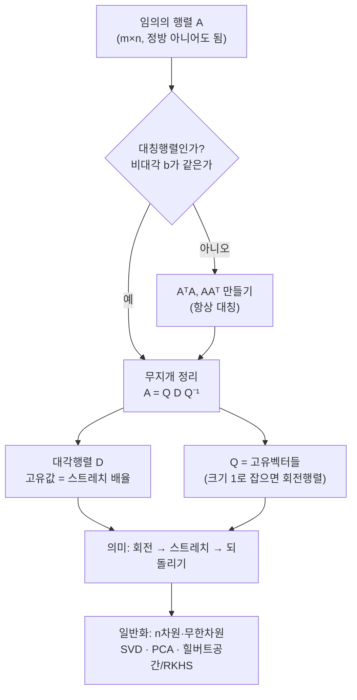

# 선형대수학의 무지개 정리

오늘은 무지개 정리(스펙트럼/대각화 정리)를 다룹니다. 먼저 지금까지 다룬 개념들을 구두로 점검하고, 이해를 직관·논증·계산 세 층위로 나누어 본 다음, 무지개 정리 $A = QDQ^{-1}$가 "도대체 무엇인지"를 직관·논증·계산의 관점에서 함께 뜯어 봅니다.

---

## [0. 구두 점검 — 지금까지의 개념 · ▶ 00:00](https://www.youtube.com/watch?v=H1FFmrOYY4w&t=0s)

무지개 정리에 앞서, 지금까지 다룬 것들을 구두로 점검하고 시작합니다. 오늘 물어본 것들을 흐름대로 적어 둡니다. 각 물음 뒤에는 그 자리에서 짚어 준 핵심을 함께 남깁니다.

- **고유치·고유벡터의 정의.** 정방행렬 $A$에 대해 $A\mathbf{v} = \lambda \mathbf{v}$를 만족할 때 $\mathbf{v}$가 고유벡터, $\lambda$가 고유값입니다. 여기서 두 가지를 꼭 짚어야 합니다. 첫째, 행렬은 **정방행렬**이어야 합니다. 둘째, 고유벡터는 **영벡터가 아니어야** 합니다. "$\det(A - \lambda I) = 0$으로 놓고 두 고유치를 구한다"는 것은 정의가 아니라 **구하는 방법**입니다. 정의와 방법을 구분하는 일이 여기서 중요합니다.
- **무지개 정리의 스테이트먼트.** "정사각 행렬이 주어졌을 때 그것을 고유값과 고유벡터로 분해할 수 있다." 틀린 말이 없습니다.
- **고유치를 구하는 방법 두 가지 이상.** $2\times2$에서 $(a-t)(d-t) - bc = 0$으로 두고 $t$를 구하는 계산 방법이 있습니다.
- **레시피로만 다루지 않기.** 이 내용들을 배울 때는 레시피로 외워 끝내면 안 됩니다. 레시피를 터득한 뒤 거기서 더 파고드는 정서, 여러 결을 묻는 정서가 중요합니다. 그래서 점검 질문을 하나 더 던집니다 — **2차 방정식을 푸는 방법.** $ax^2 + bx + c = 0$에서 양변을 정리해 $x = \dfrac{-b \pm \sqrt{b^2 - 4ac}}{2a}$까지 갑니다. 사실 단순한 답은 그냥 **완전제곱**을 하면 된다, 이 선이면 충분합니다.
- **$(x+1)(x+2)(x+3)$ 전개.** $x^3 + 6x^2 + 11x + 6$.
- **회전행렬의 재미있는 포인트 두 가지.** $\theta \neq 0$인 회전에서는 **실수 범위에서 고유값·고유벡터가 존재하지 않습니다.** 또 회전행렬은 길이를 보존하고, 행렬식이 $1$입니다.
- **$101 \times 99$를 인수분해 꼴로.** $(100+1)(100-1) = 100^2 - 1$. $a^2 - b^2 = (a+b)(a-b)$ 꼴로 바꾸면 곧바로 계산됩니다.
- **행렬식의 두 가지 다른 구조.** 하나는 **군(group) 구조** — 군연산인 행렬 곱셈에 대해 닫혀 있는 구조입니다. 다른 하나는 **기하적 구조** — 평행사변형의 넓이(부피)로서의 특징입니다. 이렇게 구조로 보는 것이 구조적 사고입니다.
- **선형성의 정의.** 두 연산, 즉 **벡터 합과 스칼라 곱**을 보존하는 것이 선형성입니다.
- **군의 정의.** 집합과 연산이 주어졌을 때, 연산에 닫혀 있고, 결합법칙이 성립하며, 항등원과 (각 원소의) 역원이 존재하면 군입니다.
- **군 구조를 갖는 집합의 예 세 개 이상.** 역행렬이 존재하는 행렬들의 집합과 행렬 곱셈; $0$이 아닌 유리수들의 집합과 곱셈; $S_3$, 즉 $\{1,2,3\}$ 위의 전단사 함수들의 집합과 함수 합성. 예를 들 때는 **집합과 연산을 둘 다** 명시해야 합니다. 같은 연산이라도 어떤 집합을 택하느냐에 따라 군이 되는지가 갈립니다.
- **선형함수와 행렬을 같게 간주할 수 있는 선.** 선형함수는 행렬로 변환할 수 있고, **행렬 곱이 선형함수의 합성**에 대응합니다.
- **함수의 정의.** 두 집합 $A$, $B$의 곱집합 $A \times B$의 부분집합으로서, $A$의 각 원소에 대응되는 $B$의 원소가 있어야 하고 그것이 유일해야 합니다.
- **군 구조를 보존하는 함수의 예.** 선형함수($f(x) = ax + b$, $a \neq 0$, $\mathbb{R} \to \mathbb{R}$, 연산은 덧셈), 지수함수가 예가 됩니다. 함수의 예를 들 때는 **정의역과 공역을 모두** 명시해야 합니다. 여기서 끌어내고 싶은 답 하나는 **행렬식 자체를 군 구조 보존 함수로 보는 것**입니다. 역행렬이 존재하는 $2\times2$ 행렬들의 모임(곱셈)에서 $0$이 아닌 실수들의 모임(곱셈)으로 가는 사상으로 보면, $\det(AB) = \det(A)\det(B)$를 구체적으로 확인할 수 있습니다.
- **고유치를 구하는 과정에서 왜 행렬식이 $0$이 되는가 (논증).** $A\mathbf{v} = \lambda\mathbf{v}$를 이항하면 $(A - \lambda I)\mathbf{v} = \mathbf{0}$입니다. 만약 $A - \lambda I$의 역행렬이 존재하면 $\mathbf{v} = \mathbf{0}$이 강제되는데, 이는 **고유벡터가 영벡터가 아니어야 한다**는 조건에 어긋납니다. 그러므로 $A - \lambda I$의 역행렬은 존재하면 안 되고, 따라서 $\det(A - \lambda I) = 0$입니다. 여기서 가장 중요한 조건은 고유벡터가 $\mathbf{0}$이 아니라는 점입니다.

> **💭 생각해볼 점 — 왜 고유치·고유벡터를 굳이 신경 쓰는가?** 어떤 개념에 익숙해지는 것과는 별개로, "이게 도대체 뭐냐"를 두고 불편한 지점에서 파고드는 일이 중요합니다. 오늘 영상 전체가 바로 이 물음에 대한 답입니다.

---

## [1. 이해의 세 층위 — 직관·논증·계산의 균형 · ▶ 53:55](https://www.youtube.com/watch?v=H1FFmrOYY4w&t=3235s)

무지개 정리로 들어가기 전에, "이해"라는 것을 세 층위로 나누어 보겠습니다.

수학에서 무언가를 이해한다는 것은 다음 세 가지가 균형을 이루는 것입니다.

1. **직관.** 이것은 비수학적인 영역입니다. 직관은 틀려도 되고 맞아도 됩니다. 맞고 틀린 것이 중요한 게 아니라, **직관이 있다는 것**이 중요합니다.
2. **논증.** 왜 성립하는지에 대한 정당화입니다.
3. **계산(예시 계산).** 구체적인 예시 레벨에서 직접 해 보는 것입니다.

세 가지가 골고루 균형을 이뤄야 합니다. 논증은 되는데 직관이 없으면 "법칙상 된다, 근데 어쩌라고?" 하는 느낌이 됩니다. 예시 계산만 하고 추상화(논증)를 모르는 것도 문제이고, 계산과 논증이 되더라도 직관이 없는 것도 문제입니다.

여기서 꼭 구분해야 할 것이 있습니다. 흔히 **증명을 받으면 이해라고 착각**합니다. 그런데 "$1+1=2$가 왜 $2$냐? 페아노 공리 때문이다"가 이해일까요? 그건 **정당화**이지, $1+1=2$의 본질을 이해한 것과는 무관할 수 있습니다. 본질은 오히려 직관이나 계산·예시에 더 가까운 경우가 많습니다. 공리화는 인간이 문제없게 꾸며 놓은 말일 뿐이니까요.

오늘 무지개 정리를 직관적으로 공감하려면 두 가지 대전제가 필요합니다. **첫째, 고유치·고유벡터 계산을 직접 해 보셨어야 합니다.** 예컨대 회전행렬을 두고 "고유값의 범위를 실수로 국한하면 문제가 된다"는 말을 팩트로 외워서가 아니라, 직접 계산해 보면서 오일러 공식 같은 것들이 자연스레 보이는 선까지 가야 합니다. **둘째, 회전행렬을 이해하셔야 합니다.** 특히 행렬식을 평행사변형의 넓이로 볼 때, 회전행렬로 도형을 $x$축에 붙여 넓이를 계산하는 논증이 있습니다. $ad - bc$가 부호를 갖는 평행사변형의 넓이라는 것을, 외우지 말고 회전행렬을 활용해 직접 검증해 보시기 바랍니다.

> **💭 생각해볼 점 — 프리사이즈 스테이트먼트와 직관은 별개다.** 무언가를 이해하려면, 먼저 내가 알고자 하는 것이 수학적으로 정확히 어떤 문장인지(중의성 없는 프리사이즈 스테이트먼트) 명확해야 합니다. 하지만 중의성 없는 문장을 보았다고 해서 그걸 이해한 것은 아닙니다. 오늘 일부러 몰아가고 싶은 방향은 이 셋 중 **직관**입니다.

> **💭 생각해볼 점 — 간접 경험과 직접 경험은 다르다.** 여러분이 직접 나누는 **논증과 계산**은 직접 경험의 영역이고, 누군가 해 주는 말을 듣고 "그렇구나" 하는 것은 간접 경험입니다. 구체적인 것을 보고 추상화하여 내 직접 경험으로 가져가는 일에 애써야 합니다. 그것이 실제로 배워 가는 유일한 방법입니다.

---

## [2. 무지개 정리의 스테이트먼트 · ▶ 55:35](https://www.youtube.com/watch?v=H1FFmrOYY4w&t=3335s)

8강 노트의 스테이트먼트를 함께 읽겠습니다.

> **무지개 정리 (스펙트럼/대각화 정리).** 임의의 세 실수 $a, b, c$에 대해 행렬
> $$A = \begin{pmatrix} a & b \\ b & c \end{pmatrix}$$
> 가 주어졌다고 하자. 그러면 언제나 $A$의 고유벡터 $\mathbf{v}_1, \mathbf{v}_2$ 및 이들에 대응하는 고유값 $\lambda_1, \lambda_2$가 존재하여
> $$A = QDQ^{-1}, \qquad Q = \begin{pmatrix} \mathbf{v}_1 & \mathbf{v}_2 \end{pmatrix}, \qquad D = \begin{pmatrix} \lambda_1 & 0 \\ 0 & \lambda_2 \end{pmatrix}$$
> 가 성립한다. (→ 전사본 참조)

여기서 포인트는 행렬을 $\begin{pmatrix} a & b \\ b & c \end{pmatrix}$로, **비대각 성분 $b$가 같게** 구성한 것입니다. 이걸 **대칭행렬(symmetric matrix)** 이라고 부릅니다. $b$가 같다는 조건이 필요충분조건으로 무지개 정리가 성립하게 하는 이유입니다.

읽는 흐름은 이렇습니다. 대칭행렬 $A$가 주어지면, 고유치·고유벡터를 (직접 경험으로 구할 줄 안다는 대전제 아래) 구합니다. 고유벡터들로 다시 $2\times2$ 행렬을 만들어 $Q$라 부르고, 고유치 $\lambda_1, \lambda_2$를 대각성분으로, 비대각은 $0$으로 둔 대각행렬을 $D$라 합니다. 그러면 $A$가 언제나 $QDQ^{-1}$로 표현된다 — 이것이 무지개 정리입니다.

> **💭 생각해볼 점 — 곱셈 순서.** "$Q$를 먼저 해도, 즉 순서를 바꿔도 되지 않느냐"는 물음이 있습니다. 순서는 **상관이 있습니다.** $Q^{-1}DQ$와 $QDQ^{-1}$은 다릅니다. 그리고 노트에 적은 것이 정말 맞는지($Q$를 $\mathbf{v}_1, \mathbf{v}_2$로 선언했을 때 부합하는지)도 의심하고 검증하시기 바랍니다. 여기서 핵심은 맞고 틀리고 자체가 아니라, **맞고 틀림을 검증할 수 있다**는 것입니다.

---

## [3. "이게 도대체 뭐냐" — UFO를 처음 만지듯 · ▶ 59:54](https://www.youtube.com/watch?v=H1FFmrOYY4w&t=3594s)

스테이트먼트를 읽었으니 질문을 던집니다. 이 선언 — $A = QDQ^{-1}$ — 을 처음 봤을 때 느끼는 정서는 무엇일까요? 제 생각엔 "**어쩌라고**"입니다.

증명을 한 줄 읽고 "Q.E.D. 오, 아름다워" 하는 정서가 있다면, 저는 그게 오히려 정상이 아니라고 봅니다. "너무나 아름답지 않냐"고 하면서 그 아름다움을 납득하게 설명하지 못하면, 그건 그 사람의 문제이지 내 머리의 문제가 아닙니다. 보편성이 있어야 하니까요.

그러니 지금 우리가 봐야 할 영역은 "이게 도대체 뭔 소리란 말이냐"입니다. 이건 **직관의 영역**입니다. 보통은 여기서 증명을 보려 하거나, 더 심하게는 "선형대수를 다시 선수과목으로 공부해야겠다"며 거꾸로 갑니다. 그게 아니라, **"이게 뭐지?"라는 정서에서 직관부터 파고드는 것**으로 시작해야 합니다. 내가 덜 배워서 그런 게 아닙니다.

> **💭 생각해볼 점 — "왜 되지?"보다 "이게 뭐지?"가 먼저다.** "처음 봤을 때 습관적으로 계산·수식으로 다가가게 된다, 어떻게 직관으로 다가가야 할지 궁금하다"는 물음이 있습니다. 제 질문은 이렇습니다 — $A = QDQ^{-1}$를 보이는 논증을 안다고 해서, 그게 "파란색의 시원한 느낌"을 주느냐? 오히려 논증이 다 되면 그건 그것대로 더 짜증 날 수 있습니다. 그러니 새로운 정의·정리·명제를 만나면 첫 정서는 "**이게 뭐지?**"여야 합니다. "왜 되지?"는 호기심이 생긴 다음의 질문입니다.

그래서 보통 그다음으로 **페너트레이팅 익잼플(penetrating example)** — 파고드는 예시 — 을 설계하는 것이 실질적으로 가야 할 답이지만, 그 전에 이 형태 자체를 뜯어 볼 필요가 있습니다. $QDQ^{-1}$라는 형태는 어떤 특징을 갖고 있을까요? 이건 미지의 블랙박스, **처음 만난 UFO**라고 생각하시면 됩니다. UFO의 동작 원리를 묻지 말고, 그냥 처음 만져 보는 사람의 입장에서 "얘 왜 이렇게 생겼지?" 하며 두드려 보는 것이 타당합니다.

관찰로 나온 특징들을 적어 둡니다.

- **거듭제곱이 편하다.** $A^n = QD^nQ^{-1}$처럼, 가운데 $Q^{-1}Q$가 계속 상쇄되어 안쪽 $D$만 거듭제곱하면 됩니다. 아주 중요한 성질입니다.
- **샌드위치 형태가 거슬린다.** 왜 하필 한쪽은 $Q$, 다른 쪽은 $Q^{-1}$을 붙여 $D$를 감싸는가? 대각성분(그것도 고유치)만 살아 있는 행렬을 만든 것도 의아한데, 그걸 $Q$와 $Q^{-1}$로 샌드위치처럼 붙이고 "그게 $A$다"라니 — 의문이 오히려 증폭됩니다.

> **💭 생각해볼 점 — 군(group)의 냄새.** "$Q$ 연산 → $D$ 연산 → $Q^{-1}$ 연산을 하면 다시 돌아온 듯한 구조가 군 느낌이 든다"는 직관이 있었습니다. 아주 수학적으로 훌륭한 직관입니다. 실제로 갈루아 이론에서는 이 $QDQ^{-1}$ 형태를 **켤레작용(conjugation action)** 이라 부르며, 갈루아·아벨이 증명에 썼던 방식입니다.

> **💭 생각해볼 점 — 각도 개념이 아직 없는데 어떻게 "45도"인가?** $Q$가 $45^\circ$를 돌리는 회전행렬이라면, $45^\circ$라는 건 각도 개념을 전제하는데, 벡터공간에 **내적을 부여하기 전**에는 각도 개념 자체가 없지 않느냐는 물음입니다. 또 "왜 역행렬을 넣는지, 왜 직각으로 만나던 두 축이 비스듬해지는지($\theta = 90^\circ$ vs $53.2^\circ$)" 하는 혼란도 직접 계산과 함께 나왔습니다. 이런 물음들은 직접 계산해 본 경험과 섞여 있다는 점에서 값집니다. 회색지대를 가면서 "꽃 깃발"을 계속 꽂아 가는 일의 중요성을 보시기 바랍니다.

> **📚 참고·응용 — 직접 발견한 분해.** 회전행렬의 역행렬은 항상 그 **전치(transpose)** 와 같고, 대각행렬 $D$는 각 원소에 루트 씌운 것($\sqrt{D}$)을 제곱한 것으로 쪼갤 수 있어 $A = Q\sqrt{D}(Q\sqrt{D})^{\mathsf T}$ 같은 대칭 분해를 만들 수 있다는 발견이 나왔습니다.

---

## [4. 회전 → 스트레치 → 되돌리기 — $QDQ^{-1}$의 의미 · ▶ 1:20:14](https://www.youtube.com/watch?v=H1FFmrOYY4w&t=4814s)

이제 직관을 잡아 봅시다. 8강 노트의 무지개 정리 예시 세 개($\begin{pmatrix} 1&0\\0&1 \end{pmatrix}$, $\begin{pmatrix} 2&0\\0&3 \end{pmatrix}$, $\begin{pmatrix} 3&1\\1&3 \end{pmatrix}$)는 일부러 $Q$가 회전행렬이 되도록 설계해 두었습니다. 그렇게 봐 달라는 의도입니다.

회전행렬은 이렇게 생겼습니다.
$$R_\theta = \begin{pmatrix} \cos\theta & -\sin\theta \\ \sin\theta & \cos\theta \end{pmatrix}.$$
이건 $\theta$(라디안)만큼 **반시계 방향으로 회전**시키는 선형함수이고, 회전행렬들의 모임은 군을 이룹니다.

> **💭 생각해볼 점 — 회전행렬의 역행렬은 무엇인가?** 이렇게 물으면 "반대 방향으로 돌리는 것"이라는 답이 나옵니다. 맞습니다. 항등행렬이 되려면(제자리로 돌아오려면) $\theta$만큼 반시계로 돌린 것의 반대는 $\theta$만큼 시계 방향으로 돌리는 것일 수밖에 없습니다. 직관으로 그렇고, 대수적으로 역행렬을 직접 계산하면
> $$R_\theta^{-1} = \begin{pmatrix} \cos\theta & \sin\theta \\ -\sin\theta & \cos\theta \end{pmatrix} = R_{-\theta}$$
> 가 나옵니다(삼각함수의 성질을 쓰면 됩니다). 직관과 계산이 일치합니다.

이 관점으로 $A = QDQ^{-1}$를 다시 봅니다. 행렬 곱은 오른쪽부터 작용하니 $Q^{-1}$부터 봅니다. 일단 $Q$를 회전행렬이라 상정하고, 또 잠시 "$\mathbb{R}^2$에 유클리드 기하(즉 $(1,0)$, $(0,1)$이 각각 크기 $1$이고 직각)를 기준으로 본다"고 단순화합니다. 기준 하나는 정해야 하니까요. 그러면 세 단계입니다.

- **Step 1 — $Q^{-1}$ (시계 방향 $\theta$ 회전).** 원래 $(1,0)$, $(0,1)$로 만든 축을 시계 방향으로 $\theta$만큼 돌립니다. 즉 **축을 갈아끼웁니다(축변환).**
- **Step 2 — $D$ (스트레치).** 갈아끼운 축을 기준으로, 한 방향은 $\lambda_1$배, 다른 방향은 $\lambda_2$배로 늘립니다. 비대각 성분이 $0$이라는 것은 두 방향이 서로 독립적으로(섞이지 않고) 늘어난다는 뜻입니다.
- **Step 3 — $Q$ (반시계 방향 $\theta$ 회전).** 다시 반시계로 $\theta$만큼 돌려, Step 1에서 돌린 것을 원복합니다.

그러니까 $A$를 곱한다는 것은 **"축을 돌려 갈아끼우고(역회전) → 그 축 방향으로 따로따로 늘리고(스트레치) → 다시 원래 축으로 되돌린다"** 는 뜻입니다. 이게 무지개 정리가 말해 주는 바입니다. 의미를 부여하는 일이니 이 레벨에서 틀릴 수도 있지만, 일단 내가 아는 세팅부터 맞춰 보는 것입니다.

노트 예시 3번 $A=\begin{pmatrix} 3&1\\1&3 \end{pmatrix}$로 직접 보면, 고유벡터는 $\pm45^\circ$ 대각선 위에 놓이고 고유값은 $\lambda_1=4$(방향 $\mathbf v_1$), $\lambda_2=2$(방향 $\mathbf v_2$)입니다. 단위원을 $A$로 보내면, 바로 그 고유벡터 축을 따라 한쪽은 $4$배, 다른 쪽은 $2$배 늘어난 타원이 됩니다.

> **💭 생각해볼 점 — 움직이는 것은 점인가, 공간인가?** "벡터(점)가 움직인 게 아니라 축, 즉 공간 전체가 움직이는 거냐"는 물음이 있습니다. 정확히는 **공간을 바라보는 방법(레퍼런스 축)을 바꾸는 것**입니다. 공간 자체와 점은 그대로 있고, 기준 축만 바꿉니다. 예를 들어 통계 교재에서 회귀(regression)할 때 비스듬히 그려 놓은 타원을, 우리가 쓰는 직교 좌표로는 재기 어려우니 축을 슬쩍 돌려 장축·단축에 맞춰 놓고 본 다음, 다시 원래 좌표로 원복하는 것 — 바로 그 이야기입니다. "고유벡터와 회전" 예시가 정확히 이것입니다.

---

## [5. 일반화와 진짜 힘 — 특이값분해로 모든 행렬을 · ▶ 1:31:50](https://www.youtube.com/watch?v=H1FFmrOYY4w&t=5510s)

지금까지는 직관입니다. 하지만 논리적으로 분명한 갭이 있습니다. 스테이트먼트 자체에서 $Q$는 **고유벡터 두 개로 만든 행렬**이지, 회전행렬이라고 적혀 있지 않습니다. 예시 세 개가 그렇다고 해서 일반적으로 회전행렬이라는 보장은 없죠. 이건 정당화(논증)가 필요한 지점입니다.

여기 숨은 명제가 있습니다. 고유값은 정해지지만 고유벡터는 정해지지 않습니다(무한히 많죠). 그런데 **고유벡터의 크기를 $1$로 정하면** $Q$가 정확히 어떤 $\theta$에 대한 회전행렬과 같아집니다. 그래서 "존재한다"는 말은 거짓말이 아닙니다 — 무한히 많은 고유벡터 중 크기 $1$인 것을 골라 $Q$를 만들면 회전행렬이 되고, 우리가 만든 직관도 결과적으로 다 참입니다. (크기를 $1$로 맞추려면 내적이 들어가야 하는데, 그 내적이 꼭 유클리드 내적일 필요는 없습니다.) 이것이 논증으로 증명해야 하는 결입니다.

그래서 일반적으로, $n\times n$ 그리고 사실은 무한 차원까지, **대칭행렬을 이해한다는 것**은 곧 "이 행렬은 언제나 (고유벡터로 만들어지는) 축을 기준으로 따로따로 늘렸다가 원복하는 것에 지나지 않는다"는 것입니다. 그러니 우리는 그 축(대각화된 $D$)만 알면 됩니다. 그 축을 찾는 계산이 바로 여러분이 풀고 있던 고유치·고유벡터 계산입니다.

> **💭 생각해볼 점 — 그래도 남는 딴지: 대칭이 아니면? 정방이 아니면?** 좋은 비판을 더 해 봅니다. "일반적인 행렬은 $\begin{pmatrix} a&b\\b&c \end{pmatrix}$가 아니라 $\begin{pmatrix} a&b\\c&d \end{pmatrix}$인데?", 또 "$2\times2$에서 되면 $n\times n$도 된다 치자, 그런데 $m\times n$은 안 되지 않냐?" 즉 "이건 굉장히 특별한 형태에서만 되는 것 아니냐"는 딴지입니다.

이 딴지들을 한 번에 피해 가는 것이 **특이값분해(Singular Value Decomposition, SVD)** 입니다. 임의의 $m\times n$ 행렬 $A$를 마음대로 떠올려 보세요. 정방행렬일 필요도 없습니다. 그러면 전치행렬 $A^{\mathsf T}$($n\times m$)를 취해
$$A^{\mathsf T}A \ (n\times n), \qquad AA^{\mathsf T} \ (m\times m)$$
를 만들 수 있고, 실제로 계산해 보면 이들은 **언제나 대칭행렬**입니다. 따라서 무지개 정리를 임의의 행렬에 대해 쓸 수 있습니다.

> **📚 참고·응용 — 왜 그렇게 강력한가.** 어떤 행렬을 떠올리든 우리는 구체적으로 축을 찾아 그 축에서 **스트레치만** 하면 됩니다. 비유하자면, 복잡한 탭으로 가득 찬 엑셀 시트의 모든 항을 일일이 계산하지 않아도, 언제나 **대각선만 살아 있는 형태**로 바꿀 수 있다는 보장입니다. 그래서 선형대수의 실질적인 계산은 언제나 무지개 정리를 거쳐서 합니다. 이 정리는 $n\times n$, 나아가 무한 차원까지 확장되며(전사본 참조: 힐버트 공간 이론·RKHS, 통계의 주성분분석(PCA)·차원축소 등), 찾는 방법은 여러분이 지금 하고 있는 고유치·고유벡터 계산 그대로입니다. (→ 전사본 참조)

무지개 정리가 무엇을 어디까지 덮는지를 한눈에 정리하면 이렇습니다.

---

## [6. 마무리 · ▶ 1:36:06](https://www.youtube.com/watch?v=H1FFmrOYY4w&t=5766s)

오늘은 무지개 정리가 "이게 뭐냐"에 대한 설명까지입니다. "이게 진짜 똑같나, 왜 되나" 같은 것들은 $2\times2$ 행렬을 잡고 고유치·고유벡터를 직접 구해 확인하실 수 있습니다.

> **💭 생각해볼 점 — 직관이 아직 안 길러진 것 같아 불안하다면.** "직관을 기르는 과정이라는데 아직 안 길러진 것 같아 걱정과 불안이 있다"는 마음은 정상입니다. 해결법은 단순합니다 — **8강의 예시 세 개를 천천히 하나씩 직접 계산해 보는 것**입니다. 평행사변형 넓이나 행렬식 계산만 해 보신 분이라면, 무지개 정리 예시 세 개를 손으로 끝까지 해 보면서 음미하는 단계가 다릅니다.

---

## 요약

- **구두 점검(0강):** 고유치·고유벡터의 정의(정방행렬, 영벡터 아님), 고유치 구하는 법, 2차 방정식 풀이(완전제곱), 군의 정의와 예, 선형성, 함수의 정의, 행렬식이 군 구조 보존 함수라는 점, "$\det(A-\lambda I)=0$이 나오는 이유는 고유벡터가 $\mathbf 0$이 아니어야 하기 때문" 등을 확인했습니다.
- **이해의 세 층위:** 이해는 **직관·논증·계산** 세 층위의 균형입니다. 증명을 본 것이 본질을 이해한 것은 아닙니다.
- **무지개 정리:** 대칭행렬 $A=\begin{pmatrix} a&b\\b&c \end{pmatrix}$는 언제나 $A=QDQ^{-1}$로 대각화됩니다. $Q$는 고유벡터를 열로 갖는 행렬, $D$는 고유값을 대각성분으로 갖는 행렬입니다. 비대각 $b$가 같다는(대칭) 것이 핵심 조건입니다.
- **직관($QDQ^{-1}$의 뜻):** 고유벡터를 크기 $1$로 잡으면 $Q$는 회전행렬이 되고, $Q^{-1}$은 그 역회전입니다. $A$를 곱하는 것은 "축을 돌려 갈아끼우고 → 그 축 방향으로 $\lambda_1, \lambda_2$배 따로 스트레치하고 → 다시 원래 축으로 되돌리는" 세 단계입니다. 움직이는 것은 공간이 아니라 **공간을 보는 기준 축**입니다.
- **새로운 것을 만났을 때의 태도:** "왜 되지?"보다 "**이게 뭐지?**"가 먼저입니다. UFO를 처음 만지듯 형태를 두드려 보며 직관부터 잡습니다.
- **일반화와 힘:** 임의의 $m\times n$ 행렬 $A$에 대해 $A^{\mathsf T}A$, $AA^{\mathsf T}$는 항상 대칭이므로 무지개 정리를 쓸 수 있고, 이것이 **특이값분해(SVD)** 로 이어집니다. 무지개 정리는 $n$차원·무한차원(힐버트 공간/RKHS, PCA·차원축소)까지 확장됩니다. 찾는 계산은 고유치·고유벡터 그대로입니다.
- **남은 물음들(검증 가능):** 곱셈 순서($QDQ^{-1}\neq Q^{-1}DQ$), 각도 개념과 내적의 선후 관계, 왜 역행렬을 끼우는가 — 모두 직접 계산으로 검증할 수 있는 지점들입니다. 예시 세 개를 손으로 끝까지 해 보는 것이 다음 과제입니다.
