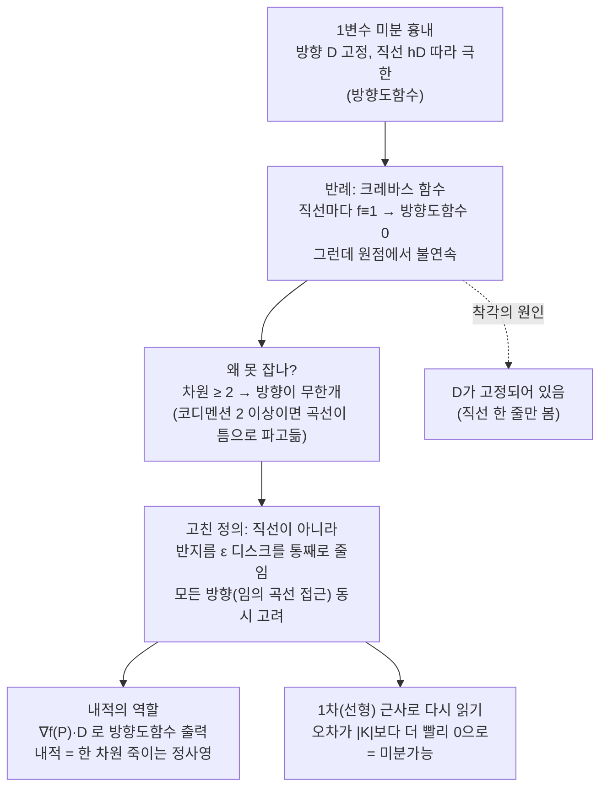

# 미분의 정의에 대한 디스커션 (뉴진수 5강)

이번 시간에는 10강 노트(미분의 의미와 정의)를 함께 읽으면서, 여러분이 보고 싶은 페이지를 골라 그 부분을 파고듭니다. 일변수 미분을 흉내 내서 이변수 함수의 미분을 정의해 보려는 시도가 왜 깨지는지, 그리고 모든 방향을 한꺼번에 고려하는 더 강한 정의가 왜 필요한지를 디스커션으로 풀어 갑니다.

---

## [0. 노트를 함께 읽는 새 포맷 · ▶ 06:40](https://www.youtube.com/watch?v=ygHNL8rsE7g&t=400s)

오늘은 9강·10강 노트를 한데 모아 놓고, 조금 새로운 포맷으로 진행하겠습니다. 저한테도 이 강은 내용이 굉장히 어렵습니다. 그래서 여러분이 보고 싶은 페이지에 별 표시를 해 주시면, 별이 가장 많은 페이지부터 확대해서 같이 살펴보겠습니다.

판서를 새로 그리며 강의하는 방식이 아니라, 이미 정리된 손글씨 노트(→ [전사본](<09. Meaning and Definition of the Derivative.md>) 참조)를 화면에 띄워 놓고 한 줄씩 같이 뜯어보는 방식입니다.

> **💭 생각해볼 점** 수학책을 읽다 보면 "$A$이면 $B$이다"라고만 적혀 있고 그 이유를 한참 뒤에 가서야 설명하는 경우가 있습니다. 한 줄에서 막혀 멈추기 전에, 먼저 문맥을 훑어 "이 문장이 뒤에서 어떻게 받아쳐지는지"를 확인하고 읽으면 한결 가볍습니다. 이번 노트의 "시도"라는 단어는 이미 그 시도가 실패할 것임을 암시하는 복선입니다.

---

## [1. 방향도함수로 미분을 흉내 내 본 첫 시도 · ▶ 20:52](https://www.youtube.com/watch?v=ygHNL8rsE7g&t=1252s)

별표가 가장 많이 모인 2페이지부터 봅니다. 여기에는 **방향도함수(directional derivative)** 의 개념이 나옵니다. 일변수 함수의 미분법을 흉내 내서 이변수 함수의 미분을 정의해 보려는 시도입니다.

일변수에서 한 점의 순간변화율(접선의 기울기)을 얻었던 것처럼, 이변수에서도 방향 $D$ 하나를 정해 놓고 그 방향으로의 변화율을 보려는 것입니다. 단위벡터 $D$(크기가 $1$인 벡터)를 잡고, 점 $P$에서

$$
\lim_{h\to 0}\frac{f(P+hD)-f(P)}{h}
$$

를 생각합니다. $P$와 $D$가 고정되어 있으므로 이것은 사실상 $h$에 대한 일변수 함수의 미분처럼 볼 수 있습니다. 즉 원점을 지나 $D$ 방향으로 난 직선 위에서만 $h\to 0$으로 보내는 것입니다.

문제는, 이렇게 정의하면 **불연속인 함수인데도 마치 미분이 잘 되는 것 같은 착각**이 생긴다는 데 있습니다. 노트가 "시도"라고 적어 놓은 것은, 이 정의가 결국 잘못된 시도임을 미리 드러내는 표시입니다.

> **💭 생각해볼 점** 미분이 가능하려면 일단 연속이어야 합니다(미분가능 $\Rightarrow$ 연속). 그런데 분명히 불연속인 함수에 대해서도 위 직선 방향의 극한값은 계산되어 버립니다. 그렇다면 "방향마다 변화율이 존재한다"는 것만으로 미분을 정의해도 괜찮을까요?

---

## [2. 낭떠러지(크레바스) 함수 — 직선으로는 안 떨어진다 · ▶ 28:00](https://www.youtube.com/watch?v=ygHNL8rsE7g&t=1680s)

왜 착각이 생기는지 구체적인 그림으로 봅니다. 여러분 중 한 분이 그래프의 경계가 보라색 영역인지 초록색 영역인지 물었는데, 핵심은 색이 아니라 **불연속이기만 하면 된다**는 점입니다.

원점 $(0,0)$에서 시작해 함수값이 한쪽에서는 $1$, 좁은 틈(사이)에서는 $0$이 되는 함수를 생각합니다. 설명을 위해 그래프를 뒤집어, 바닥은 모두 $1$이고 좁은 틈만 $0$으로 푹 꺼진 모양으로 그렸습니다.

> 그림: 위로 평탄한 바닥(값 $1$) 위에, 마치 빙하에 크레바스가 갈라지듯 좁은 영역만 아래로 뚝 떨어진(값 $0$) 모양. 원점에 개미가 한 마리 서 있다.

개미가 원점에서 **직선 경로**로만 움직인다고 하면, 어느 방향으로 가도 낭떠러지(틈)로 떨어지지 않습니다. $x$축을 따라가도 값은 계속 $1$이고, 틈을 비껴가는 임의의 직선 방향에서도 값이 평탄합니다. 그래서 $D$를 고정한 직선 위에서는

$$
f(P+hD)-f(P)=0 \quad(h\ \text{가 충분히 작을 때})
$$

이 되어, 방향도함수가 $0$으로 잘 정의되는 것처럼 보입니다.

여기서 한 참여자분이 "$h\to 0$인데 식을 직선 한 줄만 떼어내서 봐도 되느냐, 극한을 그렇게 마음대로 쪼개도 되느냐"를 물었습니다. $D$가 고정되어 있으면 $f(P+hD)$는 $h$에 대한 일변수 함수이고, 그 함수는 원점을 지나 $D$ 방향으로 난 직선을 따르는 함수입니다. $h$를 줄이면 무조건 $0$인 구간(평탄한 바닥)부터 지나가므로, 그 근방에서 함수값은 항상 $f(P)$와 같습니다. 따라서 분자 $f(P+hD)-f(P)$가 $0$이고, 극한도 $0$입니다.

> **💭 생각해볼 점** 같은 그림을 처음 볼 때 "$D$ 뒤(방향)가 계속 움직이면 주변이 어지러워 불연속처럼 보일 것 같다"는 인상을 받기 쉽습니다. 그러나 여기서는 **$D$가 고정(픽스)되어 있다**는 점이 결정적입니다. $D$를 고정시키면 직선 하나가 정해지고, $h$를 줄이면 그 직선을 따라 $0$인 구간부터 지나갑니다. 그래서 "방향마다 보면 멀쩡한데 함수는 불연속"이라는 모순이 생깁니다.

> 🔧 [낭떠러지(크레바스) 함수](<03-season-assets/05/html/crevasse-directional-derivative-03-season-05-02.html>)에서 직접 방향 $D$를 고정해 $h\to0$으로 줄이며, 직선은 틈을 비껴 $f=0$이 되는데 곡선만 틈으로 파고드는 것을 확인해 보자.

---

## [3. 차원이 올라가면 방향이 무한개가 된다 · ▶ 1:17:34](https://www.youtube.com/watch?v=ygHNL8rsE7g&t=4654s)

일변수에서 연속을 확인할 때는 한 점에 **좌·우 두 방향**에서 오는 것만 따지면 됐습니다. 방향이 유한 개(두 개)였습니다. 그런데 차원을 하나 올려 이변수가 되면, 한 점 주위로 들어오는 방향이 **무한개**가 됩니다. 차원이 $2$ 이상이면 항상 방향이 무한개입니다.

이 점프가 왜 일어나는지를 직관적으로 보기 위해 구멍과 루프 이야기를 합니다.

- 평면 $\mathbb{R}^2$에 구멍을 하나 뚫고, 그 구멍 주위로 루프(고리)를 감아 줄이면 루프가 구멍에 **걸립니다**.
- $\mathbb{R}^3$에 구멍을 뚫고 같은 루프를 감아 줄이면, 루프가 구멍을 **비껴가** 빠져나올 수 있습니다.

차이를 정리하면, 일하고 있는 공간의 차원과 루프(또는 점)의 차원의 **차이(여분 차원, codimension)** 가 핵심입니다.

- $0$차원 점 vs $1$차원 공간 → 차이 $1$.
- $1$차원 루프 vs $2$차원 평면 → 차이 $1$ (구멍에 걸린다).
- $1$차원 루프 vs $3$차원 공간 → 차이 $2$ (빠져나온다).

여분 차원(코디멘션)이 $2$ 이상이 되면 이렇게 "걸리던 것이 빠져나오는" 좋은(혹은 까다로운) 현상이 일어납니다. 이변수부터 미분이 급격히 어려워지는 것도 같은 결입니다. 공간의 특이한(singular) 부분들을 모으면 코디멘션이 $2$ 이상이 된다는 식의 이야기가 여기에 연결됩니다.

> **💭 생각해볼 점** 일변수($1$차원)는 점프를 좌·우 두 방향으로만 판단하면 되니 특별하게 다루기 쉽습니다. 차원이 하나 올라가는 순간 방향이 무한개가 되고 난이도가 도약합니다. 왜 하필 코디멘션 $2$를 경계로 현상이 달라질까요? — $3$차원에서 루프가 구멍을 비껴가는 그림을, 점·루프·구의 차원을 바꿔 가며 직접 따져 보세요.

---

## [4. 그레디언트를 어떻게 만들 것인가 — 내적의 역할 · ▶ 1:00:00](https://www.youtube.com/watch?v=ygHNL8rsE7g&t=3600s)

1페이지로 돌아가 그레디언트 벡터의 직관을 봅니다. 노트는

$$
\nabla f(P)\cdot D \;=\; (\text{방향 } D \text{ 로의 변화율})
$$

처럼, $\nabla f(P)$와 방향 $D$의 **내적(inner product, dot product)** 으로 방향도함수를 출력하는 형태로 적혀 있습니다($D$는 앞쪽에서 크기 $1$인 단위벡터로 조건이 걸려 있습니다).

핵심 아이디어는 이렇습니다. 일변수에서는 미분한 다음 점을 넣으면 기울기 하나가 나왔습니다. 이변수로 오면 한 점 주위의 방향이 무한히 많아지는데, 그레디언트 벡터 $\nabla f(P)$ **하나**만 가지고 있으면, 임의의 방향 $D$와 내적하는 것만으로 그 방향의 기울기를 모두 얻을 수 있습니다. 그래서 "이 벡터 $\nabla f$를 어떻게 만들 것인가"를 정하는 일이 곧 미분법입니다.

노트에 "각 점마다 그 점을 원점으로 하는 벡터를 지정한다"고 적힌 문장은, 그 점을 **시점(始點)** 으로 갖는 벡터를 만든다는 뜻으로 읽는 것이 자연스럽습니다. 곡면 위 한 점에 그 점을 시점으로 하는 벡터공간(접평면, tangent plane)을 깔고, 거기서 그레디언트를 정의하는 것입니다.

내적이 등장하는 이유에 대해서도 정리합니다. 한 참여자분이 "이 계산까지는 내적이 필요 없지 않으냐"고 물었는데, 맞습니다. 정의역에서 벡터 $K$의 **길이를 재서(슈링크시켜서)** 작은 영역으로 줄이는 데 내적이 쓰이는 것이고, 함수값 쪽(공역)에서는 내적이 사실 필요 없습니다. 만약 $\mathbb{R}^2\to\mathbb{R}^m$처럼 공역이 여러 차원으로 가는 맵이면, 그쪽은 내적과 무관하게 어떤 행렬로 주어집니다. 그러니 지금은 내적을 표준 내적 $\begin{pmatrix}1&0\\0&1\end{pmatrix}$으로 고정하고, 다른 내적으로 바꾸면 어떻게 되는지는 잠시 접어 두고 미분 자체에 집중하는 편이 낫습니다.

> **💭 생각해볼 점** 노트가 처음부터 "$\mathbb{R}^2$에 내적이 주어져 있다고 가정하자"고 시작한 것은, 엄밀한 수학책이라면 내적이 실제로 필요해지는 바로 직전에 도입했어야 할 부분입니다. 미리 주어 버리면 독자가 "내적이 어디서부터 꼭 필요한가"를 혼동하기 쉽습니다. 여러분은 이 계산의 어느 단계에서 내적이 처음으로 꼭 필요해진다고 보나요?

---

## [5. 한 차원을 죽이는 정사영으로서의 내적 · ▶ 1:32:55](https://www.youtube.com/watch?v=ygHNL8rsE7g&t=5575s)

내적이 그림에서 "축 방향으로 끌어내리는" 모습으로 나타나는 이유를 짚습니다. 한 참여자분이 "왜 이 축 방향으로 자꾸 내려야 하느냐"고 물었습니다.

두 벡터가 있을 때 한 벡터를 다른 벡터의 축 방향으로 정사영하는 것이 내적이 하는 일입니다. 물리에서 어떤 물체를 한 방향으로 잡아당길 때, 그 힘이 특정 축 방향으로 얼마나 기여했는지를 보려면 그 축 성분만 정사영해서 셉니다. 수학적으로도 벡터가 있을 때 $x$축·$y$축 성분 중 어느 한 축 방향 성분만 보고 싶을 때 내적을 씁니다.

그래서 내적은 방향을 하나 정하고 **그쪽으로 한 차원을 죽이는(정사영하는)** 연산처럼 보입니다. 여러 벡터를 같은 방향으로 정사영하면 크기는 달라져도 모두 그 축 위에 깔립니다. 미분을 한 점에서 한 방향의 변화율로 환원해 읽으려면 이 정사영의 언어가 필요합니다.

---

## [6. 직선이 아니라 디스크를 줄이는 더 강한 정의 · ▶ 1:35:52](https://www.youtube.com/watch?v=ygHNL8rsE7g&t=5752s)

이제 노트의 본 정의로 들어갑니다. 정의라는 단어가 나오면 아주 잘 봐야 합니다. 이변수 함수의 미분은 다음 식으로 정의합니다.

$$
\lim_{K\to 0}\frac{\bigl|\,f(P+K)-f(P)-\langle \nabla f(P),\,K\rangle\,\bigr|}{|K|}\;=\;0
$$

여기서 $K$는 임의의 벡터이고(앞의 방향도함수에서 직선 방향 $hD$만 보던 것을 임의의 $K$로 바꾼 것), 분자는 절댓값을 씌운 스칼라, 분모 $|K|$는 $K$의 크기(길이)입니다. 이 식을 만족하는 벡터 $\nabla f(P)$가 **존재하면**, $f$가 점 $P$에서 **미분가능**하다고 하고 그 $\nabla f(P)$를 **그레디언트 벡터**라 부릅니다.

이 정의가 왜 앞의 직선 방향 정의보다 강한지가 핵심입니다.

- 직선 방향 정의는 $D$를 미리 고정하고 $h\to 0$으로 보냈습니다 — 직선 한 줄을 따라 들어오는 것만 봅니다.
- 새 정의는 $K\to 0$, 즉 $|K|\le \varepsilon$인 반지름 $\varepsilon$ 디스크를 통째로 $0$으로 줄입니다. 방향을 미리 고정하지 않으므로 **모든 방향이 한꺼번에 고려**됩니다.

그래서 직선으로는 닿지 않던 좁은 틈(낭떠러지)으로도 "파고 들어갈" 수 있습니다. 어떤 곡선으로 휘어져 들어오든, 점에 도달하는 순간의 접벡터 방향이 무엇이든, 모두 포함됩니다. 디스크를 줄이는 것과 임의의 곡선으로 접근하는 것이 본질적으로 같은 이야기인 셈입니다. 이렇게 정의하면 앞의 불연속 함수에서 생기던 모순이 제거됩니다.

> **💭 생각해볼 점** 여러분 중 한 분(구태현 선생님)이 "방향을 정해 영점으로 다가가는 게 아니라, 작은 열린 영역(오픈 셋)을 잡아 그것을 통째로 줄이면 불연속이 걸려 미분이 안 된다고 나오는 게 정상 아니냐"고 물었습니다. 바로 그 직관이 이 정의입니다. $|K|\le\varepsilon$인 디스크를 줄인다는 말과, 그 점으로 들어오는 임의의 곡선의 접벡터가 아무 방향이어도 된다는 말은 동치일 것입니다.

---

## [7. 1차 근사로 다시 읽기 — 분자가 더 빨리 0으로 가야 한다 · ▶ 1:48:00](https://www.youtube.com/watch?v=ygHNL8rsE7g&t=6480s)

이 정의식을 1차 근사(선형 근사)의 언어로 다시 읽으면 감이 잡힙니다. 일변수에서 한 점 $p$ 근처의 함수값을 1차로 근사하면

$$
f(p+h)\;\approx\; f(p)+f'(p)\,h
$$

입니다(테일러 정리의 1차 근사). 이항하고 $h$로 나누면

$$
\frac{f(p+h)-f(p)}{h}-f'(p)\;\xrightarrow[h\to 0]{}\;0
$$

이고, 여기서 $f'(p)$ 자리가 이변수에서 $\nabla f(P)$ 자리에 대응합니다. 그래서 위 미분 정의식은 정확히 "1차 근사가 잘 맞는다"는 조건과 같습니다. $f(P+K)$를 $f(P)+\langle\nabla f(P),K\rangle$로 근사했을 때, 그 오차가 충분히 빨리 사라진다는 뜻입니다.

"충분히 빨리"가 분모 $|K|$의 역할입니다. 그냥 분자가 $0$으로 가는 것만으로는 부족하고, **분자가 $|K|$가 줄어드는 속도보다 더 빨리 $0$으로** 가야 극한이 $0$이 됩니다(마치 일변수에서 $h$보다 $h^2$ 같은 더 높은 차수가 더 빨리 줄어드는 것처럼). 분자에 절댓값을 씌운 것은 그것이 벡터의 크기가 아니라 스칼라의 크기를 재기 위해서입니다.

여기서 앞의 낭떠러지 함수(좋은 반례)와 정의를 연결합니다. 그 함수가 미분가능하다면 이 극한이 $0$이어야 합니다. 그런데 방향도함수를 계산해 보면 $(1,0)$을 넣으면 $a$, $(0,1)$을 넣으면 $b$가 나오는 식이라, 미분가능하다면 $\nabla f(P)$가 $(0,0)$이어야 합니다. 우리는 이미 그 방향 성분들을 구할 수 있으므로, "존재한다면 그 값은 $(0,0)$이다"라고 말할 수 있습니다(존재해야 한다는 게 아니라, 존재하면 $(0,0)$이라는 뜻). 그렇게 두고 정의식을 다시 보면, $K$를 디스크로 줄였을 때 어떤 문제가 생기는지가 다음 시간의 관찰 거리로 남습니다.

> **💭 생각해볼 점** 미분가능하다는 것은 단지 $\nabla f(P)$가 잘 정의되는 것뿐 아니라, 위 정의식의 극한이 실제로 $0$이라는 것입니다. 한 참여자분이 "분자에서 $h$가 살아 있어도 극한이 $0$이라고 단정할 수 있느냐"고 물었는데, 우리는 극한값을 보고 있으므로 그 자리는 원래 $0$입니다. 그렇다면 낭떠러지 함수에서 $\nabla f(P)=(0,0)$으로 두고 정의식을 디스크로 줄이면, 어디서 모순(미분 불가능)이 드러날까요? — 이것을 직접 관찰해 보는 것이 다음 시간의 출발점입니다.

> 🧮 [계산 노트북](<03-season-assets/05/ipynb/09. Meaning and Definition of the Derivative-03-season-05.ipynb>) — SymPy로 방향도함수·크레바스 반례를 검산하고, 매끄러운 함수와 크레바스 함수에서 1차 근사 오차 $\frac{|f(P+K)-f(P)-\langle\nabla f,K\rangle|}{|K|}$ 가 디스크를 줄일 때 어떻게 갈리는지 수치로 본다.

---

## 요약

오늘 디스커션의 흐름 — 직선을 줄이는 약한 시도가 왜 깨지고, 디스크를 줄이는 강한 정의로 어떻게 넘어가는지:

- 이변수 함수의 미분을 일변수처럼 흉내 내, 방향 $D$를 고정하고 $\lim_{h\to0}\frac{f(P+hD)-f(P)}{h}$로 정의해 보는 것이 첫 시도다. 그러나 이것은 불연속 함수에서도 값이 나와, 미분이 잘 되는 듯한 착각을 준다.
- 낭떠러지(크레바스) 함수: 좁은 틈만 함수값이 다른 불연속 함수에서, $D$를 고정한 직선 경로로는 틈에 닿지 않으므로 방향도함수가 모두 $0$으로 나온다. $D$가 고정되어 있다는 점이 이 착각의 핵심이다.
- 차원이 $2$ 이상이면 한 점으로 들어오는 방향이 무한개가 된다. 여분 차원(코디멘션)이 $2$ 이상이 되면 루프가 구멍을 비껴 빠져나오듯 현상이 달라지며, 이변수부터 미분이 급격히 어려워진다.
- 그레디언트 벡터 $\nabla f(P)$ 하나만 있으면 임의의 방향 $D$와 내적해 모든 방향의 기울기를 얻는다. 내적은 정의역에서 $K$의 길이를 재 디스크를 줄이는(한 차원을 정사영으로 죽이는) 데 쓰이며, 공역 쪽에서는 필요 없다. 내적은 표준 내적으로 고정해 둔다.
- 올바른 미분 정의는 직선이 아니라 디스크를 줄인다: $\lim_{K\to0}\frac{|f(P+K)-f(P)-\langle\nabla f(P),K\rangle|}{|K|}=0$. 방향을 미리 고정하지 않아 모든 방향(임의의 곡선 접근)이 고려되고, 앞의 모순이 제거된다.
- 이 정의는 1차(선형) 근사가 맞는다는 조건과 같다. 분자(근사 오차)가 분모 $|K|$보다 더 빨리 $0$으로 가야 하며, 미분가능하면 이 극한이 실제로 $0$이다.
- 다음 시간 예고: 낭떠러지 함수에서 $\nabla f(P)=(0,0)$으로 두고 정의식을 디스크로 줄이면 어디서 미분 불가능이 드러나는지를 직접 관찰한다.
</content>
</invoke>
