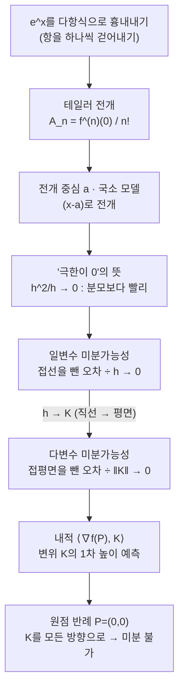

# 테일러 급수와 극한을 이용해서 미분 가능성의 정의 이해하기 (뉴진수 6강)

지난 시간에 적은 다변수 미분가능성 정의의 분자가 무엇을 뜻하는지 보겠습니다. 먼저 $e^x$를 다항식으로 흉내 내며 테일러 전개를 손으로 만들어 보고, 그 관점으로 "접선(접평면)을 뺀 나머지가 1차보다 작다"는 말을 해석한 뒤, 마지막에 지난번 반례를 새 정의에 다시 대입합니다.

---

## [0. 지난 정의에서 오늘 볼 분자 · ▶ 00:33](https://www.youtube.com/watch?v=nGqvWgyuzlw&t=33s)

지난 시간에 우리는 이변수 함수의 미분가능성을 이렇게 정의했습니다. 어떤 $\nabla f(P)$가 존재해서

$$
\lim_{\|K\|\to 0}\frac{\bigl|f(P+K)-f(P)-\langle \nabla f(P),K\rangle\bigr|}{\|K\|}=0
$$

을 만족하면 $f$가 $P$에서 미분가능하다고 부르기로 했습니다. 노트의 화살표를 따라가 보면, 이 정의에서 시작해 $\langle \nabla f(P),D\rangle$가 방향 $D$로의 방향미분계수와 같아야 한다는 것까지 유도됩니다. 내적을 나타내는 행렬이 단위행렬이면 $\nabla f(P)$가 자연스럽게 편미분 $\bigl(f_x,f_y\bigr)$로 떨어집니다(→ [전사본](<09. Meaning and Definition of the Derivative.md>) 참조).

그런데 저는 수학에서 "정의"라는 단어가 나올 때마다 조금 두렵습니다. 정의를 이해하는 게 제일 어려울 때가 많기 때문입니다. 오늘 하려는 이야기는 그 유도가 아니라, 저 분자

$$
f(P+K)-f(P)-\langle \nabla f(P),K\rangle
$$

가 무엇을 빼고 남긴 것인지, 그리고 이 값이 $0$이라는 게 무엇을 뜻하는지입니다. 실제 함수값 변화에서 선형 예측을 뺀 나머지가 얼마나 작은지를 묻는 식입니다.

## [1. \(e^x\)를 다항식으로 흉내내기 · ▶ 04:11](https://www.youtube.com/watch?v=nGqvWgyuzlw&t=251s)

직장인과 문과생을 위한 수학교실 4주차에서 지수함수 $a^x$를 배웠습니다. $a$에 넣을 수 있는 양수 중에 $2.71828\ldots$ 정도 되는 아주 특별한 값이 하나 있어서 이름을 붙여 $e$라고 부릅니다. 이름을 붙인다는 건 중요한 값이라는 뜻입니다. $y=e^x$는 미분해도 자기 자신이 그대로 나오는데, 이런 성질을 갖는 밑은 $e$뿐입니다.

$e^x$는 다항함수가 아니라 다항식으로 정확히 표현할 수는 없습니다. 그래도 계수를 잘 고르면 다항식으로 흉내, 적어도 근사는 낼 수 있지 않을까 하는 데서 출발합니다. 그래프를 그리면서 항을 하나씩 걷어 내 보겠습니다.

- $e^x$는 $x=0$에서 $1$을 지나므로 $1$을 뺍니다. 즉 $e^x-1$을 봅니다.
- $e^x-1$을 원점 근처에서 크게 확대하면 기울기가 $1$인 직선처럼 보입니다. 그래서 $x$를 뺍니다. 남는 $e^x-1-x$를 그려 보면 포물선과 거의 같습니다.
- 그 남은 부분은 $\tfrac{1}{2}x^2$과 겹치므로 다시 빼면, 다음으로 $\tfrac{1}{6}x^3$과 겹치는 부분이 나타납니다.

뺐던 것들을 다시 모으면

$$
e^x\approx 1+x+\frac{x^2}{2}+\frac{x^3}{6}
$$

같은 근사를 얻습니다. 실제로 $e^x$와 이 다항식을 겹쳐 그리면 $0$ 근처에서는 거의 포개집니다. 다만 범위를 $-1\le x\le 1$ 밖으로 넓히면 둘이 벌어집니다. 그래서 차수를 $10$차까지 올려 보면 더 넓은 범위에서 잘 맞습니다. 차수를 높일수록 중심점 근처에서 더 넓게 맞지만, 유한 차수 다항식은 결국 멀리 가면 다시 어긋납니다.

> **💭 생각해볼 점** 여러분 중 한 분이 "$e^x$의 그래프가 $(0,1)$을 지나는 건 규약인가요, 그래야만 하는 건가요?"라고 물었습니다. 직장인과 문과생을 위한 수학교실에서 다룬 대로, 정의역의 덧셈을 공역의 곱셈으로 보존하는 함수를 조사하면 $f(x)=a^x$ 꼴이 나오고, $f(0)=a^0$은 $0$ 아니면 $1$인데 공역이 $0$을 제외하므로 $f(0)=1$이 강제됩니다. 계산해 보니 $0$이 나오는 게 아니라, 세팅된 구조가 그것을 요구하는 것입니다.

## [2. 테일러 계수와 반복 미분 · ▶ 21:19](https://www.youtube.com/watch?v=nGqvWgyuzlw&t=1279s)

이제 계수가 어떻게 정해지는지 봅니다. $e^x$를 다항식

$$
e^x=A_0+A_1x+A_2x^2+A_3x^3+\cdots
$$

으로 쓸 수 있다고 두고 계수를 결정합니다. $x=0$을 넣으면 좌변이 $1$, 우변은 뒤 항이 다 사라지므로 $A_0=1$입니다. 양변을 미분하면 좌변은 그대로 $e^x$이고 우변은 차수가 하나씩 내려옵니다. 다시 $x=0$을 넣으면 $A_1=1$. 한 번 더 미분하면 $2A_2$가 남아 $A_2=\tfrac{1}{2}$, 또 한 번 미분하면 $3\cdot 2\,A_3$이 남아 $A_3=\tfrac{1}{6}$입니다.

여기서 패턴이 보입니다. 미분할 때마다 차수의 숫자가 하나씩 내려와 계수의 분모로 들어갑니다. $n$번 미분하고 $0$을 넣으면 살아남는 것은 $n!\,A_n$이므로

$$
A_n=\frac{f^{(n)}(0)}{n!}
$$

입니다. 그래서 $e^x$는

$$
e^x=\sum_{n=0}^{\infty}\frac{x^n}{n!}=1+x+\frac{x^2}{2!}+\frac{x^3}{3!}+\cdots
$$

으로, 여기서는 근사가 아니라 정확한 등호로 쓸 수 있습니다. 이런 표현을 테일러 전개(테일러 급수)라고 부릅니다. 같은 과정을 거치면, 적어도 미분 가능하기만 하다면 일반적인 함수도 비슷하게 전개됩니다. 식 자체의 유도는 따로 찾아보시면 좋고, 3Blue1Brown에도 관련 영상이 있습니다.

> 🧮 [계산 노트북](<03-season-assets/06/ipynb/09. Meaning and Definition of the Derivative-03-season-06.ipynb>) — $e^x$ 항 걷어내기·$A_n=f^{(n)}(0)/n!$ 검산, $\sin31^\circ$ 1차 근사, $h^2/h\to0$ 표, $e^x$ vs $|x|$ 미분가능성 비교 그래프.

> **💭 생각해볼 점** 한 참여자분이 "테일러 전개가 되려면 무한 번 미분 가능해야 하나요?"라고 물었습니다. 무한 번 가능하면 충분하지만, 한 번만 미분 가능한 함수도 있습니다. 예를 들어 $x\ge 0$에서 $x^2$, $x<0$에서 $-x^2$인 함수는 모든 점에서 한 번은 미분되지만, 그 도함수가 $2|x|$ 꼴이라 원점에서 두 번째 미분이 안 됩니다. 한편 실용적으로는 보통 $1$차나 $2$차까지만 쓰고 고차항을 무시해도 충분한 근사를 얻습니다.

## [3. 전개 중심 \(a\)와 국소 모델 · ▶ 27:46](https://www.youtube.com/watch?v=nGqvWgyuzlw&t=1666s)

테일러 전개는 미분 가능한 점 $x=a$ 근처에서 함수를 다항식으로 근사하는 도구입니다. $0$ 근처가 아니라 $a$ 근처를 보고 싶으면 $x$가 아니라 $x-a$의 거듭제곱으로 전개합니다.

$$
f(x)\approx f(a)+f'(a)(x-a)+\frac{f''(a)}{2}(x-a)^2+\cdots
$$

항을 몇 개 쓰느냐는 그 근처를 몇 차 함수로 볼 것이냐와 같은 말입니다. 첫 항만 쓰면 상수(수평선)로, 두 항까지 쓰면 접선(직선)으로, 세 항까지 쓰면 포물선으로 그 점 근처를 모델링하는 셈입니다.

예를 들어 $\sin 31^\circ$를 알고 싶을 때, $\sin 30^\circ=\tfrac{1}{2}$과 그 점의 기울기 $\cos 30^\circ=\tfrac{\sqrt3}{2}$을 알고 있으면 (각을 라디안으로 바꾸어) 1차 근사로 값을 추정할 수 있습니다. 중심점에서 멀어질수록 오차가 커지므로, 알고 싶은 지점 가까이에 전개 중심을 잡는 것이 자연스럽습니다.

> 🔧 [전개 중심 $a$와 국소 모델](<03-season-assets/06/html/taylor-local-model-03-season-06-03.html>)에서 직접 중심 $a$를 드래그하고 차수를 바꿔, 중심 근처에선 잘 맞다가 멀어지면 어긋나는 것을 확인해 보자.

## [4. "극한이 0" — \(h^2/h\)와 임의로 가까워진다는 말 · ▶ 47:35](https://www.youtube.com/watch?v=nGqvWgyuzlw&t=2855s)

미분가능성 정의에서 극한이 $0$이라는 말의 뜻을 짚고 가겠습니다. $\lim_{x\to\infty}\tfrac{1}{x}=0$이라고 쓰지만 $\tfrac{1}{x}$은 어떤 $x$에서도 정확히 $0$이 아니고, $\sum 1/2^n=1$이라고 쓰지만 앞쪽 유한 합은 항상 "짝수 분의 홀수"라 $1$이 될 수 없습니다. 그런데도 등호를 쓰는 이유는, 아무리 작은 양수를 가져와도 그보다 더 가까워질 수 있기 때문입니다. 이것이 입실론-델타가 말하는 등호입니다.

같은 이야기가 미분가능성의 분모에 그대로 적용됩니다.

$$
\frac{h^2}{h}=h \xrightarrow{\,h\to 0\,} 0
$$

여기서 분자 $h^2$도, 분모 $h$도 둘 다 $0$이 아닌데 몫은 $0$으로 갑니다. 핵심은 분자가 분모보다 더 빨리 작아진다는 점입니다. 그냥 오차가 작아진다고만 하면 연속성과 구분이 흐려지므로, 미분가능성은 오차를 $h$(또는 $\|K\|$)로 나눠 1차 크기보다 더 작은지를 묻습니다.

> **💭 생각해볼 점** 지난주 한 참여자분이 "분자도 분모도 $0$이 아닌데 $h^2/h$가 $0$으로 간다는 게 납득이 안 된다"고 하셨습니다. $h=0.1,\,0.01,\,0.001$로 줄여 가며 실제로 $h^2$와 $h$를 약분하지 않고 계산해 보면, 아무리 작은 양수를 정해도 이 몫을 그보다 더 작게 만들 수 있습니다. "두 수가 다르다면 그 사이에 어떤 수를 끼워 넣을 수 있어야 하는데 $0.999\ldots$와 $1$ 사이엔 아무 수도 못 넣으니 같다"는 설명과 같은 이야기입니다.

## [5. 왜 \(x-a\)를 쓰는가 · ▶ 56:02](https://www.youtube.com/watch?v=nGqvWgyuzlw&t=3362s)

한 참여자분이 물었습니다. "이미 $x,\,x^2,\ldots$로 전개해서 모든 함수를 표현할 수 있다면, 왜 굳이 $(x-a)$ 같은 더 복잡한 식을 따로 쓰는가?" 답은 전개 중심에 있습니다.

무한 차수까지 쓰면 어느 점에서 전개해도 결국 같은 함수를 복원하므로 차이가 없습니다. 그러나 실제로는 무한 번 할 수 없어 1차나 2차에서 끊습니다. 그러면 $x=0$ 근처에서 만든 2차 근사 포물선으로 $x=1$ 근처 값을 추정하면 어긋나고, $x=1$ 근처에서 만든 포물선과는 분명히 다릅니다. 그래서 알고 싶은 지점 $a$ 가까이에 중심을 두고 전개해야 같은 차수로 더 정확한 모델을 얻습니다. 이것이 $(x-a)$를 쓰는 공학적인 이유입니다.

$a$ 근처에서 $x=a+h$로 두면 $h=x-a$이고, 본래 모양은

$$
f(a+h)=f(a)+f'(a)h+\frac{f''(a)}{2}h^2+\cdots
$$

입니다. 이것을 $x$로 다시 쓰면 $(x-a)$가 나타나는 것입니다. 작은 것은 $x$ 자체가 아니라 기준점으로부터의 거리 $h$라는 점이 핵심입니다.

## [6. \(f(a)\)를 모르면 어떻게 쓰는가 · ▶ 1:05:30](https://www.youtube.com/watch?v=nGqvWgyuzlw&t=3930s)

또 한 분이 물었습니다. "우리가 $f(a)$를 몰라서 테일러를 쓰는 것 아닌가? 그런데 전개식에 $f(a)$가 들어가면 어떻게 하나?" 이 질문은 테일러의 쓰임을 분명하게 합니다.

테일러 전개는 아무것도 모르는 상태에서 값을 만들어 주는 마법이 아니라, 기준점 $a$에서의 함수값 $f(a)$와 도함수 $f'(a),f''(a),\ldots$를 알고 있을 때 그 근처의 다른 값을 추정하는 도구입니다. 우리가 모르는 것은 $f(a)$가 아니라 $a$ 근처 다른 점의 값입니다. 그래서 $\sin 30^\circ$와 그 도함수 값을 알면 $\sin 31^\circ$를 근사할 수 있지만, 기준점의 값도 도함수도 모르면 바로 쓸 수 없습니다. 한 점에서 아는 미분 정보로 근처 함수를 국소적으로 복원하거나 근사하는 것이 테일러 전개입니다.

## [7. 미분가능성: "직선을 그을 수 있다"를 식으로 · ▶ 1:11:50](https://www.youtube.com/watch?v=nGqvWgyuzlw&t=4310s)

저는 미분가능성을 "한 점 근방을 계속 확대하면 직선이 되고, 접선을 그을 수 있다"는 직관으로 즐겨 설명합니다. $e^x$는 $(0,1)$ 근처를 확대하면 직선이 되어 미분 가능하고, $|x|$는 원점에서 접선을 그을 수 없어 미분 불가능합니다. 이 직관을 식으로 옮겨 봅니다. $a$ 근처에서

$$
f(a+h)\approx f(a)+h\,f'(a)
$$

로 쓰고 싶고, $h\to 0$이면 근사 기호가 사라질 것 같습니다. 그런데 이대로는 안 됩니다. 왜냐하면 $e^x$의 $x=0$에서 기울기를 (틀리게) $2$라고 우겨도, 또 그 점을 지나는 아무 직선의 기울기를 넣어도

$$
\lim_{h\to 0}\bigl[f(a+h)-f(a)-h\cdot(\text{기울기})\bigr]=0
$$

이 성립합니다. $|x|$의 원점처럼 미분 불가능한 점에서도 아무 직선이나 통과시키면 이 극한은 $0$입니다. 그러니 이 식만으로는 미분가능성을 전혀 설명하지 못합니다. 분자가 단순히 $0$으로 가는 것은 (함수가 연속이면) 당연할 뿐이고, 진짜 조건은 그것이 1차보다 더 빨리 작아지는 것입니다.

이를 보이려고 2차 근사를 씁니다. 미분 가능한 점은

$$
f(a+h)=f(a)+h\,f'(a)+\frac{f''(a)}{2}h^2+\cdots
$$

로 쓸 수 있으므로, 접선 두 항을 넘기면 좌변 $f(a+h)-f(a)-hf'(a)$는 $h$에 대한 2차(이상) 항만 남습니다. 그러면

$$
\lim_{h\to 0}\frac{f(a+h)-f(a)-h\,f'(a)}{h}=0
$$

입니다. $h^3,h^4,\ldots$이 더 붙어도 $h^2$보다 더 빨리 줄어드니 상관없습니다. 바로 이 분모 $h$가, 지난 단원 노트에서 "분자도 $0$으로 가야 한다"고 적었던 식이 오해를 부르기 쉬운 지점을 정확히 메웁니다(→ [전사본](<09. Meaning and Definition of the Derivative.md>) 참조). 핵심은 "분자가 $0$으로 간다"가 아니라 "분모보다 더 빨리 작아진다"입니다.

> **💭 생각해볼 점** "2차까지 근사가 된다"는 말이 "적어도 두 번은 미분이 돼야 한다"는 말과 같은지 한 분이 물었습니다. 여기서 핵심은 두 번째 식에서 세 번째 식을 *유도*한 것이 아니라는 점입니다. 2차 근사가 성립한다고 *가정*하면 분자가 $h^2$ 꼴이 되어 $h^2/h$처럼 극한이 $0$이 된다는 흐름입니다.

## [8. 다변수에서는 평면을 뺀 오차를 본다 · ▶ 1:21:55](https://www.youtube.com/watch?v=nGqvWgyuzlw&t=4915s)

일변수에서 "확대하면 직선이 된다"였다면, 다변수에서는 "확대하면 평면이 된다"입니다. $f:\mathbb{R}^2\to\mathbb{R}$의 그래프는 곡면이고, 한 점에서 미분 가능하면 충분히 확대했을 때 접평면처럼 보여야 합니다. 그 접평면이 주는 선형 변화량이 $\langle \nabla f(P),K\rangle$입니다. 따라서 실제 높이 변화 $f(P+K)-f(P)$에서 이 선형 예측을 뺀 오차가 $\|K\|$보다 더 빨리 작아지는지를 봅니다.

복잡한 이변수 함수의 곡면도 한 점에서 $X,Y$ 범위를 $0.1$, $0.01$로 좁혀 가며 확대하면 거의 평면이 됩니다. 반대로 지난 시간의 뾰족한 반례는 원점 근처를 아무리 확대해도 평면이 아니라 같은 뾰족한 형태만 남습니다. 그래서 그 점에서는 미분가능성을 말할 수 없습니다.

일변수의 접선 식이
$$
f(a+h)\approx f(a)+f'(a)h
$$
였다면, 다변수의 접평면 식은
$$
f(P+K)\approx f(P)+\langle \nabla f(P),K\rangle
$$
입니다. 차이는 $h$가 숫자인가, $K$가 벡터인가입니다. 벡터가 되면 방향을 고정하지 않은 모든 작은 이동을 한꺼번에 다뤄야 합니다.

## [9. \(\langle\nabla f(P),K\rangle\)의 의미와 \(dy=f'(x)\,dx\) · ▶ 1:27:00](https://www.youtube.com/watch?v=nGqvWgyuzlw&t=5220s)

마지막 식의 내적이 왜 거기 있느냐는 물음이 나왔습니다. 내적 $\langle \nabla f(P),K\rangle$는, $\nabla f(P)$를 $K$ 방향으로 사영(프로젝션)하고 $K$의 크기를 곱한 양 — 즉 변위 $K$가 주어졌을 때 접평면이 예측하는 높이 변화로 읽으면 됩니다. 곡면 위에서 $P$와 $P+K$의 높이 차 $f(P+K)-f(P)$를, 바로 이 접평면 위 벡터가 주는 높이 변화로 근사할 수 있어야 한다는 뜻입니다. 여기서 $K$는 우리가 임의로 정하는 벡터이고 $\nabla f(P)$는 그 점에서 고정입니다. (한 참여자분의 욕심처럼 $\langle\nabla f(P),K\rangle$을 그대로 "높이"로 그리고 싶지만, 그것은 접평면이라는 다른 공간의 값이라 같은 높이로 상상되지는 않습니다.)

$dx,dy$ 표기도 같은 직관입니다. 정미경 선생님이 남긴 선형 차분(수치미분) 그림처럼, 접선의 기울기를 직접 구하기 어려우면 가까운 두 점으로 $\dfrac{\Delta y}{\Delta x}$를 잡습니다. $\Delta x$를 점점 줄이면 삼각형이 작아지고, 미분 가능한 점은 확대하면 직선이 되므로

$$
\frac{\Delta y}{\Delta x}\;\longrightarrow\; f'(x),\qquad dy=f'(x)\,dx
$$

로 씁니다. 이것은 실제 변화량 전체가 아니라 접선이 예측하는 1차 변화량입니다. (다만 "$dx,dy$가 정확히 무엇인가 — $0$은 아니지만 무한히 작은 값"이라는 물음은 오늘 직관 수준에서만 다루고, 접벡터를 접벡터로 보내는 사상 정도로만 언급하고 넘어갔습니다.)

> **📚 참고·응용** 수치해석에서 테일러 급수는 안 풀리는 문제를 컴퓨터로 풀 때 함수 근사의 핵심 도구로 쓰입니다. 물리(예: 양자역학)에서도 보통 1차, 많아야 2차까지 전개해 계산하는 일이 흔합니다.

## [10. 반례의 원점에 \(P=(0,0)\)을 넣어 보기 · ▶ 1:52:06](https://www.youtube.com/watch?v=nGqvWgyuzlw&t=6726s)

마지막으로 지난 시간의 반례를 새 정의에 다시 대입했습니다. 흐름은 (1) 방향미분이 존재한다고 두고, (2) 그 가정 아래 내적과의 관계를 적은 뒤, (3) 정의에 $P=(0,0)$을 넣어 확인하는 순서입니다. 미분은 한 점에서 정의하므로 $P$는 고정이고, 원점에서의 미분가능성을 보려면 $P=(0,0)$으로 놓고 $K$만 $0$으로 보냅니다.

방향별로 $K=hd$처럼 직선만 따라가면 둘째 가정에 의해 다 $0$이 되어 문제가 감춰집니다. 그러나 정의에서 $K$는 길이만 줄어드는 게 아니라 방향까지 임의로 바뀌며 원점으로 들어옵니다. 그래디언트 후보가 $(0,0)$이면 선형 예측항이 사라지므로 정의의 몫은 본질적으로

$$
\frac{|f(K)-f(0)|}{\|K\|}
$$

가 됩니다. 함수값이 튀는 영역(녹색 영역) 안에서 원점으로 가는 경로를 따라 $K$를 잡으면 분자는 작아지지 않는데 분모만 $0$으로 가므로, 극한은 $0$이 될 수 없습니다. 그래서 이 함수는 원점에서 미분 불가능합니다.

> **💭 생각해볼 점** 미분가능성 정의에서 $P$와 $K$의 역할을 나누어 말해 봅시다. $P$는 "검사하는 한 점"이고, $K$는 "그 점으로 들어오는 모든 작은 변위"입니다. 방향을 고정한 직선 접근만으로는 보이지 않던 차이가, 임의의 $K\to 0$을 허용하면 드러납니다.

> **📚 참고·응용** $\langle\nabla f(P),K\rangle$의 내적은 $\mathbb{R}^2\to\mathbb{R}$로 가는 경우의 표현입니다. 일반적으로 $n$차원에서 $m$차원으로 가는 사상의 미분은 내적이 아니라 선형사상으로 정의되므로, 더 일반적인 정의는 따로 찾아보면 좋습니다.

---

오늘 흘러온 줄거리를 한눈에 — 테일러로 "국소 다항식 근사"를 손에 쥔 뒤, 그것으로 일변수·다변수의 미분가능성을 "오차가 1차보다 더 빨리 작아진다"로 읽는 흐름입니다.

---

## 요약

- $e^x$에서 상수항, 1차항, 고차항을 차례로 걷어 내면 테일러 전개 $e^x=\sum x^n/n!$가 손으로 만들어진다. 계수는 $A_n=f^{(n)}(0)/n!$이다.
- 테일러 전개는 미분 가능한 점 $a$ 근처에서 함수를 다항식으로 보는 국소 모델이며, 항 수는 그 점을 몇 차 함수로 볼지를 정한다. 알고 싶은 지점에 중심을 두려고 $(x-a)$로 전개한다.
- 극한이 $0$이라는 말은 단순 대입이 아니라, 아무리 작은 양수보다도 더 작아질 수 있다는 뜻이다($h^2/h\to 0$).
- 일변수 미분가능성은 $f(a+h)-f(a)-hf'(a)$가 $h$보다 더 빨리 작아진다는 조건으로 읽는다. 분자가 $0$으로 가는 것만으로는 부족하다.
- 다변수에서는 접선 대신 접평면을 빼고 오차를 $\|K\|$와 비교한다. $\langle\nabla f(P),K\rangle$는 변위 $K$에 대한 접평면의 1차 높이 예측이다.
- 반례를 원점에 다시 대입하면, $P$는 고정하고 $K$를 모든 방향으로 보내야 하므로 방향별 검사로는 감춰졌던 미분 불가능성이 드러난다.
</content>
</invoke>
