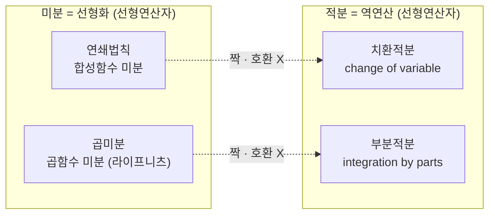

# [직장인과 문과생을 위한 수학교실 4기] 21. 미적분학 훈련 설계

이번 시간에는 미분이 무엇이고 적분이 무엇인지를, 선형대수에서 다룬 이야기와 이어서 살펴봅니다. 미분을 "선형화"로 보는 관점에서 출발해 미분이 만족하는 두 성질(연쇄법칙·곱미분), 기본 함수들의 미분, 그리고 그 역연산으로서의 적분과 적분이 만족하는 두 성질(치환적분·부분적분)까지 차례로 짚어 보겠습니다.

> 🧮 [계산 노트북](<04-season-assets/21/ipynb/09. Meaning and Definition of the Derivative-04-season-21.ipynb>) — 할선→접선 극한, 기본·합성·곱 미분, 미분의 역연산(적분)을 SymPy/NumPy로 검산.

## [0. 미분과 적분이 들어오는 맥락 — 선형화와 그 역 · ▶ 1:02:42](https://www.youtube.com/watch?v=k8x1wbGPhR8&t=3762s)

선형적인 대상을 다루는 것이 선형대수였습니다. 그러면 미분과 적분은 어디에서 들어오는가. 한마디로 말하면, **선형적이지 않은 대상(함수)을 선형화하는 것이 미분이고, 그것을 역으로 되돌리는 것이 적분**입니다.

이 한 문장이 오늘 이야기의 출발점입니다. 선형대수에서는 이미 선형인 대상들을 다뤘다면, 미분은 그렇지 않은 함수를 선형인 함수로 바꾸는 행위입니다.

곡선(선형이 아닌 함수)을 한 점 $a$ 근방에서 가장 잘 흉내 내는 직선이 접선이고, 그 접선이 곧 미분이 만들어 내는 **선형화**입니다. 접선의 기울기 $f'(a)$ 는 할선의 기울기를 $h\to0$ 으로 보내는 극한에서 추출됩니다.

> 🔧 [할선→접선 탐험기](<04-season-assets/21/html/secant-to-tangent-explorer-04-season-21-00.html>)에서 직접 $h$ 를 줄이고 접점 $a$ 를 끌며 할선 기울기가 $f'(a)$ 로 수렴하는 것을 확인해 보자.

## [1. 선형함수의 합성과 행렬곱이 왜 같은가 · ▶ 1:03:23](https://www.youtube.com/watch?v=k8x1wbGPhR8&t=3803s)

여기서 한 가지 확인하고 넘어갑시다. **선형함수의 합성과 행렬의 곱이 왜 같은가요?**

여러분 중 한 분이 답하셨듯이, 행렬은 결국 **선형함수의 또 다른 표기**라고 보면 됩니다. 선형함수를 합성한 결과를 행렬의 곱 형태로 적어 보면 그 둘이 일치한다 — 이 관찰을 근거로, 행렬이 선형함수의 다른 표기라고 말하는 것입니다.

우리가 선형대수를 시작한 길을 되짚어 보면 이렇습니다. 군 구조를 도입할 때, 처음에는 익숙한 덧셈·곱셈을 기준으로 군을 이야기했지만, 그다음에는 **일대일대응 함수들의 합성**을 기준으로 군 구조를 도입했습니다. 그리고 그 일대일대응 함수들 중에서 **선형함수**를 골라 보니, 선형함수의 합성으로부터 행렬들의 모임에도 군 구조가 주어졌습니다. 그래서 행렬곱을 토대로 항등행렬·역행렬 같은 것들을 생각할 수 있었던 것이고요. 즉 "왜 행렬이 나오느냐"는 물음의 답은, 함수의 합성을 기준으로 함수들의 모임에 군 구조를 생각할 수 있고 그중 선형함수를 보면 행렬곱이 나온다는 데 있습니다.

따라서 행렬은 말 그대로 선형함수의 다른 표기입니다. (물론 이 표기를 가지고 더 일반화·추상화하는 데에는 그다음의 관문들이 많습니다.)

> **💭 생각해볼 점** 선형함수의 합성과 행렬곱이 왜 같은지, 직접 두 선형함수를 합성한 결과와 그 행렬들을 곱한 결과를 적어 비교해 보고 같음을 확인해 봅시다.

## [2. 미분의 두 성질 — 연쇄법칙과 곱미분 · ▶ 1:05:48](https://www.youtube.com/watch?v=k8x1wbGPhR8&t=3948s)

이제 일변수 미분을 기준으로 이야기합시다. 일변수 미분에는 가장 중요한 **두 가지 성질**이 있습니다.

- **연쇄법칙 (chain rule)** — 합성함수의 미분법.
- **곱미분 (product rule, 라이프니츠 법칙)** — 곱함수의 미분법.

영국식이냐 아니냐에 따라 라이프니츠 법칙이라 부르기도 하지만, 여기서는 곱미분(프로덕트 룰)과 연쇄법칙(체인 룰) 두 가지로 부르겠습니다.

엄밀하게 말하면, **미분이라는 것 자체가 이 두 성질을 만족하는 선형연산자(linear transformation)로 정의됩니다.** 미분 앞에는 여러 형용사를 붙일 수 있지만, 어떤 선형연산자가 연쇄법칙과 곱미분 이 두 가지를 만족하면 그것을 미분이라 부른다는 것입니다.

## [3. 미분 = 자코비안 행렬의 추출, 그리고 두 법칙이 갈리는 이유 · ▶ 1:07:30](https://www.youtube.com/watch?v=k8x1wbGPhR8&t=4050s)

조금 더 격식을 갖춰 말하면, **미분이란 자코비안 행렬(Jacobian matrix)을 추출하는 행위**입니다. 함수가 주어졌을 때 거기서 행렬을 뽑아내는 것이 미분이라고 보면 됩니다.

그런데 행렬을 추출하는 데 있어,
- **함수 두 개를 곱해서** 행렬을 추출하는 것과
- **함수 두 개를 합성해서** 행렬을 추출하는 것이

근본적으로 다릅니다. 바로 여기서 곱미분과 연쇄법칙이 갈립니다.

선형함수의 재미있는 점은, **이미 선형이 되어 있을 때는** 선형함수의 합성과 행렬의 곱이 완전히 일치한다는 것입니다. 그런데 미분은 **선형이 아닌 것을 선형화하는** 행위입니다. 선형이 이미 되어 있는 상태가 아니라, 선형화하는 과정에서 보면 — 함수 두 개를 곱한 것의 선형화와, 함수 두 개를 합성한 것의 선형화는 서로 다릅니다. 그래서 이 둘을 구분해 다뤄야 한다는 것이 미분의 가장 근본적인, 도구적으로 반드시 구분해야 하는 지점이고, 이를 각각 연쇄법칙·곱미분이라 부르는 것입니다.

$$
f, g \ \text{가 미분가능할 때}\quad (g\circ f)'(x)=g'\!\bigl(f(x)\bigr)\,f'(x), \qquad (fg)'(x)=f'(x)\,g(x)+f(x)\,g'(x)
$$

> **💭 생각해볼 점** 한 참여자분이 "선형화하기 전에는 군 구조가 없는데 선형화하면 군 구조가 생기는 것이냐"고 물었습니다. 그보다는 조금 더 동적인 관점이 좋습니다. 미분은 함수를 **선형함수로 바꾸는 행위 자체**를 가리킵니다. 이미 선형함수들에 대해서는 군 구조를 논할 수 있지만, 미분이 손대는 대상인 함수들은 선형함수가 아닙니다. 그래서 곱의 선형화와 합성의 선형화를 구분해서 다뤄야 한다 — 이것을 음미해 보면 좋겠습니다.

## [4. 기본 함수들의 미분 — 다항·지수·로그·삼각 · ▶ 1:11:18](https://www.youtube.com/watch?v=k8x1wbGPhR8&t=4278s)

미분을 다룰 때는 도함수의 정의(극한)부터 꺼내지 말고, 함수 $f$ 가 주어졌을 때 $f'$ 을 구하는 규칙을 보드게임 규칙처럼 익히는 것을 먼저 목표로 합니다. 그러려면 기본 함수들의 미분이 막힘없이 나와야 합니다.

기본 함수는 다음을 포함해야 합니다.

1. **다항함수** — 임의의 형태에 대해. 예를 들어 $f(x)=2x^2+3x+1$ 이면 $f'(x)=4x+3$ 이 곧바로 나와야 합니다.
2. **초월함수** — 대표적으로 **지수함수**. 지수는 오일러 수를 기준으로 한 $e^x$ 로 잡는 것이 좋습니다($\frac{d}{dx}e^x=e^x$). 그리고 자연로그로 만드는 **로그함수**, 그리고 **사인·코사인·탄젠트**.

삼각함수의 기본 미분은 다음과 같이 곧바로 답이 나와야 합니다.

$$
(\sin x)'=\cos x, \qquad (\cos x)'=-\sin x, \qquad (\tan x)'=\sec^2 x
$$

이런 기본 형태들은 일단 외우는 것이 가장 좋습니다.

## [5. 편미분 — 본질적으로 일변수 미분 · ▶ 1:13:54](https://www.youtube.com/watch?v=k8x1wbGPhR8&t=4434s)

기본 꼴이 잡히면 그다음은 변수를 두 개로 늘리는 것입니다. $\sin x$ 를 미분할 줄 알면 $\sin(xy)$ 같은 것도 생각할 수 있습니다.

여기서 핵심은, **편미분은 사실상 일변수 미분과 같다**는 것입니다. 변수를 $x$ 하나로만 보지 않고 $y$ 까지 두어, $f(x,y)$ 가 주어질 때 $x$ 에 대한 편미분과 $y$ 에 대한 편미분을 따로따로 — 즉 미분하는 변수만 변수로 보고 나머지는 상수처럼 취급하면 됩니다.

$$
\frac{\partial f}{\partial x}, \qquad \frac{\partial f}{\partial y}
$$

## [6. 연쇄법칙과 곱미분을 섞기 · ▶ 1:14:15](https://www.youtube.com/watch?v=k8x1wbGPhR8&t=4455s)

기본 꼴이 잡히면 이제 연쇄법칙과 곱미분을 섞어 갑니다.

- **곱미분**: 함수 두 개를 곱해 놓고 미분.
- **연쇄법칙**: 함수 두 개를 합성해 놓고 미분. 예를 들어 $e^{-x^2}$ 처럼 합성함수가 되면 연쇄법칙을 써야 합니다. $\sin(x^3+2x)$ 의 미분도 마찬가지입니다.

합성·곱에 쓰는 함수들은 앞에서 익힌 다항·지수·로그·사인·코사인·탄젠트입니다. 이것들을 어떤 때는 곱하고 어떤 때는 합성해서, 그 미분이 막힘없이 나오도록 합니다.

구체적인 확인 예시를 들면:

- $\sin(x^2)$ 의 미분 $\ \Rightarrow\ \cos(x^2)\cdot 2x$
- $\ln(x^3)$ 의 미분 $\ \Rightarrow\ \dfrac{1}{x^3}\cdot 3x^2=\dfrac{3}{x}$ (안쪽 $x^3$ 에 대해 연쇄법칙을 적용하고, 상수 $3$ 은 분자로 올라옵니다)

유리함수 꼴은 결과적으로 등장하게 됩니다. $\ln x$ 의 미분이 $\frac1x$ 라는 유리함수 꼴이기 때문입니다. 다만 유리함수의 미분 공식을 따로 외울 필요는 없습니다. 예를 들어 $\dfrac{x+1}{x+2}$ 의 미분은 $(x+1)(x+2)^{-1}$ 로 보아 곱미분과 연쇄법칙을 동시에 쓰면 됩니다. (유리함수는 미분보다 오히려 적분 쪽에서 더 중요합니다.)

> **✏️ 연습문제** 다음을 미분해 봅시다. $\sin(x^2)$, $\ln(x^3)$, $\tan x$, $\ln x$, 그리고 두 몬스터가 합쳐진 $\sin(\tan x)$, $\sin(\tan(x^2))$. 모두 머뭇거림 없이 답이 나오도록.

## [7. 적분 — 미분의 역연산 · ▶ 1:20:40](https://www.youtube.com/watch?v=k8x1wbGPhR8&t=4840s)

연쇄법칙과 곱미분이 막힘없이 나오는 단계가 되면, 이제 그것을 **반대로** 해 봅니다.

지금까지 묻던 규칙은 "$f$ 가 주어졌을 때 $f'$ 을 구하라"였습니다. 이번에는 반대로, "$f'$ 이 주어졌을 때 $f$ 를 구하라"입니다. 같은 질문을 거꾸로 따라가는 것입니다.

예를 들어 $\ln x$ 의 미분이 $\frac1x$ 이면, 거꾸로 $\frac1x$ 의 적분은 $\ln x$ 입니다. 정확히는

$$
\int \frac{1}{x}\,dx = \ln x + C
$$

상수 $C$ 까지 붙여야 합니다. 같은 값을 두고도 누군가는 $\int \frac{3}{x}\,dx = 3\ln x + C$ 라 답하고, 누군가는 $\ln(x^3)+C$ 라 답할 수 있는데 — 생각은 모두 거꾸로 잡히는 것입니다.

미분을 거쳐 본 형태가 적분의 출발점이 됩니다. 예를 들어 $\sin(x^2)$ 을 미분하면 $\cos(x^2)\cdot 2x$ 이고, 거꾸로

$$
\int 2x\cos(x^2)\,dx = \sin(x^2) + C
$$

가 나와야 합니다. 즉 적분의 첫 단계는 미분의 역연산으로 묻는 것이고, 이때는 연쇄법칙·곱미분이 간파되는 형태를 가지고 물어야 합니다. 기본 함수의 적분부터 — 예를 들어 $\int \sin x\,dx = -\cos x + C$ (부호에 주의) — 곧바로 나오도록 합니다.

## [8. 적분의 두 성질 — 치환적분·부분적분, 그리고 호환성 문제 · ▶ 1:25:01](https://www.youtube.com/watch?v=k8x1wbGPhR8&t=5101s)

적분에도 두 가지 성질이 있습니다.

- **치환적분 (change of variable)**
- **부분적분 (integration by parts)**

여기서 "성질"이라는 단어를 쓰는 까닭은 이렇습니다. 사실 미분·적분 앞에는 온갖 형용사를 붙일 수 있지만, 우리가 **미적분이라고 인정하는 것은 이 법칙들이 성립할 때**입니다. 미분의 성질인 연쇄법칙·곱미분, 적분의 성질인 부분적분·치환적분이 성립할 때 비로소 미적분학이라 부르는 것입니다.

미적분학이 어려워지는 근본 이유는 **이 두 쌍이 서로 호환되지 않는다**는 데 있습니다. 대응 관계를 보면:

- 곱함수의 미분법(곱미분) ↔ **부분적분**
- 합성함수의 미분법(연쇄법칙) ↔ **치환적분**

이렇게 짝이 지어지지만, **정확히 호환되지는 않습니다.** 그래서 어려워집니다. 미분에서 하나를 안다고 적분에서 곧바로 하나를 아는 것이 아닙니다. 이 때문에 "미분과 적분은 역연산 관계"라는 말은 여러 의미에서 오해의 소지가 있습니다. 그럼에도 이 호환성을 만들어 내는 것이 미적분학의 기본이라 할 수 있습니다.

또 한 가지 감을 잡아 둘 것이 있습니다. **자연계에 존재하는 적분의 대부분은 인간이 손으로 계산할 수 없습니다.** 책에서 보는 것들은 아주 예외적으로 계산이 되는, 운 좋은 경우들만 들여다보고 있는 것입니다. 예컨대 $x^{x^x}$ 의 적분이나 $x^{\sin x}$ 의 적분은 우리가 모릅니다 — 그런 함수가 자연계에 얼마든지 있을 수 있습니다.

> **💭 생각해볼 점** 미분의 두 성질(연쇄·곱)과 적분의 두 성질(치환·부분)은 짝이 지어지지만 정확히 호환되지 않는다 — 미분을 익혔다고 적분이 자동으로 따라오지 않는 이유가 여기에 있습니다. "미분과 적분은 역연산"이라는 말이 왜 오해를 부르는지 음미해 봅시다.

> **📚 참고·응용** 적분을 더 깊이 훈련하려면(부분적분·치환적분을 넘어서면) 다음 층은 **미분형식(differential form)의 계산**으로 넘어갑니다. 오늘날의 수학에서는 집합조차 벗어나는, 이발사의 역설(러셀의 역설)이 성립하는 콜렉션 위에서도 미적분을 수행할 수 있는데, 이를 배우는 길이 미분형식의 적분입니다. 다만 미분형식 계산에는 선형대수에 대한 전공 수준의 훈련(예: 사용 계수 등의 연역)이 반드시 전제됩니다.

## [9. 미분·적분은 모두 선형연산자 — 그리고 그 너머 · ▶ 1:36:18](https://www.youtube.com/watch?v=k8x1wbGPhR8&t=5778s)

> **💭 생각해볼 점** 한 참여자분이 "미분이 두 성질을 만족하는 선형연산자라면, 적분도 선형연산자인가요?"라고 물었습니다.

그렇습니다. **미분과 적분은 모두 선형연산자(linear transformation)이고, 따라서 본질적으로 선형대수의 대상입니다.** 다만 일반적인 선형연산자가 아니라, 앞서 본 두 가지 성질을 만족하는 독특한 선형연산자로 정의됩니다.

게다가 이런 미분·적분은 하나가 아닙니다. 우리가 지금 보는 것은 오일러 시절부터 내려온 고전적인 미분·적분이고, 오늘날에는 이를 완전히 초월한 방식의 미분·적분도 많이 고안되어 있습니다. 지금 여러분 시점에서는 미분을 하려면 $\mathbb{R}^1$ 같은 집합, 열린구간(open interval) 같은 곳이어야 하지만, 오늘날 수학에서는 그런 예쁜 공간뿐 아니라 집합을 초월하는 범주에서도 미적분을 수행하는 것이 가능합니다. 그리고 그것을 배우는 길이 바로 미분형식의 적분입니다.

> **💭 생각해볼 점** 또 한 참여자분이, 무지개 정리(특이값 분해와 관련된)와 미분·선형대수의 연결고리가 궁금하다고 물었습니다. 함수의 함수값을 선형화하는 것이 미분이라고 한다면, 이변수 기준 — 입력이 둘, 출력이 둘인 경우 — 으로 선형화해 보면 $2\times2$ 행렬이 정확히 나옵니다. 그 선형화가 실제로 무엇을 뜻하는지를 직관에서 설명하는 데까지 가면, 선형대수에서 했던 이야기들이 그대로 적용됩니다. 더 나아가 이것이 왜 리만(Riemann)의 수학으로 이어지는지를 보려면, 먼저 무지개 정리(타원들이 겹쳐 그려진 그림)를 직관적으로 이해하는 것이 필요합니다.

## 요약

- 미분과 적분이 들어오는 맥락: **선형적이지 않은 함수를 선형화하는 것이 미분, 그 역으로 되돌리는 것이 적분.**
- 선형함수의 합성과 행렬곱이 같은 이유: 행렬은 선형함수의 다른 표기다. 일대일대응 함수들의 합성으로 군 구조를 도입하고, 그중 선형함수를 보면 행렬곱이 나온다.
- 미분은 **연쇄법칙(합성함수)과 곱미분(곱함수, 라이프니츠)** 두 성질을 만족하는 선형연산자로 정의된다. 격식을 갖추면 미분은 **자코비안 행렬을 추출하는 행위**다.
- 이미 선형인 경우엔 합성=행렬곱이 일치하지만, **선형화 과정에서는 곱의 선형화와 합성의 선형화가 달라** 두 법칙이 갈린다.
- 기본 미분 형태를 외운다: 다항함수, $e^x$, $\ln x$, $(\sin x)'=\cos x$, $(\cos x)'=-\sin x$, $(\tan x)'=\sec^2 x$. **편미분은 본질적으로 일변수 미분**(나머지 변수는 상수 취급).
- 기본 꼴이 잡히면 연쇄법칙·곱미분을 섞는다(예: $e^{-x^2}$, $\sin(x^3+2x)$, $\sin(\tan x)$). 유리함수 미분 공식은 외울 필요 없이 곱미분+연쇄법칙으로 처리.
- 적분은 미분의 역연산으로 시작: $f'$ 이 주어졌을 때 $f$ 를 구한다. 예) $\int\frac1x dx=\ln x+C$, $\int 2x\cos(x^2)dx=\sin(x^2)+C$.
- 적분의 두 성질은 **치환적분·부분적분**. 미분의 두 성질과 짝(곱미분↔부분적분, 연쇄법칙↔치환적분)을 이루지만 **정확히 호환되지 않아** 미적분이 어려워진다. 자연계의 적분 대부분은 손으로 계산되지 않는다.
- 미분·적분은 모두 선형연산자이며 선형대수의 대상이다. 고전적 미적분을 넘어서는 길(집합을 초월하는 범주에서의 미적분)은 **미분형식의 적분**으로 열린다.
