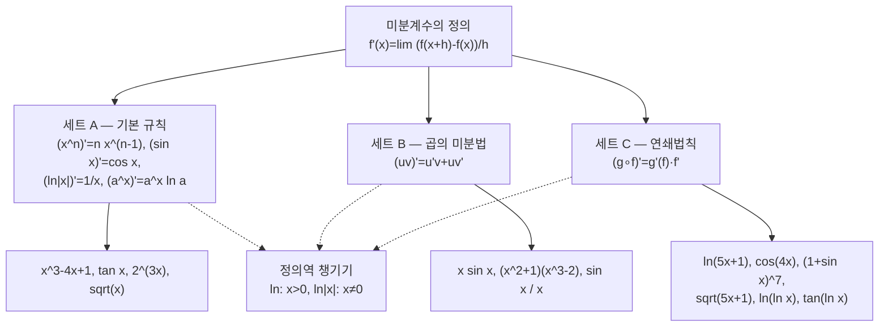

# 22. 미분계산 연습과 나의 감상 나누기

오늘은 일변수 함수의 미분을 손에 익히는 계산 드릴입니다. 세트 A(다항·기본함수), 세트 B(곱의 미분법), 세트 C(연쇄법칙) 순서로, 각 세트마다 서로 문제를 내고 풉니다. (세트 D는 적분이라 오늘은 C까지만 합니다.)

오늘 드릴의 짜임새와, 모든 규칙이 결국 어디로 돌아가는지를 한눈에:

> 🧮 [계산 노트북](<04-season-assets/22/ipynb/09. Meaning and Definition of the Derivative-04-season-22.ipynb>) — 세 세트의 미분 결과를 SymPy로 재확인하고 정의 극한 $\frac{\sin(x+h)-\sin x}{h}\to\cos x$ 를 그래프로 봅니다.

---

## [0. 세트 A — 다항·기본함수 미분 · ▶ 01:45](https://www.youtube.com/watch?v=4ERGYoWL4LI&t=105s)

세트 A는 다항함수·기본 초월함수의 미분입니다. 주고받은 형태들을 모으면 다음과 같습니다.

$$
\frac{d}{dx}\tan x = \sec^2 x,\qquad
\frac{d}{dx}\,x^{-4} = -4x^{-5},\qquad
\frac{d}{dx}\sqrt{x} = \tfrac{1}{2}x^{-1/2}
$$

$$
\frac{d}{dx}\,x^{-2} = -2x^{-3},\qquad
\frac{d}{dx}\sin x = \cos x,\qquad
\frac{d}{dx}\sec^2 x \ (\text{코시컨트·시컨트 류})
$$

$$
\frac{d}{dx}\ln|x| = \frac{1}{x}\ \ (x\neq 0),\qquad
\frac{d}{dx}\,2^{3x} = 3\cdot 2^{3x}\ln 2 \ \ (\text{지수의 합성})
$$

지수함수 $2^{3x}$ 에서 한 분이 처음에 $3\cdot 2^{3x}$ 까지만 말씀하셨는데, 밑이 $2$ 인 지수의 미분에는 $\ln 2$ 가 따라오고, 지수 $3x$ 가 합성되어 있으니 $\times 3$ 도 함께 곱해집니다 ($\to$ [전사본](09.%20Meaning%20and%20Definition%20of%20the%20Derivative.md)의 연쇄법칙 참조). 여기서 잠깐 나온 이야기로, $3\cdot 2^{3x}$ 가 $9\cdot 8^{x}$ 와 같은지 궁금해하신 분이 있었는데, $2^{3x}=(2^3)^x=8^x$ 이므로 맞습니다.

> **✏️ 연습문제 (세트 A)** 위에 모인 형태들을 직접 미분해 보세요: $\tan x$, $x^{-4}$, $\sqrt{x}$, $x^{-2}$, $\sin x$, $\ln|x|$, $2^{3x}$, 그리고 다항 $x^3-4x+1$.

---

## [1. 세트 A — 전체 한 바퀴 · ▶ 09:44](https://www.youtube.com/watch?v=4ERGYoWL4LI&t=584s)

세트 A에서 확인한 결과들입니다.

- $\dfrac{d}{dx}\,7 = 0$ (상수의 미분)
- $\dfrac{d}{dx}\tan x = \sec^2 x$
- $\dfrac{d}{dx}\,2^{3x} = 3\cdot 2^{3x}\ln 2$ — 합성함수라 안쪽 $3x$ 의 미분 $3$ 과 $\ln 2$ 가 곱해집니다.
- $\dfrac{d}{dx}\ln x = \dfrac{1}{x}$ — 다만 정의역은 $x>0$ 입니다.
- $\dfrac{d}{dx}\big(\sin x + \cos x\big) = \cos x - \sin x$
- $\dfrac{d}{dx}\sqrt{x} = \dfrac{1}{2}\,\dfrac{1}{\sqrt{x}}$
- $\dfrac{d}{dx}\big(\ln x + 2\ln|x|\big) = \dfrac{1}{x}+\dfrac{2}{x}=\dfrac{3}{x}$ — 정의역 주의 ($x>0$)
- $\dfrac{d}{dx}\big(x^3-4x+1\big) = 3x^2-4$
- $\dfrac{d}{dx}\,x^{-2} = -2x^{-3}$
- $\dfrac{d}{dx}\ln|x| = \dfrac{1}{x}$ ($x\neq 0$)
- $\dfrac{d}{dx}\big(\sqrt{x}+\ln x\big) = \tfrac{1}{2}x^{-1/2}+\dfrac{1}{x}$ ($x>0$)
- $\dfrac{d}{dx}\big(x^2+7\big) = 2x$
- $\dfrac{d}{dx}\big(\cos x + \sin x + 1\big) = -\sin x + \cos x$

루트 $x$ 를 미분할 때 한 분이 잠깐 헤매셨는데, $\sqrt{x}=x^{-1}$ 로 잘못 보면 $-1$ 이 앞으로 내려와 $x^{-3}$ 같은 답이 나옵니다. $\sqrt{x}=x^{1/2}$ 로 두어야 $\tfrac12 x^{-1/2}$ 가 됩니다.

---

## [2. 세트 B — 곱의 미분법 · ▶ 20:51](https://www.youtube.com/watch?v=4ERGYoWL4LI&t=1251s)

B 세트는 두 함수의 곱을 미분하는 곱의 미분법(product rule) $\,(uv)'=u'v+uv'$ 입니다.

연습한 형태들입니다.

$$
\frac{d}{dx}\big(x\cdot 2^{x}\big)=2^{x}+x\cdot 2^{x}\ln 2
$$

$$
\frac{d}{dx}\big(x\sin x\big)=\sin x + x\cos x
$$

$$
\frac{d}{dx}\Big[(x^2+1)(x^3-2)\Big]=2x\,(x^3-2)+(x^2+1)\,3x^2
$$

$$
\frac{d}{dx}\big(x^4\big)=4x^3 \ \ (\text{거듭제곱 확인})
$$

$$
\frac{d}{dx}\big[(x^2+1)\sin x\big]=2x\sin x + (x^2+1)\cos x
$$

$$
\frac{d}{dx}\Big(\frac{\sin x}{x}\Big)=\frac{d}{dx}\big(x^{-1}\sin x\big)=-x^{-2}\sin x + x^{-1}\cos x
$$

마지막의 $\dfrac{\sin x}{x}$ 는 $x^{-1}\sin x$ 로 보고 곱의 미분법을 적용하면, 첫 항 $x^{-1}$ 을 미분해 $-x^{-2}\sin x$, 둘째 항 $\sin x$ 를 미분해 $x^{-1}\cos x$ 가 나옵니다.

> **✏️ 연습문제 (세트 B)** 곱의 미분법으로: $x\,2^{x}$, $x\sin x$, $(x^2+1)(x^3-2)$, $(x^2+1)\sin x$, $\dfrac{\sin x}{x}$.

---

## [3. 세트 B — 전체 한 바퀴 · ▶ 29:27](https://www.youtube.com/watch?v=4ERGYoWL4LI&t=1767s)

전체 라운드에서 확인한 결과들입니다.

- $\dfrac{d}{dx}\big(\sqrt{x}\,e^{x}\big)=\tfrac{1}{2}x^{-1/2}e^{x}+\sqrt{x}\,e^{x}$ ($x>0$). 처음에 앞 항 계수를 $1$ 로 잘못 보았다가 $\tfrac12$ 로 정정했습니다.
- $\dfrac{d}{dx}\big(x^2\ln|x|\big)=2x\ln|x|+x$ ($x\neq 0$)
- $\dfrac{d}{dx}\big(x\cos x\big)=\cos x - x\sin x$
- $\dfrac{d}{dx}\big(\ln x \cdot 2^{x}\big)=\dfrac{1}{x}\,2^{x}+\ln x\,(2^{x}\ln 2)$ ($x>0$)
- $\dfrac{d}{dx}\big(x^3\ln x\big)=3x^2\ln x + x^3\cdot\dfrac{1}{x}=3x^2\ln x + x^2$ ($x>0$). 첫 항을 $2x^2$ 라 하셨다가 $3x^2$ 으로 바로잡았습니다.
- $\dfrac{d}{dx}\big(x\ln x\big)=1+\ln x$ ($x>0$)
- $\dfrac{d}{dx}\big(x^2\sin x\big)=2x\sin x + x^2\cos x$ — 끝항 부호는 $+$ 입니다.
- $\dfrac{d}{dx}\big(\sin x\cos x\big)=\cos^2 x - \sin^2 x$
- $\dfrac{d}{dx}\big(x^2\cdot 2^{x}\big)=2x\cdot 2^{x}+x^2\cdot 2^{x}\ln 2$
- $\dfrac{d}{dx}\big(\sqrt{x}\sin x\big)=\sqrt{x}\cos x + \tfrac{1}{2}x^{-1/2}\sin x$
- $\dfrac{d}{dx}\big(x\cos x\big)=\cos x - x\sin x$
- $\dfrac{d}{dx}\big(x^3\ln x\big)=3x^2\ln x + x^2$ ($x>0$)

곱의 미분법이 몸에 붙는 단계입니다. $u'v+uv'$ 에서 두 항 어느 쪽도 빠뜨리지 않는 것, 그리고 $\ln$ 이나 $\sqrt{x}$ 가 들어가면 정의역($x>0$, $x\neq0$)을 함께 말하는 습관을 같이 들였습니다.

---

## [4. 세트 C — 연쇄법칙 · ▶ 40:03](https://www.youtube.com/watch?v=4ERGYoWL4LI&t=2403s)

C 세트는 합성함수의 미분, 즉 연쇄법칙 $(g\circ f)'(x)=g'(f(x))\,f'(x)$ 입니다 ($\to$ [전사본](09.%20Meaning%20and%20Definition%20of%20the%20Derivative.md) 9절 참조). 바깥 함수를 미분하고 안쪽 함수의 미분을 곱합니다.

> 🔧 [세트 C — 연쇄법칙](<04-season-assets/22/html/chain-rule-explorer-04-season-22-04.html>)에서 직접 안쪽·바깥 함수를 골라 점을 끌며 $g'(f(x))$ 와 $f'(x)$ 가 곱해지는 것을 확인해 보자.

연습한 형태들입니다.

$$
\frac{d}{dx}\ln(5x+1)=\frac{5}{5x+1},\qquad
\frac{d}{dx}\cos(4x)=-4\sin(4x)
$$

$$
\frac{d}{dx}\sin(2x-1)=2\cos(2x-1),\qquad
\frac{d}{dx}(1+\sin x)^{7}=7(1+\sin x)^{6}\cos x
$$

$$
\frac{d}{dx}\,2^{\,3x+4}=3\cdot 2^{\,3x+4}\ln 2,\qquad
\frac{d}{dx}\sqrt{5x+1}=\frac{5}{2\sqrt{5x+1}}\ \ \Big(x>-\tfrac15\Big)
$$

$$
\frac{d}{dx}\ln(x^2+1)=\frac{2x}{x^2+1}
$$

$2^{\,3x+4}$ 에서 한 분이 처음에 $\times 3$ 을 빠뜨리셨는데, 바깥의 지수함수를 미분하면 같은 꼴이 나오고($\ln 2$ 동반) 안쪽 $3x+4$ 의 미분 $3$ 이 더 곱해집니다. $\sqrt{5x+1}$ 은 근호 안이 양수여야 하므로 $x>-\tfrac15$. $\ln(x^2+1)$ 은 안쪽이 항상 양수라 정의역 제약이 없습니다.

> **✏️ 연습문제 (세트 C)** 연쇄법칙으로: $\ln(5x+1)$, $\cos(4x)$, $\sin(2x-1)$, $(1+\sin x)^7$, $2^{\,3x+4}$, $\sqrt{5x+1}$, $\ln(x^2+1)$.

---

## [5. 세트 C — 전체 한 바퀴 · ▶ 47:19](https://www.youtube.com/watch?v=4ERGYoWL4LI&t=2839s)

이번 라운드에서 확인한 결과들입니다.

- $\dfrac{d}{dx}\,e^{\sin x}=e^{\sin x}\cos x$
- $\dfrac{d}{dx}\,e^{\ln x}=\dfrac{d}{dx}\,x=1$ ($x>0$)
- $\dfrac{d}{dx}\cos(4x)=-4\sin(4x)$
- $\dfrac{d}{dx}\sin(2x+1)=2\cos(2x+1)$
- $\dfrac{d}{dx}\ln(5x-7)=\dfrac{5}{5x-7}$
- $\dfrac{d}{dx}\ln(2x+1)=\dfrac{2}{2x+1}$
- $\dfrac{d}{dx}\ln(x^2)=\dfrac{2x}{x^2}=\dfrac{2}{x}$
- $\dfrac{d}{dx}\ln(\cos x)=\dfrac{-\sin x}{\cos x}$ — 정의역은 $\cos x>0$ 인 곳
- $\dfrac{d}{dx}\,e^{\,3x+2}=3\,e^{\,3x+2}$
- $\dfrac{d}{dx}\sin(x^2)=2x\cos(x^2)$
- $\dfrac{d}{dx}\tan(3x)=3\sec^2(3x)$
- $\dfrac{d}{dx}\,2^{\sin x}=2^{\sin x}\ln 2\cdot\cos x$
- $\dfrac{d}{dx}\ln(\ln x)=\dfrac{1}{x\ln x}$ — 정의역은 $x>1$
- $\dfrac{d}{dx}\,2^{\,3x+2}=3\cdot 2^{\,3x+2}\ln 2$
- $\dfrac{d}{dx}\ln(x^2+1)=\dfrac{2x}{x^2+1}$
- $\dfrac{d}{dx}\tan(\ln x)=\dfrac{\sec^2(\ln x)}{x}$

몇 가지를 함께 짚었습니다. $e^{\ln x}$ 는 $e^{\ln x}=x$ 이므로 미분이 $1$ 이고, 출제 의도도 "$e^{\ln x}=x$ 라서 그냥 $x$ 의 미분"임을 확인했습니다. $\ln(\cos x)$ 는 정의역을 $\cos x>0$ 로 말해야 하고, $\ln(\ln x)$ 는 안쪽 $\ln x>0$, 즉 $x>1$ 이어야 합니다. $\tan(\ln x)$ 는 $\sec^2(\ln x)$ 에 안쪽 $\ln x$ 의 미분 $\tfrac1x$ 을 곱합니다.

$\ln(x^2+1)$ 에서 한 분이 처음 $2^{x^2+1}\cdot 2x$ 처럼 적었다가, $\ln$ 의 미분은 안쪽을 분모로 보내는 것임을 떠올려 $\dfrac{2x}{x^2+1}$ 로 바로잡으셨습니다.

---

## [6. "왜 그렇게 되는가" — 정의로 돌아가기 · ▶ 1:02:26](https://www.youtube.com/watch?v=4ERGYoWL4LI&t=3746s)

> **💭 생각해볼 점** 한 분이 "왜 $\sin x$ 의 미분이 $\cos x$ 가 되는지, 이 규칙들이 왜 작동하는지를 직접 확인하고 싶다"고 하셨습니다. 오늘은 계산을 손에 익히는 드릴이었지만, 그 '왜'는 미분계수의 정의 $f'(x)=\lim_{h\to0}\dfrac{f(x+h)-f(x)}{h}$ 로 돌아가 직접 따져 보면 보입니다 ($\to$ [전사본](09.%20Meaning%20and%20Definition%20of%20the%20Derivative.md) 7절 참조). 한번 정의로 $\sin x$ 를 미분해 보시길 권합니다.

심상은 이렇습니다. 한 점 $x_0$ 에서 $h$ 만큼 떨어진 점과 잇는 할선의 기울기가 곧 차분몫 $\dfrac{\sin(x_0+h)-\sin x_0}{h}$ 이고, $h\to0$ 으로 보내면 할선이 접선으로 수렴하며 그 접선의 기울기가 정확히 $\cos x_0$ 입니다. 우리가 외워 쓰던 규칙 $(\sin x)'=\cos x$ 는 결국 이 극한값의 다른 이름입니다.

---

## 요약

- 오늘은 화면 판서 없이, 일변수 미분을 손에 익히는 계산 드릴 회차였습니다. 세트 A(다항·기본함수) → B(곱의 미분법) → C(연쇄법칙) 순으로 서로 문제를 내고 풀었습니다. 세트 D(적분)는 다음으로 미뤘습니다.
- 세트 A: $\dfrac{d}{dx}x^n=nx^{n-1}$, $(\sin x)'=\cos x$, $(\ln|x|)'=\tfrac1x$, $(\tan x)'=\sec^2 x$, $(2^{3x})'=3\cdot2^{3x}\ln2$ 등. $\sqrt{x}=x^{1/2}$ 로 두는 것과 $\ln$ 의 정의역($x>0$, $x\neq0$)을 함께 말하는 습관을 들였습니다.
- 세트 B: 곱의 미분법 $(uv)'=u'v+uv'$ 로 $x\,2^x$, $x\sin x$, $(x^2+1)(x^3-2)$, $\dfrac{\sin x}{x}=x^{-1}\sin x$ 등을 풀었습니다. 두 항 모두 빠뜨리지 않는 것이 요점입니다.
- 세트 C: 연쇄법칙 $(g\circ f)'=g'(f)\,f'$ 로 $\cos(4x)$, $\ln(5x+1)$, $(1+\sin x)^7$, $2^{3x+4}$, $\sqrt{5x+1}$, $\ln(\ln x)$, $\tan(\ln x)$ 등. 바깥을 미분하고 안쪽 미분을 곱하며, $\ln(\ln x)$ 의 정의역 $x>1$ 같은 제약을 같이 확인했습니다. $e^{\ln x}=x$ 라 미분이 $1$ 이라는 점도 짚었습니다.
- "왜 $\sin x$ 의 미분이 $\cos x$ 인가" 같은 작동 원리는 미분계수의 정의 $f'(x)=\lim_{h\to0}\tfrac{f(x+h)-f(x)}{h}$ 로 돌아가 따져 보자는 제안이 나왔습니다.
