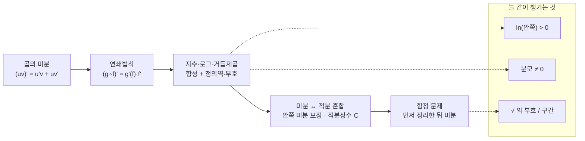

# (강화된) 미분계산 연습과 나의 감상 나누기 (4기 영상)

오늘은 미분(과 마지막엔 적분) 계산을 손이 아니라 **입으로** 풀어 보는 계산 드릴입니다. 곱의 미분에서 시작해 연쇄법칙(합성함수)으로 넘어가고, 지수·로그·거듭제곱이 섞인 합성을 정의역과 부호까지 챙기며 미분한 뒤, 마지막에는 적분을 섞어 거듭제곱·지수·로그 적분과 안쪽 미분 보정·적분상수까지 다룹니다.

> 🧮 [계산 노트북](<04-season-assets/23/ipynb/09. Meaning and Definition of the Derivative-04-season-23.ipynb>) — 오늘 드릴의 미분·적분을 SymPy로 검산하고, 함정 문제와 세컨트→탄젠트를 그래프로 확인합니다.

---

## [0. 곱의 미분 연습 · ▶ 02:11](https://www.youtube.com/watch?v=sRk9cOiIs1Y&t=131s)

곱의 미분이 주가 되는 첫 세트입니다.

- $\dfrac{d}{dx}\bigl[(2x+1)\,e^{x^2}\bigr] = 2\,e^{x^2} + (2x+1)\,e^{x^2}\cdot 2x$.
  처음에 앞의 $2$를 빠뜨려서 한 번 고쳤습니다.
- $\dfrac{d}{dx}\bigl[x\cos x\bigr] = \cos x - x\sin x$.
- $\dfrac{d}{dx}\bigl[(x^2+1)\sin x\bigr] = 2x\sin x + (x^2+1)\cos x$.
- $\dfrac{d}{dx}\bigl[\cos x\bigr] = -\sin x$.

> **✏️ 연습문제** 곱의 미분이 주가 됩니다. $(2x+1)e^{x^2}$, $x\cos x$, $(x^2+1)\sin x$, $\cos x$ 등을 미분해 보세요.

> 🔧 [곱의 미분 연습](<04-season-assets/23/html/secant-to-tangent-04-season-23-00.html>)에서 오늘 드릴 함수의 세컨트가 $h\to0$ 으로 접선에 포개지는 걸 직접 끌어 보자.

---

## [1. 곱의 미분 — 한 바퀴 · ▶ 07:42](https://www.youtube.com/watch?v=sRk9cOiIs1Y&t=462s)

이 바퀴에서 나온 문제와 답입니다.

- $\dfrac{d}{dx}\bigl[x\ln x\bigr] = 1 + \ln x$ ($x>0$).
- $\dfrac{d}{dx}\bigl[\sin(\ln x)\bigr] = \cos(\ln x)\cdot\dfrac1x$ ($x\neq 0$).
- $\dfrac{d}{dx}\bigl[x^2(x^2+1)\bigr]$ — 전개해서 $\dfrac{d}{dx}(x^4+x^2)=4x^3+2x$ 로 처리할 수도 있습니다.
- $\dfrac{d}{dx}\bigl[x^2\cos x\bigr] = 2x\cos x - x^2\sin x$.
- $\dfrac{d}{dx}\bigl[(x^2+1)\sin x\bigr] = 2x\sin x + (x^2+1)\cos x$.
- $\dfrac{d}{dx}\bigl[\ln|x|\bigr] = \dfrac1x$ ($x\neq 0$).
- $\dfrac{d}{dx}\bigl[x^3\sin x\bigr] = 3x^2\sin x + x^3\cos x$.
- $\dfrac{d}{dx}\bigl[(x^2+1)(x^3-2)\bigr]$ — 곱의 미분으로 $2x(x^3-2) + (x^2+1)\cdot 3x^2$.
- $\dfrac{d}{dx}\bigl[x^2\ln x\bigr] = 2x\ln x + x$ ($x>0$).
- $\dfrac{d}{dx}\bigl[\sqrt{x}\,e^x\bigr] = \dfrac{1}{2\sqrt{x}}\,e^x + \sqrt{x}\,e^x$ ($x\ge 0$).
- $\dfrac{d}{dx}\bigl[x^2\sin x\bigr] = 2x\sin x + x^2\cos x$.
- $\dfrac{d}{dx}\bigl[x^3\cos x\bigr] = 3x^2\cos x - x^3\sin x$.

> **💭 생각해볼 점 — 정의역을 같이 챙기기** $\ln|x|$ 나 $\ln x$ 가 나오면 답뿐 아니라 **정의역**도 같이 말해야 합니다. $\ln|x|$ 의 미분에는 "$x\neq 0$" 조건이 필요하고, $x^2\ln x$ 에는 "$x>0$" 이 필요합니다. 답을 맞히는 것만큼이나, 그 답이 어디서 의미가 있는지를 함께 보는 습관을 들이면 좋겠습니다.

> **💭 생각해볼 점 — 전개할까, 곱의 미분으로 둘까** $(x^2+1)(x^3-2)$ 를 두고, 전개해서 계산할 수도 있고 전개하지 않고 곱의 미분으로 $2x(x^3-2)+(x^2+1)\cdot 3x^2$ 형태로 둘 수도 있습니다. 같은 식이라도 어떤 꼴로 두느냐에 따라 검산의 부담이 달라진다는 점, 한번 생각해 볼 만합니다.

---

## [2. 합성함수(연쇄법칙)로 들어가기 · ▶ 21:24](https://www.youtube.com/watch?v=sRk9cOiIs1Y&t=1284s)

이 세트부터는 안쪽 함수를 한 번 더 미분해 곱하는 **연쇄법칙**이 본격적으로 들어옵니다 (→ [전사본](09.%20Meaning%20and%20Definition%20of%20the%20Derivative.md) §9 합성함수의 미분).

- $\dfrac{d}{dx}\bigl[\cos x\cdot\ln(x+3)\bigr] = -\sin x\,\ln(x+3) + \dfrac{\cos x}{x+3}$ ($x>-3$).
- $\dfrac{d}{dx}\bigl[\ln(x^2+1)\bigr] = \dfrac{2x}{x^2+1}$.
- $\dfrac{d}{dx}\bigl[e^{x^2}\bigr] = 2x\,e^{x^2}$.
- $\dfrac{d}{dx}\bigl[\tan 3x\bigr] = 3\sec^2 3x$.

> **💭 생각해볼 점 — $\ln(\text{안쪽})$ 의 정의역 vs. 분모의 조건** $\ln(\cdot)$ 안에 들어간 식은 **0보다 커야** 하고, 식이 **분모**로 가면 **0이 아니기만** 하면 됩니다. 두 조건을 헷갈리지 않는 게 핵심입니다.

> **💭 생각해볼 점 — $\tan 3x$ 의 정의역** $\tan 3x = \dfrac{\sin 3x}{\cos 3x}$ 이므로 $\cos 3x \neq 0$ 이어야 하고, 이는 $3x \neq \pm\dfrac{\pi}{2} + 2\pi n$ ($n$ 정수) 인 **점들**을 제외하는 것이지 구간을 통째로 빼는 게 아닙니다.

> **✏️ 연습문제** $\cos x\,\ln(x+3)$, $\ln(x^2+1)$, $e^{x^2}$, $\tan 3x$ 처럼 합성함수가 섞인 것들을 정의역과 함께 미분해 보세요.

---

## [3. 지수·로그·합성을 더 섞어서 · ▶ 35:51](https://www.youtube.com/watch?v=sRk9cOiIs1Y&t=2151s)

- $\dfrac{d}{dx}\bigl[e^{3x+2}\bigr] = 3\,e^{3x+2}$. — 바깥이 지수함수, 안이 $3x+2$ 라는 합성으로 보는 연습입니다.
- $\dfrac{d}{dx}\bigl[(2x+1)e^{x}\bigr] = 2\,e^{x} + (2x+1)e^{x}$.
- $\dfrac{d}{dx}\bigl[\sin(\ln x)\bigr] = \cos(\ln x)\cdot\dfrac1x$.
- $\dfrac{d}{dx}\bigl[\ln(1-x)\bigr] = \dfrac{-1}{1-x}$ ($1-x>0$).
- $\dfrac{d}{dx}\bigl[\ln x\cdot e^{3x}\bigr] = \dfrac1x e^{3x} + \ln x\cdot e^{3x}\cdot 3$ ($x>0$).
- $\dfrac{d}{dx}\bigl[x^2 e^{\sin x}\bigr] = 2x\,e^{\sin x} + x^2\cos x\,e^{\sin x}$.
- $\dfrac{d}{dx}\bigl[e^{x}\bigr] = e^{x}$.
- $\dfrac{d}{dx}\bigl[\sqrt{x}\,e^{x}\bigr] = \dfrac{1}{2\sqrt{x}}\,e^{x} + \sqrt{x}\,e^{x}$.
- $\dfrac{d}{dx}\bigl[x^3(e^{x}+1)\bigr] = 3x^2(e^{x}+1) + x^3 e^{x}$ — 여기서 $+1$ 은 변수가 아니라 상수입니다.
- $\dfrac{d}{dx}\bigl[\ln(x^2+1)\bigr] = \dfrac{2x}{x^2+1}$.
- $\dfrac{d}{dx}\bigl[\ln(\cos x)\bigr] = \dfrac{-\sin x}{\cos x}$ ($\cos x>0$).
- $\dfrac{d}{dx}\bigl[\sin(4x+1)\bigr] = 4\cos(4x+1)$.
- $\dfrac{d}{dx}\bigl[\ln(5x-7)\bigr] = \dfrac{5}{5x-7}$.
- $\dfrac{d}{dx}\bigl[\sqrt{5x+1}\bigr] = \dfrac{5}{2\sqrt{5x+1}}$.
- $\dfrac{d}{dx}\bigl[e^{3x+2}\bigr] = 3\,e^{3x+2}$.
- $\dfrac{d}{dx}\bigl[\ln(\cos 2x)\bigr] = \dfrac{-2\sin 2x}{\cos 2x}$ ($\cos 2x>0$).
- $\dfrac{d}{dx}\bigl[(1+\sin x)^9\bigr] = 9(1+\sin x)^8\cos x$.
- $\dfrac{d}{dx}\bigl[(1+\sin x)^7\bigr] = 7(1+\sin x)^6\cos x$.

> **💭 생각해볼 점 — $\ln(\cos x)$ 의 정의역과 부호** $\ln(\cos x)$ 를 미분하면 안쪽 $\cos x$ 의 미분이 $-\sin x$ 이므로 $\dfrac{-\sin x}{\cos x}$, 부호가 마이너스입니다. 정의역은 $\ln$ 안이 양수여야 하므로 $\cos x>0$. "0만 아니면 되지 않나"라는 물음이 나올 수 있는데, 분모가 아니라 $\ln$ 안에 들어가 있으니 **양수**여야 합니다.

> **✏️ 연습문제** $e^{3x+2}$, $\ln(1-x)$, $\ln(\cos x)$, $(1+\sin x)^9$ 처럼 지수·로그·거듭제곱이 합성으로 들어간 것들을 정의역과 부호에 주의하며 미분해 보세요.

---

## [4. 미분과 적분을 섞기 시작 · ▶ 53:45](https://www.youtube.com/watch?v=sRk9cOiIs1Y&t=3225s)

이 무렵부터 적분을 본격적으로 섞기 시작합니다. 먼저 미분 쪽에서 나온, 세 겹 합성의 어려운 문제 하나입니다.

- $\dfrac{d}{dx}\Bigl[\sin\bigl(\ln(\cos x)\bigr)\Bigr]$. 안쪽부터 차례로 풀면 $\cos\bigl(\ln(\cos x)\bigr)\cdot\dfrac{1}{\cos x}\cdot(-\sin x)$ 가 됩니다. "사인 안에 $\ln$, 그 안에 $\cos x$" 가 다 들어 있는 세 겹임을 분명히 하고 풀었습니다.

적분 쪽에서 나온 것들과, 거기서 걸린 지점들입니다.

- $\displaystyle\int \frac{3}{x^2}\,dx = -\frac{3}{x} + C$ ($x\neq 0$). — "$\dfrac{3}{x^2}=3x^{-2}$ 이니 $n+1=-1$, 즉 $3\cdot\dfrac{x^{-1}}{-1}$" 임을 단계별로 정리했습니다. 처음에 $\ln$ 으로 가려다 멈추기 쉬운데, 지수 $-2$ 일 때는 거듭제곱 적분 공식이 맞습니다.
- $\displaystyle\int (x+1)^2\,dx = \frac{(x+1)^3}{3} + C$. — 안쪽 $(x+1)$ 을 미분해도 어차피 $1$ 이라, 여기서는 연쇄법칙(을 거꾸로 한 보정)이 사실상 의미가 없습니다.
- $\displaystyle\int \sin x\,dx = -\cos x + C$.
- $\displaystyle\int \sec^2 3x\,dx = \frac{1}{3}\tan 3x + C$. — 처음에 $\tan 3x$ 라고만 답했다가, "$3$ 이 분모로 가야 하지 않느냐"는 지적으로 $\dfrac13$ 을 붙여 바로잡았습니다.
- $\displaystyle\int \frac{1}{5x-2}\,dx = \frac{1}{5}\ln|5x-2| + C$ ($5x-2>0$). — 안쪽 $5x-2$ 를 미분하면 $5$ 가 나오니, 그것을 상쇄하려 $\dfrac15$ 을 곱한다는 점이 핵심이었습니다.

> **💭 생각해볼 점 — "둘 다 적분" 하지 않기** $(x+1)^2$ 의 적분에서, 괄호 안과 밖을 **둘 다** 적분해 버린 답이 나올 수 있습니다. 그건 안 됩니다. 지금 하는 일은 "연쇄법칙을 거꾸로" 하는 것인데, $(x+1)$ 처럼 안쪽을 미분해 봤자 $1$ 인 경우엔 보정이 필요 없으니 그냥 거듭제곱 적분만 하면 됩니다. 안쪽 미분이 상수가 아닐 때(예: $5x-2$ → $5$)만 그 값으로 나눠 주면 된다는 것을, $\dfrac{1}{5x-2}$ 예제에서 확인했습니다.

> **✏️ 연습문제** $\sin(\ln(\cos x))$ 같은 세 겹 합성 미분과, $\displaystyle\int\frac{3}{x^2}dx$, $\displaystyle\int(x+1)^2dx$, $\displaystyle\int\sec^2 3x\,dx$, $\displaystyle\int\frac{1}{5x-2}dx$ 같은 적분을 섞어서 풀어 보세요. 적분에서는 **적분상수 $C$** 와 안쪽 미분 보정을 빠뜨리지 않도록.

---

## [5. 적분을 듬뿍, 함정 문제까지 · ▶ 1:08:19](https://www.youtube.com/watch?v=sRk9cOiIs1Y&t=4099s)

이번에는 적분이 부쩍 많이 나옵니다.

- $\displaystyle\int x^4\,dx = \frac{x^5}{5} + C$.
- $\displaystyle\int x^2\,dx = \frac{x^3}{3} + C$.
- $\displaystyle\int \frac1x\,dx = \ln|x| + C$ ($x\neq 0$).
- $\displaystyle\int (3x+1)^6\,dx = \frac{1}{21}(3x+1)^7 + C$. — $\dfrac{1}{7\cdot 3} = \dfrac{1}{21}$.
- $\displaystyle\int e^{4x}\,dx = \frac14 e^{4x} + C$.
- $\displaystyle\int \sqrt{5x+1}\,dx = \frac{2}{15}(5x+1)^{3/2} + C$. — $(5x+1)^{1/2}$ 의 적분이라 $\dfrac{1}{3/2}\cdot\dfrac15 = \dfrac{2}{15}$ 보정이 필요합니다.
- $\displaystyle\int \frac{1}{5x-2}\,dx = \frac15\ln|5x-2| + C$ ($5x-2>0$).
- $\displaystyle\int (3x^2-4x+2)\,dx = x^3 - 2x^2 + 2x + C$.
- $\displaystyle\int (2x+2)^3\,dx = \frac18(2x+2)^4 + C$. — 안쪽 미분 $2$ 까지 고려하면 $\dfrac{1}{4}\cdot\dfrac12 = \dfrac18$.
- $\displaystyle\int 2^x\,dx$ 류 / $\displaystyle\int \sec^2 x\,dx = \tan x + C$.
- $\displaystyle\int (2\sin x - 3\cos x)\,dx = -2\cos x - 3\sin x + C$.
- $\displaystyle\int \frac{2x}{x^2+10}\,dx = \ln|x^2+10| + C$.
- $\displaystyle\int \cos(2x-3)\,dx = \frac12\sin(2x-3) + C$.
- $\displaystyle\int \csc^2 x\,dx = -\cot x + C$. — $\sec^2 x$ 의 적분이 $\tan x$, $\csc^2 x$ 의 적분이 $-\cot x$ 로 서로 짝을 이룬다는 걸 같이 정리했습니다.

> **💭 생각해볼 점 — "어려운 문제"가 아니라 "어려운 답"** 함정 문제: $\dfrac{d}{dx}\Bigl[\sqrt{\sin^2 x} + \ln(e^{2x})\Bigr]$ 를 미분하라. 겉보기엔 복잡하지만, $\sqrt{\sin^2 x} = \sin x$ (적절한 구간에서)이고 $\ln(e^{2x}) = 2x$ 이므로 식은 $\sin x + 2x$ 로 단순해지고, 미분하면 $\cos x + 2$ 가 됩니다. 식을 곧장 공식에 넣지 말고, **먼저 정리할 수 있는지** 한 번 보는 발상의 전환이 이 드릴의 묘미였습니다.

> **📚 참고·응용 — 미분과 적분의 비대칭** 미분은 곱의 미분·연쇄법칙으로 "어떻게든" 풀리는데, 적분은 거꾸로 생각해야 해서 항상 그렇게 되지는 않습니다. $\csc^2 x$, $\cot x$ 같은 것은 짝을 외워 두는 편이 빠릅니다.

> **✏️ 연습문제** 위 적분들과 함께, $\sqrt{\sin^2 x}+\ln(e^{2x})$ 처럼 **먼저 식을 정리한 뒤** 미분하는 함정 문제를 한번 만들어 보세요.

---

## 요약

오늘 드릴이 흘러온 난이도의 사다리를 한눈에:

- 오늘은 음성으로 진행한 미분·적분 계산 드릴입니다. 곱의 미분 → 연쇄법칙(합성함수) → 지수·로그·거듭제곱 합성 → 미분·적분 혼합 순으로 풀었습니다.
- 미분에서는 **곱의 미분**과 **연쇄법칙**이 중심입니다. $(2x+1)e^{x^2}$, $x^2\cos x$, $\ln(x^2+1)$, $\tan 3x$, $\sin(\ln(\cos x))$ 등 곱·합성을 단계별로 풀었습니다 (→ [전사본](09.%20Meaning%20and%20Definition%20of%20the%20Derivative.md) §9 연쇄법칙 $(g\circ f)'(x)=g'(f(x))\,f'(x)$).
- **정의역**을 답과 함께 챙깁니다. $\ln(\cdot)$ 안의 식은 0보다 커야 하고, 식이 분모면 0만 아니면 됩니다. $\tan 3x$ 는 $\cos 3x\neq 0$ 인 점들을 제외합니다.
- 적분에서는 거듭제곱·지수·로그 적분과 **안쪽 미분 보정**($\int\frac{1}{5x-2}dx=\frac15\ln|5x-2|+C$, $\int(2x+2)^3dx=\frac18(2x+2)^4+C$ 등), 그리고 **적분상수 $C$** 가 핵심입니다. $\sec^2x\to\tan x$, $\csc^2x\to-\cot x$ 는 짝으로 외워 둡니다.
- "어려운 문제 말고 어려운 답" — $\sqrt{\sin^2 x}+\ln(e^{2x})$ 처럼 먼저 $\sin x + 2x$ 로 정리한 뒤 미분하면 $\cos x + 2$. 식을 곧장 공식에 넣기 전에 정리할 수 있는지 보는 발상.
- 미분은 곱의 미분·연쇄법칙으로 대체로 풀리지만, 적분은 거꾸로 생각해야 해서 늘 그렇지는 않습니다.
