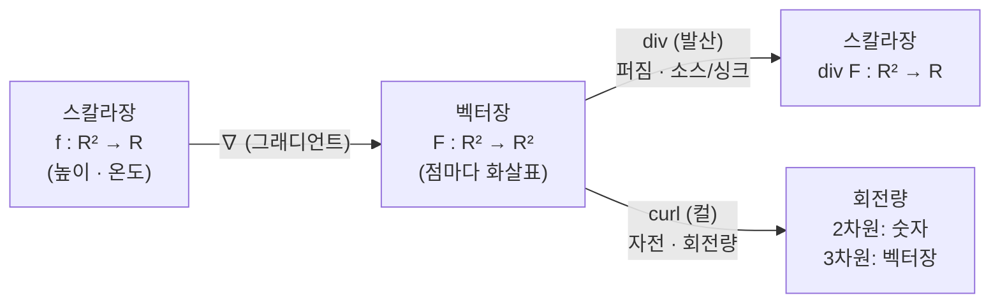

# 편미분계수, 미분과 선형대수의 관계, Gradient, Curl, Divergence (뉴진수 7강)

이번 시간에는 다변수 미분가능성 정의를 한 번 더 붙잡고, 그래디언트가 왜 높이 변화를 예측하는지 설명합니다. 그 다음 벡터장으로 넘어가 컬과 발산이 각각 회전과 소스/싱크를 어떻게 읽는지 봅니다.

---

## [0. 미분가능성 정의를 잠깐 고쳐 잡기 · ▶ 00:35](https://www.youtube.com/watch?v=3TKpa6EZvIM&t=35s)

처음 질문은 "다변수 미분가능성 정의를 완전히 이해하지 못해도 컬과 발산으로 넘어가도 되는가"였습니다. 저는 넘어가도 된다고 봅니다. 컬과 발산은 미분가능성 정의의 모든 엄밀한 세부를 먼저 끝내야만 이해되는 개념이라기보다, 벡터장이 어떤 식으로 움직이고 회전하고 퍼지는지를 읽는 연산자입니다.

다만 정의에서 잘못 쓰면 안 되는 부분은 확인하고 갑니다. 방향을 고정한 $hd$만 보는 식과, 임의의 작은 벡터 $K$가 $0$으로 가는 식은 다릅니다. 다변수 미분가능성은 후자를 요구합니다. 노름과 그래디언트 표기는 단원 전사본의 정의를 기준으로 확인했습니다(→ [전사본](<10. Multivariable Differentiation.md>) 참조).

오늘의 큰 줄기는 두 가지입니다. 먼저 $\langle\nabla f(P),K\rangle$가 왜 높이 변화의 1차 근사가 되는지 봅니다. 그 다음 스칼라 함수가 아니라 벡터값 함수, 즉 벡터장으로 넘어가 컬과 발산을 봅니다.

이 흐름은 함수의 입력과 출력 구조가 바뀌는 과정이기도 합니다.
스칼라장은 점을 숫자로 보내는 함수이고, 벡터장은 점을 벡터로 보내는 함수입니다.
그래디언트는 스칼라장에서 벡터장을 만드는 연산자이고, 컬과 발산은 벡터장의 국소 구조를 다시 숫자나 벡터로 읽는 연산자입니다.

이때 "정의를 다 이해하지 못했으니 다음으로 못 간다"라고 멈추지 않습니다.
다만 식에서 어떤 변수가 어떤 역할을 하는지는 확인합니다.
$P$는 미분을 검사하는 점입니다.
$K$는 그 점으로 들어오는 작은 변위입니다.
$\nabla f(P)$는 그 점에서 고정된 벡터입니다.
이 셋을 구분하면 뒤의 컬과 발산도 입력과 출력의 차이로 읽을 수 있습니다.

## [1. \(\langle\nabla f(P),K\rangle\)가 높이 변화가 되는 이유 · ▶ 09:05](https://www.youtube.com/watch?v=3TKpa6EZvIM&t=545s)

한 참여자분이 "함수값의 차이, 즉 높이 변화가 왜 그래디언트와 변위의 내적으로 나오는가"를 물었습니다. 표준 내적을 쓰면

$$
\nabla f(P)=\left(\frac{\partial f}{\partial x}(P),\frac{\partial f}{\partial y}(P)\right)
$$

입니다. 변위 $K=(\Delta x,\Delta y)$에 대해 내적을 하면

$$
\langle\nabla f(P),K\rangle
=f_x(P)\Delta x+f_y(P)\Delta y
$$

가 됩니다.

$x$방향으로만 $\Delta x$만큼 움직이면 높이 변화는 대략 $f_x(P)\Delta x$입니다. $y$방향으로만 움직이면 $f_y(P)\Delta y$입니다. 점 근처를 접평면으로 보면, 두 방향의 1차 변화는 더해집니다. 그래서 전체 변위 $K$에 대한 1차 높이 변화가 위의 내적으로 표현됩니다.

여기서 $K\to0$이라는 말은 그 근처를 평면으로 볼 만큼 확대한다는 말입니다. 평면에서는 $x$방향 변화와 $y$방향 변화가 선형적으로 합쳐집니다. 그래디언트는 또한 등고선에 수직이고, 함수값이 가장 빠르게 증가하는 방향을 가리킵니다.

작은 예로 $f(x,y)=2x+3y$를 보면 접평면 근사가 아니라 함수 자체가 이미 평면입니다.
$\nabla f=(2,3)$이고 $K=(\Delta x,\Delta y)$이면
$$
f(P+K)-f(P)=2\Delta x+3\Delta y=\langle(2,3),K\rangle
$$
가 정확히 성립합니다.
일반 함수는 한 점 근처에서 이 선형 함수처럼 보인다고 요구하는 것이 미분가능성입니다.
따라서 내적은 "높이를 실제로 만든다"기보다 "평면 근사의 변화량을 계산한다"고 읽는 편이 정확합니다.

> **💭 생각해볼 점** 그래디언트를 "최대 증가 방향"으로 외우는 것과 "$f_x\Delta x+f_y\Delta y$를 만드는 선형 계수"로 보는 것은 어떻게 연결됩니까?

> 🧮 [계산 노트북](<03-season-assets/07/ipynb/10. Multivariable Differentiation-03-season-07.ipynb>) — 그래디언트 내적·레벨셋 직교·컬·발산을 SymPy로 검산하고 발산↔컬 벡터장을 그립니다.

## [2. 음함수 조건과 수직 기울기 · ▶ 23:05](https://www.youtube.com/watch?v=3TKpa6EZvIM&t=1385s)

경제수학에서 나온 음함수 질문도 다뤘습니다. 원 같은 관계식은 전역적으로 $y=f(x)$ 꼴로 풀리지 않을 수 있습니다. 하나의 $x$에 대해 위쪽과 아래쪽 두 개의 $y$가 생기기 때문입니다. 그러나 국소적으로는 특정 지점 근처에서 $y$를 $x$의 함수처럼 풀 수 있는 경우가 있습니다.

음함수정리에서 $F_y\ne0$ 같은 조건이 등장하는 이유는 수직 접선처럼 $y$를 $x$의 함수로 풀기 어려운 상황을 피하기 위해서입니다. 더 일반적으로는 야코비안의 랭크가 충분해야 합니다. 이 표기는 단원 전사본의 야코비안/그래디언트 논의와 맞닿아 있습니다(→ [전사본](<10. Multivariable Differentiation.md>) 참조).

레벨셋 $F(x,y)=0$ 위에서 움직이면 $F$의 값은 변하지 않습니다. 따라서 접방향 $d$에 대해

$$
\langle\nabla F,d\rangle=0
$$

이 됩니다. 그래디언트가 레벨셋의 접선 방향과 수직이라는 설명도 여기서 나옵니다.

원 $F(x,y)=x^2+y^2-1$로 확인해 봅시다.
$\nabla F=(2x,2y)$입니다.
점 $(1,0)$에서 그래디언트는 $(2,0)$이고, 원의 접선 방향은 $(0,1)$입니다.
두 벡터의 내적은 $0$입니다.
점 $(0,1)$에서는 그래디언트가 $(0,2)$이고 접선 방향은 $(1,0)$입니다.
이렇게 레벨셋을 따라 움직이는 방향은 함수값을 바꾸지 않는 방향이므로 그래디언트와 직교합니다.

## [3. 벡터장: 점마다 벡터를 붙인 함수 · ▶ 1:04:15](https://www.youtube.com/watch?v=3TKpa6EZvIM&t=3855s)

이제 벡터장으로 넘어갑니다. 벡터장은 각 점에 벡터를 하나씩 붙이는 함수입니다. 예를 들어

$$
F:\mathbb{R}^2\to\mathbb{R}^2
$$

라면 평면의 각 점마다 화살표 하나가 붙어 있다고 생각할 수 있습니다.

그래디언트장도 벡터장의 한 예입니다. 스칼라 함수 $f:\mathbb{R}^2\to\mathbb{R}$가 있으면 각 점에 $\nabla f(P)$를 붙일 수 있고, 그러면 점마다 최대 증가 방향과 크기를 나타내는 벡터장이 생깁니다.

벡터장을 물의 흐름이나 힘의 장으로 생각하면 컬과 발산의 직관이 살아납니다. 각 점의 화살표는 그곳에 놓인 작은 물체가 어느 방향으로 얼마나 강하게 밀리는지를 보여 줍니다.

스칼라 함수와 벡터장을 나누면 다음과 같습니다.
- 온도 $T(x,y)$는 점마다 숫자를 주므로 스칼라장입니다.
- 높이 $f(x,y)$도 점마다 숫자를 줍니다.
- 속도장 $F(x,y)=(F_1,F_2)$는 점마다 벡터를 줍니다.
- 힘의 장도 점마다 힘 벡터를 줍니다.
- 그래디언트는 스칼라장에서 벡터장을 만드는 연산입니다.
- 컬과 발산은 이미 주어진 벡터장을 다시 읽는 연산입니다.

## [4. 컬: 흐름 속 물체가 자전하는 양 · ▶ 1:08:44](https://www.youtube.com/watch?v=3TKpa6EZvIM&t=4124s)

컬은 벡터장이 만드는 국소적인 회전량을 봅니다. 2차원 벡터장 $F=(F_1,F_2)$에 대해 성분의 교차 편미분 차이로 회전량을 잡습니다. 부호는 좌표 방향과 convention에 따라 정해야 하므로, 이 영상의 정정과 전사본 표기를 함께 확인하는 것이 좋습니다(→ [전사본](<10. Multivariable Differentiation.md>) 참조).

직관은 간단합니다. 작은 공이나 막대를 흐름 속에 놓았을 때, 그 물체가 그 자리에서 빙글 도는지를 보는 것입니다. 위쪽과 아래쪽에서 미는 힘이 다르면 물체는 회전합니다. 반대로 모든 곳에서 같은 방향으로 같은 세기로 밀면 물체는 이동할 수는 있지만, 그 자리에서 자전하지는 않습니다.

컬의 크기는 회전의 세기를, 부호는 시계방향/반시계방향 같은 방향을 나타냅니다. 여기서 말하는 회전은 어떤 중심을 크게 도는 공전이 아니라, 그 점 근처에서 작은 물체 자체가 도는 자전입니다.

예를 들어 $F(x,y)=(-y,x)$를 봅시다.
오른쪽 점 $(1,0)$에서는 벡터가 위쪽입니다.
위쪽 점 $(0,1)$에서는 벡터가 왼쪽입니다.
왼쪽 점 $(-1,0)$에서는 벡터가 아래쪽입니다.
아래쪽 점 $(0,-1)$에서는 벡터가 오른쪽입니다.
이 화살표들은 원점을 중심으로 반시계방향 흐름을 만듭니다.
작은 물체를 놓으면 그 자리에서 도는 그림이 생기므로 컬의 예로 보기 좋습니다.

> **💭 생각해볼 점** 벡터장이 원점을 중심으로 빙글 도는 모양이라고 해서 항상 컬이 크다고 말할 수 있을까요? 한 점 근처의 작은 물체가 자전하는지와 전체적으로 원을 따라 움직이는지는 구분해야 합니다.

## [5. 컬의 부호와 오른손 방향 · ▶ 1:24:43](https://www.youtube.com/watch?v=3TKpa6EZvIM&t=5083s)

컬을 설명하다가 부호가 헷갈리는 지점도 나왔습니다. 2차원 그림에서는 종이 위에서 반시계방향으로 도는지 시계방향으로 도는지를 말하지만, 원래 컬은 3차원에서 더 자연스럽습니다.

오른손 법칙을 떠올리면 좋습니다. 손가락이 감기는 방향을 회전 방향으로 잡으면 엄지가 가리키는 방향이 컬 벡터의 방향입니다. 2차원 평면에서는 그 방향이 종이 밖으로 나오거나 종이 안으로 들어가는 부호로 줄어듭니다.

그래서 부호는 단순한 장식이 아닙니다. 같은 크기의 회전이라도 어느 쪽으로 도는지를 구분합니다. 다만 오늘의 목표는 부호 convention을 외우는 것이 아니라, 왜 편미분의 차이가 국소 회전을 잡는지 직관을 세우는 것입니다.

## [6. 이동 방향과 회전 방향은 다르다 · ▶ 1:29:19](https://www.youtube.com/watch?v=3TKpa6EZvIM&t=5359s)

참여자 질문에서 중요한 구분이 나왔습니다. 흐름 속에 놓인 작은 공에는 두 가지가 있습니다. 하나는 공의 중심이 어디로 이동하는가이고, 다른 하나는 공 자체가 어떻게 도는가입니다.

벡터장 자체는 공의 중심이 어느 방향으로 밀리는지를 알려 줍니다. 컬은 그 공이 자기 자리에서 도는지를 알려 줍니다. 그래서 공이 원형 경로를 따라 움직인다고 해서 자동으로 컬이 크다고 말할 수 없고, 반대로 중심 이동이 단순해 보여도 작은 물체가 자전할 수 있습니다.

예를 들어 모든 점에서 같은 방향과 같은 크기의 벡터장이면 물체는 이동하지만 자전하지 않습니다. 반면 위아래에서 미는 세기가 다르면 중심은 별로 움직이지 않아도 막대가 회전할 수 있습니다.

> **💭 생각해볼 점** 벡터장은 "어디로 가는가"를, 컬은 "그 자리에서 도는가"를 묻습니다. 물살 위의 작은 막대를 상상해서 두 질문을 분리해 보세요.

## [7. 발산: 소스와 싱크를 재는 양 · ▶ 1:35:03](https://www.youtube.com/watch?v=3TKpa6EZvIM&t=5703s)

발산은 작은 영역에서 벡터장이 바깥으로 나가는지 안으로 들어오는지를 봅니다. 예를 들어 $F(x,y)=(x,y)$는 원점에서 멀어지는 방향으로 화살표가 나가므로 양의 발산을 떠올릴 수 있습니다. 반대로 $F(x,y)=(-x,-y)$는 안쪽으로 모이므로 음의 발산을 떠올릴 수 있습니다.

작은 원판을 하나 잡아 봅니다. 그 원판 안의 점들이 흐름에 의해 바깥으로 빠져나가면 그곳은 소스처럼 보입니다. 점들이 안쪽으로 몰리면 싱크처럼 보입니다. 회전하는 장 $F(x,y)=(-y,x)$처럼 빙글 도는 흐름은 컬은 있을 수 있지만, 원판에서 순수하게 새어나가거나 들어오는 양은 없을 수 있습니다.

발산이 양이라고 해서 반드시 눈에 보이는 물질의 원천이 그 점에 있다는 뜻은 아닙니다. 벡터장이 국소적으로 영역을 팽창시키는지 압축시키는지를 재는 양으로 보는 것이 좋습니다.

계산 표기로는 2차원에서
$$
\operatorname{div}F=\frac{\partial F_1}{\partial x}+\frac{\partial F_2}{\partial y}
$$
처럼 씁니다.
$F(x,y)=(x,y)$이면 발산은 $1+1=2$입니다.
$F(x,y)=(-y,x)$이면 발산은 $0+0=0$입니다.
같은 벡터장 그림이라도 어떤 미분을 더하고 빼느냐에 따라 퍼짐과 회전이 따로 읽힙니다.

> 🔧 [발산: 소스와 싱크를 재는 양](<03-season-assets/07/html/vector-field-flux-spin-explorer-03-season-07-07.html>)에서 직접 작은 원판을 끌어 플럭스와 순환으로 발산·컬의 부호를 읽어 보자.

## [8. 그래디언트·컬·발산의 입력과 출력 · ▶ 1:42:12](https://www.youtube.com/watch?v=3TKpa6EZvIM&t=6132s)

세 연산자는 입력과 출력이 다릅니다. 그래디언트는 스칼라 함수에서 벡터장을 만듭니다.

$$
f:\mathbb{R}^2\to\mathbb{R}
\quad\Longmapsto\quad
\nabla f:\mathbb{R}^2\to\mathbb{R}^2
$$

반면 컬과 발산은 벡터장을 받아 회전량이나 퍼짐의 정도를 돌려줍니다. 2차원에서는 보통 스칼라값처럼 읽고, 차원이 올라가면 표현이 달라집니다.

컬을 안다고 발산을 아는 것은 아니고, 발산을 안다고 컬을 아는 것도 아닙니다. 하나는 자전, 하나는 소스/싱크를 측정합니다. 같은 벡터장을 서로 다른 질문으로 읽는 것입니다.

입력과 출력을 표로 기억해도 좋습니다.
- $\nabla f$: 숫자장 $f$를 넣어 벡터장을 얻습니다.
- $\operatorname{div}F$: 벡터장 $F$를 넣어 숫자장을 얻습니다.
- $\operatorname{curl}F$: 벡터장 $F$를 넣어 회전량을 얻습니다.
- 2차원에서는 컬을 숫자처럼 표시하기도 합니다.
- 3차원에서는 컬이 다시 벡터장으로 나옵니다.
이 차이를 모르면 "그래디언트에서 컬을 구하는가, 컬에서 발산을 구하는가" 같은 질문이 서로 섞입니다.

세 연산자가 어떤 입력을 받아 어떤 출력을 내는지, 그리고 그 사이에서 스칼라장과 벡터장이 어떻게 오가는지를 한눈에 정리하면 다음과 같습니다.

## [9. \(\nabla\)가 향하는 방정식들 · ▶ 1:48:24](https://www.youtube.com/watch?v=3TKpa6EZvIM&t=6504s)

$\nabla$는 편미분 연산자들을 묶어 둔 표기입니다. 이것을 스칼라 함수에 작용시키면 그래디언트가 되고, 벡터장과 조합하면 컬이나 발산이 됩니다. 그래서 $\nabla$ 표기는 다변수 미분에서 여러 연산을 한 언어로 묶어 줍니다.

이 연산자들은 뒤의 방정식들에서 계속 나옵니다. 열방정식에서는 온도장의 그래디언트와 그 발산이 등장하고, 맥스웰 방정식에서는 전기장과 자기장의 발산과 컬이 물리 법칙을 표현합니다. 단원 전사본에서도 열방정식과 맥스웰 방정식이 이 흐름으로 정리되어 있습니다(→ [전사본](<10. Multivariable Differentiation.md>) 참조).

오늘은 계산을 완성하기보다, 각 연산자가 무엇을 묻는지에 초점을 둡니다. 그래디언트는 어디로 가장 빨리 변하는지, 컬은 그 자리에서 도는지, 발산은 그 자리에서 나오거나 들어가는지를 묻습니다.

## [10. 예시 벡터장으로 구분하기 · ▶ 1:56:18](https://www.youtube.com/watch?v=3TKpa6EZvIM&t=6978s)

마지막에는 벡터장을 더 구체적으로 떠올렸습니다. 길 위를 따라 바람이 부는 장, 중심으로 끌어당기는 중력장, 바깥으로 퍼지는 장은 모두 점마다 벡터를 붙인 함수입니다.

중력장을 생각하면 각 점의 벡터는 물체가 어느 방향으로 가속될지를 말합니다. 이 벡터장이 회전 성분을 갖는지, 발산을 갖는지는 별도의 질문입니다. 같은 "힘의 장"이라도 컬과 발산은 서로 다른 정보를 뽑아냅니다.

이렇게 예시를 놓고 보면 세 연산자의 입력과 출력이 더 분명해집니다. 스칼라 높이 함수에서 그래디언트를 만들 수도 있고, 이미 주어진 벡터장에서 컬과 발산을 계산할 수도 있습니다.

여기서 계산 예를 하나 마음속에 두겠습니다. $F(x,y)=(x,y)$는 원점에서 바깥으로 뻗는 장입니다. 작은 원판을 잡으면 화살표가 경계 바깥으로 빠져나가므로 발산이 양수처럼 보입니다.

반대로 $F(x,y)=(-y,x)$는 원점을 중심으로 도는 장입니다. 작은 물체를 놓으면 그 자리에서 회전하는 그림이 생기므로 컬이 보입니다. 하지만 원판 안의 양이 순수하게 새어나가는 그림은 아닙니다.

두 예를 비교하면 "퍼짐"과 "돎"이 분리됩니다. 벡터장을 처음 볼 때는 화살표 그림 하나에서 모든 성질을 한꺼번에 읽으려 하기 쉽지만, 발산과 컬은 서로 다른 질문을 던지는 연산자입니다.

마지막으로 그래디언트장은 특별합니다. 어떤 높이 함수에서 온 벡터장이므로, 등고선에 수직인 방향으로 나옵니다. 모든 벡터장이 그래디언트장인 것은 아니며, 이 구분은 뒤에서 물리 방정식을 볼 때 다시 나타납니다.

> **💭 생각해볼 점** $F(x,y)=(x,y)$와 $F(x,y)=(-y,x)$의 화살표를 네 방향$(1,0),(0,1),(-1,0),(0,-1)$에서만 그려 보세요. 어느 그림이 퍼지고, 어느 그림이 도는지 말로 구분해 보세요.

이 예시들은 계산을 미루기 위한 것이 아닙니다.
계산을 시작하기 전에 어떤 양을 계산하려는지 정하는 장치입니다.
발산을 묻는 순간 작은 원판의 넓이 변화가 보이고,
컬을 묻는 순간 작은 막대의 회전이 보입니다.

## 요약

- $\langle\nabla f(P),K\rangle$는 접평면이 예측하는 1차 높이 변화다.
- 음함수정리의 조건은 관계식 $F(x,y)=0$을 국소적으로 함수처럼 풀 수 있는지를 보장하는 조건으로 읽을 수 있다.
- 벡터장은 점마다 벡터를 붙인 함수이고, 그래디언트장은 그 한 예다.
- 스칼라장, 벡터장, 그래디언트, 컬, 발산은 입력과 출력이 다른 함수/연산자 구조로 구분할 수 있다.
- 컬은 국소적인 자전량을, 발산은 작은 영역에서 바깥으로 나가거나 안으로 들어오는 양을 잰다.
- 이동 방향과 회전 방향은 다르므로, 벡터장 자체와 컬의 의미를 구분해야 한다.
- $\nabla$는 그래디언트, 컬, 발산을 한 미분 연산자 언어로 묶어 주며 열방정식과 맥스웰 방정식으로 이어진다.
