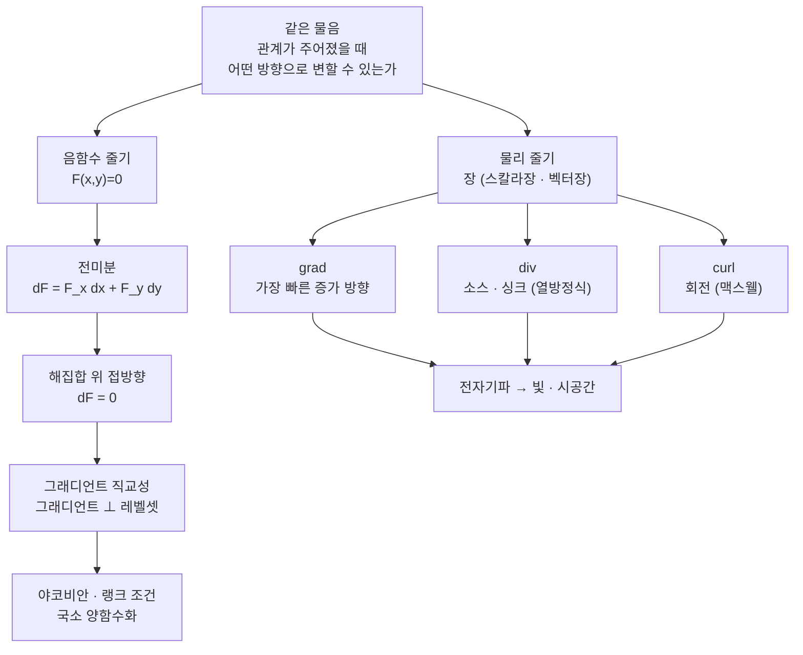

# 다변수 셋팅에서 미분의 직관 이해하기 (뉴진수 8강)

이번 시간에는 음함수정리와 전미분에 대한 질문에서 출발해, 그래디언트의 직교성, 야코비안의 랭크 조건, 열방정식과 맥스웰 방정식의 다변수 미분 해석까지 이어 갑니다. 계산 공식보다 "무엇이 변하고, 그 변화를 어떤 미분 연산자가 읽는가"를 중심에 둡니다.

> 🧮 [계산 노트북](<03-season-assets/08/ipynb/10. Multivariable Differentiation-03-season-08.ipynb>) — 전미분·음함수 도함수·그래디언트 직교성·랭크·열방정식 발산을 SymPy/NumPy로 검산하고 그림으로 확인합니다.

---

## [0. 음함수 조건을 다시 묻기 · ▶ 07:04](https://www.youtube.com/watch?v=PKCgER6zZA0&t=424s)

처음 질문은 음함수정리에서 왜 $F_y\ne0$ 같은 조건이 필요한가였습니다. 편미분 $F_y$는 다른 변수를 고정하고 $y$방향으로만 움직였을 때 함수값이 얼마나 변하는지를 보는 값입니다. 이 값이 $0$이 아니면, 적어도 그 점 근처에서는 $y$를 조정해 $F(x,y)=0$ 관계를 유지할 여지가 생깁니다.

수직 접선이 생기는 지점에서는 $y=f(x)$ 꼴로 풀기가 곤란합니다. $x$가 거의 변하지 않는데 $y$가 크게 변하면, $dy/dx$는 실수값 함수의 기울기로 다루기 어려워집니다. 탄젠트 함수가 $\pi/2$ 근처에서 정의되지 않는 것처럼, 함수로 말하려면 정의역과 치역 안에서 값이 잘 정해져야 합니다.

음함수정리는 전역적으로 풀 수 없던 관계식을 국소적으로는 함수처럼 다룰 수 있게 해 줍니다. 그 조건이 바로 어느 방향의 변화가 사라지지 않는지, 더 일반적으로는 야코비안이 충분한 랭크를 갖는지로 표현됩니다(→ [전사본](<10. Multivariable Differentiation.md>) 참조).

여기서 구조를 분명히 하겠습니다.
방정식 $F(x,y)=0$은 평면 전체의 함수를 하나의 해집합으로 제한합니다.
음함수정리는 그 해집합 근처에서 어떤 좌표를 입력으로 삼고 어떤 좌표를 출력으로 삼아도 되는지 말합니다.
즉 "관계"를 "국소 함수"로 바꾸어 읽는 조건입니다.

참여자 질문의 "기울기가 무한인 경우를 왜 배제하는가"는 여기서 나옵니다.
$y=f(x)$ 꼴로 풀고 싶다면, 작은 $x$ 변화에 대해 $y$가 하나의 값으로 따라와야 합니다.
수직 접선에서는 $x$를 함수의 입력으로 삼는 설명이 불안정합니다.
그 점에서는 오히려 $x=g(y)$ 꼴로 푸는 것이 자연스러울 수 있습니다.
음함수정리는 어느 변수를 출력으로 삼을 수 있는지를 편미분 조건으로 알려 줍니다.

## [1. 항등식, 방정식, 함수의 구분 · ▶ 24:31](https://www.youtube.com/watch?v=PKCgER6zZA0&t=1471s)

항등적으로 같다는 말은 주어진 정의역의 모든 점에서 등식이 성립한다는 뜻입니다. 예를 들어

$$
x+1=x+2-1,\qquad \cos^2x+\sin^2x=1
$$

은 해당 정의역에서 항상 맞는 항등식입니다.

반면 $F(x,y)=x^2+y^2-1$은 함수이고, $F(x,y)=0$은 그 함수의 영점 집합을 지정하는 방정식입니다. $\mathbb{R}^2$의 모든 점을 넣으면 $F(x,y)=0$이 성립하지 않습니다. 하지만 정의역을 그 영점 집합으로 제한하면, 그 집합 위에서는 $F=0$이 항등적으로 성립합니다.

이 구분 때문에 음함수 미분에서 $dF=0$의 의미가 달라집니다. 우리가 전미분을 해서 $dF=0$을 쓰는 것은, 아무 점에서나 $F=0$이라고 우기는 것이 아니라, $F(x,y)=0$이라는 관계를 만족하는 곡선 위에서 움직이고 있기 때문입니다.

> **💭 생각해볼 점** 같은 식이라도 정의역을 어디로 잡느냐에 따라 항등식처럼 보일 수 있습니다. "모든 $\mathbb{R}^2$에서 성립"과 "해집합 위에서 성립"은 어떻게 다릅니까?

이 구분을 원으로 다시 쓰면 더 분명합니다.
$F(x,y)=x^2+y^2-1$은 모든 평면에서 정의되는 함수입니다.
$F(x,y)=0$은 원 위의 점들을 고르는 방정식입니다.
원 위에서만 보면 $x^2+y^2-1=0$은 항상 참입니다.
하지만 원 밖의 점 $(0,0)$을 넣으면 $F(0,0)=-1$입니다.
따라서 "항등적으로 0"이라는 말은 반드시 정의역을 함께 말해야 합니다.

## [2. 음함수를 왜 양함수로 풀려고 하는가 · ▶ 31:24](https://www.youtube.com/watch?v=PKCgER6zZA0&t=1884s)

한 참여자분은 더 근본적으로 물었습니다. "왜 음함수의 미분을 하려면 굳이 양함수로 만들어야 하는가?" 원 $x^2+y^2=1$을 생각하면 이유가 보입니다.

원 전체는 하나의 $y=f(x)$로 표현되지 않습니다. 같은 $x$에 대해 위쪽 $y$와 아래쪽 $y$가 동시에 있기 때문입니다. 그러나 위쪽 반원 근처만 보면 $y=\sqrt{1-x^2}$처럼 하나의 함수로 볼 수 있고, 아래쪽 반원 근처만 보면 $y=-\sqrt{1-x^2}$처럼 볼 수 있습니다.

음함수정리는 이런 국소적 양함수화를 정당화합니다. 전역적으로는 함수가 아니어도, 한 점 근처에서는 적절한 좌표를 골라 함수처럼 풀 수 있는지를 말합니다.

이때 조건이 필요한 이유도 다시 보입니다. 수직 접선 지점에서는 $x$를 조금 바꿀 때 $y$가 함수처럼 안정적으로 따라오지 않습니다. 그래서 어느 변수로 풀 것인지, 그 방향의 편미분이 사라지지 않는지 확인해야 합니다.

예를 들어 원의 오른쪽 점 $(1,0)$ 근처에서는 $x$를 $y$의 함수로 푸는 것이 더 자연스럽습니다.
위쪽 점 $(0,1)$ 근처에서는 $y$를 $x$의 함수로 푸는 것이 자연스럽습니다.
같은 원이라도 어느 점 근처를 보느냐에 따라 좋은 좌표가 달라집니다.
음함수정리의 조건은 바로 이 "좋은 좌표"가 존재하는지를 말합니다.

## [3. 전미분: 모든 변수가 함께 변할 때 · ▶ 32:26](https://www.youtube.com/watch?v=PKCgER6zZA0&t=1946s)

전미분은 여러 변수가 동시에 변할 때 함수값이 어떻게 변하는지를 1차로 계산하는 방식입니다. 예를 들어 $x$를 운동 시간, $y$를 먹는 양, $F$를 몸무게라고 생각해 봅시다. $x$만 늘면 몸무게가 줄 수 있고, $y$만 늘면 몸무게가 늘 수 있습니다. 둘이 함께 변하면 두 효과를 함께 봐야 합니다.

점 근처에서 함수가 미분가능하면 그래프는 접평면처럼 보입니다. 평면 위에서는 $x$방향 변화와 $y$방향 변화가 선형적으로 더해집니다. 그래서

$$
dF=F_x\,dx+F_y\,dy
$$

처럼 씁니다. 이 표기는 단원 전사본의 전미분 설명과 맞추었습니다(→ [전사본](<10. Multivariable Differentiation.md>) 참조).

전미분은 편미분들을 따로따로 외우는 데서 끝나지 않습니다. 편미분은 각 좌표방향의 계수이고, 전미분은 그 계수들을 사용해 임의의 작은 변화 $(dx,dy)$가 함수값에 미치는 1차 효과를 합칩니다.

몸무게 비유를 식으로 쓰면 다음과 같습니다.
$x$가 운동량이고 $y$가 섭취량이라면 $F_x$는 운동량을 조금 바꿀 때의 변화 계수입니다.
$F_y$는 섭취량을 조금 바꿀 때의 변화 계수입니다.
$dx$와 $dy$가 동시에 주어지면 두 효과를 더해야 합니다.
그래서 전미분은 "편미분들의 목록"이 아니라 "작은 변화 벡터에 대한 선형 예측"입니다.

## [4. 전미분 등식 \(dF=0\)은 어디에서 성립하는가 · ▶ 44:49](https://www.youtube.com/watch?v=PKCgER6zZA0&t=2689s)

전미분을 두고 "양변의 전미분 값이 같아야 한다는 말이 왜 조건인가"라는 혼동이 있었습니다. 여기서 먼저 확인할 것은 우리가 움직이는 공간입니다.

$F(x,y)=0$의 해집합 위에서 움직인다면 $F$의 값은 계속 $0$입니다. 그러므로 그 경로를 따라 본 변화량은 $0$입니다. 이것을 미분 기호로 쓰면 $dF=0$입니다.

하지만 평면 전체에서 $F$가 항상 $0$이라는 뜻은 아닙니다. 해집합을 벗어나는 방향으로 움직이면 $F$는 변합니다. 그러므로 $dF=0$은 "관계식을 만족하는 곡선 위의 접방향"에 대한 말입니다.

이렇게 읽으면 음함수 미분 공식이 자연스럽습니다. 접방향 $(dx,dy)$는 $F_xdx+F_ydy=0$을 만족해야 하고, 여기서 $dy/dx$를 풀어 기울기를 얻습니다.

실제로 $F_y\ne0$이면
$$
F_xdx+F_ydy=0
$$
에서
$$
\frac{dy}{dx}=-\frac{F_x}{F_y}
$$
를 얻습니다.
이 공식은 외워서 나온 것이 아니라, 해집합 위에서 $F$가 변하지 않는다는 조건을 푼 것입니다.

## [5. 음함수와 그래디언트의 직교성 · ▶ 58:16](https://www.youtube.com/watch?v=PKCgER6zZA0&t=3496s)

원 $x^2+y^2=1$은 전역적으로 $y=f(x)$ 하나로 표현할 수 없습니다. 같은 $x$에 대해 위쪽 점과 아래쪽 점이 동시에 있을 수 있기 때문입니다. 그래서 우리는

$$
F(x,y)=x^2+y^2-1
$$

을 두고 $F(x,y)=0$인 레벨셋으로 원을 봅니다.

이 레벨셋 위에서 움직이면 $F$의 값은 계속 $0$입니다. 따라서 접방향 $d$에 대해 방향도함수는 $0$이어야 하고,

$$
\langle\nabla F,d\rangle=0
$$

이 됩니다. 그래디언트는 레벨셋에 수직이고, 접선 방향은 그래디언트와 직교합니다.

전미분으로 쓰면 $F_xdx+F_ydy=0$입니다. 여기서 $dy/dx$를 풀면 음함수의 도함수가 나옵니다. 즉, 음함수 미분 공식은 관계식 위에서의 접방향을 찾는 과정으로 읽을 수 있습니다.

> 🔧 [음함수와 그래디언트의 직교성](<03-season-assets/08/html/gradient-orthogonal-levelset-03-season-08-05.html>)에서 직접 레벨셋 위의 점을 끌어 그래디언트와 접선이 직교함을 확인해 보자.

그래디언트 직교성은 등고선 그림에서도 같습니다.
지도에서 같은 높이를 잇는 선을 따라 걸으면 높이는 변하지 않습니다.
그 방향은 등고선의 접방향입니다.
가장 빠르게 높아지는 방향은 등고선을 가로지르는 방향입니다.
그래서 그래디언트는 등고선에 수직입니다.
음함수 곡선 $F=0$도 $F$의 한 레벨셋이므로 같은 설명이 적용됩니다.

## [6. 야코비안과 랭크 조건의 맛보기 · ▶ 1:10:43](https://www.youtube.com/watch?v=PKCgER6zZA0&t=4243s)

음함수정리를 더 일반적으로 쓰면 야코비안과 랭크가 등장합니다. 변수와 방정식이 여러 개가 되면, 어느 한 편미분이 $0$이 아닌지만 보는 것으로는 부족합니다. 여러 편미분을 모은 행렬이 충분히 많은 독립 정보를 갖는지를 봐야 합니다.

하나의 방정식 $F(x,y)=0$에서는 그래디언트가 영벡터가 아닌지가 랭크 조건과 연결됩니다. 더 많은 변수와 방정식에서는 야코비안 행렬의 특정 부분이 가역인지, 또는 최대 랭크를 갖는지가 국소적으로 어떤 변수를 다른 변수들의 함수로 풀 수 있는지를 결정합니다.

오늘은 이 정리를 증명하지 않습니다. 다만 음함수정리의 조건이 임의의 기술적 조건이 아니라, 관계식 위에서 좌표를 바꿔도 정보가 사라지지 않는다는 선형대수적 조건이라는 점을 잡아두면 됩니다.

여러 방정식이 있으면 각 방정식의 그래디언트가 한 줄씩 모여 야코비안이 됩니다.
이 행렬의 랭크는 그 방정식들이 서로 독립적인 제약을 주는지 말합니다.
두 방정식이 사실상 같은 정보를 반복하면, 식은 두 개여도 제약은 하나뿐입니다.
그래서 랭크는 식의 개수보다 더 세밀한 정보를 줍니다.

## [7. 랭크가 풀이라는 말의 작은 예 · ▶ 1:14:38](https://www.youtube.com/watch?v=PKCgER6zZA0&t=4478s)

랭크 질문에서는 "성분이 모두 0이 아니면 풀 랭크인가"라는 혼동도 나왔습니다. 아닙니다. 랭크는 행이나 열이 얼마나 독립적인지를 말합니다.

예를 들어 행렬

$$
\begin{pmatrix}1&2\\2&4\end{pmatrix}
$$

는 모든 성분이 0은 아니지만, 둘째 행이 첫째 행의 두 배입니다. 독립인 행은 하나뿐이므로 랭크는 $1$입니다.

반대로 $2\times2$ 행렬이 풀 랭크라는 것은 랭크가 $2$라는 뜻이고, 이는 두 방향의 정보가 독립적으로 살아 있다는 말입니다. 음함수정리에서 랭크 조건이 중요한 이유는, 어떤 변수들을 다른 변수들의 함수로 풀 때 필요한 독립 정보가 사라지지 않아야 하기 때문입니다.

> **💭 생각해볼 점** "0이 아닌 성분이 많다"와 "독립인 방향이 많다"는 다른 말입니다. 위 행렬처럼 성분은 있어도 정보가 한 방향으로만 반복되는 예를 하나 더 만들어 보세요.

## [8. 열방정식: 온도의 그래디언트와 발산 · ▶ 1:24:27](https://www.youtube.com/watch?v=PKCgER6zZA0&t=5067s)

열방정식에서는 온도 함수 $T$를 생각합니다. 온도는 위치마다 하나의 숫자를 주는 스칼라장입니다. $\nabla T$는 온도가 가장 빠르게 증가하는 방향을 가리킵니다.

열은 높은 온도에서 낮은 온도로 흐릅니다. 이 흐름을 벡터장으로 만들면, 그 벡터장의 발산이 한 점에서 열이 빠져나가는지 모이는지를 알려 줍니다. 그래서 온도의 시간 변화는 대략 "온도장의 그래디언트로 만든 흐름의 발산"과 연결됩니다.

이 설명은 정확한 물리 상수와 부호를 생략한 직관입니다. 그러나 연산자의 역할은 분명합니다. 그래디언트는 어디로 흐르려는지 만들고, 발산은 그 흐름이 한 점에서 빠져나가는지 들어오는지를 잽니다.

뜨거운 점 하나를 생각하면 온도는 그 점에서 높고 주변에서 낮습니다.
온도 그래디언트는 더 뜨거운 쪽을 가리킵니다.
열의 실제 흐름은 보통 그 반대 방향, 즉 낮은 온도 쪽으로 갑니다.
그 흐름이 한 점에서 빠져나가면 그 점의 온도는 내려갑니다.
그 흐름이 한 점으로 몰리면 그 점의 온도는 올라갑니다.
열방정식은 이 직관을 미분 연산자의 조합으로 적는 방식입니다.

## [9. 온도장은 순간마다 정의되는 스칼라장이다 · ▶ 1:30:19](https://www.youtube.com/watch?v=PKCgER6zZA0&t=5419s)

열방정식 대화에서는 "온도가 계속 변하는데 순간의 온도를 정의할 수 있는가"라는 질문도 나왔습니다. 수학 모델에서는 한 시각 $t$를 고정하면 위치 $x$마다 온도 $T(x,t)$가 정해진다고 놓습니다.

그러면 $t$를 고정한 $T(\cdot,t)$는 공간 위의 스칼라장입니다. 시간이 조금 지나면 다른 스칼라장이 됩니다. 열방정식은 이 스칼라장이 시간에 따라 어떻게 바뀌는지를 말합니다.

현실에서는 측정 오차, 분자 수준의 요동, 열평형 같은 문제가 있습니다. 그러나 연속체 모델에서는 충분히 큰 규모에서 온도를 위치와 시간의 함수로 놓고, 그 변화율을 미분방정식으로 설명합니다.

## [10. 맥스웰 방정식에서 발산과 컬 읽기 · ▶ 1:32:21](https://www.youtube.com/watch?v=PKCgER6zZA0&t=5541s)

맥스웰 방정식에서는 전기장과 자기장을 벡터장으로 봅니다. 전기장의 발산은 전하가 소스처럼 작용하는 것을 나타내고, 자기장의 발산이 $0$이라는 식은 자기장이 시작하거나 끝나는 소스/싱크를 갖지 않는다는 말로 읽을 수 있습니다.

자기장의 컬은 전류와 연결됩니다. 전류가 흐르는 도선 주변에 자기장이 감기는 그림을 떠올리면, 컬이 왜 회전과 관련되는지 보입니다. 또 시간이 변하는 자기장은 전기장을 만들고, 전기장과 자기장이 서로 영향을 주면서 파동처럼 전파될 수 있습니다.

여기서도 계산보다 언어를 보는 것이 좋습니다. 발산은 소스와 싱크를 묻고, 컬은 회전을 묻습니다. 맥스웰 방정식은 전기장과 자기장의 물리 법칙을 이 두 질문의 조합으로 적어 둔 것입니다(→ [전사본](<10. Multivariable Differentiation.md>) 참조).

네 식을 외우기 전에 질문을 나누면 됩니다.
- 전기장은 어디에서 시작하거나 끝나는가.
- 자기장은 어디에서 시작하거나 끝나는가.
- 전기장이 감기는 현상은 무엇과 연결되는가.
- 자기장이 감기는 현상은 무엇과 연결되는가.
이 네 질문이 발산 두 개와 컬 두 개로 나뉩니다.
그래서 맥스웰 방정식은 다변수 미분의 사용처를 보여 주는 좋은 예입니다.

## [11. 빛과 시공간으로 이어지는 질문 · ▶ 1:53:38](https://www.youtube.com/watch?v=PKCgER6zZA0&t=6818s)

맥스웰 방정식을 풀면 전기장과 자기장이 파동처럼 움직이고, 그 속도가 빛의 속도와 연결됩니다. 여기서 빛을 전자기파로 보는 관점이 나오고, 더 나아가 빛의 속도가 일정하다는 문제는 특수상대론의 출발점이 됩니다.

일반상대론으로 가면 국소적으로 가속과 중력을 구분할 수 없다는 등가원리 같은 생각이 등장합니다. 엘리베이터 안에서 빛의 경로가 휘어 보이는 사고실험은, 기하와 미분이 물리의 언어가 되는 방식을 보여 줍니다.

이 부분은 오늘의 계산 목표라기보다 다변수 미분 연산자가 어디까지 이어지는지 보는 참고입니다. 그래디언트, 컬, 발산은 추상적인 기호가 아니라 장의 변화와 흐름을 기술하는 언어입니다.

따라서 오늘 앞부분의 음함수 질문과 뒷부분의 물리 질문은 따로 떨어져 있지 않습니다. 둘 다 "관계가 주어졌을 때 어떤 방향으로 변할 수 있는가"를 묻습니다.

음함수에서는 해집합 위의 접방향을 찾고, 열방정식과 맥스웰 방정식에서는 장이 시간과 공간 속에서 어떻게 변하는지를 찾습니다. 같은 미분 언어가 서로 다른 대상에 적용되는 셈입니다.

오늘의 두 줄기가 같은 질문에서 갈라져 나오는 구조를 한눈에:

그래서 계산 공식은 뒤따라오는 표기이고, 먼저 볼 것은 움직임이 허용되는 방향과 그 방향에서 보존되거나 변하는 양입니다.

## 요약

- 음함수정리의 조건은 관계식 $F(x,y)=0$을 국소적으로 함수처럼 풀 수 있게 하는 비퇴화 조건이다.
- 음함수정리는 해집합이라는 기하 구조를 국소적인 함수 구조로 바꾸어 읽게 한다.
- 항등식은 정의역의 모든 점에서 성립하는 등식이고, 방정식은 해집합을 지정한다.
- 전미분 $dF=F_xdx+F_ydy$는 여러 변수가 동시에 변할 때의 1차 변화량이다.
- 레벨셋 위의 접방향은 그래디언트와 직교하며, 이 사실이 음함수 미분 공식과 연결된다.
- 야코비안의 풀 랭크 조건은 성분이 0이 아니냐가 아니라 독립 정보가 충분하냐를 묻는다.
- 열방정식과 맥스웰 방정식은 그래디언트, 컬, 발산이 실제 장의 변화와 흐름을 표현하는 예다.
