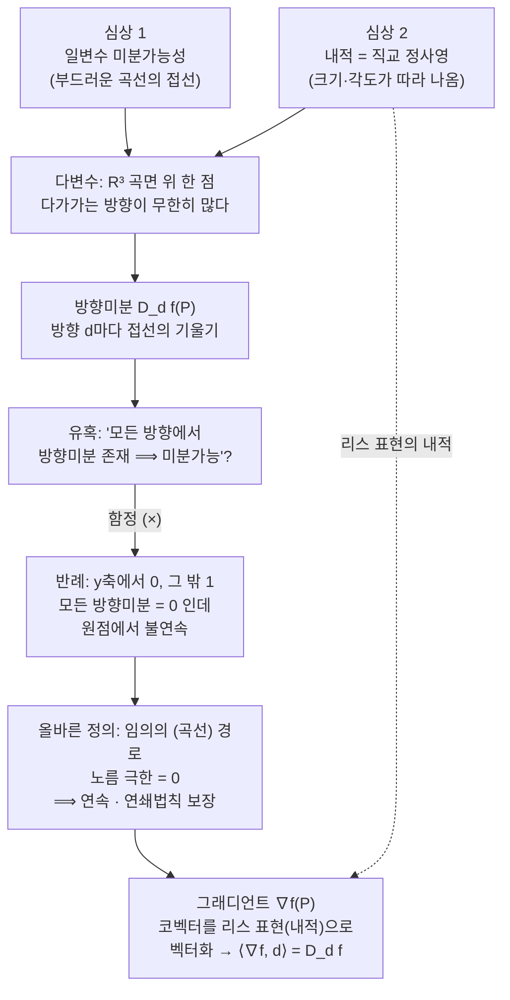

# 다변수 미분가능성의 심상

오늘은 다변수 함수의 미분가능성을 어떤 "심상"으로 받아들이면 좋은지를 같이 그려 봅니다. 일변수 미분과 내적이라는 두 가지 심상을 깔고, 거기서 출발해 제가 노트에 적어 둔 다변수 미분가능성 정의에 어떤 오류가 숨어 있었는지를 여러분이 직접 눈치채도록 풀어 갑니다.

> 🧮 [계산 노트북](<04-season-assets/25/ipynb/10. Multivariable Differentiation-04-season-25.ipynb>) - 할선→접선, 정사영 내적, 방향미분과 반례, 노름 극한·그래디언트를 SymPy/NumPy로 직접 따라가 본다.

---

## [0. 수학 공부의 세 층위 — 정의·심상·계산 · ▶ 01:45](https://www.youtube.com/watch?v=bD2xgh1saDM&t=105s)

수학 공부를 할 때 훈련의 층위를 세 가지로 나눠서 보면 좋습니다.

- **1번 — 정의.** 개념을 정확하게 정의하는 것.
- **2번 — 심상.** 그 정의에 대한 일종의 이미지를 만드는 것. 심상은 "수학적으로 맞다/틀리다"의 문제가 아니라, 그 정의에 와닿는 그림을 갖는 작업입니다. 이미지가 풍성해야 동기도 생기고 재미도 붙습니다.
- **3번 — 계산·논리.** 연역과 계산으로 정확하게, 예시 수준에서 다뤄 보는 것. 이건 수학에서 말하는 "구체화"입니다.

레퍼런스는 보통 추상적으로 적혀 있습니다. 많은 경우를 한 번에 덮으려다 보니 그렇습니다. 그런데 수학이 만들어진 순서는 반대입니다. 구체화에서 추상화가 나오지, 추상화가 먼저 있고 구체화가 따라온 게 아닙니다. 그래서 우리가 배울 때는 추상적으로 적힌 것을 우리가 사는 땅 끝까지 끌어내리는 작업이 필요합니다.

> **💭 생각해볼 점** 말하려고 하는데 "음…" 하고 멈칫하는 순간이 어디서 생기는지 스스로 살펴봅시다. 머릿속으로 알고는 있지만 입으로 한 번도 뱉어 본 적이 없는 것을 말하려 할 때 그 멈칫함(pause)이 생깁니다. 그 멈칫함이 바로 아직 정리가 안 된 지점입니다. 1·2·3을 균형 있게 훈련하면서, 내가 멈칫하는 층위가 어디인지를 보면 됩니다.

---

## [1. 개념의 정의·심상 점검 · ▶ 03:56](https://www.youtube.com/watch?v=bD2xgh1saDM&t=236s)

본론에 들어가기 전, 몇 가지 개념을 정의·심상 층위에서 점검해 두면 오늘 본론에서 쓸 "정의 vs 심상" 감각이 잡힙니다.

- **함수의 심상.** 저는 단순한 그림이 좋다고 봅니다. **두 집합이 있고, 왼쪽 원소를 하나씩 오른쪽으로 쏘는 것** — 이게 제가 가진 함수의 심상입니다. 1번(정의) 층위에서는 집합으로 선언되는 것을 알고 있고, 3번 층위에서는 합성의 결합법칙이나 "선형함수는 행렬" 같은 측면을 봅니다.
- **벡터공간.** "선형으로 정의되는 함수들의 모임"이라고 봐도 수학적으로 틀린 말은 아닙니다. 다만 저는 **선형 연산을 갖춘 집합** 정도로 보는 편이 타당하다고 봅니다(벡터도 사실은 함수이긴 합니다).
- **단사함수(1대1 함수).** 단사(일대일, injective)와 전사(onto, surjective)는 다른 조건이고, 둘 다 만족할 때 일대일대응이라 부릅니다. 전사의 정의는 따로 정확히 정리해 두시길 권합니다.
- **행렬의 정의.** **2×2 행렬의 정의는 "행 둘, 열 둘, 각 성분이 실수인 것"** 이라고 봅니다. 그것을 추상적으로 선형변환으로 볼 수 있다는 것과, 선형변환을 정의 층위에서 설명해야 한다는 것은 다른 얘기입니다.
- **군(group)의 정의.** 집합과 연산이 주어지고, ① 두 원소의 연산 결과가 다시 그 집합의 원소(닫혀 있음), ② 결합법칙, ③ 항등원의 존재, ④ 각 원소의 역원. 다만 연산을 애초에 함수로 정의하면 "닫혀 있다"는 말을 따로 할 필요가 없습니다. 연산이 있다고 말하는 순간 공역이 그 집합 안으로 들어가 있기 때문입니다.

> **💭 생각해볼 점** 정의(1번)와 심상(2번)은 결이 다릅니다. "함수는 정의역에서 대상을 딱 뽑으면 그게 가리키는 게 유일해서, 바로 튀어나오는 그림"이라는 심상을 두고 — 그 심상을 **초등학생한테 들려줘도 "아, 그렇겠네" 싶은가**를 물어봅시다. 심상은 듣고서 "뭔 소리지?"가 되면 안 됩니다. 예컨대 "1+1이 왜 2냐? 페아노 공리 때문이다"는 정확하지만 심상이 아닙니다. 듣는 사람이 고구마를 먹게 되니까요. 심상을 전할 때는 정의나 연역적 서술을 블랙박스로 감춰 두더라도, 전하려는 메시지가 단순명료하게 가닿도록 합니다.

---

## [2. 오늘의 본론 — 두 심상과 "오류 예고" · ▶ 40:59](https://www.youtube.com/watch?v=bD2xgh1saDM&t=2459s)

오늘 해야 하는 이야기는 다변수 미분가능성입니다. 이걸 말하려면 **미분가능성과 내적** 두 가지를 섞어야 합니다.

> **💭 생각해볼 점 (오늘의 핵심 물음)** 제가 노트에 적어 둔 다변수 미분가능성의 정의 방식에는 함정이 있습니다. 오늘 제 목표는 그게 왜 오류인지를 **여러분이 스스로 눈치채게** 하는 것입니다. 그러려면 두 가지 심상을 먼저 잡아야 합니다. 하나는 **일변수 미분가능성의 심상**, 다른 하나는 **내적의 심상**입니다. 심상은 강요할 수 없습니다. "적어도 저는 이런 그림으로 설명한다" 정도로 받아들이시고, 여러분만의 더 나은 그림이 있으면 그쪽이 정답입니다.

오늘의 논증이 흘러가는 길:

---

## [3. 심상 하나 — 일변수 미분가능성 · ▶ 45:34](https://www.youtube.com/watch?v=bD2xgh1saDM&t=2734s)

먼저 쉬운 것부터. 일변수 함수 $y=f(x)$의 미분가능성을 저는 이렇게 그립니다.

마음속에 $x$축을 그립니다(이게 정의역입니다). 그 위쪽에 **적당히 부드러운 곡선**을 그립니다. 곡선 위에서 내가 미분하고 싶은 한 점을 찍고, 거기서 **접선**을 긋습니다. 이 접선의 기울기를 우리가 **미분계수**라 부르고, 이 접선을 그을 수 있을 때 그 함수를 **미분가능**하다고 부릅니다.

여기서 "부드러운"이라는 말이 필요한 이유는, 곡선이 뾰족하면 접선을 그을 수 없기 때문입니다.

> **💭 생각해볼 점 (미분가능 ⟹ 연속의 심상)** 한 참여자분이 "미분이 가능하려면 그 점보다 조금 큰 점과 조금 작은 점이 있어야 선분(접선에 다가가는 할선)을 그어 볼 수 있는데, 만약 연속이 아니라면 그 선분이 튀어 버려서 안 될 것 같다"고 설명해 주셨습니다. 괜찮은 직관입니다. 사실 일변수에서는 **미분가능하면 연속**입니다. 미분계수의 정의 $\displaystyle\lim_{x\to a}\frac{f(x)-f(a)}{x-a}$를 보면, 이 극한이 존재하려면 $\lim_{x\to a}f(x)=f(a)$가 따라와야 하니까요(연속은 미분가능의 *필요*조건입니다).

---

## [4. 심상 둘 — 내적은 직교 정사영 · ▶ 47:36](https://www.youtube.com/watch?v=bD2xgh1saDM&t=2856s)

오늘 필요한 두 번째 심상은 내적입니다. 8강에서 타원으로 잡아 드렸던 내적 심상은 잠시 잊으셔도 됩니다. 지금은 더 원형에 가까운 그림을 강조하고 싶습니다.

**내적은 함수입니다.** 함수의 심상은 인풋을 주면 아웃풋을 뱉는 것입니다(동전을 넣으면 하나의 결과가 나오는 블랙박스). 그런데 내적은 **인풋이 두 개**입니다. 벡터 두 개를 넣으면 **값 하나**를 뱉습니다. 여기서 벡터는 $\mathbb{R}^2$의 원소(또는 화살표)로 보면 되고, 값은 직문수에서는 실수 정도로 봅니다.

그러면 그 값을 어떻게 정할까요? 한마디로 **직교 정사영(orthogonal projection)** 입니다.

마음속에 $\mathbb{R}^2$를 두고 두 벡터를 아무거나 뽑습니다. 두 벡터는 원점을 공유하고, 일반적으로 방향이 다릅니다. 한 벡터를 다른 벡터 기준으로 **정사영(수선의 발을 내림)** 합니다. 그러면 정사영된 그림자는 기준 벡터와 방향이 같으니, **그 그림자의 크기와 기준 벡터의 크기를 곱한 값** — 이것이 내적이 뱉는 값입니다. 어느 쪽을 어느 쪽으로 정사영하든 같은 값이 나옵니다.

이 규칙(rule)을 정하는 행위 자체가, 여러분이 직문수에서 마주친 "내적의 선택이 공리다"라는 말의 실체입니다. 정사영의 룰을 정한다는 것과 같은 말입니다.

이 룰을 잡으면, 내적이 주어졌을 때 **크기와 각도가 결정되는** 이유가 자명해집니다.

- **크기.** 같은 벡터 두 개를 넣어 보면 됩니다. 같은 벡터끼리는 정사영할 것이 없으니 크기끼리 곱하게 되어, $\langle a,a\rangle=\|a\|^2$가 됩니다. 그래서 $\|a\|=\sqrt{\langle a,a\rangle}$가 노름의 정의가 되는 것입니다.
- **각도.** 두 벡터의 크기를 이미 알고, 정사영은 회전행렬에서 배운 대로 코사인으로 표현됩니다. 즉 $\langle a,b\rangle=\|a\|\,\|b\|\cos\theta$이므로, $\cos\theta$를 알면 직각삼각형을 거꾸로 그려 $\theta$를 역추적할 수 있습니다.

> **💭 생각해볼 점** 한 참여자분은 내적을 "공간에 놓인 벡터들이 어디에 놓일지를 정해 주는 것"이라 표현했고, 다른 분은 "각도는 원래 정해진 줄 알았는데, 내적을 표현하는 행렬을 내가 정하면 각도도 내 마음대로 정의할 수 있게 해 주는 도구"라고 했습니다. 둘 다 좋은 그림입니다. 내적이라는 함수가 크기와 각도를 *결정한다*는 핵심을 심상으로 쥐고 있으면 됩니다. (→ 노름·각도 공식은 [전사본](<10. Multivariable Differentiation.md>) §3 참조)

---

## [5. 다변수로 — $\mathbb{R}^3$ 곡면과 무한히 많은 방향 · ▶ 55:30](https://www.youtube.com/watch?v=bD2xgh1saDM&t=3330s)

이제 두 심상을 깔았으니 본론입니다. 미분이라는 행위는 일변수에서 **접선을 긋는 것**이고, 접선을 그으려면 **극한**을 취해야 합니다.

일변수 $y=f(x)$에서는 타깃 포인트를 실수축에 찍으면, 그 점으로 다가가는 방향이 **오직 두 가지**입니다 — 우측에서 오거나 좌측에서 오거나(우극한·좌극한). 두 쪽에서 온 극한이 같은 접선을 만들 때 "잘 정의된다"고 배웠습니다.

이변수 함수는 이게 안 됩니다. $z=f(x,y)$를 생각하면, 이제 인풋은 $xy$-평면에 놓이고 함숫값 $z$가 높이로 올라갑니다. 그래서 마음속으로 $\mathbb{R}^3$ 공간을 그리고, $xy$-평면의 각 점마다 높이를 결정해 쌓으면 **곡면**이 나옵니다.

$$z=f(x,y),\qquad \mathbb{R}^3=\{(x,y,z)\mid x,y,z\in\mathbb{R}\}.$$

이제 곡면에서 타깃 포인트를 하나 잡습니다. 그 점으로 다가가는 방법이 몇 가지일까요?

> **💭 생각해볼 점** "그 점으로 달려가는 방향은 몇 가지인가?" — 한 참여자분이 곧바로 **"360도 모든 방향으로 무한히 많다"** 고 답해 주셨습니다. 맞습니다. $xy$-평면에서 한 점을 찍으면 그 점으로 가는 방향이 무한히 많습니다. 바로 이 **방향의 무한함**이 일변수와 다변수가 갈라지는 지점입니다.

---

## [6. 방향미분과 함정 — 직선만으로는 부족하다 · ▶ 1:01:53](https://www.youtube.com/watch?v=bD2xgh1saDM&t=3713s)

미분가능성을 정의하려면 타깃 포인트가 필요하고, 거기에 더해 **방향**도 잡아야 합니다. 방향을 잡아야 그 축을 기준으로 미분가능성을 논할 수 있으니까요. 여기서 "방향"이란 **단위벡터(크기 1인 벡터)** 입니다. 영벡터만 빼고, 자유도를 줄이려 크기를 1로 둡니다.

방향 $d=(d_1,d_2)$, $\|d\|=1$을 하나 고정하고 타깃 포인트 $P$를 잡으면, 그 방향을 따라 곡면 위에 곡선이 생기고, 그 곡선의 접선을 만드는 행위가

$$
D_d f(P)=\lim_{h\to 0}\frac{f(P+hd)-f(P)}{h}
$$

입니다. 이것을 **방향미분(directional derivative, 방향도함수)** 이라 부릅니다. 입력이 세 가지(함수, 타깃 포인트, 방향)인 대상입니다.

그러면 자연스러운 유혹이 생깁니다. **"모든 방향마다 방향미분이 정의되면, 그걸 미분가능성의 정의로 삼으면 되지 않을까?"**

> **💭 생각해볼 점 (속기 쉬운 함정)** 여기서 놓치기 쉬운 것은 이것입니다 — **극한을 취할 때 꼭 직선을 따라가야 한다는 법이 없습니다.** 타깃 포인트로 다가가는 길은 직선뿐 아니라 **휘어진 곡선(curved path)** 일 수도 있습니다. "방향이 무한히 많다"는 것까지 인지하고는 *무한을 다 고려했다*고 넘겨짚으면 함정에 빠집니다. 노트에는 이 대목이 "동치 아님 $(\times)$"이라고만 표시되어 있는데, 사실은 더 강한 조건이 필요합니다.

> **✏️ 연습문제 (반례를 직접 확인)** "직선 방향마다 방향미분이 존재한다"만으로는 왜 부족할까요? 노트 10강의 예시를 보십시오: $y$축 위에서는 $f=0$, 그 밖에서는 $f=1$로 정의한 함수입니다. 원점 $P=(0,0)$을 지나는 어떤 **직선** 을 따라 다가가도 $h\neq 0$인 한 함숫값이 일정하므로 $f(P+hd)-f(P)=0$, 즉 **모든 방향에서 방향미분이 $0$으로 존재**합니다. 그런데 이 함수는 원점에서 **연속이 아닙니다**. 모든 방향의 방향미분이 있어도 연속이 깨질 수 있다는 것을 직접 확인해 보세요. (→ [전사본](<10. Multivariable Differentiation.md>) §2.2 반례)

> 🔧 [방향미분 탐색기](<04-season-assets/25/html/directional-derivative-explorer-04-season-25-06.html>)에서 방향 $d$를 끌고 경로를 휘어 가며, 모든 직선 방향미분이 $0$인데도 곡선 경로가 불연속을 드러내는 것을 직접 확인해 보자.

---

## [7. 올바른 정의 — 임의의 곡선 경로까지 · ▶ 1:05:01](https://www.youtube.com/watch?v=bD2xgh1saDM&t=3901s)

그래서 우리가 만들고 싶은 미분가능성 개념은, **일변수에서 누렸던 두 가지 성질**을 그대로 따라가기를 원합니다.

1. **미분가능하면 연속이어야 한다.** (미분가능한데 연속이 아니면 곤란합니다.)
2. **합성을 해도 미분가능해야 한다.** — 유식한 말로 **연쇄법칙(chain rule)** 입니다.

방향마다 방향미분만 있다고 하면 이 두 룰이 위배됩니다(앞의 반례가 ①을 깹니다). 그래서 수학자들은 그것을 정의로 선택하지 않았습니다. 대신 **임의의 (직선이든 곡선이든) 경로**를 따라 그 점으로 다가갈 때 극한이 잘 정의되도록 요구합니다. 그러면 일변수에서 기대했던 대로 "미분가능 ⟹ 연속"을 증명할 수 있고(이미 모든 경로에 대해 보장했으니), 합성에 대해서도 연쇄법칙으로 미분가능성이 따라옵니다.

이것을 노름을 써서 정확히 쓰면, 어떤 벡터 $\nabla f(P)\in\mathbb{R}^2$(**그래디언트 벡터**)가 존재하여 변위 $K$에 대해

$$
\lim_{\|K\|\to 0}\frac{\big\|\,f(P+K)-f(P)-\langle \nabla f(P),\,K\rangle\,\big\|}{\|K\|}=0
$$

이 성립할 때, $f$가 점 $P$에서 **미분가능**하다고 합니다. 표준내적에서는 $\nabla f(P)=\Big(\dfrac{\partial f}{\partial x}(P),\,\dfrac{\partial f}{\partial y}(P)\Big)$이고, 방향미분은 그래디언트와의 내적으로 계산됩니다: $\langle \nabla f(P),d\rangle=D_d f(P)$. (→ [전사본](<10. Multivariable Differentiation.md>) §4 정의·성질)

> **💭 생각해볼 점** 원래 노트에서 하려던 것은 "모든 방향마다 방향미분이 존재함"을 내적으로 풀어 그것을 미분가능성의 정의와 **동치로** 유도하는 것이었는데, 그 한 칸의 "동치"는 성립하지 않습니다. 결과적으로 노트의 다른 서술이 틀린 것은 아니지만, 그 동치 단계는 오류입니다.

> **✏️ 연습문제** 노트를 보며 ① 방향미분의 정의가 무엇인지 정리하고(1번 층위), ② 오늘의 심상이 맞는지 맞춰 보고(2번 층위), ③ 위 반례에서 *왜 모든 방향의 방향미분이 존재하는데도 연속이 깨지는지*, 그리고 노름 극한으로 쓴 미분가능성 정의가 어떻게 나오는지를 직접 따라가 보세요(3번 층위).

---

## [8. 그래디언트는 왜 내적으로 들어오나 · ▶ 1:15:14](https://www.youtube.com/watch?v=bD2xgh1saDM&t=4514s)

한 참여자분이 좋은 질문을 주셨습니다. 방향미분을 그래디언트와 방향의 내적으로 계산하는 건 유도하면 알겠는데, **방향미분을 생각할 때는 내적을 생각하지도 않았는데 왜 갑자기 내적이 들어와서 같아지느냐** 는 것입니다. 어딘가에서 내적을 자연스럽게 쓰고 있어서 두 식을 같다고 착각하는 것 아니냐는, 인지적으로 걸리는 지점이었습니다.

이 질문은 타당합니다. 함수로서 보면 둘은 태생이 다릅니다.

- **방향미분**은 함수입니다. **방향(벡터)을 인풋으로 받아** 그 방향을 따라간 함수의 그래프에서 미분계수를 뱉습니다. 벡터를 입력으로 받아 처리하는 대상입니다. 유식한 말로 이것은 **미분형식(differential form)**, 즉 **코벡터(covector)** 입니다.
- 반면 **그래디언트**는 그냥 벡터입니다. 벡터가 또 다른 벡터를 인풋으로 받는 건 자연스럽지 않습니다 — 벡터는 벡터대로 노는 대상이지, 다른 벡터를 입력으로 취하는 대상이 아닙니다.

그래서 층위가 다른 둘을 잇는 다리가 필요합니다. 코벡터(방향을 받아 값을 뱉는 것)를 보통의 벡터로 바꾸려면 **리스 표현 정리(Riesz representation)** 를 써야 하고, 그 변환에 **내적**이 들어옵니다. 코벡터를 내적을 통해 벡터로 바꾼 것이 바로 그래디언트입니다. 그래서 $\langle\nabla f(P),d\rangle = D_d f(P)$가 성립하는 것입니다. 이게 실제 디테일이고, 직문수에서는 이 단어(미분형식·코벡터·리스 표현)를 굳이 쓰지 않고 넘어갈 뿐입니다.

> **📚 참고·응용** 노트의 다변수 미분 단원은 이 미분가능성·그래디언트 정의 다음에, 벡터 연산자 $\nabla=\Big(\dfrac{\partial}{\partial x},\dfrac{\partial}{\partial y}\Big)$로 회전(curl) $\nabla\times f$와 발산(divergence) $\nabla\cdot f$로 이어지고, 열방정식·맥스웰 방정식까지 개관합니다. (→ [전사본](<10. Multivariable Differentiation.md>) §6–§9)

---

## 요약

- 수학 공부의 세 층위 — **1번 정의 / 2번 심상 / 3번 계산·논리** — 를 구분해 두면 좋다.
- 본론을 위해 두 가지 심상을 깔았다. **일변수 미분가능성** = 부드러운 곡선 위 한 점에서 접선을 긋는 것(접선 기울기 = 미분계수), 그리고 **내적** = 한 벡터를 다른 벡터에 직교 정사영하여 그림자 크기와 기준 크기를 곱하는 함수(이로부터 노름 $\|a\|=\sqrt{\langle a,a\rangle}$와 각도 $\langle a,b\rangle=\|a\|\|b\|\cos\theta$가 따라온다).
- 다변수에서는 타깃 포인트로 다가가는 **방향이 무한히 많다**. 방향 $d$(단위벡터)마다 $D_d f(P)=\lim_{h\to0}\frac{f(P+hd)-f(P)}{h}$가 **방향미분**이다.
- **오늘의 핵심**: "모든 방향마다 방향미분이 존재하면 미분가능"이라고 두면 안 된다. 극한 경로는 직선뿐 아니라 **휘어진 곡선**일 수도 있는데 그것을 빠뜨린 것이 노트의 오류였다. 반례: $y$축에서 $0$, 그 밖에서 $1$인 함수는 원점에서 모든 방향의 방향미분이 $0$으로 존재하지만 연속이 아니다.
- 올바른 정의는 **임의의 경로**에 대해 노름 극한 $\lim_{\|K\|\to0}\frac{\|f(P+K)-f(P)-\langle\nabla f(P),K\rangle\|}{\|K\|}=0$을 요구하는 것이며, 이때 **미분가능 ⟹ 연속**과 **합성의 연쇄법칙**이 보장된다. 표준내적에서 $\nabla f(P)=\big(\frac{\partial f}{\partial x},\frac{\partial f}{\partial y}\big)$.
- 방향미분은 방향을 입력으로 받는 **코벡터(미분형식)** 이고, **리스 표현 정리**(내적)를 통해 벡터로 바꾼 것이 **그래디언트**다 — 그래서 $\langle\nabla f(P),d\rangle=D_d f(P)$가 성립한다.
