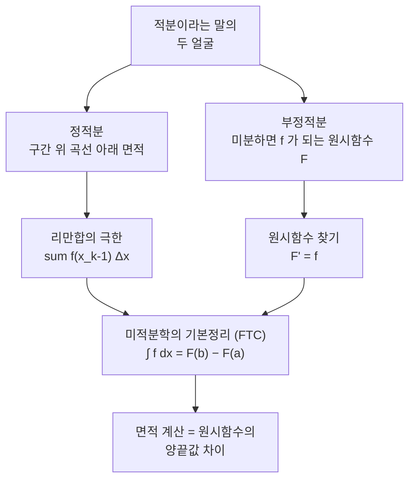

# 멕스웰 방정식, 음함수 미분법, 미적분학의 기본정리 (뉴진수 9강)

이번 시간은 앞부분에서 맥스웰 방정식과 음함수 미분 질문을 짧게 정리한 뒤, 일변수 적분과 미적분학의 기본정리로 들어갑니다. 정적분을 면적으로 정의하고, 그 면적 계산이 왜 원시함수의 양끝값 차이로 바뀌는지 직관을 따라 봅니다.

> 🧮 [계산 노트북](<03-season-assets/09/ipynb/11. Single-Variable Integration and the FTC-03-season-09.ipynb>) — 리만합 수렴·FTC·망원경 합·테일러 항별적분을 SymPy/NumPy로 검산하고 면적 근사 그래프를 그립니다.

---

## [0. 미분 연산자가 물리 법칙이 되는 자리 · ▶ 00:36](https://www.youtube.com/watch?v=WIj27jM1Ln4&t=36s)

맥스웰 방정식은 전기장과 자기장의 발산, 컬을 이용해 전자기 현상을 적습니다. 여기서 중요한 것은 물리 이야기를 자세히 외우는 것이 아니라, 다변수 미분 연산자가 실제 법칙의 언어가 된다는 점입니다.

뉴턴역학에서는 물체의 위치와 속도, 가속도가 시간에 따라 어떻게 변하는지를 미적분으로 씁니다. 맥스웰 방정식에서는 전기장과 자기장이라는 벡터장의 변화가 발산과 컬로 적힙니다. 전자기파와 빛의 속도 이야기도 이 미분 방정식의 구조에서 나옵니다.

이 부분은 뒤의 적분 단원으로 가기 전에, 미분이 단지 함수 하나의 접선 계산에 머물지 않는다는 연결로 보면 됩니다. 다변수 미분에서 배운 $\nabla$, $\nabla\cdot$, $\nabla\times$가 실제 방정식의 문법으로 쓰입니다.

이 연결을 짧게 정리하면 다음과 같습니다.
- 위치 함수의 시간미분은 속도입니다.
- 속도의 시간미분은 가속도입니다.
- 스칼라장의 공간미분은 그래디언트입니다.
- 벡터장의 공간미분은 발산이나 컬로 읽을 수 있습니다.
적분으로 넘어가도 같은 관점이 남습니다.
작은 변화율들을 모으면 전체 변화가 됩니다.

## [1. 음함수의 해집합 위에서 항등식 읽기 · ▶ 24:02](https://www.youtube.com/watch?v=WIj27jM1Ln4&t=1442s)

이어서 전 회차의 음함수 질문을 마무리했습니다. 식

$$
F(x,y)=x^3+y^3-6xy
$$

가 있다고 할 때, $\mathbb{R}^2$의 모든 점에서 $F(x,y)=0$인 것은 아닙니다. 하지만 $F(x,y)=0$을 만족하는 점들의 집합으로 정의역을 제한하면, 그 집합 위에서는 $F=0$이 항등적으로 성립합니다.

이 구분이 음함수 미분의 출발점입니다. 우리가 곡선 $F(x,y)=0$ 위를 따라 움직인다면, 그 움직임 동안 $F$의 값은 계속 $0$입니다. 따라서 그 곡선 위에서 전미분을 하면 $dF=0$이라고 쓸 수 있습니다.

전미분은

$$
dF=F_x\,dx+F_y\,dy
$$

이므로, 관계식 위에서는

$$
F_x\,dx+F_y\,dy=0
$$

이 됩니다. 이 표기는 다변수 단원 전사본과 적분 단원 초반의 복습 표기를 함께 확인했습니다(→ [전사본](<11. Single-Variable Integration and the FTC.md>) 참조).

> **💭 생각해볼 점** $F(x,y)=0$이 모든 평면에서 항등식인 것은 아닙니다. 그런데 왜 해집합 위에서는 전미분한 뒤 $dF=0$이라고 말할 수 있을까요?

예를 들어 $F(x,y)=x^3+y^3-6xy$에서 어떤 점이 해집합 위에 있다고 합시다.
그 점에서 곡선을 따라 아주 조금 움직이면 여전히 $F=0$인 점에 머문다고 보는 것입니다.
그래서 그 움직임의 접방향에서는 $F$의 변화량이 $0$입니다.
반대로 해집합을 가로질러 움직이면 $F$값은 보통 변합니다.
따라서 $dF=0$은 모든 방향의 말이 아니라 해집합을 따라가는 방향의 말입니다.

## [2. 정적분과 부정적분은 왜 연결되는가 · ▶ 46:10](https://www.youtube.com/watch?v=WIj27jM1Ln4&t=2770s)

이제 적분으로 들어갑니다. 고등학교에서 적분을 배울 때 보통 두 가지를 만납니다. 하나는 미분하면 주어진 함수가 되는 원시함수를 찾는 일, 즉 부정적분입니다. 다른 하나는 구간을 정해 곡선 아래 면적을 구하는 정적분입니다.

처음 보면 이 둘은 전혀 다른 질문처럼 보입니다. "무엇을 미분하면 $x^2$가 나오는가"와 "그래프 $y=x^2$ 아래 $0$에서 $1$까지의 면적은 얼마인가"는 말의 모양부터 다릅니다. 그런데 미적분학의 기본정리는 이 두 질문이 연결된다고 말합니다.

미분해서 $f$가 되는 함수 $F$를 찾으면,

$$
\int_a^b f(x)\,dx=F(b)-F(a)
$$

로 정적분을 계산할 수 있습니다. 단원 전사본의 FTC 표기는 $\int_a^b f'(x)\,dx=f(b)-f(a)$ 형태로 정리되어 있습니다(→ [전사본](<11. Single-Variable Integration and the FTC.md>) 참조).

작은 예로 $f(x)=x^2$를 $0$에서 $1$까지 적분한다고 합시다.
면적 정의로는 포물선 아래 영역을 구해야 합니다.
부정적분으로는 $F(x)=x^3/3$을 찾습니다.
그러면 정적분은
$$
\int_0^1 x^2\,dx=\frac{1^3}{3}-\frac{0^3}{3}=\frac13
$$
입니다.
면적 문제가 원시함수의 양끝값 차이로 바뀐 것입니다.

두 갈래의 질문이 미적분학의 기본정리(FTC) 하나로 이어지는 구조는 다음과 같습니다.

## [3. 리만합: 면적을 직사각형으로 채우기 · ▶ 51:17](https://www.youtube.com/watch?v=WIj27jM1Ln4&t=3077s)

정적분을 면적으로 정의하려면 곡선 아래 영역을 어떻게 계산할지 말해야 합니다. 구간을 잘게 나누고, 각 작은 구간 위에 직사각형을 세웁니다. 직사각형의 폭은 $\Delta x$이고 높이는 그 구간에서의 함수값입니다.

직사각형들의 넓이를 모두 더하면

$$
\sum_{k=1}^n f(x_{k-1})\,\Delta x_{k-1}
$$

같은 합이 나옵니다. 분할을 점점 더 잘게 만들면, 직사각형과 곡선 사이에 남는 자투리 영역이 줄어듭니다. 이 극한이 정적분입니다.

![구간 $[0,1]$을 잘게 나눠 세운 직사각형들로 $y=x^2$ 아래 면적을 근사한 리만합. 폭은 $\Delta x$, 높이는 $f(x_{k-1})$이며, 분할을 잘게 할수록 합은 $\int_0^1 x^2\,dx=\tfrac13$로 수렴한다.](<03-season-assets/09/svg/riemann-sum-rectangles-03-season-09-03.svg>)

> 🔧 [리만합: 면적을 직사각형으로 채우기](<03-season-assets/09/html/riemann-sum-explorer-03-season-09-03.html>)에서 직접 직사각형 개수 $n$과 표본점(왼끝·중점·오른끝)을 바꿔 가며 리만합이 정적분으로 수렴하는 모습을 확인해 보자.

무한히 잘게 나누는 말은 항상 조심해야 합니다. 무한히 더한다고 해서 언제나 값이 잘 정의되는 것은 아닙니다. 연속함수에서 이 방식으로 잘 정의되는 적분을 리만 적분이라고 부르며, 이 표기는 단원 전사본의 정적분 정의와 맞춥니다(→ [전사본](<11. Single-Variable Integration and the FTC.md>) 참조).

리만합의 표기에서 각 기호는 다음 역할을 합니다.
- $[a,b]$는 면적을 구할 구간입니다.
- $x_0,\ldots,x_n$은 구간을 자르는 분점입니다.
- $\Delta x_{k-1}=x_k-x_{k-1}$은 작은 폭입니다.
- $f(x_{k-1})$은 직사각형의 높이로 택한 함수값입니다.
- $\sum$은 작은 직사각형 넓이를 모두 더한다는 뜻입니다.
이 합의 극한을 적분 기호 $\int_a^b f(x)\,dx$로 적습니다.

## [4. \(h\)를 곱한 직사각형은 무엇을 근사하는가 · ▶ 56:37](https://www.youtube.com/watch?v=WIj27jM1Ln4&t=3397s)

리만합에서 참여자 한 분이 정확히 물었습니다. "$h$를 곱한 것이 왜 직사각형의 면적인가?" 작은 구간에서 함수값을 거의 일정하다고 보면, 높이는 $f(x)$이고 폭은 $h$입니다.

그러면 그 작은 직사각형의 넓이는

$$
f(x)\,h
$$

입니다. 곡선은 직사각형의 윗변과 정확히 같지 않으므로 오차가 생기지만, 폭 $h$를 줄이면 자투리 면적이 작아집니다.

이때 $h$는 단순한 기호가 아니라 구간의 폭입니다. 미분에서 $h$가 작은 이동량이었던 것처럼, 적분에서는 작은 폭이 되고, 함수값과 곱해 작은 면적 조각이 됩니다.

## [5. 면적 함수의 미분으로 보는 FTC · ▶ 57:22](https://www.youtube.com/watch?v=WIj27jM1Ln4&t=3442s)

미적분학의 기본정리를 설명하는 한 가지 그림은 면적 함수를 보는 것입니다. $A(x)$를 $a$에서 $x$까지의 면적이라고 합시다. $x$가 $h$만큼 늘어나면 새로 붙는 면적은 폭이 $h$이고 높이가 대략 $f(x)$인 얇은 직사각형처럼 보입니다.

따라서

$$
A(x+h)-A(x)\approx f(x)h
$$

이고, 양변을 $h$로 나눈 뒤 $h\to0$을 보내면

$$
A'(x)=f(x)
$$

라고 읽을 수 있습니다. 즉 면적 함수의 도함수가 원래 함수입니다.

이 설명은 정적분과 부정적분의 연결을 보여 줍니다. 면적을 쌓아 만든 함수가 미분하면 원래 높이 함수로 돌아옵니다. 그래서 면적 계산이 원시함수를 찾는 문제와 연결됩니다.

여기서 $A(x)$는 이미 적분으로 정의된 함수입니다.
$$
A(x)=\int_a^x f(t)\,dt
$$
라고 쓰면, $x$가 오른쪽 끝점입니다.
$x$를 조금 움직이면 새로 붙는 얇은 조각의 높이가 거의 $f(x)$입니다.
그래서 면적 함수의 순간변화율이 $f(x)$가 됩니다.
이것이 FTC의 한 방향입니다.

## [6. 기울기를 잘게 더하면 양끝 높이 차가 된다 · ▶ 1:05:00](https://www.youtube.com/watch?v=WIj27jM1Ln4&t=3900s)

다른 직관도 봤습니다. 함수 $F$의 그래프 위에서 $a$부터 $b$까지 조금씩 움직인다고 합시다. 작은 폭 $h$만큼 갈 때 높이 변화는 대략 $F'(x)h$입니다.

이 작은 높이 변화들을 계속 더하면, 결국 처음 높이와 마지막 높이의 차이

$$
F(b)-F(a)
$$

가 됩니다. 한편 작은 변화량 $F'(x)h$들을 무한히 잘게 더하는 표기는

$$
\int_a^b F'(x)\,dx
$$

입니다.

그래서

$$
\int_a^b F'(x)\,dx=F(b)-F(a)
$$

가 됩니다. 이 설명은 망원경 합과 같은 구조를 갖습니다. 중간 높이들은 더하고 빼는 과정에서 사라지고, 양끝값만 남습니다.

## [7. 무한히 더한다는 말과 망원경 합 · ▶ 1:10:01](https://www.youtube.com/watch?v=WIj27jM1Ln4&t=4201s)

"정적분을 무한대로 보내면 왜 원시함수 차이가 나오느냐"는 질문은 FTC의 증명 방향을 묻는 질문입니다. 구간을 $a=x_0<x_1<\cdots<x_n=b$로 나누면

$$
F(b)-F(a)=\sum_{k=1}^n\{F(x_k)-F(x_{k-1})\}
$$

입니다. 오른쪽은 중간 항들이 모두 상쇄되는 망원경 합입니다.

각 작은 차이는 미분의 정의로

$$
F(x_k)-F(x_{k-1})\approx F'(x_{k-1})\Delta x_{k-1}
$$

라고 근사됩니다. 분할을 잘게 만들면 이 근사가 정적분으로 갑니다. 그래서 "기울기를 폭만큼 곱한 작은 변화량"을 모두 더하면 양끝 높이 차가 됩니다.

망원경 합을 세 항으로만 써 보면 구조가 보입니다.
$$
(F(x_1)-F(x_0))+(F(x_2)-F(x_1))+(F(x_3)-F(x_2))
$$
에서 $F(x_1)$과 $F(x_2)$는 한 번 더해지고 한 번 빠집니다.
결국 $F(x_3)-F(x_0)$만 남습니다.
구간을 아주 많이 잘라도 같은 상쇄가 반복됩니다.
이 상쇄가 적분값을 양끝값 차이로 바꾸는 대수적 뼈대입니다.

## [8. 적분 계산의 세 단계와 원시함수의 어려움 · ▶ 1:16:31](https://www.youtube.com/watch?v=WIj27jM1Ln4&t=4591s)

FTC를 계산 도구로 쓰면 절차는 간단해 보입니다. 첫째, 적분하려는 함수 $f$를 봅니다. 둘째, 미분하면 $f$가 되는 함수 $F$를 찾습니다. 셋째, $F(b)-F(a)$를 계산합니다.

문제는 둘째 단계입니다. $x^n$이나 $\sin x$, $\cos x$, $e^x$처럼 잘 아는 함수는 원시함수를 찾을 수 있습니다. 하지만 $e^{-x^2}$, $\sin x/x$, $\sin(x^2)$ 같은 함수는 초등함수 꼴의 원시함수를 쉽게 찾을 수 없습니다.

그래도 원시함수가 유일하지 않다는 점은 정리할 수 있습니다. 두 원시함수 $F,G$가 같은 도함수 $f$를 갖는다면 $(F-G)'=0$입니다. 미분가능한 구간에서는 $F-G$가 상수이므로, 원시함수들은 상수만큼만 다릅니다.

> **💭 생각해볼 점** 적분을 잘한다는 말은 결국 "미분하면 주어진 함수가 되는 함수를 알아본다"는 말입니다. 그런데 원시함수를 모르는 함수의 정적분은 어떻게 다룰 수 있을까요?

## [9. 상수 \(C\)와 정적분의 양끝값 · ▶ 1:28:27](https://www.youtube.com/watch?v=WIj27jM1Ln4&t=5307s)

부정적분에는 항상 상수 $C$가 붙습니다. 미분하면 상수는 사라지므로, 같은 도함수를 갖는 원시함수들은 상수만큼 다를 수 있습니다.

하지만 정적분에서 $F(b)-F(a)$를 계산하면 이 상수는 사라집니다.

$$
(F(b)+C)-(F(a)+C)=F(b)-F(a)
$$

입니다.

그래서 부정적분에서는 상수 차이를 기억해야 하지만, 정적분 계산에서는 어떤 원시함수를 잡아도 양끝값 차이는 같습니다. 이것이 FTC를 계산 도구로 쓸 수 있게 해 주는 작은 안정성입니다.

## [10. \(e^x\), 로그, 그리고 테일러 급수로 넘어가는 이유 · ▶ 1:36:21](https://www.youtube.com/watch?v=WIj27jM1Ln4&t=5781s)

$e^x$는 미분해도 자기 자신이 되는 특별한 함수입니다. 그래서 미분과 적분에서 계속 자연스럽게 나타납니다. 자연로그도 $e^x$의 역함수로 등장하고, 대학 이후의 계산에서는 밑을 따로 쓰지 않는 $\log x$가 자연로그를 뜻하는 경우가 많습니다.

원시함수를 모르는 적분을 만났을 때는 다른 길을 찾아야 합니다. 그 길 중 하나가 테일러 급수입니다. 함수를 다항식의 무한합으로 표현할 수 있다면, 각 항은 거듭제곱 함수이므로 적분하기 쉬워집니다.

그래서 다음 시간에는 테일러 급수와 FTC가 만나는 지점을 봅니다. 미분을 통해 얻은 계수 정보로 함수를 급수로 표현하고, 그 급수를 항별로 적분해 정적분을 계산하려는 전략입니다.

## 요약

- 맥스웰 방정식은 발산과 컬 같은 다변수 미분 연산자가 물리 법칙의 언어가 되는 예다.
- 음함수 미분에서는 $F(x,y)=0$의 해집합 위에서 $F=0$이 항등적으로 성립하므로 $dF=0$을 쓴다.
- 정적분은 구간 위 곡선 아래 면적이고, 리만합의 극한으로 정의된다.
- 미적분학의 기본정리는 $\int_a^b F'(x)\,dx=F(b)-F(a)$로, 면적 계산과 원시함수 계산을 연결한다.
- 리만합의 작은 항 $f(x)h$는 폭 $h$와 높이 $f(x)$를 가진 직사각형 면적이다.
- 정적분 계산은 원시함수 $F$를 찾는 단계가 어렵고, 원시함수를 모르는 경우 테일러 급수 같은 우회로가 필요하다.
