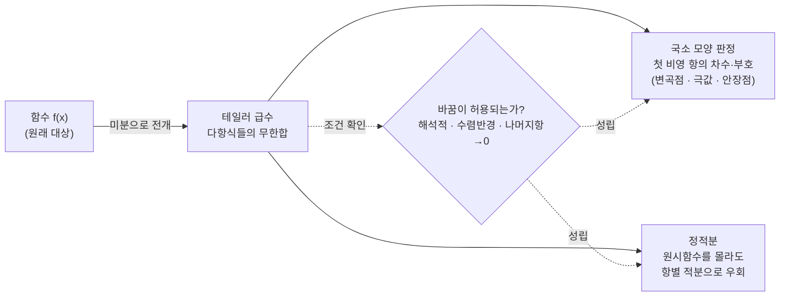

# 테일러 급수와 미적분학에 대한 디스커션 (뉴진수 10강)

이번 시간에는 테일러 급수를 둘러싼 질문들을 따라갑니다. 변곡점과 안장점, 라그랑주 나머지항, 해석적 함수와 수렴반경을 거쳐, 원시함수를 모르는 적분을 테일러 급수로 다루는 FTC 응용까지 봅니다.

전체 흐름은 함수를 다른 구조로 옮겨 계산하는 이야기입니다.
테일러 급수는 복잡한 함수를 다항식들의 무한합으로 바꾸고, FTC는 적분 문제를 원시함수의 경계값 문제로 바꿉니다.
그 바꿈이 언제 허용되는지 묻는 것이 해석적 함수, 수렴반경, 나머지항 조건입니다.

> 🧮 [계산 노트북](<03-season-assets/10/ipynb/11. Single-Variable Integration and the FTC-03-season-10.ipynb>) — SymPy/NumPy 로 나머지항·수렴반경·항별 적분을 검산하고 $\int_0^1 e^{-x^2}dx$ 수렴 그래프를 그립니다.

---

## [0. 이계도함수, 변곡점, 안장점 구분하기 · ▶ 04:13](https://www.youtube.com/watch?v=w85OkVogjwU&t=253s)

첫 질문은 이계도함수와 변곡점, 안장점의 관계였습니다. 일변수 함수에서 이계도함수는 그래프의 오목/볼록을 읽는 데 쓰입니다. 예를 들어 $y=x^2$는 두 번 미분하면 양수이므로 아래로 볼록이고, $y=-x^2$는 위로 볼록입니다.

$y=x^3$은 원점의 왼쪽과 오른쪽에서 오목/볼록이 바뀝니다. 그래서 원점은 변곡점입니다. 반면 $y=x^4$는 원점에서 이계도함수가 $0$이지만 양쪽 모두 아래로 볼록입니다. 따라서 이계도함수가 $0$이라고 해서 자동으로 변곡점이라고 말할 수는 없습니다.

안장점은 일변수보다 다변수에서 자연스럽게 나오는 말입니다. 예를 들어 한 방향으로 자르면 아래로 볼록이고, 다른 방향으로 자르면 위로 볼록인 표면을 생각합니다. 어느 한 방향의 이계도함수 하나만으로는 그 점의 형태를 다 설명할 수 없습니다.

판정 관계를 문장으로 나누면 다음과 같습니다.
- 변곡점이면 보통 오목/볼록이 바뀝니다.
- 이계도함수가 존재하고 변곡점이면 그 점에서 $f''=0$인 경우가 많습니다.
- 하지만 $f''=0$이라고 해서 오목/볼록이 바뀌는 것은 아닙니다.
- $x^3$은 부호가 바뀌는 예입니다.
- $x^4$는 부호가 바뀌지 않는 예입니다.
따라서 "이계도함수 0"은 검사 신호이지 결론이 아닙니다.

> **💭 생각해볼 점** "이계도함수 $=0$"은 왜 변곡점의 필요조건처럼 보이지만 충분조건은 아닐까요? $x^3$과 $x^4$를 직접 비교해 보세요.

## [1. 다변수 극값과 해시안의 자리 · ▶ 16:44](https://www.youtube.com/watch?v=w85OkVogjwU&t=1004s)

다변수로 올라가면 이계도함수도 하나가 아닙니다. $x$로 두 번 미분할 수도 있고, $y$로 두 번 미분할 수도 있고, $x$와 $y$로 한 번씩 섞어 미분할 수도 있습니다. 그래서 이 정보들을 행렬로 모은 해시안 행렬이 등장합니다.

안장점 판정도 이 해시안의 성질과 관련됩니다. 그러나 오늘은 해시안 판정법을 전개하기보다, 왜 일변수의 오목/볼록 직관을 그대로 가져오면 안 되는지를 확인하는 데서 멈춥니다.

극값을 판정할 때는 한 방향만 보는 것이 아니라 가능한 여러 방향을 봐야 합니다. 어떤 방향으로는 함수값이 증가하고 다른 방향으로는 감소한다면, 그 점은 극대도 극소도 아닌 안장점일 수 있습니다.

대표 예시는
$$
f(x,y)=x^2-y^2
$$
입니다.
$y=0$으로 자르면 $f(x,0)=x^2$라서 원점이 아래로 볼록해 보입니다.
$x=0$으로 자르면 $f(0,y)=-y^2$라서 원점이 위로 볼록해 보입니다.
같은 점이 방향에 따라 극소처럼도, 극대처럼도 보입니다.
이것이 안장점이라는 말의 수학적 내용입니다.

## [2. 테일러 급수와 고차 도함수 검증 · ▶ 25:17](https://www.youtube.com/watch?v=w85OkVogjwU&t=1517s)

다음 질문은 테일러 정리의 나머지항이 왜 그런 모양을 갖는가였습니다. $f$를 $a$ 근처에서 $n$차 다항식으로 근사하면

$$
f(x)=f(a)+f'(a)(x-a)+\cdots+\frac{f^{(n)}(a)}{n!}(x-a)^n+R_n(x)
$$

처럼 씁니다. 여기서 $R_n(x)$가 나머지항입니다.

라그랑주 형태의 나머지항은 어떤 $c$가 $a$와 $x$ 사이에 존재해서

$$
R_n(x)=\frac{f^{(n+1)}(c)}{(n+1)!}(x-a)^{n+1}
$$

처럼 쓸 수 있다는 식입니다. 이 표기는 단원 전사본의 테일러 급수와 나머지항 흐름을 확인해 맞추었습니다(→ [전사본](<11. Single-Variable Integration and the FTC.md>) 참조).

이 식은 $c$를 실제로 쉽게 찾게 해 주는 공식이라기보다, $n$차 다항식 근사가 원래 함수와 얼마나 차이 나는지를 표현하는 방식입니다. 평균값정리의 일반화처럼 보면 좋습니다. 평균값정리가 어떤 구간 안의 한 점에서 평균 기울기를 실현한다고 말하듯, 라그랑주 나머지항도 구간 안의 어떤 점 $c$에서의 고차 도함수로 오차를 표현합니다.

나머지항을 읽는 목적은 두 가지입니다.
- 근사값이 실제값과 얼마나 떨어질 수 있는지 재기.
- 앞의 항들이 사라질 때 남은 첫 항의 부호를 보기.
첫 번째는 수치 계산의 오차 추정입니다.
두 번째는 극값이나 변곡을 판정할 때의 국소 모양 분석입니다.
그래서 같은 테일러 정리라도 계산 문제와 형태 판정 문제에서 다르게 쓰입니다.

## [3. \(c\)는 찾는 값이 아니라 존재하는 값이다 · ▶ 26:50](https://www.youtube.com/watch?v=w85OkVogjwU&t=1610s)

라그랑주 나머지항에서 갑자기 $c$가 등장하니 질문이 생깁니다. 이 $c$는 보통 계산으로 정확히 찾는 값이 아닙니다. $a$와 $x$ 사이 어딘가에 그런 점이 존재한다는 보장입니다.

평균값정리에서도 비슷한 일이 일어납니다. 구간 평균 기울기와 같은 순간 기울기를 갖는 점 $c$가 어딘가에 존재한다고 말하지만, 그 점을 항상 손쉽게 구하는 것은 아닙니다.

테일러 나머지항에서도 $c$는 오차의 크기를 추정하게 해 주는 장치입니다. $f^{(n+1)}$가 구간에서 얼마나 큰지 알면, 정확한 $c$를 몰라도 나머지항의 크기를 제한할 수 있습니다.

> **💭 생각해볼 점** 나머지항의 $c$를 "구해야 하는 미지수"로 보면 식이 막힙니다. "구간 안 어딘가의 값으로 오차를 표현할 수 있다"는 정리로 읽으면 무엇이 달라집니까?

## [4. 나머지항의 부호와 극값 형태 · ▶ 42:30](https://www.youtube.com/watch?v=w85OkVogjwU&t=2550s)

극값을 볼 때 낮은 차수의 도함수가 모두 사라지는 경우가 있습니다. 예를 들어 1차 도함수가 $0$이고, 2차 도함수도 $0$이면 2차 판정법만으로는 충분하지 않습니다. 이때 더 높은 차수의 항을 봐야 할 수 있습니다.

테일러 전개는 그 상황을 체계적으로 표현합니다. 앞의 항들이 모두 사라지면, 처음으로 사라지지 않는 고차항의 차수와 부호가 함수가 그 점 근처에서 위로 가는지 아래로 가는지에 영향을 줍니다. 그래서 고차 도함수 검증법이 테일러 전개와 연결됩니다.

다만 실제 예를 보지 않으면 이 설명은 추상적으로 느껴질 수 있습니다. 오늘 대화에서도 구체적인 함수 예시를 나중에 다시 보기로 했습니다. 지금은 "나머지항은 남은 오차이고, 그 오차의 첫 비영 항이 국소 모양을 좌우할 수 있다"는 정도를 잡아두면 됩니다.

## [5. 왜 고차항까지 보아야 하는가 · ▶ 45:04](https://www.youtube.com/watch?v=w85OkVogjwU&t=2704s)

"고차항이 왜 필요한지 잘 모르겠다"는 반응이 있었습니다. 낮은 차수에서 이미 부호가 결정되면 고차항까지 갈 필요가 없습니다. 예를 들어 $f'(a)=0$이고 $f''(a)>0$이면 국소적으로 아래로 볼록한 극소 후보입니다.

하지만 낮은 차수 항들이 사라지면 이야기가 달라집니다. $x^4$는 원점에서 1차, 2차, 3차 정보가 모두 약하게 보이지만 4차항이 양수라서 원점 근처에서 위로 올라갑니다. $x^3$은 처음 사라지지 않는 항이 홀수차라 양쪽 부호가 바뀝니다.

테일러 전개는 "처음으로 사라지지 않는 항"을 찾는 언어입니다. 그 항의 차수가 짝수인지 홀수인지, 계수가 양수인지 음수인지가 국소 모양을 결정합니다.

일변수에서는 다음처럼 볼 수 있습니다.
- 처음 남는 항이 짝수차이고 계수가 양수이면 양쪽에서 위로 올라갑니다.
- 처음 남는 항이 짝수차이고 계수가 음수이면 양쪽에서 아래로 내려갑니다.
- 처음 남는 항이 홀수차이면 좌우 부호가 바뀝니다.
- 그래서 $x^4$는 극소 모양이고, $-x^4$는 극대 모양입니다.
- $x^3$은 좌우 부호가 바뀌므로 극값이 아니라 변곡점입니다.
이 판단이 바로 고차 도함수 검증과 테일러 전개의 연결입니다.

## [6. 해석적 함수: 테일러 급수와 함수가 같다는 가정 · ▶ 54:50](https://www.youtube.com/watch?v=w85OkVogjwU&t=3290s)

노트에는 함수가 테일러 급수로 표현된다고 가정하는 부분이 나옵니다. 이 가정은 가볍지 않습니다. 어떤 함수가 무한히 많이 미분 가능하다고 해서 반드시 자기 테일러 급수와 같은 것은 아닙니다.

테일러 급수

$$
\sum_{k=0}^{\infty}\frac{f^{(k)}(0)}{k!}x^k
$$

가 실제 함수 $f(x)$와 같은 경우, 그런 함수를 해석적 함수라고 부릅니다(→ [전사본](<11. Single-Variable Integration and the FTC.md>) 참조). $e^x$, $\sin x$, $\cos x$는 대표적인 해석적 함수입니다.

반대로 매끄럽지만 해석적이지 않은 함수도 있습니다. 예를 들어 $x=0$에서 모든 도함수가 $0$이 되도록 만들어지는 유명한 예가 있습니다. 그러면 0에서의 테일러 급수는 전부 $0$이지만, 함수 자체는 0 바깥에서 0이 아닐 수 있습니다.

흔히 드는 예는 $x>0$에서 $e^{-1/x^2}$처럼 급격히 작아지고, $x\le0$에서는 $0$으로 두는 함수입니다.
이 함수는 0에서 모든 도함수가 $0$이 되도록 만들 수 있습니다.
그러면 0에서의 테일러 급수는 $0+0x+0x^2+\cdots$입니다.
하지만 $x>0$에서는 함수값이 실제로 $0$이 아닙니다.
따라서 "무한히 미분 가능"과 "테일러 급수가 함수를 복원"은 분리됩니다.

> **✏️ 연습문제** 수업에서 언급한 비해석적 함수 예를 0에서 테일러 전개하려고 시도해 보세요. 모든 도함수 값이 어떻게 되는지, 그리고 그 급수가 원래 함수를 왜 복원하지 못하는지 확인해 보세요.

## [7. 수렴반경: 급수가 어디서 의미 있는가 · ▶ 1:05:17](https://www.youtube.com/watch?v=w85OkVogjwU&t=3917s)

테일러 급수는 무한합이므로 수렴 문제가 생깁니다. 같은 식이라도 $x$값에 따라 수렴할 수도 있고 발산할 수도 있습니다. 그래서 수렴반경이라는 말을 씁니다.

간단한 예로

$$
1+x+x^2+x^3+\cdots
$$

를 생각할 수 있습니다. $x=1$이면 $1+1+1+\cdots$가 되어 수렴하지 않습니다. $|x|<1$이면 등비급수처럼 수렴합니다. 이처럼 급수가 의미 있게 값을 주는 $x$의 범위를 따져야 합니다.

테일러 정리의 나머지항도 이 문제와 연결됩니다. 차수를 무한히 올릴 때 나머지항이 $0$으로 가야 함수가 그 테일러 급수와 같아집니다. 어떤 구간에서는 되고, 구간을 벗어나면 안 될 수 있습니다.

등비급수 예는 수렴반경의 감각을 줍니다.
$$
\frac{1}{1-x}=1+x+x^2+x^3+\cdots
$$
는 $|x|<1$에서 맞습니다.
$x=1/2$를 넣으면 오른쪽은 $1+1/2+1/4+\cdots=2$로 수렴합니다.
$x=2$를 넣으면 항이 커져서 의미 있는 합이 되지 않습니다.
같은 공식도 어디에서 쓰느냐에 따라 맞거나 틀립니다.

## [8. 비해석적 함수와 수치해석의 태도 · ▶ 1:17:27](https://www.youtube.com/watch?v=w85OkVogjwU&t=4647s)

해석적이지 않은 함수 예시는 수치해석과도 연결됩니다. 실제 계산에서는 함수 전체를 정확히 알기보다, 특정 구간에서 필요한 정확도만큼 근사할 때가 많습니다.

테일러 급수가 전역적으로 함수를 복원하지 못하더라도, 어떤 구간에서 낮은 차수 근사가 충분히 좋을 수 있습니다. 반대로 원점에서 모든 도함수가 $0$인 함수처럼, 한 점의 테일러 정보만으로는 주변 함수값을 전혀 설명하지 못하는 경우도 있습니다.

그래서 "테일러 급수로 전개한다"는 말은 항상 조건과 목적을 함께 봐야 합니다. 정확한 등식이 필요한지, 근사 계산이면 되는지, 구간은 어디인지가 모두 달라집니다.

## [9. FTC와 테일러 급수: 원시함수를 몰라도 적분하기 · ▶ 1:17:27](https://www.youtube.com/watch?v=w85OkVogjwU&t=4647s)

이제 미적분학의 기본정리와 테일러 급수를 연결합니다. 보통 정적분

$$
\int_a^b f(x)\,dx
$$

를 계산하려면 미분해서 $f$가 되는 원시함수 $F$를 찾아 $F(b)-F(a)$를 계산합니다. 그런데 원시함수 $F$를 모르는 경우가 많습니다.

만약 $f$가 테일러 급수로 표현된다면 다른 길이 있습니다.

$$
f(x)=\sum_{k=0}^{\infty}a_kx^k
$$

라고 놓고, 각 항을 적분하면 됩니다. 거듭제곱 함수 $x^k$의 적분은 알고 있으므로

$$
\int_a^b f(x)\,dx
=\sum_{k=0}^{\infty}a_k\int_a^b x^k\,dx
$$

처럼 계산하거나 근사할 수 있습니다.

이것은 FTC를 버리는 것이 아니라, FTC를 직접 적용하기 어려운 함수를 급수로 바꾸어 우회하는 것입니다. 왼쪽은 원래 정적분이고, 오른쪽은 미분으로 얻은 테일러 계수와 거듭제곱 적분을 이용한 합입니다.

예를 들어 $e^{-x^2}$의 원시함수는 초등함수로 간단히 쓰기 어렵습니다.
하지만
$$
e^{-x^2}=1-x^2+\frac{x^4}{2!}-\frac{x^6}{3!}+\cdots
$$
라고 전개하면 각 항은 적분할 수 있습니다.
그러면 $0$부터 $1$까지의 적분을
$$
1-\frac13+\frac{1}{2!\,5}-\frac{1}{3!\,7}+\cdots
$$
처럼 근사할 수 있습니다.
이것이 원시함수를 모를 때 테일러 급수가 하는 일입니다.

> 🔧 [원시함수를 몰라도 적분하기](<03-season-assets/10/html/taylor-series-integration-03-season-10-09.html>)에서 직접 항 수 $K$ 와 상한 $b$ 를 바꿔 부분합이 참값으로 수렴하는 과정을 확인해 보자.

## [10. 원시함수를 모른다는 말의 정확한 뜻 · ▶ 1:28:14](https://www.youtube.com/watch?v=w85OkVogjwU&t=5294s)

대화 중에는 "왼쪽의 원시함수를 모르는데 오른쪽을 어떻게 계산하느냐"는 혼동도 있었습니다. 여기서 모른다는 것은 초등함수 꼴의 닫힌 형태를 모른다는 뜻으로 이해하면 좋습니다.

정적분

$$
\int_a^b f(x)\,dx
$$

은 면적으로 정의되어 있습니다. 원시함수의 예쁜 식을 모른다고 해서 정적분 자체가 사라지는 것은 아닙니다. 다만 FTC로 바로 계산하기 어렵습니다.

테일러 급수는 $f$를 적분하기 쉬운 거듭제곱들의 합으로 바꾸어 줍니다. 그러면 원시함수 전체를 닫힌 꼴로 쓰지 못해도, 정적분 값을 급수나 근사값으로 계산할 수 있습니다.

## [11. 공식보다 조건을 함께 보기 · ▶ 1:38:18](https://www.youtube.com/watch?v=w85OkVogjwU&t=5898s)

테일러 급수는 강력하지만, "항별로 미분하고 적분해도 되는가", "급수가 수렴하는가", "나머지항이 0으로 가는가"를 함께 물어야 합니다. 이 조건들을 무시하면 식은 그럴듯해 보여도 실제 함수값이나 적분값을 설명하지 못할 수 있습니다.

그래서 오늘의 논의는 계산법 하나를 외우는 것으로 끝나지 않습니다. 테일러 급수는 함수를 다항식들의 무한합으로 바꾸어 미분과 적분을 쉽게 만들지만, 그 바꿈이 정당화되는 범위를 확인해야 합니다.

다음으로 갈수록 이 태도가 계속 필요합니다. 미적분학의 기본정리도, 테일러 급수도, 해석적 함수도 모두 "무한 과정이 어떤 조건에서 잘 정의되는가"를 묻는 언어입니다.

## 요약

- 일변수에서 이계도함수 $0$은 변곡점의 충분조건이 아니며, $x^3$과 $x^4$가 그 차이를 보여 준다.
- 다변수 극값에서는 방향마다 곡률이 달라질 수 있어 해시안 같은 2차 정보가 필요하다.
- 테일러 정리의 라그랑주 나머지항은 $n$차 다항식 근사와 원래 함수의 오차를 구간 안의 어떤 점 $c$에서의 고차 도함수로 표현한다.
- 해석적 함수는 자기 테일러 급수와 실제 함수가 같은 함수이며, 무한히 미분 가능하다는 것만으로는 충분하지 않다.
- 고차항은 낮은 차수 정보가 사라질 때 국소 모양을 결정하는 첫 비영 항을 찾게 해 준다.
- 테일러 급수는 수렴반경과 나머지항 조건을 확인해야 하며, 원시함수를 모르는 정적분을 항별 적분으로 우회하는 데 쓰일 수 있다.
- 테일러 급수와 FTC는 함수를 다항식 구조와 경계값 구조로 옮겨 계산하게 하지만, 그 이동에는 수렴과 항별 연산 조건이 필요하다.
