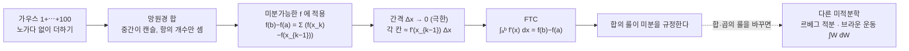

# 적분의 욕망과 미적분학의 기본정리 (4기 영상)

이번 시간에는 먼저 다변수 미분(방향도함수와 미분가능성의 정의)을 구체화에서 추상화로 넘어가는 시선으로 다시 짚고, 그다음에 적분이 무엇인지를 가우스의 1부터 100까지 더하기와 망원경 합을 통해 만들어 봅니다. 그 흐름 끝에서 미적분학의 기본정리(FTC)가 자연스럽게 떨어지는 것을 보겠습니다.

---

## [0. 일변수 미분 — 의미는 잠시 미루고 정의(룰)부터 · ▶ 03:09](https://www.youtube.com/watch?v=3tvhhhqmUts&t=189s)

오늘 다룰 내용은 미분과 적분이고, 그 결을 관통하는 것은 수학을 **구체화와 추상화** 사이에서 어떻게 사유하는가입니다. 수학은 기본적으로 계산과 논리로 이루어져 있는데, 거기에 더해 이 두 속성을 왔다 갔다 하는 데 초점을 맞추려 합니다.

미분 얘기부터 다시 해 보겠습니다. 가장 갖고 있는 바텀에서 출발해 추상화된 정의까지 가려면, 구체화를 잘 설계할 수밖에 없습니다. 그래서 미분에 대해 가장 쉬운 상황부터 봅니다.

가장 쉬운 상황은 일변수 함수 $y=f(x)$ 입니다. 이것에 대해 $f'(x)$ 를 도함수라고 부른다 — 이것이 출발점입니다. 여기서는 의미는 잠시 빼고, 그냥 수학적인 정의로 담백하게 봅니다. $f(x)$ 가 있을 때 $f'(x)$ 의 정의와 그 예시들이, 우리가 잡을 수 있는 가장 구체적인 것 아니겠습니까.

그래서 몇 가지 룰부터 익숙해집니다.

$$
f(x)=x^{\alpha}\ \Rightarrow\ f'(x)=\alpha\,x^{\alpha-1},\qquad
(\sin x)'=\cos x,\qquad (\cos x)'=-\sin x,\qquad (e^{2x})'=2e^{2x}
$$

이 단계에서는 "이게 무슨 뜻이냐"를 붙이지 않는 것이 적절합니다. 물론 의미는 중요한 질문이지만, 그건 별개의 얘기입니다. 일단 "아, 이런 거구나"부터 출발하고, 익숙해진 다음에 의미를 묻습니다.

이 대목에서 몇 가지를 함께 짚었습니다.

- $\dfrac{1}{x}$ 의 미분 → $-\dfrac{1}{x^2}$
- $3\ln x$ 의 미분 → $\dfrac{3}{x}$
- $e^{2x}$ 의 미분 → $2e^{2x}$
- $e^{2x}\sin x$ 의 미분 → $2e^{2x}\sin x + e^{2x}\cos x$ (라이프니츠 곱미분)
- $x\ln x$ 의 미분 → $x\cdot\dfrac{1}{x} + \ln x = 1 + \ln x$

이렇게 손에 익은 다음에야, "지금 이게 하는 짓이 무슨 짓이냐"를 물을 수 있습니다. 거기서 해야 하는 일은 $y=f(x)$ 의 그래프를 그려 놓고, 미분계수의 정의를 들이밀어 이것이 **순간 접선의 기울기**라는 의미를 파악한 다음, 극한의 개념을 쓰는 것입니다. 이게 통상적으로 일변수 미적분학에서 미분을 배우는 방식입니다.

> 🧮 [계산 노트북](<04-season-assets/26/ipynb/11. Single-Variable Integration and the FTC-04-season-26.ipynb>) — 미분 룰 검산 · 가우스/망원경 합 · 망원경 합→리만 합→정적분 수렴 그래프.

---

## [1. 이변수 미분으로 점프 — 방향도함수와 미분가능성 · ▶ 08:43](https://www.youtube.com/watch?v=3tvhhhqmUts&t=523s)

지난주에 우리가 점프했던 곳이 다변수(이변수) 미분입니다. 제가 강조하고 싶은 건, 구체화를 하나씩 쌓아 올리는 방식입니다. 일변수에서 $y=f(x)$ 의 $f'(x)$ 를 알고, 계산할 줄 알고, 의미까지 잡았다고 합시다. 그다음 인풋을 두 개로 늘립니다.

입력이 둘이니 호칭을 $x,y$ 로 하고, $g=f(x,y)$ 라고 둡니다. 일변수에서는 그래프가 곡선이었다면, 이번에는 $xy$-평면의 각 점마다 $g$ 가 $z$축으로 올라가서 그래프가 **곡면(서피스)** 이 됩니다.

여기서 결정적인 차이가 생깁니다. 일변수에서는 한 점을 향해 달려가는 방향이 좌·우 두 방향뿐이라 우극한·좌극한을 논할 수 있었습니다. 그런데 이변수에서는 타깃 점을 향해 달려가는 방향이 평면상 360도, 즉 무한히 많습니다. 그래서 방향을 하나 지정해 줘야 하고, 그렇게 방향을 고정해 미분하는 행위를 **방향도함수**라고 불렀습니다. 방향은 수학적으로는 $\mathbb{R}^2$ 에서 크기가 1인 벡터로 선언하지만, 실은 $x$축·$y$축 같은 기준을 잡자는 뜻입니다.

> **💭 생각해볼 점** "방향도함수가 모든 방향에서 정의되는데 곡면(임의의 곡선)에 대해서까지 미분가능하다는 부분이 잘 이해가 안 된다"는 물음이 있었습니다. 직문수 노트에 그 반례가 있습니다 — 모든 방향에서 방향도함수가 정의되는데도 원점에서 함숫값이 급격히 끊어져 연속이 아닌 함수입니다(→ 전사본 §3, §4 맥락). 일변수 미적분학에서 우리는 "미분가능하면 연속이다", 그리고 "미분가능한 두 함수의 합성도 미분가능하다(그 결과를 체인룰이라 부른다)"를 원했습니다. 그런데 방향마다 미분가능을 논하는 것으로 충분하다고 하면 이 규칙을 위배하게 됩니다. 그래서 그것은 적절한 정의일 수 없습니다.

그래서 결론은 이렇습니다. 타깃 점을 향해 달려가는 방향을 **직선만이 아니라 임의의 곡선**까지 허용하고, 그 모든 방향에 대해 극한이 존재할 때를 미분가능이라고 정의합니다. 임의의 곡선이니 직선들도 다 포함됩니다. 일변수가 수직선이라 직선밖에 못 갔던 것과 달리, 이변수부터는 곡선으로도 점을 향해 달려갈 수 있다는 것이 재미있는 점입니다.

> **💭 생각해볼 점** 방향도함수의 정의로부터 미분가능성의 정의를 곧장 유도하려 할 때 주의할 점이 있습니다. 직선만 가지고 정의하는 것은 틀렸고, 곡선까지 포함해야 합니다.

---

## [2. 노름이 붙는 이유, 체인룰, 그리고 그레디언트 · ▶ 14:36](https://www.youtube.com/watch?v=3tvhhhqmUts&t=876s)

미분가능성의 정의가 왜 그렇게 생겼는지를 보았으니, 그다음에 해야 하는 건 **계산**입니다. 일변수에서 $f$ 로부터 $f'$ 를 구하는 일은 그냥 몇 가지 룰일 뿐이고, 그것을 기울기로 쓸 심상과는 별개입니다. 다변수도 마찬가지로, 심상만 그릴 게 아니라 어떻게 계산하는지를 알아야 합니다.

방향도함수를 실제로 계산하면, 그것이 **그레디언트 벡터와 방향 벡터의 내적**으로 뜬다는 사실이 나옵니다. 이것은 머리로 그린다고 알게 되는 게 아니라, 계산을 해 봄으로써 알게 되는 것입니다. 그리고 그 계산 과정에서 반드시 **체인룰**이 쓰입니다 — 안 쓰고는 계산할 수가 없습니다. 그래서 "체인룰이 다변수 기준으로 이렇게 확장돼 쓰이는구나"를 보게 됩니다.

표준적인 미분가능성의 정의를 보면 분모·분자에 모두 벡터의 크기, 즉 **노름**이 붙어 있습니다. 노름은 결국 속도에 대한 컨트롤입니다. 곡선이든 직선이든 속도만 적절하게 컨트롤할 수 있으면 된다는 것이, 노름을 붙임으로써 깔끔하게 처리되어 있는 것입니다. 직문수 노트에서 방향도함수의 정의로 쭉 가다가 어느 시점에 등가가 깨지는 부분이, 바로 직선과 곡선이 달라지는 지점입니다(→ 전사본 참조).

> **💭 생각해볼 점** "무슨 소린지 모르겠다"는 반응에 대한 답은 딱 하나입니다 — 체인룰을 가지고 직접 계산해 보십시오. 그러면 됩니다. 구체화의 스텝 하나가 비어 있었던 것뿐입니다. 미분이 안 잡힌다고 해서 현학적이거나 철학적인 얘기를 나눠야 하는 게 아닙니다. 미분은 그냥 미분입니다.

> **💭 생각해볼 점** "방향도함수가 그레디언트 방향에서 최대가 된다(구배 방향으로 가장 가파르게 올라간다)는 것도 방향도함수 아니냐"는 물음이 있었습니다. 그건 의미(직관)에 가깝습니다. 방향도함수가 그레디언트와 관계를 맺는 수학적 룰 자체는 체인룰입니다. 미분은 두 가지로 규정됩니다 — 라이프니츠(곱함수의 미분법)와 체인룰(합성함수의 미분법)입니다. 방향도함수를 최종 인풋·아웃풋 기준으로 미분하면 그레디언트 벡터와 방향의 내적이 뜨고, 거기에 내적의 의미(정사영, orthogonal projection)를 섞어 주면 "구배 방향으로 가장 가파르다"가 그냥 나옵니다. 즉 그것은 체인룰의 단순한 결과이고, 더 원형인 것은 체인룰입니다.

---

## [3. 구체화란 값을 확인하는 것 · ▶ 24:21](https://www.youtube.com/watch?v=3tvhhhqmUts&t=1461s)

> **💭 생각해볼 점** "계산을 해 보라는 말씀이, 구체적인 함수 $f$ 를 갖고 그 도함수를 구해 보라는 뜻이냐"는 물음이 있었습니다. 그게 아닌 게 있을까요. 수학에서 구체화란 **값을 보는 방식**, 밸류를 확인하는 방식이어야 합니다. 그것만이 구체화입니다. 내가 구체적으로 출력을 끌어낼 줄 모르는데 어떻게 그것을 구체화라 할 수 있겠습니까. 하다못해 상수함수를 가지고라도 정말로 미분이 $0$ 이 되는지 확인해 봐야 합니다. 우리가 가진 시야는 회의론적·유물론적 시각, 즉 "이거 값이 뭔데?"라고 확인하는 시각입니다. 확인하지 않고 안다고 느끼는 것이 오히려 이상한 일입니다. 우리가 $2\times 2$ 행렬 계산, 고유치·고유벡터 계산을 일일이 해 보고 넘어가는 것도 같은 이유입니다.

정리하면, 구체화에서 추상화로 넘어가는 다변수 미분의 이해는 다음 스텝들을 하나씩 짚으면 되는 문제입니다.

- 일변수 상황을 이해하고 있는가
- 일변수에서 계산할 수 있는가
- 다변수 상황으로 점프하는 욕망과 심상에 공감이 가는가
- 다변수 상황에서 실제로 미분을 취할 수 있는가

---

## [4. 추상화·구체화를 다시 — 징검다리 놓기 · ▶ 27:05](https://www.youtube.com/watch?v=3tvhhhqmUts&t=1625s)

오늘 제가 정작 건드리고 싶은 핵심을 한 번 더 말씀드립니다. 어떤 개념(가령 미분가능의 정의)을 봤는데 이해가 안 갑니다. 요즘은 AI에 물어도, 위키피디아·백과사전을 봐도 "이게 무슨 소리냐" 싶습니다. 그건 우리가 추상화된 산물만 보고 있기 때문입니다.

추상화란 굉장히 많은 정보를 덜어내고 엑기스만 남긴 것입니다. 그렇다면 봐야 하는 것은, **덜어내기 전에 무엇을 관찰해서 덜어냈는가**입니다. 초점을 맞춰야 할 것은 "어떤 관찰로부터 이렇게까지 이르렀을까"이고, 그 숨은 휴리스틱을 맞춰 가는 과정이 곧 구체화를 잡아내는 과정입니다.

> **💭 생각해볼 점** 최신 핸드폰의 설계도가 있고 AI 같은 도구로 편하게 물어볼 수 있어서 설령 그 핸드폰을 만들 수 있게 되더라도, 그것을 정말로 이해했다고 할 수 있을까요? 우리가 보는 수학적 선언과 명제는 전부 추상어로 적혀 있습니다. 과거에 그것이 어떻게 다듬어져 왔는지를 모른 채 가장 최신의 설계도만 보고 "이해가 안 가니 내 머리가 나쁘다"고 한다면, 그게 더 이상한 일입니다 — 연결 고리를 모르니 이해가 안 가는 것이 당연하기 때문입니다. 설계도를 만든 사람에게는 욕망과 이유가 있는데, 그걸 하나도 공감하지 못하면서 아름답다고만 하는 것은 이상합니다.

새로운 개념을 볼 때 해야 하는 작업은 자신에게 와닿는 **구체화의 징검다리**를 놓는 것입니다. "적어도 여기까지는 왔다. 그런데 여기와 여기 사이에 징검다리가 비어 있다"고 말할 수 있어야 합니다. 그 방식은 사람마다 다르지만, 서로 다른 설계 방식 안에서 보편성을 보게 됩니다. 적어도 이변수 미분가능의 정의를 보려면 $f$ 와 $f'$ 계산은 해 봤어야 하고, 기울기의 정의는 알아야 합니다.

---

## [5. 적분 — '미적분학'이라는 말의 오류와 오늘날의 적분 · ▶ 30:06](https://www.youtube.com/watch?v=3tvhhhqmUts&t=1806s)

이제 적분으로 넘어갑니다. 사실 '미적분학'이라는 워딩에는 오류가 있습니다. 캘큘러스(calculus)를 번역한 말인데, '미분이 먼저, 적분이 그다음'이라는 순서가 박혀 있기 때문입니다. **사실은 반대입니다 — 적분이 먼저고 미분이 그다음입니다.**

논리적으로 보면, 미분가능하면 연속이고(우리는 그렇게 만들 겁니다), 연속이면 적분이 가능합니다. 그런데 오늘날 우리가 쓰는 미적분학은 적분만 가능한 데서도 작동해야 합니다. 가장 중요한 이유는 AI입니다. AI에 쓰이는 수학은 기본적으로 미적분학이지만, 확률·통계도 다 미적분학입니다. 거기서 다루는 함수들 — 랜덤 변수의 기대값·분산 같은 것에서 나오는 함수들 — 은 기본적으로 연속이 아니고 깨집니다. 그럼에도 우리는 적분을 토대로, 미적분학의 기본정리를 세워서 미분을 만들어 냅니다. 미분이 가능한 함수는 함수들 중에서 너무 제한적이기 때문에, 실질적으로는 이론을 반대로 만듭니다. 그래서 직문수에서는 미분을 먼저 두고 적분을 모아 만들지만, 진짜 순서는 반대라는 점을 기억해 두십시오.

> **📚 참고·응용** 오늘날엔 알파벳 A부터 G까지, 분야마다 그에 맞는 미적분학이 다 개발되어 있습니다 — 해석학·대수학·위상수학·기하·정수론·응용수학·AI 각각에 대한 미적분학이 있고, 그 토대가 서로 다릅니다. (호몰로지·코호몰로지 같은 괴랄한 단어 앞에 붙는 형용사가 그 분야들이라고 보면 됩니다.) 마치 안드로이드와 iOS가 내부는 완전히 다르지만 둘 다 스마트폰인 것과 같습니다. 여러분이 직문수에서 배우는 미적분학은 오일러 시절(17세기, 라이프니츠·뉴턴까지 거슬러 올라가는)의 것으로, 요긴하지만 전부는 아닙니다. 특히 실무에서는 2차 세계대전 이후에 발달한 미적분학을 써야 할 때가 많습니다.

> **💭 생각해볼 점** "모든 수학 체계를 다 책으로 읽으면 되는 것 아니냐"고 느끼실 수 있는데, 인간에게는 불가능합니다. 백과사전을 다 떼겠다는 것과 같습니다. 석사까지 열심히 해도 한 1930년대 수학까지 가면 다행입니다. 필즈 메달을 받은 사람도 예외 없이, 아는 것은 언제나 굉장히 제한적인 한 분야입니다. 무언가를 안다는 것은 보통 하나에 대해 장인이 되는 것을 가리킵니다. 모든 레시피를 다 아는 사람이 아니라, 라면 하나를 제대로 파면 나머지와도 만난다 — 그쪽이 맞습니다.

---

## [6. 가우스의 1부터 100까지, 그리고 망원경 합 · ▶ 36:14](https://www.youtube.com/watch?v=3tvhhhqmUts&t=2174s)

오늘은 적분이 "무엇인지"만 얘기하겠습니다. 직문수는 리만의 생각을 따라가는 방식인데, 그 원형은 가우스의 일화에 다 들어 있습니다. 가우스가 유년 시절 $1$ 부터 $100$ 까지 더해 $5050$ 을 구했다는 이야기 말입니다.

덧셈은 결합법칙이 성립하니 순서를 바꿔도 됩니다. $1$ 과 $100$, $2$ 와 $99$, $3$ 과 $98$ … 이렇게 묶으면 $101$ 이 $50$ 개 생겨 $101\times 50 = 5050$ 입니다. 오늘날 들으면 뻔하지만, 적분의 아이디어는 여기에 다 있습니다.

> **💭 생각해볼 점** 여기서 정작 중요한 포인트는 무엇일까요. **노가다로 하기 싫다는 욕망**입니다. $1+2+3+\cdots$ 를 일일이 더할 수는 있지만, 그러기 싫은 것 — 이게 인간의 보편성입니다. 더하는 게 두세 개면 상관없지만 $100$ 개, $1000$ 개, 만 개라면? 계산기가 있어도 하기 싫습니다. "어떻게 하면 안 할까?" — 이게 적분입니다. integration이라는 단어가 이미 가르쳐 주고 있습니다. 적분이라는 것은 **덧셈을 노가다 없이 해내고 싶다**는 욕망이고, 더하는 방식을 영리하게 바꾸는 트릭마다 새로운 적분이 생깁니다. 1과 100만 묶어야 하는 게 아니라, 가령 소수들만 묶는 식으로도 무언가 나올 수 있고, 이런 이론들은 앞으로도 계속 나올 것입니다.

가우스·리만이 했던 방식은 정확한 워딩으로 **망원경 합(telescoping sum)** 입니다. 합을 하되 중간이 캔슬되도록 잡는 것입니다. 예를 들어 $10-1$ 을 구한다고 합시다. 답은 당연히 $9$ 지만, 이걸 치사하게 돌려 보겠습니다. 중간에 같은 수를 빼고 다시 더해 등호를 유지합니다.

$$
10-1 = (10-9)+(9-8)+(8-7)+\cdots+(2-1)
$$

각 항이 모두 $1$ 이고 항이 총 $9$ 개이니 $9\times 1 = 9$ 입니다. 핵심은, **각 항을 계산할 필요 없이 항의 개수만 세면 된다**는 것입니다.

> **💭 생각해볼 점** "중간에 빼주는 숫자의 간격을 똑같이 만드는 것이 룰이냐"는 물음이 있었습니다. 상관없습니다. 핵심은 더하고 빼는 숫자가 짝을 이뤄 캔슬되어 등호만 유지되면 된다는 것입니다. $9$ 대신 $9.5$ 를 빼고 $9.5$ 를 더해도 되고, 간격이 들쭉날쭉해도 됩니다. 그래서 $1$ 과 $10$ 사이에 $9$ 개가 아니라 $90$ 개, $900$ 개, $9$ 억 개를 채워 넣어도 무방합니다 — 어차피 더하고 뺄 거니까요.

---

## [7. 미분가능한 함수에 적용 — 미적분학의 기본정리 · ▶ 41:56](https://www.youtube.com/watch?v=3tvhhhqmUts&t=2516s)

이제 이 논리를 그대로 미분에 얹습니다. $x$축에 $1$ 과 $10$ 을 끝점으로 갖는 **미분가능한 함수**(부드러운 곡선)를 하나 그려 봅니다. 그리고 아까처럼 숫자가 아니라 함숫값으로 바꿔서, $f(10)-f(1)$ 을 망원경 합으로 풀어 씁니다.

$$
f(10)-f(1) = \big(f(10)-f(9)\big)+\big(f(9)-f(8)\big)+\cdots+\big(f(2)-f(1)\big)
$$

$f$ 만 추가됐을 뿐 논리는 똑같습니다. 이제 사이 간격(보통 $\Delta$ 라 부르는 작은 간격)을 점점 좁혀 갑니다. 함수가 미분가능하다고 가정했으니, 아주 작은 데서는 함수가 직선처럼 보입니다 — 그게 바로 미분가능의 뜻입니다. 그러면 두 함숫값의 차이는 기울기 $f'$ 로 떨어집니다.

$$
f(b)-f(a)\ \approx\ \sum_{k} f'(x_{k-1})\,\Delta x_{k-1}
$$

간격을 한없이 잘게 줄여 극한으로 가면, 이 합은 정적분 기호로 바뀝니다.

$$
\boxed{\ \int_a^b f'(x)\,dx = f(b)-f(a)\ }
$$

이것이 **미적분학의 기본정리(FTC)** 입니다(→ 전사본 §4 망원경 합 증명, $(\ast\ast)$). $1$ 부터 $100$ 까지 더하는 것과 정확히 같은 생각이라는 점이 핵심입니다. 두 끝값을 비교하기 위해 중간을 캔슬되는 더미로 계속 채워 넣은 것뿐입니다.

> 🔧 [미분가능한 함수에 적용 — 미적분학의 기본정리](<04-season-assets/26/html/telescoping-riemann-ftc-04-season-26-07.html>)에서 직접 칸 수 $n$ 을 키워 망원경 합은 그대로 $f(b)-f(a)$ 이고 리만 합은 $\int_a^b f'(x)\,dx$ 로 수렴하는 것을 확인해 보자.

> **💭 생각해볼 점** "무한으로 가면 리만 재배열 정리(Riemann rearrangement) 때문에 깨지지 않냐, 유한으로 한정해서 생각해야 하지 않냐"는 물음이 있었습니다. 미분가능하다는 가정이 그 문제를 막아 줍니다. 해석학적으로는 무한을 언제나 극한으로 처리하며, 엄밀한 디테일에서는 등식이 아니라 임의의 부등식을 논하는 논리로 따라가게 됩니다. 다만 극한이 어떻게 흘러가는지에 대한 심상은 명료한 편이고, 직문수에서는 거기까지를 설명합니다.

> **💭 생각해볼 점** "덧셈(적분)을 계산할 때, 결과값이 우리가 아는 일반적인 미분이 아니라 다른 것이 나오면, 그게 다 적분을 계산하는 다른 방법이 되는 것이냐"는 물음이 있었습니다. 타당한 직관입니다. 예를 들어 $\int x\,dx = \tfrac{1}{2}x^2 + C$ 는 거의 모두 바로 떠올리실 텐데, $x$ 를 확률 변수로 바꿔서 브라운 운동(위너 프로세스, $W$ 또는 $B$)을 두면 $\int W\,dW$ 의 답은 $\tfrac{1}{2}W^2 + C$ 가 아니라 실제로 달라집니다. 합(과 곱)을 규정하는 룰이 바뀌면 미적분학 자체가 바뀌는 것입니다.

---

## [8. 적분이 미분을 규정한다 · ▶ 49:08](https://www.youtube.com/watch?v=3tvhhhqmUts&t=2948s)

오늘 강조하고 싶은 것은, **적분이 미분을 규정한다**는 사실입니다. 더하는 룰을 이렇게 규정했기 때문에 그것이 $f'$ 를 규정하는 것입니다. 보통은 반대로 배웁니다 — $f'$ 를 적분했더니 "왜 경계 두 값의 차이가 되지? 신기하다" 하는 식인데, 그건 미분에서 출발했기 때문에 신기해 보이는 것입니다. 사실은 반대입니다. **합의 룰을 정하면, 그 합을 영리하게 해내는 방식이 곧 미분계수를 정한 것**입니다. 그래서 합의 방식을 바꾸는 것마다 서로 다른 미적분학이 존재합니다.

오늘의 흐름을 한눈에 — 가우스의 덧셈에서 시작해 FTC로, 그리고 합의 룰을 바꾸면 다른 미적분학으로:

> **📚 참고·응용** 지금 우리가 한 방식은 $x$축에 파티션을 나눈 것입니다. 반면 수학과에서 다루는 미적분학은 보통 **측도론(measure theory)** 이라 부르는데, $x$축이 아니라 $y$축에 파티션을 칩니다. 확률론에서 기대값·분산을 구하는 파티션이 $y$축에 쳐지고, 이것을 **르베그 적분(Lebesgue integral)** 이라 부릅니다. 이렇게 해야 연속이 아닌 데서도 미분을 얘기할 수 있습니다. 정리하면, 적분은 합에 대한 영리한 룰이 먼저이고 — 정확히는 합과 곱, 즉 벡터공간 연산(벡터 합과 스칼라 곱)이 가능하면 적분을 정의할 수 있습니다.

여러분이 실제로 계산해서 확인해야 하는 것은, $f$ 로부터 $f'$ 를 만들고 $f'$ 로부터 $f$ 를 만드는 일입니다. 계산값으로 확인한 뒤 FTC를 적용하면 됩니다(→ 전사본 §6 미분 예제, §7 FTC를 이용한 정적분 계산).

> **💭 생각해볼 점** 오늘 한 얘기가 $1$ 변수에만 적용되겠습니까? 제가 $x$축에 대해 한 얘기는 쉬운 구체화이기 때문에 쉬워 보였을 뿐입니다. 미적분이 위대하다고 하는 이유는, 이 방식이 $x$축에만 머물지 않고 계속 차원을 올려갈 수 있다는 데 있습니다. 이것이 성공을 거뒀고, 오늘날 우리가 수학을 신경 쓰는 이유입니다 — 덧셈을 노가다로 하지 않는 법을 알면, 측량을 비롯한 곳에 응용할 수 있고, 무엇을 컨트롤해야 계산할 수 있는지를 알게 되기 때문입니다.

---

## [9. 마무리 — 일변수에서 다변수 적분으로 · ▶ 52:13](https://www.youtube.com/watch?v=3tvhhhqmUts&t=3133s)

오늘은 일변수 기준에서 미적분학의 기본정리가 어떤 태생인지를 설명한 것입니다. 앞으로 다변수 적분으로 확장해야 하는데, 그러기 위해서라도 일변수에서 FTC가 무엇인지를 먼저 이해해야 어떤 식으로 확장되는지를 볼 수 있습니다. 1변수 미분가능을 잘 이해했더니 2변수로 확장할 방법이 보였던 것처럼, 적분도 마찬가지입니다. 우리가 아는 건 일변수에서 이것뿐이니, 이걸 멱살 잡고 끌어올려 확장한다 — 미분가능의 정의도, 적분도 다 그렇습니다. 그래서 제가 구체화와 추상화를 백앤포스(왔다 갔다)하는 것이라고 계속 말하는 것입니다.

> **💭 생각해볼 점** 수학에서 늘 틀린 질문이 하나 있습니다 — "이걸 공부하려면 무슨 선수과목(prerequisite)이 필요하냐"는 질문입니다. 수학 공부에 필요한 것은 사실 미적분학과 행렬 계산이 전부입니다. 다만 트릭이 하나 있는데, 그 '미분·적분' 앞에 어떤 형용사가 붙는지는 말하지 않았다는 점입니다. 가장 간단한 맥락의 미분·적분·행렬을 먼저 배운 다음, 분야마다 맞는 미적분학으로 옮겨 가면 됩니다. 코딩으로 치면, "헬로 월드"를 C로 띄우는 것과 C#·React로 띄우는 것이 다 다른 얘기인 것과 같습니다. 여기서 배운 건 행렬이 뭐고, 미분이 뭐고, 적분이 뭐고, 그 중요한 응용이 무엇인지이고, 그거면 어떤 수학도 시작할 수 있습니다.

> **✏️ 연습문제** (1) 방향도함수를 정의를 가지고 직접 계산해 보십시오 — 하다 보면 "하기 싫다"는 느낌이 들 텐데, 그 때문에 자연스럽게 그레디언트 벡터와 방향의 내적 형태로 바꿔 계산하게 되고, "왜 이렇게 되지?"를 물으면 체인룰까지 닿게 됩니다. (2) 일변수 미분과 일변수 적분도 구체적인 예시로 간단한 계산을 직접 해 보십시오. 초점은 "하나하나 정확히 안다"보다 **연결고리(징검다리)** 에 두십시오.

---

## 요약

- 오늘의 큰 흐름은 두 가지입니다 — 다변수 미분의 정의를 구체화→추상화의 시선으로 다시 짚고, 적분이 무엇인지를 망원경 합으로 만들어 FTC를 끌어낸 것입니다.
- 미분은 의미보다 정의(룰)부터 익히고, 익숙해진 뒤에 순간 접선의 기울기라는 의미를 붙입니다. 다변수에서는 한 점으로 달려가는 방향이 무한히 많아, 방향을 고정한 **방향도함수**를 도입합니다.
- 모든 방향에서 방향도함수가 정의돼도 연속이 깨질 수 있으므로, 그것만으로는 미분가능을 정의할 수 없습니다. 임의의 **곡선**까지 포함해 극한이 존재할 때를 미분가능으로 정의하며, 이를 위해 정의식의 분모·분자에 **노름**(속도 컨트롤)을 붙입니다. 방향도함수의 계산에는 **체인룰**이 쓰이고, 그 결과가 그레디언트와 방향의 내적입니다.
- 수학에서 구체화란 값을 직접 확인하는 것입니다. 추상화된 결과만 보지 말고, 무엇을 관찰해 덜어냈는지를 따라가며 자신만의 **징검다리**를 놓는 것이 핵심입니다.
- '미적분학'은 적분이 먼저고 미분이 그다음입니다. 적분은 **덧셈을 노가다 없이 해내려는 욕망**이고, 더하는 룰을 바꾸는 것마다 다른 미적분학이 생깁니다(측도론·르베그 적분, 확률에서의 브라운 운동 등).
- 가우스의 $1{+}\cdots{+}100$ 과 같은 **망원경 합**으로 $f(b)-f(a)$ 를 중간이 캔슬되도록 풀고, 미분가능 가정 아래 간격을 극한으로 줄이면 미적분학의 기본정리 $\displaystyle\int_a^b f'(x)\,dx = f(b)-f(a)$ 가 나옵니다. 즉 **합의 룰이 미분을 규정**합니다.
- 다음은 다변수 적분으로의 확장입니다. 핵심은 정확히 아는 것보다 연결고리입니다.
