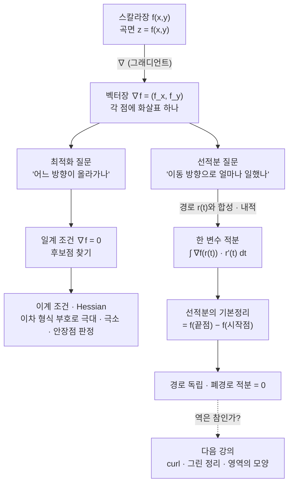

# 선적분의 기본정리에 대한 직관, 다변수 함수의 최적화와 곡면 (뉴진수 11강)

이번 시간에는 다변수 함수의 최적화 질문에서 출발해 그래디언트가 무엇을 말해 주는지 다시 보겠습니다. 뒤쪽에서는 선적분의 기본정리를 1변수 미적분학의 기본정리와 나란히 놓고, 벡터장과 원시 함수의 관계를 같은 흐름 안에서 다룹니다.

---

## [0. 최적화 질문에서 출발하기 · ▶ 4:22](https://www.youtube.com/watch?v=CJSfebgJyMg&t=262s)

먼저 여러분이 가져온 질문은 다변수 함수의 최적화 분석이었습니다. 경제학 교재에서 이차 형식, 일계 조건, 이계 조건이 나오는데, 왜 그런 조건들이 극대·극소를 판정하는 데 쓰이는지 알고 싶다는 질문이었습니다. 이 질문을 바로 선적분으로 밀고 가기보다, 저는 곡면 위에서 그래디언트가 무엇을 말하는지부터 다시 그려 보겠습니다.

다변수 함수 $f(x,y)$를 생각하면 그 그래프는 $xyz$공간 안의 곡면입니다. 한 점 근처에서 $x$방향으로만 움직이면 $\frac{\partial f}{\partial x}$가 보이고, $y$방향으로만 움직이면 $\frac{\partial f}{\partial y}$가 보입니다. 이 두 변화율을 모아 놓은 것이

$$
\nabla f=\left(\frac{\partial f}{\partial x},\frac{\partial f}{\partial y}\right)
$$

입니다. 단원 전사본에서는 그래디언트를 스칼라장 $f:\mathbb{R}^2\to\mathbb{R}$에서 벡터장 $\nabla f:\mathbb{R}^2\to\mathbb{R}^2$로 가는 대상으로 적습니다 (→ 전사본 참조).

이 말은 함수의 종류가 바뀐다는 뜻이기도 합니다.
처음의 $f$는 점을 숫자로 보내는 함수이고, $\nabla f$는 점을 벡터로 보내는 함수입니다.
선적분으로 가면 다시 벡터장과 경로 함수 $\mathbf r(t)$를 합성해 한 변수 적분으로 바꿉니다.
그래서 오늘의 구조는 스칼라장, 벡터장, 경로, 적분이 서로 어떻게 이어지는지 보는 데 있습니다.

최적화에서 일계 조건이라고 부르는 것은, 곡면 위에서 더 올라가는 방향도 더 내려가는 방향도 바로 보이지 않는 지점, 즉 $\nabla f=0$이 되는 지점을 먼저 찾는 일입니다. 이것만으로 극대인지 극소인지 결정되지는 않습니다. 다만 후보점은 거기서 나옵니다. 그 다음에 이계 조건, 테일러 전개, 이차 형식이 붙어서 그 후보점 주변의 모양을 판정합니다.

> **💭 생각해볼 점** 그래디언트가 $0$이라는 말은 "곡면이 없다"는 말이 아닙니다. 그 점에서 1차 변화가 사라진다는 말입니다. 그래서 극대·극소 판정은 $\nabla f=0$에서 멈추지 않고, 그 다음 변화인 2차항의 부호를 묻습니다.

## [1. 이차 형식은 왜 갑자기 나오는가 · ▶ 7:38](https://www.youtube.com/watch?v=CJSfebgJyMg&t=458s)

질문에서 가장 먼저 걸린 말은 "이차 형식"이었습니다. 교재는 각 항의 차수 합이 모두 같은 다항식을 형식(form)이라고 부르고, 차수 합이 $2$이면 이차 형식이라고 설명했습니다. 예를 들어

$$
a\,dx^2+2h\,dx\,dy+b\,dy^2
$$

처럼 $dx,dy$에 대해 모두 2차인 항들을 모으면 이차 형식입니다. 여기서 $a,h,b$는 그냥 숫자가 아니라, 실제로는 $f_{xx},f_{xy},f_{yy}$ 같은 이계 편도함수들이 들어갈 자리입니다.

참여자 질문은 "행렬로 바꾸기 편해서 이런 말을 꺼내는 것인가, 아니면 극값 판정에 실제 의미가 있는가"였습니다. 답은 둘 다에 가깝습니다. 행렬로 쓰면

$$
\begin{pmatrix}dx&dy\end{pmatrix}
\begin{pmatrix}f_{xx}&f_{xy}\\ f_{yx}&f_{yy}\end{pmatrix}
\begin{pmatrix}dx\\dy\end{pmatrix}
$$

처럼 Hessian 행렬이 보이고, 이 행렬의 부호 성질이 곡면이 그 점 근처에서 위로 휘는지 아래로 휘는지를 말해 줍니다. 그러니 이차 형식은 장식적 표기가 아니라, "모든 작은 방향 $(dx,dy)$에 대해 2차 변화가 어떤 부호를 갖는가"를 묻는 언어입니다.

> **💭 생각해볼 점** 일변수에서는 $f''(a)>0$이면 아래로 볼록, $f''(a)<0$이면 위로 볼록이라고 말할 수 있습니다. 이변수에서는 방향이 무수히 많으므로 $f_{xx}$ 하나만 볼 수 없고, 모든 방향에 대한 이차 형식을 봐야 합니다.

## [2. 곡면과 접평면, 그리고 1차 근사 · ▶ 16:48](https://www.youtube.com/watch?v=CJSfebgJyMg&t=1008s)

곡면을 직접 상상해 보겠습니다. $z=f(x,y)$라는 곡면 위의 한 점을 잡고, 그 아래의 $xy$평면에서 작은 움직임 $\Delta x,\Delta y$를 줍니다. 그러면 함수값의 변화는 처음에는

$$
\Delta f\approx f_x\Delta x+f_y\Delta y
$$

로 읽힙니다. 여기서 오른쪽은 그래디언트와 움직임 벡터의 내적입니다.

이 식은 접평면의 식으로도 볼 수 있습니다. 한 점과 그래디언트를 알고 있으면 곡면을 완전히 아는 것은 아니지만, 그 점 근처에서 곡면을 가장 단순하게 대신하는 평면은 쓸 수 있습니다. 다변수 테일러 전개의 1차항이 바로 이 역할을 합니다.

참여자 질문의 맥락에서는 "이게 최적화 조건과 어떤 관계가 있느냐"가 중요했습니다. $\nabla f=0$이면 접평면의 기울기가 사라져서 1차 근사로는 어느 방향도 올라가거나 내려가지 않습니다. 그래서 그 다음에 헤시안, 이차 형식, 양의 정부호·음의 정부호 같은 언어가 필요해집니다.

다만 오늘의 목표는 이계 조건을 완전히 정리하는 것이 아닙니다. 저는 이 질문을 다변수 미적분의 큰 흐름으로 연결하겠습니다. 그래디언트를 "곡면의 높이 변화에서 나온 벡터장"으로 보고, 그 벡터장을 경로를 따라 더하면 무엇이 되는지를 보려는 것입니다.

## [3. $df=f_xdx+f_ydy$를 기하적으로 읽기 · ▶ 19:15](https://www.youtube.com/watch?v=CJSfebgJyMg&t=1155s)

여러분 중 한 분이 "이런 식으로 $x$에 대해 미분한 것과 $dx$를 곱해도 되는가"라는 꺼림칙함을 말했습니다. 이 감각에서 출발해야 합니다. $df=f_xdx+f_ydy$는 기호를 아무렇게나 쪼갠 말이 아니라, 한 점 근처를 아주 작게 보면 곡면이 접평면처럼 보인다는 말입니다.

$x$방향으로만 $dx$만큼 움직이면 높이는 대략 $f_xdx$만큼 변합니다. $y$방향으로만 $dy$만큼 움직이면 높이는 대략 $f_ydy$만큼 변합니다. 이제 실제 이동 벡터가 $(dx,dy)$라면, 로컬하게는 이 두 변화량을 더한 것이 전체 높이 변화의 1차 근사입니다.

이때 "평면을 갖다 댄다"는 표현을 써도 됩니다. 곡면 전체가 평면이라는 말이 아니라, 한 점의 아주 작은 근방에서는 접평면이 곡면을 1차 수준에서 대신한다는 뜻입니다. 그래서 $df$는 실제 함수값 변화와 같지는 않지만, 작은 이동에 대한 첫 번째 근사로 읽을 수 있습니다.

> **💭 생각해볼 점** $dx,dy$를 "아주 작은 벡터 성분"처럼 생각하는 직관은 도움이 됩니다. 다만 엄밀하게는 미분 형식의 언어로 정리해야 하므로, 직관과 정의의 층위를 구분해야 합니다.

## [4. 테일러 전개와 Hessian이 만나는 자리 · ▶ 24:29](https://www.youtube.com/watch?v=CJSfebgJyMg&t=1469s)

이차 형식 질문으로 돌아오면, Hessian은 다변수 테일러 전개에서 자연스럽게 나옵니다. 한 점 $p=(x,y)$ 근처에서 작은 이동 $h=(\Delta x,\Delta y)$를 주면

$$
f(p+h)\approx f(p)+\nabla f(p)\cdot h+\frac12 h^T H_f(p)h
$$

입니다. 여기서 $H_f(p)$가 Hessian 행렬입니다. 일계 조건 $\nabla f(p)=0$인 임계점에서는 1차항이 사라지므로, 주변 모양은 처음으로 남는 2차항이 결정합니다.

그래서 극값 판정에서 이차 형식이 필요합니다. $h^THh$가 모든 $h\ne0$에 대해 양수이면 그 점 근처에서 함수값이 올라가므로 국소최소 후보가 됩니다. 모든 방향에서 음수이면 국소최대 후보가 됩니다. 어떤 방향에서는 양수, 어떤 방향에서는 음수이면 안장점입니다.

교재가 행렬식이나 Hessian 판별식을 쓰는 이유도 여기에 있습니다. 2변수에서는 $D=f_{xx}f_{yy}-f_{xy}^2$와 $f_{xx}$의 부호로 이차 형식의 부호를 판정하는 표준 규칙이 생깁니다. 이 규칙은 외워야 할 표가 아니라, "모든 방향의 2차 변화"를 빠르게 확인하는 장치입니다.

> 🧮 [계산 노트북](<03-season-assets/11/ipynb/12. Multivariable FTC Part 1 - Gradient and Line Integrals-03-season-11.ipynb>) — Hessian 판별식 $D$ 로 극소·극대·안장점 분류, $df$ 1차 근사 오차, 경로 독립·폐경로 적분을 SymPy/NumPy로 검산.

## [5. $\nabla f=0$은 곡면이 사라진다는 뜻이 아니다 · ▶ 30:20](https://www.youtube.com/watch?v=CJSfebgJyMg&t=1820s)

한 참여자분이 "그래디언트가 $0$이면 곡면이 없다는 뜻인가"에 가까운 질문을 했습니다. 그렇지 않습니다. 곡면은 여전히 있습니다. 다만 그 점에서 접평면이 수평이고, 1차 변화만으로는 어느 방향이 올라가는지 내려가는지 판정할 수 없다는 뜻입니다.

일변수에서도 $f'(a)=0$인 점은 여러 가지입니다. 아래로 열린 포물선의 꼭대기일 수도 있고, 위로 열린 포물선의 바닥일 수도 있고, $x^3$의 원점처럼 극대도 극소도 아닌 변곡점일 수도 있습니다. 이변수에서도 같은 일이 벌어집니다. 다만 방향이 많아지므로 안장점 같은 현상이 더 자연스럽게 나타납니다.

그래서 최적화 문제의 흐름은 이렇게 정리할 수 있습니다. 먼저 $\nabla f=0$으로 후보점을 찾습니다. 그 다음 Hessian과 이차 형식으로 주변 모양을 판정합니다. 그 뒤에 제약조건이 있으면 라그랑주 승수법이나 볼록성 같은 도구가 더해집니다.

> **💭 생각해볼 점** 일계 조건은 "정답"이 아니라 "후보를 걸러내는 문"입니다. 다변수 최적화에서 그 문을 통과한 뒤에야 2차 근사와 행렬의 부호 문제가 나타납니다.

## [6. 그래디언트장을 벡터장으로 보기 · ▶ 36:54](https://www.youtube.com/watch?v=CJSfebgJyMg&t=2214s)

질문은 자연스럽게 "그래디언트가 하나라고 할 수 있느냐"로 이어졌습니다. 한 점에서는 그래디언트 벡터 하나가 있습니다. 하지만 점이 움직이면 그 벡터도 점마다 바뀝니다. 그래서 전체적으로는 각 점에 벡터를 하나씩 붙인 벡터장으로 봅니다.

예를 들어 $xy$평면의 모든 점에 대해 $\nabla f(x,y)$를 계산할 수 있다면, 평면 전체에 화살표들이 깔린 그림이 나옵니다. 어떤 화살표는 높이가 빨리 증가하는 방향을 가리키고, 크기는 그 변화율의 세기를 나타냅니다. 단원 전사본에서도 그래디언트, 회전, 발산을 모두 다변수 FTC를 위한 벡터 미적분 도구로 모아 둡니다 (→ 전사본 참조).

여기서 조심할 점이 있습니다. 그래디언트장에는 원래 함수 $f$가 뒤에 있습니다. 모든 벡터장이 반드시 어떤 함수의 그래디언트로부터 나온 것은 아닙니다. 오늘 뒤쪽에서 나올 선적분의 기본정리는 바로 "그래디언트에서 나온 벡터장이라면"이라는 조건 위에서 작동합니다.

> **💭 생각해볼 점** 벡터장이 먼저 주어졌을 때, 이것이 어떤 함수 $f$의 그래디언트인지 어떻게 알 수 있을까요? 이 질문은 다음 시간들의 보존장, 폐경로 선적분, 그린 정리와 연결됩니다.

## [7. 벡터장을 먼저 주면 원시 함수가 보이는가 · ▶ 1:07:12](https://www.youtube.com/watch?v=CJSfebgJyMg&t=4032s)

중간 흐름에서 "원시 함수"라는 말을 다시 꺼냈습니다. 일변수에서는 어떤 함수 $g$가 주어졌을 때 $G'=g$가 되는 $G$를 원시 함수라고 불렀습니다. 다변수에서는 벡터장 $\mathbf F$가 주어졌을 때 $\mathbf F=\nabla f$가 되는 스칼라 함수 $f$를 찾는 문제가 이에 대응합니다.

이때 $\mathbf F=(P,Q)$라면 $P=f_x$, $Q=f_y$가 되어야 합니다. 그러면 적어도 매끄러운 영역에서는 $P_y$와 $Q_x$가 맞아야 할 것 같다는 조건이 보입니다. 이후 그린 정리에서 나오는 curl 조건이 바로 이 감각을 더 정확히 만듭니다.

오늘은 이 조건을 증명하지 않고 방향만 잡습니다. 선적분의 기본정리를 쓰려면 벡터장이 아무거나여서는 안 됩니다. 어떤 높이 함수에서 나온 그래디언트장일 때, 경로를 따라 누적한 값이 끝점의 높이 차이로 정리됩니다.

## [8. 원시 함수와 FTC를 다시 보기 · ▶ 1:18:36](https://www.youtube.com/watch?v=CJSfebgJyMg&t=4716s)

이제 미적분학의 기본정리로 돌아갑니다. 1변수에서는

$$
\int_a^b f'(x)\,dx=f(b)-f(a)
$$

입니다. 왼쪽은 도함수를 구간 전체에서 적분한 것이고, 오른쪽은 원래 함수 $f$의 끝점 값 차이입니다. 이때 정적분과 부정적분은 서로 다른 개념처럼 보이지만, 기본정리는 그 둘이 정확히 맞물린다는 사실을 말합니다.

여러분 중 한 분이 마지막에 말했듯이, 고등학교에서는 이 사실을 문제풀이 규칙처럼 받아들이기 쉽습니다. 그런데 차분히 보면 꽤 이상합니다. 구간 전체의 정보를 잘게 더한 값이, 어떻게 원래 함수의 양 끝점 두 값만으로 정리될까요? 다변수 FTC는 바로 이 이상한 일이 더 높은 차원에서 어떤 형태로 반복되는지를 보는 과정입니다.

선적분의 기본정리는 이 1변수 FTC와 같은 모양을 갖습니다. 그래디언트장 $\nabla f$를 곡선 $\mathbf r(t)$를 따라 적분하면, 결과는 경로 전체가 아니라 시작점과 끝점에서의 $f$값 차이로 정리됩니다.

$$
\int_a^b \nabla f(\mathbf r(t))\cdot \mathbf r'(t)\,dt
=f(\mathbf r(b))-f(\mathbf r(a)).
$$

이 식은 단원 전사본의 "선적분에 대한 미적분학의 기본정리"와 같은 내용입니다 (→ 전사본 참조). 오늘은 이 식을 공식으로 외우기보다, 왜 그래디언트와 움직임 방향의 내적이 들어가는지를 상상하는 쪽에 시간을 썼습니다.

## [9. 선적분은 무엇을 더하는가 · ▶ 1:38:12](https://www.youtube.com/watch?v=CJSfebgJyMg&t=5892s)

선적분이라는 말은 먼저 "선을 따라 적분한다"는 말입니다. 경로 $\mathbf r(t)$가 있고, 그 경로 위의 각 점마다 벡터장이 주어져 있습니다. 우리는 경로를 아주 잘게 쪼개고, 각 작은 조각에서 벡터장이 실제 이동 방향으로 얼마나 기여하는지를 더합니다.

그래서 선적분에는 내적이 들어갑니다. 벡터장이 아무리 크더라도 이동 방향과 직각이면 그 방향으로 한 일은 없습니다. 반대로 이동 방향과 같은 방향이면 가장 크게 기여합니다. 이런 이유로 $\mathbf F\cdot d\mathbf r$ 또는 $\mathbf F(\mathbf r(t))\cdot \mathbf r'(t)\,dt$가 나타납니다.

물리적으로는 힘과 이동의 관계로 생각할 수 있습니다. 상자를 대각선 방향으로 민다고 해도, 실제로 상자를 움직이는 데 기여하는 힘은 이동 방향으로 사영된 성분입니다. 그 성분을 읽는 연산이 내적입니다. 선적분은 이런 기여를 경로 전체에 걸쳐 누적합니다.

> **💭 생각해볼 점** 선적분에서 중요한 것은 곡면 자체를 계속 시각화하는 일이 아닙니다. 지금은 "각 점의 벡터"와 "실제 이동 방향" 사이의 내적을 누적한다고 생각하는 편이 더 낫습니다.

## [10. 그래디언트장의 선적분과 경로 독립성 · ▶ 1:43:23](https://www.youtube.com/watch?v=CJSfebgJyMg&t=6203s)

이제 $\mathbf F$가 아무 벡터장이 아니라 $\nabla f$라고 합시다. 그러면 경로를 따라 움직일 때 매 순간 더하는 것은 $\nabla f$가 이동 방향으로 주는 변화율입니다. 이것을 경로 전체에 걸쳐 더하면 결국 $f$의 총 변화량이 됩니다.

그래서 그래디언트장의 선적분은 경로에 의존하지 않습니다. 같은 시작점과 끝점을 잇는 길이 여러 개 있어도, $\nabla f$를 따라 적분한 값은 항상 $f(\text{끝점})-f(\text{시작점})$입니다. 이것이 선적분의 기본정리입니다.

> 🔧 [그래디언트장의 선적분과 경로 독립성](<03-season-assets/11/html/gradient-line-integral-path-independence-03-season-11-10.html>)에서 직접 경로를 휘게 끌어 선적분이 항상 $f(B)-f(A)$ 임을 확인해 보자.

여기서 "원시 함수"라는 말이 다시 나옵니다. 1변수에서 $f'$의 원시 함수가 $f$였듯이, 다변수에서는 벡터장 $\mathbf F$가 어떤 함수 $f$의 그래디언트라면 $f$를 퍼텐셜 함수처럼 볼 수 있습니다. 오늘 말한 "벡터를 만들어내는 어떤 원시 함수가 있을 것이다"라는 감각이 바로 이 지점입니다.

다만 모든 벡터장이 이렇게 되는 것은 아닙니다. 어떤 벡터장은 한 바퀴 돌아오면 누적값이 $0$이 아닐 수 있고, 그런 경우에는 단순히 함수값 차이로 설명할 수 없습니다. 다음 시간들의 회전, 그린 정리, 발산 정리가 이 질문을 더 넓게 다룹니다.

## [11. 폐경로를 돌면 왜 $0$이 되는가 · ▶ 1:47:40](https://www.youtube.com/watch?v=CJSfebgJyMg&t=6460s)

만약 시작점과 끝점이 같은 폐경로를 따라 $\nabla f$를 적분하면 어떻게 될까요? 선적분의 기본정리에 의해

$$
f(\text{끝점})-f(\text{시작점})=0
$$

입니다. 이 말은 경로를 따라 오르내림이 아무리 복잡해도, 같은 높이 함수의 같은 점으로 돌아오면 총 변화량은 $0$이라는 뜻입니다.

여기서 다음 질문이 생깁니다. 어떤 벡터장을 폐경로마다 적분했더니 항상 $0$이라면, 그 벡터장은 반드시 그래디언트장일까요? 이 질문은 다음 강의에서 영역의 구멍, curl, 그린 정리와 함께 다시 나옵니다.

> **💭 생각해볼 점** "폐경로 적분이 $0$"이라는 성질은 국소적인 미분 계산만이 아니라, 경로가 놓인 영역의 전체 모양과도 관련됩니다. 이미 여기서 위상적인 문제가 조용히 들어옵니다.

## [12. 최적화와 선적분을 같은 언어로 연결하기 · ▶ 1:50:37](https://www.youtube.com/watch?v=CJSfebgJyMg&t=6637s)

앞쪽의 최적화 질문과 뒤쪽의 선적분은 서로 떨어진 주제가 아닙니다. 둘 다 그래디언트를 중심에 놓습니다. 최적화에서는 $\nabla f$가 $0$이 되는 지점과 그 주변의 2차 변화를 묻고, 선적분에서는 $\nabla f$를 경로 방향으로 누적했을 때 $f$의 변화량이 나온다는 사실을 봅니다.

그래디언트를 힘처럼 생각하면 두 장면이 더 가까워집니다. 최적화에서는 어느 방향으로 가면 높이가 증가하는지 보는 것이고, 선적분에서는 그 힘이 실제 이동 방향으로 얼마나 일을 했는지 더하는 것입니다. 같은 벡터장을 다른 질문으로 읽는 셈입니다.

오늘 흘러온 구조를 한눈에 보면, 스칼라장 $f$에서 출발한 그래디언트 하나가 두 갈래의 질문으로 갈라집니다.

마지막에 나온 혼란도 여기서 정리할 수 있습니다. 원래 함수 $f$의 곡면을 계속 머릿속에 세워 두면 오히려 복잡해집니다. 지금은 벡터장 $\nabla f$와 그 벡터장을 만들어내는 원시 함수 $f$가 있다는 점을 붙들면 됩니다. 곡면의 세부 모양은 필요할 때 다시 꺼내면 됩니다.

이 영상에서 실제로 오래 머문 세부 질문들을 다시 펼치면 다음과 같습니다.

- 교재의 "제약"이라는 말은 무엇을 못 하게 막는다는 뜻보다, 이계 편도함수의 부호 조건을 가리키는 말로 읽어야 합니다.
- 이차 형식은 $dx,dy$를 변수처럼 보고, $f_{xx},f_{xy},f_{yy}$를 계수처럼 배치한 표현입니다.
- $dx^2$, $dx\,dy$, $dy^2$는 모두 작은 이동의 2차항이므로 같은 차수로 묶입니다.
- Hessian 행렬식은 갑자기 나온 행렬놀이가 아니라, 이 이차 형식을 행렬로 쓴 뒤 부호를 판정하려는 장치입니다.
- 참여자분이 느낀 "그냥 식을 받아들이면 되는가"라는 불편함은 다변수 미분에서 자주 생깁니다.
- $df=f_xdx+f_ydy$는 기호가 쪼개진 것처럼 보이지만, 로컬 접평면에서의 높이 변화로 읽을 수 있습니다.
- $x$방향으로 $dx$만큼 가면 $f_xdx$만큼, $y$방향으로 $dy$만큼 가면 $f_ydy$만큼 높이가 변한다고 봅니다.
- 이 두 변화를 더하는 것은 곡면을 아주 작은 영역에서 평면처럼 보는 근사입니다.
- 1차 근사가 사라지는 지점이 $\nabla f=0$입니다.
- 그 지점에서 곡면 자체가 사라지는 것이 아니라, 접평면이 수평이 됩니다.
- 수평 접평면은 극대일 수도, 극소일 수도, 안장점일 수도 있습니다.
- 그래서 테일러 전개의 2차항을 보고 Hessian의 부호를 묻습니다.
- 이 과정은 경제학의 최적화 교재에서 이계 조건이 왜 나오는지 설명합니다.
- 뒤쪽의 선적분도 같은 그래디언트를 다른 관점에서 읽습니다.
- 최적화에서는 "어느 방향으로 내려갈까"를 묻습니다.
- 선적분에서는 "실제로 움직인 방향으로 그래디언트가 얼마나 기여했을까"를 묻습니다.
- 벡터장과 이동 방향의 내적은 그 기여분을 뽑아내는 연산입니다.
- 그래디언트장이면 그 누적은 원래 함수값의 차이로 돌아갑니다.
- 폐경로에서는 시작점과 끝점이 같으므로 그래디언트장의 누적값이 $0$입니다.
- 이 사실이 다음 강의의 "그 역도 참인가"라는 질문으로 이어집니다.
- 어떤 벡터장이 그래디언트장인지 묻는 문제는 curl과 영역의 모양을 함께 보게 만듭니다.
- 그래서 오늘의 최적화 질문은 선적분, 보존장, 그린 정리로 이어지는 입구 역할을 합니다.
- 식을 외우기보다 "곡면의 로컬 근사", "벡터장의 방향 성분", "원시 함수의 값 차이"를 번갈아 보는 편이 낫습니다.

## 요약

- 다변수 함수 $f(x,y)$의 그래프는 곡면이고, 그래디언트 $\nabla f=(f_x,f_y)$는 각 점에서 1차 변화율을 모은 벡터장이다 (→ 전사본 참조).
- 그래디언트는 스칼라장 $f$를 벡터장 $\nabla f$로 보내고, 선적분은 그 벡터장을 경로 함수와 합성해 한 변수 적분으로 바꾼다.
- 이 구조 변환을 따라가면 최적화의 국소 기울기, 경로 위 누적, 원시 함수의 경계값 차이가 한 흐름으로 연결된다.
- 최적화의 일계 조건 $\nabla f=0$은 1차 변화가 사라지는 후보점을 찾는 조건이다. 극대·극소 판정에는 이계 조건과 이차 형식이 이어진다.
- 접평면과 1차 근사는 $\Delta f\approx f_x\Delta x+f_y\Delta y=\nabla f\cdot(\Delta x,\Delta y)$로 읽을 수 있다.
- 1변수 FTC $\int_a^b f'(x)\,dx=f(b)-f(a)$는 "구간 전체의 누적이 경계값 차이로 정리된다"는 구조를 보여 준다.
- 선적분은 경로를 따라 벡터장과 이동 방향의 내적을 누적하는 적분이다. 물리적으로는 힘이 실제 이동 방향으로 한 일을 더하는 그림이 된다.
- 그래디언트장의 선적분은 $\int_a^b\nabla f(\mathbf r(t))\cdot\mathbf r'(t)\,dt=f(\mathbf r(b))-f(\mathbf r(a))$로 정리된다 (→ 전사본 참조).
- 모든 벡터장이 그래디언트장은 아니므로, "어떤 벡터장이 퍼텐셜을 갖는가"라는 질문이 다음의 회전, 그린 정리, 발산 정리로 이어진다.
