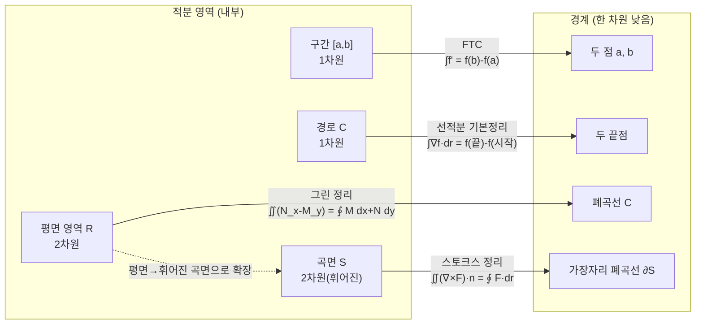

# 그린 정리, FTC의 일반화, 오일러 정리 (뉴진수 13강)

이번 시간에는 그린 정리를 미적분학의 기본정리의 2차원 버전으로 읽고, 그 경계가 스토크스 정리에서 어떻게 유지되는지 봅니다. 뒤쪽에서는 동차함수와 오일러 정리를 경제학의 생산함수 질문에 붙여서 해석합니다.

> 🧮 [계산 노트북](<03-season-assets/13/ipynb/13. Multivariable FTC Part 2 - Curl and Green's Theorem-03-season-13.ipynb>) — 그린 정리·소용돌이장·오일러 정리를 SymPy로 검산하고 회전·스케일링 그래프를 그립니다.

---

## [0. 그린 정리는 폐곡선에서 시작한다 · ▶ 1:23](https://www.youtube.com/watch?v=ACdA2p3B2SA&t=83s)

그린 정리에서 처음 고정해야 할 점은 경로가 폐곡선이라는 것입니다. 지난 시간의 선적분에서는 시작점과 끝점이 달라도 됩니다. 하지만 그린 정리는 평면의 닫힌 곡선 $C$와 그 안쪽 영역 $R$을 함께 놓고 시작합니다.

단원 전사본은 이 차이를 "그룹① 선적분"과 "그룹② 그린 정리"로 나누어 설명합니다. 선적분에서는 적분되는 대상이 곡선이고 경계는 두 끝점입니다. 그린 정리에서는 적분되는 대상이 폐곡선 내부의 평면 영역이고, 그 경계가 폐곡선 자체입니다 (→ 전사본 참조).

그래서 그린 정리는 단순히 "선적분을 한 번 더 한다"가 아닙니다. 차원이 하나 올라갑니다. 내부의 2차원 영역에서 어떤 양을 적분하고, 그것이 1차원 경계 곡선 위의 선적분과 같아지는 구조를 봅니다.

## [1. 선적분 그림에서 높이 직관을 내려놓기 · ▶ 10:20](https://www.youtube.com/watch?v=ACdA2p3B2SA&t=620s)

초반에 세 그림을 나란히 놓고 대응시키려 했습니다. 1변수 FTC에서는 $x$가 $a$에서 $b$로 움직이고, $y=f(x)$의 높이를 생각합니다. 하지만 선적분에서는 $x$축이 단순히 $xy$평면으로 확장되는 것이 아닙니다. 경로는 새로운 매개변수 $t$로 움직입니다.

그래서 $\mathbf r(t)$가 어떤 시간 동안 공간 안을 지나간다고 봐야 합니다. 그 경로는 2차원 평면에 있을 수도 있고, 3차원 공간에 있을 수도 있습니다. 중요한 것은 경로 자체가 1차원이라는 점입니다. 경로를 따라 벡터장과 접선 방향의 내적을 적분합니다.

여기서 "곡면 위의 높이를 더한다"는 직관은 오히려 방해가 됩니다. 선적분의 기본정리에서 적분하는 것은 $f$의 그래프 위 높이가 아니라, $\nabla f$가 경로의 접선 방향으로 주는 변화율입니다. 그래서 3차원 지붕 그림을 계속 붙들기보다, 벡터장과 경로 방향의 내적을 보는 편이 낫습니다.

> **💭 생각해볼 점** 1변수 FTC의 그림을 다변수로 옮길 때, $x$축이 곧 $xy$평면으로 바뀐다고 생각하면 헷갈립니다. 선적분에는 경로를 움직이는 매개변수 $t$가 새로 들어옵니다.

## [2. FTC의 경계 관점 · ▶ 15:21](https://www.youtube.com/watch?v=ACdA2p3B2SA&t=921s)

1변수 미적분학의 기본정리를 다시 쓰면

$$
\int_a^b f'(x)\,dx=f(b)-f(a)
$$

입니다. 왼쪽은 구간 내부 전체에서의 적분이고, 오른쪽은 경계에 해당하는 두 점에서의 값입니다. 이때 "경계가 무엇인가"를 차원별로 생각하는 것이 오늘의 출발점입니다.

구간의 경계는 점 두 개입니다. 평면 영역의 경계는 닫힌 곡선입니다. 곡면의 경계도 닫힌 곡선일 수 있고, 3차원 부피의 경계는 닫힌 곡면입니다. 그래서 고차원 FTC를 볼 때는 "내부에서 무엇을 적분하고, 경계에서 무엇을 적분하는가"를 계속 추적해야 합니다.

참여자 질문 중에는 "면의 경계는 면이 아니라 선인가"라는 물음이 있었습니다. 네, 2차원 면의 경계는 1차원 선입니다. 3차원 부피의 경계가 2차원 면입니다. 이 차원 낮아짐이 FTC 계열 정리들을 관통합니다.

> **💭 생각해볼 점** 경계는 항상 "한 차원 낮은 대상"입니다. 구간의 경계는 점, 면의 경계는 선, 부피의 경계는 면입니다. 그린 정리를 이해할 때 이 차원 감각을 먼저 붙들어야 합니다.

## [3. 내적 말고 다른 연산이면 다른 적분인가 · ▶ 23:41](https://www.youtube.com/watch?v=ACdA2p3B2SA&t=1421s)

중간에 "선적분 안에서 벡터와 접선 방향을 내적해 스칼라를 얻는데, 내적이 아닌 다른 연산을 쓰면 다른 종류의 적분이 되는가"라는 물음이 나왔습니다. 이 질문은 정확히 답을 내기보다, 적분 기호 안에서 무엇을 스칼라로 만들어 더하는지 묻는 좋은 질문입니다.

선적분 $\int_C \mathbf F\cdot d\mathbf r$에서는 벡터장의 접선방향 성분을 누적합니다. 플럭스 적분에서는 벡터장의 법선방향 성분을 누적합니다. 면적분에서는 스칼라 함수나 벡터장의 특정 성분을 면 위에서 더합니다. 그러니 적분의 종류가 달라진다는 말은 단순히 기호가 달라진다는 것이 아니라, 어떤 기하적 성분을 모아 더하느냐가 달라진다는 뜻입니다.

오늘은 이 질문을 완전히 분류하지 않았습니다. 다만 앞으로 그린 정리, 스토크스 정리, 발산정리를 볼 때 매번 "왼쪽은 어떤 영역에서 무엇을 더하고, 오른쪽은 경계에서 무엇을 더하는가"를 묻는 방식으로 이어가면 됩니다.

## [4. 닫힌 경로에서 그래디언트 적분은 왜 사라지는가 · ▶ 25:34](https://www.youtube.com/watch?v=ACdA2p3B2SA&t=1534s)

한 참여자분이 선적분의 기본정리는 경로 자체가 중요하지 않고 끝점만 중요하다는 점을 짚었습니다. 맞습니다. $\mathbf F=\nabla f$인 경우에는

$$
\int_C\nabla f\cdot d\mathbf r=f(\text{끝})-f(\text{시작})
$$

이므로 같은 두 점을 잇는 모든 경로가 같은 값을 줍니다. 특히 $C$가 폐곡선이면 시작점과 끝점이 같아서 값은 $0$입니다.

그렇다고 그린 정리가 "폐곡선에서는 선적분이 $0$이 되어 곤란하니 만든 정리"라는 뜻은 아닙니다. 그린 정리의 경계 선적분에는 아무 벡터장이나 들어갈 수 있고, 그 벡터장이 그래디언트장이 아닐 수 있습니다. 그래디언트장일 때의 폐곡선 적분 $0$은 특별한 경우입니다.

이 구분을 놓치면 폐곡선 적분이 모두 $0$이어야 하는 것처럼 오해하게 됩니다. 선적분의 기본정리는 그래디언트장이라는 조건에서 끝점값 차이를 말합니다. 그린 정리는 평면 영역 안의 회전과 경계 순환을 연결합니다. 둘은 FTC 계열의 같은 구조를 공유하지만, 적분되는 대상과 조건이 다릅니다.

## [5. 내부 회전과 경계 선적분 · ▶ 27:54](https://www.youtube.com/watch?v=ACdA2p3B2SA&t=1674s)

그린 정리의 식은 보통 다음과 같이 적습니다.

$$
\oint_C M\,dx+N\,dy
=
\iint_R\left(\frac{\partial N}{\partial x}-\frac{\partial M}{\partial y}\right)\,dx\,dy.
$$

여기서 $\mathbf F=(M,N)$는 평면 위의 벡터장이고, 오른쪽의 $\frac{\partial N}{\partial x}-\frac{\partial M}{\partial y}$는 2차원 회전(curl)입니다. 전사본도 같은 식을 "폐곡선 내부의 회전 누적 = 경계의 선적분"으로 둡니다 (→ 전사본 참조).

직관은 작은 소용돌이를 더하는 것입니다. 영역을 아주 작은 격자로 나누면, 내부의 작은 사각형들에서 생기는 회전의 경계 기여들은 서로 맞닿은 변에서 상쇄됩니다. 끝까지 남는 것은 바깥 경계 $C$를 따라 도는 기여뿐입니다.

> 🔧 [내부 회전과 경계 선적분](<03-season-assets/13/html/greens-circulation-03-season-13-05.html>)에서 직접 벡터장과 영역을 바꿔 경계 순환과 내부 회전 면적분이 같아지는지 확인해 보자.

그래서 그린 정리는 내부의 회전 밀도를 면적분한 값이 경계 곡선을 따라 읽은 순환과 같다는 말입니다. 1변수 FTC에서 내부의 도함수 적분이 끝점 값으로 정리되듯이, 2차원에서는 내부의 회전 적분이 경계의 선적분으로 정리됩니다.

## [6. 그린 정리와 스토크스 정리의 관계 · ▶ 31:22](https://www.youtube.com/watch?v=ACdA2p3B2SA&t=1882s)

그린 정리에서 영역을 평면에 놓으면 내부는 2차원 평면 영역이고 경계는 폐곡선입니다. 스토크스 정리에서는 내부가 평면이 아니라 공간 속의 휘어진 곡면으로 바뀝니다. 그런데 경계는 여전히 그 곡면의 가장자리인 폐곡선입니다.

이 점이 오늘 대화에서 중요했습니다. "곡면으로 바뀌면 경계도 달라지는가"라는 질문에 대해, 곡면 자체는 달라질 수 있지만 같은 폐곡선을 경계로 갖는 여러 곡면을 생각할 수 있다고 답했습니다. 스토크스 정리는 그런 곡면 위의 회전 적분과 경계 선적분을 연결합니다.

식으로는

$$
\iint_S(\nabla\times\mathbf F)\cdot \mathbf n\,dS
=
\oint_{\partial S}\mathbf F\cdot d\mathbf r
$$

입니다 (→ 전사본 참조). 그린 정리는 이 식이 평면 영역에 놓인 특별한 경우로 보입니다. 그러니 그린 정리를 외운 뒤 스토크스 정리를 따로 외우기보다, "내부 회전의 적분 = 경계 순환"이라는 같은 구조로 보는 편이 낫습니다.

FTC 계열 정리들은 모두 "내부에서의 적분 = 한 차원 낮은 경계에서의 적분"이라는 같은 틀을 공유합니다. 차원만 한 칸씩 올라갑니다.

> **💭 생각해볼 점** 같은 폐곡선을 경계로 갖는 곡면을 여러 개 잡을 수 있습니다. 스토크스 정리는 경계 선적분이 그 곡면 위 회전의 적분과 같다고 말합니다. 그렇다면 어떤 조건에서 곡면을 바꿔도 같은 값을 얻게 될까요?

## [7. 회전이 0이면 보존장인가 · ▶ 42:49](https://www.youtube.com/watch?v=ACdA2p3B2SA&t=2569s)

대화 중간에는 "curl이 $0$이면 보존장인가"라는 질문이 나왔습니다. 평면의 단순연결 영역에서는 회전이 $0$이면 보통 퍼텐셜 함수가 존재하고, 벡터장이 그래디언트장처럼 행동합니다. 하지만 영역에 구멍이 있으면 이 말이 그대로 성립하지 않을 수 있습니다.

이 질문은 지난 시간 마지막의 폐경로 선적분 질문과 같은 뿌리를 가집니다. 그래디언트장이라면 임의의 폐경로 선적분은 $0$입니다. 또 그린 정리에 의해 내부 회전 적분이 경계 선적분과 연결됩니다. 그런데 경로가 둘러싼 영역 안에 정의되지 않는 구멍이나 특이점이 있으면, 단순히 "curl이 $0$"이라는 국소 조건만으로 전체 경로 적분을 결정하기 어렵습니다.

오늘은 이 부분을 완전히 정리하기보다, 그린 정리와 스토크스 정리를 보는 데 필요한 질문으로 남겨 두었습니다. 회전이 국소적인 양이라면, 보존장 여부는 전역적인 영역의 모양까지 함께 묻는 문제입니다.

## [8. 동차함수의 질문으로 이동하기 · ▶ 56:50](https://www.youtube.com/watch?v=ACdA2p3B2SA&t=3410s)

뒤쪽에서는 동차함수와 오일러 정리에 대한 질문을 다루었습니다. 질문은 경제학의 생산함수에서 동차함수가 왜 등장하는지, 그리고 오일러 정리가 어떤 의미를 갖는지였습니다.

함수 $q(L,K)$가 $r$차 동차함수라는 말은 모든 $\lambda>0$에 대해

$$
q(\lambda L,\lambda K)=\lambda^r q(L,K)
$$

가 성립한다는 뜻입니다. $L$은 노동 투입량, $K$는 자본 투입량처럼 생각할 수 있습니다. 모든 생산요소를 같은 비율로 늘렸을 때 산출량이 어떤 비율로 늘어나는지를 보는 언어입니다.

생산함수에서는 $r=1$이 규모수익불변, $r>1$이 규모수익체증, $r<1$이 규모수익체감의 직관과 연결됩니다. 예를 들어 모든 투입을 두 배로 했는데 산출도 두 배가 되면 1차 동차입니다. 두 배보다 더 늘면 체증이고, 덜 늘면 체감입니다.

## [9. 스케일링 관계와 파워 법칙의 감각 · ▶ 1:05:40](https://www.youtube.com/watch?v=ACdA2p3B2SA&t=3940s)

동차함수는 입력을 같은 비율로 키웠을 때 출력이 어떤 거듭제곱 비율로 커지는지를 말합니다. 이것은 물리학에서 말하는 스케일링 관계와도 닮아 있습니다. $x$를 $\lambda x$로 바꾸면 값이 $\lambda^r$배가 되는 식의 관계입니다.

그래서 동차성은 선형성과 다릅니다. 선형이면 더하기와 스칼라곱을 모두 보존하지만, 동차성은 같은 비율로 확대했을 때의 반응만 말합니다. 입력의 상대적 비율을 유지한 채 규모만 바꾸는 실험을 하고 있다고 보면 됩니다.

경제학의 생산함수에서는 이 스케일링이 "노동과 자본을 모두 같은 배수로 늘리면 산출이 어떻게 되는가"라는 질문으로 읽힙니다. 계산을 쉽게 하려는 도구이기도 하고, 규모에 대한 가정을 모델 안에 넣는 방식이기도 합니다.

## [10. 오일러 정리와 한계생산 · ▶ 1:15:49](https://www.youtube.com/watch?v=ACdA2p3B2SA&t=4549s)

동차함수에 대한 오일러 정리는 다음 형태입니다.

$$
L\frac{\partial q}{\partial L}
+K\frac{\partial q}{\partial K}
=r q(L,K)
$$

특히 $q$가 1차 동차이면 오른쪽은 그냥 $q(L,K)$입니다. 즉 노동 투입량에 노동의 한계생산을 곱한 것과 자본 투입량에 자본의 한계생산을 곱한 것을 더하면 전체 산출량이 됩니다.

경제학적으로 $\frac{\partial q}{\partial K}$는 자본을 아주 조금 늘렸을 때 산출량이 얼마나 변하는지를 나타냅니다. $\frac{\partial q}{\partial L}$도 마찬가지로 노동의 한계생산입니다. 오일러 정리는 이런 한계적인 변화율들이 동차성이라는 스케일 조건 아래에서 전체 산출량과 어떻게 맞물리는지 말합니다.

질문 중에는 "1차 동차라면 함수가 반드시 $c_1L+c_2K$ 꼴이어야 하느냐"는 방향의 생각도 나왔습니다. 아닙니다. 선형함수는 1차 동차의 예이지만, 1차 동차함수가 모두 선형인 것은 아닙니다. 예를 들어 코브-더글러스형 $q(L,K)=A L^\alpha K^{1-\alpha}$도 $\alpha+(1-\alpha)=1$이면 1차 동차입니다.

> **💭 생각해볼 점** "1차 동차"는 입력을 같은 비율로 키웠을 때 출력이 같은 비율로 커진다는 스케일 조건입니다. 그것이 곧 함수가 직선식이라는 뜻은 아닙니다.

## [11. 왜 한계생산에 현재 투입량을 곱하는가 · ▶ 1:34:20](https://www.youtube.com/watch?v=ACdA2p3B2SA&t=5660s)

마지막 혼동은 $Lq_L+Kq_K$의 각 항을 어떻게 해석하느냐였습니다. $q_L$은 노동을 아주 조금 늘렸을 때 산출량이 얼마나 변하는지, $q_K$는 자본을 아주 조금 늘렸을 때 산출량이 얼마나 변하는지를 나타냅니다. 그런데 여기에 왜 $L$과 $K$를 곱할까요?

오일러 정리의 관점에서는 이것을 "각 방향의 한계 변화율에 현재 규모를 곱해 전체 스케일 변화에 대한 기여를 합친다"로 읽을 수 있습니다. 노동과 자본을 모두 같은 비율로 키우는 방향 벡터가 $(L,K)$이고, 그 방향으로의 방향미분이 바로 $Lq_L+Kq_K$입니다.

그러므로 좌변은 단순히 두 숫자를 임의로 곱해 더한 것이 아니라, 현재 점 $(L,K)$에서 원점으로부터 바깥으로 뻗는 스케일링 방향을 따라 함수가 얼마나 변하는지를 계산한 것입니다. 동차성이 있으면 그 방향미분이 $rq$로 정리됩니다.

> **💭 생각해볼 점** $Lq_L+Kq_K$를 한계생산의 회계식으로만 보면 왜 곱하는지 흐립니다. 방향미분으로 보면, 입력 전체를 같은 비율로 키우는 방향에서의 변화율이라는 의미가 보입니다.

## [12. 다음에 남긴 계산 · ▶ 1:48:16](https://www.youtube.com/watch?v=ACdA2p3B2SA&t=6496s)

마지막에는 생산함수의 구체적인 형태가 있어야 오일러 정리의 경제적 의미를 더 잘 설명할 수 있겠다는 이야기를 했습니다. 단지 식만 보면 한계생산과 투입량의 곱을 더한다는 형태가 보이지만, 실제 함수가 어떤 모양인지에 따라 해석이 달라질 수 있습니다.

그래서 다음에는 구체적인 생산함수 예시를 가져와서, 노동과 자본을 조금씩 바꿨을 때 산출량이 어떻게 변하는지 직접 계산해 보기로 했습니다. 이렇게 해야 동차성, 한계생산, 오일러 정리가 단어가 아니라 계산으로 연결됩니다.

오늘 수업의 앞부분과 뒷부분은 겉으로는 다르게 보입니다. 하나는 그린 정리와 경계 적분이고, 다른 하나는 동차함수와 생산함수입니다. 하지만 둘 다 "구조를 공식으로만 외우지 않고, 정의가 어떤 계산을 가능하게 하는지 본다"는 같은 태도로 읽어야 합니다.

영상의 흐름에서 남은 세부 질문을 항목별로 다시 남겨 둡니다.

- 처음에는 선적분, 그린 정리, 스토크스 정리를 나란히 놓고 무엇이 대응되는지 보려 했습니다.
- 1변수 FTC에서 $[a,b]$는 적분 영역이고, $\{a,b\}$는 경계입니다.
- 선적분에서는 경로가 적분 영역이고, 시작점과 끝점이 경계입니다.
- 그린 정리에서는 면 영역이 적분 영역이고, 폐곡선이 경계입니다.
- 그래서 단순히 "열린 곡선이 닫힌 곡선으로 바뀐다"가 아닙니다.
- 적분 대상의 차원도 같이 바뀝니다.
- 참여자분이 "면의 경계가 면인가"라고 물었을 때, 면의 경계는 선이라고 답해야 합니다.
- 3차원 부피의 경계가 면입니다.
- 차원이 하나 내려가는 이 감각이 FTC 계열 정리를 관통합니다.
- 선적분에서 높이를 더한다고 생각하면 곡면 그림이 계속 방해합니다.
- 실제로는 경로의 접선 방향과 벡터장을 내적해 스칼라를 얻습니다.
- 이 내적이 다른 연산으로 바뀌면 적분이 묻는 기하적 양도 달라집니다.
- 접선 방향 성분을 더하면 일(work)이나 순환(circulation)의 그림이 됩니다.
- 법선 방향 성분을 더하면 플럭스의 그림이 됩니다.
- 그린 정리의 오른쪽은 내부의 작은 회전을 모두 더하는 면적분입니다.
- 내부 격자의 변들은 서로 반대 방향으로 한 번씩 나타나 상쇄된다고 상상할 수 있습니다.
- 끝까지 남는 것은 바깥 경계의 순환입니다.
- 폐경로에서 그래디언트장의 선적분이 $0$이라는 사실은 그린 정리 전체가 아닙니다.
- 그린 정리는 그래디언트장이 아닌 벡터장에도 적용되는 경계-내부 관계입니다.
- curl이 $0$이면 보존장인지 묻는 질문은 국소 조건과 전역 조건을 구분하게 만듭니다.
- 영역에 구멍이 있으면 국소적으로 회전이 없어도 경로 적분이 남을 수 있습니다.
- 뒤쪽 동차함수 질문에서도 같은 태도가 필요합니다.
- $q(\lambda L,\lambda K)=\lambda^r q(L,K)$는 입력 비율을 유지한 채 규모만 바꾸는 실험입니다.
- 1차 동차는 선형함수라는 뜻이 아닙니다.
- 코브-더글러스형 예시는 비선형이면서도 1차 동차가 될 수 있습니다.
- $Lq_L+Kq_K$는 현재 점에서 스케일링 방향으로의 방향미분입니다.
- 자본과 노동을 각각 조금 늘리는 변화율에 현재 투입 규모를 곱해 합친 것입니다.
- 그래서 오일러 정리는 생산함수의 회계식이면서 동시에 동차성의 미분형 표현입니다.
- 다음에 구체적인 $q(L,K)$를 놓고 계산해야 이 식의 의미가 더 선명해집니다.

## 요약

- 그린 정리는 폐곡선 $C$와 그 내부 영역 $R$을 함께 놓고, 내부 회전 적분과 경계 선적분을 연결한다.
- 1변수 FTC에서 구간의 경계가 두 점이듯, 그린 정리에서는 평면 영역의 경계가 폐곡선이다. 고차원 FTC에서는 항상 경계의 차원을 추적해야 한다.
- 그린 정리의 식은 $\oint_C M\,dx+N\,dy=\iint_R(\partial N/\partial x-\partial M/\partial y)\,dx\,dy$이다 (→ 전사본 참조).
- 스토크스 정리는 그린 정리를 휘어진 곡면으로 확장한 형태로, $\iint_S(\nabla\times\mathbf F)\cdot\mathbf n\,dS=\oint_{\partial S}\mathbf F\cdot d\mathbf r$이다 (→ 전사본 참조).
- 회전이 $0$이라는 국소 조건과 보존장이라는 전역 조건은 영역의 모양, 특히 구멍의 존재와 함께 봐야 한다.
- $r$차 동차함수는 $q(\lambda L,\lambda K)=\lambda^r q(L,K)$를 만족한다. 생산함수에서는 규모수익을 표현하는 언어가 된다.
- 오일러 정리는 $Lq_L+Kq_K=rq$이고, 1차 동차 생산함수에서는 한계생산과 투입량의 곱을 더하면 전체 산출량이 된다.
- 1차 동차는 선형함수라는 뜻이 아니다. 코브-더글러스형처럼 비선형이면서 1차 동차인 함수도 있다.
