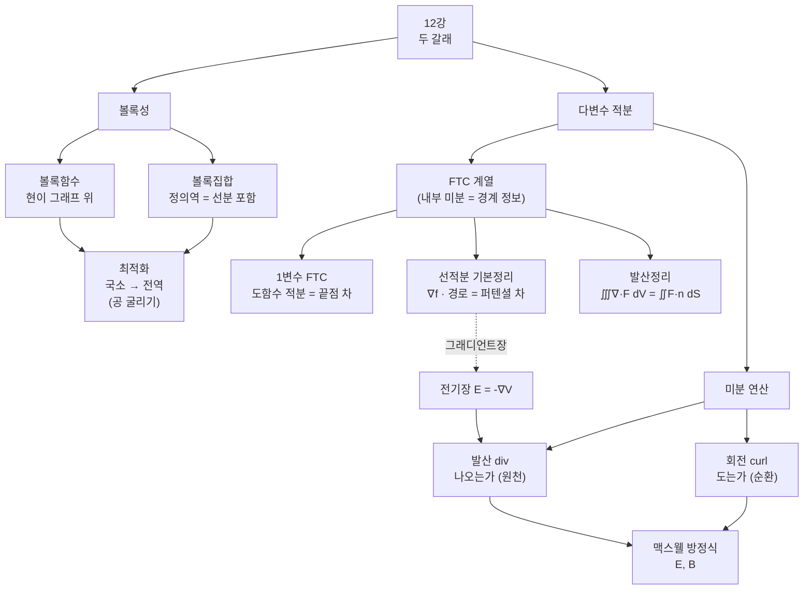

# 볼록함수, 선적분의 기본정리, 발산정리 (뉴진수 12강)

이번 시간은 두 갈래로 진행됩니다. 앞에서는 볼록함수와 볼록집합에 관한 질문을 정리하고, 뒤에서는 그래디언트장의 선적분, 전기장·자기장 예시, 발산정리의 직관을 이어서 봅니다.

> 🧮 [계산 노트북](<03-season-assets/12/ipynb/14. Multivariable FTC Part 3 - Divergence and the Divergence Theorem-03-season-12.ipynb>) — 볼록 부등식·선적분 기본정리·발산정리를 SymPy/NumPy로 검산하고 발산장·회전장을 그립니다.

---

## [0. 볼록성과 접선 그림의 질문 · ▶ 0:53](https://www.youtube.com/watch?v=-6J1EzhxXro&t=53s)

처음 질문은 오목성과 볼록성을 설명하는 그림에서 나왔습니다. 미분가능한 함수의 그래프 위에 점 $A$를 잡고, 그 점에서 접선 $AB$를 그은 뒤, 정의역의 다른 점 $u$와 곡선 위 점 $C$를 비교하는 상황이었습니다. 질문은 "호 $AC$를 펴면 선분 $AB$의 기울기와 같아진다"는 설명이 정확히 어떤 뜻이냐는 것이었습니다.

이런 그림에서 조심해야 할 것은, 접선과 할선, 곡선 위의 점을 같은 종류의 대상으로 섞어 버리지 않는 것입니다. 접선은 한 점에서의 1차 근사이고, 할선은 두 점을 잇는 평균 변화율입니다. 볼록·오목을 말할 때는 이 두 값의 대소 관계가 중요한 역할을 합니다.

볼록함수의 표준적인 정의는 두 점 $x,y$와 $0\le t\le 1$에 대해

$$
f(tx+(1-t)y)\le t f(x)+(1-t)f(y)
$$

가 성립한다는 것입니다. 즉 그래프 위 두 점을 잇는 선분이 그래프보다 위에 놓이는 그림입니다. 이 표기는 단원 전사본에는 직접 길게 나오지 않지만, 오늘 질문에서 사용한 "볼록집합 위의 볼록함수" 표기를 정리하는 데 필요한 표준 표기입니다.

이 정의에는 함수와 정의역의 구조가 함께 들어 있습니다.
정의역은 두 점을 잇는 선분을 포함해야 하고, 함수값은 그 선분 위에서 선형보간보다 아래에 놓여야 합니다.
즉 볼록성은 그래프 모양만의 성질이 아니라, 입력 공간의 선분 구조와 함수값의 순서 구조가 함께 맞물린 성질입니다.

> **💭 생각해볼 점** 접선이 그래프보다 아래에 있느냐, 두 점을 잇는 현이 그래프보다 위에 있느냐는 서로 비슷하게 들리지만 같은 문장이 아닙니다. 어느 정의를 쓰고 있는지 먼저 고정해야 합니다.

## [1. 할선 기울기와 접선 기울기를 식으로 비교하기 · ▶ 6:21](https://www.youtube.com/watch?v=-6J1EzhxXro&t=381s)

질문에서 나온 우변은 결국 두 점을 잇는 선분의 좌표를 말합니다. 점 $(u,f(u))$와 $(v,f(v))$를 잡으면 할선의 기울기는

$$
\frac{f(v)-f(u)}{v-u}
$$

입니다. 한 점 $u$에서의 접선 기울기는 $f'(u)$입니다. 오목한 그래프에서는 $u$에서 출발한 접선이 실제 곡선 위의 점보다 위에 있거나 아래에 있는지가 부등식으로 표현됩니다.

예를 들어 $f(v)$와 $f(u)+f'(u)(v-u)$를 비교하면, 왼쪽은 실제 곡선 위 점의 높이이고 오른쪽은 $u$에서 그은 접선 위의 $v$좌표 높이입니다. 그러니 이 부등식은 "그림에서 $C$가 $B$보다 위인가 아래인가"를 좌표로 쓴 것입니다.

참여자분이 헷갈린 부분은 "호 $AC$를 펼친 직선"이라는 표현이었습니다. 저는 그 표현보다 할선과 접선의 기울기 비교로 읽는 편이 낫다고 보았습니다. 호를 실제로 펼쳐 길이를 비교하는 문제가 아니라, 두 점 사이 평균 변화율과 한 점의 순간 변화율을 비교하는 문제입니다.

> **💭 생각해볼 점** 그림을 식으로 옮길 때, "어느 점의 $y$좌표를 비교하는가"를 먼저 물어야 합니다. 그래야 접선 위 점과 곡선 위 점이 섞이지 않습니다.

## [2. 선분이 그래프 위에 있는가, 그래프 아래에 있는가 · ▶ 12:23](https://www.youtube.com/watch?v=-6J1EzhxXro&t=743s)

볼록함수를 설명하는 또 다른 방식은 두 점을 잇는 선분을 보는 것입니다. 그래프 위의 두 점을 잡고 그 둘을 직선으로 이었을 때, 그 선분이 항상 그래프보다 위에 있으면 우리가 흔히 말하는 볼록한 모양입니다. 반대로 항상 아래에 있으면 오목한 모양입니다.

여기서 "항상"을 빼면 정의가 무너집니다. 어떤 두 점을 잡았을 때만 맞는 것이 아니라, 정의역 안의 임의의 두 점을 잡아도 성립해야 합니다. 중간에 모양이 한 번이라도 뒤집히면, 그 함수는 전체 구간에서 볼록하다고 말할 수 없습니다.

식으로는 $0\le t\le1$에 대해

$$
f(tx+(1-t)y)\le t f(x)+(1-t)f(y)
$$

라고 쓰는 것이 표준적입니다. 오른쪽은 두 함수값을 같은 비율로 선형보간한 높이이고, 왼쪽은 중간점에서 실제 함수값입니다.

## [3. 볼록집합과 함수의 정의역 · ▶ 17:02](https://www.youtube.com/watch?v=-6J1EzhxXro&t=1022s)

두 번째 질문은 볼록함수를 정의할 때 왜 볼록집합이 함께 등장하느냐는 것이었습니다. 볼록집합이란 집합 안의 두 점을 잡으면 그 둘을 잇는 선분 전체가 다시 그 집합 안에 들어가는 집합입니다. 원판이나 직사각형은 볼록집합이고, 가운데가 파인 영역은 보통 볼록집합이 아닙니다.

볼록함수의 정의에는 $tx+(1-t)y$가 등장합니다. 이 점은 $x$와 $y$를 잇는 선분 위의 점입니다. 그런데 정의역이 볼록하지 않으면, $x$와 $y$가 정의역 안에 있어도 그 중간점이 정의역 밖으로 나갈 수 있습니다. 그러면 $f(tx+(1-t)y)$ 자체를 평가할 수 없습니다.

그래서 볼록함수의 정의는 함수값의 대소 비교만이 아니라, 그 비교가 의미 있게 되는 정의역의 형태도 함께 요구합니다. 최적화에서는 이 조건이 국소 후보와 전역 해를 연결합니다. 정의역이 볼록하고 함수가 볼록하면, 국소적으로 좋은 후보가 전역적으로도 좋은 해가 되는 상황을 만들 수 있기 때문입니다.

오늘 대화에서는 "볼록이 아닌 함수를 적절히 바꾸어 볼록하게 만들 수 있느냐"는 이야기도 나왔습니다. 실제 최적화에서는 변환이나 재매개화로 문제가 쉬워지는 경우가 있습니다. 다만 그런 변환이 항상 가능한 것은 아니고, 가능하더라도 원래 문제의 의미를 보존하는지 따져야 합니다.

## [4. 가중평균으로 보는 볼록집합 · ▶ 22:50](https://www.youtube.com/watch?v=-6J1EzhxXro&t=1370s)

볼록집합의 정의는 벡터의 가중평균으로도 표현됩니다. 집합 안의 두 점 $x,y$와 $0\le a\le1$에 대해

$$
ax+(1-a)y
$$

가 다시 집합 안에 있으면 볼록집합입니다. 이 점은 $x$에서 $y$로 가는 선분 위를 $a$에 따라 왔다 갔다 하는 점입니다. 그러니 가중평균 정의는 "두 점을 이은 선분 전체가 집합 안에 있다"는 말과 같습니다.

오늘 그림에서 가운데가 움푹 파인 영역은 볼록집합이 아닙니다. 어떤 두 점을 잡으면 그 선분의 일부가 영역 밖으로 나가기 때문입니다. 반면 원판이나 직사각형 같은 영역은 어느 두 점을 잡아도 선분이 영역 안에 남습니다.

이 정의가 최적화에 들어오는 이유는 계산 가능한 후보를 전역 해로 연결하기 위해서입니다. 볼록한 정의역과 볼록한 목적함수가 있으면, "공을 굴려 내려가며 찾은 낮은 점"이 엉뚱한 작은 골짜기에 갇힌 것인지 아닌지 판단하기가 쉬워집니다.

## [5. 공을 굴리는 최적화 직관 · ▶ 26:50](https://www.youtube.com/watch?v=-6J1EzhxXro&t=1610s)

최적화 이야기를 직관적으로 보면 산과 골짜기의 그림입니다. 함수 그래프 위에 공을 놓으면, 공은 기울기가 낮아지는 방향으로 굴러갑니다. 이것이 경사하강법의 기본 그림입니다. 한 점에서 기울기를 계산하고, 그 반대 방향으로 조금 움직이고, 새 점에서 다시 기울기를 계산합니다.

문제는 시작점에 따라 다른 골짜기에 빠질 수 있다는 점입니다. 함수가 볼록하면 이런 걱정이 크게 줄어듭니다. 볼록한 함수의 경우 지역적으로 내려간 곳이 전체적으로도 가장 낮은 곳일 가능성이 좋아집니다. 그래서 볼록성은 단지 그래프 모양의 이름이 아니라, 최적화 알고리즘의 안정성과 연결됩니다.

다만 실제 문제에서는 기울기를 얼마나 따라갈지, 너무 크게 움직여 튀어나가지 않을지, 미분가능하지 않은 지점은 어떻게 처리할지 같은 문제가 남습니다. 오늘은 그 세부 알고리즘보다 "왜 볼록성이 최적화의 언어로 들어오는가"를 보는 데 머물렀습니다.

> **💭 생각해볼 점** 볼록성은 예쁜 그림을 그리기 위한 조건이 아닙니다. 국소적인 기울기 정보로 전역적인 결론을 얻고 싶을 때 필요한 구조입니다.

## [6. 선적분의 기본정리로 돌아가기 · ▶ 36:34](https://www.youtube.com/watch?v=-6J1EzhxXro&t=2194s)

볼록성 질문을 정리한 뒤에는 다변수 적분의 흐름으로 돌아왔습니다. 지난 시간의 중심은 그래디언트장을 경로를 따라 선적분하면 함수값의 차이가 나온다는 사실이었습니다. 단원 전사본의 표기로는

$$
\int_a^b \nabla f(\mathbf r(t))\cdot \mathbf r'(t)\,dt
=f(\mathbf r(b))-f(\mathbf r(a))
$$

입니다 (→ 전사본 참조).

여기서 제일 먼저 던진 질문은 "임의의 벡터장은 무언가의 그래디언트인가"였습니다. 함수 $f$가 있으면 $\nabla f$는 언제나 만들 수 있습니다. 반대로 벡터장 $\mathbf F$가 주어졌을 때 $\mathbf F=\nabla f$가 되는 $f$가 항상 존재하는 것은 아닙니다.

두 번째 질문은 "임의의 폐경로에 대한 선적분이 $0$이면 그 벡터장은 그래디언트장인가"였습니다. 이 질문은 훨씬 미묘합니다. 단순한 영역에서는 폐경로 적분이 모두 $0$인 것과 퍼텐셜 함수가 존재하는 것이 서로 맞물리지만, 영역에 구멍이 있으면 반례가 생깁니다. 이 반례 계산은 마지막에 숙제로 남겼습니다.

> **💭 생각해볼 점** $\mathbf F=\nabla f$이면 모든 폐경로 적분은 $0$입니다. 그런데 그 역은 영역의 모양까지 봐야 합니다. 여기서 이미 위상적인 조건이 선적분 문제 안으로 들어옵니다.

## [7. 폐곡선 적분과 구멍이 있는 영역 · ▶ 58:10](https://www.youtube.com/watch?v=-6J1EzhxXro&t=3490s)

폐경로 선적분이 $0$인지 묻는 질문은 단순 계산으로 끝나지 않습니다. 벡터장이 정의된 영역에 구멍이 있으면, 그 구멍을 둘러 도는 경로가 특별한 역할을 할 수 있습니다. 국소적으로는 curl이 $0$처럼 보여도, 전역적으로는 퍼텐셜 함수를 하나로 붙일 수 없는 경우가 생깁니다.

이 점은 다음 강의의 그린 정리와도 연결됩니다. 그린 정리는 폐곡선이 둘러싼 영역 전체에서 벡터장이 잘 정의되어 있을 때 내부 회전과 경계 선적분을 연결합니다. 그런데 경로 안쪽에 벡터장이 정의되지 않는 점이 있으면, 그 영역 전체에 바로 그린 정리를 적용할 수 없습니다.

그래서 "폐경로 적분이 항상 $0$인가"라는 말에는 두 층의 조건이 있습니다. 하나는 벡터장의 미분 조건이고, 다른 하나는 영역의 위상적 조건입니다. 오늘은 그 조건을 예고만 하고 발산정리 쪽으로 넘어갑니다.

## [8. 전기장과 퍼텐셜, 음의 그래디언트 · ▶ 1:10:48](https://www.youtube.com/watch?v=-6J1EzhxXro&t=4248s)

선적분을 물리 예시로 이해하기 위해 전기장을 보았습니다. 전기장은 각 점에 힘의 방향과 크기를 붙인 벡터장입니다. 전기적 퍼텐셜을 $V$라고 쓰면, 전기장은 대체로

$$
\mathbf E=-\nabla V
$$

라는 식으로 표현됩니다. 부호가 마이너스인 것은 전하가 퍼텐셜이 낮아지는 방향으로 움직이는 식의 물리적 관례와 맞물립니다.

이 관점에서 전기장을 따라 선적분하는 일은 퍼텐셜 차이를 읽는 일과 연결됩니다. 우리가 힘을 따라 이동하면서 일을 계산하듯이, 전기장과 이동 방향의 내적을 경로를 따라 누적하면 전기적 에너지 변화와 연결됩니다.

중요한 것은 벡터장을 아무렇게나 보는 것이 아니라, 그 벡터장이 어떤 스칼라 함수에서 나온 것인지 묻는다는 점입니다. 그래디언트장에서 선적분이 경로에 무관해지는 이유는, 실제로는 뒤에 있는 스칼라 함수의 값 차이를 읽고 있기 때문입니다.

## [9. 맥스웰 방정식의 언어: 발산과 회전 · ▶ 1:21:30](https://www.youtube.com/watch?v=-6J1EzhxXro&t=4890s)

이제 전기장과 자기장을 함께 보겠습니다. 전기장 $\mathbf E$와 자기장 $\mathbf B$를 쓰면, 맥스웰 방정식은 발산과 회전이라는 두 종류의 미분 연산으로 자연스럽게 적힙니다. 오늘은 정교한 유도보다, 각각의 연산이 무엇을 측정하는지에 집중했습니다.

전기장의 발산은 전하가 전기장의 원천이라는 말을 수학적으로 표현합니다. 전하가 있으면 그 주변으로 전기장이 뻗어 나갑니다. 반면 자기장의 발산은 $0$입니다. 이것은 자기장에는 전하처럼 따로 떨어진 "자기 단극" 원천이 없다는 말로 이해할 수 있습니다.

회전은 다른 종류의 관계를 나타냅니다. 시간이 변하는 자기장은 전기장의 회전을 만들고, 전류나 시간이 변하는 전기장은 자기장의 회전을 만듭니다. 그래서 전기와 자기는 서로를 만들어내는 방식으로 연결됩니다. 이때 회전(curl)은 "한 점 주위로 얼마나 감기는가"를 측정하는 연산입니다.

단원 전사본에서 2차원 회전은 $\frac{\partial f_2}{\partial x}-\frac{\partial f_1}{\partial y}$, 발산은 $\frac{\partial f_1}{\partial x}+\frac{\partial f_2}{\partial y}$로 정리됩니다 (→ 전사본 참조). 오늘 대화에서는 이 공식을 전기장·자기장 그림에 붙여 보았습니다.

## [10. 발산과 회전을 같은 벡터장에서 구분하기 · ▶ 1:30:22](https://www.youtube.com/watch?v=-6J1EzhxXro&t=5422s)

발산과 회전은 둘 다 벡터장을 미분하지만, 보는 질문이 다릅니다. 발산은 작은 상자를 둘러싸고 그 안에서 바깥으로 얼마나 빠져나가는지를 봅니다. 회전은 작은 원을 둘러싸고 그 주위를 얼마나 도는지를 봅니다.

예를 들어 모든 화살표가 중심에서 바깥으로 뻗어 나가면 발산은 양수처럼 보이고, 회전은 크지 않을 수 있습니다. 반대로 화살표들이 원을 따라 빙글빙글 돌면 회전은 크지만, 중심에서 새로 생겨 밖으로 나가는 흐름은 아닐 수 있습니다.

> 🔧 [발산과 회전을 같은 벡터장에서 구분하기](<03-season-assets/12/html/divergence-curl-explorer-03-season-12-10.html>)에서 직접 작은 원을 끌어 경계의 플럭스와 순환을 재 보자.

맥스웰 방정식이 두 연산을 모두 쓰는 이유도 여기에 있습니다. 전하가 전기장의 원천이라는 말은 발산의 언어이고, 시간이 변하는 장들이 서로 감긴다는 말은 회전의 언어입니다. 같은 벡터장이라도 "나오는가"와 "도는가"는 다른 질문입니다.

## [11. 발산정리: 내부의 원천과 경계의 플럭스 · ▶ 1:38:16](https://www.youtube.com/watch?v=-6J1EzhxXro&t=5896s)

발산정리는 미적분학의 기본정리와 같은 모양을 3차원 부피에 적용한 것입니다. 부피 영역 안에서 벡터장이 얼마나 솟아나는지를 전부 더한 값은, 그 부피의 경계면을 통해 바깥으로 빠져나가는 총량과 같습니다.

표준적인 식은

$$
\iiint_V \nabla\cdot \mathbf F\,dV
=
\iint_{\partial V}\mathbf F\cdot \mathbf n\,dS
$$

입니다. 왼쪽은 내부 전체의 발산을 더한 것이고, 오른쪽은 경계면 $\partial V$를 통과하는 플럭스입니다. 단원 전사본에서는 발산정리를 "내부 발산 적분과 닫힌 곡면을 통과하는 플럭스의 연결"로 놓습니다 (→ 전사본 참조).

전기장을 예로 들면, 어떤 덩어리 안에 들어 있는 전하량이 그 덩어리 표면을 통해 빠져나가는 전기장의 총량을 결정합니다. 표면의 각 점에서는 전기장 크기와 방향이 다를 수 있지만, 법선 방향 성분을 면 전체에서 더하면 내부의 원천과 맞아떨어집니다.

이 구조가 바로 1변수 FTC의 고차원 버전입니다. 구간 내부에서 도함수를 적분하면 끝점 값 차이가 나오듯이, 부피 내부에서 발산을 적분하면 경계면을 지나는 총 흐름이 나옵니다.

## [12. 발산의 계산 감각과 다음 질문 · ▶ 1:53:52](https://www.youtube.com/watch?v=-6J1EzhxXro&t=6832s)

마지막에는 발산의 실제 정의를 다시 썼습니다. 2차원 벡터장 $\mathbf F=(F_x,F_y)$라면

$$
\nabla\cdot\mathbf F=\frac{\partial F_x}{\partial x}+\frac{\partial F_y}{\partial y}
$$

이고, 3차원에서는 여기에 $\frac{\partial F_z}{\partial z}$가 더해집니다. 이것은 각 좌표 방향으로 나가는 성분이 얼마나 늘어나는지를 더한 값입니다.

참여자 질문 중에는 "회전이나 그린 정리보다 발산이 오히려 먼저 이해되는 것 같다"는 반응도 있었습니다. 실제로 발산은 물이 관에서 흘러나가거나, 전기장이 전하에서 뻗어 나오는 그림과 잘 맞습니다. 반면 회전은 작은 폐곡선 둘레의 선적분과 더 밀접해서 다음 시간에 그린 정리와 함께 보는 편이 낫습니다.

마지막 숙제는 폐경로 선적분과 그래디언트장의 관계였습니다. 어떤 벡터장에 대해 임의의 폐경로 선적분이 $0$인지 계산해 보고, 그것이 정말 어떤 함수의 그래디언트인지 따져보자는 질문입니다. 이 질문은 그린 정리와 스토크스 정리로 넘어가는 좋은 입구입니다.

> **✏️ 연습문제** 오늘 마지막에 남긴 벡터장의 폐경로 선적분을 직접 계산해 보세요. 목표는 "선적분이 $0$이면 항상 그래디언트장인가"라는 문장이 어떤 조건에서 맞고, 어디서 깨질 수 있는지 감각을 얻는 것입니다.

영상에서 오간 질문을 더 촘촘히 놓으면 다음 흐름입니다.

- 처음 볼록성 질문은 그림의 $B$점과 $C$점을 구분하는 데서 시작했습니다.
- $C$는 실제 곡선 위의 점이고, $B$는 접선 위에서 같은 $x$좌표를 가진 점입니다.
- $f(v)$와 $f(u)+f'(u)(v-u)$를 비교하면 바로 그 두 높이를 비교하게 됩니다.
- 할선의 기울기와 접선의 기울기를 섞으면 "호를 펼친다"는 표현이 더 헷갈립니다.
- 볼록함수 정의에서 $tx+(1-t)y$는 두 점 사이 선분 위의 점입니다.
- 그래서 정의역이 볼록하지 않으면 그 중간점에서 $f$를 평가할 수 없습니다.
- 볼록집합의 가중평균 정의는 선분 전체가 집합 안에 남는다는 말과 같습니다.
- 최적화에서 볼록성이 나오는 이유는 공을 굴리는 그림과 연결됩니다.
- 기울기 반대 방향으로 내려가다 보면 골짜기를 찾습니다.
- 볼록하지 않은 함수에서는 시작점에 따라 다른 골짜기에 빠질 수 있습니다.
- 볼록한 상황에서는 국소적인 기울기 정보가 전역 해와 더 잘 연결됩니다.
- 선적분으로 넘어가면 질문은 "임의의 벡터장이 그래디언트장인가"로 바뀝니다.
- 함수가 먼저 있으면 그래디언트장은 만들 수 있지만, 벡터장이 먼저 있으면 원시 함수가 없을 수 있습니다.
- 폐경로 적분이 모두 $0$인지 보는 것은 그 가능성을 시험하는 한 방법입니다.
- 하지만 영역에 구멍이 있으면 폐경로 질문이 더 조심스러워집니다.
- 전기장 예시는 퍼텐셜과 그래디언트의 관계를 보여 줍니다.
- 전기장이 $-\nabla V$로 쓰이면, 장을 따라 움직이는 일과 퍼텐셜 차이가 연결됩니다.
- 발산은 한 점 근처에서 바깥으로 새어 나가는 정도를 묻습니다.
- 회전은 한 점 근처에서 빙글도는 정도를 묻습니다.
- 맥스웰 방정식은 이 두 질문을 전기장과 자기장에 동시에 붙입니다.
- 발산정리에서는 내부 원천의 총량과 경계면을 지나는 총 흐름이 같습니다.
- 전기장에서는 닫힌 표면 안의 전하량이 표면을 통과하는 전기장의 플럭스를 결정합니다.
- 이 그림은 1변수 FTC의 "내부 적분 = 경계 정보"를 부피와 표면으로 옮긴 것입니다.

## 요약

- 볼록함수는 두 점을 잇는 선분 위에서 함수값이 선형보간보다 아래에 놓이는 성질로 정리할 수 있다. 이 정의가 의미 있으려면 정의역이 볼록집합이어야 한다.
- 볼록성은 입력 공간의 선분 구조와 함수값의 순서 구조가 함께 맞물린 조건이다.
- 최적화에서 볼록성은 국소 후보와 전역 해의 관계를 좋게 만들기 때문에 중요하다. 다만 볼록하지 않은 문제를 볼록하게 바꾸는 일은 별도의 조건을 요구한다.
- 그래디언트장의 선적분은 시작점과 끝점의 퍼텐셜 값 차이로 정리된다 (→ 전사본 참조).
- 임의의 벡터장이 항상 그래디언트장은 아니다. 폐경로 적분이 모두 $0$인지, 영역에 구멍이 없는지 같은 조건이 함께 등장한다.
- 전기장은 퍼텐셜의 음의 그래디언트로 볼 수 있고, 전기장·자기장의 관계는 발산과 회전의 언어로 쓰인다.
- 발산정리 $\iiint_V\nabla\cdot\mathbf F\,dV=\iint_{\partial V}\mathbf F\cdot\mathbf n\,dS$는 내부의 발산 누적과 경계면 플럭스를 연결한다 (→ 전사본 참조).
- 다음 흐름은 회전, 폐곡선 선적분, 그린 정리와 스토크스 정리로 이어진다.
