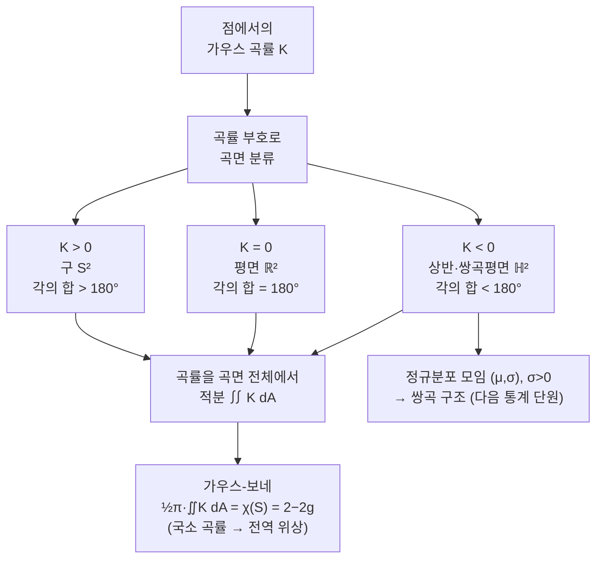

# 곡면을 분류하는 가우스 곡률 (뉴진수 14강)

이번 시간에는 곡면을 어떻게 구분할 것인지 묻습니다. 유클리드 평면, 구, 쌍곡적 공간을 가우스 곡률로 비교하고, 그 곡률을 적분하면 위상적 정보인 오일러 지표와 만난다는 사실까지 이어갑니다.

오늘 흘러갈 큰 줄거리를 한눈에 정리하면 이렇습니다.

---

## [0. 유클리드에서 가우스·리만으로 넘어가는 질문 · ▶ 1:02](https://www.youtube.com/watch?v=5ij0oZ6lb3Q&t=62s)

처음에 제가 붙든 질문은 왜 유클리드 기하 이후 오랜 시간이 지나서야 비유클리드 기하와 가우스·리만의 관점이 등장했느냐였습니다. 이 역사적 질문 자체를 길게 다루려는 것은 아니지만, 수학적으로는 분명한 변화가 있습니다. 도형을 평면 안에서만 보지 않고, 곡면 자체의 구조로 보기 시작한 것입니다.

직문수 노트의 이 단원은 이중적분과 면적분에서 출발해 곡면, 곡률, 가우스 곡률, 가우스-보네 정리로 갑니다 (→ 전사본 참조). 오늘은 그 전체를 다 증명하기보다, "곡면을 구분하는 기준이 왜 곡률인가"를 납득하는 데 집중하겠습니다.

특히 다음 강의들의 통계와 복소해석으로 이어지려면, 곡면을 단순히 눈앞의 3차원 그림으로만 보지 않아야 합니다. 어떤 공간에 내적, 거리, 최단거리, 곡률 같은 구조를 부여하면 그 자체가 기하의 대상이 됩니다.

## [1. 왜 이 순서로 공부하는가 · ▶ 6:45](https://www.youtube.com/watch?v=5ij0oZ6lb3Q&t=405s)

처음부터 가우스 곡률 계산으로 들어가지 않고, 왜 이 단원이 필요한지 먼저 말했습니다. 미분기하와 위상수학은 그냥 어려운 이름이 아니라, 앞에서 배운 미적분학과 선형대수학을 공간 자체에 적용하려는 언어입니다.

여러분이 미적분학과 선형대수학을 어느 정도 보았기 때문에, 이제는 "평면 위 함수"만이 아니라 "곡면 위의 함수", "공간 위의 거리", "그 거리로 정해지는 최단 경로"를 물을 수 있습니다. 이 질문들이 리만 기하와 복소해석, 그리고 다음 통계 단원의 정보기하로 이어집니다.

공부 방향으로도 중요한 지점이 있습니다. 모든 증명을 지금 당장 밀어붙이는 방식은 맞지 않을 수 있습니다. 대신 어떤 개념이 왜 필요한지, 어떤 예시에서 힘을 발휘하는지를 먼저 잡고, 증명은 나중에 좋은 레퍼런스로 다시 볼 수 있습니다.

> **💭 생각해볼 점** 미분기하를 "새 과목"으로만 보면 낯설지만, 다변수 미적분과 선형대수의 질문을 곡면 위로 옮기는 과정으로 보면 들어갈 문이 생깁니다.

## [2. 평면이 아니면 곡면인가 · ▶ 20:27](https://www.youtube.com/watch?v=5ij0oZ6lb3Q&t=1227s)

곡면을 아주 엄밀하게 정의하려면 다양체의 언어가 필요합니다. 하지만 오늘은 먼저 $z=f(x,y)$처럼 평면 위 함수의 그래프로 그려지는 곡면을 떠올려도 충분합니다. 단원 전사본도 $K\subset\mathbb R^2$ 위의 함수 $f:K\to\mathbb R$의 그래프를 곡면의 출발점으로 둡니다 (→ 전사본 참조).

참여자 질문은 "평면이 아니면 곡면이라고 봐도 되느냐"에 가까웠습니다. 직관적으로는 그렇게 시작해도 됩니다. 다만 모든 곡면이 전역적으로 하나의 함수 그래프로 표현되는 것은 아닙니다. 구나 토러스처럼 한 장의 그래프로 다 덮기 어려운 대상도 있습니다.

그래서 구체적 예시를 먼저 잡겠습니다. 구 $S^2$, 평면 $\mathbb R^2$, 상반평면 또는 쌍곡평면 $\mathbb H^2$는 곡률 부호가 서로 다릅니다. 이 세 예시는 앞으로 계속 기준점이 됩니다. 양의 곡률, 0 곡률, 음의 곡률이라는 세 세계를 대표하기 때문입니다.

> **💭 생각해볼 점** 곡면을 "3차원 안에 놓인 휘어진 종이"로만 보면, 상반평면처럼 평면 위에 그려 놓고도 음의 곡률을 갖는 구조를 이해하기 어렵습니다. 곡면은 모양뿐 아니라 그 위에 주어진 거리 구조까지 포함해서 봐야 합니다.

## [3. 정규분포의 모임을 곡면처럼 보겠다는 예고 · ▶ 45:59](https://www.youtube.com/watch?v=5ij0oZ6lb3Q&t=2759s)

중간에 통계 단원의 예고를 끼워 넣었습니다. 1차원 정규분포는 평균 $\mu$와 표준편차 $\sigma>0$로 정해집니다. 따라서 정규분포들의 모임은 좌표쌍 $(\mu,\sigma)$의 모임처럼 보이고, $\sigma>0$이므로 상반평면처럼 생깁니다.

이때 "그냥 평면 아닌가"라고 물을 수 있습니다. 점들의 집합만 보면 평면의 절반입니다. 그러나 어떤 거리를 주느냐에 따라 기하는 달라집니다. 정규분포의 모임에 자연스럽게 생기는 기하는 유클리드 평면이 아니라 음의 곡률을 가진 쌍곡적 구조와 연결됩니다.

그래서 오늘 가우스 곡률을 보는 이유가 다음 강의와 맞물립니다. 곡률은 곡면을 분류하는 숫자이고, 정규분포들의 공간도 하나의 곡면처럼 보면 그 곡률을 물을 수 있습니다. 통계와 기하가 만나는 지점입니다.

> **💭 생각해볼 점** 같은 점집합이라도 어떤 내적과 거리를 주느냐에 따라 전혀 다른 기하가 됩니다. 상반평면은 "반쪽 평면"이라는 집합 이름이 아니라, 계량까지 포함한 기하적 대상입니다.

## [4. 가우스 곡률은 곡면을 구분하는 좋은 기준이다 · ▶ 1:01:06](https://www.youtube.com/watch?v=5ij0oZ6lb3Q&t=3666s)

곡면을 구분하려면 숫자가 필요합니다. 가우스 곡률은 한 점에서 곡면이 어떻게 휘는지를 숫자로 주는 방법입니다. 곡선에서는 휘어짐을 이차도함수 같은 것으로 생각할 수 있지만, 곡면에서는 한 점을 지나는 방향이 무수히 많기 때문에 한 방향만 보면 부족합니다.

단원 전사본은 다음 절차로 가우스 곡률을 설명합니다. 곡면 위의 점에서 접평면을 만들고, 법선벡터를 세운 뒤, 법선벡터를 포함하는 여러 평면으로 곡면을 잘라 단면 곡선을 얻습니다. 그 단면 곡선들의 곡률 중 최댓값과 최솟값을 곱한 것이 가우스 곡률입니다 (→ 전사본 참조).

이 정의는 처음에는 바깥 공간을 많이 쓰는 것처럼 보입니다. 법선벡터도 쓰고, 곡면을 포함하는 3차원 공간도 씁니다. 그런데 가우스의 정리 이그레기움은 이 곡률이 사실 곡면 위의 내적, 즉 거리 구조만으로 결정된다고 말합니다. 이 점이 가우스 곡률을 특별하게 만듭니다.

오늘 대화에서 제가 강조한 것은, 가우스 곡률이 곡면을 구체적으로 "분류하기 좋은" 기준이라는 점입니다. 모든 점에서 곡률이 $0$인 구조, 양의 상수인 구조, 음의 상수인 구조는 서로 다른 기하 세계를 만듭니다.

## [5. 리만은 가우스의 질문을 어떻게 확장했는가 · ▶ 1:12:02](https://www.youtube.com/watch?v=5ij0oZ6lb3Q&t=4322s)

가우스 곡률은 원래 2차원 곡면에서 나온 개념입니다. 가우스가 본 것은, 겉으로 3차원 공간 안에 놓인 곡면의 휘어짐이 사실 곡면 내부의 거리 구조만으로 결정된다는 점이었습니다. 이것이 정리 이그레기움의 의미입니다.

리만의 확장은 여기서 출발합니다. 2차원 곡면만이 아니라 더 높은 차원의 공간에도 내적과 거리 구조를 줄 수 있고, 그 공간의 곡률을 말할 수 있습니다. 그래서 오늘날 우리는 가우스 기하라는 말보다 리만 기하라는 말을 더 자주 씁니다.

이 구분은 이름의 문제가 아닙니다. 가우스는 곡면에서 시작했고, 리만은 "공간 자체에 계량을 준다"는 관점으로 일반화했습니다. 앞으로 리만의 복소해석과 통계의 기하를 보려면 이 일반화가 필요합니다.

## [6. 접평면, 법선, 단면 곡선 · ▶ 1:18:04](https://www.youtube.com/watch?v=5ij0oZ6lb3Q&t=4684s)

가우스 곡률의 정의를 좀 더 천천히 보겠습니다. 곡면 위의 한 점 $P$를 잡습니다. 그 점에서 접평면을 세우고, 그 접평면에 수직인 법선벡터를 하나 잡습니다. 이제 그 법선벡터를 포함하는 평면들을 여러 방향으로 돌려 가며 생각합니다.

각 평면은 곡면을 한 곡선으로 자릅니다. 그러면 우리는 다시 1차원 곡선의 곡률을 계산할 수 있습니다. 평면을 돌릴 때마다 곡률 값이 달라지고, 그 중 가장 큰 값과 가장 작은 값을 골라 곱합니다. 이것이 점 $P$에서의 가우스 곡률 $K(P)$입니다.

참여자 질문 중에는 "곡선을 포함하는 평면을 어떻게 잡느냐"는 물음이 있었습니다. 한 점과 법선 방향을 고정해 놓고, 그 법선을 포함하는 평면을 회전시키는 것입니다. 그러면 곡면을 여러 방향으로 잘라 보는 효과가 납니다. 이 과정은 구체적이지만, 동시에 여러 방향 전체를 보는 추상화입니다.

> **💭 생각해볼 점** 곡면의 한 점에서 "한 방향의 휘어짐"만 보면 곡면 전체의 휘어짐을 놓칩니다. 가우스 곡률은 여러 단면 곡선의 곡률을 모아 최댓값과 최솟값의 곱으로 읽습니다.

## [7. 위상적으로 같은가, 기하적으로 같은가 · ▶ 1:33:58](https://www.youtube.com/watch?v=5ij0oZ6lb3Q&t=5638s)

대화 중에는 "공간이 서로 다른가"를 위상적으로 묻는 장면도 있었습니다. 예를 들어 열린구간과 닫힌구간은 둘 다 1차원처럼 보이지만 위상적으로는 다릅니다. 끝점이 있는지, 경계가 포함되어 있는지 같은 성질은 연속변형으로 지워지지 않습니다.

반면 위상적으로 같아도 기하적으로는 다를 수 있습니다. 같은 원판 위에 유클리드 계량을 줄 수도 있고, 다른 계량을 줄 수도 있습니다. 그러면 점집합과 열린집합 구조는 비슷해도 거리와 곡률은 달라집니다.

오늘 상반평면 예시는 이 구분을 요구합니다. 상반평면이라는 점집합만으로는 음의 곡률이 자동으로 나오지 않습니다. 어떤 계량을 주느냐가 결정적입니다. 따라서 "어떤 공간인가"라는 질문에는 집합, 위상, 계량의 층위가 함께 있습니다.

> **💭 생각해볼 점** 위상은 찢고 붙이지 않는 연속변형에서 남는 성질을 보고, 기하는 거리와 각도와 곡률을 봅니다. 두 층위를 섞으면 상반평면이나 토러스를 이해할 때 계속 헷갈립니다.

## [8. 구, 평면, 상반평면의 곡률 부호 · ▶ 1:41:23](https://www.youtube.com/watch?v=5ij0oZ6lb3Q&t=6083s)

이제 세 기본 예시를 봅니다. 평면 $\mathbb R^2$는 모든 점에서 가우스 곡률이 $0$입니다. 구 $S^2$는 모든 점에서 양의 곡률을 갖습니다. 상반평면 $\mathbb H^2$는 적절한 쌍곡 계량을 주면 모든 점에서 음의 상수 곡률을 갖습니다.

여기서 상반평면은 단순히 $\{(x,y)\in\mathbb R^2:y>0\}$라는 점들의 집합만을 뜻하지 않습니다. 그 위에 유클리드 거리와 다른 거리 구조를 주어야 합니다. 그래서 그림으로는 평면처럼 보여도, 그 안에서의 거리는 우리가 보는 직선 거리와 다르게 움직입니다.

이 관점은 통계 단원으로 이어집니다. 정규분포들의 모임을 $(\mu,\sigma)$로 매개화하면 $\sigma>0$이므로 상반평면과 닮은 공간이 나옵니다. 그 공간에 어떤 거리 구조를 주느냐에 따라 통계의 기하가 달라집니다.

## [9. 거리, 측지선, 삼각형의 각 · ▶ 1:43:45](https://www.youtube.com/watch?v=5ij0oZ6lb3Q&t=6225s)

곡률은 삼각형의 각에서도 드러납니다. 평면에서 삼각형의 내각의 합은 $180^\circ$입니다. 그러나 구 위에서 최단거리, 즉 측지선으로 삼각형을 만들면 내각의 합이 $180^\circ$보다 커질 수 있습니다. 음의 곡률 공간에서는 반대로 작아질 수 있습니다.

단원 전사본은 곡면 위 삼각형 $T$에 대해

$$
\theta_1+\theta_2+\theta_3
=\pi+\iint_T K\,dA
$$

라는 형태의 직관을 제시합니다 (→ 전사본 참조). 평면에서는 $K\equiv0$이므로 $\pi$가 나오고, 곡률이 양수면 더 커지고, 음수면 더 작아집니다.

오늘 대화에서 "거리로 연결한다"는 표현을 쓴 이유가 여기 있습니다. 곡면 위에서 두 점을 잇는 가장 짧은 길을 택해야 그 곡면의 내재적 기하가 드러납니다. 우리가 바깥에서 보는 직선이 아니라, 그 공간 안에서의 최단거리를 기준으로 삼아야 합니다.

## [10. 가우스-보네 정리: 곡률의 적분과 위상 · ▶ 1:47:21](https://www.youtube.com/watch?v=5ij0oZ6lb3Q&t=6441s)

가우스 곡률은 점마다 정의되는 함수입니다. 그렇다면 곡면 전체에 걸쳐 이 곡률을 적분할 수 있습니다. 가우스-보네 정리는 이 전체 적분이 곡면의 위상적 불변량과 연결된다고 말합니다.

닫힌 곡면 $S$에 대해 대표적인 형태는

$$
\frac{1}{2\pi}\iint_S K\,dA=\chi(S)=2-2g
$$

입니다. 여기서 $\chi(S)$는 오일러 지표이고, $g$는 종수, 즉 구멍의 개수입니다. 단원 전사본에서는 삼각분할의 꼭짓점 수 $v$, 모서리 수 $e$, 면 수 $f$로 $\chi(S)=v-e+f$를 소개합니다 (→ 전사본 참조).

이 식이 말하는 것은 강합니다. 국소적인 곡률을 곡면 전체에서 더했더니, 구멍의 개수 같은 전역적인 위상 정보가 나옵니다. 구와 토러스가 단지 모양이 다르게 보이는 정도가 아니라, 곡률 적분으로도 구별된다는 뜻입니다.

## [11. 증명은 나중에, 기준 예시는 지금 · ▶ 1:55:11](https://www.youtube.com/watch?v=5ij0oZ6lb3Q&t=6911s)

가우스 곡률이나 가우스-보네 정리의 증명을 지금 모두 따라가기는 어렵습니다. 저는 그래서 기준 예시를 먼저 붙들자고 했습니다. 평면, 구, 쌍곡평면, 토러스 같은 예시를 두고 "어떤 곡률을 갖는가", "어떤 위상 불변량을 갖는가"를 반복해서 보자는 뜻입니다.

수학 공부에서 증명은 중요하지만, 증명을 읽을 준비가 되기 전에 개념의 역할을 전혀 모르면 증명도 잘 들어오지 않습니다. 오늘은 정의와 정리의 모든 엄밀성을 확보하는 시간이라기보다, 나중에 증명을 읽을 때 무엇을 확인해야 하는지 지도를 그리는 시간이었습니다.

예를 들어 정리 이그레기움은 "가우스 곡률이 내재적이다"를 증명합니다. 가우스-보네는 "곡률 적분이 위상과 만난다"를 증명합니다. 이 문장들이 머릿속에 남아 있으면, 나중에 증명을 읽을 때 계산의 방향을 잃지 않습니다.

## [12. 통계와 불평등 문제로 이어지는 시야 · ▶ 2:02:31](https://www.youtube.com/watch?v=5ij0oZ6lb3Q&t=7351s)

마지막에는 이 이야기가 왜 통계나 불평등 같은 응용 문제와 연결되는지 보았습니다. 평균과 표준편차로 정규분포를 모으면, 그 모임은 상반평면처럼 보입니다. 그런데 그 상반평면을 유클리드 평면처럼 보면 정규분포들의 실제 구조를 제대로 반영하지 못할 수 있습니다.

예를 들어 $\sigma$가 작아질수록 분포는 더 뾰족해지고, 작은 변화가 큰 의미를 가질 수 있습니다. 이런 구조를 반영하려면 단순한 평면 거리보다 쌍곡적 거리 구조가 더 자연스러울 수 있습니다. 이것이 다음 통계 단원에서 정보기하로 이어지는 길입니다.

따라서 오늘의 목적은 "가우스 곡률을 계산할 줄 알자"에서 끝나지 않습니다. 수학적 구조가 응용 문제 안에 이미 녹아 있음을 보고, 필요한 공부를 할 때 어떤 언어를 기준으로 삼을지 정하는 데 있습니다.

정규분포의 모임을 다시 떠올리면, 평균 방향으로 움직이는 것과 표준편차 방향으로 움직이는 것이 같은 종류의 변화가 아닙니다.
평면 그림에서는 둘 다 좌표축 이동이지만, 분포의 모양으로 보면 하나는 중심 이동이고 다른 하나는 폭의 변화입니다.
이 차이를 거리 구조에 반영하려고 하면 계량이 필요합니다.
계량이 들어오면 곡률을 물을 수 있고, 곡률을 물으면 오늘 본 가우스 곡률의 언어가 다시 등장합니다.

불평등 문제도 비슷합니다.
데이터의 평균만 보면 한 숫자이지만, 분포 전체를 보면 꼬리와 폭과 비대칭성이 있습니다.
그 분포들의 모임을 공간으로 보고 거리와 곡률을 묻는 순간, 통계는 기하의 언어를 빌리게 됩니다.
오늘의 곡률 이야기는 그래서 다음 통계 강의의 준비이기도 합니다.

영상의 질문 흐름을 더 잘 살리기 위해 세부 포인트를 남겨 둡니다.

- 처음 질문은 유클리드 기하에서 왜 가우스와 리만의 기하로 넘어가야 하는가였습니다.
- 평면 도형만 보면 피타고라스 정리와 유클리드 거리로 충분해 보입니다.
- 하지만 곡면 자체를 공간으로 보면, 그 위에서의 거리와 각도와 최단거리가 새로 정해집니다.
- "평면이 아니면 곡면인가"라는 질문에는 일단 그렇다고 시작할 수 있습니다.
- 다만 엄밀하게는 한 장의 함수 그래프로 덮이지 않는 곡면도 있습니다.
- 구는 전역적으로 $z=f(x,y)$ 하나로 표현하기 어렵습니다.
- 토러스도 한 장의 그래프로는 자연스럽지 않습니다.
- 그래서 다양체의 언어가 필요하지만, 오늘은 예시 중심으로 갑니다.
- 정규분포의 모임 예고는 곡면을 응용 문제에서 보는 방법을 보여 줍니다.
- $(\mu,\sigma)$ 좌표가 있으니 평면처럼 보이지만, $\sigma>0$이라 상반평면 모양입니다.
- 점집합만 같아도 거리 구조가 다르면 다른 기하가 됩니다.
- 가우스 곡률은 곡면을 구별하기 위한 숫자입니다.
- 곡선에서는 한 방향의 휘어짐을 보면 되지만, 곡면에서는 방향이 무수히 많습니다.
- 그래서 한 점에서 법선벡터를 잡고, 그 법선을 포함하는 평면들로 곡면을 자릅니다.
- 각 단면 곡선의 곡률을 보고 최댓값과 최솟값을 곱합니다.
- 이 과정에서 "어떤 평면을 잡는가"라는 질문이 자연스럽게 나왔습니다.
- 법선 방향을 고정하면, 그 법선을 포함하는 평면들이 무한히 많습니다.
- 그 평면들이 곡면을 여러 방향으로 썰어 단면 곡선을 만듭니다.
- 평면은 곡률 $0$의 기준 예시입니다.
- 구는 모든 방향으로 같은 부호로 휘므로 양의 곡률 예시입니다.
- 쌍곡평면은 음의 곡률 예시입니다.
- 상반평면은 점집합만으로 음의 곡률이 되는 것이 아니라 계량을 줘야 합니다.
- 위상과 기하도 구분해야 합니다.
- 열린구간과 닫힌구간은 둘 다 1차원처럼 보여도 위상적으로 다릅니다.
- 같은 위상 공간에도 서로 다른 계량을 줄 수 있습니다.
- 가우스-보네 정리는 국소 곡률을 전체에서 더해 위상 정보와 만나는 장면입니다.
- 구멍 개수 같은 전역 정보가 곡률 적분으로 나타납니다.
- 이것은 다음의 정보기하와도 닮았습니다.
- 통계에서 평균 하나만 보는 대신 분포들의 공간을 보면 거리와 곡률을 묻게 됩니다.
- 그러므로 이 강의는 미분기하의 정의 소개이면서 통계 단원으로 가는 다리입니다.
- 참여자 질문처럼 "접평면을 긋는다"는 말도 그냥 그림이 아니라 로컬 선형화를 뜻합니다.
- 접평면은 곡면을 한 점 근처에서 평면처럼 대신 보는 장치입니다.
- 법선벡터는 그 접평면에 수직인 방향을 고르는 장치입니다.
- 단면 곡률을 볼 때 법선벡터를 포함하는 평면을 고르는 이유가 여기에 있습니다.
- 가우스 곡률은 바깥에서 보이는 휘어진 모양보다, 곡면 위에서 재는 거리와 더 깊게 연결됩니다.
- 그래서 종이를 말아 원기둥처럼 만들어도 평면과 같은 내재적 곡률을 가질 수 있다는 예시가 떠오릅니다.
- 반대로 구는 평면 종이를 찢거나 늘리지 않고는 덮기 어렵습니다.
- 이 차이가 "내재적"이라는 말을 이해하는 첫 번째 감각입니다.
- 오늘은 이 감각을 증명으로 밀지 않고, 다음 통계·복소해석을 읽는 기준으로 남깁니다.

## 요약

- 곡면은 함수 그래프처럼 구체적으로 시작할 수 있지만, 일반적으로는 그 위의 거리·내적 구조까지 포함해서 봐야 한다.
- 가우스 곡률은 한 점에서 법선벡터를 포함하는 평면들로 곡면을 잘라 얻은 단면 곡선들의 곡률 중 최댓값과 최솟값의 곱으로 정의된다 (→ 전사본 참조).
- 정리 이그레기움은 가우스 곡률이 바깥 공간의 놓임이 아니라 곡면 위의 내적만으로 결정된다고 말한다 (→ 전사본 참조).
- 평면은 곡률 $0$, 구는 양의 곡률, 상반평면/쌍곡평면은 음의 곡률을 갖는 대표 예시다.
- 곡면 위 측지삼각형의 내각의 합은 곡률 적분과 연결된다. 평면에서는 $180^\circ$, 양의 곡률에서는 더 큼, 음의 곡률에서는 더 작음으로 읽을 수 있다.
- 가우스-보네 정리는 $\frac1{2\pi}\iint_S K\,dA=\chi(S)=2-2g$로, 국소 곡률의 전체 적분과 구멍 개수 같은 위상 정보를 연결한다 (→ 전사본 참조).
- 정규분포들의 모임을 상반평면처럼 보는 다음 단원에서는 이 곡률·거리 구조가 통계의 기하로 이어진다.
