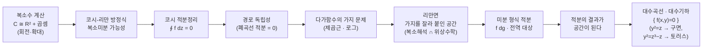

# 리만의 수학적 세계관에 대한 소개 (뉴진수 15강)

이번 시간에는 단원 노트를 그대로 읽기보다, 리만의 수학을 어떤 기준으로 이해할지 이야기합니다. 리만 적분, 리만 기하, 리만면, 복소해석, 대수기하가 흩어진 이름이 아니라 하나의 관점으로 어떻게 이어지는지 보겠습니다.

---

## [0. 리만을 하나의 기준으로 삼기 · ▶ 0:48](https://www.youtube.com/watch?v=4-vuorolyFw&t=48s)

제가 오늘 남기고 싶은 것은 두 가지입니다. 하나는 리만의 복소해석을 제대로 공부할 필요가 있다는 말이고, 다른 하나는 여러분 각자의 관심 분야를 리만의 수학을 매개로 어떻게 다시 볼 수 있는지입니다. 리만은 평생 논문을 많이 쓴 사람이 아니지만, 그의 이름이 붙은 대상은 적분, 기하, 가설, 리만면까지 넓게 퍼져 있습니다.

여기서 제가 묻고 싶은 질문은 "어떻게 한 사람이 이렇게 여러 분야에 걸친 생각을 했는가"입니다. 단순히 천재였다고 말하고 넘어가면 공부의 기준이 생기지 않습니다. 저는 리만이 어떤 문제를 어떤 도구로 붙잡았는지, 그 주파수를 맞추어 보자는 식으로 접근하고 싶습니다.

단원 전사본은 가우스-보네, 복소수체, 코시-리만 방정식, 코시 적분정리, 리만 곡면, 대수기하까지 넓게 놓습니다 (→ 전사본 참조). 오늘 영상은 그 모든 항목을 순서대로 설명하기보다, 그 뒤에 있는 리만식 문제의식을 말하는 쪽으로 진행됩니다.

## [1. 리만이라는 이름이 붙은 것들을 구분하기 · ▶ 2:40](https://www.youtube.com/watch?v=4-vuorolyFw&t=160s)

리만이라는 이름은 여러 곳에 붙어 있습니다. 리만 적분, 리만 기하, 리만 가설, 리만면이 있습니다. 이 이름들을 한꺼번에 보면 "리만은 모든 분야를 만든 사람"처럼 느껴질 수 있지만, 그렇게 말하면 오히려 공부의 초점이 흐려집니다.

리만 적분은 해석학의 출발점에 있고, 리만 기하는 곡률과 계량의 언어에 있고, 리만 가설은 정수론과 대수적 구조에 가까우며, 리만면은 복소해석과 위상수학의 경계에 있습니다. 같은 이름이지만 같은 과목이라는 뜻은 아닙니다.

오늘 제가 잡고 싶은 기준은 "리만이 무엇을 전부 만들었는가"가 아니라 "이미 있던 도구를 어떤 공간적 질문에 붙였는가"입니다. 이 기준으로 보면 복소해석, 미분기하, 대수기하가 왜 한 흐름 안에 들어오는지 조금 보입니다.

> **💭 생각해볼 점** 수학사 이름을 공부할 때는 업적 목록보다 문제의식을 먼저 봐야 합니다. 어떤 이름이 붙은 대상이 많을수록, 그 이름 아래에서 실제로 공통된 질문이 무엇인지 따져야 합니다.

## [2. 공부의 기준으로 리만 복소해석을 놓는 이유 · ▶ 8:24](https://www.youtube.com/watch?v=4-vuorolyFw&t=504s)

중간에 수학 공부 방향에 대한 이야기가 나왔습니다. 어떤 분야를 공부하려면 무엇을 먼저 알아야 하는지 묻는 질문은 늘 어렵습니다. 저는 리만의 복소해석을 하나의 기준점으로 놓고 생각해 보자고 했습니다. 왜냐하면 이 주제가 해석학, 선형대수, 위상수학, 대수기하를 동시에 불러오기 때문입니다.

물론 모든 사람이 리만면을 연구해야 한다는 뜻은 아닙니다. 다만 복소해석을 제대로 보려면 코시 적분정리와 코시-리만 방정식만이 아니라, 경로, 폐곡선, 전역 함수, 미분 형식, 곡면의 위상 같은 언어가 필요합니다. 그래서 "내가 어떤 수학을 더 공부해야 하는가"를 판단하는 좋은 시험대가 됩니다.

여기서 중요한 것은 난이도를 과시하는 일이 아닙니다. 여러 분야가 왜 연결되는지 보는 것입니다. 리만의 복소해석은 현대 수학의 교차로 같은 역할을 하므로, 각자의 관심 분야를 이 교차로에 한 번 비추어 볼 수 있습니다.

## [3. 리만이 한 일과 하지 않은 일 · ▶ 20:05](https://www.youtube.com/watch?v=4-vuorolyFw&t=1205s)

먼저 구분해야 합니다. 복소해석 자체가 전부 리만의 업적은 아닙니다. 코시가 해 놓은 복소적분 이론이 있고, 가우스가 곡면의 곡률을 깊게 다루었습니다. 리만은 이미 있던 도구들을 가지고 새로운 방식으로 공간을 이해하려 했습니다.

리만 기하에서 리만의 일은 가우스가 곡면에서 보았던 내재적 곡률의 생각을 더 높은 차원의 다양체로 확장한 것입니다. 곡면이라는 2차원 대상만이 아니라, 여러 차원의 공간에 계량과 곡률을 줄 수 있다는 생각입니다.

복소해석 쪽에서도 마찬가지입니다. 정칙함수, 코시 적분정리 같은 도구들이 이미 있었지만, 리만은 그것들을 곡면과 적분의 문제에 붙였습니다. 그래서 리만면이라는 말은 단순히 복소함수 하나를 공부한다는 뜻이 아니라, 복소적분이 가능한 공간을 새롭게 만드는 관점을 담습니다.

> **💭 생각해볼 점** 어떤 이름이 붙었다고 해서 그 분야 전체를 그 사람이 만들었다는 뜻은 아닙니다. 더 중요한 질문은 "그 사람이 기존 도구를 어디에 어떻게 적용했는가"입니다.

## [4. 복소수 곱셈은 평면 회전과 확대를 함께 담는다 · ▶ 31:12](https://www.youtube.com/watch?v=4-vuorolyFw&t=1872s)

복소수를 $\mathbb R^2$의 점으로만 보면 $(a,b)$라는 좌표쌍입니다. 그런데 복소수에는 곱셈이 있습니다. $i$를 곱하면 평면에서 $90^\circ$ 회전하는 효과가 생깁니다. 일반 복소수 $re^{i\theta}$를 곱하면 크기를 $r$배 하고 각도를 $\theta$만큼 돌리는 변환이 됩니다.

이 구조 때문에 복소평면은 단순한 2차원 실평면과 다릅니다. $\mathbb R^2$에도 여러 구조를 얹을 수 있지만, 복소수의 곱셈은 미분 가능성 조건을 매우 강하게 만듭니다. 그래서 복소미분 가능하다는 말은 두 실변수 함수가 그냥 미분 가능하다는 말보다 훨씬 엄격합니다.

코시-리만 방정식이 나오는 이유도 이 지점에 있습니다. $f(z)=u(x,y)+iv(x,y)$로 쓰면, 복소미분 가능성은 $u$와 $v$의 편미분이 서로 맞물리는 조건을 요구합니다. 이 조건이 나중에 그린 정리와 결합되어 코시 적분정리로 갑니다 (→ 전사본 참조).

## [5. 복소수 위에서 미적분학을 하겠다는 선택 · ▶ 56:07](https://www.youtube.com/watch?v=4-vuorolyFw&t=3367s)

리만의 선택을 아주 단순하게 말하면, 미적분학을 복소수 위에서 하겠다는 것입니다. 실수 직선 위의 미적분학은 구간, 함수, 도함수, 적분으로 움직입니다. 복소수는 평면이면서 동시에 곱셈 구조를 가진 수체입니다. 이 평면 위에서 미적분을 하겠다는 선택은 단순한 차원 증가가 아닙니다.

단원 전사본은 복소수를 $\mathbb R^2$ 위의 자연스러운 곱셈 구조로 설명합니다. $(a,b)$와 $(c,d)$를 $a+bi$, $c+di$로 보고 곱하면

$$
(a+bi)(c+di)=(ac-bd)+(ad+bc)i
$$

입니다 (→ 전사본 참조). 이 곱셈 때문에 복소평면은 그냥 두 실변수의 평면과 다른 구조를 갖습니다.

복소함수 $f(z)$를 적분할 때는 경로를 따라 적분합니다. 그런데 어떤 함수들에 대해서는 폐곡선을 따라 적분하면 $0$이 됩니다. 이 사실은 경로에 무관한 적분을 가능하게 하고, 공간 위에서 함수를 이해하는 강력한 방법을 줍니다.

## [6. 코시 적분정리와 경로 독립성 · ▶ 1:13:10](https://www.youtube.com/watch?v=4-vuorolyFw&t=4390s)

코시 적분정리는 정칙함수 $f$에 대해 적절한 영역의 폐곡선 $C$를 따라

$$
\oint_C f(z)\,dz=0
$$

이 된다는 정리입니다. 단원 전사본은 이 정리를 그린 정리와 코시-리만 방정식으로 설명합니다. $f=u+iv$로 쓰고, 코시-리만 방정식 $u_x=v_y$, $u_y=-v_x$를 적용하면 면적분의 피적분함수가 사라집니다 (→ 전사본 참조).

이것이 왜 중요할까요? 두 점을 잇는 경로가 여러 개 있을 때, 한 경로를 따라 적분한 값과 다른 경로를 따라 적분한 값을 비교해 봅시다. 두 경로를 붙이면 폐곡선이 됩니다. 폐곡선 적분이 $0$이면 두 경로의 적분값은 같습니다. 즉 적분값이 경로에 의존하지 않습니다.

이 장면은 앞의 그래디언트장 선적분과 비슷합니다. 그래디언트장을 따라 적분하면 경로가 아니라 끝점만 중요했듯이, 정칙함수의 복소적분도 적절한 조건 아래에서 경로 독립성을 가질 수 있습니다. 리만이 복소수를 고른 이유를 저는 여기서 봅니다. 복소수 위의 미적분은 경로 독립성과 경계 정보라는 강한 구조를 줍니다.

> **💭 생각해볼 점** 폐곡선 적분이 $0$이라는 말은 단순히 어떤 계산값이 사라진다는 말이 아닙니다. 두 점 사이의 적분이 경로에 무관해질 수 있다는 말이고, 이때 공간 위에서 새 좌표나 새 함수를 만들 수 있습니다.

## [7. 전역 함수가 막히는 곳에서 리만면이 나온다 · ▶ 1:21:40](https://www.youtube.com/watch?v=4-vuorolyFw&t=4900s)

복소함수의 어려움 중 하나는 다가함수입니다. 예를 들어 제곱근이나 로그는 복소평면에서 한 바퀴 돌면 값의 가지가 바뀌는 현상을 보입니다. 한 장의 복소평면 위에서 함수를 전역적으로 하나의 값으로 만들기 어렵습니다.

리만면은 이 문제를 공간을 바꾸어 해결하려는 관점입니다. 함수값의 가지가 갈라지는 곳을 잘라서 여러 장을 붙이면, 원래 다가함수처럼 보이던 대상이 새 곡면 위에서는 단일값 함수가 됩니다. 함수의 복잡성을 공간의 구조로 옮긴 셈입니다.

이 장면에서 복소해석과 위상수학이 만납니다. 어디를 자르고 어떻게 붙이는가, 한 바퀴 돌 때 값이 어떻게 바뀌는가, 구멍과 가지점이 어떤 역할을 하는가가 모두 공간의 전역 구조와 관련됩니다.

## [8. 함수가 없으면 미분 형식을 적분한다 · ▶ 1:27:46](https://www.youtube.com/watch?v=4-vuorolyFw&t=5266s)

문제는 실제 곡면 위에 우리가 원하는 전역 함수가 없을 수 있다는 점입니다. 토러스 같은 공간에서 복소함수를 전역적으로 잘 잡고, 그 함수를 적분하겠다고 하면 막히는 지점이 생깁니다. 그래서 리만의 관점에서는 "함수를 적분한다"보다 "미분 형식을 적분한다"는 언어가 중요해집니다.

오늘 대화에서 저는 $f\,dg$ 같은 표현을 언급했습니다. 함수 $g$가 전역적으로 잘 잡히지 않더라도, 미분 형식은 전역적으로 정의될 수 있습니다. 그러면 그 미분 형식을 경로를 따라 적분할 수 있습니다. 이때 선형대수의 쌍대공간, 다변수 해석학의 미분 형식, 위상수학의 전역 조건이 함께 들어옵니다.

참여자 질문으로 "함수를 적분하는 것과 $dz$ 같은 미분 형식을 적분하는 것이 같은가"가 나왔습니다. 로컬 표현에서는 $f(z)\,dz$처럼 보이기 때문에 익숙한 적분과 비슷합니다. 그러나 전역 대상은 좌표 선택과 무관하게 주어져야 합니다. 로컬 표현이 맞아도 그것이 곧 글로벌 정의가 되는 것은 아닙니다.

> **💭 생각해볼 점** 벡터 자체와 기저에 대한 좌표표현이 다르듯이, 미분 형식 자체와 로컬 좌표에서의 표현도 다릅니다. 이 구분을 받아들이면 "표현은 맞는데 전역적으로는 안 된다"는 말이 자연스러워집니다.

## [9. 로컬 표현과 글로벌 대상의 차이 · ▶ 1:36:30](https://www.youtube.com/watch?v=4-vuorolyFw&t=5790s)

참여자 질문은 로컬 좌표에서 $f(z)\,dz$처럼 쓰면 결국 익숙한 함수 적분과 같은 것 아닌가 하는 방향이었습니다. 로컬하게는 그렇게 보입니다. 그러나 곡면 전체를 덮는 좌표가 하나가 아닐 때, 각 좌표조각에서 쓴 표현들이 서로 맞게 붙어야 전역 미분 형식이 됩니다.

이것은 선형대수에서 벡터와 좌표를 구분하는 일과 비슷합니다. 벡터 자체는 좌표계와 무관하지만, 좌표를 잡으면 숫자열로 표현됩니다. 미분 형식도 마찬가지입니다. 좌표를 잡으면 $f(z)\,dz$처럼 보이지만, 대상 자체는 좌표변환 아래에서도 일관되게 정의되어야 합니다.

그래서 리만면을 공부하려면 해석학만으로 부족해집니다. 좌표조각, 전이함수, 전역적 붙임, 호몰로지 같은 말들이 나타나는 이유가 여기에 있습니다.

## [10. 적분의 결과가 공간이 된다는 관점 · ▶ 1:44:37](https://www.youtube.com/watch?v=4-vuorolyFw&t=6277s)

리만의 관점에서 제가 가장 강조하고 싶은 문장은 "적분의 결과가 공간이 된다"입니다. 보통 우리는 적분하면 숫자가 나온다고 생각합니다. 그런데 토러스 위에서 적절한 미분 형식을 적분하고, 기준점에서 여러 점까지의 적분값을 모으면 복소수들의 집합, 즉 새로운 공간이 나타납니다.

이것은 단순한 계산 결과가 아닙니다. 원래 적분하려던 곡면을 다른 복소공간 속에 표현하는 방법이 됩니다. 리만면을 이해할 때 적분은 값을 내는 도구인 동시에 공간을 만드는 도구입니다.

단원 전사본의 뒤쪽은 다가함수와 리만 곡면을 설명합니다. 예를 들어 $y^2=z$나 $y^2=z^3-z$ 같은 식에서 함수값이 여러 갈래로 갈라지면, 가지들을 잘라 이어 붙여 함수가 잘 정의되는 곡면을 만듭니다. $y^2=z$는 구면, $y^2=z^3-z$는 토러스와 연결됩니다 (→ 전사본 참조).

리만의 세계관은 여기서 복소해석과 대수기하를 잇습니다. 복소적분과 미분 형식으로 만든 곡면이, 동시에 다항방정식의 해집합으로도 표현됩니다. 그러면 기하와 대수가 같은 대상을 서로 다른 언어로 말하게 됩니다.

## [11. $y^2=z$와 $y^2=z^3-z$를 곡면으로 읽기 · ▶ 1:56:40](https://www.youtube.com/watch?v=4-vuorolyFw&t=7000s)

전사본의 예시처럼 $y^2=z$를 보면, $z$ 하나에 대해 $y$가 두 값으로 갈라집니다. 복소평면 한 장 위에서는 제곱근의 가지가 생깁니다. 하지만 두 장을 적절히 붙이면 하나의 리만면 위에서 더 자연스러운 대상이 됩니다. 이 경우는 구면과 연결됩니다 (→ 전사본 참조).

$y^2=z^3-z$ 같은 식은 더 복잡합니다. 가지점이 여러 개 생기고, 그 가지들을 이어 붙이면 토러스와 연결되는 리만면이 나타납니다. 다항방정식 하나가 복소해석의 곡면, 위상수학의 종수, 대수기하의 곡선과 동시에 연결됩니다.

이 예시는 오늘 말한 "적분의 결과가 공간이 된다"와 같은 방향을 가리킵니다. 복소함수의 가지 문제를 공간으로 바꾸어 보고, 그 공간을 다시 대수방정식의 해집합으로 읽습니다.

## [12. 리만에서 대수기하로 · ▶ 2:03:24](https://www.youtube.com/watch?v=4-vuorolyFw&t=7404s)

리만은 공간에서 적분을 하되, 복소수 위의 FTC와 코시적분의 힘을 이용해 공간을 다시 읽었습니다. 그 다음 20세기의 대수기하에서는 이 공간을 다항방정식의 해집합으로 표현하는 방향이 강해집니다. 간단히 말하면 기하를 대수학으로 쓰는 법이 발전합니다.

예를 들어 복소수 변수 $x,y$에 대해 $f(x,y)=0$으로 주어진 해집합은 대수곡선입니다. 단원 전사본은 리만 곡면 $\{(x,y)\in\mathbb C^2:f(x,y)=0\}$이 대수곡선과 연결되고, 매끄러운 평면 곡선의 차수와 종수가 관계를 갖는다고 설명합니다 (→ 전사본 참조).

그래서 해석학, 위상수학, 대수학, 다변수 해석학은 따로따로 외우는 과목 목록이 아닙니다. 리만의 관점에서는 공간을 적분하고, 그 적분이 공간을 만들며, 그 공간을 다시 대수적으로 표현하는 한 흐름으로 묶입니다.

## [13. 공부 방향으로 남기는 말 · ▶ 2:17:47](https://www.youtube.com/watch?v=4-vuorolyFw&t=8267s)

마지막 질문은 미분 형식 적분의 로컬 표현과 글로벌 대상의 차이에 관한 것이었습니다. 저는 이것을 지금 당장 완전히 소화해야 하는 내용으로 말하고 싶지 않습니다. 다만 앞으로 리만의 복소해석이나 리만면을 공부할 때, 왜 다변수 해석학과 위상수학의 언어가 필요한지 알기 위한 방향 표시로 받아들이면 됩니다.

리만의 수학은 어렵습니다. 하지만 그 어려움은 막연한 난해함이 아니라, 어떤 문제를 풀기 위해 필요한 도구들이 쌓이면서 생기는 어려움입니다. 복소수 위에서 미적분을 하고, 경로 독립성을 얻고, 전역 함수가 없으면 미분 형식을 적분하고, 그 결과로 공간을 만든다는 흐름을 붙들면 공부의 방향이 생깁니다.

> **📚 참고·응용** 리만의 복소해석을 더 공부하려면 코시 적분정리, 코시-리만 방정식, 미분 형식, 리만면, 기본적인 위상수학을 따로따로 보되, 이들이 "공간 위에서 적분을 가능하게 한다"는 하나의 목적 아래 놓인다는 점을 잊지 않는 것이 좋습니다.

구체적으로는 복소수 계산에서 시작해 폐곡선 적분으로 가고, 그 다음 다가함수의 가지 문제를 봅니다.
가지 문제를 공간을 바꾸어 해결하려고 할 때 리만면이 나오고, 그 위에서 전역적으로 적분하려고 할 때 미분 형식이 나옵니다.
그 리만면이 다항방정식의 해집합으로도 표현될 때 대수기하의 언어가 들어옵니다.
이 순서를 붙들면 여러 과목 이름이 흩어지지 않고 하나의 공부 경로로 보입니다.

영상에서 말한 리만의 관점을 조금 더 촘촘히 펼치면 다음과 같습니다.

- 리만 적분, 리만 기하, 리만 가설, 리만면은 이름은 같지만 같은 내용이 아닙니다.
- 이름이 같다고 해서 한 사람이 모든 분야를 처음부터 만든 것도 아닙니다.
- 가우스 곡률은 가우스의 업적이고, 코시 적분정리는 코시의 업적입니다.
- 리만은 이미 있던 도구를 공간의 문제에 붙이는 방식으로 새 관점을 열었습니다.
- 리만 기하에서는 가우스의 2차원 곡률 생각을 더 높은 차원의 공간으로 확장합니다.
- 복소해석에서는 코시의 도구를 리만면과 전역적 적분 문제에 붙입니다.
- 복소수는 $\mathbb R^2$의 점이면서 곱셈이 있는 수입니다.
- $i$를 곱하면 $90^\circ$ 회전합니다.
- 일반 복소수를 곱하면 회전과 확대가 동시에 일어납니다.
- 그래서 복소미분 가능성은 두 실변수 미분 가능성보다 훨씬 강한 조건입니다.
- 코시-리만 방정식은 이 강한 조건의 좌표 표현입니다.
- 코시 적분정리는 폐곡선 적분이 $0$이 되는 상황을 줍니다.
- 폐곡선 적분이 $0$이면 두 경로의 적분값이 같아집니다.
- 이 경로 독립성은 앞에서 본 그래디언트장 선적분과 닮았습니다.
- 하지만 복소해석에서는 함수가 전역적으로 단일값인지도 따져야 합니다.
- 제곱근과 로그는 한 바퀴 돌면 가지가 바뀌는 대표 예시입니다.
- 리만면은 이 가지 문제를 공간을 바꾸어 해결합니다.
- 여러 장을 잘라 붙이면 다가함수가 새 공간 위에서 단일값 함수처럼 행동합니다.
- 이때 어디를 자르고 어떻게 붙이는지가 위상수학의 언어를 부릅니다.
- 함수 대신 미분 형식을 적분한다는 말도 여기서 나옵니다.
- 로컬 좌표에서는 $f(z)\,dz$처럼 보이지만, 전역 대상은 좌표를 바꿔도 맞게 붙어야 합니다.
- 벡터와 좌표표현을 구분하듯, 미분 형식과 로컬 표현을 구분해야 합니다.
- 적분의 결과가 숫자 하나로 끝나지 않고 새 공간을 만들 수 있습니다.
- $y^2=z$는 제곱근의 가지 문제를 곡면으로 바꾸는 간단한 예입니다.
- $y^2=z^3-z$는 토러스와 연결되는 더 복잡한 예입니다.
- 다항방정식의 해집합을 복소해석의 곡면으로 읽으면 대수기하가 들어옵니다.
- 그래서 리만면은 해석학, 위상수학, 대수학이 만나는 장소입니다.
- 공부 순서로는 복소수 계산, 경로적분, 코시 정리, 리만면, 미분 형식, 대수곡선을 차례로 보는 편이 좋습니다.
- 각 단계가 따로 있는 과목명이 아니라, 전역적으로 적분 가능한 공간을 만들려는 질문으로 이어집니다.
- 리만 가설 이야기도 이름만으로 같은 갈래라고 보면 곤란합니다.
- 리만 가설은 해석적 도구와 정수론이 만나는 문제이고, 오늘의 리만면 이야기는 복소해석과 기하 쪽입니다.
- 그래도 둘 다 복소해석의 함수와 전역 구조가 수학의 다른 영역에 영향을 준다는 점에서는 닮아 있습니다.
- 오늘 제가 리만 복소해석을 기준점으로 둔 이유도 그 연결성 때문입니다.
- 참여자분이 "라디오처럼 듣는다"고 말한 것도 공부 방식의 한 예입니다.
- 처음에는 모든 정의를 따라가지 못해도, 어떤 단어들이 반복되는지 듣는 것만으로 지도가 생깁니다.
- 그 다음에는 코시 정리처럼 계산 가능한 지점으로 돌아가야 합니다.
- 계산 가능한 지점이 있어야 리만면이나 미분 형식 같은 전역 언어가 허공에 뜨지 않습니다.
- 복소해석은 그래서 계산과 공간 감각을 함께 요구합니다.
- 오늘 노트도 그 두 층위를 분리해 보려는 시도입니다.

## 요약

- 오늘 영상은 단원 노트를 순서대로 읽기보다, 리만의 수학을 어떤 문제의식으로 볼지 설명하는 데 집중했다.
- 복소해석 전체가 리만의 업적은 아니다. 코시의 적분정리, 가우스의 곡률 이론 같은 도구들이 있었고, 리만은 그것들을 공간 이해에 새 방식으로 붙였다.
- 복소수는 $\mathbb R^2$ 위에 곱셈 구조 $(a+bi)(c+di)=(ac-bd)+(ad+bc)i$를 주는 대상이다 (→ 전사본 참조).
- 코시 적분정리 $\oint_C f(z)\,dz=0$은 정칙함수의 폐곡선 적분이 사라짐을 말하고, 경로 독립성의 근거가 된다 (→ 전사본 참조).
- 토러스 같은 공간에서는 전역 함수가 없을 수 있으므로, 리만의 관점에서는 함수보다 미분 형식을 적분하는 언어가 중요해진다.
- 로컬 표현 $f(z)\,dz$와 전역 미분 형식은 구분해야 한다. 표현은 좌표를 잡은 뒤의 모습이고, 전역 대상은 좌표 선택과 무관해야 한다.
- 리만식 적분은 단순히 숫자를 내는 계산이 아니라 공간을 만드는 도구가 된다.
- 리만 곡면과 대수곡선은 복소해석과 대수기하를 잇는다. $y^2=z$, $y^2=z^3-z$ 같은 식은 가지를 이어 붙인 곡면과 연결된다 (→ 전사본 참조).
