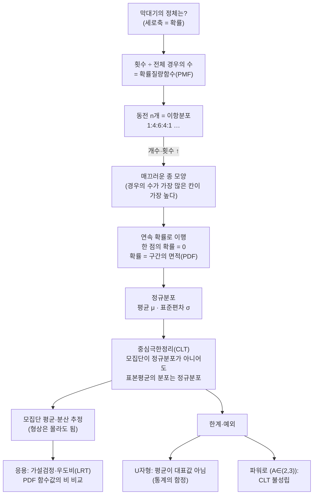

# 정규분포와 중심극한정리 — 정리 노트 (3기·뉴진수 영상)

이번 시간에는 여러분 중 한 분의 "히스토그램의 막대는 도대체 무엇인가?"라는 질문에서 출발해, 동전 던지기(이항분포)로 종 모양의 기원을 손으로 쌓아 올리고 → 연속 확률(PDF·면적=확률)·정규분포의 정의로 넘어간 뒤 → 모집단이 정규분포가 **아니어도** 표본평균은 정규분포가 된다는 중심극한정리(CLT)와 그 한계(파워로 분포 등 예외)를 함께 따져 보고, 마지막에 MATLAB 시뮬레이션으로 동전 개수·시행 횟수를 늘려가며 종 모양이 떠오르는 것을 직접 확인해 보겠습니다.

---

## [0. 도입 — "막대기의 정체는 무엇인가?" · ▶ 00:00](https://www.youtube.com/watch?v=XjYPZUd3ScE&t=0s)

녹화는 여러분 중 한 분의 솔직한 고백에서 시작합니다. "저는 중심극한정리가 뭔지 이해를 못 하고 있어서, 이야기를 나누다가 녹화하는 게 좋겠다." 이번 시간은 그 막힌 지점을 같이 풀어 가는 형식으로 진행하겠습니다.

질문은 이런 것이었습니다. 노트에는 가로축에 던진 횟수(혹은 동전 개수), 세로축에 "확률"이라고 적힌 종 모양 그래프가 그려져 있습니다. 그 분은 다음을 알고 있다고 했습니다.

- 그래프를 적분하면 확률이 나온다. 반(예: 평균 위쪽)을 잘라 적분하면 $50\%$가 된다.
- 그렇다면 **이 히스토그램의 막대 하나하나는 도대체 무엇을 뜻하는가?** 동전 100개를 던져 앞면이 40개 나왔다면, 그 막대는 어떻게 그리는 것인가?

이 "막대의 정체"를 끝까지 추적하는 데서 시작해 보겠습니다.

> **💭 생각해볼 점** 세로축이 확률이라는데, 적분해서 확률이 나오는 건 알겠습니다. 그런데 막대기 하나의 정체는 무엇일까요? 동전 100개를 던져 앞면 40개가 나오면 그 막대를 어떻게 그리는 걸까요?

---

## [1. 동전 2개 — 확률질량함수(PMF)의 등장 · ▶ 01:10](https://www.youtube.com/watch?v=XjYPZUd3ScE&t=70s)

100개 대신 **동전 2개**로 단순화해서 시작해 보겠습니다.

- 동전 2개를 던지면 결과는 앞앞 / 앞뒤 / 뒤앞 / 뒤뒤, 즉 **경우의 수는 4가지**.
- "앞면이 몇 개 나왔는가"로 정리하면 값은 $0,1,2$ 세 종류이고, 모든 경우가 공평하게 한 번씩 나온다면 $0$이 1번, $1$이 2번, $2$가 1번 → 비율 **1 : 2 : 1**.

여기서 두 그래프를 구분해 봅시다.
- **세로축이 횟수(빈도)**인 그래프: $1,2,1$.
- 이것을 전체 4로 나누면 $\tfrac14, \tfrac24, \tfrac14$이 되고, 합이 $1$이 됩니다. 이것을 **확률질량함수(PMF)** 라고 합니다.

한 가지 주의할 점이 있습니다. 4번만 던지면 반드시 $1,2,1$이 나오지는 않습니다. $0,4,0$도, $1,1,2$도 나올 수 있습니다. "공평하게 나온다"는 것은 충분히 많이 던졌을 때 기대되는 모습일 뿐입니다.

> **💭 생각해볼 점** 세로축이 횟수인 그래프와 확률인 그래프는 다른 것처럼 보일 수 있습니다. 하지만 사실 같은 것입니다. 전체 경우의 수로 나누기만 하면 횟수 그래프가 곧 확률(PMF)이 됩니다.

---

## [2. 시행 횟수만 늘리기 — 비율로의 수렴 · ▶ 05:42](https://www.youtube.com/watch?v=XjYPZUd3ScE&t=342s)

"100개·500개·1000개로 넘어가면 히스토그램이 정규분포로 가는 거냐"는 질문이 나올 수 있는데, 여기서 **두 가지를 늘리는 것을 분리하자**고 제동을 걸어 두겠습니다. 먼저 **동전 개수는 2개로 고정**하고 **던지는 횟수만** 늘려 봅시다.

- 2개 던지기를 40번 하면, 공평하다면 $10,20,10$. 하지만 $11,19,12$나 $12,22,6$처럼 편차가 생깁니다.
- 400번 던지면 $100,200,100$, 4000번이면 $1000,2000,1000$에 점점 가까워집니다.
- 이때 $0,400,0$ 같은 극단적 사건이 나올 확률은 던질수록 점점 작아집니다 — "그러길 바라는 거죠. 미래는 모르지만."

직관적으로 정리하면, **던지는 횟수를 늘릴수록 1 : 2 : 1 이라는 이상적 비율에 가까워진다**는 그림이 머릿속에 그려집니다.

---

## [3. 동전 3개, 그리고 둘 다 늘리기 · ▶ 07:53](https://www.youtube.com/watch?v=XjYPZUd3ScE&t=473s)

이제 **동전 개수도** 늘려 봅시다(동전도 늘리고 횟수도 늘립니다).

- 동전 3개 → 앞면 수는 $0,1,2,3$. 가운데($1,2$)가 더 잘 나옵니다(아무 자리나 앞면이면 되므로 경우의 수가 많습니다). 모든 경우가 공평하면 **1 : 3 : 3 : 1** ($2^3=8$가지).
- 동전 개수를 100, 500, 1000개로 키우면 가로축이 오른쪽으로 길어지고($0$부터 그 개수까지), 막대가 촘촘해집니다. 무한히 많아지면 막대 하나하나는 안 보이고 **전체적인 매끄러운 종 모양**만 남습니다.

여기서 헷갈리기 쉬운 두 축을 다시 정리해 봅시다.
- **위 그래프의 가로축 방향(오른쪽으로 길어짐)** = 동전 **개수**를 늘리는 것.
- **선 하나하나가 점점 안정**되는 것 = 던지는 **횟수**를 늘리는 것(시행을 쌓아 올림).

> **💭 생각해볼 점** 던진 점을 쌓아 올린다는 비유에서, 맨 처음 던지면 $\tfrac11$, 두 번째면 $\tfrac{?}{2}$, 세 번째면 $\tfrac{?}{3}$ … 이렇게 분모·분자가 계속 늘어나는 것일까요? 그렇게 봐도 됩니다. 다만 **분모가 무엇이고 분자가 무엇인지**를 조심해서 말해야 합니다(다음 절에서 이어 보겠습니다).

---

## [4. 동전 4개 — 1:4:6:4:1, 이항분포와 "확률 두 종류" · ▶ 12:50](https://www.youtube.com/watch?v=XjYPZUd3ScE&t=770s)

앞에서 말한 "분모·분자"를 동전 **4개**로 못 박아 보겠습니다.

- 가능한 모든 경우: $2^4 = 16$가지(HHHH … TTTT).
- 앞면 개수별 경우의 수: $0$개 → 1, $1$개 → 4, $2$개 → 6, $3$개 → 4, $4$개 → 1. 즉 **1 : 4 : 6 : 4 : 1**.
- 각 확률: $\tfrac1{16}, \tfrac4{16}, \tfrac6{16}, \tfrac4{16}, \tfrac1{16}$ — 다 더하면 $1$.

먼저 짚어 둘 점 하나 — **앞면 2개 확률 ≠ 50%.** 앞면이 정확히 2개일 확률은 $\tfrac{6}{16}$이지 $\tfrac12$이 아닙니다. 동전 2개일 때는 "앞면 1개" 확률이 $\tfrac{2}{4}=\tfrac12$이지만, 4개·6개로 늘면 가운데 칸의 확률은 $\tfrac12$보다 점점 작아집니다. 그래서 "0.5는 어느 한 막대가 아니라 **절반을 잘라 적분한 영역**"이라는 도입부 질문의 답이 여기서 나옵니다.

또 하나 — 여러분 중 한 분이 정확히 짚었듯이, **확률이 두 종류 섞여 있어 헷갈립니다.**
1. **모양(조합)으로 따진 확률**: 전체 경우의 수분의, 원하는 사건의 경우의 수 (예: $\tfrac{6}{16}$).
2. **실제로 시행해서 점을 찍은 그래프**: 던질 때마다 전체 시행 수(분모)도, 해당 사건의 발생 수(분자)도 함께 늘어납니다.

→ 16번을 "딱" 던졌다고 반드시 $1,4,6,4,1$이 나오지는 않습니다. 하지만 160번·1600번으로 늘리면 거의 $1:4:6:4:1$로 수렴합니다. 그리고 그 비율의 "근거"가 바로 **이항분포(경우의 수 세기)** 입니다.

> **💭 생각해볼 점** 전체 경우의 수도 늘어나고, 시행할 때마다 원하는 사건의 경우의 수도 함께 늘어나는 상황 — 맞습니다. 그게 이항분포이고, 결국 **경우의 수 세기와 같은 것**입니다.

---

## [5. 2^1000번 던지기 — 종 모양은 어디서 오는가 · ▶ 22:00](https://www.youtube.com/watch?v=XjYPZUd3ScE&t=1320s)

왜 매끄러운 곡선이 될까요? 모든 시행을 일일이 다 해 볼 필요 없이 **경우의 수로 한 방에** 설명해 보겠습니다.

- 동전 4개면 "16번 던져 모든 경우가 공평하게 한 번씩 나왔다"고 생각해 $1:4:6:4:1$을 얻습니다.
- 동전 1000개면 "$2^{1000}$번 던져 모든 경우가 한 번씩 나왔다"고 생각합니다. 이때 "앞 500개" 같은 사건은 $2^{1000}$가지 중에서 (HHH…를 어디에 배치하든 같은 칸이므로) **압도적으로 많은** 경우의 수를 차지합니다.
- 그래서 각 칸의 높이 = "그 앞면 수가 나오는 모든 경우의 수를 합친 것"이 되고, 칸이 많아지면 **이런 매끄러운 곡선**이 나옵니다.

> **💭 생각해볼 점** 종 모양이 나오는 까닭은, 가장 높은 곳(가운데)에 있는 사건이 가장 일어날 법한 일이라는 데 있습니다. 경우의 수가 가장 많은 사건이 가장 자주 일어나는 것이지요.

---

## [6. 불공정한 동전/주사위면 어떻게 될까? · ▶ 25:07](https://www.youtube.com/watch?v=XjYPZUd3ScE&t=1507s)

여기서 한 참여자분이 물었습니다. "불공정한 주사위(예: 6이 나올 확률이 더 큰 사다리꼴 모양 분포)나 불공정한 동전이면, 가운데 위치만 바뀔 뿐 결국 종 모양이 되지 않느냐?"

- 저는 "이산(discrete)인 경우엔 정확히 50%를 차지하는 사건이 없을 수도 있다"며 즉답을 유보하겠습니다.
- 질문을 더 구체화해 보면 이렇습니다: "불공정하더라도 **전체 사건 중 50%를 차지한다고 주장할 수 있는 부분**은 있지 않겠는가?" — 저로서는 이산에선 한쪽으로 기울어진 막대만 나올 것 같아 단언하기 어렵습니다.

이 미해결 질문은 다음 절(중심극한정리)과 마지막 MATLAB 데모(섹션 15)에서 다시 풀어 보겠습니다.

> **💭 생각해볼 점** 무엇을 불공정하게 만들든, 전체 사건 중 50%를 차지한다고 주장할 수 있는 부분은 늘 있지 않을까요? 불공정한 동전(앞면 확률 0.7)도 종 모양이 나올까요?

---

## [7. 중심극한정리의 핵심 진술 · ▶ 28:00](https://www.youtube.com/watch?v=XjYPZUd3ScE&t=1680s)

여러분 중 한 분이 중심극한정리에 대해 아는 바를 정리해 주셨고, 저도 같은 생각입니다.

> 모집단의 확률분포가 **가우시안(종 모양)이 아니어도**, 거기서 **샘플링을 해서 평균(과 분산)을 구해** 보면, 그 **표본평균들의 분포는 가우시안 형태가 나온다.**

동전(이항)은 사실 "상대적으로 쉬운" 경우입니다 — $n$을 키우면 이항분포 자체가 정규분포로 가까워지기 때문입니다. 정말 눈여겨볼 것은 **원래 모집단이 종 모양이 전혀 아니어도** 표본평균은 정규분포가 된다는 점입니다.

> **💭 생각해볼 점** 동전 개수와 시행 횟수를 무한대로 늘리면 그게 연속이 되는 걸까요? **안 됩니다.** 막대가 많아진 것일 뿐, 무한에서 연속으로 넘어가는 데는 별도의 가정·트릭이 필요합니다. 무한·영(0)·극한을 다루는 건 매우 민감합니다.

> **💭 생각해볼 점** 왜 정규분포가 나오는지 — 랜덤의 힘인지, $n\to\infty$ 극한의 힘인지는 저도 잘 모르겠습니다. 다만 그런 현상이 보장된다는 건 (엄밀성을 빼면) 증명도 있습니다.

---

## [8. 연속 확률 — 키, 그리고 "한 점의 확률은 0" · ▶ 30:53](https://www.youtube.com/watch?v=XjYPZUd3ScE&t=1853s)

이산(동전)에서 **연속**으로 넘어가기 위해, **사람의 키**를 예로 들어 보겠습니다. 동전은 태생부터 이산이지만, 키는 (측정 오차를 무시하면) 임의의 실수가 될 수 있습니다.

- 대한민국 남성의 키 분포는 평균 약 $172\sim174$ 근처의 종 모양입니다. 측정 정밀도를 무시하면 키는 어떤 실수 값입니다.
- 질문해 봅시다. "아무 사람을 한 명 골랐을 때, 그 키가 정확히 $180.1231\ldots$일 확률은?" → **답은 $0$입니다.**
- 더 단순한 예로, $[0,1]$ 균등분포에서 정확히 $0.49753\ldots$ 하나가 뽑힐 확률도 $0$입니다(실수가 무한히 많으므로).

따라서 **확률밀도함수(PDF)** 에서 헷갈리지 맙시다.
- 한 점에서의 **값(높이)이 확률이 아닙니다.**
- **어떤 구간에서의 면적(적분)이 확률**입니다. 그래서 "밀도/질량(density/mass)"이라는 단어를 씁니다.

> **💭 생각해볼 점** 키 분포를 그리는 행위는 "어느 한 순간의 키 분포를 짠 하고 찍는 것"이 아니라, "사람이 계속 태어나고 죽으며 데이터가 끊임없이 생산되는 상태"를 가정하고 그리는 것입니다. 그렇게 보는 게 맞고, 동전 개수/횟수를 늘리는 것과는 성격이 조금 달라서 어려운 부분입니다.

---

## [9. CLT의 진짜 작동 방식 — 표본평균의 분포 · ▶ 36:11](https://www.youtube.com/watch?v=XjYPZUd3ScE&t=2171s)

키·몸무게처럼 자연·사회 현상의 많은 값이 "평균과 분산으로 정의되는 가우시안 꼴"로 나타납니다(경험적 관찰일 뿐, 증명은 아닙니다). 여기서 CLT가 **무엇을 샘플링하고 무엇의 분포를 보는지**를 분명히 해 봅시다.

- "전체 안에 정규분포 성질이 숨어 있어서 정규분포가 나온다" — **이건 틀립니다.** (그랬다면 이 정리가 중요할 이유가 없겠지요.)
- 올바른 그림은 이렇습니다. 모집단에서 **샘플 한 묶음을 뽑아 그 평균을 구하는 행위를 반복**합니다. 그렇게 얻은 **"표본평균들"을 모아 분포로 그리면**, 그 분포가 정규분포(가우시안)가 됩니다.
- 이 표본평균 분포의 평균·분산이 **알 수 없는 모집단의 평균·분산을 추정**해 줍니다. (분산은 표본 크기로 나뉘는 부분이 있습니다.)

이 과정은 "전체(모집단)는 모르지만 부분(샘플)을 봐서 전체를 최대한 비슷하게 알아내는 것"이라는 통계관과 자연스럽게 이어집니다. 통계를 하는 이유 자체가 전체를 다 알 수 없으니 일부만 봐서 대표하려는 데 있습니다.

> **💭 생각해볼 점** 랜덤 샘플링이란 결국 '다 보겠다'는 말과 똑같은 것일까요?(임의의 샘플이니 큰 것·작은 것 다 들어갈 테니까요.) 그렇게 느낄 수는 있지만 '다 본 것과 똑같다'고 말하면 안 될 것 같습니다 — 엄밀히는 아닐 수도 있으니 워딩을 조심해야 합니다.

> **💭 생각해볼 점** ("토끼 모양" 비유) 모집단이 복잡한(거대한 "토끼 모양") 분포라 전체를 모를 때, 샘플링을 반복해 얻은 정규분포는 모집단의 **평균과 분산을 최선을 다해 근사**하는 것입니다. 모집단의 **형상**은 알 수 없어도 **평균·분산 정도는 추정**할 수 있습니다.

---

## [10. 정규분포가 "전혀 아닌" 분포들 — 파워로 · U자형 · ▶ 46:04](https://www.youtube.com/watch?v=XjYPZUd3ScE&t=2764s)

"정규분포가 확실히 아니라고 말할 수 있는 분포가 뭐가 있나?" 두 가지 예를 들어 보겠습니다.

- **파워로(power-law) 분포 — 부의 분포**: 사람들을 연수입 랭킹으로 세우면 직선 꼴(많이 버는 사람은 아주 많이, 적게 버는 사람은 정말 적게)로 떨어집니다. 끝이 잘리지 않고 길게 이어지는(긴 꼬리) 형태입니다.
- **U자형(항아리 모양) 분포 — 극단적 시험 성적**: 시험이 너무 어려워 "공부한 학생은 다 맞고, 조금이라도 안 한 학생은 다 틀리는" 경우입니다. 가로축은 점수, 세로축은 그 점수를 받은 **학생 수**. 저도 실제 어떤 과목에서 이런 분포를 보고 황당했던 적이 있습니다.

이런 분포들조차 **샘플링해서 표본평균을 보면** (대부분) 정규분포가 나옵니다 — 이게 CLT가 강력한 이유입니다.

> **💭 생각해볼 점** 동전 4개 중 2개가 앞면이 잘 나오게 조작돼 있으면, 앞면 개수가 단순히 늘어나(예: 500→600) 종 모양이 **오른쪽으로 이동**할 뿐일까요? 그 뜻이 아닙니다. CLT가 말하는 건 **정규분포 형태가 전혀 안 나오는 분포**(위 U자형·파워로 같은)에서도, 표본평균은 정규분포가 된다는 것입니다(단순 평행이동과는 구분해야 합니다).

> **💭 생각해볼 점** U자형 성적 분포에서 "어디를, 어떻게 샘플링한다는 개념일까요? 이 전체 안에 정규분포의 요소가 숨어 있다는 뜻일까요?" 전혀 아닙니다. 여기서 샘플을 뽑아 **표본평균들을 분포로 그리면** 그게 정규분포가 되는 것입니다.

---

## [11. 평균이 말해 주는 것과 그 함정 · ▶ 56:43](https://www.youtube.com/watch?v=XjYPZUd3ScE&t=3403s)

표본평균 분포로 모집단의 평균·분산을 추정해 "검은 종 모양"을 하나 그렸다고 해 봅시다. 그래서 우리는 무엇을 알게 될까요?

- 추정으로 얻은 종 모양과 진짜 모집단을 **일대일로 매치시키면 안 됩니다.** 어디까지나 "가정"일 뿐, 절대 일대일 대응이 아닙니다.
- **평균의 함정**도 있습니다. 시험 점수가 U자형인데 평균이 50점이라고 알려주면, 학생들은 "나도 50점쯤 맞았겠지" 기대합니다. 하지만 실제론 0점 아니면 100점이라 평균은 **대표값으로서 의미가 거의 없습니다.** 이것이 정규분포 기반 통계학의 한계입니다.

> **💭 생각해볼 점** 현실에선 대부분 종 모양이라 평균·분산으로 잘 설명되지만, **통계는 다 믿으면 안 됩니다 — 통계의 함정입니다.** 평균이 대표값이 못 되는 경우(U자형 등)가 분명히 있습니다.

> **📚 참고·응용** **3Blue1Brown(리블루 원 브러운)** 의 중심극한정리 영상과 **나무위키 정의**("무작위로 추출된 표본의 크기가 커질수록 표본평균의 분포는 모집단의 분포 모양과 관계없이 정규분포에 가까워진다")를 함께 봐 두면 좋습니다. "왜 그런지"는 증명이 필요한 부분이라 다음에 더 보겠습니다.

---

## [12. 옆길 — 파워로 분포, 지프의 법칙, 통계물리·복잡계 · ▶ 1:03:19](https://www.youtube.com/watch?v=XjYPZUd3ScE&t=3799s)

제 전공이 통계물리라, 파워로 분포를 조금 더 풀어 보겠습니다.

- **파워로/$\zeta$급수 형태**: $y \sim x^{-A}$ 꼴입니다. 양 축에 **로그를 취하면 직선**($\ln y = -A\ln x + \text{const}$)이 되며, 지수 $A$가 대략 $2\sim3$ 사이일 때를 파워로라 부릅니다.
- **지프의 법칙(Zipf)**: 책에서 단어 빈도를 랭킹으로 세우면(가장 흔한 the가 1등 …) 파워로 분포가 나옵니다.
- **CLT의 예외**: 지수 $A$가 $2\sim3$ 사이인 파워로 분포는 **샘플링해서 평균·분산을 구해도 중심극한정리를 따르지 않습니다.** (항아리/U자형 같은 극단적 분포는 표본평균을 내면 CLT가 보장되지만, 파워로는 그렇지 않습니다.)
- **통계물리·복잡계**: 통계물리는 오히려 **평균·분산으로 설명되지 않는 현상**(상전이, 프랙탈, 긴 꼬리, 롱테일 전략, 도시 크기·인플루언서 팔로워 수 등)에 관심이 많습니다. "많은 요소가 상호작용한다"는 의미의 통계입니다.

> **📚 참고·응용** 도시 크기, 부의 분포, 인플루언서 구독자 수 등이 파워로로 나타나면 "이 현상을 통계물리적으로 해석해 볼까"의 근거가 됩니다. 롱테일 전략의 "꼬리(tail)"가 왜·어떻게 생기는지를 물리적으로 이해하려는 분야가 통계물리·복잡계입니다.

---

## [13. 노트로 돌아가기 — 표본·통계량, 정규분포의 정의, 기대값 · ▶ 1:09:39](https://www.youtube.com/watch?v=XjYPZUd3ScE&t=4179s)

준비한 손글씨 노트를 함께 읽으며 정의를 짚어 보겠습니다.

- **표본과 통계량**: 데이터(표본) $X_1, \ldots, X_n$ 각각에 적절한 함수(랜덤 변수)를 적용해 얻는 값을 **통계량(statistic)** 이라 합니다. 예) 모집단(한국 남성 키)에서 100명을 뽑아, 그 100명으로 전체의 평균(통계량)을 추정합니다. 잘 알려진 통계량으로 평균, 분산, 표준편차, 중앙값 등이 있습니다.
- **기대값(Expectation)**: $E(X) = x_1 p_1 + x_2 p_2 + \cdots = \sum_i x_i p_i$. 예) 주사위에서 $1\times\tfrac16 + 2\times\tfrac16 + \cdots + 6\times\tfrac16 = 3.5$.
- **정규분포(가우시안)의 PDF** (판서):
$$P_{\mu,\sigma}(x) := \frac{1}{\sqrt{2\pi}\,\sigma}\,\exp\!\left(-\frac{(x-\mu)^2}{2\sigma^2}\right)$$
  이때 $E(X)=\mu$, $V(X)=\sigma^2$ 이며, 평균 $\mu$가 중심을, 표준편차 $\sigma$가 폭(형상)을 결정합니다. 가로축에서 $\mu-\sigma,\ \mu,\ \mu+\sigma$를 표시합니다. (판서: "$P_{\mu,\sigma}$는 $\mu\in\mathbb{R},\ \sigma>0$ 정해지면 정해짐.")

> **💭 생각해볼 점** 왜 이것을 **기대값**이라고 부를까요? 임의의 한 사람을 뽑았을 때 그 값이 얼마일지 **'기대'하는** 값이기 때문입니다(평균이 174면 임의의 남자 키를 174 정도로 기대). 단, U자형(토끼 모양)에서는 이 기대가 빗나갑니다. 평균=기대값이 대표성을 잃는 경우를 다시 떠올려 봅시다.

> **💭 생각해볼 점** 이 노트가 궁극적으로 알아내려는 것은 모집단의 평균·표준편차일까요, 아니면 임의의 한 사람의 키를 맞히려는 것일까요? 둘 다 가능합니다. 그리고 통계량에 평균·표준편차만 있는 게 아니라 중앙값 등 더 있습니다.

> **💭 생각해볼 점** **중심극한정리는 평균·표준편차를 추정하는 데만 쓸까요?** 거기 쓰이는지는 저도 잘 모르겠습니다. 이 노트에서 CLT를 꺼낸 이유는 **정규분포가 그만큼 중요하니 '일단 정규분포만 따져 보자'** 고 정당화하기 위해서라고 봅니다.

---

## [14. PDF의 조건, 그리고 가설검정·우도비 검정(LRT) · ▶ 1:17:55](https://www.youtube.com/watch?v=XjYPZUd3ScE&t=4675s)

**PDF가 되기 위한 조건**(판서): $P(x)\ge 0$ 이고, 전체를 적분(또는 합)하면 $1$. 반대로 이 조건을 만족하면 확률밀도함수라 부를 수 있습니다. 정규분포 식의 복잡한 디테일(왜 그 식인지)은 이 노트에서는 중요하지 않고, "이런 분포를 가진다"만 짚으면 됩니다.

이어서 **가설검정**(노트의 다음 페이지)을 다뤄 보겠습니다. 예시 문제: "임의로 100명을 골라 월급을 조사하니 평균이 153(만 원)이더라."

- 진짜 분포는 모릅니다. 가능성을 둘로 좁혀 봅시다: 작년처럼 **평균 150**($P_{\theta_0}$) 이거나, 올해 올라서 **평균 155**($P_{\theta_1}$). 둘 중 어디에 더 가까울까요?
- 단순 비교로는 153이 155에 더 가까우니 155 쪽이지만, **얼마의 확률로 그런가**를 따지면 문제가 복잡해집니다("확률의 확률" 같은 느낌입니다).
- **우도(likelihood)**: "내 데이터를 **가장 그럴싸하게** 설명하는 확률분포는 어느 것인가"를 묻는 양입니다. (영어 *likelihood* = "얼마나 그럴 법한가"로 직관적입니다. 한자어 '우도'는 일본을 거쳐 들어온 번역어로 보입니다.)
- **우도비 검정(LRT, Likelihood Ratio Test)** (판서):
$$\frac{P_{\theta_1}(x_1)\,P_{\theta_1}(x_2)\cdots P_{\theta_1}(x_{100})}{P_{\theta_0}(x_1)\,P_{\theta_0}(x_2)\cdots P_{\theta_0}(x_{100})}$$
  100명 각자의 월급 $x_i$를 각 가설의 PDF에 넣어 **함수값(확률 아님!)** 을 구한 뒤 모두 곱하고, 두 가설의 곱을 **비(ratio)** 로 비교합니다. 이 비가 어떤 **기준값** 이상이면 $\theta_1$(평균 155), 이하이면 $\theta_0$(평균 150)을 택합니다. (판서에는 KL-다이버전스로 쓴 동등 조건 "$\text{KL}(\theta\|P_{\theta_0}) - \text{KL}(\theta\|P_{\theta_1}) > \tfrac1{100}$", "Magic 2"도 함께 적혀 있습니다.)

> **💭 생각해볼 점** 여기 $X_1$의 정의역(가로축)은 무엇일까요? 한 지점에서의 확률은 0 아닐까요? 여기서 $P_{\theta_1}(x_1)$은 **확률이 아니라 PDF의 함수값**(높이)을 가리킵니다. 그래서 0이 아니라 존재합니다.

> **💭 생각해볼 점** **기준값은 어떻게 고를까요?** 그건 임의로 정합니다. p-value, 6σ 같은 것들처럼 '이 정도면 됐다' 하는 느낌으로 정하는 것으로 압니다. (신뢰도·p-value를 헷갈려 일주일을 날린 경험담도 나왔습니다.)

> **💭 생각해볼 점** 극단적 샘플(99명은 150, 1명만 1000만 원)이라면 분자·분모 둘 다 매우 작아져 비교가 무의미해지지 않을까요? 그래서 **비(ratio)** 로 보고 기준값을 두는 것으로 보입니다. 다만 여기엔 **'월급은 서로 독립이다'** 라는 매우 중요한 가정이 깔려 있는데, 사회 현상은 다 얽혀 있어 그 가정이 위태롭습니다(제가 사회과학 통계에 회의적인 이유입니다).

---

## [15. MATLAB 데모 — 종 모양이 떠오르는 것을 직접 보기 · ▶ 1:36:53](https://www.youtube.com/watch?v=XjYPZUd3ScE&t=5813s)

여러분 중 한 분이 화면을 공유해 이항분포 시뮬레이션을 직접 돌려 주셨습니다. (코드: `H = 2^order` 회 `randsample`로 앞면 수를 세고 `histogram`/`bar`로 그립니다.)

- **동전 4개, 던지는 횟수 늘리기**: 16번 → 들쭉날쭉, 160번 → 여전히 들쭉, 1600번 → 약간 안정, 16,000번 → **확실히 안정** ($1:4:6:4:1$로 거의 고정). 횟수가 클수록 이상적 비율로 굳어집니다(섹션 2~4의 직관을 눈으로 확인합니다).
- **동전 개수 늘리기**: 5개($2^5=32$가지) → 10개 → … 동전을 늘릴수록 막대 모양이 점점 정규분포(종 모양)에 가까워집니다. 이건 정확히 **이항분포**이고, 이항분포는 $n$이 커지면 정규분포와 똑같아집니다. (이항 = 결과가 0 또는 1 두 가지인 이산 사건.)
- **불공정한 동전 (앞면 확률 0.8 → 코드상 0.2로 수정)**: 분포가 한쪽으로 치우치고, 동전 개수를 20개·24개로 늘리니(시행 $2^{20}\approx$100만, $2^{24}$ 등 — 컴퓨터가 오래 걸립니다) **평균이 한쪽으로 시프트되면서도 좁아지는(분산이 작아지는) 종 모양**이 떠오릅니다. 즉 치우친 가우시안입니다.

이로써 **섹션 6의 미해결 질문("불공정한 동전도 종 모양이 되느냐?")이 데모로 풀립니다**: 됩니다(평균이 이동하고 폭이 좁아진 가우시안). 얘기로만 들을 때 헷갈렸던 의심도 직접 보고 나면 사라지는 부분입니다.

> **💭 생각해볼 점** 치우친 분포가 가우시안이라는 건, 실제 값(앞면 수)은 한쪽에만 존재하지만 **함수의 형태 자체가 가우시안을 따른다**는 뜻일까요? 그렇습니다. 다만 동전 10개면 가로축이 0~10에서 끝나므로(개수를 못 넘음) 잘려 보이는 것이고, 동전을 더 늘리면 꼬리까지 드러나며 종 모양이 완성됩니다.

> **📚 참고·응용** 중심극한정리를 (사람이 아니라) 컴퓨터에게 직접 던지게 시켜 **몸소 확인**한 셈입니다. 의미 없이 에너지를 쓰는 듯하지만, 이런 시뮬레이션이 추상적 직관을 눈으로 만들어 줍니다.

---

## [16. 마무리 잡담 — 데이터 과학과 이상치(아웃라이어) · ▶ 1:46:00](https://www.youtube.com/watch?v=XjYPZUd3ScE&t=6360s)

녹화 끝에 데이터 과학의 현실적 어려움으로 이야기가 이어집니다(다음 회차에 채널지기·다른 분을 초대할 가능성도 이야기했습니다).

- **전처리와 이상치(outlier)**: 자전거 이동 데이터에서 하루 130~160 km로 찍힌 기록 — GPS 오류인지, 차에 싣고 옮긴 것인지, 정말 그만큼 탄 것인지. **잘못된 데이터로 제외할지, 충분히 일어날 수 있는 데이터로 볼지**가 (전처리에서) 가장 어려운 판단입니다.
- **블랙스완(Black Swan)** 과 연결해 봅시다. "낮은 확률로 계속 일어날 일인가, 한 번 있었고 다음엔 거의 없을 일인가." 홍수 설계(100년 빈도냐 200년 빈도냐), 자율주행의 마지막 0.1%, 고객의 예측 불가능한 사용(세탁기에 고양이, 잔디깎기로 벽 덩쿨 깎다 사고 → 소송에서 "왜 안 써놨냐"로 이김) 등 — **일어날 법하지 않은 일을 어떻게 다룰 것인가**가 통계·데이터의 핵심 난제입니다.

> **💭 생각해볼 점** 잘못된 데이터인지, 정말 일어날 수 있는 일인지 — 이걸 포함시킬지 말지를 결정하는 것 자체가 중요한 문제입니다. 정기적이면 패턴(잡아야 함), 비정기적이면 이상치. 그 경계를 긋는 일이 데이터 과학을 어렵게 만듭니다.

---

## 요약

오늘 흘러온 큰 줄거리를 한눈에:

- **히스토그램 막대의 정체**: 세로축 "횟수" 그래프를 전체 경우의 수로 나누면 **확률질량함수(PMF)** 가 됩니다. 막대 하나의 높이는 "그 사건이 차지하는 경우의 수 / 전체 경우의 수".
- **이항분포로 본 종 모양의 기원**: 동전 $n$개의 앞면 수 분포는 $1:\binom{n}{1}:\binom{n}{2}:\cdots$ (예: 4개 → $1:4:6:4:1$, 합 $2^4=16$). 가운데가 높은 이유는 **경우의 수가 가장 많은 사건이 가장 자주 일어나기** 때문입니다. 동전 개수·시행 횟수를 키우면 매끄러운 종 모양으로 수렴합니다.
- **"확률 두 종류" 구분**: ① 조합(경우의 수)으로 따진 확률, ② 실제 시행에서 분모(전체 시행)·분자(사건 발생)가 함께 늘며 쌓이는 빈도. 충분히 많이 시행하면 ②가 ①로 수렴합니다.
- **연속 확률과 PDF**: 연속 변수(키 등)에서는 **한 점의 확률 = 0**. 확률은 **구간의 면적(적분)**. PDF 조건: $P(x)\ge0$, 전체 적분 = 1.
- **정규분포**: $P_{\mu,\sigma}(x)=\frac{1}{\sqrt{2\pi}\,\sigma}\exp\!\big(-\frac{(x-\mu)^2}{2\sigma^2}\big)$, $E(X)=\mu$, $V(X)=\sigma^2$. $\mu$가 중심, $\sigma$가 폭을 결정합니다.
- **중심극한정리(CLT)**: 모집단이 정규분포가 **아니어도**, 표본을 뽑아 **표본평균을 구하는 일을 반복**하면 그 **표본평균들의 분포가 정규분포**가 됩니다. 이로써 모집단의 평균·분산을 추정합니다(형상은 몰라도 됩니다). 통계학의 출발점입니다.
- **한계와 예외**: 평균은 U자형 분포에서 대표값이 못 됩니다(통계의 함정). 지수 $A\in(2,3)$의 **파워로 분포는 CLT를 따르지 않습니다**(통계물리·복잡계의 관심 영역).
- **가설검정·우도비(LRT)**: 데이터를 가장 그럴싸하게($\textit{likelihood}$) 설명하는 가설을 고릅니다. 각 가설의 PDF **함수값**(확률 아님)을 표본마다 곱해 두 가설의 **비**를 기준값과 비교합니다. 기준값 선택은 임의(p-value류). **표본 독립 가정**이 핵심 전제입니다.
- **데이터의 현실**: 이상치(아웃라이어)·블랙스완을 "오류로 뺄지, 진짜 사건으로 둘지" 판단하는 것이 데이터 과학의 가장 어려운 부분입니다.
