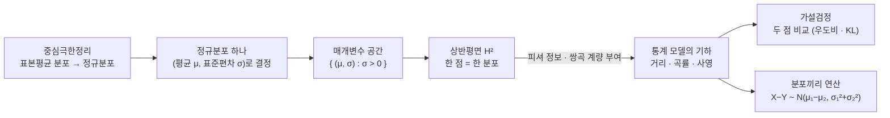

# 상반평면의 구조를 정규분포 집합에 부여하는 방법에 대하여 (뉴진수 17강)

이번 시간에는 중심극한정리에서 정규분포로 들어가고, 정규분포들의 모임을 상반평면처럼 보는 방법을 다룹니다. 마지막에는 분포끼리 더하고 빼는 예시를 통해, 통계 대상이 단순한 숫자가 아니라 연산 가능한 공간처럼 보인다는 감각을 잡습니다.

---

## [0. 중심극한정리 복습: 동전에서 정규분포로 · ▶ 0:14](https://www.youtube.com/watch?v=I-8XtexzUP8&t=14s)

지난 시간의 중심극한정리를 먼저 다시 보았습니다. 동전을 $100$번 던지면 앞면이 $50$번 나오는 근처가 가장 높고, $500$번 던지면 $250$ 근처, $1000$번 던지면 $500$ 근처가 가장 높습니다. 시행 횟수가 많아질수록 막대그래프는 점점 매끄러운 종 모양으로 보입니다.

중요한 점은 동전이 반드시 공정할 필요가 없다는 것입니다. 앞면이 나올 확률을 $0.5$에서 바꾸면 평균 위치는 움직이지만, 많이 반복했을 때 나타나는 모양은 여전히 정규분포에 가까워집니다. 확률이 바뀌면 중심과 폭이 바뀌는 것이지, 큰 표본 평균이 종 모양으로 몰린다는 구조 자체가 사라지는 것은 아닙니다.

이제 동전뿐 아니라 시험 점수, 집값, 볼트의 파손 강도처럼 다양한 분포에서 표본을 뽑아 평균을 내는 상황을 생각할 수 있습니다. 원래 분포가 어떤 모양이든, 충분히 많은 독립 표본의 평균은 정규분포에 가까워진다는 것이 중심극한정리의 직관입니다.

> **💭 생각해볼 점** 중심극한정리는 "모든 원래 분포가 정규분포다"라는 말이 아닙니다. 원래 분포에서 표본을 여러 개 뽑아 평균을 내는 새로운 랜덤 변수를 보면 그 분포가 정규분포에 가까워진다는 말입니다.

## [1. 원래 분포와 샘플 평균 분포를 구분하기 · ▶ 8:29](https://www.youtube.com/watch?v=I-8XtexzUP8&t=509s)

초반 질문은 "왼쪽도 분포이고 오른쪽도 분포라면 무엇이 다른가"였습니다. 예를 들어 집값 분포를 생각해 봅시다. 가로축은 집값이고, 세로축은 그 집값대에 해당하는 세대수나 비율입니다. 이것은 원래 모집단의 분포입니다.

이제 여기서 집을 몇 개씩 랜덤으로 뽑아 평균을 냅니다. 한 번 뽑으면 평균값 하나가 생깁니다. 이 과정을 반복하면 "평균값들"의 히스토그램이 생깁니다. 이 두 번째 히스토그램이 표본평균의 분포입니다.

따라서 CLT에서 정규분포에 가까워진다는 말은 원래 집값 분포가 정규분포로 바뀐다는 뜻이 아닙니다. 표본을 묶어 평균을 내는 새로운 랜덤 변수를 만들었을 때, 그 새 변수의 분포가 종 모양으로 간다는 뜻입니다.

> **💭 생각해볼 점** 원래 분포의 가로축은 "값"이고, 표본평균 분포의 가로축은 "샘플 묶음에서 나온 평균값"입니다. 두 그래프가 모두 히스토그램처럼 보여도, 무엇을 세고 있는지가 다릅니다.

## [2. 분포, 랜덤 변수, 샘플 평균 · ▶ 14:28](https://www.youtube.com/watch?v=I-8XtexzUP8&t=868s)

대화 중에 랜덤 샘플링 자체가 정규분포를 만드는 것처럼 느껴진다는 질문이 나왔습니다. 이 부분은 분포와 랜덤 변수를 구분하면 조금 정리됩니다. 분포는 값들이 어떤 확률로 나오는지의 규칙이고, 랜덤 변수는 그 규칙에 따라 값을 뽑는 대상으로 볼 수 있습니다.

샘플을 하나만 뽑으면 그 값의 분포는 원래 분포와 같습니다. 두 개를 뽑아 평균을 내면 가능한 평균값들의 분포가 새로 생깁니다. 세 개, 열 개, 서른 개로 늘릴수록 이 평균값의 분포가 점점 종 모양에 가까워집니다. 그래서 표본 수가 평균값 분포의 모양을 바꿉니다.

동전 예시에서는 하나의 시행 결과가 $0$ 또는 $1$입니다. 하지만 여러 번 던져서 앞면 비율이나 앞면 개수의 평균을 보면 가능한 값들이 더 촘촘해지고, 충분히 많아지면 매끄러운 곡선처럼 보입니다. 이 곡선이 정규분포의 형태입니다.

## [3. 샘플을 하나만 뽑으면 원래 분포가 그대로 나온다 · ▶ 27:56](https://www.youtube.com/watch?v=I-8XtexzUP8&t=1676s)

여기서 한 번 더 조심해야 합니다. 모집단에서 하나씩만 뽑아 히스토그램을 만들면, 당연히 원래 분포가 그대로 나옵니다. U자형 분포에서 하나씩 뽑으면 U자형이 나오고, 균등분포에서 하나씩 뽑으면 균등분포가 나옵니다.

CLT가 작동하려면 한 번의 관측값이 아니라 여러 관측값의 평균을 봐야 합니다. 예를 들어 50개씩 뽑아 평균을 내고, 다시 50개씩 뽑아 평균을 내는 과정을 반복합니다. 그러면 평균값들의 분포가 원래 분포보다 가운데로 모이기 시작합니다.

이것은 "랜덤 샘플링이 모든 것을 정규분포로 만든다"가 아닙니다. 샘플링 후 어떤 통계량을 만들었는지를 봐야 합니다. 오늘은 그 통계량이 평균인 경우를 보고 있습니다.

## [4. 모든 분포가 정규분포로 간다면 왜 정규분포만 보나 · ▶ 39:12](https://www.youtube.com/watch?v=I-8XtexzUP8&t=2352s)

앞의 논의 뒤에는 자연스러운 질문이 생깁니다. 어차피 표본평균을 보면 많은 경우 정규분포가 나오니, 이제 정규분포만 보면 되는가? 오늘은 그 방향으로 갑니다. 원래 모집단의 모양이 무엇이든, 표본평균을 통해 정규분포가 계속 등장하므로 정규분포의 기하를 살펴보자는 것입니다.

다만 이것도 제한이 있습니다. 중심극한정리에는 독립성, 같은 분포, 적당한 분산 같은 가정이 있습니다. 지난 시간에 말한 파워로 분포처럼 예외적 상황도 있습니다. 그러니 "모든 것이 무조건 정규분포"라고 말하지 않고, 정규분포가 통계에서 반복적으로 등장하는 이유를 확보한 뒤 그 모임을 보겠습니다.

오늘 강의가 흘러온 큰 줄거리를 한눈에 정리하면 다음과 같습니다.

## [5. 정규분포는 평균과 표준편차로 정해진다 · ▶ 40:40](https://www.youtube.com/watch?v=I-8XtexzUP8&t=2440s)

이제부터는 정규분포만 모아 놓고 보겠습니다. 정규분포는 평균 $\mu$와 표준편차 $\sigma>0$로 정해집니다. 확률밀도함수는

$$
P_{\mu,\sigma}(x)=\frac{1}{\sqrt{2\pi}\sigma}
\exp\left(-\frac{(x-\mu)^2}{2\sigma^2}\right)
$$

입니다. 단원 전사본도 이 식을 정규분포의 기본 예시로 둡니다 (→ 전사본 참조).

평균 $\mu$는 종 모양의 중심을 정하고, 표준편차 $\sigma$는 폭을 정합니다. $\sigma$가 작으면 곡선이 좁고 높아지고, $\sigma$가 크면 넓고 낮아집니다. 그래서 정규분포 하나는 점 $(\mu,\sigma)$ 하나와 대응합니다.

여기서 정규분포는 두 방식으로 읽힙니다.
하나는 $x$를 넣으면 밀도값을 돌려주는 함수 $P_{\mu,\sigma}:\mathbb R\to\mathbb R$입니다.
다른 하나는 $(\mu,\sigma)$라는 매개변수로 정해지는 통계 모델 공간의 한 점입니다.
통계의 기하는 이 두 관점을 함께 씁니다. 함수들의 모임을 하나의 공간으로 보고, 그 공간 위에 거리와 계량을 주려는 것입니다.

이제 모든 정규분포의 모임을 생각하면

$$
S=\{P_{\mu,\sigma}:\mu\in\mathbb R,\ \sigma>0\}
$$

입니다. $\sigma$가 양수여야 하므로 매개변수 공간은 $\{(\mu,\sigma):\sigma>0\}$, 즉 상반평면과 같습니다.

## [6. 정규분포의 모임을 상반평면으로 보기 · ▶ 41:19](https://www.youtube.com/watch?v=I-8XtexzUP8&t=2479s)

각 점 $(\mu,\sigma)$마다 정규분포 하나가 대응합니다. 왼쪽에는 여러 종 모양 곡선들이 있고, 오른쪽에는 상반평면 위의 점들이 있다고 생각하면 됩니다. 한 점은 단순한 좌표가 아니라 "그 평균과 표준편차를 가진 분포"입니다.

단원 전사본은 이 대응을 정규분포들의 집합 $S$와 상반평면 $\mathbb H^2$의 일대일 대응으로 설명합니다 (→ 전사본 참조). 여기서 상반평면을 단지 점들의 집합으로만 보지 않습니다. 그 위에 어떤 내적, 거리, 곡률 구조를 줄 것인지가 다음 문제입니다.

유클리드 평면에서는 같은 길이로 보이는 이동이 정규분포의 의미에서는 같은 크기의 변화가 아닐 수 있습니다. $\sigma$가 작은 곳에서 평균을 조금 움직이는 것과, $\sigma$가 큰 곳에서 평균을 같은 만큼 움직이는 것은 분포의 겹침 정도가 다릅니다. 그래서 매개변수 평면에 단순한 평면 거리 대신 통계적으로 자연스러운 거리를 주고 싶어집니다.

> **💭 생각해볼 점** $(\mu,\sigma)$ 평면에서 같은 좌표 거리만큼 움직였다고 해서, 두 정규분포가 같은 정도로 달라졌다고 말할 수 있을까요? 이 질문이 통계 모델의 기하를 만드는 출발점입니다.

## [7. 접평면의 막대 길이가 달라지는 그림 · ▶ 47:19](https://www.youtube.com/watch?v=I-8XtexzUP8&t=2839s)

상반평면의 계량을 설명할 때, 한 점에서 접평면을 그리고 그 위의 기준 벡터 길이를 생각했습니다. 눈으로 보면 같은 $(1,0)$ 벡터처럼 보이지만, 계량이 $\sigma$에 따라 달라지면 그 길이는 달라집니다.

$\sigma$가 작아지는 아래쪽으로 내려갈수록 같은 좌표 이동이 더 길게 계산됩니다. 그래서 아래쪽 경계에 가까운 곳에서는 막대 길이가 길어지는 것처럼 그릴 수 있습니다. 반대로 $\sigma$가 커지는 위쪽에서는 같은 좌표 이동이 상대적으로 짧게 느껴집니다.

정규분포로 읽으면 이 그림이 자연스럽습니다. 분포가 매우 뾰족하면 평균을 조금만 움직여도 두 분포가 거의 겹치지 않을 수 있습니다. 분포가 넓으면 같은 평균 이동도 덜 민감합니다.

## [8. 상반평면의 거리 감각 · ▶ 49:18](https://www.youtube.com/watch?v=I-8XtexzUP8&t=2958s)

상반평면의 기하를 이해하려면 유클리드 거리 감각을 잠시 내려놓아야 합니다. 상반평면의 표준 쌍곡 계량은 보통

$$
\frac{1}{\sigma^2}
\begin{pmatrix}
1&0\\
0&1
\end{pmatrix}
$$

처럼 씁니다. 단원 전사본도 상반평면의 계량을 이 형태로 소개합니다 (→ 전사본 참조).

이 식은 $\sigma$가 작아질수록 같은 좌표 변화가 더 큰 거리로 계산된다는 뜻입니다. 그림으로 보면 아래쪽 경계에 가까워질수록 거리 구조가 크게 늘어납니다. 그래서 유클리드 눈으로 같은 간격처럼 보여도, 상반평면 기하에서는 전혀 같은 간격이 아닐 수 있습니다.

이것을 정규분포에 붙이면 자연스럽습니다. 표준편차가 작아 분포가 좁을 때는 평균을 조금만 움직여도 분포가 크게 달라집니다. 반대로 표준편차가 큰 분포에서는 같은 평균 변화가 상대적으로 덜 크게 느껴질 수 있습니다.

## [9. 피셔 정보와 통계의 기하 · ▶ 1:12:15](https://www.youtube.com/watch?v=I-8XtexzUP8&t=4335s)

단원 전사본의 더 깊은 부분에서는 KL 발산을 두 번 미분하면 피셔 정보 행렬이 나오고, 정규분포의 경우 이것이 상반평면의 쌍곡 계량과 맞아떨어진다고 설명합니다 (→ 전사본 참조). 오늘 영상에서는 이 결과를 완전히 계산하지는 않았지만, 왜 그런 방향으로 가는지의 그림을 유지했습니다.

피셔 정보는 매개변수를 조금 바꿨을 때 분포가 얼마나 민감하게 바뀌는지를 측정합니다. 그러니 이것을 매개변수 공간의 내적처럼 보면 자연스럽습니다. 정규분포들의 공간에서 이 내적이 상반평면의 기하와 연결된다는 점이 통계 속의 기하입니다.

이 관점에서는 통계가 단순히 평균과 분산을 계산하는 기술이 아닙니다. 확률분포들의 모임을 공간으로 보고, 그 공간 위에서 거리, 사영, 최단경로, 곡률을 묻는 기하가 됩니다.

## [10. 상반평면이라고 해서 자동으로 음의 곡률은 아니다 · ▶ 1:21:48](https://www.youtube.com/watch?v=I-8XtexzUP8&t=4908s)

중간 질문은 "상반평면이면 가우스 곡률이 자동으로 음의 상수인가"였습니다. 답은 아닙니다. 상반평면이라는 말만으로는 점집합만 정한 것입니다. 그 위에 어떤 내적, 즉 어떤 계량을 주느냐에 따라 곡률이 달라집니다.

유클리드 계량을 주면 그냥 반평면이고 곡률은 $0$입니다. 쌍곡 계량을 주면 음의 상수 곡률을 갖는 상반평면 모델이 됩니다. 정규분포의 모임이 상반평면처럼 보인다는 말도, 단순한 좌표 대응만으로 끝나지 않고 피셔 정보 같은 자연스러운 계량을 주어야 기하적 의미가 생깁니다.

> **💭 생각해볼 점** "상반평면"이라는 단어가 집합을 뜻하는지, 쌍곡계량까지 포함한 기하적 모델을 뜻하는지 매번 구분해야 합니다.

## [11. 가설검정과 정규분포 공간 · ▶ 1:25:06](https://www.youtube.com/watch?v=I-8XtexzUP8&t=5106s)

중간에는 가설검정 예시로 돌아왔습니다. 작년 신입사원의 평균 월급이 $150$만 원이었다고 하고, 올해 조사한 $100$명의 평균이 $153$만 원이라고 합시다. 이때 여전히 평균이 $150$만 원인 분포에서 나온 것인지, 아니면 평균이 $155$만 원 정도로 올라간 분포에서 나온 것인지 비교하고 싶습니다.

이 질문은 두 정규분포를 비교하는 문제입니다. 하나는 $P_{\theta_0}$, 다른 하나는 $P_{\theta_1}$입니다. 관측된 표본 평균이 어느 분포에서 더 그럴듯한지를 따지려면 우도비나 KL 발산 같은 도구가 등장합니다.

단원 전사본은 우도비 검정과 KL 발산의 연결을 다룹니다. KL 발산은 두 확률밀도 $P,g$에 대해

$$
\mathrm{KL}(P\|g)=\int P(x)\log\frac{P(x)}{g(x)}\,dx
$$

로 정의됩니다 (→ 전사본 참조). 이것은 거리와 비슷하게 두 분포의 차이를 재지만, 대칭성이나 삼각부등식을 만족하지 않으므로 진짜 거리는 아닙니다.

오늘 영상에서는 KL 발산의 계산을 자세히 밀기보다, 정규분포들의 모임을 하나의 공간으로 본다는 감각을 잡는 데 더 많은 시간을 썼습니다. 이 공간 위에서 "어느 분포가 더 가까운가"를 묻는 것이 정보기하의 시작입니다.

## [12. 가설검정은 정규분포 공간에서 점을 고르는 문제다 · ▶ 1:31:18](https://www.youtube.com/watch?v=I-8XtexzUP8&t=5478s)

가설검정 예시를 정규분포 공간으로 다시 읽어 봅시다. $P_{\theta_0}$와 $P_{\theta_1}$는 각각 하나의 분포이고, 정규분포만 모아 둔 공간에서는 각각 하나의 점입니다. 데이터를 보고 어느 점이 더 그럴듯한지 고르는 문제가 됩니다.

우도비는 관측값들이 한 분포에서 나왔을 가능성과 다른 분포에서 나왔을 가능성을 비교합니다. KL 발산은 두 분포 사이의 차이를 다른 방식으로 재는 도구입니다. 둘 다 "숫자 하나"를 계산하지만, 기하적으로는 분포 공간 위에서 가까움과 멂을 묻는 일로 해석할 수 있습니다.

이렇게 보면 통계의 계산이 기하적 언어를 얻습니다. 평균과 표준편차를 좌표로 쓰고, 피셔 정보로 내적을 주고, KL 발산으로 차이를 재면, 분포들의 모임이 계산 가능한 공간으로 바뀝니다.

## [13. 분포끼리 연산하기: 볼트와 키 차이 예시 · ▶ 1:37:10](https://www.youtube.com/watch?v=I-8XtexzUP8&t=5830s)

마지막에는 분포끼리 연산할 수 있다는 감각을 보았습니다. 정규분포를 갖는 랜덤 변수 $X$와 또 다른 정규분포를 갖는 랜덤 변수 $Y$를 생각합니다. 그러면 $X+Y$나 $X-Y$도 새로운 랜덤 변수이고, 그 분포를 물을 수 있습니다.

볼트 예시에서는 볼트가 부러지는 힘의 분포와 실제 조이는 힘의 분포를 생각했습니다. 안전하려면 "부러지는 힘 - 조이는 힘"이 양수일 확률이 충분히 커야 합니다. 그러려면 두 분포에서 각각 값을 하나씩 뽑아 차이를 보는 새 분포가 필요합니다.

이 예시를 더 익숙하게 바꾸면 남자 키와 여자 키의 분포를 생각할 수 있습니다. 남자 한 명과 여자 한 명을 무작위로 뽑아 키 차이 $X-Y$를 보면, 이 차이 자체가 또 하나의 랜덤 변수입니다. 두 정규분포가

$$
X\sim N(\mu_1,\sigma_1^2),\qquad
Y\sim N(\mu_2,\sigma_2^2)
$$

라면 독립일 때 $X-Y$는 평균 $\mu_1-\mu_2$, 분산 $\sigma_1^2+\sigma_2^2$인 정규분포가 됩니다.

이 계산은 오늘의 큰 주제와 잘 맞습니다. 분포는 하나의 곡선 그림이지만, 동시에 더하고 빼고 비교할 수 있는 대상입니다. 이런 연산과 비교가 모이면 통계 모델의 공간이라는 관점이 자연스러워집니다.

영상에서 이어진 질문을 조금 더 자세히 남깁니다.

- 처음에는 지난 시간의 CLT를 다시 잡았습니다.
- 왼쪽 그래프가 모집단 분포인지, 오른쪽 그래프가 표본평균 분포인지 구분해야 했습니다.
- 집값 예시에서는 가로축이 집값이고 세로축이 세대수입니다.
- 여기서 하나씩만 뽑으면 원래 집값 분포가 그대로 나타납니다.
- 여러 개를 뽑아 평균을 내고, 그 평균값을 반복해서 모으면 새 분포가 생깁니다.
- CLT는 이 새 분포에 대한 말입니다.
- 그래서 원래 분포 안에 정규분포가 숨어 있다는 말이 아닙니다.
- 랜덤 샘플링 자체가 아니라 "평균을 만든다"는 통계량이 작동합니다.
- 원래 분포가 균등분포이든 U자형이든, 평균값 분포는 가운데로 모일 수 있습니다.
- 정규분포만 보자는 말은 이런 이유로 나옵니다.
- 정규분포 하나는 평균 $\mu$와 표준편차 $\sigma$로 정해집니다.
- $\mu$는 중심을 움직이고, $\sigma$는 폭을 바꿉니다.
- $\sigma$가 $0$이면 분포가 아니므로 $\sigma>0$이 필요합니다.
- 그래서 $(\mu,\sigma)$의 공간은 상반평면입니다.
- 각 점은 그냥 좌표가 아니라 하나의 정규분포입니다.
- 같은 좌표 거리만큼 움직여도 분포가 같은 정도로 변하지 않을 수 있습니다.
- $\sigma$가 작은 곳에서는 평균을 조금만 움직여도 겹침이 크게 줄어듭니다.
- $\sigma$가 큰 곳에서는 같은 평균 이동이 덜 크게 느껴집니다.
- 이 감각이 상반평면 계량 그림과 연결됩니다.
- 상반평면이라는 점집합만으로 곡률이 정해지지는 않습니다.
- 피셔 정보 같은 계량을 주어야 통계 모델의 기하가 생깁니다.
- 가설검정은 이 분포 공간 안에서 두 후보 분포를 비교하는 문제로 읽을 수 있습니다.
- 우도비는 관측된 데이터가 어느 후보에서 더 그럴듯한지 묻습니다.
- KL 발산은 두 분포 사이의 차이를 비대칭적인 방식으로 잽니다.
- 볼트 예시에서는 부러지는 힘의 분포와 실제 조이는 힘의 분포를 비교했습니다.
- 안전 여부는 두 랜덤 변수의 차이 $X-Y$가 양수일 확률로 바뀝니다.
- 키 차이 예시도 같은 구조입니다.
- 정규 랜덤 변수의 차이가 다시 정규분포가 되는 점은 분포들의 연산 감각을 줍니다.

## 요약

- 중심극한정리는 원래 분포가 무엇이든 충분히 많은 독립 표본의 평균 분포가 정규분포에 가까워진다는 직관을 준다.
- 샘플 하나의 분포는 원래 분포와 같지만, 여러 샘플의 평균이라는 새 랜덤 변수의 분포는 표본 수가 늘수록 종 모양으로 가까워진다.
- 정규분포 $P_{\mu,\sigma}(x)=\frac{1}{\sqrt{2\pi}\sigma}\exp(-\frac{(x-\mu)^2}{2\sigma^2})$는 평균 $\mu$와 표준편차 $\sigma>0$로 결정된다 (→ 전사본 참조).
- 정규분포 하나는 $x$에 밀도값을 주는 함수이면서, 동시에 $(\mu,\sigma)$로 매개화된 모델 공간의 한 점이다.
- 모든 정규분포의 모임은 $S=\{P_{\mu,\sigma}:\mu\in\mathbb R,\sigma>0\}$이고, 이는 상반평면 $\mathbb H^2$와 일대일 대응한다 (→ 전사본 참조).
- 상반평면의 쌍곡 계량 $\frac1{\sigma^2}\begin{pmatrix}1&0\\0&1\end{pmatrix}$은 $\sigma$가 작을수록 같은 좌표 변화가 더 크게 느껴지는 구조를 준다 (→ 전사본 참조).
- KL 발산은 두 분포의 차이를 재는 도구이며, 우도비 검정과 연결된다. 대칭적 거리는 아니지만 통계 모델의 기하를 만드는 출발점이다 (→ 전사본 참조).
- 피셔 정보 행렬은 분포가 매개변수 변화에 얼마나 민감한지 측정하며, 정규분포 모임에서는 상반평면의 계량과 연결된다.
- 정규분포를 갖는 랜덤 변수들의 차이 $X-Y$도 정규분포가 되며, 평균은 $\mu_1-\mu_2$, 분산은 $\sigma_1^2+\sigma_2^2$로 계산된다.
