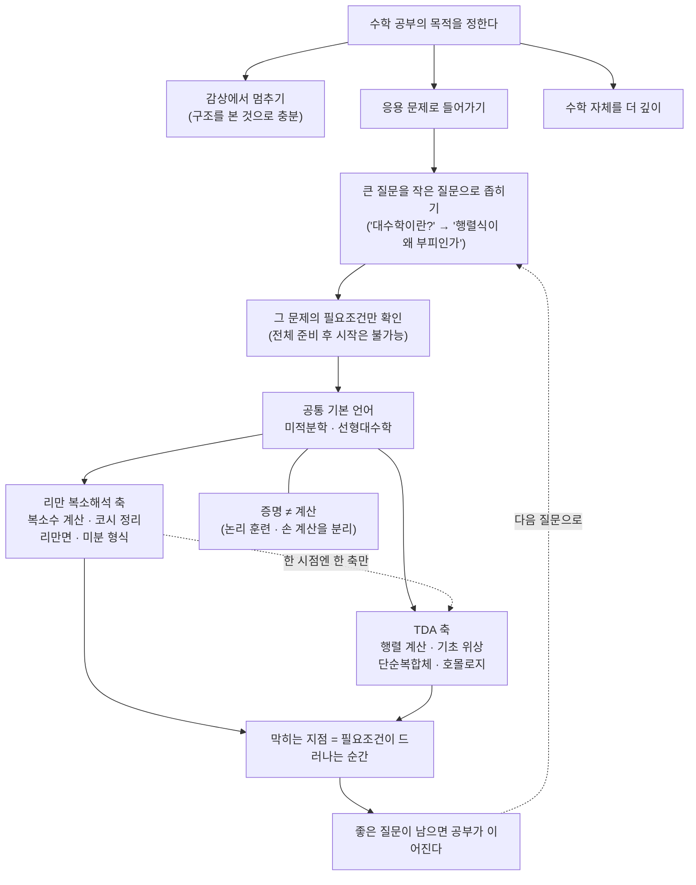

# 뉴진수에 대한 소감과 이후 각자의 수학 공부 방향성 (뉴진수 18강)

이번 시간은 새 정리를 배우는 강의가 아니라, 직문수 3기와 뉴진수를 지나온 뒤 각자가 수학을 어떻게 계속 공부할지 점검하는 시간입니다. 저는 미적분학과 선형대수학을 감상하는 데서 끝낼지, 아니면 각자의 목적에 맞춰 더 들어갈지에 따라 공부 전략이 달라진다고 보고 이야기하겠습니다.

---

## [0. 직문수의 목적을 다시 세우기 · ▶ 2:43](https://www.youtube.com/watch?v=5Jjsib07zYY&t=163s)

직문수의 목적을 먼저 분명히 하겠습니다. 제가 이 과정을 만들 때 생각한 것은, 일반적인 배경을 가진 여러분이 미적분학과 선형대수학을 정말로 감상할 수 있게 하는 것이었습니다. 단순히 공식을 암기하는 것이 아니라, 현대 수학과 응용 안에서 이 두 언어가 왜 계속 등장하는지 보는 것이었습니다.

여기서 "감상"은 가볍게 훑는다는 뜻이 아닙니다. 어떤 체계 안에서 미적분학과 선형대수학이 어떤 역할을 하는지, 그리고 그 언어가 통계, 물리, 기하, 대수 같은 분야로 어떻게 이어지는지 보는 일입니다. 직문수 노트들이 넓은 주제를 다룬 이유도 여기에 있습니다.

다만 여기서 멈춰도 됩니다. 직문수를 통해 "수학이 이런 구조를 갖고 있구나"를 보는 것만으로 충분한 사람도 있습니다. 반대로 어떤 목적이 생겼다면, 이제부터는 더 구체적인 필요조건을 확인하면서 공부해야 합니다.

> **💭 생각해볼 점** 내가 원하는 것은 수학을 감상하는 것인가, 특정 응용 문제를 수학적으로 다루는 것인가, 아니면 수학 자체를 더 깊이 공부하는 것인가요? 목적이 달라지면 필요한 공부도 달라집니다.

## [1. 아주 큰 질문을 작게 쪼개기 · ▶ 5:31](https://www.youtube.com/watch?v=5Jjsib07zYY&t=331s)

처음 나온 질문은 "대수학에 대한 아주 큰 질문"처럼 시작했습니다. 저는 이런 질문을 바로 전공 전체의 역사로 밀고 가기보다, 지금 여러분이 붙들 수 있는 작은 질문으로 쪼개야 한다고 보았습니다. 예를 들어 미적분학과 선형대수학이 어디서 만나는지, 어떤 개념이 다음 단원의 언어가 되는지부터 봅니다.

큰 질문은 나쁘지 않습니다. 다만 너무 큰 질문은 답도 너무 커져서 공부로 이어지지 않습니다. "대수학이 무엇인가"보다 "행렬식의 대수적 정의가 왜 기하적 부피와 연결되는가"가 더 좋은 출발점일 수 있습니다.

직문수와 뉴진수에서 반복한 방식도 이와 같습니다. 정의 하나, 예시 하나, 질문 하나를 놓고 거기서 필요한 미적분학과 선형대수학을 다시 불러옵니다. 그러면 거대한 수학 분야가 막연한 이름이 아니라 구체 문제의 배경으로 보입니다.

## [2. 수학적 언어의 장벽 · ▶ 11:50](https://www.youtube.com/watch?v=5Jjsib07zYY&t=710s)

수학을 다시 시작할 때 가장 먼저 부딪히는 것은 문과냐 이과냐의 문제가 아닙니다. 수학적 언어가 낯설다는 문제입니다. 고등학교 때 수학을 잘했더라도, 대학 이후의 수학은 정의, 명제, 증명, 예시를 다른 방식으로 사용합니다.

수학 전공의 언어는 매우 엄격합니다. 명제가 맞다는 것은 대충 맞는다는 뜻이 아니라, 논리상 빈틈이 없다는 뜻입니다. 공학이나 데이터 분석에서는 작동하는 모델이 먼저일 때가 많지만, 수학에서는 한 줄의 논리 오류도 전체 주장을 무너뜨릴 수 있습니다.

그래서 수학을 공부할 때는 계산 훈련과 언어 훈련을 구분해야 합니다. 계산은 손이 익어야 하고, 언어는 정의가 무엇을 허용하고 무엇을 금지하는지 알아야 합니다. 둘 중 하나만으로는 오래 버티기 어렵습니다.

> **💭 생각해볼 점** "나는 이 내용을 안다"는 말을 계산할 수 있다는 뜻으로 쓰는지, 정의를 정확히 말할 수 있다는 뜻으로 쓰는지, 증명할 수 있다는 뜻으로 쓰는지 구분해 보세요.

## [3. 모든 것을 준비한 뒤 시작할 수는 없다 · ▶ 15:31](https://www.youtube.com/watch?v=5Jjsib07zYY&t=931s)

많은 분들이 "무엇을 얼마나 언제까지 공부해야 다음으로 갈 수 있느냐"를 묻습니다. 저는 이 질문을 필요조건의 문제로 보겠습니다. 어떤 분야에 들어가려면 필요한 계산과 정의가 있습니다. 하지만 그 모든 것을 완벽히 준비한 뒤 시작하려 하면 거의 시작하지 못합니다.

수학은 문제를 풀면서 언어를 배웁니다. 특정 문제를 잡고, 그 문제를 이해하는 데 필요한 정의와 계산을 끌어오고, 막히는 지점을 다시 공부하는 방식이 필요합니다. 책의 모든 연습문제를 순서대로 끝낸 다음에야 응용으로 넘어갈 수 있는 것은 아닙니다.

다만 "아무렇게나 뛰어들어도 된다"는 뜻도 아닙니다. 내가 풀고 싶은 문제가 요구하는 최소한의 미적분학, 선형대수학, 확률, 위상 등의 필요조건은 확인해야 합니다. 그 조건을 확인하지 않으면, 모르는 것이 무엇인지조차 모르는 상태가 됩니다.

> **💭 생각해볼 점** 지금 내가 붙들고 싶은 문제는 무엇인가요? 그 문제를 읽는 데 필요한 정의와 계산은 무엇인가요? "수학 전체"가 아니라 "이 문제의 필요조건"으로 좁혀 보세요.

## [4. 미적분학과 선형대수학은 기본 언어다 · ▶ 21:42](https://www.youtube.com/watch?v=5Jjsib07zYY&t=1302s)

통계학이든 물리학이든 기계학습이든, 고전적인 의미의 미적분학과 선형대수학을 피하기는 어렵습니다. 통계에서는 확률밀도, 기대값, 분산, 최적화, 우도, 정보량이 모두 미적분과 연결됩니다. 선형대수는 데이터, 벡터공간, 행렬, 내적, 고유값, 분해의 언어를 제공합니다.

여기서 말하는 기본 언어는 "전공 교과서를 모두 끝내라"는 뜻이 아닙니다. 적어도 계산 레벨에서 일변수 미적분을 다룰 수 있고, 다변수 미적분의 그래디언트와 선적분 같은 기본 구조를 알아야 하며, 선형대수의 행렬·내적·고유값 언어를 읽을 수 있어야 한다는 뜻입니다.

함수의 언어도 여기에 포함됩니다.
통계에서는 확률밀도함수가 데이터를 설명하고, 최적화에서는 목적함수와 제약함수가 해를 정하며, 기계학습에서는 모델이 입력을 출력으로 보내는 함수로 나타납니다.
선형대수는 이런 함수들이 벡터공간, 내적, 행렬 같은 구조 위에서 어떻게 계산되는지를 알려 줍니다.

어떤 응용 분야에 들어가면 새로운 단어들이 계속 나옵니다. 확률 미적분학, 정보기하, 위상자료분석, 통계물리 같은 단어들이 그렇습니다. 이때 완전히 새 세계라고 보기보다, 미적분학과 선형대수학이 어떤 식으로 변형되어 쓰이는지 보는 편이 좋습니다.

## [5. 증명과 계산을 섞지 않기 · ▶ 23:40](https://www.youtube.com/watch?v=5Jjsib07zYY&t=1420s)

수학에서 증명은 논리상 오류가 없도록 기술하는 일입니다. 계산은 특정 값을 구하거나 특정 예시를 다루는 일입니다. 둘은 연결되어 있지만 같은 활동은 아닙니다. 공부할 때 이 둘을 섞으면 내가 무엇을 못하는지 흐려집니다.

예를 들어 일변수 미적분학 문제를 계산하는 훈련이 부족하다면, 먼저 계산을 해야 합니다. 극한, 미분, 적분, 테일러 전개가 손에 익어야 합니다. 반대로 계산은 되는데 왜 그 정리가 참인지 모르겠다면, 정의와 증명 구조를 봐야 합니다.

한 주에 한 문제만 제대로 붙드는 방식도 좋은 방법입니다. 문제 하나를 정하고, 필요한 정의를 확인하고, 계산을 끝까지 밀고, 왜 그 풀이가 논리적으로 맞는지 써 보는 것입니다. 이 과정을 반복하면 수학적 언어와 계산 감각이 같이 자랍니다.

> **✏️ 연습문제** 앞으로 공부할 주제에서 한 문제를 고르세요. 그 문제에 필요한 정의를 세 개 이하로 적고, 실제 계산을 끝까지 해 본 뒤, 풀이가 왜 맞는지 문장으로 설명해 보세요.

## [6. 증명은 명제가 맞는 이유를 업데이트한다 · ▶ 24:07](https://www.youtube.com/watch?v=5Jjsib07zYY&t=1447s)

증명 이야기는 단순히 전공자처럼 쓰자는 말이 아닙니다. 참인 명제는 왜 참인지, 틀린 명제는 어디서 반례가 생기는지 확인하는 활동입니다. 어떤 명제를 증명해 보면, 그 명제에서 실제로 쓰인 가정이 무엇인지 드러납니다.

예를 들어 지수법칙을 증명하라고 하면 처음에는 당연한 공식처럼 느껴질 수 있습니다. 하지만 어떤 수 체계에서, 어떤 정의로 지수를 만들었는지에 따라 증명 방식이 달라집니다. 증명은 이미 아는 공식을 더 권위 있게 만드는 절차가 아니라, 내가 쓰는 언어의 조건을 확인하는 절차입니다.

그래서 계산 문제를 푸는 것과 증명 문제를 푸는 것은 다른 훈련입니다. 계산은 결과를 내는 데 초점이 있고, 증명은 왜 그 결과가 필연적으로 따라오는지 문장으로 묶는 데 초점이 있습니다.

## [7. 기대수학처럼 공부한다는 것 · ▶ 47:59](https://www.youtube.com/watch?v=5Jjsib07zYY&t=2879s)

수학을 가장 많이 배운 순간이 언제였는지 돌아보면, 수업을 준비하거나 누군가에게 설명해야 했던 때가 많습니다. 그냥 읽을 때보다, 질문을 예상하고 예시를 고르고 계산을 확인할 때 이해가 깊어집니다.

기대수학이나 직문수의 방식도 비슷했습니다. 하나의 주제를 잡고, 그 주제가 왜 필요한지, 어떤 전제 위에 서 있는지, 어떤 예시에서 무너지는지 계속 확인했습니다. 이런 방식은 전공 과목을 처음부터 끝까지 따라가는 것과 다르지만, 성실한 공부입니다.

여러분이 앞으로 혼자 공부할 때도 "내가 이 내용을 설명해야 한다면 어떤 예시를 들 것인가"를 물어보면 좋습니다. 설명 가능한 예시가 없으면 아직 개념이 손에 들어오지 않은 것입니다.

## [8. 응용 분야에 들어가는 법 · ▶ 51:46](https://www.youtube.com/watch?v=5Jjsib07zYY&t=3106s)

응용 맥락에서 수학을 공부하는 분들은 대개 확률론, 통계학, 기계학습, 물리, TDA 같은 단어를 만납니다. 이때 중요한 것은 유행하는 단어를 먼저 따라가는 것이 아니라, 그 단어가 내 문제에서 어떤 역할을 하는지 묻는 것입니다.

예를 들어 TDA에 관심이 있다면 "위상수학 전체를 공부해야 한다"로 바로 뛰지 않아도 됩니다. TDA에서 실제로 쓰이는 단순복합체, 호몰로지, 코호몰로지, 거리자료, 필트레이션 같은 단어들이 무엇을 하려는지 보면 됩니다. 그 다음에 필요한 만큼 위상수학과 선형대수학을 보강합니다.

통계물리나 확률 미적분학도 마찬가지입니다. 랜덤 변수를 다루는 미적분학이 왜 필요한지, 기존의 미적분학으로는 무엇이 부족한지, 그래서 어떤 정의가 새로 등장하는지를 봐야 합니다. 추상화는 공중에 떠 있는 것이 아니라 문제의 필요에서 나옵니다.

## [9. "무엇을 알면 되느냐"는 질문의 위험 · ▶ 1:02:25](https://www.youtube.com/watch?v=5Jjsib07zYY&t=3745s)

앞으로 무엇을 공부해야 하느냐고 물으면, 쉽게 "이 과목들을 다 하세요"라고 답할 수 있습니다. 하지만 그 답은 실제로는 별 도움이 안 될 때가 많습니다. 대수학, 위상수학, 해석학을 다 하라는 말은 맞을 수 있지만, 너무 넓어서 오늘 책상 위의 공부로 내려오지 않습니다.

반대로 "필요한 것만 하세요"도 위험합니다. 내가 무엇이 필요한지 모르면 필요한 것만 골라낼 수 없습니다. 그래서 기준은 관심 문제를 좁히고, 그 문제를 읽는 데 막히는 정의와 계산을 하나씩 확인하는 것입니다.

예를 들어 리만의 복소해석을 공부하고 싶다면 복소수 계산, 코시 적분정리, 경로와 폐곡선, 미분 형식, 기본 위상 언어가 차례로 필요해집니다. TDA를 공부하고 싶다면 선형대수의 행렬 계산과 위상수학의 기초 언어가 필요합니다. 문제를 정하면 필요조건이 조금씩 구체화됩니다.

## [10. 수학 커뮤니케이션과 대중성의 문제 · ▶ 1:14:34](https://www.youtube.com/watch?v=5Jjsib07zYY&t=4474s)

중간에는 수학을 어떻게 전달할 것인가에 대한 이야기도 있었습니다. 수학은 많은 사람에게 도움이 되지만, 동시에 아주 적은 사람만 깊게 들어가는 구조를 갖고 있습니다. 이것이 누가 더 똑똑하다는 문제가 아니라, 수학의 언어와 필요조건이 실제로 무겁기 때문입니다.

그래서 수학 커뮤니케이션은 단순히 쉽게 말하는 문제가 아닙니다. 무엇을 생략해도 되는지, 무엇을 생략하면 오히려 왜곡되는지 판단해야 합니다. 직문수도 대중 수학과 전공 수학 사이 어딘가에 놓여 있었고, 그 균형을 계속 조정해야 합니다.

여러분 입장에서는 이 점을 부담으로만 느끼지 않아도 됩니다. 내가 전공자가 되려는 것이 아니라면, 전공자의 모든 경로를 그대로 따라갈 필요는 없습니다. 다만 내가 관심 있는 문제를 이해하는 데 필요한 언어는 성실하게 익혀야 합니다.

## [11. 질문이 생기면 공부가 이어진다 · ▶ 1:22:57](https://www.youtube.com/watch?v=5Jjsib07zYY&t=4977s)

대수학을 듣고 나서 "지식적으로 뭐가 남느냐"라는 질문도 나왔습니다. 당장 모든 정리가 남지 않아도, 좋은 질문이 남으면 공부는 이어집니다. 가우스가 무엇을 했는지, 리만이 무엇을 했는지, 왜 복소해석에서 위상수학이 나오는지 같은 질문이 다음 공부를 밀어 줍니다.

질문조차 생기지 않는 상태와, 질문은 있는데 답을 모르는 상태는 다릅니다. 후자는 이미 공부가 작동하고 있는 상태입니다. 모르는 것을 정확히 말할 수 있으면, 어떤 정의를 다시 봐야 하는지, 어떤 계산을 해 봐야 하는지 정할 수 있습니다.

직문수의 긴 흐름도 결국 질문을 만드는 데 목적이 있었습니다. 미적분학과 선형대수학을 감상한 뒤, 각자 자기 문제에서 어떤 질문을 꺼낼 수 있는지가 다음 단계입니다.

## [12. 각자의 다음 공부를 정하는 기준 · ▶ 1:49:31](https://www.youtube.com/watch?v=5Jjsib07zYY&t=6571s)

이후의 공부가 이상적으로 흘러가려면, 각자의 관심 문제를 중심에 놓아야 합니다. 수학자가 되기 위한 표준 테크트리를 그대로 따라가는 것이 항상 좋은 답은 아닙니다. 특히 직장인과 문과생이 수학을 공부할 때는 시간과 목적이 다르기 때문에, "필요한 것부터 정확히"라는 기준을 먼저 세워야 합니다.

하지만 필요한 것만 골라 먹는다는 말도 조심해야 합니다. 어떤 개념은 바로 응용에 쓰이지 않아도, 다음 개념을 이해하는 데 필요한 언어가 됩니다. 예를 들어 코호몰로지나 위상수학의 단어는 TDA에서 갑자기 등장하지만, 그 뒤에는 선형대수와 기초 위상의 언어가 있습니다.

저는 여러분이 "내가 지금 하는 일에 수학을 붙이면 무엇이 더 명료해지는가"를 계속 묻기를 바랍니다. 경제, 통계, 물리, 데이터, 철학 어느 쪽이든 상관없습니다. 질문이 구체적이면 필요한 공부도 구체화됩니다.

> **📚 참고·응용** TDA를 공부하고 싶다면 선형대수의 벡터공간·행렬·랭크, 기초 위상의 열린집합·연속성, 그리고 단순복합체와 호몰로지의 계산 예시를 먼저 붙드는 식이 현실적입니다. 전공 과목 전체를 순서대로 끝내는 경로만 있는 것은 아닙니다.

## [13. 리만 복소해석과 TDA는 같은 해에 다 하기 어렵다 · ▶ 2:06:03](https://www.youtube.com/watch?v=5Jjsib07zYY&t=7563s)

구체적인 공부 계획으로는 우선순위를 정해야 합니다. 리만의 복소해석을 제대로 공부하는 것과 TDA를 동시에 깊게 공부하는 것은 현실적으로 쉽지 않습니다. 둘 다 선형대수학과 미적분학을 요구하지만, 추가로 필요한 언어가 다릅니다.

리만 복소해석 쪽으로 가려면 복소함수론, 경로적분, 리만면, 미분 형식, 기본 위상이 필요합니다. TDA 쪽으로 가려면 단순복합체, 호몰로지, 행렬 계산, 거리자료와 필트레이션을 잡아야 합니다. 겹치는 기초는 있지만, 중간 이후의 길은 갈라집니다.

그래서 "둘 다 관심 있다"는 말은 출발점으로 좋지만, 실제 공부에서는 한 시점에 하나의 축을 정하는 편이 낫습니다. 다른 축은 배경 질문으로 남겨두고, 지금 필요한 계산과 정의를 먼저 끝까지 밀어 봅니다.

## [14. 선형대수는 논리와 계산 양쪽에서 다시 봐야 한다 · ▶ 2:08:43](https://www.youtube.com/watch?v=5Jjsib07zYY&t=7723s)

마지막 공부 조언 중 하나는 선형대수학입니다. 선형대수는 계산 레벨에서 행렬, 랭크, 고유값, 기저변환을 다룰 줄 알아야 합니다. 동시에 논리적 정합성의 레벨에서는 벡터공간, 선형사상, 쌍대공간, 몫공간 같은 정의를 읽을 수 있어야 합니다.

응용을 하려는 분에게도 계산만으로 충분하지 않은 순간이 옵니다. 예를 들어 TDA에서 경계연산자를 행렬로 놓고 커널과 이미지를 계산할 때, 실제로는 선형대수의 구조를 쓰고 있습니다. 계산은 행렬 소거법으로 하지만, 의미는 벡터공간의 사상과 몫에 있습니다.

따라서 선형대수학을 다시 본다면 문제풀이와 정의 읽기를 분리해 훈련하는 것이 좋습니다. 한쪽은 손으로 계산하고, 다른 한쪽은 왜 그 계산이 해당 구조를 표현하는지 문장으로 설명합니다.

## [15. 마무리: 즐겁게, 그러나 기준을 가지고 · ▶ 2:25:02](https://www.youtube.com/watch?v=5Jjsib07zYY&t=8702s)

마지막에는 이후에도 미적분학 스터디나 다른 형태의 공부가 이어질 수 있다는 이야기가 나왔습니다. 저는 여러분이 계속 즐겁게 공부했으면 합니다. 다만 즐거움이 막연한 감상에만 머물지 않으려면, 적어도 내가 무엇을 이해했고 무엇을 아직 계산하지 못하는지 구분해야 합니다.

수학 공부는 길게 보면 반복입니다. 한 번에 다 이해하지 못해도, 같은 개념이 다른 문제에서 다시 나타납니다. 미적분학과 선형대수학은 특히 그렇습니다. 처음에는 공식처럼 보이던 것이, 통계나 기하나 물리 안에서 다시 나타날 때 구조로 보이기 시작합니다.

직문수 3기와 뉴진수의 마무리는 결론을 닫는 시간이 아니라, 각자 다음 질문을 정하는 시간입니다. 이제부터는 "수학을 더 해야 하나"보다 "내 질문에 필요한 수학은 무엇인가"를 묻는 편이 좋습니다.

마지막 영상에서 나온 공부 방향의 세부 흐름을 한눈에 정리하면 이렇습니다.

- 직문수의 목적은 미적분학과 선형대수학을 감상하는 데 있었습니다.
- 여기서 감상은 공식 이름만 아는 것이 아니라, 어디에 쓰이는 언어인지 보는 일입니다.
- 큰 질문은 작게 줄여야 공부가 됩니다.
- "대수학이 무엇인가"보다 "행렬식이 왜 부피와 연결되는가"가 다루기 쉽습니다.
- 수학적 언어의 장벽은 문과와 이과의 문제가 아닙니다.
- 정의, 명제, 예시, 반례, 증명을 읽는 방식이 익숙하지 않아서 생기는 장벽입니다.
- 모든 것을 준비한 뒤 시작하려고 하면 시작 자체가 늦어집니다.
- 그렇다고 아무 문제나 잡아도 된다는 뜻은 아닙니다.
- 내가 붙들 문제의 필요조건을 확인해야 합니다.
- 미적분학은 변화율, 적분, 최적화, 확률밀도에서 계속 나옵니다.
- 선형대수학은 벡터공간, 행렬, 내적, 고유값, 데이터 표현에서 계속 나옵니다.
- 증명은 참인 명제가 왜 참인지 확인하는 활동입니다.
- 계산은 특정 예시에서 값을 내는 활동입니다.
- 두 활동을 섞으면 내가 못하는 것이 계산인지 논리인지 흐려집니다.
- 공부할 때는 한 문제를 잡고 필요한 정의를 세 개 이하로 적어 볼 수 있습니다.
- 그 다음 실제 계산을 끝까지 밀고, 왜 맞는지 문장으로 써 봅니다.
- 누군가에게 설명해야 한다고 생각하면 예시를 더 잘 고르게 됩니다.
- 설명 가능한 예시가 없으면 아직 개념이 충분히 붙지 않은 상태입니다.
- 응용 분야로 갈 때는 유행어부터 따라가지 않습니다.
- TDA라면 단순복합체, 호몰로지, 필트레이션이 어떤 문제에서 나오는지 봅니다.
- 확률 미적분학이라면 랜덤 변수를 다루는 미적분이 왜 필요한지 봅니다.
- 리만 복소해석을 하려면 복소수 계산, 코시 정리, 리만면, 미분 형식이 필요합니다.
- TDA를 하려면 행렬 계산, 기초 위상, 호몰로지 계산이 필요합니다.
- 둘 다 한꺼번에 깊게 하기는 어렵습니다.
- 한 시점에는 하나의 축을 정하는 편이 낫습니다.
- 다른 관심사는 배경 질문으로 남겨 둘 수 있습니다.
- 질문이 생겼다는 것은 공부가 이미 움직이고 있다는 뜻입니다.
- 질문을 정확히 말할 수 있으면 다음에 볼 정의와 계산이 정해집니다.
- 전공자의 전체 테크트리를 그대로 따라갈 필요는 없습니다.
- 하지만 관심 문제를 읽는 데 필요한 언어는 피해 갈 수 없습니다.
- 선형대수학은 계산과 정의 양쪽에서 다시 봐야 합니다.
- 행렬 소거법은 계산이고, 커널·이미지·몫공간은 구조입니다.
- TDA에서 경계연산자를 행렬로 계산할 때 이 두 층위가 함께 쓰입니다.
- 확률밀도함수, 목적함수, 모델 함수처럼 응용의 많은 대상은 함수로 나타나고, 그 함수가 놓인 벡터공간·계량·연산 구조를 함께 읽어야 합니다.
- 앞으로의 공부는 "수학 전체"가 아니라 "내 질문의 필요조건"에서 출발합니다.
- 즐겁게 공부하되, 내가 이해한 것과 계산하지 못한 것을 구분해야 합니다.
- 공부 방향을 정할 때 "좋아 보이는 과목"과 "지금 질문에 필요한 과목"을 구분해야 합니다.
- 복소해석이 멋져 보여도, 당장 TDA 계산이 목표라면 선형대수와 호몰로지 계산이 먼저일 수 있습니다.
- 반대로 리만면을 보고 싶다면 복소적분과 위상 언어를 피해 갈 수 없습니다.
- 어떤 길을 택하든 미적분학과 선형대수학은 다시 등장합니다.
- 직문수의 역할은 그 두 언어가 반복해서 돌아온다는 사실을 경험하게 하는 데 있었습니다.
- 다음 공부에서는 한 번에 넓게 훑기보다, 한 문제를 정하고 그 문제의 언어를 끝까지 따라가 봅니다.
- 막히는 순간은 실패가 아니라 필요조건이 드러나는 순간입니다.
- 그때 다시 정의와 예시와 계산으로 내려오면 됩니다.
- 그래서 마무리의 결론은 끝맺음보다 각자 질문을 분명히 하는 일에 가깝습니다.

## 요약

- 직문수의 목적은 미적분학과 선형대수학을 공식 암기가 아니라 현대 수학과 응용의 기본 언어로 감상하게 하는 데 있었다.
- 앞으로의 공부는 목적에 따라 달라진다. 감상에서 멈출 수도 있고, 특정 응용 문제를 위해 필요조건을 확인하며 더 들어갈 수도 있다.
- 수학의 장벽은 문과/이과의 문제가 아니라 정의, 명제, 증명, 계산을 다루는 언어의 문제다.
- 모든 것을 준비한 뒤 시작할 수는 없다. 관심 문제를 잡고, 그 문제에 필요한 정의와 계산을 확인하며 공부해야 한다.
- 미적분학과 선형대수학은 통계, 물리, 기계학습, TDA 등 거의 모든 응용 분야의 기본 언어다.
- 증명과 계산은 구분해야 한다. 계산 훈련이 부족하면 손을 움직여야 하고, 논리 이해가 부족하면 정의와 증명 구조를 봐야 한다.
- 응용 분야에 들어갈 때는 유행어보다 내 문제에서 그 개념이 어떤 역할을 하는지 먼저 물어야 한다.
- 전공자의 전체 테크트리를 그대로 따를 필요는 없지만, 관심 문제를 읽는 데 필요한 수학적 언어는 성실하게 익혀야 한다.
